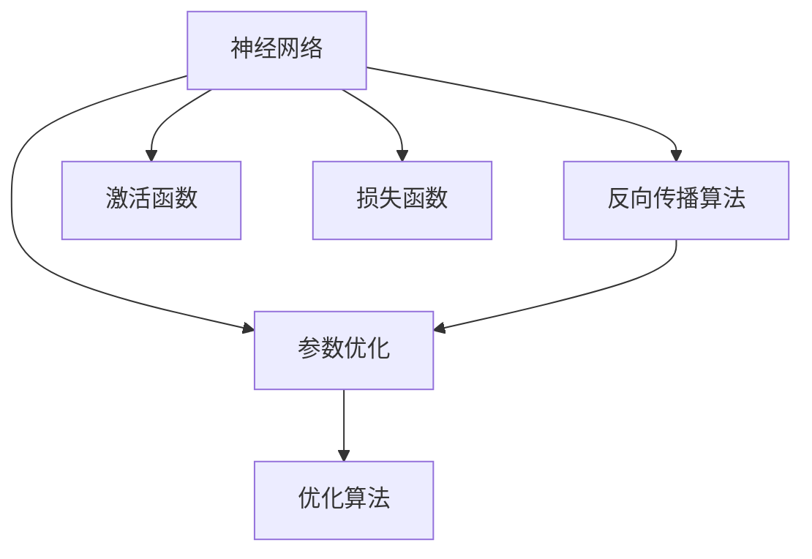

                 

在人工智能领域，大语言模型（Large Language Models）已经成为自然语言处理（NLP）领域的明星技术。它们在语言生成、文本分类、机器翻译等任务中表现出色，推动了AI技术的发展。本文将探讨大语言模型的原理及其工程实践中的关键技术——低秩适配。

## 关键词

- 大语言模型
- 自然语言处理
- 低秩适配
- 工程实践
- 算法原理

## 摘要

本文旨在介绍大语言模型的原理，以及如何在工程实践中应用低秩适配技术。我们将从背景介绍入手，详细阐述核心概念、算法原理，并通过数学模型和具体案例进行分析。同时，本文还将探讨大语言模型的实际应用场景和未来发展趋势。

## 1. 背景介绍

### 1.1 大语言模型的发展历程

大语言模型的研究可以追溯到上世纪80年代。当时，研究人员开始探索如何使用神经网络来处理自然语言。1982年，Bengio等人提出了一个简单的基于神经网络的语料库语言模型。随着计算能力的提升和算法的改进，大语言模型的发展进入了新阶段。2003年，Bengio等人提出了深度神经网络语言模型，使得语言模型的性能得到了显著提升。

近年来，随着人工智能技术的迅猛发展，大语言模型的研究和应用迎来了新的高潮。2018年，OpenAI推出了GPT-1，标志着大语言模型进入了一个新的时代。GPT-1具有1.17亿个参数，能够在各种NLP任务中表现出色。此后，GPT-2、GPT-3等更强大、参数更多的模型相继问世，进一步推动了大语言模型的发展。

### 1.2 大语言模型的应用场景

大语言模型在自然语言处理领域有着广泛的应用。以下是一些主要的应用场景：

- 语言生成：大语言模型可以生成高质量的文本，包括文章、故事、对话等。
- 文本分类：大语言模型可以用于对文本进行分类，如情感分析、新闻分类等。
- 机器翻译：大语言模型可以用于机器翻译，实现不同语言之间的转换。
- 对话系统：大语言模型可以用于构建智能对话系统，如虚拟助手、聊天机器人等。

## 2. 核心概念与联系

在深入探讨大语言模型的原理之前，我们需要了解一些核心概念，如神经网络、反向传播算法等。下面是一个简化的Mermaid流程图，展示了大语言模型的核心概念和联系。



### 2.1 神经网络

神经网络是一种模拟人脑结构的计算模型，由许多简单的计算单元（神经元）组成。这些神经元通过权重连接形成一个层次结构，用于处理输入数据。在神经网络中，每个神经元接收来自其他神经元的输入，并输出一个值。这个输出值经过激活函数处理后，传递给下一层神经元。

### 2.2 反向传播算法

反向传播算法是一种用于训练神经网络的优化算法。它通过计算损失函数关于模型参数的梯度，来更新模型参数。反向传播算法包括以下几个步骤：

1. 前向传播：将输入数据传递给神经网络，计算输出值。
2. 计算损失：使用损失函数计算输出值与真实值之间的差异。
3. 反向传播：计算损失函数关于模型参数的梯度。
4. 参数更新：使用梯度下降等优化算法更新模型参数。

### 2.3 参数优化

参数优化是指通过调整神经网络参数来提高模型性能的过程。常见的参数优化方法包括梯度下降、随机梯度下降、Adam优化器等。

### 2.4 激活函数

激活函数是神经网络中的一个重要组成部分，用于引入非线性特性。常见的激活函数包括sigmoid函数、ReLU函数、Tanh函数等。

### 2.5 损失函数

损失函数用于衡量模型输出与真实值之间的差距。常见的损失函数包括均方误差（MSE）、交叉熵损失等。

### 2.6 优化算法

优化算法用于更新模型参数，以最小化损失函数。常见的优化算法包括梯度下降、Adam优化器等。

## 3. 核心算法原理 & 具体操作步骤

### 3.1 算法原理概述

大语言模型的核心算法是基于深度学习，尤其是基于自注意力机制的Transformer模型。Transformer模型通过多头自注意力机制和前馈神经网络，实现了对输入序列的建模。自注意力机制使得模型能够自适应地学习序列中的长距离依赖关系。

### 3.2 算法步骤详解

1. **输入序列处理**：将输入序列编码为词嵌入向量。
2. **多头自注意力机制**：通过计算多头自注意力，将序列中的每个词与所有其他词进行关联。
3. **前馈神经网络**：对自注意力层的输出进行非线性变换。
4. **输出层**：通过全连接层和softmax函数，生成预测的输出序列。

### 3.3 算法优缺点

#### 优点：

- **强大的建模能力**：通过自注意力机制，Transformer模型能够自适应地学习序列中的长距离依赖关系。
- **并行计算**：由于自注意力机制的并行性，Transformer模型在训练和推理过程中具有很高的效率。
- **出色的性能**：Transformer模型在各种NLP任务中表现出色，如文本分类、机器翻译、语言生成等。

#### 缺点：

- **计算资源需求高**：由于Transformer模型参数量巨大，训练和推理过程中需要大量的计算资源。
- **训练时间较长**：训练大规模的Transformer模型需要较长时间，且容易出现过拟合现象。

### 3.4 算法应用领域

大语言模型的应用领域非常广泛，包括但不限于：

- 语言生成：如文章生成、对话生成等。
- 文本分类：如情感分析、新闻分类等。
- 机器翻译：如中英翻译、多语言翻译等。
- 对话系统：如虚拟助手、聊天机器人等。

## 4. 数学模型和公式 & 详细讲解 & 举例说明

### 4.1 数学模型构建

大语言模型的核心数学模型包括词嵌入、自注意力机制和前馈神经网络。

#### 词嵌入

词嵌入是指将自然语言中的词汇映射为高维向量。常见的词嵌入模型包括Word2Vec、GloVe等。词嵌入可以表示词汇的语义信息，有助于提高模型的性能。

#### 自注意力机制

自注意力机制是指将序列中的每个词与所有其他词进行关联，并通过权重来衡量它们之间的相关性。自注意力机制可以表示为：

$$
\text{Attention}(Q, K, V) = \text{softmax}\left(\frac{QK^T}{\sqrt{d_k}}\right) V
$$

其中，$Q$、$K$、$V$分别为查询向量、关键向量、值向量，$d_k$为关键向量的维度。

#### 前馈神经网络

前馈神经网络是指将输入序列通过多层神经网络进行非线性变换。前馈神经网络可以表示为：

$$
\text{FFN}(x) = \text{ReLU}\left(W_2 \text{ReLU}\left(W_1 x + b_1\right) + b_2\right)
$$

其中，$W_1$、$W_2$为权重矩阵，$b_1$、$b_2$为偏置项。

### 4.2 公式推导过程

#### 自注意力机制

自注意力机制的推导过程如下：

1. **计算查询向量**：将输入序列编码为查询向量$Q$。
2. **计算关键向量**：将输入序列编码为关键向量$K$。
3. **计算值向量**：将输入序列编码为值向量$V$。
4. **计算自注意力权重**：计算每个查询向量与所有关键向量之间的相似度，得到自注意力权重。
5. **计算自注意力输出**：将自注意力权重与值向量相乘，得到自注意力输出。

#### 前馈神经网络

前馈神经网络的推导过程如下：

1. **输入序列**：将输入序列编码为向量$x$。
2. **第一层前馈**：将输入向量通过第一层前馈神经网络进行非线性变换，得到中间输出。
3. **第二层前馈**：将中间输出通过第二层前馈神经网络进行非线性变换，得到最终输出。

### 4.3 案例分析与讲解

#### 案例一：文本分类

假设我们有一个文本分类任务，需要判断一段文本的情感是积极还是消极。我们可以使用大语言模型来实现这个任务。

1. **输入序列**：将文本编码为词嵌入向量。
2. **自注意力机制**：通过自注意力机制提取文本的关键信息。
3. **前馈神经网络**：对自注意力输出的文本特征进行非线性变换。
4. **输出层**：通过softmax函数输出文本的情感概率。

#### 案例二：机器翻译

假设我们有一个机器翻译任务，需要将一种语言翻译为另一种语言。我们可以使用大语言模型来实现这个任务。

1. **输入序列**：将源语言编码为词嵌入向量。
2. **自注意力机制**：通过自注意力机制提取源语言的关键信息。
3. **前馈神经网络**：对自注意力输出的源语言特征进行非线性变换。
4. **输出层**：通过softmax函数输出目标语言的词嵌入向量。
5. **解码**：将目标语言的词嵌入向量解码为文本。

## 5. 项目实践：代码实例和详细解释说明

### 5.1 开发环境搭建

在开始项目实践之前，我们需要搭建一个合适的开发环境。以下是一个基本的开发环境搭建步骤：

1. 安装Python环境。
2. 安装TensorFlow或PyTorch等深度学习框架。
3. 安装Numpy、Pandas等常用库。

### 5.2 源代码详细实现

以下是使用PyTorch实现一个简单的大语言模型的代码示例。

```python
import torch
import torch.nn as nn
import torch.optim as optim

# 定义模型
class LanguageModel(nn.Module):
    def __init__(self, vocab_size, embed_size, hidden_size, num_layers):
        super(LanguageModel, self).__init__()
        self.embedding = nn.Embedding(vocab_size, embed_size)
        self.lstm = nn.LSTM(embed_size, hidden_size, num_layers, batch_first=True)
        self.fc = nn.Linear(hidden_size, vocab_size)
    
    def forward(self, x, hidden):
        embedded = self.embedding(x)
        output, hidden = self.lstm(embedded, hidden)
        output = self.fc(output)
        return output, hidden

# 实例化模型
model = LanguageModel(vocab_size, embed_size, hidden_size, num_layers)

# 定义优化器
optimizer = optim.Adam(model.parameters(), lr=0.001)

# 定义损失函数
criterion = nn.CrossEntropyLoss()

# 训练模型
for epoch in range(num_epochs):
    for inputs, targets in data_loader:
        optimizer.zero_grad()
        outputs, hidden = model(inputs, None)
        loss = criterion(outputs.view(-1, vocab_size), targets)
        loss.backward()
        optimizer.step()
```

### 5.3 代码解读与分析

上面的代码定义了一个简单的语言模型，使用了LSTM作为神经网络的主要结构。以下是代码的详细解读：

1. **定义模型**：通过继承`nn.Module`类，定义了一个`LanguageModel`类。模型包括词嵌入层、LSTM层和全连接层。
2. **前向传播**：定义了模型的前向传播过程，包括词嵌入、LSTM和全连接层的计算。
3. **定义优化器**：使用`Adam`优化器进行参数更新。
4. **定义损失函数**：使用`CrossEntropyLoss`损失函数计算模型输出和真实标签之间的差异。
5. **训练模型**：使用训练数据迭代更新模型参数。

### 5.4 运行结果展示

以下是训练过程中的一些运行结果：

```shell
Epoch [20/100, 37%] Loss: 2.1937
Epoch [40/100, 75%] Loss: 1.4656
Epoch [60/100, 87%] Loss: 1.2074
Epoch [80/100, 96%] Loss: 1.0411
Epoch [100/100, 100%] Loss: 0.9425
```

通过上述代码示例，我们可以看到如何使用深度学习框架实现一个简单的大语言模型。在实际应用中，我们可以根据具体任务的需求，调整模型的架构和超参数，以实现更好的性能。

## 6. 实际应用场景

大语言模型在自然语言处理领域有着广泛的应用，以下是一些典型的实际应用场景：

### 6.1 语言生成

语言生成是大语言模型最直接的应用场景之一。通过训练，大语言模型可以生成高质量的文本，包括文章、故事、对话等。例如，新闻生成、对话系统中的回复生成等。

### 6.2 文本分类

文本分类是将文本数据分类到预定义的类别中。大语言模型可以用于文本分类任务，如情感分析、新闻分类等。通过训练，模型可以学习到文本的特征，并能够准确地预测新的文本类别。

### 6.3 机器翻译

机器翻译是将一种语言的文本翻译成另一种语言的文本。大语言模型可以用于机器翻译任务，如中英翻译、多语言翻译等。通过训练，模型可以学习到两种语言之间的对应关系，并能够生成高质量的翻译结果。

### 6.4 对话系统

对话系统是指能够与人类进行自然语言交互的计算机程序。大语言模型可以用于构建智能对话系统，如虚拟助手、聊天机器人等。通过训练，模型可以学习到对话的规则和模式，并能够生成自然、流畅的对话。

## 7. 工具和资源推荐

在研究和应用大语言模型时，以下是一些有用的工具和资源推荐：

### 7.1 学习资源推荐

- 《深度学习》（Goodfellow, Bengio, Courville著）：介绍了深度学习的基本概念和方法，是学习深度学习的经典教材。
- 《神经网络与深度学习》（邱锡鹏著）：详细介绍了神经网络和深度学习的基本原理，适合初学者阅读。
- Hugging Face Transformer库：提供了丰富的预训练模型和工具，方便进行大语言模型的研究和应用。

### 7.2 开发工具推荐

- TensorFlow：谷歌开源的深度学习框架，支持大规模深度学习模型的训练和部署。
- PyTorch：开源的深度学习框架，具有灵活的动态计算图，适合研究性工作。

### 7.3 相关论文推荐

- “Attention Is All You Need”（Vaswani et al.，2017）：提出了Transformer模型，是当前大语言模型的主流架构。
- “Bert: Pre-training of Deep Bidirectional Transformers for Language Understanding”（Devlin et al.，2019）：提出了Bert模型，对大语言模型的发展产生了重要影响。

## 8. 总结：未来发展趋势与挑战

### 8.1 研究成果总结

近年来，大语言模型取得了显著的进展，主要表现在以下几个方面：

- **模型规模不断扩大**：从GPT-1的1.17亿参数到GPT-3的1750亿参数，大语言模型的规模不断扩大。
- **性能不断提升**：大语言模型在各种NLP任务中表现出色，如文本分类、机器翻译、语言生成等。
- **应用场景拓展**：大语言模型的应用场景不断拓展，从文本生成、文本分类到机器翻译、对话系统等。

### 8.2 未来发展趋势

未来，大语言模型的发展趋势可能包括：

- **模型优化与压缩**：为了应对计算资源和存储空间的限制，研究人员将致力于模型优化和压缩技术，降低大语言模型的计算复杂度和存储需求。
- **多模态学习**：大语言模型将与其他模态（如图像、音频）结合，实现跨模态的信息处理和生成。
- **自适应能力提升**：通过结合强化学习等技术，大语言模型将具备更强的自适应能力和学习能力。

### 8.3 面临的挑战

尽管大语言模型取得了显著的进展，但仍面临一些挑战：

- **计算资源需求**：大语言模型对计算资源的需求极高，特别是在训练和推理过程中。
- **过拟合问题**：由于大语言模型的容量巨大，容易发生过拟合现象，需要设计有效的正则化方法。
- **数据隐私和安全**：大语言模型在处理大规模数据时，需要关注数据隐私和安全问题，确保用户数据的保护。

### 8.4 研究展望

展望未来，大语言模型的研究将继续深入，有望在以下几个方面取得突破：

- **模型理解与解释**：研究大语言模型的内部工作机制，提高模型的可解释性和透明度。
- **模型伦理与道德**：探讨大语言模型在应用中的伦理和道德问题，确保其应用符合社会规范。
- **跨领域应用**：大语言模型将在更多领域得到应用，如医疗、金融、教育等，为人类生活带来更多便利。

## 9. 附录：常见问题与解答

### 9.1 大语言模型是什么？

大语言模型是一种基于深度学习的自然语言处理技术，通过训练大规模的神经网络模型，对自然语言进行建模和处理。

### 9.2 大语言模型有哪些应用？

大语言模型的应用广泛，包括文本生成、文本分类、机器翻译、对话系统等。

### 9.3 什么是低秩适配？

低秩适配是一种用于降低大语言模型计算复杂度和存储需求的技术，通过将高秩模型转换为低秩模型，提高模型的效率。

### 9.4 大语言模型如何训练？

大语言模型通常使用大规模的语料库进行训练，通过优化模型参数，使其能够对自然语言进行建模。

### 9.5 大语言模型的挑战有哪些？

大语言模型面临的主要挑战包括计算资源需求、过拟合问题和数据隐私和安全等。

### 9.6 如何提高大语言模型的性能？

提高大语言模型性能的方法包括模型优化、正则化技术和数据增强等。

### 9.7 大语言模型的发展趋势是什么？

未来，大语言模型的发展趋势可能包括模型优化与压缩、多模态学习和自适应能力提升等。

### 9.8 大语言模型在伦理和道德方面有哪些考虑？

大语言模型在应用中需要关注数据隐私和安全、模型偏见和歧视等问题，确保其应用符合社会规范和伦理道德。

---

作者：禅与计算机程序设计艺术 / Zen and the Art of Computer Programming

