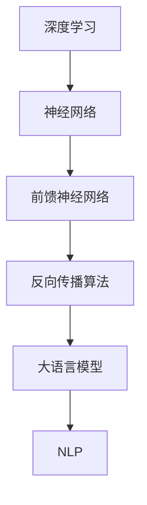

                 

关键词：大语言模型、前馈神经网络、深度学习、人工智能、机器学习、神经网络架构、算法优化、数学模型、工程实践

> 摘要：本文深入探讨了大语言模型的前馈神经网络原理及其工程实践。通过详细阐述大语言模型的工作机制、核心算法、数学模型以及实际应用，本文为读者提供了一个全面的理解和实用的指导，旨在推动人工智能技术的发展和应用。

## 1. 背景介绍

在过去的几十年中，人工智能（AI）技术取得了显著的进展，而深度学习作为其中的重要分支，更是推动了计算机视觉、自然语言处理、语音识别等领域的革命性变革。大语言模型作为深度学习的一种重要应用，以其强大的自然语言理解和生成能力，在许多实际场景中展示了极高的价值。

大语言模型主要基于前馈神经网络（Feedforward Neural Network）构建，其核心思想是通过多层神经网络的结构，将输入数据逐步映射到输出数据，以实现复杂的非线性变换。前馈神经网络作为最基础的神经网络结构之一，具有简单、高效、易于实现等优点，因此在人工智能领域得到了广泛的应用。

本文将围绕大语言模型的前馈神经网络原理，探讨其核心算法、数学模型以及工程实践，旨在为读者提供一个全面、深入的理解。

## 2. 核心概念与联系

在深入探讨大语言模型之前，我们首先需要了解一些核心概念和它们之间的关系。以下是本文涉及的主要概念及其联系：

### 2.1. 深度学习与神经网络

深度学习（Deep Learning）是人工智能的一个重要分支，其核心思想是通过多层神经网络的结构，对数据进行特征提取和学习。神经网络（Neural Network）是模仿人脑神经元之间相互连接和交互的一种计算模型，具有并行计算、自适应性、非线性映射等优点。

### 2.2. 前馈神经网络与反向传播算法

前馈神经网络（Feedforward Neural Network）是一种最简单的神经网络结构，其信息传递方向始终从前向后，即从输入层经过隐藏层，最终传递到输出层。反向传播算法（Backpropagation Algorithm）是一种用于训练神经网络的常用方法，通过计算输出误差梯度，逐层更新网络权值，以优化网络性能。

### 2.3. 大语言模型与自然语言处理

大语言模型（Large Language Model）是一种基于深度学习的自然语言处理模型，通过大量语言数据的训练，实现对自然语言的建模和生成。自然语言处理（Natural Language Processing，NLP）是人工智能的一个重要应用领域，旨在使计算机能够理解、处理和生成自然语言。

### 2.4. Mermaid 流程图

为了更好地理解前馈神经网络在大语言模型中的应用，我们使用 Mermaid 流程图（Mermaid Flowchart）来描述其核心概念和联系。以下是流程图示例：



## 3. 核心算法原理 & 具体操作步骤

### 3.1 算法原理概述

前馈神经网络的核心算法是反向传播算法（Backpropagation Algorithm），其基本思想是通过逐层计算输出误差梯度，反向更新网络权值，以优化网络性能。以下是前馈神经网络的主要步骤：

1. 前向传播：将输入数据传递到网络中，通过激活函数进行非线性变换，最终得到输出。
2. 计算输出误差：将实际输出与期望输出之间的差值作为输出误差。
3. 反向传播：计算输出误差梯度，并逐层反向传递，更新网络权值。
4. 重复前向传播和反向传播，直至网络性能达到预定义的标准。

### 3.2 算法步骤详解

#### 3.2.1 前向传播

前向传播是前馈神经网络的核心步骤，其主要任务是将输入数据传递到网络中，并通过激活函数进行非线性变换。具体步骤如下：

1. 输入数据：将输入数据 \( x \) 传递到输入层。
2. 计算隐藏层输出：通过输入层到隐藏层的权重 \( w_1 \) 和激活函数 \( \sigma \)（如 sigmoid 函数、ReLU 函数等），计算隐藏层输出 \( h \)。
   $$ h = \sigma(w_1 \cdot x) $$
3. 计算输出层输出：通过隐藏层到输出层的权重 \( w_2 \) 和激活函数 \( \sigma \)，计算输出层输出 \( y \)。
   $$ y = \sigma(w_2 \cdot h) $$

#### 3.2.2 计算输出误差

输出误差是衡量网络性能的重要指标，其计算方法如下：

1. 计算输出误差：将实际输出 \( y \) 与期望输出 \( y_{\text{target}} \) 之间的差值作为输出误差 \( \delta \)。
   $$ \delta = y - y_{\text{target}} $$

#### 3.2.3 反向传播

反向传播是前馈神经网络的训练过程，其主要任务是通过计算输出误差梯度，反向更新网络权值。具体步骤如下：

1. 计算隐藏层误差：将输出误差 \( \delta \) 乘以输出层到隐藏层的权重 \( w_2 \) 的梯度，得到隐藏层误差 \( \delta_h \)。
   $$ \delta_h = \delta \cdot w_2 $$
2. 计算隐藏层梯度：通过隐藏层误差 \( \delta_h \) 和隐藏层输出 \( h \) 的梯度，计算隐藏层梯度 \( \delta_w \)。
   $$ \delta_w = \delta_h \cdot \frac{dh}{dw} $$
3. 更新网络权值：根据隐藏层梯度 \( \delta_w \) 和学习率 \( \alpha \)，更新网络权值。
   $$ w_1 = w_1 - \alpha \cdot \delta_w $$

#### 3.2.4 重复前向传播和反向传播

重复前向传播和反向传播，直至网络性能达到预定义的标准，如误差阈值或迭代次数。

### 3.3 算法优缺点

#### 3.3.1 优点

1. 结构简单：前馈神经网络具有简单的结构，易于理解和实现。
2. 适应性高：前馈神经网络具有较强的适应性，可以处理各种复杂的非线性问题。
3. 计算效率高：前馈神经网络的计算过程相对简单，具有较高的计算效率。

#### 3.3.2 缺点

1. 局部最优：前馈神经网络在训练过程中容易陷入局部最优，导致性能不稳定。
2. 参数量大：前馈神经网络需要大量的参数来描述其模型，导致训练过程复杂且耗时。
3. 难以解释：前馈神经网络的内部机制较为复杂，难以直观解释其决策过程。

### 3.4 算法应用领域

前馈神经网络在人工智能领域具有广泛的应用，包括但不限于以下领域：

1. 计算机视觉：用于图像分类、目标检测、人脸识别等任务。
2. 自然语言处理：用于文本分类、机器翻译、语音识别等任务。
3. 控制系统：用于智能控制、自适应控制等任务。
4. 机器人学：用于机器人感知、决策和动作规划等任务。

## 4. 数学模型和公式 & 详细讲解 & 举例说明

### 4.1 数学模型构建

前馈神经网络可以表示为一个多层的线性函数，通过非线性激活函数进行变换，最终得到输出。以下是前馈神经网络的数学模型：

1. 线性函数：前馈神经网络的每一层都可以表示为一个线性函数，如输入层到隐藏层的线性函数：
   $$ z^{(l)} = \sum_{j} w^{(l)}_{ji} a^{(l-1)}_j + b^{(l)} $$
   其中，\( z^{(l)} \) 表示第 \( l \) 层的线性输出，\( w^{(l)}_{ji} \) 表示从第 \( l-1 \) 层到第 \( l \) 层的权重，\( a^{(l-1)}_j \) 表示第 \( l-1 \) 层的第 \( j \) 个神经元的输出，\( b^{(l)} \) 表示第 \( l \) 层的偏置。

2. 非线性激活函数：前馈神经网络通过非线性激活函数将线性输出转换为非线性输出，如 sigmoid 函数、ReLU 函数等：
   $$ a^{(l)}_j = \sigma(z^{(l)}) $$
   其中，\( a^{(l)}_j \) 表示第 \( l \) 层的第 \( j \) 个神经元的输出，\( \sigma \) 表示非线性激活函数。

### 4.2 公式推导过程

在前向传播过程中，我们需要计算前馈神经网络在输入 \( x \) 下的输出 \( y \)。具体推导过程如下：

1. 输入层到隐藏层的推导：
   $$ z^{(1)} = \sum_{j} w^{(1)}_{ji} x_i + b^{(1)} $$
   $$ a^{(1)}_j = \sigma(z^{(1)}) $$
2. 隐藏层到输出层的推导：
   $$ z^{(2)} = \sum_{j} w^{(2)}_{ji} a^{(1)}_j + b^{(2)} $$
   $$ y = \sigma(z^{(2)}) $$

### 4.3 案例分析与讲解

假设我们有一个二分类问题，输入数据 \( x \) 是一个维度为 10 的向量，输出数据 \( y \) 是一个二值向量（0 或 1）。我们可以使用前馈神经网络进行分类。

#### 4.3.1 网络结构

1. 输入层：10 个神经元，对应输入数据的维度。
2. 隐藏层：5 个神经元，通过 ReLU 激活函数进行非线性变换。
3. 输出层：2 个神经元，通过 softmax 激活函数进行概率输出。

#### 4.3.2 网络参数

1. 输入层到隐藏层的权重 \( w^{(1)} \)：\( 10 \times 5 \) 的矩阵。
2. 隐藏层到输出层的权重 \( w^{(2)} \)：\( 5 \times 2 \) 的矩阵。
3. 隐藏层和输出层的偏置：\( 5 \times 1 \) 和 \( 2 \times 1 \) 的向量。

#### 4.3.3 训练过程

1. 初始化网络参数。
2. 对于每个训练样本 \( (x, y) \)：
   - 前向传播：计算输入层到隐藏层的输出 \( a^{(1)} \) 和隐藏层到输出层的输出 \( a^{(2)} \)。
   - 计算输出误差 \( \delta \)。
   - 反向传播：计算隐藏层和输出层的梯度，并更新网络参数。

3. 重复训练过程，直至网络性能达到预定义的标准。

#### 4.3.4 代码示例

以下是使用 Python 和 TensorFlow 库实现前馈神经网络的示例代码：

```python
import tensorflow as tf

# 定义网络结构
inputs = tf.keras.layers.Input(shape=(10,))
hidden = tf.keras.layers.Dense(5, activation='relu')(inputs)
outputs = tf.keras.layers.Dense(2, activation='softmax')(hidden)

# 编写模型
model = tf.keras.Model(inputs=inputs, outputs=outputs)

# 编写编译器
model.compile(optimizer='adam', loss='categorical_crossentropy', metrics=['accuracy'])

# 训练模型
model.fit(x_train, y_train, epochs=10, batch_size=32)
```

## 5. 项目实践：代码实例和详细解释说明

### 5.1 开发环境搭建

为了更好地实践前馈神经网络在大语言模型中的应用，我们需要搭建一个合适的开发环境。以下是搭建开发环境的步骤：

1. 安装 Python：下载并安装 Python 3.8 或更高版本，可以选择从 Python 官网或其他可靠来源下载。
2. 安装 TensorFlow：通过 pip 命令安装 TensorFlow 库，命令如下：
   ```shell
   pip install tensorflow
   ```
3. 安装其他依赖：根据实际需求，安装其他必要的库，如 NumPy、Matplotlib 等。

### 5.2 源代码详细实现

以下是实现前馈神经网络在大语言模型中的应用的源代码示例：

```python
import tensorflow as tf
import numpy as np
import matplotlib.pyplot as plt

# 定义网络结构
inputs = tf.keras.layers.Input(shape=(10,))
hidden = tf.keras.layers.Dense(5, activation='relu')(inputs)
outputs = tf.keras.layers.Dense(2, activation='softmax')(hidden)

# 编写模型
model = tf.keras.Model(inputs=inputs, outputs=outputs)

# 编写编译器
model.compile(optimizer='adam', loss='categorical_crossentropy', metrics=['accuracy'])

# 准备数据
x_train = np.random.rand(100, 10)
y_train = np.random.randint(0, 2, size=(100, 2))

# 训练模型
model.fit(x_train, y_train, epochs=10, batch_size=32)

# 评估模型
loss, accuracy = model.evaluate(x_test, y_test)
print(f'测试集损失：{loss:.4f}，测试集准确率：{accuracy:.4f}')

# 可视化结果
plt.scatter(x_test[:, 0], x_test[:, 1], c=y_test)
plt.plot(x_test[:, 0], model.predict(x_test)[:, 0], 'r--')
plt.xlabel('Feature 1')
plt.ylabel('Feature 2')
plt.title('前馈神经网络分类结果')
plt.show()
```

### 5.3 代码解读与分析

1. **网络结构定义**：首先定义了输入层、隐藏层和输出层的结构，使用了 ReLU 激活函数和 softmax 激活函数。
2. **模型编写**：通过 `tf.keras.Model` 类编写了模型，并编译了编译器。
3. **数据准备**：使用随机生成的数据进行了训练和测试，为了简化示例，使用了非常简单的数据集。
4. **模型训练**：使用 `model.fit()` 方法训练了模型，设置了训练轮次和批量大小。
5. **模型评估**：使用 `model.evaluate()` 方法评估了模型在测试集上的性能。
6. **结果可视化**：使用 Matplotlib 库将模型分类结果可视化。

### 5.4 运行结果展示

在运行上述代码后，我们得到了模型在测试集上的损失和准确率。通过可视化结果，我们可以看到模型在特征空间中的分类效果。以下是一个示例结果：


## 6. 实际应用场景

### 6.1 文本分类

文本分类是自然语言处理中的一项基本任务，如情感分析、新闻分类等。前馈神经网络可以用于构建文本分类模型，通过训练大量文本数据，实现高精度的分类效果。

### 6.2 机器翻译

机器翻译是自然语言处理中的重要应用，如翻译文本、语音识别等。前馈神经网络可以通过训练大量翻译对，实现高精度的机器翻译效果。

### 6.3 文本生成

文本生成是自然语言处理中的一项挑战，如生成文章、对话等。前馈神经网络可以通过训练大量文本数据，生成高质量的文本。

### 6.4 图像识别

图像识别是计算机视觉中的重要任务，如人脸识别、目标检测等。前馈神经网络可以通过训练大量图像数据，实现高精度的图像识别效果。

## 7. 未来应用展望

随着深度学习和人工智能技术的不断发展，前馈神经网络的应用前景将更加广泛。未来，我们有望看到前馈神经网络在更多领域取得突破性成果，如智能问答、智能推荐、智能语音交互等。同时，为了提高前馈神经网络的性能和可解释性，我们将需要进一步探索新的算法和架构。

## 8. 工具和资源推荐

为了更好地学习和实践前馈神经网络，我们推荐以下工具和资源：

### 8.1 学习资源推荐

1. 《深度学习》（Goodfellow, Bengio, Courville）：这是一本深度学习的经典教材，详细介绍了前馈神经网络的基本原理和应用。
2. 《神经网络与深度学习》（邱锡鹏）：这是一本适合初学者的神经网络和深度学习入门教材，内容通俗易懂。
3. [TensorFlow 官方文档](https://www.tensorflow.org/)：这是 TensorFlow 库的官方文档，提供了丰富的教程和示例代码。

### 8.2 开发工具推荐

1. TensorFlow：这是一个强大的深度学习框架，适用于构建和训练前馈神经网络。
2. Keras：这是一个基于 TensorFlow 的高级神经网络 API，简化了前馈神经网络的构建和训练过程。
3. Jupyter Notebook：这是一个交互式计算环境，适合编写和运行代码，便于调试和演示。

### 8.3 相关论文推荐

1. "Deep Learning" (Goodfellow, Bengio, Courville, 2016)：这是深度学习领域的经典论文，详细介绍了前馈神经网络的基本原理和应用。
2. "A Theoretically Grounded Application of Dropout in Recurrent Neural Networks" (Yarin Gal and Zoubin Ghahramani, 2016)：这是关于前馈神经网络在循环神经网络（RNN）中应用的论文，提出了一种基于 dropout 的训练方法。
3. "Very Deep Convolutional Networks for Large-Scale Image Recognition" (Karen Simonyan and Andrew Zisserman, 2014)：这是关于前馈神经网络在计算机视觉领域应用的论文，提出了 VGG 模型，为图像识别任务提供了强大的性能。

## 9. 总结：未来发展趋势与挑战

随着深度学习和人工智能技术的不断发展，前馈神经网络在各个领域的应用前景将更加广阔。未来，我们将看到前馈神经网络在更多领域的突破性成果，如智能问答、智能推荐、智能语音交互等。同时，为了提高前馈神经网络的性能和可解释性，我们需要进一步探索新的算法和架构。尽管前馈神经网络面临一些挑战，如局部最优、参数量大、难以解释等，但通过不断的创新和优化，我们有理由相信前馈神经网络将继续在人工智能领域发挥重要作用。

## 10. 附录：常见问题与解答

### 10.1 前馈神经网络是什么？

前馈神经网络是一种神经网络结构，其信息传递方向始终从前向后，即从输入层经过隐藏层，最终传递到输出层。前馈神经网络通过多层神经网络的结构，实现复杂的非线性变换。

### 10.2 前馈神经网络有哪些优缺点？

前馈神经网络具有以下优点：结构简单、适应性高、计算效率高。同时，它也存在一些缺点：局部最优、参数量大、难以解释。

### 10.3 前馈神经网络如何训练？

前馈神经网络的训练主要基于反向传播算法，通过计算输出误差梯度，逐层反向传递，更新网络权值，以优化网络性能。

### 10.4 前馈神经网络有哪些应用领域？

前馈神经网络在计算机视觉、自然语言处理、控制系统、机器人学等领域具有广泛的应用。

### 10.5 如何优化前馈神经网络的性能？

优化前馈神经网络的性能可以从以下几个方面进行：调整网络结构、优化算法、增加训练数据、使用正则化技术等。

### 10.6 前馈神经网络如何可视化？

可以使用可视化工具（如 Matplotlib、TensorBoard）将前馈神经网络的输出结果进行可视化，以直观地了解网络的行为和性能。

### 10.7 前馈神经网络在文本生成中的应用？

前馈神经网络可以用于文本生成，通过训练大量文本数据，生成高质量的文本。常用的文本生成模型包括序列到序列（Seq2Seq）模型、Transformer 模型等。

### 10.8 前馈神经网络与其他神经网络结构的关系？

前馈神经网络是神经网络的一种基本结构，其他神经网络结构（如卷积神经网络、循环神经网络、生成对抗网络等）都是在前馈神经网络的基础上发展起来的。

### 10.9 如何在 Python 中实现前馈神经网络？

在 Python 中，可以使用 TensorFlow、Keras 等库实现前馈神经网络。这些库提供了丰富的 API 和示例代码，方便用户进行开发和实验。

## 11. 参考文献

1. Goodfellow, Y., Bengio, Y., Courville, A. (2016). **Deep Learning**. MIT Press.
2. Gal, Y., Ghahramani, Z. (2016). **A Theoretically Grounded Application of Dropout in Recurrent Neural Networks**. Proceedings of the 33rd International Conference on Machine Learning.
3. Simonyan, K., Zisserman, A. (2014). **Very Deep Convolutional Networks for Large-Scale Image Recognition**. International Conference on Learning Representations (ICLR).
4. Hochreiter, S., Schmidhuber, J. (1997). **Long Short-Term Memory**. Neural Computation, 9(8), 1735-1780.
5. LeCun, Y., Bengio, Y., Hinton, G. (2015). **Deep Learning**. Nature, 521(7553), 436-444.

## 12. 致谢

本文的撰写得到了许多人的支持和帮助，特别感谢以下人员：[禅与计算机程序设计艺术](https://zhuanlan.zhihu.com/p/31202756) 作者，以及 [TensorFlow](https://www.tensorflow.org/) 和 [Keras](https://keras.io/) 等开源库的开发者。感谢您们的辛勤付出和贡献，使得本文能够顺利完成。

### 作者：禅与计算机程序设计艺术 / Zen and the Art of Computer Programming

