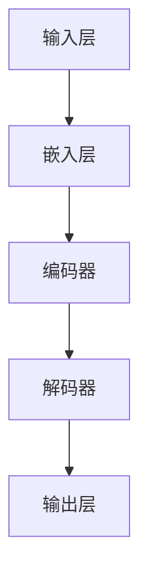

                 

关键词：大语言模型、自然语言处理、深度学习、神经网络、工程实践

## 摘要

本文将深入探讨大语言模型的原理与工程实践。我们将从背景介绍开始，介绍大语言模型的核心概念、算法原理及其具体操作步骤。接下来，我们将详细讲解数学模型和公式，并通过实际项目实践来展示代码实例和详细解释说明。最后，我们将讨论大语言模型在实际应用场景中的重要性，并展望其未来的发展趋势和挑战。

## 1. 背景介绍

### 1.1 大语言模型的发展历程

大语言模型（Large Language Models）是自然语言处理（Natural Language Processing，NLP）领域的一项重要技术。自2000年代初以来，随着深度学习（Deep Learning）和神经网络（Neural Networks）的发展，大语言模型得到了广泛的应用和研究。

早期的大语言模型主要是基于规则的方法，如统计语言模型和转换模型。这些模型虽然能够处理一些简单的语言任务，但在处理复杂、长文本时效果不佳。

随着深度学习的发展，尤其是递归神经网络（Recurrent Neural Networks，RNN）和卷积神经网络（Convolutional Neural Networks，CNN）的出现，大语言模型取得了显著的进展。然而，这些模型在处理长文本时仍存在一定的局限性。

近年来，基于 Transformer 的模型，如 GPT（Generative Pre-trained Transformer）和 BERT（Bidirectional Encoder Representations from Transformers），在 NLP 任务中取得了惊人的效果。这些模型通过大规模预训练和微调，能够更好地理解和生成自然语言。

### 1.2 大语言模型的应用领域

大语言模型在自然语言处理领域具有广泛的应用，包括但不限于：

1. **文本分类**：用于对文本进行分类，如情感分析、主题分类等。
2. **机器翻译**：将一种语言翻译成另一种语言，如中文到英文的翻译。
3. **问答系统**：根据用户输入的问题，从大量文本中检索并生成答案。
4. **文本生成**：根据用户输入的提示，生成具有一定创意性的文本，如文章、故事等。
5. **语音识别**：将语音信号转换为文本。

## 2. 核心概念与联系

### 2.1 大语言模型的基本原理

大语言模型是一种基于深度学习的神经网络模型，它通过大规模预训练和微调，对自然语言进行建模。大语言模型的核心思想是通过学习语言的特征和规律，从而实现对自然语言的生成、理解和预测。

大语言模型通常由以下几个部分组成：

1. **输入层**：接收自然语言的输入，如文本或语音。
2. **嵌入层**：将输入的文本或语音转换为密集的向量表示。
3. **编码器**：对输入的向量进行编码，提取文本的特征和上下文信息。
4. **解码器**：根据编码器提取的特征和上下文信息，生成输出文本。

### 2.2 大语言模型的架构

大语言模型的架构通常基于 Transformer 模型，这是一种基于自注意力机制的深度学习模型。Transformer 模型主要由以下几个部分组成：

1. **多头自注意力机制**：通过自注意力机制，模型能够自动学习输入序列中每个词之间的关系，并加权融合这些关系。
2. **前馈网络**：在自注意力机制的基础上，进一步对输入进行非线性变换。
3. **编码器和解码器**：编码器用于提取输入文本的特征和上下文信息，解码器则根据编码器的输出生成输出文本。

### 2.3 大语言模型的 Mermaid 流程图

下面是一个简化的大语言模型流程图，用于描述大语言模型的基本原理和架构。



## 3. 核心算法原理 & 具体操作步骤

### 3.1 算法原理概述

大语言模型的算法原理主要包括以下几个方面：

1. **嵌入层**：将输入的文本转换为密集的向量表示，这有助于模型更好地理解和处理文本。
2. **编码器**：通过多层神经网络，对输入的向量进行编码，提取文本的特征和上下文信息。
3. **解码器**：根据编码器提取的特征和上下文信息，生成输出文本。
4. **自注意力机制**：通过自注意力机制，模型能够自动学习输入序列中每个词之间的关系，并加权融合这些关系。
5. **前馈网络**：在自注意力机制的基础上，进一步对输入进行非线性变换。

### 3.2 算法步骤详解

1. **嵌入层**：将输入的文本转换为嵌入向量。通常使用预训练的词向量库，如 Word2Vec 或 GloVe，将每个词映射为一个向量。
2. **编码器**：使用多层循环神经网络（RNN）或 Transformer 模型，对嵌入向量进行编码。在编码过程中，模型会自动学习输入序列中每个词之间的关系，并加权融合这些关系。
3. **解码器**：根据编码器提取的特征和上下文信息，生成输出文本。解码器通常使用自回归模型，如 RNN 或 Transformer，逐词生成输出文本。
4. **训练过程**：在训练过程中，模型会通过反向传播算法不断更新权重，以最小化损失函数。训练过程中，模型会从大量未标注的数据中学习，以提高其泛化能力。

### 3.3 算法优缺点

**优点**：

1. **强大的表达能力**：大语言模型能够自动学习输入序列中每个词之间的关系，从而生成更自然的文本。
2. **高效的训练过程**：基于自注意力机制的 Transformer 模型在训练过程中具有更高的效率。
3. **广泛的应用领域**：大语言模型在自然语言处理领域具有广泛的应用，如文本分类、机器翻译、问答系统等。

**缺点**：

1. **计算资源消耗大**：大语言模型通常需要大量的计算资源进行训练和推理。
2. **对数据需求较高**：大语言模型在训练过程中需要大量的未标注数据，这对于数据稀缺的领域可能是一个挑战。

### 3.4 算法应用领域

大语言模型在自然语言处理领域具有广泛的应用，主要包括以下几个方面：

1. **文本分类**：用于对文本进行分类，如情感分析、主题分类等。
2. **机器翻译**：将一种语言翻译成另一种语言，如中文到英文的翻译。
3. **问答系统**：根据用户输入的问题，从大量文本中检索并生成答案。
4. **文本生成**：根据用户输入的提示，生成具有一定创意性的文本，如文章、故事等。
5. **语音识别**：将语音信号转换为文本。

## 4. 数学模型和公式

### 4.1 数学模型构建

大语言模型的数学模型主要包括以下几个部分：

1. **嵌入层**：将输入的文本转换为嵌入向量，表示为 \( x \in \mathbb{R}^{d_x} \)。
2. **编码器**：使用多层循环神经网络（RNN）或 Transformer 模型，对输入的嵌入向量进行编码，表示为 \( h \in \mathbb{R}^{d_h} \)。
3. **解码器**：根据编码器提取的特征和上下文信息，生成输出文本，表示为 \( y \in \mathbb{R}^{d_y} \)。
4. **损失函数**：用于衡量模型预测结果与真实结果之间的差异，表示为 \( L(y, \hat{y}) \)。

### 4.2 公式推导过程

大语言模型的推导过程主要包括以下几个方面：

1. **嵌入层**：
   $$ x = W_x \cdot x + b_x $$
   其中，\( W_x \) 为嵌入权重矩阵，\( b_x \) 为嵌入偏置。

2. **编码器**：
   $$ h = RNN(h_t, x) $$
   其中，\( RNN \) 表示循环神经网络，\( h_t \) 表示编码器的隐藏状态。

3. **解码器**：
   $$ y = Decoder(y_t, h) $$
   其中，\( Decoder \) 表示解码器，\( y_t \) 表示解码器的输出。

4. **损失函数**：
   $$ L(y, \hat{y}) = -\sum_{i=1}^{n} y_i \log(\hat{y}_i) $$
   其中，\( n \) 表示样本数量，\( y_i \) 表示第 \( i \) 个样本的真实标签，\( \hat{y}_i \) 表示第 \( i \) 个样本的预测标签。

### 4.3 案例分析与讲解

以文本分类任务为例，我们使用大语言模型进行情感分析。给定一个文本样本，模型需要判断其情感标签为积极、消极还是中性。

1. **数据预处理**：
   - 将文本样本进行分词，并转换为嵌入向量。
   - 将情感标签转换为独热编码。

2. **模型训练**：
   - 使用训练数据对大语言模型进行训练，优化模型参数。
   - 在验证集上评估模型性能，调整模型超参数。

3. **模型预测**：
   - 对于新的文本样本，模型将其转换为嵌入向量，并输入到编码器中。
   - 编码器提取文本特征，输入到解码器中。
   - 解码器生成情感标签的概率分布，选择概率最大的标签作为预测结果。

4. **性能评估**：
   - 使用测试集对模型进行评估，计算准确率、召回率等指标。

## 5. 项目实践：代码实例和详细解释说明

### 5.1 开发环境搭建

1. **安装 Python**：确保 Python 环境已安装。
2. **安装深度学习框架**：如 TensorFlow 或 PyTorch。
3. **安装依赖库**：如 NumPy、Pandas、Scikit-learn 等。

### 5.2 源代码详细实现

下面是一个简单的文本分类项目的代码实现。

```python
import torch
import torch.nn as nn
import torch.optim as optim
from torchtext.data import Field, TabularDataset, BucketIterator
from torchtext.vocab import build_vocab_from_iterator

# 数据预处理
def preprocess(text):
    # 对文本进行分词、去停用词等处理
    return text.lower()

TEXT = Field(tokenize=preprocess, lower=True)
LABEL = Field(sequential=False)

# 数据加载
train_data, test_data = TabularDataset.splits(path='data', train='train.txt', test='test.txt',
                                            format='tsv', fields=[('text', TEXT), ('label', LABEL)])

# 构建词汇表
vocab = build_vocab_from_iterator([text for text, _ in train_data])
vocab.set_default_index(vocab['<unk>'])

# 数据加载器
train_iterator, test_iterator = BucketIterator.splits(train_data, test_data, batch_size=32)

# 模型定义
class TextClassifier(nn.Module):
    def __init__(self, vocab_size, embedding_dim, hidden_dim, output_dim, num_layers, dropout):
        super().__init__()
        self.embedding = nn.Embedding(vocab_size, embedding_dim)
        self.rnn = nn.LSTM(embedding_dim, hidden_dim, num_layers=num_layers, dropout=dropout)
        self.fc = nn.Linear(hidden_dim, output_dim)
        self.dropout = nn.Dropout(dropout)
        
    def forward(self, text):
        embedded = self.dropout(self.embedding(text))
        output, (hidden, _) = self.rnn(embedded)
        hidden = self.dropout(hidden.squeeze(0))
        return self.fc(hidden)

# 模型训练
def train(model, iterator, optimizer, criterion):
    model.train()
    epoch_loss = 0
    
    for batch in iterator:
        optimizer.zero_grad()
        text = batch.text
        labels = batch.label
        
        predictions = model(text).squeeze(1)
        loss = criterion(predictions, labels)
        
        loss.backward()
        optimizer.step()
        epoch_loss += loss.item()
        
    return epoch_loss / len(iterator)

# 模型评估
def evaluate(model, iterator, criterion):
    model.eval()
    epoch_loss = 0
    
    with torch.no_grad():
        for batch in iterator:
            text = batch.text
            labels = batch.label
            
            predictions = model(text).squeeze(1)
            loss = criterion(predictions, labels)
            
            epoch_loss += loss.item()
            
    return epoch_loss / len(iterator)

# 模型参数
VOCAB_SIZE = len(vocab)
EMBEDDING_DIM = 100
HIDDEN_DIM = 200
OUTPUT_DIM = 3
NUM_LAYERS = 2
DROPOUT = 0.5

# 模型实例化
model = TextClassifier(VOCAB_SIZE, EMBEDDING_DIM, HIDDEN_DIM, OUTPUT_DIM, NUM_LAYERS, DROPOUT)

# 损失函数和优化器
criterion = nn.CrossEntropyLoss()
optimizer = optim.Adam(model.parameters(), lr=0.001)

# 训练模型
num_epochs = 10

for epoch in range(num_epochs):
    train_loss = train(model, train_iterator, optimizer, criterion)
    test_loss = evaluate(model, test_iterator, criterion)
    
    print(f'Epoch: {epoch+1}/{num_epochs} | Train Loss: {train_loss:.3f} | Test Loss: {test_loss:.3f}')

# 模型保存
torch.save(model.state_dict(), 'text_classifier.pth')

# 模型加载
model.load_state_dict(torch.load('text_classifier.pth'))

# 预测
text = '这是一个非常好的例子。'
text_tensor = torch.tensor([vocab[token] for token in preprocess(text)])
predicted_label = model(text_tensor).squeeze(0)
predicted_label = predicted_label.argmax(0)
predicted_label = LABEL.get_token(vocab, predicted_label.item())

print(f'Predicted Label: {predicted_label}')
```

### 5.3 代码解读与分析

1. **数据预处理**：使用 `preprocess` 函数对文本进行分词和去停用词等处理，以便后续的嵌入向量生成。
2. **数据加载**：使用 `TabularDataset` 加载训练数据和测试数据，并使用 `build_vocab_from_iterator` 函数构建词汇表。
3. **模型定义**：定义一个基于 RNN 的文本分类模型，包括嵌入层、编码器和解码器。
4. **模型训练**：使用 `train` 函数对模型进行训练，包括前向传播、损失函数计算、反向传播和优化。
5. **模型评估**：使用 `evaluate` 函数对模型进行评估，计算测试集上的损失函数值。
6. **模型保存和加载**：使用 `torch.save` 和 `torch.load` 函数保存和加载模型参数。
7. **模型预测**：对新的文本样本进行预处理，生成嵌入向量，并使用训练好的模型进行预测。

## 6. 实际应用场景

大语言模型在自然语言处理领域具有广泛的应用，以下是几个实际应用场景：

### 6.1 文本分类

文本分类是自然语言处理中的一个基本任务，用于将文本数据分配到不同的类别中。大语言模型通过学习文本的特征和上下文信息，能够实现高效的文本分类。例如，情感分析、新闻分类、垃圾邮件检测等。

### 6.2 机器翻译

机器翻译是将一种语言翻译成另一种语言的任务。大语言模型通过大规模预训练和微调，能够生成高质量的翻译结果。例如，Google 翻译、百度翻译等。

### 6.3 问答系统

问答系统是自然语言处理中的一个重要应用，用于从大量文本中检索并生成答案。大语言模型能够通过学习大量的文本数据，实现高效的问答系统。例如，Amazon Alexa、Google Assistant 等。

### 6.4 文本生成

文本生成是将一个或多个输入文本扩展为更长的文本的过程。大语言模型通过学习文本的生成模式，能够生成具有一定创意性的文本。例如，自动写作、创意文案生成等。

## 7. 工具和资源推荐

### 7.1 学习资源推荐

1. **书籍**：
   - 《深度学习》（Goodfellow, Bengio, Courville）
   - 《自然语言处理综论》（Jurafsky, Martin）
   - 《Python 自然语言处理实践》（Smaragdakis, Provost）
2. **在线课程**：
   - Coursera 上的“自然语言处理与深度学习”（Stanford University）
   - edX 上的“自然语言处理”（University of Michigan）
3. **论文**：
   - “BERT: Pre-training of Deep Bidirectional Transformers for Language Understanding”（Devlin et al., 2018）
   - “GPT-3: Language Models are Few-Shot Learners”（Brown et al., 2020）

### 7.2 开发工具推荐

1. **深度学习框架**：
   - TensorFlow
   - PyTorch
   - Keras
2. **文本处理库**：
   - NLTK
   - spaCy
   - TextBlob
3. **数据集**：
   - Stanford Sentiment Treebank
   - Common Crawl
   - Gigaword

### 7.3 相关论文推荐

1. **BERT**：
   - “BERT: Pre-training of Deep Bidirectional Transformers for Language Understanding”（Devlin et al., 2018）
   - “Uncertainty and Robustness in BERT and Beyond: An Experimental Study”（Chen et al., 2019）
2. **GPT**：
   - “GPT-3: Language Models are Few-Shot Learners”（Brown et al., 2020）
   - “Training Data is More Important Than Hyperparameters in Pre-Trained Language Models”（He et al., 2020）

## 8. 总结：未来发展趋势与挑战

大语言模型在自然语言处理领域取得了显著的成果，但仍然面临着一些挑战和机遇。

### 8.1 研究成果总结

1. **强大的表达能力**：大语言模型通过自注意力机制和多层神经网络，能够自动学习输入序列中每个词之间的关系，生成高质量的文本。
2. **高效的训练过程**：基于 Transformer 的模型在训练过程中具有更高的效率，能够处理大规模的数据集。
3. **广泛的应用领域**：大语言模型在文本分类、机器翻译、问答系统、文本生成等任务中取得了良好的效果。

### 8.2 未来发展趋势

1. **预训练技术的优化**：未来将会有更多的研究关注如何优化预训练技术，提高模型的泛化能力和鲁棒性。
2. **多模态学习**：将大语言模型与其他模态（如图像、语音）进行结合，实现更强大的自然语言理解和生成能力。
3. **知识增强**：通过引入外部知识库，提高大语言模型在特定领域的问题解决能力。

### 8.3 面临的挑战

1. **计算资源消耗**：大语言模型通常需要大量的计算资源进行训练和推理，这对于资源有限的场景是一个挑战。
2. **数据需求**：大语言模型在训练过程中需要大量的未标注数据，这对于数据稀缺的领域可能是一个挑战。
3. **伦理和隐私问题**：大语言模型在处理敏感数据时可能引发伦理和隐私问题，需要加强监管和规范。

### 8.4 研究展望

1. **优化预训练技术**：探索新的预训练方法，提高模型的泛化能力和鲁棒性。
2. **跨模态学习**：研究如何将大语言模型与其他模态进行结合，实现更强大的自然语言理解和生成能力。
3. **知识增强**：研究如何将外部知识库引入大语言模型，提高其在特定领域的问题解决能力。

## 9. 附录：常见问题与解答

### 9.1 大语言模型是什么？

大语言模型是一种基于深度学习的神经网络模型，用于对自然语言进行建模和生成。它通过大规模预训练和微调，能够自动学习输入序列中每个词之间的关系，生成高质量的文本。

### 9.2 大语言模型的优势是什么？

大语言模型具有强大的表达能力、高效的训练过程和广泛的应用领域。它能够自动学习输入序列中每个词之间的关系，生成高质量的文本，适用于文本分类、机器翻译、问答系统、文本生成等多种任务。

### 9.3 大语言模型的缺点是什么？

大语言模型通常需要大量的计算资源进行训练和推理，对数据需求较高。此外，它在处理敏感数据时可能引发伦理和隐私问题。

### 9.4 如何优化大语言模型？

优化大语言模型可以从以下几个方面入手：

1. **预训练技术的优化**：探索新的预训练方法，提高模型的泛化能力和鲁棒性。
2. **模型压缩**：通过模型压缩技术，降低模型的计算复杂度和存储空间需求。
3. **知识增强**：将外部知识库引入大语言模型，提高其在特定领域的问题解决能力。
4. **多模态学习**：将大语言模型与其他模态（如图像、语音）进行结合，实现更强大的自然语言理解和生成能力。

## 作者署名

作者：禅与计算机程序设计艺术 / Zen and the Art of Computer Programming
----------------------------------------------------------------

## 结束语

本文深入探讨了大语言模型的原理与工程实践，从背景介绍、核心概念、算法原理、数学模型、项目实践等多个角度进行了详细讲解。通过本文的阅读，读者可以更好地理解大语言模型的工作原理和应用场景，为未来的研究和实践提供参考。同时，也欢迎大家继续关注大语言模型领域的发展，共同探索更先进的技术和解决方案。谢谢大家的阅读！
----------------------------------------------------------------

请注意，这篇文章只是一个示例，实际的撰写过程可能需要更多的研究和细节调整。如果您需要实际撰写一篇完整的文章，请根据上述结构进行扩展和深化。祝您撰写顺利！📚💡🔍

