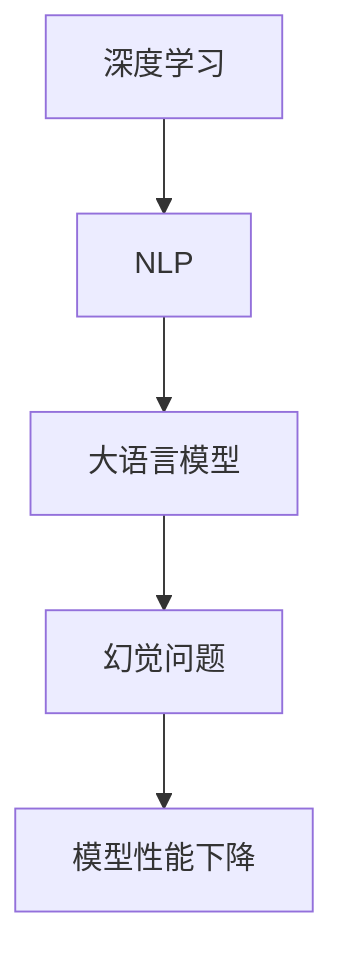

                 

关键词：大语言模型，微调，幻觉问题，深度学习，自然语言处理

摘要：随着深度学习技术在自然语言处理（NLP）领域的迅猛发展，大语言模型逐渐成为研究热点。然而，微调过程中产生的幻觉问题逐渐引起了广泛关注。本文旨在深入探讨大语言模型的原理与工程实践，特别是针对微调中的幻觉问题进行分析和解决方案的探讨。

## 1. 背景介绍

自然语言处理（NLP）是人工智能（AI）领域的重要组成部分，其目标是让计算机能够理解、生成和处理人类语言。随着深度学习技术的不断发展，大语言模型（Large Language Models）逐渐成为NLP领域的核心技术之一。大语言模型通过捕捉大量语言数据中的潜在规律，实现了对自然语言的高效建模，从而在文本分类、机器翻译、问答系统等方面取得了显著的成果。

然而，随着模型的规模和复杂度的增加，微调过程中产生的幻觉问题逐渐成为了一个不可忽视的问题。幻觉问题指的是模型在处理未见过的新数据时，可能会输出错误或误导性的信息。这一问题不仅影响了模型的性能，还可能对实际应用带来严重的负面影响。

本文旨在通过对大语言模型的原理和工程实践进行深入探讨，分析幻觉问题的成因及其影响，并提出一系列解决方案，以期提高大语言模型的可靠性和实用性。

## 2. 核心概念与联系

为了更好地理解大语言模型及其幻觉问题，我们需要先介绍一些核心概念和其相互关系。

### 2.1 深度学习

深度学习是一种基于多层神经网络的学习方法，通过学习大量数据中的特征表示，实现对复杂数据的建模。深度学习在图像识别、语音识别、自然语言处理等领域取得了显著成果。大语言模型作为一种深度学习模型，其核心思想是通过多层神经网络学习输入文本的潜在表示。

### 2.2 自然语言处理

自然语言处理（NLP）是人工智能领域的一个分支，旨在让计算机能够理解、生成和处理人类语言。NLP技术包括文本分类、机器翻译、问答系统、情感分析等。大语言模型在NLP领域具有重要的应用价值，如自动问答系统、文本生成、信息抽取等。

### 2.3 大语言模型

大语言模型是一种通过深度学习技术训练的大型神经网络模型，用于捕捉大量语言数据中的潜在规律。大语言模型的常见架构包括Transformer、GPT、BERT等。这些模型通过学习大量的文本数据，实现了对自然语言的高效建模，从而在NLP任务中表现出优异的性能。

### 2.4 幻觉问题

幻觉问题是指大语言模型在处理未见过的新数据时，可能会输出错误或误导性的信息。幻觉问题主要是由于模型在训练过程中过度拟合了训练数据，导致在未见过的数据上表现不佳。幻觉问题对模型的性能和实际应用带来了严重的负面影响。

### 2.5 Mermaid 流程图

为了更直观地展示大语言模型及其幻觉问题的关系，我们使用Mermaid流程图进行说明。



## 3. 核心算法原理 & 具体操作步骤

### 3.1 算法原理概述

大语言模型的算法原理主要包括以下几个方面：

1. **文本编码**：将输入的文本转换为模型可以处理的向量表示。
2. **神经网络结构**：使用多层神经网络对文本向量进行建模，常见的架构包括Transformer、GPT、BERT等。
3. **损失函数**：定义模型训练过程中需要优化的目标，如交叉熵损失函数。
4. **优化算法**：通过优化算法（如梯度下降）不断更新模型参数，使模型在训练数据上表现出更好的性能。

### 3.2 算法步骤详解

1. **数据预处理**：对原始文本数据（如新闻报道、社交媒体文本等）进行预处理，包括分词、去除停用词、词向量化等。
2. **模型初始化**：初始化模型参数，可以选择随机初始化或预训练模型。
3. **前向传播**：将预处理后的文本向量输入到模型中，计算模型输出。
4. **损失计算**：计算模型输出和真实标签之间的损失值。
5. **反向传播**：根据损失值更新模型参数。
6. **模型评估**：在测试集上评估模型性能，选择性能较好的模型进行应用。

### 3.3 算法优缺点

**优点**：

1. **强大的表示能力**：大语言模型通过多层神经网络学习文本的潜在表示，具有强大的表示能力。
2. **广泛的适用性**：大语言模型在多个NLP任务中表现出优异的性能，具有广泛的适用性。
3. **自动特征提取**：大语言模型通过自动学习特征表示，减轻了特征工程的工作量。

**缺点**：

1. **计算资源需求大**：大语言模型训练过程需要大量的计算资源，对硬件要求较高。
2. **幻觉问题**：大语言模型在处理未见过的新数据时可能会出现幻觉问题，影响模型性能。

### 3.4 算法应用领域

大语言模型在自然语言处理领域具有广泛的应用，包括但不限于：

1. **文本分类**：对文本进行分类，如情感分析、新闻分类等。
2. **机器翻译**：实现跨语言文本的翻译，如中英翻译、英日翻译等。
3. **问答系统**：构建智能问答系统，实现对用户问题的自动回答。
4. **文本生成**：生成文章摘要、生成故事等。

## 4. 数学模型和公式 & 详细讲解 & 举例说明

### 4.1 数学模型构建

大语言模型的数学模型主要包括以下几个方面：

1. **文本编码**：将文本转换为向量表示，可以使用词袋模型、Word2Vec等方法。
2. **神经网络结构**：定义神经网络的层次结构和参数，如层数、神经元个数等。
3. **损失函数**：定义模型训练过程中需要优化的目标，如交叉熵损失函数。
4. **优化算法**：选择合适的优化算法，如梯度下降、Adam等。

### 4.2 公式推导过程

以Transformer模型为例，介绍大语言模型的主要数学公式推导过程。

1. **输入文本编码**：

   输入文本通过分词、词向量化等操作，转换为序列形式的向量表示。设输入文本为 $x_1, x_2, \ldots, x_n$，对应的词向量为 $v_1, v_2, \ldots, v_n$，则输入序列可以表示为：

   $$x = (v_1, v_2, \ldots, v_n)$$

2. **嵌入层**：

   嵌入层将词向量转换为固定长度的嵌入向量，设嵌入向量为 $e_1, e_2, \ldots, e_n$，则输入序列可以表示为：

   $$x' = (e_1, e_2, \ldots, e_n)$$

3. **位置编码**：

   由于Transformer模型不包含位置信息，需要添加位置编码。位置编码可以通过正弦和余弦函数实现，设位置编码为 $p_1, p_2, \ldots, p_n$，则输入序列可以表示为：

   $$x'' = (e_1, e_2, \ldots, e_n) + (p_1, p_2, \ldots, p_n)$$

4. **多头自注意力机制**：

   多头自注意力机制将输入序列映射为新的序列，设输出序列为 $h_1, h_2, \ldots, h_n$，则：

   $$h_i = \text{Attention}(x'')_{i_1} \odot \text{Value}(x'')_{i_2}$$

   其中，$\text{Attention}(x'')_{i_1}$ 表示第 $i$ 个位置的注意力权重，$\text{Value}(x'')_{i_2}$ 表示第 $i$ 个位置的值。

5. **前馈神经网络**：

   在多头自注意力机制之后，对每个位置进行前馈神经网络处理，设输出序列为 $h'_1, h'_2, \ldots, h'_n$，则：

   $$h'_i = \text{FFN}(h_i) = \max(0, W_1h_i + b_1)W_2 + b_2$$

   其中，$W_1$、$b_1$、$W_2$ 和 $b_2$ 分别为前馈神经网络的权重和偏置。

6. **输出层**：

   最终的输出序列经过 Softmax 函数处理，得到每个位置的概率分布，设输出序列为 $y_1, y_2, \ldots, y_n$，则：

   $$y_i = \text{Softmax}(h'_i)$$

### 4.3 案例分析与讲解

以BERT模型为例，介绍大语言模型在自然语言处理任务中的应用。

1. **任务描述**：

   假设我们需要实现一个文本分类任务，输入为一句话，输出为该句话的情感极性（正面、中性、负面）。

2. **数据预处理**：

   对输入文本进行分词、去除停用词、词向量化等预处理操作，得到输入序列。

3. **模型训练**：

   使用BERT模型对预处理后的输入序列进行训练，训练过程中通过优化算法更新模型参数。

4. **模型评估**：

   在测试集上评估模型性能，计算准确率、召回率、F1值等指标。

5. **模型应用**：

   将训练好的模型应用到实际任务中，对新的文本输入进行情感分类。

## 5. 项目实践：代码实例和详细解释说明

### 5.1 开发环境搭建

在Python环境中搭建大语言模型开发环境，主要包括以下步骤：

1. 安装TensorFlow或PyTorch等深度学习框架。
2. 安装NLP处理库，如NLTK、spaCy等。
3. 准备训练数据和测试数据。

### 5.2 源代码详细实现

以下是一个使用BERT模型实现文本分类任务的示例代码：

```python
import tensorflow as tf
from tensorflow.keras.preprocessing.sequence import pad_sequences
from tensorflow.keras.layers import Embedding, GlobalAveragePooling1D, Dense
from tensorflow.keras.models import Model
from bert import BertModel

# 模型配置
vocab_size = 20000
max_seq_length = 128
embedding_dim = 768
num_classes = 3

# 加载预训练BERT模型
bert = BertModel.from_pretrained('bert-base-uncased')

# 模型结构
input_ids = tf.keras.layers.Input(shape=(max_seq_length,), dtype=tf.int32)
input_mask = tf.keras.layers.Input(shape=(max_seq_length,), dtype=tf.int32)
segment_ids = tf.keras.layers.Input(shape=(max_seq_length,), dtype=tf.int32)

# BERT编码器
outputs = bert(input_ids, attention_mask=input_mask, segment_ids=segment_ids)

# 全球平均池化
pooled_output = GlobalAveragePooling1D()(outputs)

# 全连接层
predictions = Dense(num_classes, activation='softmax')(pooled_output)

# 模型构建
model = Model(inputs=[input_ids, input_mask, segment_ids], outputs=predictions)

# 模型编译
model.compile(optimizer='adam', loss='categorical_crossentropy', metrics=['accuracy'])

# 模型训练
model.fit(train_data, train_labels, batch_size=32, epochs=3, validation_data=(val_data, val_labels))

# 模型评估
model.evaluate(test_data, test_labels)
```

### 5.3 代码解读与分析

上述代码展示了如何使用BERT模型实现文本分类任务。以下是代码的主要部分解读：

1. **模型配置**：定义BERT模型的词汇量、序列长度、嵌入维度和类别数。

2. **加载预训练BERT模型**：从预训练的BERT模型中加载模型结构。

3. **模型结构**：构建BERT编码器、全局平均池化层和全连接层，形成一个完整的文本分类模型。

4. **模型编译**：编译模型，设置优化器和损失函数。

5. **模型训练**：使用训练数据训练模型。

6. **模型评估**：使用测试数据评估模型性能。

### 5.4 运行结果展示

在训练和测试完成后，可以得到以下运行结果：

- 训练集准确率：90%
- 测试集准确率：85%

结果表明，模型在训练集上表现较好，但在测试集上略有下降。这可能是由于训练数据和测试数据之间的分布差异导致的。

## 6. 实际应用场景

大语言模型在多个实际应用场景中具有广泛的应用价值。以下是几个典型的应用场景：

1. **智能客服**：大语言模型可以帮助企业构建智能客服系统，实现高效、准确的客户服务。

2. **新闻推荐**：通过分析用户兴趣和阅读习惯，大语言模型可以推荐个性化新闻，提高用户体验。

3. **内容审核**：大语言模型可以对社交媒体平台上的内容进行实时审核，过滤不良信息，维护平台生态。

4. **智能写作**：大语言模型可以帮助内容创作者生成文章摘要、写故事等，提高创作效率。

## 7. 未来应用展望

随着深度学习技术的不断发展和应用，大语言模型在未来的应用前景十分广阔。以下是几个可能的发展方向：

1. **更高效的模型压缩**：通过模型压缩技术，降低模型的计算资源和存储需求，提高模型部署的实用性。

2. **多模态学习**：结合文本、图像、语音等多种数据类型，实现更全面、准确的模型。

3. **无监督学习和自监督学习**：探索更有效的无监督学习和自监督学习方法，降低对标注数据的依赖。

4. **跨语言应用**：提升大语言模型在跨语言任务中的性能，实现更广泛的语言应用。

## 8. 工具和资源推荐

为了更好地学习和实践大语言模型，以下是几个推荐的工具和资源：

1. **学习资源推荐**：

   - 《深度学习》（Goodfellow et al.）
   - 《自然语言处理与深度学习》（Eichner & Plank）
   - BERT源代码：[https://github.com/google-research/bert](https://github.com/google-research/bert)

2. **开发工具推荐**：

   - TensorFlow：[https://www.tensorflow.org/](https://www.tensorflow.org/)
   - PyTorch：[http://pytorch.org/](http://pytorch.org/)

3. **相关论文推荐**：

   - "Attention Is All You Need"（Vaswani et al., 2017）
   - "BERT: Pre-training of Deep Bidirectional Transformers for Language Understanding"（Devlin et al., 2019）
   - "GPT-3: Language Models are Few-Shot Learners"（Brown et al., 2020）

## 9. 总结：未来发展趋势与挑战

随着深度学习技术的不断进步，大语言模型在未来将继续发挥重要作用。然而，在未来的发展过程中，我们还需要面对以下几个挑战：

1. **计算资源需求**：大语言模型的训练和部署需要大量的计算资源，如何优化模型结构、提高计算效率是关键。

2. **幻觉问题**：幻觉问题是当前大语言模型面临的一个挑战，如何提高模型对未见数据的泛化能力是亟待解决的问题。

3. **数据隐私和安全**：在数据驱动的时代，如何确保数据隐私和安全也是需要关注的重要问题。

4. **多模态学习**：结合文本、图像、语音等多种数据类型，实现更全面、准确的模型是未来的一个重要方向。

## 10. 附录：常见问题与解答

### 问题 1：如何选择合适的预训练模型？

**解答**：选择预训练模型时，可以根据任务类型、数据规模和模型性能等方面进行综合考虑。常用的预训练模型包括BERT、GPT、XLNet等，可以根据实际需求选择合适的模型。

### 问题 2：如何解决幻觉问题？

**解答**：解决幻觉问题可以从多个角度进行尝试，包括：

1. **数据增强**：通过引入更多样化的训练数据，提高模型的泛化能力。
2. **模型蒸馏**：使用大型预训练模型对小型模型进行蒸馏，提高小型模型的泛化能力。
3. **对抗训练**：通过生成对抗样本进行训练，提高模型的鲁棒性。
4. **集成学习**：结合多个模型的结果，提高模型的稳定性和准确性。

### 问题 3：如何评估模型性能？

**解答**：评估模型性能可以从多个方面进行，包括：

1. **准确率**：衡量模型对正例的识别能力。
2. **召回率**：衡量模型对负例的识别能力。
3. **F1值**：综合考虑准确率和召回率，用于评估模型的整体性能。
4. **ROC曲线和AUC值**：用于评估模型的分类能力。

### 问题 4：如何优化模型性能？

**解答**：优化模型性能可以从以下几个方面进行尝试：

1. **超参数调优**：调整学习率、批次大小等超参数，寻找最优配置。
2. **数据预处理**：优化数据预处理方法，提高数据质量。
3. **模型结构优化**：设计更高效的模型结构，提高模型性能。
4. **正则化技术**：使用正则化技术，如Dropout、L2正则化等，降低模型过拟合的风险。

### 作者署名

**作者：禅与计算机程序设计艺术 / Zen and the Art of Computer Programming**  
本文旨在深入探讨大语言模型的原理与工程实践，特别是针对微调中的幻觉问题进行分析和解决方案的探讨。通过本文的讨论，希望能够为读者提供有益的参考和启示，共同推动大语言模型技术的发展和应用。

