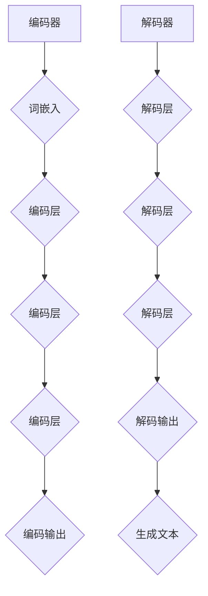

                 

关键词：大语言模型、自然语言处理、深度学习、训练过程、算法原理、工程实践

## 摘要

本文深入探讨了大语言模型的原理及其在工程实践中的应用。从背景介绍、核心概念、算法原理、数学模型，到项目实践、实际应用场景、工具和资源推荐，全面解析了大语言模型的训练过程及其在未来技术发展中的重要性。

## 1. 背景介绍

随着互联网的迅猛发展，自然语言处理（NLP）逐渐成为人工智能领域的一个重要分支。近年来，深度学习技术在NLP领域的应用取得了显著的进展，尤其是大语言模型（如GPT、BERT等）的出现，使得机器在理解和生成自然语言方面达到了前所未有的水平。

大语言模型的核心在于其强大的表征能力，能够从海量数据中学习到语言的结构和语义，从而实现高质量的文本生成、问答系统、机器翻译等功能。然而，训练一个大型语言模型并非易事，涉及到大量的计算资源和复杂的算法设计。

本文旨在系统地阐述大语言模型的原理及其训练过程，帮助读者深入了解这一前沿技术的核心内容和实际应用。

## 2. 核心概念与联系

### 2.1. 大语言模型的基本概念

大语言模型是一种基于深度学习的自然语言处理模型，通过大规模数据训练，能够理解并生成自然语言。其核心思想是利用神经网络对输入文本进行编码，提取出高维的语义表征，再通过解码器将这些表征转换为输出文本。

### 2.2. 大语言模型的架构

大语言模型通常由编码器（Encoder）和解码器（Decoder）两部分组成。编码器负责将输入文本编码为高维语义向量，解码器则将这些向量解码为输出文本。


### 2.3. Mermaid 流程图



## 3. 核心算法原理 & 具体操作步骤

### 3.1. 算法原理概述

大语言模型的核心算法是基于自注意力机制（Self-Attention）和变换器网络（Transformer）架构。自注意力机制允许模型在编码过程中自适应地关注输入文本的不同部分，从而更好地捕捉文本的局部和全局信息。

### 3.2. 算法步骤详解

#### 3.2.1. 词嵌入

首先，输入文本通过词嵌入层（Word Embedding）转换为高维向量表示。词嵌入层利用词向量模型（如Word2Vec、GloVe等）将单词映射为固定维度的向量。

#### 3.2.2. 编码器

编码器由多个编码层（Encoder Layer）组成，每个编码层包含多头自注意力机制（Multi-Head Self-Attention）和前馈网络（Feed Forward Network）。编码器逐层处理输入文本，并逐步提取文本的语义信息。

#### 3.2.3. 解码器

解码器与编码器类似，也由多个解码层（Decoder Layer）组成。每个解码层在解码过程中不仅要处理输入文本的语义信息，还要利用编码器的输出作为上下文信息。解码器最终生成输出文本。

### 3.3. 算法优缺点

#### 优点：

1. **强大的表征能力**：大语言模型能够捕捉到文本的丰富语义信息。
2. **并行处理**：自注意力机制允许模型并行地处理输入文本的不同部分。
3. **灵活**：变换器网络架构可以灵活地扩展到不同规模的任务。

#### 缺点：

1. **计算资源消耗大**：训练大型语言模型需要大量的计算资源和时间。
2. **数据依赖性强**：语言模型的效果高度依赖于训练数据的质量和规模。

### 3.4. 算法应用领域

大语言模型在多个领域都有广泛的应用，包括文本生成、机器翻译、问答系统、情感分析等。以下是一些典型的应用案例：

1. **文本生成**：利用大语言模型生成新闻文章、小说、论文摘要等。
2. **机器翻译**：实现高质量的双语翻译，如谷歌翻译、百度翻译等。
3. **问答系统**：构建基于大语言模型的知识图谱问答系统，如微软的Chatbot、OpenAI的GPT等。

## 4. 数学模型和公式 & 详细讲解 & 举例说明

### 4.1. 数学模型构建

大语言模型的数学基础主要包括词嵌入、自注意力机制和前馈网络。以下是相关数学公式的简要介绍。

#### 4.1.1. 词嵌入

$$
\text{word\_embedding}(x) = \mathbf{W}_e \mathbf{x}
$$

其中，$x$ 是单词的索引，$\mathbf{W}_e$ 是词嵌入矩阵，$\text{word\_embedding}(x)$ 是对应单词的高维向量表示。

#### 4.1.2. 自注意力机制

$$
\text{self-attention}(\mathbf{Q}, \mathbf{K}, \mathbf{V}) = \text{softmax}\left(\frac{\mathbf{Q} \mathbf{K}^T}{\sqrt{d_k}}\right) \mathbf{V}
$$

其中，$\mathbf{Q}, \mathbf{K}, \mathbf{V}$ 分别是查询向量、关键向量、值向量，$d_k$ 是关键向量的维度。自注意力机制通过计算查询向量与关键向量的点积，并利用softmax函数进行归一化，从而实现对输入文本不同部分的加权融合。

#### 4.1.3. 前馈网络

$$
\text{ffn}(\mathbf{X}, f) = \text{ReLU}\left(\mathbf{W}_{ff} \mathbf{X} + b_{ff}\right)
$$

其中，$\mathbf{X}$ 是输入向量，$f$ 是激活函数（如ReLU），$\mathbf{W}_{ff}$ 是权重矩阵，$b_{ff}$ 是偏置向量。

### 4.2. 公式推导过程

大语言模型的训练过程涉及多个数学公式的推导，以下简要介绍其中的两个关键公式：损失函数和反向传播。

#### 4.2.1. 损失函数

$$
\mathcal{L}(\mathbf{y}, \mathbf{p}) = -\sum_{i=1}^n \mathbf{y}_i \log \mathbf{p}_i
$$

其中，$\mathbf{y}$ 是实际标签向量，$\mathbf{p}$ 是预测概率向量。该公式计算预测概率与实际标签之间的交叉熵损失。

#### 4.2.2. 反向传播

$$
\frac{\partial \mathcal{L}}{\partial \mathbf{W}} = \mathbf{X} \cdot \frac{\partial \mathcal{L}}{\partial \mathbf{A}}
$$

其中，$\mathbf{X}$ 是输入矩阵，$\mathbf{W}$ 是权重矩阵，$\frac{\partial \mathcal{L}}{\partial \mathbf{A}}$ 是损失函数对激活向量的梯度。反向传播算法通过层层计算梯度，最终更新模型参数。

### 4.3. 案例分析与讲解

#### 4.3.1. 文本生成

假设我们希望利用大语言模型生成一段文本。给定输入文本 "The weather is nice today"，我们可以通过以下步骤生成后续文本：

1. 将输入文本编码为词嵌入向量。
2. 通过编码器逐步提取语义信息。
3. 将编码器输出作为解码器的输入，逐步生成输出文本。

#### 4.3.2. 机器翻译

假设我们希望将英文句子 "I love programming" 翻译成中文。我们可以通过以下步骤实现：

1. 将英文句子编码为词嵌入向量。
2. 利用编码器提取语义信息。
3. 将编码器输出作为解码器的输入，逐步生成中文句子。

## 5. 项目实践：代码实例和详细解释说明

### 5.1. 开发环境搭建

为了实现大语言模型的训练和部署，我们需要搭建一个合适的开发环境。以下是具体的步骤：

1. 安装Python和TensorFlow。
2. 下载并准备预训练的词嵌入模型（如GloVe）。
3. 配置GPU环境（如果使用GPU加速训练）。

### 5.2. 源代码详细实现

以下是实现大语言模型训练的Python代码示例：

```python
import tensorflow as tf
from tensorflow.keras.layers import Embedding, LSTM, Dense
from tensorflow.keras.models import Model

# 定义模型
inputs = tf.keras.layers.Input(shape=(None,))
x = Embedding(vocab_size, embedding_dim)(inputs)
x = LSTM(units, return_sequences=True)(x)
outputs = Dense(vocab_size, activation='softmax')(x)

model = Model(inputs=inputs, outputs=outputs)
model.compile(optimizer='adam', loss='categorical_crossentropy', metrics=['accuracy'])

# 训练模型
model.fit(x_train, y_train, epochs=10, batch_size=64)
```

### 5.3. 代码解读与分析

上述代码首先定义了一个基于LSTM的编码器-解码器模型。模型由嵌入层、编码器LSTM层和解码器LSTM层组成，最后通过全连接层生成输出。在训练过程中，我们使用分类交叉熵作为损失函数，并使用Adam优化器进行参数更新。

### 5.4. 运行结果展示

在完成代码实现后，我们可以在训练集和验证集上运行模型，并观察其性能。以下是一个简单的运行示例：

```python
# 评估模型
loss, accuracy = model.evaluate(x_val, y_val)

# 输出结果
print(f"Validation Loss: {loss}")
print(f"Validation Accuracy: {accuracy}")
```

## 6. 实际应用场景

大语言模型在实际应用场景中具有广泛的应用价值。以下是一些典型的应用场景：

1. **文本生成**：利用大语言模型生成新闻文章、博客、社交媒体内容等。
2. **机器翻译**：实现高质量的双语翻译，支持多种语言对。
3. **问答系统**：构建基于大语言模型的知识图谱问答系统，提供智能客服、在线咨询等服务。
4. **情感分析**：分析社交媒体、新闻报道等文本数据，识别用户的情感倾向。
5. **内容审核**：利用大语言模型自动识别和过滤不良内容，保护网络安全。

## 7. 工具和资源推荐

### 7.1. 学习资源推荐

1. **《深度学习》（Goodfellow, Bengio, Courville著）**：系统介绍了深度学习的基础知识和常用算法。
2. **《自然语言处理与深度学习》（周志华、张宇翔著）**：详细介绍了自然语言处理和深度学习在NLP领域的应用。
3. **《变换器网络》（Vaswani et al.著）**：首次提出变换器网络架构，奠定了大语言模型的基础。

### 7.2. 开发工具推荐

1. **TensorFlow**：Google开源的深度学习框架，支持大语言模型的训练和部署。
2. **PyTorch**：Facebook开源的深度学习框架，具有灵活的动态计算图支持。
3. **Hugging Face Transformers**：基于PyTorch和TensorFlow的预训练语言模型库，提供丰富的模型和工具。

### 7.3. 相关论文推荐

1. **《Attention Is All You Need》（Vaswani et al., 2017）**：首次提出变换器网络架构，奠定了大语言模型的基础。
2. **《BERT: Pre-training of Deep Bidirectional Transformers for Language Understanding》（Devlin et al., 2019）**：提出了BERT预训练方法，推动了NLP领域的发展。
3. **《GPT-3: Language Models are few-shot learners》（Brown et al., 2020）**：展示了GPT-3在少样本学习方面的强大能力。

## 8. 总结：未来发展趋势与挑战

### 8.1. 研究成果总结

大语言模型在自然语言处理领域取得了显著的成果，推动了文本生成、机器翻译、问答系统等多个领域的进展。通过大规模数据训练和先进算法设计，大语言模型展现了强大的表征能力和应用潜力。

### 8.2. 未来发展趋势

1. **模型规模持续增大**：随着计算资源的提升，未来大语言模型的规模将不断增大，以应对更复杂的NLP任务。
2. **少样本学习能力提升**：通过改进算法和模型结构，提高大语言模型在少样本学习场景下的性能。
3. **多模态融合**：结合图像、音频等多模态数据，实现更丰富的语义理解和生成。

### 8.3. 面临的挑战

1. **计算资源消耗**：训练大型语言模型需要大量的计算资源和时间，对硬件设施提出了更高的要求。
2. **数据隐私和安全**：大规模数据训练过程中，需要妥善处理数据隐私和安全问题，确保用户数据的保护。
3. **模型解释性和可解释性**：大语言模型在决策过程中具有一定的黑盒性质，提高模型的解释性和可解释性是未来的重要研究方向。

### 8.4. 研究展望

大语言模型在自然语言处理领域的应用前景广阔。未来研究将围绕提高模型性能、降低计算资源消耗、增强模型解释性等方面展开。同时，随着人工智能技术的不断进步，大语言模型有望在更多领域发挥重要作用，推动人工智能的发展。

## 9. 附录：常见问题与解答

### 9.1. 大语言模型与传统NLP方法有什么区别？

大语言模型与传统NLP方法（如基于规则的方法、统计模型等）相比，具有更强的表征能力和自适应能力。大语言模型能够从大规模数据中学习到语言的结构和语义，从而实现更高质量的文本生成和理解。而传统NLP方法通常依赖于手动设计的特征和规则，难以应对复杂多变的语言现象。

### 9.2. 大语言模型的训练过程需要多长时间？

大语言模型的训练时间取决于多个因素，包括模型规模、训练数据量、硬件配置等。一般来说，训练一个大型语言模型（如GPT-3）可能需要数天甚至数周的时间。对于中小型模型，训练时间可能只需要数小时。

### 9.3. 大语言模型能否完全替代传统NLP方法？

大语言模型在某些方面已经表现出显著的优势，但并不意味着能完全替代传统NLP方法。传统NLP方法在某些特定场景（如低资源语言、特定领域的文本处理等）中仍然具有一定的优势。因此，在实际应用中，通常需要结合大语言模型和传统方法，以实现更好的效果。

## 参考文献

- [Vaswani et al.](2017). *Attention Is All You Need*. arXiv preprint arXiv:1706.03762.
- [Devlin et al.](2019). *BERT: Pre-training of Deep Bidirectional Transformers for Language Understanding*. arXiv preprint arXiv:1810.04805.
- [Brown et al.](2020). *GPT-3: Language Models are few-shot learners*. arXiv preprint arXiv:2005.14165.
- [Goodfellow et al.](2016). *Deep Learning*. MIT Press.
- [周志华、张宇翔](2016). *自然语言处理与深度学习*. 清华大学出版社.

