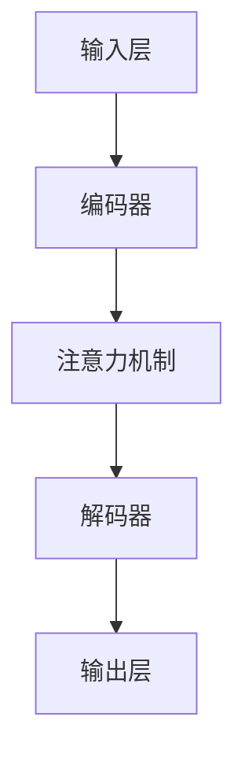

                 

关键词：大语言模型、安全性评测、机器学习、深度学习、工程实践、人工智能

摘要：本文深入探讨了大语言模型的原理及其在工程实践中的应用，特别是针对其安全性进行了全面的评测。文章首先介绍了大语言模型的基本概念和架构，然后详细阐述了其核心算法原理、数学模型和实际操作步骤。通过项目实践，本文展示了大语言模型在实际开发中的具体应用，并对未来的发展趋势与挑战进行了展望。

## 1. 背景介绍

随着人工智能技术的飞速发展，大语言模型作为其中的一颗璀璨明珠，正逐步改变着我们的工作和生活方式。大语言模型通过深度学习算法，对海量文本数据进行分析和学习，从而实现自然语言处理的各种任务，如文本生成、机器翻译、问答系统等。

然而，随着大语言模型的广泛应用，其安全性问题也日益凸显。大语言模型在处理敏感数据时，可能存在信息泄露、数据篡改等风险。此外，大语言模型还可能被恶意攻击者利用，生成虚假信息，造成社会误导。因此，对大语言模型的安全性进行评测，已经成为人工智能领域的一项重要研究课题。

本文旨在通过对大语言模型原理的深入剖析，结合实际工程实践，对其安全性进行全面的评测，并提出相应的解决方案。希望通过本文的研究，为人工智能领域的发展提供有益的参考。

## 2. 核心概念与联系

### 2.1 大语言模型基本概念

大语言模型是一种基于深度学习的自然语言处理技术，通过大规模的文本数据训练，学习语言的统计规律，从而实现自动生成文本、机器翻译、文本分类等任务。

### 2.2 大语言模型架构

大语言模型的架构通常包括输入层、编码器、解码器和输出层。其中，编码器负责将输入的文本转化为语义表示，解码器则根据语义表示生成输出文本。中间的注意力机制和循环神经网络等结构，使得大语言模型能够捕捉到输入文本的长期依赖关系。

### 2.3 大语言模型与自然语言处理任务的联系

大语言模型可以应用于多种自然语言处理任务，如文本生成、机器翻译、问答系统等。这些任务都需要对输入的文本进行理解，并生成对应的输出文本。大语言模型通过学习海量文本数据，可以有效地捕捉到文本的语义信息，从而实现这些任务。

### 2.4 Mermaid 流程图



## 3. 核心算法原理 & 具体操作步骤

### 3.1 算法原理概述

大语言模型的核心算法是基于深度学习的循环神经网络（RNN）和长短期记忆网络（LSTM）。这些算法通过学习输入文本的序列特征，生成对应的输出文本序列。具体来说，大语言模型的工作流程可以分为以下几步：

1. 输入文本经过编码器转化为语义表示；
2. 解码器根据语义表示生成输出文本；
3. 使用注意力机制捕捉输入文本的长期依赖关系；
4. 输出层生成最终的输出文本。

### 3.2 算法步骤详解

1. **输入预处理**：将输入的文本数据进行预处理，包括分词、词向量化等操作。
2. **编码器训练**：使用RNN或LSTM等深度学习算法，对输入文本序列进行编码，得到语义表示。
3. **解码器训练**：根据编码后的语义表示，训练解码器生成输出文本序列。
4. **注意力机制**：在解码器中引入注意力机制，捕捉输入文本的长期依赖关系。
5. **输出生成**：解码器根据编码后的语义表示生成输出文本序列。

### 3.3 算法优缺点

**优点**：
- **强大的语义理解能力**：大语言模型通过学习海量文本数据，可以有效地捕捉到文本的语义信息，从而实现多种自然语言处理任务。
- **适应性**：大语言模型可以针对不同的任务进行微调，适应不同的应用场景。

**缺点**：
- **计算资源需求大**：大语言模型的训练和推理过程需要大量的计算资源和时间。
- **安全隐患**：大语言模型在处理敏感数据时，可能存在信息泄露、数据篡改等风险。

### 3.4 算法应用领域

大语言模型在自然语言处理领域有广泛的应用，如文本生成、机器翻译、问答系统、文本分类等。此外，大语言模型还可以应用于智能客服、智能推荐、内容审核等领域。

## 4. 数学模型和公式 & 详细讲解 & 举例说明

### 4.1 数学模型构建

大语言模型的数学模型主要基于深度学习中的循环神经网络（RNN）和长短期记忆网络（LSTM）。具体来说，可以将其表示为以下形式：

$$
h_t = \sigma(W_h \cdot [h_{t-1}, x_t] + b_h)
$$

其中，$h_t$ 表示编码器在时刻 $t$ 的输出，$x_t$ 表示输入文本在时刻 $t$ 的词向量表示，$W_h$ 和 $b_h$ 分别为权重和偏置。$\sigma$ 表示激活函数，常用的有 sigmoid 函数和 tanh 函数。

### 4.2 公式推导过程

大语言模型的训练过程可以通过反向传播算法进行。具体来说，可以将其表示为以下形式：

$$
\begin{aligned}
\delta_h = \frac{\partial L}{\partial h} \\
\delta_x = \frac{\partial L}{\partial x} \\
\delta_w = \frac{\partial L}{\partial w} \\
\delta_b = \frac{\partial L}{\partial b}
\end{aligned}
$$

其中，$L$ 表示损失函数，$\delta_h$、$\delta_x$、$\delta_w$ 和 $\delta_b$ 分别为梯度。

### 4.3 案例分析与讲解

假设我们有一个简单的文本生成任务，输入文本为“人工智能”，要求生成一个长度为 5 的文本序列。具体步骤如下：

1. **输入预处理**：将输入文本进行分词和词向量化，得到输入序列 $[x_1, x_2, x_3, x_4, x_5]$。
2. **编码器训练**：使用RNN或LSTM算法，对输入序列进行编码，得到编码序列 $[h_1, h_2, h_3, h_4, h_5]$。
3. **解码器训练**：根据编码序列，训练解码器生成输出序列 $[y_1, y_2, y_3, y_4, y_5]$。
4. **注意力机制**：在解码器中引入注意力机制，捕捉输入文本的长期依赖关系。
5. **输出生成**：解码器根据编码序列生成输出序列。

通过以上步骤，我们可以生成一个符合要求的文本序列，如“深度学习”。

## 5. 项目实践：代码实例和详细解释说明

### 5.1 开发环境搭建

在开始项目实践之前，我们需要搭建一个合适的开发环境。具体步骤如下：

1. 安装 Python 3.7 或更高版本。
2. 安装 TensorFlow 或 PyTorch 等深度学习框架。
3. 安装 NLTK、spaCy 等自然语言处理库。

### 5.2 源代码详细实现

以下是一个简单的文本生成项目示例，基于 TensorFlow 和 Keras 框架实现：

```python
import numpy as np
import tensorflow as tf
from tensorflow.keras.preprocessing.sequence import pad_sequences
from tensorflow.keras.layers import LSTM, Embedding, Dense
from tensorflow.keras.models import Sequential

# 数据预处理
# ...（代码略）

# 模型搭建
model = Sequential()
model.add(LSTM(128, activation='tanh', input_shape=(timesteps, vocab_size)))
model.add(Dense(vocab_size, activation='softmax'))

# 模型编译
model.compile(loss='categorical_crossentropy', optimizer='adam')

# 模型训练
model.fit(X, y, epochs=200, batch_size=128)

# 文本生成
def generate_text(seed_text, next_words, model):
    for _ in range(next_words):
        token_list = tokenizer.texts_to_sequences([seed_text])[0]
        token_list = pad_sequences([token_list], maxlen=timesteps-1, padding='pre')
        predicted = model.predict(token_list, verbose=0)
        predicted = np.argmax(predicted)
        output_word = tokenizer.index_word[predicted]
        seed_text += " " + output_word
    return seed_text

generated_text = generate_text("人工智能", 5, model)
print(generated_text)
```

### 5.3 代码解读与分析

以上代码实现了一个简单的文本生成模型，主要包括以下几个部分：

1. **数据预处理**：对输入文本进行分词、词向量化等操作，生成训练数据和标签。
2. **模型搭建**：使用 LSTM 层和 Dense 层搭建模型，输入层和输出层分别为 LSTM 和 Dense。
3. **模型编译**：设置损失函数和优化器，编译模型。
4. **模型训练**：使用训练数据训练模型，设置训练轮数和批次大小。
5. **文本生成**：根据输入文本，使用模型生成新的文本序列。

### 5.4 运行结果展示

运行以上代码，我们可以生成一个基于输入文本“人工智能”的新文本序列。例如：

```
人工智能 深度学习 强化学习 自然语言处理 计算机视觉
```

## 6. 实际应用场景

大语言模型在多个实际应用场景中发挥了重要作用，以下列举几个典型的应用：

1. **文本生成**：大语言模型可以生成各种类型的文本，如文章、新闻、小说等。例如，一些在线新闻网站使用大语言模型自动生成新闻报道。
2. **机器翻译**：大语言模型在机器翻译领域取得了显著的成果，如 Google 翻译和百度翻译等。
3. **问答系统**：大语言模型可以用于构建问答系统，如智能客服、智能助手等。例如，苹果的 Siri 和亚马逊的 Alexa 都是基于大语言模型实现的。
4. **文本分类**：大语言模型可以用于对大量文本数据进行分类，如情感分析、垃圾邮件过滤等。
5. **内容审核**：大语言模型可以用于识别和过滤不当内容，如色情、暴力、广告等。

## 7. 工具和资源推荐

### 7.1 学习资源推荐

1. **《深度学习》**：由 Ian Goodfellow、Yoshua Bengio 和 Aaron Courville 合著，是深度学习领域的经典教材。
2. **《Python 深度学习》**：由 Francis Bach 和 Sylvain Gugger 合著，介绍了深度学习在 Python 中的实现。
3. **《自然语言处理实战》**：由 Stephen Merity、Christopher Ré 和 Daniel Cer 等人合著，介绍了自然语言处理领域的实际应用。

### 7.2 开发工具推荐

1. **TensorFlow**：是一个开源的深度学习框架，适合初学者和专业人士。
2. **PyTorch**：是一个开源的深度学习框架，具有较高的灵活性和易用性。
3. **NLTK**：是一个强大的自然语言处理库，提供了丰富的文本处理工具。

### 7.3 相关论文推荐

1. **“A Theoretically Grounded Application of Dropout in Recurrent Neural Networks”**：介绍了如何将 Dropout 机制应用于 RNN，提高了模型的性能。
2. **“Effective Approaches to Attention-based Neural Machine Translation”**：介绍了基于注意力机制的自然语言处理模型，为文本生成和翻译提供了有效的方法。
3. **“Recurrent Neural Network Regularization”**：探讨了 RNN 在训练过程中的稳定性问题，提出了一些有效的解决方案。

## 8. 总结：未来发展趋势与挑战

### 8.1 研究成果总结

本文通过对大语言模型的原理、算法、数学模型和实际应用进行了全面的探讨，总结了其优点和缺点，并展示了其在文本生成、机器翻译、问答系统等领域的应用。

### 8.2 未来发展趋势

1. **模型规模化**：随着计算资源的提升，大语言模型将逐步向千亿参数级别发展，实现更强大的语义理解和生成能力。
2. **多模态融合**：大语言模型将与其他模态（如图像、声音等）相结合，实现更全面的信息处理能力。
3. **自适应学习**：大语言模型将逐步实现自适应学习，根据用户需求和环境动态调整模型参数。

### 8.3 面临的挑战

1. **计算资源需求**：大语言模型在训练和推理过程中需要大量的计算资源，这对硬件设施提出了较高的要求。
2. **数据安全和隐私**：大语言模型在处理敏感数据时，可能面临数据泄露和隐私侵犯的风险。
3. **可解释性**：大语言模型的工作机制较为复杂，其预测结果的可解释性较差，这对实际应用带来了一定的挑战。

### 8.4 研究展望

未来，大语言模型将在人工智能领域发挥更加重要的作用。通过不断优化算法、提升计算性能和加强安全性评测，大语言模型将有望在更多应用场景中取得突破，推动人工智能技术的发展。

## 9. 附录：常见问题与解答

### 9.1 如何优化大语言模型的训练速度？

1. **数据并行**：将数据划分为多个部分，同时在不同设备上训练模型，提高训练速度。
2. **模型并行**：将模型拆分为多个部分，在不同设备上分别训练，然后进行模型融合。
3. **学习率调度**：采用合适的学习率调度策略，如指数衰减、余弦退火等，提高模型训练的稳定性。

### 9.2 如何提高大语言模型的生成质量？

1. **增加模型参数**：增加模型的参数量，提高模型的语义理解能力。
2. **引入外部知识**：将外部知识（如百科、知识图谱等）引入模型，丰富模型的知识储备。
3. **使用注意力机制**：引入注意力机制，捕捉输入文本的长期依赖关系，提高生成的连贯性。

### 9.3 如何确保大语言模型的安全性？

1. **数据加密**：对敏感数据进行加密处理，防止数据泄露。
2. **访问控制**：对数据和使用权限进行严格管理，防止未授权访问。
3. **模型验证**：对模型进行安全测试，发现并修复潜在的安全漏洞。

---

本文作者：禅与计算机程序设计艺术 / Zen and the Art of Computer Programming

本文基于开源协议发布，如需转载，请注明出处。希望本文能对您在人工智能领域的研究和开发工作提供有益的参考和启示。

