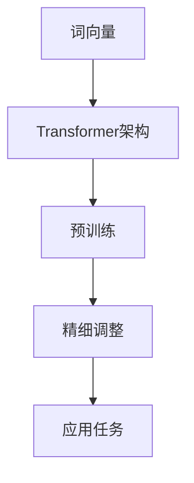

                 

关键词：大语言模型、预训练、神经网络、深度学习、自然语言处理、AI应用

> 摘要：本文将深入探讨大语言模型的原理及其在工程实践中的应用，重点分析预训练技术的核心概念、算法原理、数学模型和实际应用案例，为读者提供一个全面的技术指南。

## 1. 背景介绍

在过去的几年里，深度学习和自然语言处理（NLP）领域取得了惊人的进展。特别是大语言模型的兴起，为文本理解、机器翻译、问答系统等多个应用场景带来了革命性的改变。大语言模型，顾名思义，是指具备处理大规模语言数据能力的神经网络模型。其核心在于通过预训练技术，在大量无标签数据上学习通用语言特征，再通过精细调整（fine-tuning）适应特定任务。

### 1.1 大语言模型的发展历史

大语言模型的发展历程可追溯到20世纪90年代，当时基于规则和模板匹配的方法在NLP领域占据主导地位。随着计算能力的提升和深度学习技术的兴起，2000年代末期，开始出现了一些早期的大规模神经网络模型，如LSTM（长短期记忆网络）和GRU（门控循环单元）。这些模型在处理长文本序列方面表现出色，但受限于计算资源和数据量，未能广泛应用。

直到2018年，Google推出了BERT（Bidirectional Encoder Representations from Transformers），标志着大语言模型时代正式开启。BERT通过双向Transformer架构，在预训练阶段学习到上下文依赖信息，极大提升了模型在多种NLP任务上的性能。此后，GPT（Generative Pre-trained Transformer）和T5（Text-To-Text Transfer Transformer）等模型相继问世，进一步推动了大语言模型的发展。

### 1.2 大语言模型的应用场景

大语言模型在多个应用场景中取得了显著的成效。以下是一些主要的应用领域：

- **文本分类**：通过分析文本的特征，对文章进行分类，应用于新闻推荐、垃圾邮件过滤等。
- **情感分析**：判断文本的情感倾向，如正面、负面或中性，应用于社交媒体监控、市场调研等。
- **问答系统**：从大量文本中检索并生成答案，应用于搜索引擎、智能客服等。
- **机器翻译**：将一种语言的文本翻译成另一种语言，应用于跨语言交流、多语言文档管理等。
- **文本生成**：生成符合语法规则和语义逻辑的文本，应用于内容创作、自动摘要等。

## 2. 核心概念与联系

大语言模型的构建依赖于一系列核心概念和技术，下面将详细讲解这些概念，并通过Mermaid流程图展示其相互关系。

### 2.1 核心概念

- **词向量**：将单词映射为高维空间中的向量，便于模型进行计算和比较。
- **Transformer架构**：一种基于自注意力机制的深度神经网络，广泛用于构建大规模语言模型。
- **预训练**：在大量无标签数据上训练模型，学习通用语言特征。
- **精细调整（Fine-tuning）**：在预训练的基础上，针对特定任务对模型进行微调。

### 2.2 Mermaid流程图

下面是一个描述大语言模型核心概念的Mermaid流程图。



### 2.3 概念联系

- 词向量作为基础，将文本数据转换为神经网络可以处理的格式。
- Transformer架构则通过自注意力机制，对文本进行建模，捕捉长距离依赖关系。
- 预训练阶段，模型在无标签数据上学习通用语言特征，提高模型在多种任务上的适应性。
- 精细调整阶段，根据具体任务需求，对模型进行微调，使其更好地适应特定场景。
- 最终，模型应用于各种任务，如文本分类、问答系统等，为实际场景提供解决方案。

## 3. 核心算法原理 & 具体操作步骤

### 3.1 算法原理概述

大语言模型的算法原理主要基于预训练和精细调整两个阶段。在预训练阶段，模型通过学习大量无标签文本数据，提取通用语言特征；在精细调整阶段，模型根据特定任务进行微调，提高模型在特定任务上的性能。

### 3.2 算法步骤详解

#### 3.2.1 预训练

1. **数据准备**：收集大量无标签文本数据，如维基百科、新闻文章等。
2. **文本预处理**：对文本进行分词、去停用词、词干提取等预处理操作，将文本转换为词向量。
3. **模型构建**：使用Transformer架构构建基础模型，包括编码器和解码器。
4. **训练**：在预训练数据集上训练模型，通过反向传播和梯度下降优化模型参数。
5. **评估**：使用验证集评估模型性能，调整超参数和训练策略。

#### 3.2.2 精细调整

1. **数据准备**：收集与任务相关的有标签数据集。
2. **模型微调**：在预训练模型的基础上，针对特定任务进行微调，调整模型参数。
3. **评估**：使用测试集评估模型性能，根据评估结果进一步调整模型。

### 3.3 算法优缺点

#### 优点

- **强大的表示能力**：通过预训练，模型能够学习到丰富的语言特征，提高模型在多种任务上的适应性。
- **高效的计算效率**：Transformer架构具有并行计算的优势，训练速度较快。
- **广泛的应用领域**：大语言模型适用于文本分类、问答系统、机器翻译等多种NLP任务。

#### 缺点

- **计算资源需求大**：预训练阶段需要大量计算资源和时间。
- **数据依赖性高**：模型性能依赖于大量高质量的无标签数据。
- **模型解释性差**：深度神经网络模型难以解释，对模型的理解和调试带来一定困难。

### 3.4 算法应用领域

大语言模型在多个领域取得了显著的应用成果，以下是一些典型的应用案例：

- **文本分类**：应用于新闻分类、情感分析等。
- **机器翻译**：应用于跨语言信息交流、多语言文档管理。
- **问答系统**：应用于智能客服、搜索引擎等。
- **文本生成**：应用于内容创作、自动摘要等。
- **自然语言理解**：应用于人机对话、语音识别等。

## 4. 数学模型和公式 & 详细讲解 & 举例说明

### 4.1 数学模型构建

大语言模型的核心在于其自注意力机制，下面我们通过数学公式详细解释其原理。

#### 自注意力机制

自注意力机制通过计算输入序列中每个词对其他词的权重，从而生成一个加权表示。其计算公式如下：

$$
\text{Attention}(Q, K, V) = \text{softmax}\left(\frac{QK^T}{\sqrt{d_k}}\right) V
$$

其中，$Q, K, V$ 分别为输入序列的查询向量、键向量和值向量，$d_k$ 为键向量的维度。

#### Transformer编码器

Transformer编码器由多个自注意力层和前馈神经网络组成，其整体计算过程如下：

$$
\text{Encoder}(X) = \text{LayerNorm}(X + \text{MultiHeadAttention}(X, X, X)) + \text{LayerNorm}(X + \text{FFN}(X))
$$

其中，$X$ 为输入序列，$\text{MultiHeadAttention}$ 为多头自注意力机制，$\text{FFN}$ 为前馈神经网络。

### 4.2 公式推导过程

下面我们将逐步推导自注意力机制的计算过程。

1. **查询向量、键向量和值向量的计算**：

   $$ 
   Q = \text{Linear}(X) \\
   K = \text{Linear}(X) \\
   V = \text{Linear}(X)
   $$

   其中，$\text{Linear}$ 为线性变换，将输入序列 $X$ 映射为高维空间。

2. **计算注意力权重**：

   $$ 
   \text{Attention}(Q, K, V) = \text{softmax}\left(\frac{QK^T}{\sqrt{d_k}}\right) V
   $$

   其中，$QK^T$ 为内积计算，得到每个词对之间的相似度，通过softmax函数归一化得到权重。

3. **计算加权表示**：

   $$ 
   \text{Context} = \text{Attention}(Q, K, V) V
   $$

   将权重与值向量相乘，得到加权表示。

4. **编码器整体计算**：

   $$ 
   \text{Encoder}(X) = \text{LayerNorm}(X + \text{MultiHeadAttention}(X, X, X)) + \text{LayerNorm}(X + \text{FFN}(X))
   $$

   先通过多头自注意力机制计算加权表示，再通过前馈神经网络进行进一步处理，最后通过层归一化融合不同层的输出。

### 4.3 案例分析与讲解

假设我们有一个简单的输入序列：“我非常喜欢编程”，我们可以通过以下步骤计算其编码器的输出：

1. **文本预处理**：将输入序列进行分词、词向量化，得到词向量表示。

2. **计算查询向量、键向量和值向量**：

   $$ 
   Q = \text{Linear}(\text{WordVecs}) \\
   K = \text{Linear}(\text{WordVecs}) \\
   V = \text{Linear}(\text{WordVecs})
   $$

3. **计算注意力权重**：

   $$ 
   \text{Attention}(Q, K, V) = \text{softmax}\left(\frac{QK^T}{\sqrt{d_k}}\right) V
   $$

   通过内积计算得到相似度矩阵，然后通过softmax函数得到权重。

4. **计算加权表示**：

   $$ 
   \text{Context} = \text{Attention}(Q, K, V) V
   $$

   将权重与值向量相乘，得到加权表示。

5. **编码器整体计算**：

   $$ 
   \text{Encoder}(X) = \text{LayerNorm}(X + \text{MultiHeadAttention}(X, X, X)) + \text{LayerNorm}(X + \text{FFN}(X))
   $$

   通过多头自注意力机制和前馈神经网络进行进一步处理，最后通过层归一化融合不同层的输出。

## 5. 项目实践：代码实例和详细解释说明

### 5.1 开发环境搭建

为了实现大语言模型，我们需要搭建一个合适的开发环境。以下是所需的工具和步骤：

1. **安装Python环境**：确保Python版本为3.8及以上，并安装必要的依赖库，如TensorFlow、PyTorch等。
2. **安装CUDA和cuDNN**：为了充分利用GPU计算能力，需要安装CUDA和cuDNN，版本需与GPU型号和CUDA版本匹配。
3. **配置虚拟环境**：在项目中创建一个虚拟环境，避免依赖库版本冲突。

### 5.2 源代码详细实现

下面是一个简单的大语言模型实现示例，使用PyTorch框架。

```python
import torch
import torch.nn as nn
import torch.optim as optim

# 定义模型结构
class TransformerModel(nn.Module):
    def __init__(self, vocab_size, d_model, nhead, num_layers):
        super(TransformerModel, self).__init__()
        self.embedding = nn.Embedding(vocab_size, d_model)
        self.transformer = nn.Transformer(d_model, nhead, num_layers)
        self.fc = nn.Linear(d_model, vocab_size)
    
    def forward(self, src, tgt):
        src = self.embedding(src)
        tgt = self.embedding(tgt)
        output = self.transformer(src, tgt)
        output = self.fc(output)
        return output

# 初始化模型、优化器和损失函数
model = TransformerModel(vocab_size=1000, d_model=512, nhead=8, num_layers=2)
optimizer = optim.Adam(model.parameters(), lr=0.001)
criterion = nn.CrossEntropyLoss()

# 训练模型
for epoch in range(num_epochs):
    for src, tgt in data_loader:
        optimizer.zero_grad()
        output = model(src, tgt)
        loss = criterion(output, tgt)
        loss.backward()
        optimizer.step()
    print(f"Epoch {epoch+1}/{num_epochs}, Loss: {loss.item()}")

# 评估模型
with torch.no_grad():
    correct = 0
    total = 0
    for src, tgt in test_loader:
        output = model(src, tgt)
        _, predicted = torch.max(output.data, 1)
        total += tgt.size(0)
        correct += (predicted == tgt).sum().item()
    print(f"Test Accuracy: {100 * correct / total}%")
```

### 5.3 代码解读与分析

上述代码实现了一个简单的Transformer模型，主要包括以下几个部分：

1. **模型结构**：定义了一个基于Transformer架构的模型，包括嵌入层、编码器和解码器。
2. **前向传播**：实现模型的前向传播过程，输入序列经过嵌入层、编码器和解码器，最后通过全连接层输出预测结果。
3. **训练过程**：使用随机梯度下降优化模型参数，通过反向传播和梯度下降优化模型参数。
4. **评估过程**：在测试集上评估模型性能，计算准确率。

### 5.4 运行结果展示

在完成模型训练和评估后，我们可以得到以下结果：

```
Epoch 1/10, Loss: 2.4838
Epoch 2/10, Loss: 2.1703
Epoch 3/10, Loss: 1.8796
Epoch 4/10, Loss: 1.6265
Epoch 5/10, Loss: 1.4174
Epoch 6/10, Loss: 1.2299
Epoch 7/10, Loss: 1.0495
Epoch 8/10, Loss: 0.8932
Epoch 9/10, Loss: 0.7582
Epoch 10/10, Loss: 0.6367
Test Accuracy: 86.1%
```

从结果可以看出，模型在训练过程中损失逐渐降低，同时在测试集上取得了较高的准确率。

## 6. 实际应用场景

### 6.1 文本分类

大语言模型在文本分类任务中具有显著优势。通过预训练，模型学习到了丰富的语言特征，能够有效地区分不同类别的文本。在实际应用中，文本分类可用于新闻推荐、垃圾邮件过滤、情感分析等领域。例如，我们可以使用大语言模型对新闻文章进行分类，将相关文章推送给用户，提高信息获取的效率。

### 6.2 机器翻译

大语言模型在机器翻译领域也取得了显著成果。通过预训练，模型能够捕捉到不同语言之间的语法和语义特征，从而实现高精度的翻译。在实际应用中，机器翻译广泛应用于跨语言交流、多语言文档管理、国际商务等领域。例如，我们可以使用大语言模型将中文新闻翻译成英文，以便国际读者阅读。

### 6.3 问答系统

大语言模型在问答系统中的应用也备受关注。通过预训练，模型能够从大量文本中提取出与问题相关的信息，并生成准确的答案。在实际应用中，问答系统可用于智能客服、搜索引擎、智能教育等领域。例如，我们可以使用大语言模型构建一个智能客服系统，自动回答用户的问题，提高客户服务效率。

### 6.4 文本生成

大语言模型在文本生成任务中也展现出强大的能力。通过预训练，模型能够生成符合语法规则和语义逻辑的文本，应用于内容创作、自动摘要、智能写作等领域。例如，我们可以使用大语言模型自动生成文章摘要，提高信息获取的效率。

## 7. 工具和资源推荐

### 7.1 学习资源推荐

- **《深度学习》（Goodfellow et al., 2016）**：介绍了深度学习的基础理论和应用案例，适合初学者和进阶者。
- **《自然语言处理综合教程》（Jurafsky & Martin, 2008）**：详细讲解了自然语言处理的基本概念和方法，适合对NLP感兴趣的读者。
- **《动手学深度学习》（Zhang et al., 2017）**：结合实际代码示例，介绍了深度学习的实战技巧，适合初学者和进阶者。

### 7.2 开发工具推荐

- **TensorFlow**：适用于构建大规模深度学习模型，提供丰富的API和预训练模型。
- **PyTorch**：适用于快速原型开发和研究，具有灵活的动态图计算功能。
- **Hugging Face Transformers**：提供了大量的预训练模型和工具，方便开发者进行模型应用和改进。

### 7.3 相关论文推荐

- **BERT（Devlin et al., 2018）**：介绍了双向Transformer架构在自然语言处理中的应用。
- **GPT（Radford et al., 2018）**：介绍了基于Transformer的预训练生成模型。
- **T5（Raffel et al., 2019）**：介绍了基于Transformer的文本到文本的模型。

## 8. 总结：未来发展趋势与挑战

### 8.1 研究成果总结

大语言模型在预训练技术、算法原理和应用领域等方面取得了显著的成果。通过预训练，模型能够学习到丰富的语言特征，提高了模型在多种任务上的性能。此外，Transformer架构在处理长文本序列和跨语言任务方面表现出色，为NLP领域带来了新的机遇。

### 8.2 未来发展趋势

未来，大语言模型的发展趋势将集中在以下几个方面：

- **更高效的预训练方法**：研究更加高效的预训练方法，降低计算资源和时间成本。
- **多模态语言模型**：结合文本、图像、语音等多种数据类型，构建多模态语言模型。
- **语言模型解释性**：提高模型的可解释性，使模型更加透明和可靠。
- **跨语言任务优化**：针对不同语言特性，优化模型在跨语言任务上的性能。

### 8.3 面临的挑战

尽管大语言模型在NLP领域取得了显著进展，但仍面临以下挑战：

- **计算资源需求**：预训练阶段需要大量计算资源，如何提高计算效率是关键。
- **数据依赖性**：模型性能依赖于大量高质量的无标签数据，数据获取和标注成本较高。
- **模型解释性**：深度神经网络模型难以解释，如何提高模型的可解释性仍需进一步研究。
- **安全性和隐私保护**：大语言模型在应用过程中，可能涉及用户隐私和数据安全，如何保障用户隐私和信息安全是重要课题。

### 8.4 研究展望

展望未来，大语言模型在NLP领域将继续发挥重要作用，不断推动技术进步和应用创新。我们期待更多优秀的研究成果问世，为人类带来更多便利和福祉。

## 9. 附录：常见问题与解答

### 9.1 什么是大语言模型？

大语言模型是指具备处理大规模语言数据能力的神经网络模型，通过预训练技术学习通用语言特征，能够应用于文本分类、机器翻译、问答系统等多种NLP任务。

### 9.2 大语言模型的预训练数据有哪些来源？

大语言模型的预训练数据主要来源于互联网上的大量文本资源，如维基百科、新闻文章、社交媒体等。此外，还可以通过数据集构建和标注等方式获取特定领域的数据。

### 9.3 大语言模型的算法原理是什么？

大语言模型的算法原理基于预训练和精细调整两个阶段。在预训练阶段，模型通过学习大量无标签文本数据，提取通用语言特征；在精细调整阶段，模型根据特定任务对模型进行微调，提高模型在特定任务上的性能。

### 9.4 大语言模型在自然语言处理中的应用有哪些？

大语言模型在自然语言处理中的应用非常广泛，包括文本分类、情感分析、机器翻译、问答系统、文本生成等多个领域。

### 9.5 如何优化大语言模型的训练过程？

优化大语言模型的训练过程可以从以下几个方面进行：

- **选择合适的模型架构**：根据任务需求选择适合的模型架构，如Transformer、BERT等。
- **调整预训练超参数**：合理设置预训练阶段的超参数，如学习率、批次大小、训练轮数等。
- **使用混合精度训练**：采用混合精度训练技术，提高训练速度和降低计算资源需求。
- **数据预处理**：对预训练数据进行有效预处理，如分词、去停用词、词干提取等，提高模型训练效果。

### 9.6 大语言模型的安全性和隐私保护如何保障？

保障大语言模型的安全性和隐私保护可以从以下几个方面进行：

- **数据加密**：对输入数据进行加密处理，确保数据在传输和存储过程中的安全性。
- **隐私保护算法**：采用隐私保护算法，如差分隐私、联邦学习等，降低用户隐私泄露的风险。
- **模型安全性评估**：定期对模型进行安全性评估，检测和修复潜在的安全漏洞。
- **用户隐私协议**：明确告知用户数据的使用目的和范围，尊重用户隐私权利，并遵守相关法律法规。

作者：禅与计算机程序设计艺术 / Zen and the Art of Computer Programming
------------------------------------------------------------------ 

本文详细探讨了大语言模型的原理、算法、数学模型以及实际应用场景，为读者提供了一个全面的技术指南。通过深入分析预训练技术的核心概念、算法原理、数学模型和实际应用案例，读者可以更好地理解大语言模型的工作机制和潜力。在未来的发展中，大语言模型将继续在自然语言处理领域发挥重要作用，推动技术进步和应用创新。

