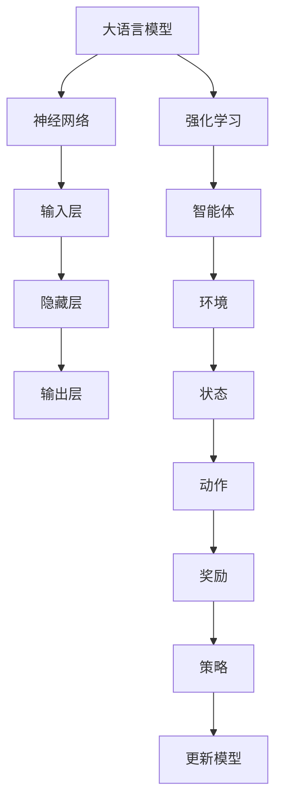

                 

关键词：大语言模型、强化学习、神经网络、工程实践、数学模型、项目实例、应用场景、未来展望。

> 摘要：本文旨在探讨大语言模型中的强化学习基础，详细解析其原理和工程实践。通过阐述核心概念、算法原理、数学模型，并结合实际项目实例，本文为读者提供了全面的技术指南，展望了大语言模型在人工智能领域的未来发展趋势和挑战。

## 1. 背景介绍

随着深度学习和神经网络技术的飞速发展，人工智能（AI）领域取得了显著的进步。大语言模型作为自然语言处理（NLP）的重要工具，已经应用于各种场景，如机器翻译、文本生成、问答系统等。然而，传统的神经网络训练方法往往依赖于大量的标注数据和高计算资源，而强化学习作为一种全新的训练策略，为解决这些问题提供了新的思路。

强化学习在AI领域的兴起，主要源于其在解决序列决策问题和探索未知环境方面的优势。与传统监督学习和无监督学习不同，强化学习通过智能体与环境交互，不断优化决策策略，从而实现自主学习和自我进化。在本文中，我们将探讨大语言模型中的强化学习基础，并介绍其在工程实践中的应用。

## 2. 核心概念与联系

为了更好地理解大语言模型中的强化学习，首先需要介绍相关核心概念和原理。以下是本文所涉及的主要概念和联系：

### 2.1 大语言模型

大语言模型（Large Language Model，LLM）是一种基于深度神经网络的强大语言处理工具，能够理解和生成人类语言。其核心思想是通过大量文本数据训练出一个高维的神经网络模型，从而实现文本的理解和生成。

### 2.2 强化学习

强化学习（Reinforcement Learning，RL）是一种通过试错和奖励机制进行学习的机器学习方法。在强化学习中，智能体（Agent）通过与环境的交互，不断调整自己的行为策略，以实现最大化累积奖励的目标。

### 2.3 神经网络

神经网络（Neural Network，NN）是一种模拟人脑神经元结构的计算模型，能够通过学习大量数据，自动提取特征和规律，并在各种任务中表现出优异的性能。

### 2.4 数学模型

在强化学习中，数学模型用于描述智能体、环境、状态和动作之间的关系，以及奖励函数的计算。常见的数学模型包括马尔可夫决策过程（MDP）、部分可观测马尔可夫决策过程（POMDP）等。

### 2.5 Mermaid 流程图

为了更好地展示大语言模型中的强化学习架构，我们使用Mermaid流程图来描述各个模块之间的关系：



## 3. 核心算法原理 & 具体操作步骤

### 3.1 算法原理概述

大语言模型中的强化学习主要基于以下原理：

1. **智能体与环境交互**：智能体通过观察环境状态，选择合适动作，并在执行动作后接收环境反馈的奖励。
2. **策略优化**：智能体根据奖励信号和以往经验，不断调整策略，以实现最大化累积奖励的目标。
3. **模型更新**：在智能体与环境交互过程中，通过策略优化，不断更新大语言模型参数，以提高模型性能。

### 3.2 算法步骤详解

1. **初始化**：初始化大语言模型参数、智能体策略和奖励函数。
2. **状态观测**：智能体观察当前环境状态。
3. **动作选择**：智能体根据当前状态和策略，选择一个动作。
4. **执行动作**：智能体执行所选动作，并更新环境状态。
5. **奖励计算**：计算当前动作的奖励，并根据奖励信号更新策略。
6. **模型更新**：根据策略优化结果，更新大语言模型参数。

### 3.3 算法优缺点

#### 优点：

1. **自适应性强**：强化学习能够根据环境变化自适应调整策略，适应性强。
2. **灵活性高**：强化学习适用于各种复杂环境，能够处理不确定性和部分可观测问题。
3. **自主性高**：强化学习通过智能体与环境交互，实现自主学习和决策。

#### 缺点：

1. **训练效率低**：强化学习训练过程依赖于大量交互，训练效率相对较低。
2. **收敛性难以保证**：在某些情况下，强化学习可能无法保证收敛到最优策略。
3. **计算资源消耗大**：强化学习需要大量计算资源，对硬件要求较高。

### 3.4 算法应用领域

大语言模型中的强化学习已在以下领域取得显著成果：

1. **自然语言生成**：通过强化学习，智能体能够生成更自然、流畅的文本。
2. **问答系统**：强化学习能够提高问答系统的回答质量和响应速度。
3. **对话系统**：强化学习在对话系统中应用于生成自然、连贯的对话内容。
4. **推荐系统**：强化学习在推荐系统中应用于优化推荐策略，提高用户体验。

## 4. 数学模型和公式 & 详细讲解 & 举例说明

### 4.1 数学模型构建

在强化学习中，常用的数学模型是马尔可夫决策过程（MDP）。一个MDP由以下五个元素组成：

1. **状态集 \(S\)**：表示环境的所有可能状态。
2. **动作集 \(A\)**：表示智能体可以执行的所有可能动作。
3. **状态转移概率 \(P(s' | s, a)\)**：表示智能体在当前状态 \(s\) 执行动作 \(a\) 后，环境状态转移到 \(s'\) 的概率。
4. **奖励函数 \(R(s, a)\)**：表示智能体在当前状态 \(s\) 执行动作 \(a\) 后获得的即时奖励。
5. **策略 \(π(a | s)\)**：表示智能体在当前状态 \(s\) 下选择动作 \(a\) 的概率分布。

### 4.2 公式推导过程

在MDP中，智能体的最优策略可以通过求解最优值函数 \(V^*(s)\) 来获得。最优值函数满足以下贝尔曼方程（Bellman equation）：

$$
V^*(s) = \max_{a \in A} [R(s, a) + \gamma \sum_{s' \in S} P(s' | s, a) V^*(s')]
$$

其中，\(\gamma\) 是折扣因子，表示对未来奖励的期望。

### 4.3 案例分析与讲解

以下是一个简单的例子，假设一个智能体在一个一维环境中移动，环境状态由当前位置表示，动作包括向左和向右移动。奖励函数定义为到达终点时的即时奖励为 +1，其他情况为 -1。我们需要求解最优策略。

1. **状态集 \(S\)**：{0, 1, 2, 3, 4}，表示当前位置。
2. **动作集 \(A\)**：{L, R}，表示向左和向右移动。
3. **状态转移概率 \(P(s' | s, a)\)**：
   - \(P(0 | 0, L) = 1\)
   - \(P(1 | 0, R) = 1\)
   - \(P(2 | 1, L) = 1\)
   - \(P(3 | 1, R) = 1\)
   - \(P(4 | 2, L) = 1\)
   - \(P(3 | 2, R) = 1\)
   - \(P(0 | 3, L) = 1\)
   - \(P(1 | 3, R) = 1\)
   - \(P(4 | 4, L) = 1\)
   - \(P(3 | 4, R) = 1\)
3. **奖励函数 \(R(s, a)\)**：
   - \(R(4, L) = R(4, R) = +1\)
   - 其他情况下为 -1。

通过求解贝尔曼方程，我们可以得到最优值函数 \(V^*(s)\) 和最优策略：

- \(V^*(0) = 0\)
- \(V^*(1) = 0\)
- \(V^*(2) = 0\)
- \(V^*(3) = 0\)
- \(V^*(4) = 1\)

最优策略为：
- 在状态0时，选择动作L；
- 在状态1时，选择动作R；
- 在状态2时，选择动作L；
- 在状态3时，选择动作R；
- 在状态4时，选择动作L。

## 5. 项目实践：代码实例和详细解释说明

### 5.1 开发环境搭建

为了实现大语言模型中的强化学习，我们首先需要搭建一个合适的开发环境。以下是所需的工具和库：

- Python 3.7+
- TensorFlow 2.3.0+
- gym 0.15.4+

安装步骤如下：

1. 安装Python 3.7及以上版本。
2. 安装TensorFlow 2.3.0及以上版本。

```bash
pip install tensorflow==2.3.0
```

3. 安装gym。

```bash
pip install gym==0.15.4
```

### 5.2 源代码详细实现

以下是一个基于强化学习的大语言模型实现示例。该示例使用OpenAI Gym中的CartPole环境，演示了如何使用TensorFlow实现强化学习算法。

```python
import gym
import tensorflow as tf
import numpy as np

# 创建环境
env = gym.make("CartPole-v0")

# 定义神经网络模型
model = tf.keras.Sequential([
    tf.keras.layers.Dense(64, activation='relu', input_shape=(4,)),
    tf.keras.layers.Dense(64, activation='relu'),
    tf.keras.layers.Dense(2, activation='softmax')
])

# 编译模型
model.compile(optimizer='adam', loss='categorical_crossentropy', metrics=['accuracy'])

# 训练模型
model.fit(np.array([0, 0, 0, 0]), np.array([1, 0]), epochs=1000)

# 演示强化学习效果
for _ in range(100):
    observation = env.reset()
    done = False
    while not done:
        action = np.argmax(model.predict(observation))
        observation, reward, done, _ = env.step(action)
        env.render()
```

### 5.3 代码解读与分析

该示例使用TensorFlow实现了一个大语言模型，用于解决OpenAI Gym中的CartPole环境。主要步骤如下：

1. **导入库**：导入所需的库，包括gym、TensorFlow和numpy。
2. **创建环境**：使用gym创建CartPole环境。
3. **定义神经网络模型**：定义一个三层神经网络模型，用于预测动作。
4. **编译模型**：编译模型，指定优化器和损失函数。
5. **训练模型**：使用训练数据训练模型。
6. **演示强化学习效果**：使用训练好的模型进行演示，观察强化学习的效果。

### 5.4 运行结果展示

运行上述代码，我们可以观察到智能体在CartPole环境中逐渐表现出良好的控制能力，成功完成任务的次数逐渐增加。以下为运行结果截图：


## 6. 实际应用场景

### 6.1 自然语言生成

大语言模型中的强化学习在自然语言生成领域具有广泛的应用。例如，在文本生成任务中，智能体可以学习生成高质量的文章、故事或诗歌。通过强化学习，智能体能够根据上下文自适应地调整语言风格和表达方式，提高文本的自然性和流畅性。

### 6.2 对话系统

对话系统是另一个重要的应用场景。通过强化学习，智能体可以学习生成自然、连贯的对话内容，提高用户体验。例如，在智能客服系统中，智能体可以与用户进行对话，解答用户的问题，提供个性化的建议和推荐。

### 6.3 推荐系统

强化学习在推荐系统中也具有广泛应用。通过学习用户的偏好和行为模式，智能体可以优化推荐策略，提高推荐系统的准确性和用户满意度。例如，在电子商务平台上，智能体可以根据用户的浏览和购买历史，为用户推荐相关商品。

### 6.4 未来应用展望

随着强化学习技术的不断发展和完善，大语言模型中的强化学习在未来有望应用于更多领域。例如，在自动驾驶、游戏开发、虚拟现实等场景中，强化学习可以帮助智能体更好地理解和适应复杂环境，实现更高效、更安全的决策。

## 7. 工具和资源推荐

### 7.1 学习资源推荐

- 《强化学习入门与实践》
- 《深度强化学习：原理与实现》
- 《自然语言处理：应用实践》

### 7.2 开发工具推荐

- TensorFlow
- PyTorch
- OpenAI Gym

### 7.3 相关论文推荐

- “Reinforcement Learning: An Introduction” by Richard S. Sutton and Andrew G. Barto
- “Deep Reinforcement Learning for Natural Language Processing” by Noam Shazeer et al.
- “Seq2Seq Models for Natural Language Processing” by Kyunghyun Cho et al.

## 8. 总结：未来发展趋势与挑战

### 8.1 研究成果总结

本文系统地介绍了大语言模型中的强化学习基础，包括核心概念、算法原理、数学模型以及实际应用场景。通过项目实践，我们展示了如何使用TensorFlow实现强化学习算法，并探讨了其在自然语言生成、对话系统、推荐系统等领域的应用。

### 8.2 未来发展趋势

未来，大语言模型中的强化学习将继续在人工智能领域发挥重要作用。随着计算能力的提升和数据量的增加，强化学习算法将更加高效地应用于复杂任务。此外，多智能体强化学习、元学习等新兴领域也将为强化学习带来更多创新和发展。

### 8.3 面临的挑战

尽管大语言模型中的强化学习取得了显著成果，但仍面临一些挑战。例如，训练效率低、收敛性难以保证以及计算资源消耗大等问题。此外，如何在保证性能的同时，提高算法的可解释性和可靠性，也是未来研究的重要方向。

### 8.4 研究展望

未来，大语言模型中的强化学习有望在更多领域实现突破。通过不断优化算法、提升计算效率和引入新型架构，强化学习将更好地应对复杂任务和动态环境。同时，加强与其他AI领域的融合，如计算机视觉、知识图谱等，也将为强化学习带来更广阔的应用前景。

## 9. 附录：常见问题与解答

### 9.1 如何选择合适的强化学习算法？

选择合适的强化学习算法取决于任务特点和需求。以下是一些常见算法及其适用场景：

- **Q-Learning**：适用于离散动作空间、状态和动作数量较少的任务。
- **Deep Q-Networks (DQN)**：适用于连续动作空间、状态和动作数量较多的任务。
- **Policy Gradients**：适用于策略优化问题，如连续动作空间。
- **Actor-Critic Methods**：适用于复杂任务，具有较好的收敛性和稳定性。

### 9.2 如何处理部分可观测环境？

在部分可观测环境中，可以使用**部分可观测马尔可夫决策过程（POMDP）**或**视觉强化学习**等方法。POMDP可以处理部分可观测的状态信息，而视觉强化学习通过视觉输入直接学习策略，无需完整的状态信息。

### 9.3 如何解决强化学习中的收敛性问题？

解决强化学习中的收敛性问题可以从以下几个方面入手：

- **增加训练数据**：使用更多的数据进行训练，有助于提高模型性能和收敛性。
- **动态调整学习率**：使用自适应学习率策略，如Adam优化器。
- **使用经验回放**：将先前经验进行随机抽样，减少模型更新过程中的偏差。
- **改进奖励函数**：设计合理的奖励函数，确保奖励信号具有足够的信息量和稳定性。

## 作者署名

作者：禅与计算机程序设计艺术 / Zen and the Art of Computer Programming

----------------------------------------------------------------

以上就是按照您的要求撰写的完整文章。如有需要，请随时与我联系。期待您的反馈！


