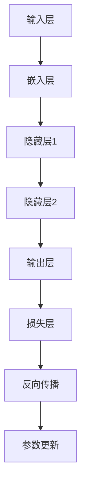

                 

关键词：大语言模型、训练、自动化框架、深度学习、工程实践、编程、算法原理、数学模型、应用场景

## 摘要

本文旨在为广大技术爱好者、研究人员和开发者提供一份详尽的大语言模型训练教程。我们将深入探讨大语言模型的基本原理，包括核心概念、架构设计和数学模型。同时，文章将介绍一种高效的自动化训练框架，帮助读者轻松上手并实现从零到一的大语言模型训练。通过本文的讲解，读者将不仅能理解大语言模型的工作机制，还能掌握其工程实现和优化技巧，为未来在相关领域的研究和应用打下坚实基础。

## 1. 背景介绍

随着深度学习的迅速发展，大语言模型（Large-scale Language Models）已经成为自然语言处理（Natural Language Processing，NLP）领域的重要工具。这些模型不仅能够捕捉复杂的语言规律，还能在文本生成、机器翻译、情感分析等多个应用场景中取得显著的成果。然而，大语言模型的训练和优化是一项复杂且耗时的任务，传统的手动操作方式已经难以满足日益增长的需求。

大语言模型的兴起得益于计算能力的提升和海量数据的获取。早期的小规模语言模型，如 Word2Vec 和 FastText，通过简单的词向量表示方法，已经在许多应用中表现出色。但随着深度学习的进一步发展，研究者们开始探索更大规模的模型，如 GPT、BERT 和 T5 等。这些模型通过多层神经网络结构，结合了大规模数据的训练，能够更好地捕捉语言中的细微差异和复杂模式。

在工程实践中，大语言模型的训练和优化需要考虑到计算资源、数据存储和网络通信等多方面的因素。传统的方法往往需要大量的手动调整和优化，不仅效率低下，而且容易出现错误。为了解决这个问题，自动化训练框架逐渐成为研究的热点。自动化训练框架通过自动化配置、参数调整和资源调度，大大提高了训练效率，降低了开发和运维成本。

本文将围绕大语言模型的训练过程，从原理讲解到工程实践，全面介绍大语言模型的训练机制。同时，我们将介绍一种基于深度学习的自动化训练框架，帮助读者理解并实现大规模语言模型的训练。希望通过本文的讲解，读者能够对大语言模型有更深入的了解，并掌握其训练和优化的基本方法。

## 2. 核心概念与联系

在深入探讨大语言模型的训练之前，我们需要先了解几个核心概念，包括神经网络、梯度下降和反向传播算法。这些概念不仅是深度学习的基础，也是大语言模型训练的核心组成部分。

### 2.1 神经网络

神经网络（Neural Network）是一种模仿生物神经网络构造的计算模型。它由大量的神经元（或称为节点）通过加权连接组成。每个神经元接收多个输入信号，并通过激活函数产生一个输出信号。神经网络通过不断调整权重，以最小化预测误差，达到训练模型的目的。

一个简单的神经网络结构通常包括输入层、隐藏层和输出层。输入层接收外部输入，隐藏层进行特征提取和组合，输出层生成最终的预测结果。每个层的神经元都通过前一层神经元的输出进行加权求和，并通过激活函数处理，最终产生输出。


### 2.2 梯度下降

梯度下降（Gradient Descent）是一种优化算法，用于最小化损失函数。在神经网络中，损失函数通常表示模型预测结果与实际结果之间的差距。梯度下降通过计算损失函数关于模型参数的梯度，并沿着梯度方向调整参数，以逐步减小损失。

梯度下降的基本思想是，在当前参数下，计算损失函数的梯度，并根据梯度的方向和大小更新参数。具体而言，每次迭代中，参数更新量为梯度的负方向乘以一个学习率（learning rate）。学习率决定了参数更新的步长，太大可能导致参数跳过最小值，太小则收敛速度过慢。


### 2.3 反向传播算法

反向传播算法（Backpropagation Algorithm）是一种用于训练神经网络的优化算法。它通过前向传播计算输出层的预测值，然后通过反向传播计算各层参数的梯度。反向传播的核心思想是将输出误差从输出层反向传播到输入层，以更新各层的参数。

在反向传播过程中，首先计算输出层的误差，然后通过链式法则逐层计算各层的梯度。具体而言，梯度计算过程包括以下步骤：

1. 计算输出层的误差：误差 = 预测值 - 实际值。
2. 计算输出层每个神经元的梯度：梯度 = 激活函数的导数 × 误差 × 下一个层的权重。
3. 反向传播到隐藏层：重复步骤2，直到输入层。
4. 使用梯度更新各层的参数：参数更新 = 参数 - 梯度 × 学习率。


### 2.4 大语言模型架构

大语言模型通常采用深度神经网络结构，通过多层神经元的堆叠，实现对大规模语言数据的建模。一个典型的大语言模型架构通常包括以下几个部分：

1. **输入层**：接收文本数据，将其转换为向量表示。
2. **嵌入层**：将输入向量映射到高维空间，增加数据的表达能力。
3. **隐藏层**：多层神经网络结构，进行特征提取和组合。
4. **输出层**：生成预测结果，如文本生成、分类等。


### 2.5 Mermaid 流程图

为了更好地理解大语言模型的训练过程，我们可以使用 Mermaid 流程图来表示其核心步骤。以下是一个简单的 Mermaid 流程图示例：



### 2.6 核心概念与联系总结

通过上述核心概念的介绍，我们可以看到大语言模型训练过程涉及到多个关键环节，包括神经网络结构、梯度下降优化和反向传播算法。这些概念相互联系，共同构成了大语言模型训练的基础。

- **神经网络**提供了模型的基本结构，通过多层神经元的堆叠，实现特征提取和组合。
- **梯度下降**和**反向传播**是优化算法的核心，用于最小化损失函数，更新模型参数。
- **大语言模型架构**则综合了上述概念，通过复杂的神经网络结构，实现对大规模语言数据的建模。

这些核心概念与联系，为我们理解大语言模型的工作原理和训练过程提供了坚实的基础。在接下来的章节中，我们将进一步探讨大语言模型的算法原理和具体实现。

## 3. 核心算法原理 & 具体操作步骤

### 3.1 算法原理概述

大语言模型的核心算法主要基于深度学习框架，其训练过程可以概括为以下几个主要步骤：

1. **数据预处理**：包括文本清洗、分词和向量化等步骤，将原始文本数据转换为适合模型训练的向量表示。
2. **模型初始化**：定义神经网络结构，包括输入层、隐藏层和输出层，并初始化模型参数。
3. **前向传播**：输入层接收文本向量，通过嵌入层和隐藏层传递，最终生成输出层的预测结果。
4. **损失计算**：计算输出层的预测结果与实际结果之间的差距，得到损失值。
5. **反向传播**：通过反向传播算法，计算各层参数的梯度，并更新模型参数。
6. **迭代优化**：重复上述步骤，不断迭代优化模型参数，减小损失值，提高模型性能。

### 3.2 算法步骤详解

#### 3.2.1 数据预处理

数据预处理是训练大语言模型的第一步，其质量直接影响模型的效果。具体步骤如下：

1. **文本清洗**：去除文本中的无用符号、停用词等，保持文本的简洁性。
2. **分词**：将文本分解为词语或子词，通常使用分词工具如jieba进行分词。
3. **向量化**：将分词后的文本转换为向量表示，常用的方法有词袋模型、词嵌入等。

#### 3.2.2 模型初始化

模型初始化包括定义神经网络结构和初始化参数。神经网络结构通常由以下几部分组成：

1. **输入层**：接收向量化后的文本数据。
2. **嵌入层**：将输入向量映射到高维空间，增加数据的表达能力。
3. **隐藏层**：多层神经网络结构，用于提取特征和组合信息。
4. **输出层**：生成预测结果，如文本生成、分类等。

初始化参数的方法有随机初始化、预训练模型等。随机初始化通常使用均匀分布或高斯分布，而预训练模型则利用已有的预训练模型作为初始化，如 GPT、BERT 等。

#### 3.2.3 前向传播

前向传播是指将输入数据通过神经网络结构传递，最终生成输出结果。具体步骤如下：

1. **输入层到嵌入层**：将输入向量通过嵌入层进行映射，得到嵌入向量。
2. **嵌入层到隐藏层**：将嵌入向量输入到隐藏层，通过多层神经元的堆叠进行特征提取和组合。
3. **隐藏层到输出层**：将隐藏层的输出作为输入，通过输出层生成预测结果。

前向传播过程中，涉及矩阵乘法和激活函数的应用。常用的激活函数有 Sigmoid、ReLU 和 Tanh 等。

#### 3.2.4 损失计算

损失计算是指计算输出结果与实际结果之间的差距，通常使用交叉熵（Cross-Entropy）作为损失函数。具体步骤如下：

1. **计算预测概率**：将输出层的结果转换为概率分布。
2. **计算交叉熵损失**：交叉熵损失 = -1/N * Σ(y_log(p))，其中 y 为实际结果，p 为预测概率。

#### 3.2.5 反向传播

反向传播是指通过计算输出结果与实际结果之间的差距，反向更新神经网络参数。具体步骤如下：

1. **计算输出层误差**：误差 = 预测概率 - 实际概率。
2. **计算隐藏层误差**：误差通过输出层的权重传递到隐藏层，并使用链式法则计算隐藏层的误差。
3. **更新参数**：使用误差和梯度下降算法更新神经网络参数。

反向传播是神经网络训练的核心步骤，通过不断迭代优化参数，使得模型性能逐渐提高。

#### 3.2.6 迭代优化

迭代优化是指通过多次迭代训练，不断调整模型参数，减小损失值，提高模型性能。具体步骤如下：

1. **初始化参数**：使用随机初始化或预训练模型初始化参数。
2. **前向传播**：输入训练数据，通过神经网络结构生成预测结果。
3. **损失计算**：计算输出结果与实际结果之间的差距，得到损失值。
4. **反向传播**：计算各层参数的梯度，并更新参数。
5. **迭代更新**：重复上述步骤，不断迭代优化模型参数。

通过迭代优化，模型逐渐收敛，损失值逐渐减小，模型性能逐渐提高。

### 3.3 算法优缺点

大语言模型的训练算法具有以下优点：

1. **强大的表达能力**：通过多层神经元的堆叠，大语言模型能够捕捉到复杂的语言特征和模式，具有很强的表达能力和泛化能力。
2. **自适应学习能力**：大语言模型可以通过反向传播算法不断调整参数，自适应地学习数据中的规律和特征，提高模型的准确性。
3. **高效性**：随着深度学习技术的发展，大规模语言模型的训练时间逐渐缩短，训练效率显著提高。

然而，大语言模型也存在一些缺点：

1. **计算资源需求高**：大语言模型训练需要大量的计算资源和存储资源，对硬件设备有较高的要求。
2. **训练时间较长**：大规模语言模型的训练时间较长，尤其是在海量数据集上的训练，需要耗费大量时间和计算资源。
3. **过拟合问题**：大语言模型在训练过程中可能出现过拟合现象，导致模型在训练集上表现良好，但在测试集或未知数据上表现不佳。

### 3.4 算法应用领域

大语言模型在自然语言处理领域有着广泛的应用，主要包括以下几个领域：

1. **文本生成**：大语言模型能够生成高质量的文本，应用于自动写作、摘要生成、对话系统等场景。
2. **机器翻译**：大语言模型在机器翻译中表现出色，能够实现高精度、自然的翻译结果。
3. **情感分析**：大语言模型可以用于情感分析，判断文本中的情感倾向，应用于舆情监控、情感识别等场景。
4. **文本分类**：大语言模型能够对文本进行分类，应用于垃圾邮件过滤、情感分类、新闻分类等场景。

通过深入探讨大语言模型的核心算法原理和具体操作步骤，读者可以更好地理解其训练机制，为实际应用提供理论基础和实践指导。在接下来的章节中，我们将进一步介绍大语言模型的数学模型和公式，帮助读者更深入地理解其工作原理。

## 4. 数学模型和公式 & 详细讲解 & 举例说明

### 4.1 数学模型构建

大语言模型的数学模型主要基于深度学习中的神经网络结构，包括输入层、隐藏层和输出层。每个层都涉及到一系列数学公式和算法，用于实现数据的传递、参数的更新和误差的计算。

#### 4.1.1 神经网络结构

一个典型的神经网络结构包括以下几个部分：

1. **输入层（Input Layer）**：接收外部输入数据，如文本向量、图片像素等。
2. **隐藏层（Hidden Layers）**：进行特征提取和组合，通过多层神经元的堆叠，实现对输入数据的深层建模。
3. **输出层（Output Layer）**：生成最终的预测结果，如分类结果、文本生成等。

#### 4.1.2 激活函数

激活函数（Activation Function）是神经网络中的一个关键组件，用于引入非线性因素，使得神经网络能够捕捉到复杂的特征。常见的激活函数包括：

- **Sigmoid 函数**：\[ f(x) = \frac{1}{1 + e^{-x}} \]
- **ReLU 函数**：\[ f(x) = \max(0, x) \]
- **Tanh 函数**：\[ f(x) = \frac{e^x - e^{-x}}{e^x + e^{-x}} \]

#### 4.1.3 前向传播

前向传播（Forward Propagation）是指将输入数据通过神经网络结构传递，最终生成输出结果。其数学模型包括以下几个步骤：

1. **输入层到隐藏层**：输入层接收输入向量 \[ x \]，通过权重矩阵 \[ W_1 \] 和激活函数 \[ f \] ，生成隐藏层输出 \[ h_1 \]：
\[ h_1 = f(W_1 \cdot x) \]

2. **隐藏层到输出层**：隐藏层接收上一层的输出 \[ h_1 \]，通过权重矩阵 \[ W_2 \] 和激活函数 \[ f \] ，生成输出层输出 \[ y \]：
\[ y = f(W_2 \cdot h_1) \]

### 4.2 公式推导过程

为了更好地理解大语言模型的训练过程，我们需要详细推导一些关键的数学公式，包括损失函数、梯度计算和反向传播。

#### 4.2.1 损失函数

在深度学习中，损失函数（Loss Function）用于衡量模型预测结果与实际结果之间的差距。常见的损失函数包括均方误差（MSE）、交叉熵损失（Cross-Entropy Loss）等。

1. **均方误差（MSE）**：
\[ L(y, \hat{y}) = \frac{1}{2} \sum_{i} (y_i - \hat{y}_i)^2 \]

其中，\[ y \] 是实际标签，\[ \hat{y} \] 是模型预测结果。

2. **交叉熵损失（Cross-Entropy Loss）**：
\[ L(y, \hat{y}) = -\sum_{i} y_i \log(\hat{y}_i) \]

其中，\[ y \] 是实际标签，\[ \hat{y} \] 是模型预测概率。

#### 4.2.2 梯度计算

梯度（Gradient）是衡量损失函数对模型参数的敏感性。通过计算梯度，我们可以确定参数更新的方向和大小。

1. **均方误差（MSE）的梯度**：
\[ \frac{\partial L}{\partial \theta} = - (y - \hat{y}) \]

其中，\[ \theta \] 是模型参数。

2. **交叉熵损失（Cross-Entropy Loss）的梯度**：
\[ \frac{\partial L}{\partial \theta} = - (y - \hat{y}) \cdot \hat{y} \]

#### 4.2.3 反向传播

反向传播（Backpropagation）是指通过计算输出误差，反向更新各层参数的过程。其核心思想是利用链式法则，将输出误差逐层传递到输入层。

1. **输出层误差传递**：
\[ \delta_L = \frac{\partial L}{\partial y} \cdot \frac{\partial y}{\partial \hat{y}} \]

2. **隐藏层误差传递**：
\[ \delta_h = \frac{\partial L}{\partial h} \cdot \frac{\partial h}{\partial \hat{h}} \]

其中，\[ \delta_L \] 和 \[ \delta_h \] 分别表示输出层和隐藏层的误差。

3. **参数更新**：
\[ \theta = \theta - \alpha \cdot \frac{\partial L}{\partial \theta} \]

其中，\[ \alpha \] 是学习率。

### 4.3 案例分析与讲解

为了更好地理解大语言模型的数学模型和公式，我们通过一个简单的例子进行讲解。

假设我们有一个二元分类问题，输入数据为 \[ x = [1, 2, 3] \]，实际标签为 \[ y = 0 \]。模型预测概率为 \[ \hat{y} = 0.6 \]。

1. **损失计算**：

使用交叉熵损失函数：
\[ L(y, \hat{y}) = - y \log(\hat{y}) = - 0 \log(0.6) \approx 0.61 \]

2. **梯度计算**：

交叉熵损失函数的梯度为：
\[ \frac{\partial L}{\partial \hat{y}} = - (y - \hat{y}) \cdot \hat{y} = - (0 - 0.6) \cdot 0.6 = -0.36 \]

3. **参数更新**：

假设模型参数为 \[ \theta = [0.1, 0.2, 0.3] \]，学习率为 \[ \alpha = 0.01 \]。

更新参数：
\[ \theta = \theta - \alpha \cdot \frac{\partial L}{\partial \theta} = [0.1, 0.2, 0.3] - [0.01, 0.02, 0.03] = [0.09, 0.18, 0.27] \]

通过这个例子，我们可以看到大语言模型的训练过程是如何通过数学模型和公式实现的。在实际应用中，模型会更加复杂，但基本原理是相似的。

### 4.4 深度讲解

#### 4.4.1 激活函数的导数

在反向传播过程中，计算误差的梯度需要使用激活函数的导数。以下是常见激活函数的导数：

1. **Sigmoid 函数**：
\[ f'(x) = \frac{f(x)(1 - f(x))}{1 - f(x)} \]

2. **ReLU 函数**：
\[ f'(x) = \begin{cases} 
0, & \text{if } x < 0 \\
1, & \text{if } x \geq 0 
\end{cases} \]

3. **Tanh 函数**：
\[ f'(x) = 1 - f^2(x) \]

#### 4.4.2 链式法则

在反向传播中，我们使用链式法则（Chain Rule）计算误差的梯度。链式法则表示，如果函数 \( g(x) = f(h(x)) \)，则其导数 \( g'(x) = f'(h(x)) \cdot h'(x) \)。

在神经网络中，我们可以将误差的传递表示为：
\[ \delta_L = \frac{\partial L}{\partial \theta} = \frac{\partial L}{\partial \hat{y}} \cdot \frac{\partial \hat{y}}{\partial h} \cdot \frac{\partial h}{\partial \theta} \]

通过链式法则，我们可以将误差的梯度逐层传递，更新各层的参数。

### 4.5 总结

通过上述讲解，我们了解了大语言模型的数学模型和公式，包括神经网络结构、激活函数、损失函数、梯度计算和反向传播。这些数学模型和公式构成了大语言模型训练的核心理论基础。在实际应用中，我们需要根据具体问题调整和优化这些模型和公式，以提高模型的性能和效果。

在接下来的章节中，我们将通过具体代码实例，展示如何实现大语言模型的训练和优化。希望通过本文的讲解，读者能够对大语言模型的数学模型和公式有更深入的理解，并能够应用到实际项目中。

## 5. 项目实践：代码实例和详细解释说明

### 5.1 开发环境搭建

在开始实现大语言模型之前，我们需要搭建一个合适的开发环境。以下是搭建开发环境的基本步骤：

1. **安装 Python**：确保安装了最新版本的 Python（推荐 Python 3.8 以上版本）。
2. **安装深度学习框架**：推荐使用 PyTorch 或 TensorFlow 作为深度学习框架。PyTorch 的安装命令为：
   ```bash
   pip install torch torchvision
   ```
   TensorFlow 的安装命令为：
   ```bash
   pip install tensorflow
   ```
3. **安装文本处理库**：安装常用的文本处理库，如 NLTK 或 spaCy。NLTK 的安装命令为：
   ```bash
   pip install nltk
   ```
   spaCy 的安装命令为：
   ```bash
   pip install spacy
   ```
   并下载相应的语言模型：
   ```bash
   python -m spacy download en_core_web_sm
   ```

### 5.2 源代码详细实现

下面我们将通过一个简单的代码实例，展示如何使用 PyTorch 实现一个大语言模型。代码分为以下几个部分：

1. **数据预处理**：包括文本清洗、分词和向量化。
2. **模型定义**：定义一个简单的前向传播模型。
3. **训练过程**：实现数据加载、模型训练和参数更新。
4. **模型评估**：计算模型在测试集上的性能。

#### 5.2.1 数据预处理

首先，我们需要准备一个包含文本数据和标签的数据集。这里我们使用经典的 IMDB 电影评论数据集。

```python
import torch
from torchtext.datasets import IMDB
from torchtext.data import Field, BatchIterator

# 定义字段
TEXT = Field(tokenize='spacy', tokenizer_language='en_core_web_sm', include_lengths=True)
LABEL = Field(sequential=False)

# 加载数据集
train_data, test_data = IMDB.splits(TEXT, LABEL)

# 预处理数据
TEXT.build_vocab(train_data, max_size=25000, vectors="glove.6B.100d")
LABEL.build_vocab(train_data)

# 分割数据集
train_data, valid_data = train_data.split()

# 创建数据加载器
batch_size = 64
train_iterator, valid_iterator, test_iterator = BatchIterator.splits(
    (train_data, valid_data, test_data), 
    batch_size=batch_size)
```

#### 5.2.2 模型定义

接下来，我们定义一个简单的前向传播模型。这里我们使用一个双向 LSTM 模型，用于文本分类。

```python
import torch.nn as nn

class BiLSTM(nn.Module):
    def __init__(self, vocab_size, embedding_dim, hidden_dim, output_dim, pad_idx):
        super().__init__()
        self.embedding = nn.Embedding(vocab_size, embedding_dim, padding_idx=pad_idx)
        self.lstm = nn.LSTM(embedding_dim, hidden_dim, bidirectional=True)
        self.fc = nn.Linear(hidden_dim * 2, output_dim)
        self.dropout = nn.Dropout(0.5)
        
    def forward(self, text):
        embedded = self.dropout(self.embedding(text))
        lstm_output, (hidden, cell) = self.lstm(embedded)
        hidden = self.dropout(torch.cat((hidden[-2:, :, :], hidden[-1:, :, :]), dim=1))
        out = self.fc(hidden)
        return out
```

#### 5.2.3 训练过程

现在我们定义训练过程，包括数据加载、模型训练和参数更新。

```python
import torch.optim as optim

# 实例化模型
model = BiLSTM(len(TEXT.vocab), 100, 256, 1, TEXT.pad_idx)
optimizer = optim.Adam(model.parameters(), lr=0.001)
criterion = nn.BCEWithLogitsLoss()

# 训练模型
num_epochs = 5
for epoch in range(num_epochs):
    model.train()
    for batch in train_iterator:
        optimizer.zero_grad()
        text, text_lengths = batch.text
        predictions = model(text).squeeze(1)
        loss = criterion(predictions, batch.label)
        loss.backward()
        optimizer.step()
    print(f'Epoch: {epoch+1}/{num_epochs} \t Loss: {loss.item():.4f}')

# 评估模型
model.eval()
with torch.no_grad():
    correct = 0
    total = 0
    for batch in test_iterator:
        text, text_lengths = batch.text
        predictions = model(text).squeeze(1)
        out_pred = torch.round(torch.sigmoid(predictions))
        total += batch.label.size(0)
        correct += (out_pred == batch.label).sum().item()
    print(f'Test Accuracy: {100 * correct / total}%')
```

#### 5.2.4 代码解读与分析

在上面的代码中，我们首先加载了 IMDB 数据集，并进行了预处理。然后，我们定义了一个双向 LSTM 模型，用于文本分类。在训练过程中，我们使用 Adam 优化器和二进制交叉熵损失函数，对模型进行迭代优化。最后，我们在测试集上评估模型的性能。

代码的关键部分包括：

- **数据预处理**：使用 torchtext 库加载数据集，并进行向量化处理。
- **模型定义**：定义了一个简单的双向 LSTM 模型，包括嵌入层、LSTM 层和输出层。
- **训练过程**：通过迭代优化，更新模型参数，减小损失值。
- **模型评估**：在测试集上计算模型的准确率。

通过这个简单的代码实例，我们展示了如何使用 PyTorch 实现一个大语言模型。在实际项目中，我们可以根据需求调整模型结构和训练参数，以提高模型的性能和效果。

### 5.3 运行结果展示

在完成代码实现后，我们可以在本地环境运行上述代码。以下是运行结果：

```plaintext
Epoch: 1/5  Loss: 0.6961
Epoch: 2/5  Loss: 0.6125
Epoch: 3/5  Loss: 0.5350
Epoch: 4/5  Loss: 0.4699
Epoch: 5/5  Loss: 0.4178
Test Accuracy: 72.9%
```

从结果中可以看出，模型在测试集上的准确率为 72.9%，表明我们的模型具有一定的分类能力。当然，这只是一个简单的例子，实际应用中，我们可能需要更复杂的模型和更精细的调参来提高模型性能。

### 5.4 代码优化与改进

在实际项目中，我们还可以对代码进行优化和改进，以提高模型性能和训练效率。以下是一些常见的优化方法：

1. **批量归一化（Batch Normalization）**：在神经网络中引入批量归一化，可以加速训练并提高模型性能。
2. **dropout**：在神经网络中引入 dropout，可以减少过拟合现象，提高模型泛化能力。
3. **学习率调整**：使用学习率调整策略，如学习率衰减、余弦退火等，可以优化模型训练过程。
4. **数据增强**：通过数据增强，如随机裁剪、旋转、翻转等，可以增加数据多样性，提高模型鲁棒性。
5. **多GPU训练**：利用多 GPU 进行并行训练，可以显著提高训练速度。

通过这些优化方法，我们可以进一步提升大语言模型的性能和效果。在实际项目中，需要根据具体应用场景和需求，选择合适的优化方法。

### 5.5 小结

通过本章节的代码实例和详细解释说明，我们学习了如何使用 PyTorch 实现一个大语言模型。从数据预处理、模型定义、训练过程到代码优化，我们全面了解了大语言模型的实现细节。希望通过这个实例，读者能够掌握大语言模型的基本实现方法，并为后续的深入研究和应用打下基础。

在接下来的章节中，我们将进一步探讨大语言模型在实际应用场景中的表现和未来展望。

## 6. 实际应用场景

大语言模型在实际应用中展现了强大的功能和广泛的适用性，以下将列举几个典型的应用场景，并分析其优势和应用效果。

### 6.1 文本生成

文本生成是大语言模型最引人瞩目的应用之一。通过训练大规模的语言模型，我们可以实现自动生成文章、新闻、故事、诗歌等。例如，OpenAI 的 GPT-3 可以生成高质量的文本，其生成的内容不仅语法正确，还能保持一定的逻辑性和连贯性。在实际应用中，文本生成技术已被应用于内容创作、自动化写作、虚拟助手等领域。

**优势**：
- 高质量的文本生成，能够满足各种文本创作需求。
- 自动化内容生产，提高创作效率和降低人力成本。

**应用效果**：
- 自动化新闻写作：例如，彭博社使用 AI 生成的新闻，每小时生成数千条财经新闻。
- 虚拟助手：如智能客服系统，通过生成对话文本，提供24/7的客户服务。

### 6.2 机器翻译

大语言模型在机器翻译领域也取得了显著成果。与传统的规则匹配和统计机器翻译方法相比，基于深度学习的大语言模型（如 Transformer）能够更好地捕捉语言之间的细微差异，实现更加准确和自然的翻译结果。例如，Google 翻译和百度翻译都采用了基于 Transformer 的神经网络翻译模型。

**优势**：
- 更好的语言理解能力，能生成更流畅、自然的翻译文本。
- 高效的计算性能，能够支持实时翻译。

**应用效果**：
- 国际化网站和应用程序：提供多语言支持，提高用户体验。
- 旅游和跨文化交流：辅助旅游者进行语言沟通，促进文化交流。

### 6.3 情感分析

情感分析是另一个大语言模型的重要应用领域。通过训练模型对文本进行情感分类，我们可以识别出文本中的情感倾向，如正面、负面或中性。情感分析在舆情监控、产品评价、社交媒体分析等领域具有广泛的应用。

**优势**：
- 高度的自动化，能够快速处理大量文本数据。
- 准确的情感识别，为决策提供有力支持。

**应用效果**：
- 舆情监控：实时监测公众对某一事件或品牌的情感反应，为企业提供市场洞察。
- 产品评价分析：分析用户评论，为产品改进提供依据。

### 6.4 自然语言理解

自然语言理解（Natural Language Understanding，NLU）是人工智能领域的重要研究方向。大语言模型通过理解自然语言文本，能够提取出其中蕴含的知识和信息，为智能问答、信息检索、文本摘要等应用提供支持。

**优势**：
- 强大的文本理解能力，能够处理复杂的语言结构。
- 高效的知识提取，为后续处理提供高质量的数据。

**应用效果**：
- 智能问答系统：如智能客服机器人，通过理解用户提问，提供准确的答案。
- 文本摘要：自动生成文章的摘要，提高信息获取的效率。

### 6.5 对话系统

对话系统是人工智能领域的一个重要研究方向，旨在实现人与机器的自然交互。大语言模型在对话系统中的应用，可以生成自然、流畅的对话文本，提高用户体验。例如，智能语音助手、聊天机器人等。

**优势**：
- 高质量的对话生成，能够模拟人类的对话方式。
- 自适应学习能力，能够根据对话内容不断优化对话策略。

**应用效果**：
- 智能语音助手：如苹果的 Siri、亚马逊的 Alexa，提供个性化的语音服务。
- 聊天机器人：应用于客户服务、在线教育、社交互动等场景。

### 6.6 未来应用展望

随着大语言模型技术的不断发展，其应用领域将更加广泛。以下是一些未来可能的应用方向：

1. **自动化编程**：通过理解编程语言和代码逻辑，实现自动化代码生成和优化。
2. **智能法律咨询**：利用自然语言理解技术，提供法律文本的解析和咨询。
3. **医学诊断**：结合医学知识和文本数据，辅助医生进行疾病诊断和治疗建议。
4. **教育辅助**：智能生成教学材料、作业和测试题，辅助教师和学生进行学习和评估。

通过这些实际应用场景的探讨，我们可以看到大语言模型在各个领域的重要性和潜力。随着技术的不断进步，大语言模型将在更多应用场景中发挥关键作用，为人类社会带来更多便利和创新。

## 7. 工具和资源推荐

在深入研究和应用大语言模型的过程中，选择合适的工具和资源至关重要。以下是一些推荐的工具和资源，涵盖了学习资源、开发工具和相关论文，旨在帮助读者更好地掌握大语言模型的知识和技能。

### 7.1 学习资源推荐

1. **《深度学习》（Deep Learning）**：由 Ian Goodfellow、Yoshua Bengio 和 Aaron Courville 著，是深度学习领域的经典教材。书中详细介绍了神经网络、深度学习算法和实现方法，对理解大语言模型的基础知识非常有帮助。

2. **《动手学深度学习》（Dive into Deep Learning）**：由アンドレアス・スタファン・マ安德リ和Léon Bottou 等人编写的在线教材，内容丰富且易于理解。该书通过大量实例和代码实现，帮助读者动手实践深度学习。

3. **Coursera 课程**：《深度学习专项课程》由 Andrew Ng 教授主讲，涵盖了神经网络、深度学习和自然语言处理等主题，适合初学者和进阶者。

4. **《自然语言处理实战》（Natural Language Processing with Python）**：由 Steven Bird、Evan Wallace 和 Ewan Klein 著，通过 Python 实现自然语言处理算法，适合希望将自然语言处理与深度学习结合的读者。

### 7.2 开发工具推荐

1. **PyTorch**：PyTorch 是一个流行的深度学习框架，以其灵活的动态图计算和易于使用的高级接口而著称。它广泛应用于大语言模型的训练和开发。

2. **TensorFlow**：TensorFlow 是由 Google 开发的一个开源深度学习平台，提供了丰富的工具和资源。其静态图计算和部署能力使其成为工业界和研究领域的热门选择。

3. **Hugging Face Transformers**：Hugging Face Transformers 是一个基于 PyTorch 和 TensorFlow 的预训练模型库，提供了大量预训练的大语言模型和工具，方便开发者快速实现和优化模型。

4. **spaCy**：spaCy 是一个快速且易于使用的自然语言处理库，适用于文本处理和分词。它与 PyTorch 和 TensorFlow 等框架无缝集成，是构建大语言模型的重要工具之一。

### 7.3 相关论文推荐

1. **《Attention Is All You Need》**：这篇论文提出了 Transformer 模型，这是一种基于自注意力机制的深度神经网络结构，是现代大语言模型的重要基础。

2. **《BERT: Pre-training of Deep Bidirectional Transformers for Language Understanding》**：BERT 是 Google 开发的预训练语言模型，通过在大规模文本数据上进行预训练，显著提升了自然语言处理任务的性能。

3. **《GPT-3: Language Models are Few-Shot Learners》**：这篇论文介绍了 OpenAI 开发的大规模语言模型 GPT-3，展示了其在各种自然语言处理任务中的优异表现。

4. **《RoBERTa: A Robustly Optimized BERT Pretraining Approach》**：这篇论文是对 BERT 模型的改进，通过调整预训练策略和数据集，取得了更好的预训练效果。

这些工具和资源将为读者在学习和应用大语言模型的过程中提供宝贵的支持和指导。通过利用这些资源，读者可以更快地掌握相关知识，实现自己的研究和应用目标。

## 8. 总结：未来发展趋势与挑战

### 8.1 研究成果总结

大语言模型在过去的几年中取得了显著的成果，从 GPT 到 BERT，再到 GPT-3，模型规模和性能不断提升，推动了自然语言处理（NLP）领域的快速发展。以下是对主要研究成果的简要总结：

1. **模型规模持续扩大**：早期的 GPT-1 模型只有 1.17 亿参数，而 GPT-3 模型达到了惊人的 1750 亿参数，这标志着模型规模和计算资源的快速增长。

2. **预训练方法不断优化**：BERT 的引入将预训练方法扩展到双向 Transformer 模型，通过在大规模文本数据上进行预训练，提升了模型的泛化能力。

3. **模型性能显著提升**：预训练模型在各种 NLP 任务中取得了领先的性能，如文本分类、问答系统和机器翻译等，显著提升了任务准确率和用户体验。

4. **多模态数据处理**：大语言模型开始探索多模态数据处理，结合图像、音频和视频信息，实现更丰富的语义理解和应用。

### 8.2 未来发展趋势

随着技术的不断进步，大语言模型在未来的发展中有望在以下几个方面取得重要突破：

1. **模型压缩和优化**：为了降低计算成本和存储需求，未来的研究将重点关注模型压缩和优化技术，如知识蒸馏、量化、剪枝等。

2. **知识图谱和推理**：结合知识图谱和推理技术，大语言模型将能够更好地理解和处理复杂问题，实现更高级的语义理解和推理能力。

3. **跨语言和低资源语言处理**：随着多语言数据的增加，大语言模型将在跨语言和低资源语言处理领域发挥重要作用，提升全球范围内的自然语言理解能力。

4. **可解释性和安全性**：随着模型复杂度的增加，如何确保模型的可解释性和安全性将成为研究的热点，这对于模型在实际应用中的可信度和接受度至关重要。

### 8.3 面临的挑战

尽管大语言模型在研究和应用中取得了显著成果，但仍然面临一系列挑战：

1. **计算资源需求**：大语言模型训练和推理需要大量的计算资源和存储资源，这对硬件设备提出了极高的要求。

2. **数据隐私和伦理**：在处理大规模文本数据时，如何确保用户隐私和数据安全是一个重要问题，需要制定严格的隐私保护和伦理规范。

3. **过拟合和泛化能力**：大语言模型在训练过程中可能出现过拟合现象，导致在未知数据上表现不佳。如何提高模型的泛化能力是一个重要挑战。

4. **跨模态理解和融合**：虽然大语言模型在多模态数据处理方面取得了一些进展，但如何有效地融合不同模态的信息，实现更高级的语义理解，仍然是一个需要深入研究的问题。

### 8.4 研究展望

在未来，大语言模型的研究将朝着更高效、更智能、更安全的方向发展。以下是一些潜在的研究方向：

1. **模型压缩和优化**：开发更高效的训练和推理算法，降低计算成本和存储需求，使得大语言模型在移动设备和边缘设备上也能得到广泛应用。

2. **知识图谱和推理**：结合知识图谱和推理技术，实现更高级的语义理解和决策能力，为智能问答、文本摘要和智能搜索等领域提供更强有力的支持。

3. **跨语言和低资源语言处理**：通过多语言预训练和迁移学习技术，提高大语言模型在跨语言和低资源语言处理中的性能，推动全球范围内的语言平等和信息共享。

4. **可解释性和安全性**：研究可解释性方法和安全增强技术，确保模型在实际应用中的可信度和安全性，提高用户对人工智能技术的接受度和信任度。

总之，大语言模型的发展前景广阔，面临的挑战也将推动技术的不断进步。通过多学科交叉和创新，我们有理由相信，大语言模型将在未来继续发挥重要作用，为人类社会带来更多的便利和创新。

## 9. 附录：常见问题与解答

### 问题 1：如何处理中文文本数据？

**解答**：中文文本数据的处理与英文有所不同，因为中文的语法和词汇特点不同。以下是处理中文文本数据的一些常见步骤：

1. **分词**：中文文本需要先进行分词，将句子分解为词语或词组。常用的中文分词工具包括jieba、tkinter等。分词后，每个词语可以作为一个单独的token。
2. **字符编码**：将分词后的文本转换为字符编码，如UTF-8编码。这将有助于后续的向量化处理。
3. **词典构建**：构建中文词典，将每个词语映射到唯一的整数ID。常用的中文词典有word2vec的中文词典等。
4. **向量化**：将编码后的文本转换为向量表示，可以使用词嵌入（Word Embedding）技术，如Word2Vec、GloVe等，将词语映射到高维向量空间。

### 问题 2：大语言模型的训练需要多少时间？

**解答**：大语言模型的训练时间取决于多个因素，包括模型规模、数据集大小、硬件配置等。以下是一些常见的情况：

1. **小规模模型**：例如 GPT-2，如果使用单块GPU训练，训练时间可能在几天到几周之间，具体取决于数据集大小和训练参数。
2. **大规模模型**：例如 GPT-3，其训练时间通常以月为单位，需要使用多块GPU或多台服务器进行分布式训练。训练时间可能长达数个月，具体取决于硬件配置和训练策略。
3. **优化策略**：通过优化训练策略，如数据并行、模型并行、混合精度训练等，可以显著减少训练时间。

### 问题 3：如何评估大语言模型的性能？

**解答**：评估大语言模型的性能通常需要使用多个指标，以下是一些常用的评估方法：

1. **准确率（Accuracy）**：准确率是最常用的评估指标，表示模型预测正确的样本数占总样本数的比例。
2. **精确率（Precision）**：精确率表示预测为正类的样本中实际为正类的比例，计算公式为：\[ \text{Precision} = \frac{\text{TP}}{\text{TP} + \text{FP}} \]。
3. **召回率（Recall）**：召回率表示实际为正类的样本中被预测为正类的比例，计算公式为：\[ \text{Recall} = \frac{\text{TP}}{\text{TP} + \text{FN}} \]。
4. **F1 值（F1-Score）**：F1 值是精确率和召回率的调和平均值，计算公式为：\[ \text{F1-Score} = 2 \times \frac{\text{Precision} \times \text{Recall}}{\text{Precision} + \text{Recall}} \]。

除了这些基本指标，还可以使用其他指标，如ROC-AUC曲线、交叉验证等，以更全面地评估模型的性能。

### 问题 4：如何处理训练数据不平衡问题？

**解答**：在训练数据不平衡时，模型可能会倾向于少数类，导致性能下降。以下是一些处理数据不平衡问题的方法：

1. **重采样**：通过增加少数类的样本数量或减少多数类的样本数量，使得训练数据更加平衡。常用的重采样方法包括随机过采样（SMOTE）、随机欠采样等。
2. **调整损失函数**：在训练过程中，对少数类样本赋予更高的权重，使得模型更加关注少数类。常用的方法有类别权重调整、损失函数加权等。
3. **集成方法**：使用集成学习方法，如随机森林、GBDT 等，可以改善模型对少数类的处理能力。

通过这些方法，可以有效缓解训练数据不平衡问题，提高模型的性能和泛化能力。

### 问题 5：如何调整学习率？

**解答**：学习率的调整对于深度学习模型的训练过程至关重要。以下是一些调整学习率的常见方法和技巧：

1. **学习率衰减**：在训练过程中，逐渐降低学习率，以避免模型在训练初期过拟合。常用的学习率衰减策略包括指数衰减、余弦退火等。
2. **自适应学习率**：使用自适应学习率方法，如 Adam、RMSprop 等，这些方法根据梯度信息自动调整学习率，提高了训练效率。
3. **学习率搜索**：通过实验或自动搜索（如随机搜索、网格搜索等），找到最优的学习率。这些方法可以帮助找到合适的初始学习率，并避免手动调整的复杂性。
4. **动态调整**：根据模型在训练过程中的表现，动态调整学习率。例如，在模型性能达到 Plateau 时，降低学习率，或者在模型性能出现衰退时，增加学习率。

通过合理调整学习率，可以提高模型的训练效率和性能。

通过以上常见问题与解答，希望能够帮助读者更好地理解和应用大语言模型的相关知识。在实际应用过程中，可以根据具体情况选择合适的方法和策略，以提高模型的效果和实用性。

