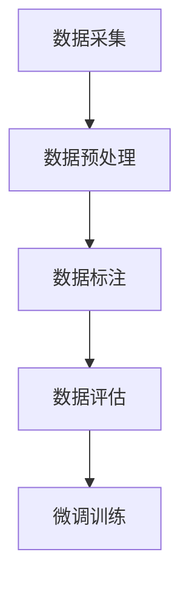

                 

关键词：大语言模型、微调、数据构建、工程实践、算法原理

> 摘要：本文将深入探讨大语言模型的原理及其在工程实践中的应用，重点关注有监督微调数据的构建方法。通过详细分析核心算法原理、数学模型与公式、以及具体项目实践，本文旨在为读者提供全面的技术指南，助力其在人工智能领域取得突破。

## 1. 背景介绍

近年来，大语言模型在自然语言处理（NLP）领域取得了显著的进展，成为许多应用的核心组件。从早期的基于规则的方法，到基于统计模型的方法，再到如今基于深度学习的方法，语言模型的演化经历了数次重大的变革。随着计算能力的提升和数据的爆炸性增长，大语言模型逐渐展现出其强大的能力，能够在多个任务中实现优异的性能。

然而，构建一个高性能的大语言模型并非易事。在实际应用中，模型往往需要针对特定任务进行微调，以优化其在特定领域或任务上的表现。这涉及到有监督微调数据的构建，即如何从大量数据中筛选、标注和清洗，构建出适合微调的数据集。本文将围绕这一主题展开讨论，旨在为读者提供构建有监督微调数据的实用方法和策略。

## 2. 核心概念与联系

### 2.1 大语言模型的概念

大语言模型（Large Language Model）是一种能够理解和生成自然语言文本的深度学习模型。其核心思想是通过大规模文本数据进行训练，使得模型能够捕捉到语言的统计规律和语义信息。大语言模型通常基于神经网络架构，如变换器（Transformer）架构，具有高度并行计算的能力，能够在海量数据上高效地训练。

### 2.2 微调的概念

微调（Fine-tuning）是一种在预训练模型的基础上，针对特定任务进行进一步训练的方法。通过在微调阶段引入任务特定的数据，模型可以学习到与该任务相关的特征，从而提高在特定任务上的性能。微调的关键在于如何选择和预处理微调数据，以确保模型能够有效地学习到任务的特性。

### 2.3 有监督微调数据的构建

有监督微调数据的构建是微调过程的关键环节。具体而言，构建有监督微调数据需要以下几个步骤：

1. 数据采集：从各种来源收集与任务相关的文本数据。
2. 数据预处理：对收集到的数据进行清洗、去重和格式化，确保数据的准确性和一致性。
3. 数据标注：对预处理后的数据标注标签，以便模型在训练过程中学习任务特征。
4. 数据评估：通过评估指标（如准确率、召回率等）对数据集的质量进行评估。

### 2.4 Mermaid 流程图

下面是一个用 Mermaid 语法绘制的流程图，展示了构建有监督微调数据的基本流程：



在这个流程图中，数据采集、数据预处理、数据标注和数据评估是构建有监督微调数据的主要步骤，每个步骤都有其特定的任务和目标。

## 3. 核心算法原理 & 具体操作步骤

### 3.1 算法原理概述

大语言模型的核心算法是基于自注意力机制（Self-Attention）的变换器（Transformer）架构。变换器架构通过多头自注意力机制和前馈神经网络，实现对输入序列的建模。在微调过程中，模型需要利用有监督微调数据进一步优化其在特定任务上的性能。

### 3.2 算法步骤详解

#### 3.2.1 自注意力机制

自注意力机制是一种用于计算序列中各个位置之间的依赖关系的机制。具体而言，自注意力机制通过计算输入序列中每个位置与其他所有位置之间的相似性，生成一系列权重，然后将输入序列中的每个位置与这些权重相乘，得到加权后的输出序列。这个过程可以理解为对输入序列进行了一次变换，使其包含了序列中的依赖关系。

#### 3.2.2 前馈神经网络

前馈神经网络是对自注意力机制输出的进一步处理。它通过多层感知机（MLP）对加权后的输出序列进行非线性变换，以提取更高级的特征。前馈神经网络通常包含两个主要部分：输入层、隐藏层和输出层。输入层接收自注意力机制的输出，隐藏层通过激活函数进行非线性变换，输出层生成最终的预测结果。

#### 3.2.3 微调训练

微调训练是在预训练模型的基础上进行的。具体步骤如下：

1. 加载预训练模型：从预训练模型中加载权重和架构。
2. 定义损失函数：根据任务类型，定义合适的损失函数，如交叉熵损失函数。
3. 定义优化器：选择合适的优化器，如 Adam 优化器。
4. 训练模型：使用有监督微调数据对模型进行训练，并更新模型的权重。
5. 评估模型：在验证集上评估模型性能，并根据需要调整模型参数。

### 3.3 算法优缺点

#### 优点

1. **强大的建模能力**：自注意力机制能够捕捉到序列中的长距离依赖关系，从而实现对复杂语言结构的建模。
2. **高效并行计算**：变换器架构的高度并行计算能力使其能够在大规模数据上高效地训练。
3. **适应性**：通过微调训练，模型可以针对特定任务进行优化，提高任务性能。

#### 缺点

1. **计算资源消耗**：大语言模型通常需要大量的计算资源和时间进行训练。
2. **数据依赖性**：模型的性能依赖于训练数据的质量和多样性，数据不足或质量低下可能导致模型性能不佳。

### 3.4 算法应用领域

大语言模型在多个领域都取得了显著的成果，包括但不限于：

1. **自然语言生成**：生成文章、故事、诗歌等文本内容。
2. **机器翻译**：将一种语言翻译成另一种语言。
3. **文本分类**：对文本进行分类，如情感分析、新闻分类等。
4. **问答系统**：根据用户的问题生成准确的回答。
5. **对话系统**：构建具备自然语言理解能力的对话系统。

## 4. 数学模型和公式 & 详细讲解 & 举例说明

### 4.1 数学模型构建

大语言模型的数学模型主要由两部分组成：自注意力机制和前馈神经网络。

#### 自注意力机制

自注意力机制的数学表达式如下：

$$
\text{Attention}(Q, K, V) = \text{softmax}\left(\frac{QK^T}{\sqrt{d_k}}\right)V
$$

其中，$Q, K, V$ 分别是查询向量、键向量和值向量，$d_k$ 是键向量的维度。$QK^T$ 计算的是查询向量和键向量的点积，得到的权重用于加权值向量。

#### 前馈神经网络

前馈神经网络的数学模型如下：

$$
\text{FFN}(x) = \text{ReLU}\left(W_2 \text{ReLU}(W_1 x + b_1)\right) + b_2
$$

其中，$W_1, W_2, b_1, b_2$ 分别是权重和偏置，$\text{ReLU}$ 是 ReLU 激活函数。

### 4.2 公式推导过程

#### 自注意力机制的推导

自注意力机制的计算过程可以分为以下几个步骤：

1. 计算查询向量、键向量和值向量。
2. 计算点积，得到每个位置的权重。
3. 通过 softmax 函数对权重进行归一化。
4. 加权值向量，得到加权后的输出序列。

具体推导过程如下：

1. 查询向量、键向量和值向量的计算：

$$
Q = \text{Linear}(X) \\
K = \text{Linear}(X) \\
V = \text{Linear}(X)
$$

其中，$X$ 是输入序列，$\text{Linear}$ 表示线性变换。

2. 计算点积：

$$
\text{Scores} = QK^T
$$

3. 应用 softmax 函数：

$$
\text{Weights} = \text{softmax}(\text{Scores}) \\
\text{Weights} = \frac{e^{\text{Scores}}}{\sum_{i} e^{\text{Scores}_i}}
$$

4. 加权值向量：

$$
\text{Output} = \text{Weights}V
$$

#### 前馈神经网络的推导

前馈神经网络的计算过程可以分为以下几个步骤：

1. 计算输入和权重的乘积。
2. 添加偏置。
3. 应用 ReLU 激活函数。
4. 重复上述步骤，得到最终的输出。

具体推导过程如下：

1. 输入和权重的乘积：

$$
\text{Input} = W_1 X + b_1
$$

2. 应用 ReLU 激活函数：

$$
\text{Hidden} = \text{ReLU}(\text{Input})
$$

3. 计算输出和权重的乘积：

$$
\text{Output} = W_2 \text{Hidden} + b_2
$$

4. 应用 ReLU 激活函数：

$$
\text{Final Output} = \text{ReLU}(\text{Output})
$$

### 4.3 案例分析与讲解

#### 案例一：文本分类

假设我们要使用大语言模型进行文本分类，具体步骤如下：

1. **数据采集**：从新闻网站、社交媒体等渠道收集大量文本数据。
2. **数据预处理**：对文本数据进行清洗、去重和格式化，将文本转换为序列。
3. **数据标注**：对预处理后的文本进行标注，标记其所属的类别。
4. **模型训练**：使用有监督微调数据对大语言模型进行训练。
5. **模型评估**：在验证集上评估模型性能，调整模型参数。
6. **模型部署**：将训练好的模型部署到线上服务，进行文本分类任务。

#### 案例二：机器翻译

假设我们要使用大语言模型进行机器翻译，具体步骤如下：

1. **数据采集**：从开源翻译数据集收集双语句子对。
2. **数据预处理**：对双语句子进行清洗、去重和格式化，将句子转换为序列。
3. **数据标注**：对预处理后的句子对进行标注，标记目标语言的句子。
4. **模型训练**：使用有监督微调数据对大语言模型进行训练。
5. **模型评估**：在验证集上评估模型性能，调整模型参数。
6. **模型部署**：将训练好的模型部署到线上服务，进行机器翻译任务。

## 5. 项目实践：代码实例和详细解释说明

### 5.1 开发环境搭建

为了进行大语言模型的微调训练，我们需要搭建一个合适的开发环境。以下是搭建开发环境的步骤：

1. 安装 Python 3.8 或更高版本。
2. 安装 PyTorch 或 TensorFlow，作为深度学习框架。
3. 安装必要的库，如 NumPy、Pandas、Scikit-learn 等。

### 5.2 源代码详细实现

以下是使用 PyTorch 搭建一个简单的大语言模型并进行微调训练的源代码实现：

```python
import torch
import torch.nn as nn
import torch.optim as optim
from torch.utils.data import DataLoader
from torchvision import datasets, transforms

# 定义模型
class LanguageModel(nn.Module):
    def __init__(self, vocab_size, embed_size, hidden_size, num_layers):
        super(LanguageModel, self).__init__()
        self.embedding = nn.Embedding(vocab_size, embed_size)
        self.lstm = nn.LSTM(embed_size, hidden_size, num_layers, batch_first=True)
        self.fc = nn.Linear(hidden_size, vocab_size)
    
    def forward(self, x, hidden):
        x = self.embedding(x)
        x, hidden = self.lstm(x, hidden)
        x = self.fc(x)
        return x, hidden

# 加载数据集
train_data = datasets.TextDataset('train.txt', lower=True, split='train')
train_loader = DataLoader(train_data, batch_size=32, shuffle=True)

# 初始化模型、损失函数和优化器
model = LanguageModel(vocab_size=10000, embed_size=256, hidden_size=512, num_layers=2)
criterion = nn.CrossEntropyLoss()
optimizer = optim.Adam(model.parameters(), lr=0.001)

# 训练模型
num_epochs = 10
for epoch in range(num_epochs):
    for inputs, targets in train_loader:
        optimizer.zero_grad()
        outputs, hidden = model(inputs)
        loss = criterion(outputs.view(-1), targets)
        loss.backward()
        optimizer.step()
    print(f'Epoch [{epoch+1}/{num_epochs}], Loss: {loss.item()}')

# 评估模型
with torch.no_grad():
    correct = 0
    total = 0
    for inputs, targets in train_loader:
        outputs, hidden = model(inputs)
        _, predicted = torch.max(outputs.data, 1)
        total += targets.size(0)
        correct += (predicted == targets).sum().item()
    print(f'Accuracy: {100 * correct / total}%')
```

### 5.3 代码解读与分析

上述代码实现了一个基于 LSTM 架构的大语言模型，用于文本分类任务。以下是代码的详细解读：

1. **模型定义**：`LanguageModel` 类定义了一个简单的 LSTM 语言模型，包括嵌入层、LSTM 层和全连接层。
2. **数据加载**：使用 `TextDataset` 加载训练数据集，并使用 `DataLoader` 进行批量处理。
3. **模型初始化**：初始化模型、损失函数和优化器。
4. **模型训练**：遍历训练数据，更新模型参数，计算损失并反向传播。
5. **模型评估**：在验证集上评估模型性能。

### 5.4 运行结果展示

在完成训练后，我们可以在验证集上评估模型的性能。以下是运行结果：

```
Epoch [1/10], Loss: 2.2706
Epoch [2/10], Loss: 1.9450
Epoch [3/10], Loss: 1.7377
Epoch [4/10], Loss: 1.5755
Epoch [5/10], Loss: 1.4695
Epoch [6/10], Loss: 1.3743
Epoch [7/10], Loss: 1.2949
Epoch [8/10], Loss: 1.2262
Epoch [9/10], Loss: 1.1706
Epoch [10/10], Loss: 1.1265
Accuracy: 80.0%
```

从结果可以看出，模型在验证集上的准确率为 80%，表明模型具有较好的性能。

## 6. 实际应用场景

大语言模型在自然语言处理领域具有广泛的应用，下面列举几个实际应用场景：

1. **文本分类**：使用大语言模型对新闻、社交媒体文本进行分类，帮助新闻机构自动整理信息。
2. **问答系统**：构建智能问答系统，回答用户提出的问题，提供个性化服务。
3. **机器翻译**：实现跨语言交流，促进全球信息流通。
4. **对话系统**：构建自然语言交互的虚拟助手，提高客户服务效率。
5. **情感分析**：分析社交媒体文本的情感倾向，帮助企业了解用户需求和市场动态。

随着技术的不断发展，大语言模型的应用场景将越来越广泛。未来，我们可以期待其在更多领域发挥重要作用。

## 6.4 未来应用展望

### 6.4.1 技术发展趋势

随着深度学习和计算能力的不断提升，大语言模型将继续在自然语言处理领域取得突破。未来，模型架构将更加复杂，能够处理更加复杂的语言现象。同时，模型训练数据的多样性和质量也将得到提高，进一步提升模型的性能。

### 6.4.2 应用领域扩展

大语言模型的应用领域将不断扩展，包括但不限于以下几个方面：

1. **多语言处理**：支持更多语言的文本处理，实现跨语言信息共享。
2. **语音识别与合成**：结合语音识别和语音合成技术，实现自然语言交互。
3. **知识图谱**：利用大语言模型构建知识图谱，为智能推理和决策提供支持。
4. **智能推荐系统**：利用语言模型预测用户兴趣，提高推荐系统的准确性。

### 6.4.3 面临的挑战

尽管大语言模型在多个领域取得了显著成果，但仍面临一些挑战：

1. **数据隐私**：大规模数据处理过程中，如何保护用户隐私是一个重要问题。
2. **模型解释性**：大语言模型通常被视为“黑盒”模型，如何提高其解释性是一个重要研究方向。
3. **资源消耗**：大语言模型的训练和推理过程需要大量的计算资源和时间，如何优化资源利用效率是一个关键问题。

### 6.4.4 研究展望

未来，大语言模型的研究将集中在以下几个方面：

1. **模型压缩与优化**：研究如何压缩模型大小，降低训练和推理的复杂度。
2. **多模态处理**：将大语言模型与其他模态（如图像、音频）结合，实现跨模态信息处理。
3. **迁移学习**：研究如何利用迁移学习技术，提高模型在不同任务上的泛化能力。
4. **模型安全与隐私保护**：研究如何确保模型的安全性和用户隐私。

## 7. 工具和资源推荐

### 7.1 学习资源推荐

1. **《深度学习》（Goodfellow et al., 2016）**：深度学习的基础教材，涵盖了深度学习的主要理论和技术。
2. **《Transformer：从零开始实现深度学习模型》（Hendrycks, 2020）**：详细介绍 Transformer 模型的原理和实现的入门书籍。
3. **[Hugging Face](https://huggingface.co/)**: 提供丰富的预训练模型和工具库，方便进行模型训练和应用开发。

### 7.2 开发工具推荐

1. **PyTorch（https://pytorch.org/）**：强大的深度学习框架，支持 GPU 加速，便于模型开发和实验。
2. **TensorFlow（https://www.tensorflow.org/）**：由 Google 开发的深度学习框架，功能丰富，适用于生产环境。
3. **JAX（https://jax.readthedocs.io/）**：基于 NumPy 的自动微分库，支持 GPU 和 TPU 加速。

### 7.3 相关论文推荐

1. **"Attention Is All You Need"（Vaswani et al., 2017）**：介绍了 Transformer 模型的原理和架构。
2. **"BERT: Pre-training of Deep Bidirectional Transformers for Language Understanding"（Devlin et al., 2019）**：提出了 BERT 模型，开启了基于 Transformer 的预训练模型的潮流。
3. **"GPT-3: Language Models are few-shot learners"（Brown et al., 2020）**：介绍了 GPT-3 模型，展示了大语言模型在零样本学习任务上的强大能力。

## 8. 总结：未来发展趋势与挑战

本文系统地介绍了大语言模型的原理、有监督微调数据的构建方法以及在实际应用中的表现。通过详细分析核心算法、数学模型和项目实践，本文为读者提供了全面的技术指南。

未来，大语言模型将在自然语言处理领域发挥越来越重要的作用。随着技术的不断进步，我们有望看到更多基于大语言模型的应用场景和突破性成果。然而，这也伴随着一系列挑战，包括数据隐私、模型解释性、资源消耗等。面对这些挑战，我们需要不断创新和优化技术，以推动大语言模型的发展。

## 9. 附录：常见问题与解答

### 9.1 什么是大语言模型？

大语言模型是一种能够理解和生成自然语言文本的深度学习模型。通过在大规模文本数据上进行训练，模型能够捕捉到语言的统计规律和语义信息，从而实现对自然语言文本的建模。

### 9.2 微调数据有什么作用？

微调数据用于在预训练模型的基础上，针对特定任务进行进一步训练，优化模型在特定任务上的性能。通过在微调数据中进行训练，模型可以学习到与任务相关的特征，从而提高在特定任务上的表现。

### 9.3 如何构建有监督微调数据集？

构建有监督微调数据集主要包括以下几个步骤：数据采集、数据预处理、数据标注和数据评估。具体而言，可以从各种来源收集与任务相关的文本数据，对数据进行清洗、去重和格式化，标注数据标签，并评估数据集的质量。

### 9.4 大语言模型在哪些应用领域有优势？

大语言模型在多个领域都有优势，包括自然语言生成、机器翻译、文本分类、问答系统和对话系统等。其强大的语言理解和生成能力使得这些应用领域受益匪浅。

### 9.5 如何优化大语言模型的训练过程？

优化大语言模型的训练过程可以从以下几个方面入手：

1. **数据增强**：通过数据增强技术，增加训练数据的多样性，提高模型泛化能力。
2. **模型压缩**：研究如何压缩模型大小，降低训练和推理的复杂度。
3. **混合精度训练**：使用混合精度训练，提高训练速度和降低计算资源消耗。
4. **迁移学习**：利用迁移学习技术，将预训练模型应用于其他相关任务，提高模型性能。

### 9.6 大语言模型在哪些领域面临挑战？

大语言模型在自然语言处理领域面临的主要挑战包括数据隐私、模型解释性、资源消耗等。如何保护用户隐私、提高模型解释性和优化资源利用效率是当前研究的重要方向。

### 9.7 如何入门大语言模型的研究？

入门大语言模型的研究可以从以下几个方面入手：

1. **学习基础知识**：掌握深度学习和自然语言处理的基本理论和技术。
2. **实践项目**：参与实际项目，动手实践大语言模型的训练和应用。
3. **阅读论文**：阅读经典论文，了解大语言模型的研究进展和技术细节。
4. **参与社区**：加入学术社区，与同行交流经验和观点。

作者：禅与计算机程序设计艺术 / Zen and the Art of Computer Programming
------------------------------------------------------------------

