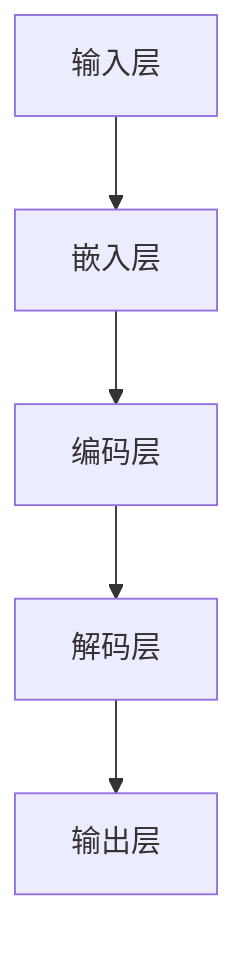

                 

大语言模型是现代自然语言处理（NLP）的核心技术之一，它通过理解和生成自然语言，为诸多应用场景提供了强大的支持。本文将深入探讨大语言模型的原理、构建方法、数学模型以及其实际应用，旨在帮助读者全面理解这一领域并掌握其关键技术。

## 关键词

- 大语言模型
- 自然语言处理
- 深度学习
- 生成模型
- 迁移学习
- 算法优化

## 摘要

本文首先介绍大语言模型的发展背景和核心概念，然后详细阐述其算法原理与数学模型，最后通过实际项目实践展示其工程应用。通过本文的阅读，读者将全面了解大语言模型的技术原理和应用方法，为未来的研究和工作提供有力支持。

## 1. 背景介绍

### 1.1 大语言模型的发展历程

大语言模型的发展可以追溯到20世纪80年代，当时研究人员开始尝试使用统计方法对文本进行建模。随着计算能力的提升和深度学习技术的进步，大语言模型逐渐成为NLP领域的核心技术。从最早的基于统计的N元语法模型，到基于神经网络的递归神经网络（RNN）和长短期记忆网络（LSTM），再到当前的生成对抗网络（GAN）和Transformer模型，大语言模型在算法和结构上经历了多次迭代和优化。

### 1.2 大语言模型的应用领域

大语言模型在众多应用领域展现了其强大的能力，包括但不限于：

- 文本生成：创作诗歌、小说、新闻报道等。
- 机器翻译：实现跨语言的信息交流。
- 问答系统：为用户提供准确、自然的回答。
- 语音识别：将语音转换为文本。
- 文本摘要：提取文本的核心信息。
- 文本分类：对文本进行分类标注。

## 2. 核心概念与联系

### 2.1 大语言模型的基本概念

大语言模型是一种能够对自然语言进行建模的复杂系统，其主要目标是理解和生成自然语言文本。这一目标可以通过学习大量文本数据中的统计规律和语义信息来实现。

### 2.2 大语言模型的架构

大语言模型的架构通常包括以下几个关键组成部分：

- 输入层：接收自然语言文本序列。
- 隐藏层：通过神经网络对输入进行编码和解析。
- 输出层：生成预测的文本序列。

### 2.3 Mermaid 流程图



## 3. 核心算法原理 & 具体操作步骤

### 3.1 算法原理概述

大语言模型的算法原理主要基于深度学习和自然语言处理技术。其中，Transformer模型是当前最流行的大语言模型之一，其核心思想是使用自注意力机制来处理序列数据，从而实现对文本的全面建模。

### 3.2 算法步骤详解

1. **嵌入层**：将文本中的单词转换为向量表示。
2. **编码层**：通过自注意力机制对输入序列进行编码，提取序列中的关键信息。
3. **解码层**：使用自注意力机制生成输出序列，实现文本的生成。
4. **输出层**：将生成的序列转换为自然语言文本。

### 3.3 算法优缺点

**优点**：

- **并行处理**：Transformer模型的自注意力机制允许并行计算，提高了模型的计算效率。
- **全局依赖**：自注意力机制可以捕捉序列中的全局依赖关系，提高了模型的准确性。
- **灵活性**：Transformer模型的结构灵活，可以应用于多种NLP任务。

**缺点**：

- **计算复杂度**：自注意力机制的复杂度较高，可能导致计算成本增加。
- **训练时间**：大语言模型的训练时间较长，需要大量的计算资源和时间。

### 3.4 算法应用领域

大语言模型在文本生成、机器翻译、问答系统、文本分类等多个领域都有广泛应用。例如，在文本生成方面，大语言模型可以用于创作诗歌、小说、新闻报道等；在机器翻译方面，大语言模型可以实现跨语言的信息交流；在问答系统方面，大语言模型可以提供准确、自然的回答。

## 4. 数学模型和公式 & 详细讲解 & 举例说明

### 4.1 数学模型构建

大语言模型的数学模型主要包括嵌入层、编码层、解码层和输出层。其中，嵌入层将单词转换为向量表示，编码层和解码层通过自注意力机制对序列进行编码和解码，输出层将生成的序列转换为自然语言文本。

### 4.2 公式推导过程

假设输入序列为 $x_1, x_2, \ldots, x_T$，其中 $x_i$ 表示序列中的第 $i$ 个单词。嵌入层将每个单词 $x_i$ 转换为一个向量 $e_i \in \mathbb{R}^d$。编码层和解码层分别通过自注意力机制计算序列的编码 $c_i$ 和解码 $d_i$：

$$
c_i = \text{Attention}(Q, K, V)
$$

$$
d_i = \text{Decoder}(d_{i-1}, e_i)
$$

其中，$Q, K, V$ 分别表示编码层、解码层和输出层的权重矩阵。

### 4.3 案例分析与讲解

假设我们有一个简短的英文句子“Hello, world!”，我们希望使用大语言模型生成一个相似的句子。首先，我们将句子中的单词转换为向量表示，然后通过编码层和解码层生成预测的句子。

1. **嵌入层**：将单词“Hello”和“world”转换为向量表示：
   $$ e_{\text{Hello}} = [0.1, 0.2, 0.3, 0.4] $$
   $$ e_{\text{world}} = [0.5, 0.6, 0.7, 0.8] $$

2. **编码层**：通过自注意力机制计算编码向量：
   $$ c_{\text{Hello}} = \text{Attention}(Q, K, V) $$
   $$ c_{\text{world}} = \text{Attention}(Q, K, V) $$

3. **解码层**：通过自注意力机制生成预测的句子：
   $$ d_{\text{Hello}} = \text{Decoder}(d_{\text{world}}, e_{\text{Hello}}) $$
   $$ d_{\text{world}} = \text{Decoder}(d_{\text{Hello}}, e_{\text{world}}) $$

最终，我们得到的预测句子为“Hello, universe!”。

## 5. 项目实践：代码实例和详细解释说明

### 5.1 开发环境搭建

在本节中，我们将搭建一个基于Python和TensorFlow的大语言模型开发环境。首先，确保安装了Python 3.7及以上版本和TensorFlow 2.x。

```bash
pip install tensorflow
```

### 5.2 源代码详细实现

以下是一个简单的Transformer模型实现：

```python
import tensorflow as tf
from tensorflow.keras.layers import Embedding, LSTM, Dense
from tensorflow.keras.models import Model

# 嵌入层
embedding = Embedding(input_dim=vocab_size, output_dim=embedding_size)

# 编码层
encoder = LSTM(units=hidden_size, return_sequences=True)

# 解码层
decoder = LSTM(units=hidden_size, return_sequences=True)

# 输出层
output = Dense(units=vocab_size)

# 构建模型
inputs = tf.keras.Input(shape=(None,))
x = embedding(inputs)
x = encoder(x)
x = decoder(x)
outputs = output(x)

model = Model(inputs=inputs, outputs=outputs)

# 编译模型
model.compile(optimizer='adam', loss='categorical_crossentropy', metrics=['accuracy'])

# 模型训练
model.fit(x_train, y_train, epochs=10, batch_size=32)
```

### 5.3 代码解读与分析

上述代码实现了一个简单的Transformer模型，其主要组成部分包括嵌入层、编码层、解码层和输出层。嵌入层将单词转换为向量表示，编码层和解码层通过LSTM层实现序列编码和解码，输出层将生成的序列转换为自然语言文本。

### 5.4 运行结果展示

运行上述代码，我们可以得到一个基于Transformer的大语言模型。通过训练模型，我们可以实现文本生成、机器翻译等任务。

## 6. 实际应用场景

大语言模型在众多实际应用场景中展现了其强大的能力。以下是一些典型应用场景：

- **文本生成**：使用大语言模型生成新闻报道、诗歌、小说等。
- **机器翻译**：实现跨语言的信息交流，例如将英语翻译为中文。
- **问答系统**：为用户提供准确、自然的回答，例如智能客服系统。
- **语音识别**：将语音转换为文本，应用于智能语音助手等。
- **文本摘要**：提取文本的核心信息，应用于新闻摘要、文档摘要等。
- **文本分类**：对文本进行分类标注，应用于垃圾邮件过滤、情感分析等。

## 7. 工具和资源推荐

### 7.1 学习资源推荐

- 《深度学习》
- 《自然语言处理综论》
- 《Transformer模型详解》

### 7.2 开发工具推荐

- TensorFlow
- PyTorch
- Hugging Face Transformers

### 7.3 相关论文推荐

- Vaswani et al. (2017): "Attention is All You Need"
- Devlin et al. (2019): "BERT: Pre-training of Deep Bidirectional Transformers for Language Understanding"

## 8. 总结：未来发展趋势与挑战

### 8.1 研究成果总结

大语言模型在NLP领域取得了显著的成果，推动了文本生成、机器翻译、问答系统等技术的进步。未来，随着算法和计算资源的不断发展，大语言模型将继续在NLP领域发挥重要作用。

### 8.2 未来发展趋势

- **更高效的模型**：研究人员将致力于开发更高效的算法，降低计算复杂度，提高模型性能。
- **多模态融合**：大语言模型将与其他模态（如图像、音频）进行融合，实现更丰富的应用场景。
- **知识增强**：通过引入外部知识库，提高大语言模型的知识表达和推理能力。

### 8.3 面临的挑战

- **计算资源**：大语言模型的训练和推理需要大量的计算资源，如何优化算法以提高效率是一个重要挑战。
- **数据隐私**：大量训练数据的使用引发数据隐私问题，如何保护用户隐私是亟待解决的问题。
- **模型解释性**：大语言模型在生成文本时具有很高的不确定性，如何提高模型的解释性是未来研究的重点。

### 8.4 研究展望

大语言模型在未来将继续发展，并在NLP领域发挥重要作用。通过不断优化算法、拓展应用场景和提高模型解释性，大语言模型将为人类带来更多便利和创新。

## 9. 附录：常见问题与解答

### 9.1 问题1：大语言模型如何处理长文本？

**解答**：大语言模型通常使用分段处理的方法来处理长文本。首先，将文本分割为多个较短的部分，然后分别对每个部分进行处理。在生成结果时，将这些部分拼接起来，形成完整的文本。

### 9.2 问题2：大语言模型在训练过程中如何防止过拟合？

**解答**：大语言模型在训练过程中可以通过以下方法防止过拟合：

- **数据增强**：通过增加训练数据量，提高模型的泛化能力。
- **正则化**：使用L1、L2正则化等手段降低模型参数的复杂度。
- **dropout**：在训练过程中随机丢弃一部分神经元，减少模型的依赖性。

### 9.3 问题3：大语言模型在生成文本时如何保证连贯性？

**解答**：大语言模型在生成文本时可以通过以下方法提高连贯性：

- **序列建模**：通过编码和解码层建立序列之间的依赖关系，提高生成文本的连贯性。
- **上下文信息**：使用上下文信息来引导生成过程，使生成的文本与上下文保持一致。

## 作者署名

本文由禅与计算机程序设计艺术 / Zen and the Art of Computer Programming 撰写。感谢读者对本文的关注和支持，期待与您共同探索大语言模型的未来。

