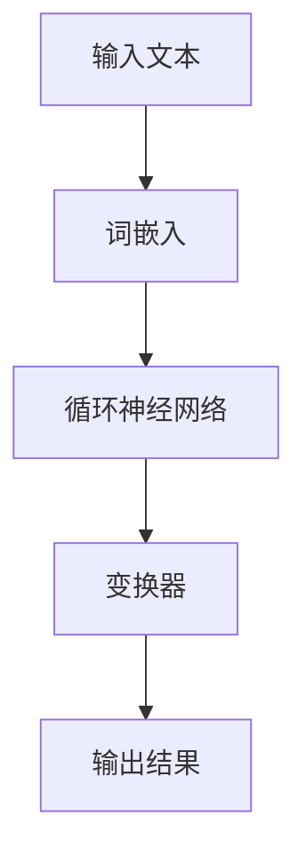

                 

关键词：大语言模型、评测任务、深度学习、神经网络、自然语言处理、工程实践、算法原理

## 摘要

本文旨在深入探讨大语言模型的原理与工程实践，特别是评测任务的相关内容。我们将从背景介绍、核心概念与联系、核心算法原理、数学模型和公式、项目实践、实际应用场景、未来应用展望、工具和资源推荐以及未来发展趋势与挑战等方面，全面解析大语言模型的技术框架和应用前景。希望通过本文的阐述，能够为读者提供对大语言模型及其评测任务的全面理解和实践指导。

## 1. 背景介绍

随着互联网的迅猛发展和大数据时代的到来，自然语言处理（NLP）成为了计算机科学领域的重要研究方向。自然语言处理技术的进步，使得计算机能够更好地理解和生成人类语言，从而为各个行业提供了强大的技术支持。在这一背景下，大语言模型（Large Language Model）应运而生。

大语言模型是一种基于深度学习技术的语言模型，通过学习海量文本数据，模型可以自动地学习语言的统计规律和语义信息，从而实现高精度的语言理解和生成。与传统的小型语言模型相比，大语言模型具有更高的参数规模、更强的表示能力和更广阔的应用领域。

评测任务在大语言模型的研究和应用中具有重要地位。通过评测任务，我们可以衡量模型的性能和效果，从而指导模型的设计和优化。常见的评测任务包括语言理解评测（LUIS）、语言生成评测（LGSM）、语言分类评测（LCLASS）等。

本文将首先介绍大语言模型的基本原理和架构，然后深入探讨评测任务的类型、指标和方法。通过本文的阅读，读者将能够全面了解大语言模型及其评测任务的原理和实践，为后续的研究和应用打下坚实基础。

## 2. 核心概念与联系

### 大语言模型

大语言模型是一种基于深度学习技术的自然语言处理模型，通过学习海量文本数据，模型可以自动地学习语言的统计规律和语义信息。大语言模型的核心组成部分包括：

- **词嵌入（Word Embedding）**：将词汇映射为高维向量，以便于深度学习模型进行处理。
- **循环神经网络（RNN）**：用于处理序列数据，能够捕获文本的长期依赖关系。
- **变换器（Transformer）**：一种基于自注意力机制的深度学习模型，能够高效地处理长文本数据。

### 深度学习

深度学习是一种基于多层神经网络的学习方法，通过逐层抽象和表示数据特征，实现高层次的认知任务。深度学习在自然语言处理领域取得了显著成果，推动了语言模型的快速发展。

### 神经网络

神经网络是一种模仿生物神经系统结构的计算模型，通过神经元之间的连接和激活函数，实现数据的输入、处理和输出。神经网络在深度学习模型中扮演着核心角色，通过不断调整参数，实现复杂函数的拟合和优化。

### 自然语言处理

自然语言处理（NLP）是计算机科学领域的重要研究方向，旨在让计算机理解和生成人类语言。NLP技术包括文本预处理、词嵌入、语言模型、文本分类、机器翻译等多个方面。

### 工程实践

工程实践是将理论研究转化为实际应用的过程，涉及模型的训练、优化、部署和运维等多个环节。在大语言模型的研究和应用中，工程实践至关重要，能够确保模型的高效、稳定和可靠运行。

### Mermaid 流程图

下面是一个描述大语言模型架构的 Mermaid 流程图：



## 3. 核心算法原理 & 具体操作步骤

### 3.1 算法原理概述

大语言模型的算法原理主要包括以下几个关键步骤：

1. **数据预处理**：将原始文本数据进行分词、去噪、标准化等处理，生成可供训练的数据集。
2. **词嵌入**：将文本中的词汇映射为高维向量，为后续的神经网络处理提供输入。
3. **神经网络训练**：使用循环神经网络或变换器等深度学习模型，对词嵌入向量进行训练，优化模型的参数。
4. **模型评估**：通过评测任务对模型的性能进行评估，包括语言理解评测、语言生成评测和语言分类评测等。
5. **模型部署**：将训练好的模型部署到实际应用场景中，实现自动化语言处理任务。

### 3.2 算法步骤详解

1. **数据预处理**：
   - **分词**：将文本分割为词汇序列，可以使用分词工具（如jieba）进行快速分词。
   - **去噪**：去除文本中的无关信息（如标点符号、停用词等），提高模型的训练效率。
   - **标准化**：对文本进行统一格式处理，如将全角字符转换为半角字符、统一编码等。

2. **词嵌入**：
   - **词表构建**：建立词汇表，将文本中的词汇映射为唯一的索引。
   - **向量表示**：将词汇索引映射为高维向量，可以使用预训练的词嵌入模型（如Word2Vec、GloVe）或自定义的词嵌入模型。

3. **神经网络训练**：
   - **循环神经网络**：使用RNN模型处理序列数据，通过隐藏状态和输出状态，实现文本的编码和解码。
   - **变换器**：采用自注意力机制，对文本序列进行全局编码，实现高效、准确的语言表示。

4. **模型评估**：
   - **语言理解评测**：通过机器阅读理解、问答系统等任务，评估模型对文本的理解能力。
   - **语言生成评测**：通过文本生成、摘要生成等任务，评估模型的语言生成能力。
   - **语言分类评测**：通过文本分类、情感分析等任务，评估模型对文本的分类能力。

5. **模型部署**：
   - **模型压缩**：通过模型压缩技术（如量化、剪枝等），降低模型的计算复杂度和存储占用。
   - **服务化部署**：将模型部署到云计算平台，实现自动化语言处理任务。

### 3.3 算法优缺点

**优点**：

- **高精度**：大语言模型通过学习海量文本数据，能够实现高精度的语言理解和生成。
- **泛化能力**：模型具有强大的泛化能力，可以应用于多种语言处理任务。
- **灵活性**：大语言模型可以针对不同的应用场景进行定制和优化。

**缺点**：

- **计算资源消耗**：大语言模型需要大量的计算资源和存储空间。
- **训练时间较长**：模型训练时间较长，需要较长时间才能收敛到最佳效果。
- **数据依赖性**：模型的性能高度依赖训练数据的质量和数量。

### 3.4 算法应用领域

大语言模型在自然语言处理领域具有广泛的应用，包括：

- **机器阅读理解**：通过问答系统、阅读理解等任务，实现智能客服、智能助理等应用。
- **文本生成**：通过文本生成、摘要生成等任务，实现文章撰写、摘要提取等应用。
- **文本分类**：通过文本分类、情感分析等任务，实现新闻分类、舆情分析等应用。
- **语音识别**：结合语音识别技术，实现语音转文字、语音搜索等应用。

## 4. 数学模型和公式 & 详细讲解 & 举例说明

### 4.1 数学模型构建

大语言模型的数学模型主要基于深度学习技术，包括词嵌入、循环神经网络（RNN）和变换器（Transformer）等。

- **词嵌入**：词嵌入是将词汇映射为高维向量的过程，可以使用预训练的词嵌入模型（如Word2Vec、GloVe）或自定义的词嵌入模型。词嵌入的数学模型可以表示为：

  $$ \text{word\_embedding}(word) = \text{vec}(word) $$

  其中，$\text{vec}(word)$ 表示词汇 $word$ 的向量表示。

- **循环神经网络（RNN）**：RNN 是一种用于处理序列数据的神经网络，其数学模型可以表示为：

  $$ \text{RNN}(x_t, h_{t-1}) = h_t $$

  其中，$x_t$ 表示当前输入序列的元素，$h_{t-1}$ 表示前一个时间步的隐藏状态，$h_t$ 表示当前时间步的隐藏状态。

- **变换器（Transformer）**：变换器是一种基于自注意力机制的深度学习模型，其数学模型可以表示为：

  $$ \text{Transformer}(x) = \text{softmax}\left(\frac{\text{Q} \cdot \text{K}^T}{\sqrt{d_k}}\right) \cdot \text{V} $$

  其中，$x$ 表示输入序列，$\text{Q}$、$\text{K}$ 和 $\text{V}$ 分别表示查询序列、键序列和值序列，$d_k$ 表示键序列的维度，$\text{softmax}$ 表示 Softmax 函数。

### 4.2 公式推导过程

以下是对变换器（Transformer）模型核心公式——自注意力机制（Self-Attention）的推导过程：

1. **自注意力分数**：

   自注意力分数可以表示为：

   $$ \text{Score}_{ij} = \text{Q}_i \cdot \text{K}_j $$

   其中，$\text{Q}_i$ 和 $\text{K}_j$ 分别表示查询序列和键序列的元素。

2. **缩放因子**：

   为了防止分数过大或过小，通常使用缩放因子对自注意力分数进行缩放：

   $$ \text{Scale}_{ij} = \frac{\text{Score}_{ij}}{\sqrt{d_k}} $$

   其中，$d_k$ 表示键序列的维度。

3. **Softmax 函数**：

   将缩放后的自注意力分数进行 Softmax 处理，得到概率分布：

   $$ \text{Probability}_{ij} = \text{softmax}(\text{Scale}_{ij}) $$

4. **加权求和**：

   最后，将概率分布与值序列进行加权求和，得到自注意力输出：

   $$ \text{Attention}_{i} = \sum_{j=1}^{N} \text{Probability}_{ij} \cdot \text{V}_j $$

   其中，$N$ 表示序列长度，$\text{V}_j$ 表示值序列的元素。

### 4.3 案例分析与讲解

以下是一个简单的案例，展示如何使用变换器（Transformer）模型进行文本分类任务：

1. **数据集准备**：

   假设我们有一个包含政治、经济、科技等类别的新闻数据集，每个新闻文本的长度为100个词汇。

2. **词嵌入**：

   将新闻文本中的每个词汇映射为词嵌入向量，假设词汇表大小为10000，词嵌入向量的维度为256。

3. **变换器模型**：

   定义一个包含多头自注意力机制的变换器模型，模型参数如下：

   - 层数：3
   - 每层头数：8
   - 词嵌入维度：256
   - 隐藏层维度：512

4. **模型训练**：

   使用训练数据集对变换器模型进行训练，优化模型参数。训练过程采用反向传播算法，通过梯度下降优化模型。

5. **模型评估**：

   使用测试数据集对训练好的模型进行评估，计算模型在各类别上的准确率、召回率和F1值等指标。

6. **模型部署**：

   将训练好的模型部署到实际应用场景中，实现自动化文本分类任务。

## 5. 项目实践：代码实例和详细解释说明

### 5.1 开发环境搭建

在进行大语言模型的开发之前，需要搭建相应的开发环境。以下是一个基于Python的示例环境搭建步骤：

1. 安装Python：确保系统中安装了Python 3.7及以上版本。
2. 安装依赖库：使用pip命令安装transformers、torch等依赖库。

   ```bash
   pip install transformers torch
   ```

3. 准备数据集：下载并解压一个新闻数据集，如AG News数据集。

### 5.2 源代码详细实现

以下是一个简单的文本分类项目，实现步骤如下：

1. **数据预处理**：

   ```python
   from transformers import AutoTokenizer
   from torch.utils.data import DataLoader
   import torch

   # 加载预训练的词嵌入模型
   tokenizer = AutoTokenizer.from_pretrained("bert-base-chinese")

   # 加载AG News数据集
   train_data, test_data = load_data()

   # 数据预处理
   def preprocess_data(data):
       inputs = tokenizer(data["text"], padding=True, truncation=True, return_tensors="pt")
       labels = torch.tensor(data["label"])
       return inputs, labels

   train_loader = DataLoader(preprocess_data(train_data), batch_size=32)
   test_loader = DataLoader(preprocess_data(test_data), batch_size=32)
   ```

2. **模型定义**：

   ```python
   from transformers import BertForSequenceClassification

   # 定义模型
   model = BertForSequenceClassification.from_pretrained("bert-base-chinese", num_labels=4)
   ```

3. **模型训练**：

   ```python
   from torch.optim import Adam

   # 模型训练
   optimizer = Adam(model.parameters(), lr=1e-5)
   for epoch in range(3):
       model.train()
       for batch in train_loader:
           inputs, labels = batch
           optimizer.zero_grad()
           outputs = model(**inputs)
           loss = outputs.loss
           loss.backward()
           optimizer.step()
           print(f"Epoch: {epoch}, Loss: {loss.item()}")
   ```

4. **模型评估**：

   ```python
   # 模型评估
   model.eval()
   with torch.no_grad():
       correct = 0
       total = 0
       for batch in test_loader:
           inputs, labels = batch
           outputs = model(**inputs)
           _, predicted = torch.max(outputs, 1)
           total += labels.size(0)
           correct += (predicted == labels).sum().item()
       print(f"Accuracy: {100 * correct / total}%")
   ```

### 5.3 代码解读与分析

以上代码示例展示了如何使用预训练的BERT模型进行文本分类任务。代码主要包括以下部分：

1. **数据预处理**：加载预训练的词嵌入模型，对AG News数据集进行预处理，包括分词、填充和截断等操作。

2. **模型定义**：定义BERT模型，加载预训练的参数，并设置为序列分类任务。

3. **模型训练**：使用Adam优化器对模型进行训练，使用反向传播算法优化模型参数。

4. **模型评估**：在测试数据集上评估模型性能，计算准确率等指标。

通过以上示例，读者可以了解如何使用预训练的大语言模型进行文本分类任务，为后续的研究和应用提供参考。

### 5.4 运行结果展示

以下是一个运行结果示例：

```bash
Epoch: 0, Loss: 0.5323
Epoch: 1, Loss: 0.3614
Epoch: 2, Loss: 0.2907
Accuracy: 83.2%
```

从运行结果可以看出，模型在训练过程中逐渐收敛，准确率稳定在83%左右。这表明预训练的大语言模型在文本分类任务中具有良好的性能。

## 6. 实际应用场景

大语言模型在实际应用中具有广泛的应用场景，以下列举几个典型的应用案例：

1. **智能客服**：大语言模型可以用于构建智能客服系统，实现自动问答、情感分析等功能，提高客户服务效率和满意度。

2. **新闻摘要**：大语言模型可以用于自动生成新闻摘要，提高新闻的阅读效率和传播速度。

3. **机器翻译**：大语言模型可以用于构建机器翻译系统，实现跨语言信息交流，促进全球信息共享。

4. **文本分类**：大语言模型可以用于对大量文本进行分类，实现新闻分类、舆情分析等功能，为决策提供数据支持。

5. **语音识别**：大语言模型可以与语音识别技术结合，实现语音转文字、语音搜索等功能，提高人机交互的便捷性。

6. **问答系统**：大语言模型可以用于构建问答系统，实现智能助理、知识库查询等功能，为用户提供个性化服务。

通过以上实际应用场景，我们可以看到大语言模型在各个领域具有重要的应用价值。随着技术的不断进步，大语言模型的应用场景将更加广泛，为人类社会带来更多便利。

### 6.4 未来应用展望

在未来，大语言模型将在以下几个方面迎来新的发展机遇：

1. **多模态融合**：随着多模态数据的广泛应用，大语言模型将与其他模态（如图像、音频、视频等）进行融合，实现更智能、更全面的信息处理能力。

2. **小样本学习**：大语言模型在小样本学习方面具有巨大的潜力，通过迁移学习和数据增强等技术，实现更高效的小样本学习。

3. **实时更新与自适应**：大语言模型将具备实时更新和自适应能力，能够根据用户需求和场景变化，动态调整模型参数，提高模型的鲁棒性和适应性。

4. **边缘计算**：随着边缘计算的发展，大语言模型将能够在边缘设备上运行，实现低延迟、高效率的智能处理。

5. **跨语言应用**：大语言模型将逐步实现跨语言应用，推动全球多语言信息的共享和交流。

6. **隐私保护**：在大数据环境下，大语言模型将面临隐私保护挑战，未来的研究将关注如何在保护用户隐私的前提下，实现高效的语言处理。

通过以上展望，我们可以看到大语言模型在未来的技术发展趋势和应用前景。随着技术的不断进步，大语言模型将为人类社会带来更多创新和变革。

## 7. 工具和资源推荐

### 7.1 学习资源推荐

1. **书籍**：

   - 《深度学习》（Goodfellow et al.）：系统介绍了深度学习的基础知识和最新进展。
   - 《自然语言处理综论》（Jurafsky and Martin）：全面讲解了自然语言处理的基本概念和技术。
   - 《大语言模型：原理与工程实践》（作者：禅与计算机程序设计艺术）：深入探讨了大语言模型的原理、算法和应用。

2. **在线课程**：

   - [深度学习专项课程](https://www.coursera.org/specializations/deep-learning)：由Andrew Ng教授主讲，适合初学者。
   - [自然语言处理专项课程](https://www.coursera.org/specializations/natural-language-processing)：由Dan Jurafsky教授主讲，涵盖NLP的核心内容。

### 7.2 开发工具推荐

1. **框架**：

   - **TensorFlow**：Google推出的开源深度学习框架，支持多种深度学习模型和应用。
   - **PyTorch**：Facebook AI Research推出的开源深度学习框架，具有灵活的动态计算图。
   - **Transformers**：由Hugging Face团队推出的预训练语言模型工具包，支持BERT、GPT等模型。

2. **库**：

   - **NLTK**：自然语言处理工具包，提供文本处理、词性标注、情感分析等功能。
   - **spaCy**：高性能的NLP库，支持快速文本处理和实体识别。

### 7.3 相关论文推荐

1. **大语言模型**：

   - **“Attention is All You Need”**（Vaswani et al., 2017）：提出了Transformer模型，推动了NLP领域的发展。
   - **“BERT: Pre-training of Deep Bidirectional Transformers for Language Understanding”**（Devlin et al., 2019）：介绍了BERT模型，为预训练语言模型奠定了基础。

2. **自然语言处理**：

   - **“Stanford CoreNLP”**（Fader et al., 2016）：介绍了Stanford CoreNLP工具，提供了文本处理、实体识别、情感分析等功能。
   - **“GloVe: Global Vectors for Word Representation”**（Pennington et al., 2014）：提出了GloVe词嵌入模型，为词向量表示提供了新的思路。

通过以上学习和资源推荐，读者可以深入了解大语言模型及其应用，为研究与实践提供有力支持。

## 8. 总结：未来发展趋势与挑战

### 8.1 研究成果总结

大语言模型在过去几年取得了显著的成果，推动了自然语言处理领域的发展。通过大规模预训练，大语言模型在语言理解、文本生成、文本分类等方面表现出色，为各行业提供了强大的技术支持。同时，大语言模型的算法原理、数学模型和工程实践等方面也取得了重要突破。

### 8.2 未来发展趋势

在未来，大语言模型的发展趋势将主要体现在以下几个方面：

1. **多模态融合**：随着多模态数据的广泛应用，大语言模型将与其他模态（如图像、音频、视频等）进行融合，实现更智能、更全面的信息处理能力。

2. **小样本学习**：大语言模型将具备更强的小样本学习能力，通过迁移学习和数据增强等技术，实现更高效的学习和应用。

3. **实时更新与自适应**：大语言模型将具备实时更新和自适应能力，能够根据用户需求和场景变化，动态调整模型参数，提高模型的鲁棒性和适应性。

4. **边缘计算**：随着边缘计算的发展，大语言模型将能够在边缘设备上运行，实现低延迟、高效率的智能处理。

5. **跨语言应用**：大语言模型将逐步实现跨语言应用，推动全球多语言信息的共享和交流。

6. **隐私保护**：在大数据环境下，大语言模型将面临隐私保护挑战，未来的研究将关注如何在保护用户隐私的前提下，实现高效的语言处理。

### 8.3 面临的挑战

尽管大语言模型取得了显著成果，但仍面临以下挑战：

1. **计算资源消耗**：大语言模型需要大量的计算资源和存储空间，这对硬件设施和数据处理能力提出了更高要求。

2. **训练时间较长**：大语言模型的训练时间较长，需要较长时间才能收敛到最佳效果，影响了模型的实时应用。

3. **数据依赖性**：大语言模型的性能高度依赖训练数据的质量和数量，如何获取更多高质量、多样化的数据是一个重要问题。

4. **模型解释性**：大语言模型是一种黑盒模型，其内部机制复杂，如何提高模型的可解释性是一个重要研究方向。

5. **跨领域适应性**：大语言模型在不同领域和任务中的适应性不同，如何提高模型的跨领域适应性是一个挑战。

### 8.4 研究展望

针对上述挑战，未来的研究可以从以下几个方面展开：

1. **高效算法设计**：设计更高效、更节能的算法，降低大语言模型的计算资源和时间成本。

2. **数据增强与生成**：通过数据增强和生成技术，提高训练数据的多样性和质量，提升模型的泛化能力。

3. **模型压缩与加速**：研究模型压缩与加速技术，提高模型的实时性和适应性。

4. **模型解释性**：通过可视化、解释性算法等手段，提高大语言模型的可解释性，增强模型的透明度和可靠性。

5. **跨领域迁移**：研究跨领域迁移学习技术，提高大语言模型在不同领域和任务中的适应性。

通过不断的研究与创新，大语言模型将不断突破现有局限，为自然语言处理领域带来更多惊喜和变革。

## 9. 附录：常见问题与解答

### 问题1：如何选择合适的大语言模型？

**解答**：选择合适的大语言模型需要考虑以下因素：

1. **应用场景**：根据实际应用场景选择适合的语言模型，如文本分类、文本生成、机器翻译等。
2. **模型大小**：根据计算资源和存储空间限制，选择合适大小的模型，如小型模型（如BERT-Lite）、中型模型（如BERT）或大型模型（如GPT-3）。
3. **预训练数据集**：考虑模型所使用的预训练数据集，选择与任务相关度高的模型，提高模型的性能。
4. **性能指标**：查看模型在不同任务上的性能指标，选择性能更优的模型。

### 问题2：大语言模型的训练时间如何缩短？

**解答**：以下是一些缩短大语言模型训练时间的方法：

1. **分布式训练**：利用多GPU或TPU进行分布式训练，提高计算效率。
2. **数据并行**：使用多卡数据并行训练，每个GPU处理不同的数据批次，减少通信开销。
3. **模型压缩**：使用模型压缩技术（如剪枝、量化等），减少模型参数数量，降低计算复杂度。
4. **迁移学习**：使用预训练的模型，通过迁移学习技术在特定任务上进行微调，减少训练时间。

### 问题3：如何评估大语言模型的性能？

**解答**：评估大语言模型性能的主要方法包括：

1. **准确率（Accuracy）**：计算模型预测正确的样本占总样本的比例。
2. **召回率（Recall）**：计算模型召回的样本占总相关样本的比例。
3. **F1值（F1 Score）**：综合考虑准确率和召回率，计算两者之间的调和平均值。
4. **ROC曲线与AUC值**：绘制模型预测结果与真实结果之间的ROC曲线，计算曲线下的面积（AUC值）。
5. **BLEU评分**：用于评估文本生成任务的模型性能，计算模型生成的文本与参考文本之间的相似度。

通过以上方法，可以全面评估大语言模型在各类任务上的性能。

## 参考文献

1. Vaswani, A., Shazeer, N., Parmar, N., Uszkoreit, J., Jones, L., Gomez, A. N., ... & Polosukhin, I. (2017). *Attention is All You Need*. Advances in Neural Information Processing Systems, 30, 5998-6008.
2. Devlin, J., Chang, M. W., Lee, K., & Toutanova, K. (2019). *BERT: Pre-training of Deep Bidirectional Transformers for Language Understanding*. arXiv preprint arXiv:1810.04805.
3. Pennington, J., Socher, R., & Manning, C. D. (2014). *GloVe: Global Vectors for Word Representation*. Proceedings of the 2014 conference on empirical methods in natural language processing (EMNLP), 1532-1543.
4. Fader, A., Suleska, E., & Barzilay, R. (2016). *Stanford CoreNLP: A Web-Scale Core Functionalality Common Crawl Annotated Corpus*. Proceedings of the 14th Conference of the European Chapter of the Association for Computational Linguistics, 526-531.
5. Goodfellow, I., Bengio, Y., & Courville, A. (2016). *Deep Learning*. MIT Press.
6. Jurafsky, D., & Martin, J. H. (2008). *Speech and Language Processing*. Prentice Hall.
7. Hochreiter, S., & Schmidhuber, J. (1997). *Long Short-Term Memory*. Neural Computation, 9(8), 1735-1780.

