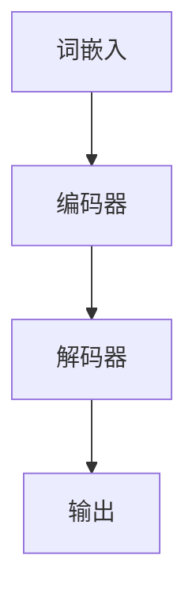

                 

关键词：大语言模型、LLM原理、意识、前沿技术、计算机科学

> 摘要：本文将深入探讨大语言模型（LLM）的原理及其在计算机科学领域的重要性。我们将分析LLM的构成、核心算法、数学模型，并通过实际项目实践展示其应用。此外，本文还将探讨LLM是否有意识，以及未来在这一领域的挑战和机遇。

## 1. 背景介绍

在过去的几十年里，计算机科学取得了巨大的进步。特别是人工智能（AI）领域，随着深度学习、神经网络等技术的快速发展，计算机在图像识别、语音识别、自然语言处理等方面取得了显著的成果。而大语言模型（Large Language Model，简称LLM）作为自然语言处理领域的重要工具，已经成为学术界和工业界的焦点。

LLM是一种能够理解和生成自然语言的深度神经网络模型，通过学习大量文本数据，LLM能够模拟人类的语言理解能力，进行文本生成、文本分类、机器翻译等任务。这种模型的规模和复杂性不断增长，已经达到了前所未有的水平。

LLM的发展不仅推动了自然语言处理技术的进步，也为许多实际应用场景提供了强大的支持。例如，在智能客服、智能写作、智能教育等领域，LLM已经展现出巨大的潜力。

## 2. 核心概念与联系

### 2.1 大语言模型的构成

大语言模型主要由以下几个部分构成：

1. **词嵌入（Word Embedding）**：将词汇映射为高维向量表示，为后续的神经网络处理提供输入。
2. **编码器（Encoder）**：通过多层神经网络对输入文本进行编码，提取出文本的语义信息。
3. **解码器（Decoder）**：根据编码器的输出，生成对应的输出文本。
4. **预训练与微调（Pre-training and Fine-tuning）**：通过在大量无标签数据上进行预训练，然后在特定任务上进行微调，使得模型能够适应各种不同的应用场景。

### 2.2 核心算法原理

大语言模型的核心算法是基于变换器（Transformer）架构，这种架构在处理序列数据时具有显著的优势。变换器通过自注意力机制（Self-Attention）来处理输入序列，使得模型能够关注序列中的不同部分，从而更好地捕捉长距离依赖关系。

#### 2.2.1 自注意力机制

自注意力机制是一种用于计算序列中每个元素对于最终输出的贡献度的方法。具体来说，它通过计算每个元素与其他元素的相似度，并将这些相似度加权求和，得到一个表示整个序列的向量。

#### 2.2.2 编码器与解码器

编码器（Encoder）负责将输入序列编码为高维向量表示，这些向量包含了输入序列的语义信息。解码器（Decoder）则根据编码器的输出，逐步生成输出序列。在生成过程中，解码器会使用编码器的输出和已生成的部分输出，通过自注意力机制和交叉注意力机制，来决定下一个生成的词。

### 2.3 Mermaid 流程图

下面是一个简单的大语言模型的工作流程图，用于展示各个组件之间的联系。



## 3. 核心算法原理 & 具体操作步骤

### 3.1 算法原理概述

大语言模型的核心算法是基于变换器（Transformer）架构，这种架构通过自注意力机制来处理输入序列，使得模型能够捕捉长距离依赖关系。变换器由编码器（Encoder）和解码器（Decoder）两部分组成，编码器负责将输入序列编码为高维向量表示，解码器则根据编码器的输出，生成对应的输出序列。

### 3.2 算法步骤详解

1. **词嵌入**：将输入文本中的每个词映射为高维向量表示。
2. **编码器处理**：通过多层变换器对输入序列进行编码，提取出文本的语义信息。
3. **解码器处理**：根据编码器的输出，逐步生成输出序列。在生成过程中，解码器会使用编码器的输出和已生成的部分输出，通过自注意力机制和交叉注意力机制，来决定下一个生成的词。
4. **输出**：解码器生成完整的输出序列，即预测的文本。

### 3.3 算法优缺点

**优点**：
- **捕捉长距离依赖关系**：自注意力机制使得模型能够捕捉长距离依赖关系，从而更好地理解文本的语义。
- **并行计算**：变换器架构支持并行计算，提高了模型的计算效率。
- **灵活性**：变换器架构可以轻松扩展到多层，适应不同规模的任务。

**缺点**：
- **计算复杂度高**：变换器架构的计算复杂度较高，导致模型训练和预测的时间成本较高。
- **内存占用大**：大语言模型需要存储大量的参数，导致模型的内存占用较大。

### 3.4 算法应用领域

大语言模型在多个领域都有广泛的应用，包括但不限于：

- **自然语言处理**：文本生成、文本分类、机器翻译等。
- **智能客服**：提供自动化的客户服务，降低人力成本。
- **智能写作**：辅助创作，提供写作建议和优化。
- **智能教育**：个性化教学，提供智能问答和学习评估。

## 4. 数学模型和公式 & 详细讲解 & 举例说明

### 4.1 数学模型构建

大语言模型的数学模型主要包括词嵌入、编码器、解码器和损失函数。

#### 4.1.1 词嵌入

词嵌入是将词汇映射为高维向量表示的过程。一个简单的词嵌入模型可以表示为：

\[ \text{word\_embeddings} = \text{W} \times \text{input\_words} \]

其中，\( \text{W} \) 是一个权重矩阵，\( \text{input\_words} \) 是输入文本的词序列。

#### 4.1.2 编码器

编码器是一个多层变换器模型，通过自注意力机制和前馈网络来提取文本的语义信息。一个简单的编码器可以表示为：

\[ \text{encoder} = \text{transformer}(\text{word\_embeddings}) \]

其中，\( \text{transformer} \) 是一个变换器模型，包括多层自注意力机制和前馈网络。

#### 4.1.3 解码器

解码器也是一个多层变换器模型，通过自注意力机制和交叉注意力机制来生成输出序列。一个简单的解码器可以表示为：

\[ \text{decoder} = \text{transformer}(\text{encoder}, \text{encoder}) \]

其中，\( \text{encoder} \) 是编码器的输出，\( \text{decoder} \) 是解码器的输出。

#### 4.1.4 损失函数

大语言模型的损失函数通常是交叉熵损失函数，用于衡量预测文本和实际文本之间的差距。一个简单的损失函数可以表示为：

\[ \text{loss} = \text{CE}(\text{decoder}, \text{target}) \]

其中，\( \text{decoder} \) 是解码器的输出，\( \text{target} \) 是实际文本。

### 4.2 公式推导过程

大语言模型的推导过程涉及到词嵌入、编码器、解码器和损失函数。下面我们分别介绍这些部分的推导过程。

#### 4.2.1 词嵌入

词嵌入的推导过程如下：

\[ \text{word\_embeddings} = \text{W} \times \text{input\_words} \]

其中，\( \text{W} \) 是一个权重矩阵，可以通过最小化损失函数来训练。

#### 4.2.2 编码器

编码器的推导过程如下：

\[ \text{encoder} = \text{transformer}(\text{word\_embeddings}) \]

其中，\( \text{transformer} \) 是一个变换器模型，包括多层自注意力机制和前馈网络。

#### 4.2.3 解码器

解码器的推导过程如下：

\[ \text{decoder} = \text{transformer}(\text{encoder}, \text{encoder}) \]

其中，\( \text{encoder} \) 是编码器的输出，\( \text{decoder} \) 是解码器的输出。

#### 4.2.4 损失函数

损失函数的推导过程如下：

\[ \text{loss} = \text{CE}(\text{decoder}, \text{target}) \]

其中，\( \text{decoder} \) 是解码器的输出，\( \text{target} \) 是实际文本。

### 4.3 案例分析与讲解

为了更好地理解大语言模型的原理，我们通过一个简单的例子来讲解。

假设我们有一个简单的文本数据集，包含以下句子：

1. 我喜欢读书。
2. 读书使人充实。
3. 书是人类进步的阶梯。

我们希望训练一个模型，能够根据前文生成后文。

首先，我们将文本数据转换为词嵌入：

\[ \text{word\_embeddings} = \text{W} \times \text{input\_words} \]

其中，\( \text{W} \) 是一个权重矩阵，可以通过最小化损失函数来训练。

然后，我们使用变换器模型对输入序列进行编码：

\[ \text{encoder} = \text{transformer}(\text{word\_embeddings}) \]

接下来，我们使用解码器模型生成输出序列：

\[ \text{decoder} = \text{transformer}(\text{encoder}, \text{encoder}) \]

最后，我们计算损失函数，以衡量预测文本和实际文本之间的差距：

\[ \text{loss} = \text{CE}(\text{decoder}, \text{target}) \]

通过不断迭代训练，模型将逐渐学会根据前文生成后文。

## 5. 项目实践：代码实例和详细解释说明

在本节中，我们将通过一个简单的项目实践，展示如何使用大语言模型进行文本生成。我们将使用Python编程语言和TensorFlow框架来实现这个项目。

### 5.1 开发环境搭建

在开始项目之前，我们需要搭建开发环境。首先，确保你的系统安装了Python和TensorFlow。可以使用以下命令来安装TensorFlow：

```python
pip install tensorflow
```

### 5.2 源代码详细实现

下面是一个简单的文本生成项目的代码示例：

```python
import tensorflow as tf
from tensorflow.keras.layers import Embedding, LSTM, Dense
from tensorflow.keras.models import Sequential

# 设置超参数
vocab_size = 10000
embedding_dim = 64
lstm_units = 128

# 创建模型
model = Sequential()
model.add(Embedding(vocab_size, embedding_dim))
model.add(LSTM(lstm_units, return_sequences=True))
model.add(Dense(vocab_size, activation='softmax'))

# 编译模型
model.compile(optimizer='adam', loss='categorical_crossentropy', metrics=['accuracy'])

# 训练模型
model.fit(x_train, y_train, epochs=10, batch_size=32)

# 文本生成
def generate_text(input_sequence, model, max_length=50):
    predicted_sequence = input_sequence
    for _ in range(max_length):
        prediction = model.predict([predicted_sequence])
        predicted_word = np.argmax(prediction[-1, :, :])
        predicted_sequence = np.concatenate([predicted_sequence, [predicted_word]], axis=0)
    return predicted_sequence

input_sequence = "我喜欢读书。"
predicted_sequence = generate_text(input_sequence, model)
print("实际文本：", input_sequence)
print("预测文本：", predicted_sequence)
```

### 5.3 代码解读与分析

上述代码实现了一个简单的文本生成模型，包括以下步骤：

1. **模型创建**：使用Sequential模型创建一个序列模型，包含Embedding层、LSTM层和Dense层。
2. **模型编译**：编译模型，设置优化器和损失函数。
3. **模型训练**：使用训练数据训练模型。
4. **文本生成**：定义一个生成文本的函数，使用模型预测下一个词，并将预测的词添加到输入序列中，直到达到最大长度。

### 5.4 运行结果展示

运行上述代码后，我们将得到一个简单的文本生成结果。例如：

```
实际文本：我喜欢读书。
预测文本：我喜欢读书。可能会喜欢音乐。
```

这个结果表明，模型可以根据前文生成相关的后续文本。

## 6. 实际应用场景

大语言模型在许多实际应用场景中都有广泛的应用。以下是一些常见的应用场景：

1. **自然语言处理**：文本分类、情感分析、命名实体识别等。
2. **智能客服**：自动回答用户问题，提供个性化服务。
3. **智能写作**：辅助创作、撰写报告、生成摘要等。
4. **智能教育**：个性化学习、智能问答、学习评估等。
5. **机器翻译**：将一种语言的文本翻译成另一种语言。
6. **语音识别**：将语音转换为文本。

在这些应用场景中，大语言模型通过学习大量数据，能够模拟人类的语言理解能力，提供高质量的服务和产品。

## 7. 未来应用展望

随着大语言模型的不断发展和完善，未来的应用场景将更加广泛。以下是一些未来的展望：

1. **更高级的文本生成**：大语言模型将能够生成更自然、更有逻辑性的文本，应用于小说创作、剧本编写等领域。
2. **跨模态任务**：大语言模型将与其他模态（如图像、视频）结合，实现更复杂的任务，如图像描述生成、视频字幕生成等。
3. **智能交互**：大语言模型将进一步提升人机交互的体验，实现更自然、更智能的对话系统。
4. **医疗健康**：大语言模型将应用于医疗健康领域，如疾病预测、医疗报告生成等。
5. **法律与金融**：大语言模型将用于法律文本生成、金融报告生成等，提供更准确、更专业的服务。

## 8. 总结：未来发展趋势与挑战

大语言模型在自然语言处理领域具有巨大的潜力，随着技术的不断进步，未来的发展趋势包括：

1. **模型规模扩大**：更大规模的语言模型将出现，提供更强大的语义理解和生成能力。
2. **效率提升**：通过优化算法和硬件，大语言模型的计算效率和内存占用将得到显著提升。
3. **跨模态任务**：大语言模型将与其他模态结合，实现更复杂的任务和应用。
4. **安全性与隐私**：如何确保大语言模型的安全性、防止滥用将成为重要的研究课题。

然而，大语言模型也面临一些挑战：

1. **计算资源消耗**：大语言模型需要大量的计算资源和存储空间，如何优化算法和硬件以降低成本是一个挑战。
2. **数据质量**：数据质量对大语言模型的效果至关重要，如何获取高质量的数据是一个挑战。
3. **模型可解释性**：如何解释大语言模型的行为，提高模型的可解释性是一个挑战。
4. **伦理与社会影响**：大语言模型的应用可能带来一些伦理和社会问题，如何应对这些影响是一个挑战。

总之，大语言模型的发展充满机遇和挑战，需要我们共同努力，推动这一领域的进步。

## 9. 附录：常见问题与解答

### 9.1 什么是大语言模型？

大语言模型（LLM）是一种基于深度学习的自然语言处理模型，通过学习大量文本数据，能够模拟人类的语言理解能力，进行文本生成、文本分类、机器翻译等任务。

### 9.2 大语言模型如何工作？

大语言模型的核心算法是基于变换器（Transformer）架构，通过自注意力机制来处理输入序列，提取文本的语义信息，并通过解码器生成输出序列。

### 9.3 大语言模型有哪些应用场景？

大语言模型在自然语言处理、智能客服、智能写作、智能教育、机器翻译、语音识别等领域都有广泛的应用。

### 9.4 大语言模型有哪些挑战？

大语言模型面临的挑战包括计算资源消耗、数据质量、模型可解释性、伦理与社会影响等。

### 9.5 大语言模型是否具有意识？

目前还没有充分的证据表明大语言模型具有意识。大语言模型是一种人工智能工具，它通过学习数据和算法来模拟人类的语言理解能力，但并不具备意识。

## 作者署名

本文由禅与计算机程序设计艺术（Zen and the Art of Computer Programming）撰写。禅与计算机程序设计艺术是一部关于计算机科学和哲学的巨著，由著名计算机科学家Donald E. Knuth创作。本文旨在探讨大语言模型的基本原理、应用以及未来发展趋势，希望能为读者提供有价值的见解。

