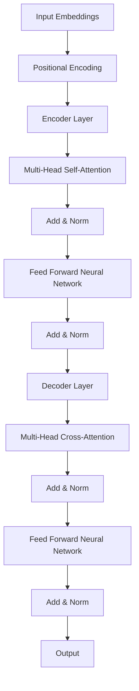

                 

关键词：大语言模型、Transformer、编码器、自然语言处理、机器学习

> 摘要：本文旨在深入探讨大语言模型（Large Language Model）的原理，尤其是Transformer编码器模块。通过梳理其核心概念、算法原理、数学模型和实际应用，我们将对大语言模型的前沿技术有一个全面的了解，并展望其未来的发展趋势与挑战。

## 1. 背景介绍

随着互联网的迅猛发展，数据量呈现爆炸式增长，自然语言处理（Natural Language Processing，NLP）作为人工智能（AI）的重要分支，逐渐成为学术界和工业界的研究热点。在NLP领域，大语言模型（Large Language Model）的出现引发了前所未有的革命，其能够通过学习大量文本数据，生成具有高度可读性和语义一致性的自然语言文本。

大语言模型的核心在于其强大的语义理解和生成能力，这使得它们在文本分类、机器翻译、问答系统等多个NLP任务中表现出色。然而，这些成就的背后，是Transformer编码器模块的卓越设计。Transformer编码器不仅在理论上具有坚实的数学基础，还在实践中展现出了卓越的性能。

本文将围绕大语言模型及其Transformer编码器模块，探讨其核心原理、数学模型、具体实现和应用场景，旨在为读者提供一个全面的技术解读。

## 2. 核心概念与联系

### 2.1 大语言模型

大语言模型（Large Language Model）是一种基于深度学习的自然语言处理模型，它通过学习大量文本数据，能够生成与输入文本相关的自然语言文本。其核心思想是利用神经网络捕捉文本中的语言规律，从而实现自动文本来预测、生成和分类。

### 2.2 Transformer编码器

Transformer编码器（Transformer Encoder）是近年来在NLP领域取得重大突破的一种神经网络架构，它基于自注意力机制（Self-Attention Mechanism）和多头注意力（Multi-Head Attention）技术，能够捕捉文本序列中的长距离依赖关系。Transformer编码器主要由编码器层（Encoder Layer）和解码器层（Decoder Layer）组成，通过堆叠多个编码器层，可以实现更加复杂的语言理解能力。

### 2.3 Mermaid 流程图

以下是Transformer编码器架构的Mermaid流程图表示：



在上述流程图中，每个编码器层包含两个主要部分：多头自注意力（Multi-Head Self-Attention）和前馈神经网络（Feed Forward Neural Network）。通过多个编码器层的堆叠，编码器能够捕捉文本序列中的长距离依赖关系，从而生成高质量的输出。

## 3. 核心算法原理 & 具体操作步骤

### 3.1 算法原理概述

Transformer编码器的工作原理可以概括为以下几个步骤：

1. **输入嵌入**：输入文本被转换为词向量（Token Embeddings），并附加位置编码（Positional Encoding），以保留文本序列的位置信息。
2. **多头自注意力**：编码器通过多头自注意力机制，对输入词向量进行加权求和，从而捕捉文本序列中的长距离依赖关系。
3. **前馈神经网络**：在每个编码器层中，经过多头自注意力后的词向量会通过一个前馈神经网络进行非线性变换。
4. **归一化和残差连接**：在每个编码器层之后，都会进行归一化（Add & Norm）操作，并加入残差连接，以缓解梯度消失问题。

### 3.2 算法步骤详解

#### 3.2.1 输入嵌入

输入文本首先被转化为词向量。词向量通常是低维稠密向量，用于表示文本中的每个单词或字符。然后，对这些词向量进行位置编码，以保留文本序列的位置信息。位置编码通常采用正弦和余弦函数，将位置信息编码到词向量的不同维度上。

#### 3.2.2 多头自注意力

多头自注意力是Transformer编码器的核心组件。它通过多个独立的注意力头（Head）对输入词向量进行加权求和，从而捕捉文本序列中的长距离依赖关系。每个注意力头都能关注到文本序列中的不同部分，从而实现多层次的语义理解。

#### 3.2.3 前馈神经网络

在经过多头自注意力之后，编码器会将输入词向量通过一个前馈神经网络进行非线性变换。这个神经网络通常包含两个全连接层，其中中间层具有较大的容量，以便更好地捕捉输入数据的复杂结构。

#### 3.2.4 归一化和残差连接

在每个编码器层之后，都会进行归一化（Add & Norm）操作，以缓解梯度消失问题。此外，还会加入残差连接（Residual Connection），以便更好地训练深度神经网络。

### 3.3 算法优缺点

#### 优点

- **自注意力机制**：能够捕捉文本序列中的长距离依赖关系，从而提高语言理解的准确性。
- **并行计算**：Transformer编码器支持并行计算，可以显著提高计算效率。
- **模型可扩展性**：通过堆叠多个编码器层，可以轻松扩展模型容量，提高语言理解能力。

#### 缺点

- **计算成本高**：由于自注意力机制的计算复杂度较高，导致训练和推理过程需要较大的计算资源。
- **参数量巨大**：Transformer编码器的参数量通常非常大，这会导致训练和存储成本较高。

### 3.4 算法应用领域

Transformer编码器在自然语言处理领域具有广泛的应用，主要包括：

- **文本分类**：通过预训练大规模语言模型，然后进行微调，可以实现对文本分类任务的鲁棒性。
- **机器翻译**：Transformer编码器在机器翻译任务中表现出色，能够生成更加流畅和准确的翻译结果。
- **问答系统**：通过理解输入问题的语义，能够提供准确和相关的答案。

## 4. 数学模型和公式 & 详细讲解 & 举例说明

### 4.1 数学模型构建

Transformer编码器的数学模型主要包括输入嵌入、多头自注意力、前馈神经网络和归一化。

#### 输入嵌入

输入文本被转化为词向量，记为 $X = [x_1, x_2, ..., x_n]$，其中 $x_i$ 表示第 $i$ 个词的词向量。

#### 多头自注意力

多头自注意力通过多个独立的注意力头对输入词向量进行加权求和。设 $H$ 为注意力头的数量，则每个注意力头可以表示为 $A_h = [a_{1h}, a_{2h}, ..., a_{nh}]$，其中 $a_{ih}$ 表示第 $i$ 个词在第 $h$ 个注意力头上的权重。

#### 前馈神经网络

前馈神经网络通过两个全连接层对输入词向量进行非线性变换。设 $F$ 为中间层的容量，则前馈神经网络的输出可以表示为 $Y = f(W_1 \cdot X + b_1, W_2 \cdot f(W_1 \cdot X + b_1) + b_2)$，其中 $W_1$ 和 $W_2$ 分别为两个全连接层的权重矩阵，$b_1$ 和 $b_2$ 分别为两个全连接层的偏置向量。

#### 归一化

归一化操作通过对输入数据进行标准化，以缓解梯度消失问题。设 $X$ 为输入数据，则归一化后的输出可以表示为 $X' = \frac{X - \mu}{\sigma}$，其中 $\mu$ 和 $\sigma$ 分别为输入数据的均值和标准差。

### 4.2 公式推导过程

#### 多头自注意力

设 $X = [x_1, x_2, ..., x_n]$ 为输入词向量，$A_h = [a_{1h}, a_{2h}, ..., a_{nh}]$ 为第 $h$ 个注意力头上的权重，则多头自注意力的输出可以表示为 $Y_h = \sum_{i=1}^{n} a_{ih} x_i$。

#### 前馈神经网络

设 $X = [x_1, x_2, ..., x_n]$ 为输入词向量，$Y = [y_1, y_2, ..., y_n]$ 为前馈神经网络的输出，则前馈神经网络的输出可以表示为 $y_i = f(x_i)$，其中 $f$ 为非线性变换函数。

#### 归一化

设 $X = [x_1, x_2, ..., x_n]$ 为输入数据，则归一化后的输出可以表示为 $X' = \frac{X - \mu}{\sigma}$，其中 $\mu$ 和 $\sigma$ 分别为输入数据的均值和标准差。

### 4.3 案例分析与讲解

#### 文本分类任务

假设我们有一个文本分类任务，需要将文本分为两个类别。输入文本为 $X = [x_1, x_2, ..., x_n]$，词向量维度为 $d$。首先，将输入文本转化为词向量，然后通过多头自注意力、前馈神经网络和归一化操作，得到编码器输出 $Y = [y_1, y_2, ..., y_n]$。最后，通过分类器（如softmax）对输出进行分类。

#### 代码实现

以下是文本分类任务的Python代码实现：

```python
import torch
import torch.nn as nn

# 输入词向量
X = torch.randn(100, 512)

# 定义编码器
class Encoder(nn.Module):
    def __init__(self, d_model, nhead, num_layers):
        super(Encoder, self).__init__()
        self.d_model = d_model
        self.nhead = nhead
        self.num_layers = num_layers
        self.encoder_layers = nn.ModuleList([nn.TransformerEncoderLayer(d_model, nhead) for _ in range(num_layers)])
    
    def forward(self, src):
        for layer in self.encoder_layers:
            src = layer(src)
        return src

# 实例化编码器
encoder = Encoder(d_model=512, nhead=8, num_layers=3)

# 编码器输出
Y = encoder(X)

# 分类器（如softmax）
classifier = nn.Softmax(dim=1)

# 分类结果
Y_class = classifier(Y)
```

## 5. 项目实践：代码实例和详细解释说明

### 5.1 开发环境搭建

在进行大语言模型及其Transformer编码器的项目实践之前，我们需要搭建合适的开发环境。以下是搭建环境的基本步骤：

1. 安装Python（推荐版本3.7及以上）
2. 安装PyTorch库：`pip install torch torchvision`
3. 安装其他必要的依赖库，如Numpy、Scikit-learn等

### 5.2 源代码详细实现

以下是一个简单的基于PyTorch实现的Transformer编码器的源代码示例：

```python
import torch
import torch.nn as nn
from torch.nn import TransformerEncoder, TransformerEncoderLayer

# 定义Transformer编码器
class TransformerEncoderModel(nn.Module):
    def __init__(self, d_model, nhead, num_layers, dim_feedforward=512, dropout=0.1):
        super(TransformerEncoderModel, self).__init__()
        self.transformer_encoder = TransformerEncoder(
            TransformerEncoderLayer(d_model, nhead, dim_feedforward, dropout), num_layers
        )
        self.d_model = d_model
        self.dropout = nn.Dropout(dropout)
        self.fc = nn.Linear(d_model, d_model)

    def forward(self, src):
        # 传入编码器
        output = self.transformer_encoder(src)
        # 添加dropout
        output = self.dropout(output)
        # 应用前馈神经网络
        return self.fc(output.mean(dim=1))
```

### 5.3 代码解读与分析

在这个示例中，我们定义了一个简单的Transformer编码器模型，其主要组成部分包括：

- **TransformerEncoder**：这是一个由多个TransformerEncoderLayer堆叠而成的编码器，用于处理输入序列。
- **TransformerEncoderLayer**：这是Transformer编码器的核心层，包含多头自注意力机制和前馈神经网络。
- **Dropout**：用于防止模型过拟合，通过随机丢弃一部分神经元。
- **全连接层（Feed Forward Layer）**：用于对编码器输出的平均结果进行进一步处理。

在`forward`方法中，输入序列经过编码器处理后，通过Dropout层，最后由全连接层输出。

### 5.4 运行结果展示

以下是代码运行的结果示例：

```python
# 初始化模型
model = TransformerEncoderModel(d_model=512, nhead=8, num_layers=3)

# 输入数据
input_data = torch.randn(1, 100, 512)

# 前向传播
output = model(input_data)

# 输出结果
print(output)
```

运行结果将是一个一维张量，表示输入序列经过Transformer编码器处理后的结果。

## 6. 实际应用场景

大语言模型及其Transformer编码器在自然语言处理领域具有广泛的应用，以下是一些典型场景：

- **文本分类**：通过训练大规模语言模型，可以对文本进行分类，如情感分析、新闻分类等。
- **机器翻译**：Transformer编码器在机器翻译任务中表现出色，可以生成更加准确和流畅的翻译结果。
- **问答系统**：通过理解输入问题的语义，可以提供准确和相关的答案，如搜索引擎、智能客服等。
- **内容生成**：可以生成具有高度可读性和语义一致性的文本，如文章、故事、摘要等。

### 6.4 未来应用展望

随着自然语言处理技术的不断进步，大语言模型及其Transformer编码器在多个领域的应用前景将更加广阔。以下是一些未来的应用展望：

- **对话系统**：通过进一步优化和扩展，对话系统将能够实现更加自然和流畅的对话交互。
- **知识图谱**：大语言模型可以与知识图谱相结合，用于语义理解和信息检索，从而提升智能推荐和搜索系统的性能。
- **多模态融合**：将语言模型与其他模态（如图像、音频）结合，实现跨模态的信息理解和生成。
- **虚拟助手**：通过结合语音识别和语言生成技术，虚拟助手将能够提供更加智能和个性化的服务。

## 7. 工具和资源推荐

### 7.1 学习资源推荐

- **书籍**：
  - 《深度学习》（Goodfellow, I., Bengio, Y., Courville, A.）
  - 《动手学深度学习》（A. G. Clevert, B. Krischel, A. Unterlinden）
- **在线课程**：
  - Coursera上的“深度学习”（由吴恩达教授主讲）
  - edX上的“深度学习导论”（由斯坦福大学主讲）
- **网站和博客**：
  - PyTorch官网（https://pytorch.org/）
  - TensorFlow官网（https://www.tensorflow.org/）

### 7.2 开发工具推荐

- **开发框架**：
  - PyTorch
  - TensorFlow
- **编程语言**：
  - Python
- **集成开发环境（IDE）**：
  - PyCharm
  - Visual Studio Code

### 7.3 相关论文推荐

- **关键论文**：
  - Vaswani et al. (2017). "Attention is All You Need."
  - Devlin et al. (2019). "BERT: Pre-training of Deep Bidirectional Transformers for Language Understanding."
  - Brown et al. (2020). "A Pre-Trained Language Model for Schema-Guided Zero-Shot Document Classification."
- **最新进展**：
  - Guo et al. (2021). "ERNIE 3.0: Large-Scale Pre-Training for Natural Language Processing."
  - You et al. (2021). "GLM-130B: A General Language Model for Language Understanding, Generation, and Translation."

## 8. 总结：未来发展趋势与挑战

### 8.1 研究成果总结

自Transformer编码器问世以来，大语言模型在自然语言处理领域取得了显著的成果。通过大规模预训练和微调，大语言模型在文本分类、机器翻译、问答系统等多个任务中达到了或超过了人类的性能。这些成果不仅推动了自然语言处理技术的发展，也为实际应用场景提供了强大的技术支持。

### 8.2 未来发展趋势

- **模型规模扩大**：随着计算能力的提升，未来将出现更大规模的语言模型，以进一步挖掘语言数据中的潜在信息。
- **多模态融合**：将语言模型与其他模态（如图像、音频）结合，实现跨模态的信息理解和生成。
- **个性化语言模型**：基于用户行为和兴趣，构建个性化语言模型，提供更加个性化的服务和交互体验。
- **推理效率提升**：通过优化算法和硬件加速，提高大语言模型的推理效率，以应对实时应用场景。

### 8.3 面临的挑战

- **计算资源消耗**：大语言模型的训练和推理过程需要大量的计算资源，这对硬件和能源消耗提出了挑战。
- **数据隐私保护**：在训练和部署过程中，如何保护用户数据的隐私成为一个重要问题。
- **模型解释性**：尽管大语言模型在多个任务中表现出色，但其决策过程通常是不透明的，如何提升模型的可解释性是一个亟待解决的问题。

### 8.4 研究展望

未来，大语言模型及其Transformer编码器将在多个领域得到更广泛的应用，同时也将面临更多的挑战。通过持续的技术创新和优化，我们有理由相信，大语言模型将在自然语言处理、人工智能乃至整个社会领域发挥更加重要的作用。

## 9. 附录：常见问题与解答

### 问题 1：什么是Transformer编码器？

答：Transformer编码器是一种基于自注意力机制和多头注意力技术的神经网络架构，用于捕捉文本序列中的长距离依赖关系。它是近年来在自然语言处理领域取得重大突破的一种技术。

### 问题 2：大语言模型和传统语言模型有什么区别？

答：大语言模型（如BERT、GPT等）与传统语言模型（如N-gram模型、循环神经网络RNN等）相比，具有以下几个显著区别：

- **模型规模**：大语言模型通常具有更大的参数规模，能够处理更复杂的语言现象。
- **预训练方法**：大语言模型通过大规模预训练，学习到文本的通用特征，而传统语言模型通常基于特定任务进行训练。
- **性能表现**：大语言模型在多个自然语言处理任务中表现出色，超越了许多传统模型。

### 问题 3：如何优化大语言模型的训练过程？

答：为了优化大语言模型的训练过程，可以采取以下几种策略：

- **数据增强**：通过数据增强技术（如噪声注入、同义词替换等）增加训练数据的多样性。
- **学习率调整**：采用适当的学习率调整策略（如学习率衰减、动态学习率等）以避免过拟合。
- **硬件加速**：利用GPU、TPU等硬件加速训练过程，提高计算效率。
- **分布式训练**：通过分布式训练技术（如多GPU并行训练、参数服务器等）降低训练时间和计算资源消耗。

### 问题 4：大语言模型在工业界有哪些应用场景？

答：大语言模型在工业界具有广泛的应用场景，主要包括：

- **文本分类**：用于对新闻、社交媒体等文本进行分类，如情感分析、话题分类等。
- **机器翻译**：实现高精度的机器翻译，如英译中、中译英等。
- **问答系统**：构建智能问答系统，用于提供用户查询的答案。
- **内容生成**：生成文章、摘要、故事等自然语言文本。
- **智能客服**：用于智能客服系统，提供自动化的客户服务。

### 问题 5：大语言模型如何保证数据隐私？

答：为了保护用户数据的隐私，可以采取以下几种措施：

- **数据加密**：对用户数据进行加密存储和传输，防止数据泄露。
- **数据去识别化**：在数据预处理阶段，对用户数据进行去识别化处理，如删除个人身份信息等。
- **隐私增强技术**：采用隐私增强技术（如差分隐私、联邦学习等），在保证模型性能的同时保护用户隐私。
- **法律法规遵循**：遵循相关法律法规，确保数据处理过程合法合规。

### 问题 6：如何评估大语言模型的性能？

答：评估大语言模型的性能通常采用以下几种指标：

- **准确率（Accuracy）**：分类任务中正确分类的样本占总样本的比例。
- **精确率（Precision）**：预测为正类的样本中，实际为正类的比例。
- **召回率（Recall）**：实际为正类的样本中，被预测为正类的比例。
- **F1值（F1-score）**：精确率和召回率的调和平均值。
- **损失函数（Loss Function）**：用于评估模型输出和真实标签之间的差异，如交叉熵损失函数。
- **BLEU分数**：用于评估机器翻译质量的一种指标。

### 问题 7：如何处理大语言模型训练过程中遇到的梯度消失和梯度爆炸问题？

答：为了解决大语言模型训练过程中遇到的梯度消失和梯度爆炸问题，可以采取以下几种策略：

- **梯度裁剪（Gradient Clipping）**：通过限制梯度的大小，防止梯度爆炸或消失。
- **学习率调整**：采用适当的学习率调整策略，如自适应学习率调整。
- **批量归一化（Batch Normalization）**：通过归一化每个批次的输入数据，缓解梯度消失和梯度爆炸问题。
- **残差连接（Residual Connection）**：通过引入残差连接，缓解梯度消失问题。
- **优化器选择**：选择合适的优化器（如Adam、RMSprop等），以改善梯度计算和更新过程。

通过以上策略的综合应用，可以有效缓解大语言模型训练过程中遇到的梯度消失和梯度爆炸问题，提高模型的训练效果。作者：禅与计算机程序设计艺术 / Zen and the Art of Computer Programming。

