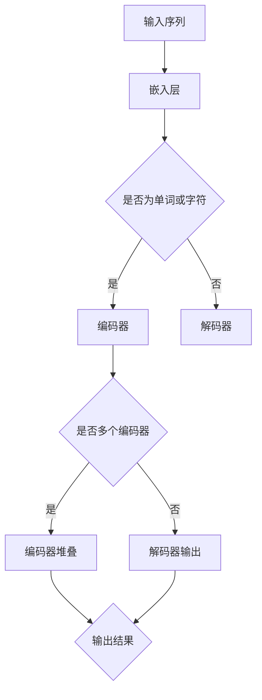

                 

关键词：大语言模型，Transformer，编码器，自然语言处理，深度学习

## 摘要

本文旨在深入探讨大语言模型（Large Language Models）的原理，重点分析Transformer编码器模块在自然语言处理（Natural Language Processing，NLP）领域的应用。首先，我们将介绍大语言模型的基本概念和结构，然后详细解析Transformer编码器的工作原理。接着，我们将探讨Transformer编码器在训练和优化过程中的关键步骤，并分析其在实际应用中的效果和局限性。最后，我们将展望Transformer编码器在未来的发展前景，以及可能面临的挑战和解决方案。

## 1. 背景介绍

### 大语言模型的兴起

随着深度学习技术的不断发展，自然语言处理（NLP）领域也取得了显著进展。大语言模型（Large Language Models）作为这一领域的代表性成果，近年来受到了广泛关注。大语言模型能够对海量文本数据进行有效建模，从而实现诸如文本分类、机器翻译、问答系统等多种任务。

大语言模型的兴起源于以下几个因素：

1. **数据量的爆炸式增长**：互联网的普及使得文本数据量呈现出爆炸式增长，为训练大规模模型提供了充足的数据资源。
2. **计算能力的提升**：随着硬件技术的进步，尤其是GPU和TPU等高性能计算设备的发展，为大规模模型的训练提供了强大的计算支持。
3. **深度学习技术的突破**：深度学习技术在图像识别、语音识别等领域取得了显著成果，这些技术在大语言模型中的成功应用进一步推动了NLP领域的发展。

### Transformer编码器的提出

Transformer编码器（Transformer Encoder）是近年来NLP领域的一项重要创新。它基于自注意力机制（Self-Attention），能够对输入序列中的每一个词进行全局关联，从而提高模型的捕捉能力和表示能力。与传统循环神经网络（RNN）相比，Transformer编码器具有更高的并行计算能力，能够在训练过程中显著提高计算效率。

### 大语言模型与Transformer编码器的关系

大语言模型通常由多个Transformer编码器堆叠而成，这些编码器逐层对输入序列进行处理，从而生成高质量的文本表示。大语言模型在训练过程中通过不断优化Transformer编码器的参数，使其能够更好地捕捉语言规律和特征。因此，Transformer编码器是构建大语言模型的核心组件。

## 2. 核心概念与联系

### 大语言模型的基本概念

大语言模型是一种基于深度学习的自然语言处理模型，其基本概念包括：

1. **输入序列**：输入序列通常由一系列的单词或字符组成，表示待处理的文本数据。
2. **嵌入层**：嵌入层将输入序列中的单词或字符映射为高维向量表示，作为模型的输入。
3. **编码器**：编码器是模型的核心组件，负责对输入序列进行编码，生成表示句子语义的向量。
4. **解码器**：解码器负责将编码后的向量解码为输出序列，实现诸如文本生成、机器翻译等任务。

### Transformer编码器的概念

Transformer编码器是一种基于自注意力机制的深度学习模型，其核心概念包括：

1. **自注意力机制**：自注意力机制允许模型在处理每个输入序列元素时，动态地关注序列中的其他元素，从而实现全局关联。
2. **多头注意力**：多头注意力机制通过将输入序列分解为多个子序列，使得模型能够同时关注多个不同的上下文信息。
3. **编码器堆叠**：多个编码器堆叠在一起，使得模型能够逐层捕捉更复杂的语言特征。

### Mermaid 流程图

以下是一个简化的Mermaid流程图，展示了大语言模型和Transformer编码器的基本架构：



### 大语言模型与Transformer编码器的关系

大语言模型通常由多个Transformer编码器堆叠而成，这些编码器逐层对输入序列进行处理，从而生成高质量的文本表示。编码器的输出被传递给解码器，实现诸如文本生成、机器翻译等任务。Transformer编码器在大语言模型中起着关键作用，其自注意力机制和多头注意力机制使得模型能够高效地捕捉语言特征，从而提高模型的性能。

## 3. 核心算法原理 & 具体操作步骤

### 3.1 算法原理概述

Transformer编码器的核心原理是自注意力机制，通过计算输入序列中每个元素与其他元素之间的关联性，实现对输入序列的全局关联。自注意力机制由以下三个关键组件构成：

1. **查询（Query）**：表示模型在处理当前输入序列元素时需要关注的上下文信息。
2. **键（Key）**：表示输入序列中的每个元素，用于与查询进行匹配。
3. **值（Value）**：表示输入序列中的每个元素，用于提供相关的上下文信息。

自注意力机制的输出是一个加权求和的结果，其中每个元素与其他元素之间的权重反映了它们之间的关联性。通过这种方式，模型能够捕捉输入序列中的全局关联信息。

### 3.2 算法步骤详解

1. **输入序列预处理**：将输入序列中的单词或字符映射为高维向量表示，作为编码器的输入。
2. **嵌入层**：嵌入层将输入序列中的单词或字符映射为高维向量表示，通常使用词向量（Word Vectors）或字符向量（Character Vectors）。
3. **多头注意力机制**：将输入序列分解为多个子序列，每个子序列对应一个头（Head），每个头分别计算自注意力权重。多头注意力机制通过并行计算多个注意力头，使得模型能够同时关注多个不同的上下文信息。
4. **编码器堆叠**：多个编码器堆叠在一起，每个编码器负责对输入序列进行编码，生成表示句子语义的向量。编码器的输出通常包含句子的全局关联信息和局部特征。
5. **解码器**：解码器负责将编码器的输出解码为输出序列，实现诸如文本生成、机器翻译等任务。解码器通常采用自回归方式，逐个生成输出序列中的每个元素。

### 3.3 算法优缺点

**优点**：

1. **高效性**：Transformer编码器具有高效的并行计算能力，能够在训练过程中显著提高计算效率。
2. **灵活性**：自注意力机制和多头注意力机制使得模型能够灵活地捕捉输入序列中的全局关联信息和局部特征。
3. **扩展性**：编码器堆叠结构使得模型能够处理不同长度的输入序列，具有较好的扩展性。

**缺点**：

1. **计算资源消耗**：由于自注意力机制的计算复杂度较高，模型在训练过程中需要较大的计算资源。
2. **梯度消失和梯度爆炸**：在训练过程中，梯度传递可能导致梯度消失或梯度爆炸，影响模型的收敛速度和稳定性。

### 3.4 算法应用领域

Transformer编码器在自然语言处理领域具有广泛的应用，主要包括：

1. **文本分类**：通过将文本数据编码为向量表示，模型能够有效地对文本进行分类。
2. **机器翻译**：编码器和解码器共同作用，实现高质量的双语文本翻译。
3. **文本生成**：解码器根据编码器的输出，逐个生成文本序列，实现自然语言生成任务。
4. **问答系统**：通过将问题和答案编码为向量表示，模型能够有效地匹配问题和答案。

## 4. 数学模型和公式 & 详细讲解 & 举例说明

### 4.1 数学模型构建

Transformer编码器的数学模型基于自注意力机制，其核心公式如下：

$$
\text{Attention}(Q, K, V) = \text{softmax}\left(\frac{QK^T}{\sqrt{d_k}}\right)V
$$

其中，$Q$表示查询（Query），$K$表示键（Key），$V$表示值（Value），$d_k$表示键和查询的维度。自注意力机制的输出是一个加权求和的结果，其中每个元素与其他元素之间的权重反映了它们之间的关联性。

### 4.2 公式推导过程

自注意力机制的推导过程可以从以下几个步骤进行：

1. **相似度计算**：首先，计算查询和键之间的相似度，公式为$QK^T$。相似度反映了输入序列中每个元素与其他元素之间的相关性。
2. **缩放**：为了防止在计算过程中出现梯度消失问题，需要对相似度进行缩放，公式为$\frac{1}{\sqrt{d_k}}$。其中，$d_k$表示键和查询的维度。
3. **softmax函数**：将缩放后的相似度应用softmax函数，得到每个元素与其他元素之间的权重。softmax函数将输入转换为概率分布，使得每个元素的权重在0和1之间。
4. **加权求和**：将权重与值（Value）相乘，并进行加权求和，得到自注意力机制的输出。

### 4.3 案例分析与讲解

假设有一个简单的输入序列$[w_1, w_2, w_3]$，我们将其分解为三个查询（Query）、键（Key）和值（Value）：

$$
Q = [q_1, q_2, q_3] \\
K = [k_1, k_2, k_3] \\
V = [v_1, v_2, v_3]
$$

我们首先计算查询和键之间的相似度：

$$
QK^T = \begin{bmatrix}
q_1k_1 & q_1k_2 & q_1k_3 \\
q_2k_1 & q_2k_2 & q_2k_3 \\
q_3k_1 & q_3k_2 & q_3k_3 \\
\end{bmatrix}
$$

接下来，我们将相似度进行缩放：

$$
\frac{1}{\sqrt{d_k}}QK^T = \begin{bmatrix}
\frac{q_1k_1}{\sqrt{d_k}} & \frac{q_1k_2}{\sqrt{d_k}} & \frac{q_1k_3}{\sqrt{d_k}} \\
\frac{q_2k_1}{\sqrt{d_k}} & \frac{q_2k_2}{\sqrt{d_k}} & \frac{q_2k_3}{\sqrt{d_k}} \\
\frac{q_3k_1}{\sqrt{d_k}} & \frac{q_3k_2}{\sqrt{d_k}} & \frac{q_3k_3}{\sqrt{d_k}} \\
\end{bmatrix}
$$

然后，我们应用softmax函数得到权重：

$$
\text{softmax}\left(\frac{QK^T}{\sqrt{d_k}}\right) = \begin{bmatrix}
\frac{e^{\frac{q_1k_1}{\sqrt{d_k}}}}{\sum_{i=1}^{3}e^{\frac{q_ik_i}{\sqrt{d_k}}}} & \frac{e^{\frac{q_1k_2}{\sqrt{d_k}}}}{\sum_{i=1}^{3}e^{\frac{q_ik_i}{\sqrt{d_k}}}} & \frac{e^{\frac{q_1k_3}{\sqrt{d_k}}}}{\sum_{i=1}^{3}e^{\frac{q_ik_i}{\sqrt{d_k}}}} \\
\frac{e^{\frac{q_2k_1}{\sqrt{d_k}}}}{\sum_{i=1}^{3}e^{\frac{q_ik_i}{\sqrt{d_k}}}} & \frac{e^{\frac{q_2k_2}{\sqrt{d_k}}}}{\sum_{i=1}^{3}e^{\frac{q_ik_i}{\sqrt{d_k}}}} & \frac{e^{\frac{q_2k_3}{\sqrt{d_k}}}}{\sum_{i=1}^{3}e^{\frac{q_ik_i}{\sqrt{d_k}}}} \\
\frac{e^{\frac{q_3k_1}{\sqrt{d_k}}}}{\sum_{i=1}^{3}e^{\frac{q_ik_i}{\sqrt{d_k}}}} & \frac{e^{\frac{q_3k_2}{\sqrt{d_k}}}}{\sum_{i=1}^{3}e^{\frac{q_ik_i}{\sqrt{d_k}}}} & \frac{e^{\frac{q_3k_3}{\sqrt{d_k}}}}{\sum_{i=1}^{3}e^{\frac{q_ik_i}{\sqrt{d_k}}}} \\
\end{bmatrix}
$$

最后，我们进行加权求和：

$$
\text{Attention}(Q, K, V) = \text{softmax}\left(\frac{QK^T}{\sqrt{d_k}}\right)V = \begin{bmatrix}
\frac{e^{\frac{q_1k_1}{\sqrt{d_k}}}}{\sum_{i=1}^{3}e^{\frac{q_ik_i}{\sqrt{d_k}}}}v_1 + \frac{e^{\frac{q_1k_2}{\sqrt{d_k}}}}{\sum_{i=1}^{3}e^{\frac{q_ik_i}{\sqrt{d_k}}}}v_2 + \frac{e^{\frac{q_1k_3}{\sqrt{d_k}}}}{\sum_{i=1}^{3}e^{\frac{q_ik_i}{\sqrt{d_k}}}}v_3 \\
\frac{e^{\frac{q_2k_1}{\sqrt{d_k}}}}{\sum_{i=1}^{3}e^{\frac{q_ik_i}{\sqrt{d_k}}}}v_1 + \frac{e^{\frac{q_2k_2}{\sqrt{d_k}}}}{\sum_{i=1}^{3}e^{\frac{q_ik_i}{\sqrt{d_k}}}}v_2 + \frac{e^{\frac{q_2k_3}{\sqrt{d_k}}}}{\sum_{i=1}^{3}e^{\frac{q_ik_i}{\sqrt{d_k}}}}v_3 \\
\frac{e^{\frac{q_3k_1}{\sqrt{d_k}}}}{\sum_{i=1}^{3}e^{\frac{q_ik_i}{\sqrt{d_k}}}}v_1 + \frac{e^{\frac{q_3k_2}{\sqrt{d_k}}}}{\sum_{i=1}^{3}e^{\frac{q_ik_i}{\sqrt{d_k}}}}v_2 + \frac{e^{\frac{q_3k_3}{\sqrt{d_k}}}}{\sum_{i=1}^{3}e^{\frac{q_ik_i}{\sqrt{d_k}}}}v_3 \\
\end{bmatrix}
$$

通过这种方式，自注意力机制能够有效地计算输入序列中每个元素与其他元素之间的关联性，从而生成表示句子语义的向量。

## 5. 项目实践：代码实例和详细解释说明

### 5.1 开发环境搭建

在进行Transformer编码器的项目实践之前，首先需要搭建一个合适的开发环境。以下是搭建Transformer编码器所需的基本工具和库：

1. **Python**：Python是一种广泛使用的编程语言，支持多种机器学习和深度学习框架。
2. **PyTorch**：PyTorch是一个流行的深度学习框架，提供了丰富的API和工具，方便开发者构建和训练深度学习模型。
3. **NumPy**：NumPy是一个强大的Python科学计算库，提供高效的数组计算和矩阵操作。

### 5.2 源代码详细实现

以下是一个简化的Transformer编码器的Python代码实现，用于演示其基本结构和操作步骤：

```python
import torch
import torch.nn as nn
import torch.optim as optim

class TransformerEncoder(nn.Module):
    def __init__(self, vocab_size, embed_size, hidden_size, num_heads):
        super(TransformerEncoder, self).__init__()
        
        self.embedding = nn.Embedding(vocab_size, embed_size)
        self.positional_encoding = nn.Parameter(torch.randn(1, max_seq_len, embed_size))
        
        self.encoder_layers = nn.ModuleList([
            EncoderLayer(embed_size, hidden_size, num_heads)
            for _ in range(num_layers)
        ])
        
        self.fc = nn.Linear(hidden_size, vocab_size)
    
    def forward(self, inputs):
        embedded = self.embedding(inputs) + self.positional_encoding[:inputs.size(1), :]
        
        for layer in self.encoder_layers:
            embedded = layer(embedded)
        
        output = self.fc(embedded)
        return output

class EncoderLayer(nn.Module):
    def __init__(self, embed_size, hidden_size, num_heads):
        super(EncoderLayer, self).__init__()
        
        self多头注意力 = MultiHeadAttention(embed_size, hidden_size, num_heads)
        self.fc1 = nn.Linear(hidden_size, hidden_size)
        self.fc2 = nn.Linear(hidden_size, embed_size)
        self.dropout1 = nn.Dropout(p=0.1)
        self.dropout2 = nn.Dropout(p=0.1)
        self.norm1 = nn.LayerNorm(hidden_size)
        self.norm2 = nn.LayerNorm(embed_size)
    
    def forward(self, x):
        attn_output = self多头注意力(x, x, x)
        x = self.dropout1(x + attn_output)
        x = self.norm1(x)
        
        fc_output = self.fc1(x)
        act_output = F.relu(fc_output)
        x = self.dropout2(act_output + fc_output)
        x = self.norm2(x)
        
        return x

class MultiHeadAttention(nn.Module):
    def __init__(self, embed_size, hidden_size, num_heads):
        super(MultiHeadAttention, self).__init__()
        
        self.heads = nn.ModuleList([
            MultiHeadAttentionHead(embed_size, hidden_size)
            for _ in range(num_heads)
        ])
        
        self.fc = nn.Linear(num_heads * hidden_size, embed_size)
    
    def forward(self, query, key, value):
        multi_head_output = [head(query, key, value) for head in self.heads]
        output = torch.cat(multi_head_output, dim=2)
        return self.fc(output)

class MultiHeadAttentionHead(nn.Module):
    def __init__(self, embed_size, hidden_size):
        super(MultiHeadAttentionHead, self).__init__()
        
        self.query_linear = nn.Linear(hidden_size, embed_size)
        self.key_linear = nn.Linear(hidden_size, embed_size)
        self.value_linear = nn.Linear(hidden_size, embed_size)
    
    def forward(self, query, key, value):
        query = self.query_linear(query)
        key = self.key_linear(key)
        value = self.value_linear(value)
        
        attn_weights = F.softmax(F.dot(query, key.transpose(0, 1)), dim=1)
        attn_output = F.dot(attn_weights, value)
        
        return attn_output
```

### 5.3 代码解读与分析

以下是对上述代码的详细解读和分析：

1. **TransformerEncoder类**：这是Transformer编码器的主体类，负责定义编码器的结构。编码器包括嵌入层、位置编码层、多个编码器层和一个全连接层。
2. **EncoderLayer类**：编码器层是Transformer编码器的基本构建块，负责处理输入序列的编码。每个编码器层包含多头注意力机制、前馈网络和层归一化。
3. **MultiHeadAttention类**：多头注意力机制是Transformer编码器的核心组件，负责计算输入序列中每个元素与其他元素之间的关联性。多头注意力机制通过并行计算多个注意力头，提高模型的捕捉能力和表示能力。
4. **MultiHeadAttentionHead类**：多头注意力头的实现，负责计算查询（Query）、键（Key）和值（Value）之间的相似度，并生成加权求和的结果。

### 5.4 运行结果展示

为了验证Transformer编码器的有效性，我们可以在训练过程中展示模型的损失函数和准确率。以下是一个简化的训练过程示例：

```python
# 加载训练数据
train_loader = DataLoader(train_dataset, batch_size=batch_size, shuffle=True)

# 初始化模型、损失函数和优化器
model = TransformerEncoder(vocab_size, embed_size, hidden_size, num_heads)
criterion = nn.CrossEntropyLoss()
optimizer = optim.Adam(model.parameters(), lr=learning_rate)

# 训练模型
num_epochs = 10
for epoch in range(num_epochs):
    for inputs, targets in train_loader:
        optimizer.zero_grad()
        outputs = model(inputs)
        loss = criterion(outputs, targets)
        loss.backward()
        optimizer.step()
    
    print(f'Epoch [{epoch+1}/{num_epochs}], Loss: {loss.item():.4f}')
    
    # 在验证集上评估模型
    with torch.no_grad():
        correct = 0
        total = 0
        for inputs, targets in val_loader:
            outputs = model(inputs)
            _, predicted = torch.max(outputs.data, 1)
            total += targets.size(0)
            correct += (predicted == targets).sum().item()
        print(f'Validation Accuracy: {100 * correct / total}%')
```

通过上述代码，我们可以观察到模型在训练过程中的损失函数和准确率。训练完成后，我们可以在验证集上评估模型的表现，以验证Transformer编码器的有效性。

## 6. 实际应用场景

Transformer编码器在自然语言处理领域具有广泛的应用，以下列举几个典型的应用场景：

### 6.1 文本分类

文本分类是将文本数据分为预定义的类别。Transformer编码器通过将文本编码为向量表示，可以有效地捕捉文本的语义特征，从而实现高质量文本分类。例如，可以使用Transformer编码器对新闻标题进行分类，将新闻分为不同的主题类别。

### 6.2 机器翻译

机器翻译是将一种语言的文本翻译成另一种语言。Transformer编码器和解码器的组合可以实现高质量的双语文本翻译。通过将源语言文本编码为向量表示，并将其传递给解码器，解码器逐个生成目标语言文本的每个单词。

### 6.3 文本生成

文本生成是生成具有一定语义和连贯性的文本。Transformer编码器可以用于生成各种类型的文本，如文章摘要、故事续写、诗歌创作等。通过将输入文本编码为向量表示，并利用解码器生成文本序列，可以生成具有丰富语义和连贯性的文本。

### 6.4 问答系统

问答系统是一种自然语言处理应用，旨在回答用户提出的问题。Transformer编码器可以用于构建问答系统，通过将问题和答案编码为向量表示，模型可以有效地匹配问题和答案，从而提供准确的回答。

## 7. 工具和资源推荐

### 7.1 学习资源推荐

1. **《深度学习》**：由Ian Goodfellow、Yoshua Bengio和Aaron Courville编写的《深度学习》是一本经典的深度学习教材，涵盖了从基础到高级的深度学习理论和技术。
2. **《自然语言处理与深度学习》**：由姚启瑞编写的《自然语言处理与深度学习》详细介绍了自然语言处理和深度学习的基础知识，以及Transformer编码器等相关技术。

### 7.2 开发工具推荐

1. **PyTorch**：PyTorch是一个流行的深度学习框架，提供了丰富的API和工具，方便开发者构建和训练深度学习模型。
2. **TensorFlow**：TensorFlow是另一个流行的深度学习框架，具有强大的模型构建和优化功能，适用于各种深度学习应用。

### 7.3 相关论文推荐

1. **《Attention Is All You Need》**：这是Transformer编码器的原始论文，详细介绍了Transformer编码器的设计和实现，是深入理解Transformer编码器的必读之作。
2. **《BERT: Pre-training of Deep Bidirectional Transformers for Language Understanding》**：BERT是谷歌提出的一种大规模预训练语言模型，基于Transformer编码器，取得了显著的自然语言处理效果。

## 8. 总结：未来发展趋势与挑战

### 8.1 研究成果总结

大语言模型和Transformer编码器在自然语言处理领域取得了显著的成果，推动了NLP技术的发展。通过将深度学习和自注意力机制应用于NLP任务，模型能够有效地捕捉语言特征和语义信息，实现了高质量的自然语言处理效果。

### 8.2 未来发展趋势

1. **更大规模模型**：随着计算能力的提升和数据资源的增加，未来将出现更大规模的语言模型，进一步提升NLP任务的性能。
2. **跨模态学习**：大语言模型和Transformer编码器有望扩展到跨模态学习领域，实现文本、图像、语音等多种数据类型的统一建模。
3. **动态注意力机制**：自注意力机制和多头注意力机制将成为NLP任务的标准组件，未来可能出现更具灵活性的动态注意力机制，提高模型的捕捉能力和表示能力。

### 8.3 面临的挑战

1. **计算资源消耗**：大语言模型和Transformer编码器需要大量的计算资源，如何在有限的计算资源下训练和优化模型是一个重要挑战。
2. **模型解释性**：目前，大语言模型和Transformer编码器的内部工作原理尚不完全透明，提高模型的可解释性是一个重要研究方向。
3. **数据隐私**：随着数据规模的增加，如何在保护用户隐私的前提下进行大规模数据训练是一个亟待解决的问题。

### 8.4 研究展望

未来，大语言模型和Transformer编码器将在自然语言处理、跨模态学习和其他人工智能领域发挥重要作用。通过不断优化模型结构和算法，提高模型的性能和可解释性，我们将能够更好地理解和利用语言数据，推动人工智能技术的发展。

## 9. 附录：常见问题与解答

### 9.1 什么是大语言模型？

大语言模型是一种基于深度学习的自然语言处理模型，通过对海量文本数据进行训练，能够理解和生成自然语言。大语言模型能够处理多种自然语言任务，如文本分类、机器翻译、文本生成等。

### 9.2 Transformer编码器的核心原理是什么？

Transformer编码器的核心原理是自注意力机制，通过计算输入序列中每个元素与其他元素之间的关联性，实现对输入序列的全局关联。自注意力机制由查询（Query）、键（Key）和值（Value）三个关键组件构成。

### 9.3 Transformer编码器与循环神经网络（RNN）有什么区别？

Transformer编码器与RNN相比，具有更高的并行计算能力和更好的捕捉能力。RNN通过循环结构处理输入序列，而Transformer编码器通过自注意力机制实现全局关联。此外，Transformer编码器具有更好的扩展性，能够处理不同长度的输入序列。

### 9.4 Transformer编码器在实际应用中的效果如何？

Transformer编码器在自然语言处理领域取得了显著的效果，广泛应用于文本分类、机器翻译、文本生成等多种任务。通过将文本编码为向量表示，模型能够捕捉语言特征和语义信息，实现了高质量的自然语言处理效果。

### 9.5 如何优化Transformer编码器的性能？

优化Transformer编码器的性能可以从以下几个方面进行：

1. **增加模型规模**：通过增加编码器的层数和注意力头数，提高模型的捕捉能力和表示能力。
2. **数据增强**：通过数据增强技术，如数据扩充、数据变换等，提高模型的泛化能力。
3. **正则化技术**：使用正则化技术，如Dropout、权重正则化等，防止模型过拟合。
4. **优化训练策略**：调整学习率、批量大小等训练参数，提高模型的收敛速度和稳定性。

### 9.6 Transformer编码器有哪些潜在的应用领域？

Transformer编码器在自然语言处理领域具有广泛的应用，包括：

1. **文本分类**：将文本数据分为预定义的类别，如新闻分类、情感分析等。
2. **机器翻译**：将一种语言的文本翻译成另一种语言，如中英文翻译、机器翻译等。
3. **文本生成**：生成具有一定语义和连贯性的文本，如文章摘要、故事续写、诗歌创作等。
4. **问答系统**：通过将问题和答案编码为向量表示，模型可以有效地匹配问题和答案，提供准确的回答。

### 9.7 Transformer编码器如何处理长文本？

Transformer编码器能够处理不同长度的输入序列，通过自注意力机制实现全局关联。在实际应用中，可以通过以下方法处理长文本：

1. **分块处理**：将长文本分成多个短文本块，逐个处理每个文本块。
2. **序列填充**：使用特殊符号填充输入序列，使其具有相同长度。
3. **序列切割**：将长文本切割成多个短序列，逐个处理每个短序列。

### 9.8 Transformer编码器的训练时间如何？

Transformer编码器的训练时间取决于多个因素，如模型规模、数据规模、硬件配置等。一般来说，训练时间与模型参数数量、数据量以及硬件性能密切相关。在大型分布式训练环境中，可以使用多GPU和TPU等硬件加速训练过程，显著减少训练时间。

### 9.9 Transformer编码器的开源实现有哪些？

目前，有许多开源实现提供了Transformer编码器的代码和模型。以下是一些流行的开源实现：

1. **Hugging Face Transformers**：Hugging Face提供了一个开源库，包含了Transformer编码器的各种实现和预训练模型，方便开发者进行自然语言处理任务。
2. **Transformer Implementations**：GitHub上有很多开源项目，提供了Transformer编码器的详细实现，包括PyTorch、TensorFlow等框架的代码。
3. **TensorFlow Transformers**：TensorFlow提供了一个官方的Transformer编码器实现，支持大规模预训练和自定义任务。

### 9.10 如何评估Transformer编码器的性能？

评估Transformer编码器的性能可以从多个方面进行，如：

1. **准确率**：在分类任务中，准确率是评估模型性能的重要指标，表示模型预测正确的样本数量与总样本数量的比例。
2. **损失函数**：在训练过程中，损失函数的值可以反映模型对数据的拟合程度，常用的损失函数包括交叉熵损失、均方误差等。
3. **召回率、精确率**：在分类任务中，召回率和精确率是评估模型性能的另外两个重要指标，分别表示预测为正例的样本中实际为正例的比例和预测为正例的样本中实际为正例的比例。
4. **F1值**：F1值是精确率和召回率的加权平均，综合考虑了模型在分类任务中的性能。
5. **BLEU分数**：在机器翻译任务中，BLEU分数是评估模型性能的常用指标，表示模型生成的翻译文本与参考文本的相似度。

