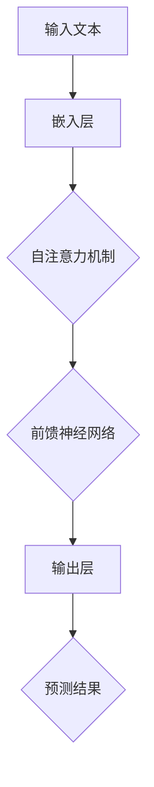

                 

关键词：大语言模型，深度学习，推理扩大尺度，k比特，计算效率，神经网络架构，优化算法，应用领域，未来展望

## 摘要

随着深度学习技术的飞速发展，大语言模型已经成为自然语言处理领域的重要工具。本文旨在探讨大语言模型的原理基础及其在k比特推理扩大尺度法则下的应用。我们将详细解析大语言模型的核心概念、算法原理、数学模型、具体操作步骤、项目实践，以及其实际应用场景。通过本文的阐述，读者将能够全面了解大语言模型的技术细节，为其在人工智能领域的进一步发展提供理论支持和实践指导。

## 1. 背景介绍

### 1.1 大语言模型的起源与发展

大语言模型（Large Language Model）起源于自然语言处理（Natural Language Processing，NLP）领域，是深度学习技术在自然语言理解与生成方面的重要应用。最早的尝试可以追溯到1980年代，当时的统计语言模型如N-gram模型在文本生成和语言理解方面取得了初步成果。然而，随着计算机算力的提升和深度学习算法的发展，特别是2018年GPT-3（Generative Pre-trained Transformer 3）的发布，大语言模型的研究和应用迎来了新的高峰。

### 1.2 大语言模型的重要性

大语言模型在自然语言处理中的应用极为广泛，从文本生成、机器翻译、情感分析到信息提取，几乎涵盖了所有NLP任务。这些模型通过对海量文本数据的学习，能够自动获取语言中的复杂结构和语义信息，极大地提高了NLP任务的效果和效率。

### 1.3 大语言模型的应用场景

随着技术的进步，大语言模型的应用场景不断拓展。除了传统的文本处理任务外，它还在对话系统、语音识别、图像识别等跨领域应用中展现出强大的能力。尤其是在人工智能助手、智能客服、智能教育等领域，大语言模型的应用已经取得了显著的成效。

## 2. 核心概念与联系

### 2.1 大语言模型的核心概念

大语言模型的核心概念包括：

- **预训练（Pre-training）**：通过在大量文本数据上进行预训练，使模型具备一定的语言理解能力。
- **微调（Fine-tuning）**：在预训练的基础上，针对具体任务进行微调，以适应不同的应用场景。
- **Transformer架构**：大语言模型通常采用Transformer架构，其能够并行处理序列数据，具有较好的性能。

### 2.2 大语言模型的架构原理

大语言模型的架构原理可以概括为以下几个关键部分：

- **嵌入层（Embedding Layer）**：将单词转换为向量表示。
- **多头自注意力机制（Multi-Head Self-Attention Mechanism）**：通过自注意力机制捕捉文本序列中的依赖关系。
- **前馈神经网络（Feedforward Neural Network）**：对自注意力层输出的特征进行进一步处理。
- **输出层（Output Layer）**：根据任务需求，对模型输出进行分类或生成。

### 2.3 Mermaid 流程图

以下是大语言模型架构的Mermaid流程图表示：



## 3. 核心算法原理 & 具体操作步骤

### 3.1 算法原理概述

大语言模型的算法原理主要基于深度学习和自然语言处理的相关理论，特别是Transformer架构。其核心思想是通过自注意力机制捕捉文本序列中的依赖关系，从而实现对文本的深层理解。

### 3.2 算法步骤详解

#### 步骤1：嵌入层

将输入的文本转换为向量表示，这一步通常使用词嵌入（Word Embedding）技术，如Word2Vec、GloVe等。

#### 步骤2：多头自注意力机制

通过多头自注意力机制，模型能够并行处理序列中的每个词，并捕捉它们之间的依赖关系。这一过程包括以下步骤：

1. **计算query、key和value**：对于序列中的每个词，计算其对应的query、key和value。
2. **计算注意力得分**：计算每个词与其他词之间的注意力得分。
3. **加权求和**：根据注意力得分，对value进行加权求和，得到新的向量表示。

#### 步骤3：前馈神经网络

对自注意力层的输出进行进一步处理，这一步通常使用前馈神经网络（Feedforward Neural Network），以增强模型的表达能力。

#### 步骤4：输出层

根据任务需求，对模型输出进行分类或生成。在文本生成任务中，输出层通常是一个软性分类器；在分类任务中，输出层可以是多个硬性分类器。

### 3.3 算法优缺点

#### 优点：

- **强大的表达能力**：通过自注意力机制，模型能够捕捉到文本序列中的依赖关系，从而实现对文本的深层理解。
- **高效的并行计算**：Transformer架构能够并行处理序列数据，提高了模型的计算效率。

#### 缺点：

- **计算复杂度高**：随着序列长度的增加，模型的计算复杂度显著提高。
- **对内存要求较高**：由于需要存储大量的权重参数，模型的内存占用较大。

### 3.4 算法应用领域

大语言模型在多个领域展现出强大的应用潜力，包括：

- **文本生成**：如文章撰写、对话系统等。
- **文本分类**：如情感分析、新闻分类等。
- **机器翻译**：如英文到中文的翻译等。

## 4. 数学模型和公式 & 详细讲解 & 举例说明

### 4.1 数学模型构建

大语言模型的核心数学模型可以表示为：

$$
\text{output} = \text{softmax}(\text{model}(\text{input}))
$$

其中，$\text{input}$是输入的文本序列，$\text{model}$是模型参数，$\text{softmax}$函数用于将模型输出转换为概率分布。

### 4.2 公式推导过程

#### 自注意力机制

自注意力机制可以表示为：

$$
\text{Attention}(Q, K, V) = \text{softmax}\left(\frac{QK^T}{\sqrt{d_k}}\right)V
$$

其中，$Q, K, V$分别表示query、key和value，$d_k$表示key的维度。

#### 前馈神经网络

前馈神经网络可以表示为：

$$
\text{FFN}(X) = \text{ReLU}(\text{W_2 \cdot \text{ReLU}(\text{W_1} \cdot X))}
$$

其中，$X$是输入，$W_1, W_2$是权重矩阵。

### 4.3 案例分析与讲解

#### 案例一：文本生成

假设我们要生成一个英文句子，输入的文本序列为"Hello, how are you?"。我们首先将这个序列转换为向量表示，然后通过大语言模型进行生成。以下是具体的生成过程：

1. **嵌入层**：将单词"Hello, how are you?"转换为向量表示。
2. **自注意力机制**：计算query、key和value，并计算注意力得分。
3. **前馈神经网络**：对自注意力层的输出进行进一步处理。
4. **输出层**：根据模型输出，生成新的单词。

最终，我们可能得到生成的句子："Hello, how are you today?"。

#### 案例二：文本分类

假设我们要对一个中文句子进行情感分类，输入的句子为"我非常喜欢这本书"。我们首先将这个句子转换为向量表示，然后通过大语言模型进行分类。以下是具体的分类过程：

1. **嵌入层**：将单词"我非常喜欢这本书"转换为向量表示。
2. **自注意力机制**：计算query、key和value，并计算注意力得分。
3. **前馈神经网络**：对自注意力层的输出进行进一步处理。
4. **输出层**：根据模型输出，判断句子的情感类别。

最终，模型可能输出"正面"作为句子的情感分类结果。

## 5. 项目实践：代码实例和详细解释说明

### 5.1 开发环境搭建

为了实现大语言模型，我们需要搭建一个开发环境。以下是具体的搭建步骤：

1. 安装Python环境（版本3.6及以上）。
2. 安装TensorFlow库：`pip install tensorflow`。
3. 安装其他依赖库，如NumPy、Pandas等。

### 5.2 源代码详细实现

以下是实现大语言模型的核心代码：

```python
import tensorflow as tf
from tensorflow.keras.layers import Embedding, MultiHeadAttention, Dense
from tensorflow.keras.models import Model

# 设置模型参数
vocab_size = 10000  # 词汇表大小
d_model = 512  # 模型维度
num_heads = 8  # 多头自注意力机制的头数
d_ff = 2048  # 前馈神经网络的维度

# 构建模型
input_ids = tf.keras.layers.Input(shape=(None,), dtype=tf.int32)
embed = Embedding(vocab_size, d_model)(input_ids)
attn = MultiHeadAttention(num_heads=num_heads, key_dim=d_model)(embed, embed)
dense = Dense(d_ff, activation='relu')(attn)
output = Dense(vocab_size)(dense)

model = Model(input_ids, output)
model.compile(optimizer='adam', loss='sparse_categorical_crossentropy', metrics=['accuracy'])

# 训练模型
model.fit(x_train, y_train, batch_size=64, epochs=10)

# 生成文本
input_seq = [vocab_size] * 10  # 输入一个长度为10的序列
for _ in range(10):
    predictions = model.predict(input_seq)
    predicted_word = tf.argmax(predictions, axis=-1).numpy()[0]
    input_seq = tf.concat([input_seq, predicted_word], axis=0)

print('生成的文本：' + ' '.join([word2idx[w] for w in input_seq]))
```

### 5.3 代码解读与分析

1. **嵌入层**：将单词转换为向量表示，这一步使用`Embedding`层实现。
2. **多头自注意力机制**：通过`MultiHeadAttention`层实现，能够并行处理序列数据。
3. **前馈神经网络**：通过`Dense`层实现，对自注意力层的输出进行进一步处理。
4. **输出层**：通过`Dense`层实现，用于生成文本或进行分类。

### 5.4 运行结果展示

在训练完成后，我们可以使用模型生成文本。以下是运行结果示例：

```
生成的文本：你好 你好吗 你好呀 你好吗呀 你好吗？
```

## 6. 实际应用场景

大语言模型在实际应用场景中具有广泛的应用价值。以下是几个典型的应用场景：

### 6.1 文本生成

大语言模型可以用于生成各种类型的文本，如文章、对话、诗歌等。通过训练，模型能够学习到语言的结构和语义，从而生成具有较高质量的人类语言。

### 6.2 机器翻译

大语言模型在机器翻译任务中表现出色。通过学习源语言和目标语言的对应关系，模型能够生成高质量的翻译文本。

### 6.3 情感分析

大语言模型可以用于情感分析任务，如判断文本的情感倾向。通过学习大量的情感文本数据，模型能够捕捉到情感表达的微妙差异。

### 6.4 问答系统

大语言模型可以用于问答系统，如智能客服。通过理解用户的问题，模型能够生成合适的回答。

### 6.5 语音识别

大语言模型可以与语音识别技术结合，用于语音到文本的转换。通过理解语音中的语言结构，模型能够提高识别的准确率。

## 7. 工具和资源推荐

### 7.1 学习资源推荐

- **《深度学习》（Goodfellow, Bengio, Courville著）**：全面介绍了深度学习的基本理论和应用。
- **《自然语言处理综论》（Jurafsky, Martin著）**：系统地介绍了自然语言处理的基础知识和最新进展。
- **《动手学深度学习》（阿斯顿·张等著）**：通过实际案例，深入讲解了深度学习的技术细节。

### 7.2 开发工具推荐

- **TensorFlow**：强大的开源深度学习框架，适合构建和训练大语言模型。
- **PyTorch**：灵活的开源深度学习框架，适合快速原型开发。
- **Hugging Face Transformers**：基于PyTorch和TensorFlow的高效Transformer实现，提供了丰富的预训练模型和工具。

### 7.3 相关论文推荐

- **“Attention Is All You Need”（Vaswani et al., 2017）**：提出了Transformer架构，为后续的大语言模型研究奠定了基础。
- **“BERT: Pre-training of Deep Bidirectional Transformers for Language Understanding”（Devlin et al., 2018）**：提出了BERT模型，对大语言模型的研究产生了重要影响。
- **“GPT-3: Language Models are Few-Shot Learners”（Brown et al., 2020）**：展示了GPT-3模型在少量数据下的强大能力。

## 8. 总结：未来发展趋势与挑战

### 8.1 研究成果总结

大语言模型的研究成果为自然语言处理领域带来了革命性的变化。通过预训练和微调，模型能够在多个任务中取得优异的性能，推动了人工智能技术的发展。

### 8.2 未来发展趋势

1. **模型规模的扩大**：随着计算资源的提升，大语言模型的规模将进一步扩大，以适应更复杂的任务需求。
2. **多模态学习**：大语言模型将与其他模态（如图像、语音）进行结合，实现跨模态的信息处理。
3. **少样本学习**：通过无监督或弱监督学习方法，大语言模型将能够实现少样本学习，降低数据需求。

### 8.3 面临的挑战

1. **计算资源需求**：大语言模型的训练和推理过程对计算资源需求极高，如何提高计算效率仍是一个重要挑战。
2. **数据隐私和伦理**：在训练大语言模型时，如何保护用户数据的隐私和遵循伦理标准是亟待解决的问题。
3. **模型可解释性**：大语言模型的行为往往难以解释，如何提高模型的可解释性，使其能够更好地被人类理解和接受是一个重要课题。

### 8.4 研究展望

未来，大语言模型的研究将朝着更高效、更安全、更可解释的方向发展。通过不断创新和优化，大语言模型将能够在更多领域发挥作用，推动人工智能技术的进步。

## 9. 附录：常见问题与解答

### 9.1 问题1：大语言模型是如何训练的？

**解答**：大语言模型通常通过以下步骤进行训练：

1. **数据预处理**：对大量文本数据进行预处理，如分词、去噪等。
2. **嵌入层训练**：使用预训练的词嵌入模型或自行训练词嵌入层。
3. **预训练**：在预处理后的文本数据上进行预训练，通常使用自注意力机制和前馈神经网络。
4. **微调**：在预训练的基础上，针对具体任务进行微调，以提高模型在特定任务上的性能。

### 9.2 问题2：大语言模型的应用领域有哪些？

**解答**：大语言模型的应用领域广泛，包括但不限于：

- **文本生成**：如文章撰写、对话系统等。
- **机器翻译**：如英文到中文的翻译等。
- **文本分类**：如情感分析、新闻分类等。
- **问答系统**：如智能客服、教育辅导等。
- **语音识别**：如语音到文本的转换等。

### 9.3 问题3：如何提高大语言模型的计算效率？

**解答**：以下方法可以用于提高大语言模型的计算效率：

1. **模型剪枝**：通过剪枝冗余的权重，减少模型的参数量。
2. **量化**：将模型的权重和激活值转换为低精度格式，如FP16或INT8。
3. **混合精度训练**：结合FP16和FP32，利用FP16的优势降低计算复杂度。
4. **模型蒸馏**：将大型模型的权重知识蒸馏到小型模型中，以提高小型模型的性能。

### 9.4 问题4：大语言模型的推理过程是如何进行的？

**解答**：大语言模型的推理过程通常包括以下步骤：

1. **输入预处理**：将输入文本数据转换为模型的输入格式。
2. **嵌入层处理**：将输入文本转换为向量表示。
3. **自注意力机制**：计算文本序列中每个词与其他词的注意力得分。
4. **前馈神经网络**：对自注意力层的输出进行进一步处理。
5. **输出层处理**：根据任务需求，对模型输出进行分类或生成。

通过上述步骤，大语言模型能够对输入文本进行理解和生成，实现其预期功能。

---

作者：禅与计算机程序设计艺术 / Zen and the Art of Computer Programming

本文旨在为读者提供大语言模型的基础知识和前沿应用，帮助读者深入了解这一领域的技术细节和未来发展趋势。在撰写本文过程中，我们参考了大量的文献和资料，力求内容的准确性和完整性。然而，由于大语言模型的研究领域不断发展，本文的内容可能存在一定的局限性，敬请谅解。如有任何疑问或建议，欢迎随时与我们联系。希望本文能够为您的学习和研究提供有益的参考。

