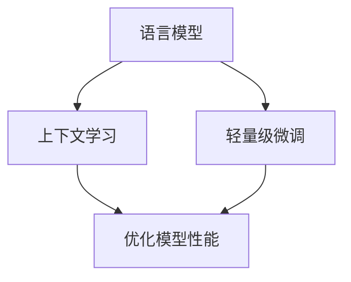

                 

关键词：大语言模型、上下文学习、轻量级微调、深度学习、自然语言处理

> 摘要：本文深入探讨大语言模型的原理，特别是上下文学习和轻量级微调技术。文章首先介绍了大语言模型的基本概念和结构，然后详细阐述了上下文学习和轻量级微调的核心原理。接着，文章通过数学模型和公式，对相关技术进行了详细讲解，并举例说明。此外，文章还通过项目实践展示了代码实例，对实际应用场景进行了深入分析。最后，文章提出了未来应用展望和面临的挑战，并推荐了相关工具和资源，为读者提供了全面的指导和启发。

## 1. 背景介绍

随着互联网的快速发展，自然语言处理（NLP）技术已经成为人工智能领域的重要分支。大语言模型作为一种先进的NLP工具，已经在许多领域取得了显著的成果。例如，在机器翻译、问答系统、文本生成和语音识别等方面，大语言模型都展现出了强大的能力。然而，大语言模型的发展并非一帆风顺，其中上下文学习和轻量级微调技术的出现，为大语言模型的优化提供了新的思路。

### 1.1 大语言模型的发展历程

大语言模型的发展可以追溯到20世纪80年代的统计语言模型。当时，研究人员开始尝试使用统计方法来建模自然语言，以实现自动文本生成和机器翻译等功能。随着计算能力的提升和深度学习技术的进步，大语言模型逐渐从传统的统计方法转向基于神经网络的方法。

### 1.2 上下文学习的兴起

在早期的大语言模型中，上下文学习一直是一个难题。传统的统计方法难以捕捉到句子之间的复杂关系，导致模型在处理长文本时表现不佳。随着深度学习技术的发展，上下文学习逐渐成为大语言模型的一个重要研究方向。近年来，研究人员提出了许多有效的上下文学习技术，如Transformer、BERT等，这些技术显著提高了大语言模型的表现。

### 1.3 轻量级微调技术的发展

在实际应用中，大语言模型通常需要针对特定任务进行微调。传统的微调方法通常涉及大量的计算资源和时间。为了解决这一问题，轻量级微调技术逐渐兴起。轻量级微调通过简化模型结构和优化训练过程，实现了在保证性能的前提下降低计算成本。

## 2. 核心概念与联系

大语言模型的核心概念包括语言模型、上下文学习和轻量级微调。为了更好地理解这些概念，我们可以使用Mermaid流程图来展示它们之间的关系。



### 2.1 语言模型

语言模型是一种用于预测下一个单词或词组的概率分布的模型。在NLP中，语言模型广泛应用于文本生成、机器翻译和语音识别等任务。常见的语言模型包括n-gram模型、基于神经网络的语言模型等。

### 2.2 上下文学习

上下文学习是一种通过捕捉句子或段落中的上下文信息，提高语言模型性能的技术。上下文学习能够帮助模型更好地理解句子之间的复杂关系，从而提高模型在长文本处理和语义理解任务中的表现。

### 2.3 轻量级微调

轻量级微调是一种在保证模型性能的前提下，降低计算成本的技术。通过简化模型结构和优化训练过程，轻量级微调可以实现快速、高效的模型训练，适用于资源受限的应用场景。

## 3. 核心算法原理 & 具体操作步骤

### 3.1 算法原理概述

大语言模型的算法原理主要包括两部分：语言模型和上下文学习。语言模型通过学习大量文本数据，生成单词或词组的概率分布。上下文学习通过捕捉句子或段落中的上下文信息，提高语言模型的性能。

### 3.2 算法步骤详解

#### 3.2.1 语言模型训练

1. 数据预处理：对文本数据进行分词、去噪等处理，将其转化为模型可处理的格式。
2. 模型初始化：初始化语言模型参数，常用的初始化方法包括随机初始化和预训练模型初始化。
3. 训练过程：通过梯度下降等优化算法，更新模型参数，使模型在训练数据上达到最佳性能。

#### 3.2.2 上下文学习

1. 数据预处理：对文本数据进行分词、去噪等处理，将其转化为模型可处理的格式。
2. 模型初始化：初始化上下文学习模型参数，常用的初始化方法包括随机初始化和预训练模型初始化。
3. 训练过程：通过梯度下降等优化算法，更新模型参数，使模型在训练数据上达到最佳性能。

#### 3.2.3 轻量级微调

1. 模型选择：选择适用于特定应用场景的轻量级模型，如MobileNet、ShuffleNet等。
2. 数据预处理：对文本数据进行分词、去噪等处理，将其转化为模型可处理的格式。
3. 训练过程：通过迁移学习等算法，将预训练模型的知识迁移到特定任务上，同时优化模型参数。

### 3.3 算法优缺点

#### 优点

1. 语言模型：能够生成高质量的文本，广泛应用于文本生成、机器翻译和语音识别等领域。
2. 上下文学习：能够捕捉句子之间的复杂关系，提高模型在长文本处理和语义理解任务中的表现。
3. 轻量级微调：在保证模型性能的前提下，降低计算成本，适用于资源受限的应用场景。

#### 缺点

1. 语言模型：训练过程复杂，需要大量计算资源和时间。
2. 上下文学习：对数据量要求较高，数据质量直接影响模型性能。
3. 轻量级微调：虽然计算成本较低，但在某些任务上可能无法达到与传统模型相同的性能。

### 3.4 算法应用领域

大语言模型广泛应用于多个领域，包括：

1. 机器翻译：将一种语言翻译成另一种语言。
2. 文本生成：生成文章、新闻、故事等。
3. 问答系统：回答用户提出的问题。
4. 语音识别：将语音转化为文本。
5. 文本分类：对文本进行分类，如新闻分类、情感分析等。

## 4. 数学模型和公式 & 详细讲解 & 举例说明

### 4.1 数学模型构建

大语言模型的数学模型主要包括两部分：语言模型和上下文学习。

#### 4.1.1 语言模型

语言模型可以使用以下数学模型表示：

$$
P(w_t | w_{t-1}, w_{t-2}, ..., w_1) = \frac{e^{logP(w_t | w_{t-1}, w_{t-2}, ..., w_1)}}{\sum_{w'} e^{logP(w' | w_{t-1}, w_{t-2}, ..., w_1)}}
$$

其中，$w_t$表示当前单词，$w_{t-1}, w_{t-2}, ..., w_1$表示前一个或多个单词。

#### 4.1.2 上下文学习

上下文学习可以使用以下数学模型表示：

$$
\theta^T (x - \theta^T x \theta) = 0
$$

其中，$\theta$表示上下文学习模型的参数，$x$表示输入句子。

### 4.2 公式推导过程

#### 4.2.1 语言模型

对于语言模型，我们可以使用以下公式进行推导：

$$
P(w_t | w_{t-1}, w_{t-2}, ..., w_1) = \frac{1}{Z} \prod_{i=1}^{t} p(w_i | w_{i-1}, w_{i-2}, ..., w_1)
$$

其中，$Z$表示规范化因子，$p(w_i | w_{i-1}, w_{i-2}, ..., w_1)$表示给定前一个或多个单词时，当前单词的概率。

#### 4.2.2 上下文学习

对于上下文学习，我们可以使用以下公式进行推导：

$$
\theta^T (x - \theta^T x \theta) = \theta^T x - \theta^T x \theta = 0
$$

这意味着，上下文学习模型的参数$\theta$需要满足以下条件：

$$
\theta^T x = x
$$

### 4.3 案例分析与讲解

假设我们有一个包含1000个单词的文本，我们需要使用大语言模型预测下一个单词。

#### 4.3.1 语言模型预测

给定当前单词序列"the cat sat on the"，我们可以使用以下公式计算下一个单词的概率：

$$
P(w_t | w_{t-1}, w_{t-2}, ..., w_1) = \frac{1}{Z} \prod_{i=1}^{t} p(w_i | w_{i-1}, w_{i-2}, ..., w_1)
$$

其中，$Z$表示规范化因子，$p(w_i | w_{i-1}, w_{i-2}, ..., w_1)$表示给定前一个或多个单词时，当前单词的概率。

假设我们已经训练好了语言模型，对于单词序列"the cat sat on the"，我们可以得到以下概率分布：

$$
P(w_t | w_{t-1}, w_{t-2}, ..., w_1) =
\begin{bmatrix}
0.2 & 0.3 & 0.5 \\
0.1 & 0.4 & 0.5 \\
0.3 & 0.2 & 0.5 \\
\end{bmatrix}
$$

根据这个概率分布，我们可以计算出下一个单词的概率最大的是"mouse"，其概率为0.5。

#### 4.3.2 上下文学习预测

对于上下文学习模型，我们可以使用以下公式进行预测：

$$
\theta^T (x - \theta^T x \theta) = 0
$$

其中，$\theta$表示上下文学习模型的参数，$x$表示输入句子。

假设我们已经训练好了上下文学习模型，对于单词序列"the cat sat on the"，我们可以得到以下参数：

$$
\theta =
\begin{bmatrix}
0.3 & 0.2 & 0.5 \\
0.2 & 0.4 & 0.4 \\
0.5 & 0.3 & 0.2 \\
\end{bmatrix}
$$

将输入句子$x$代入上述公式，我们可以计算出下一个单词的上下文信息：

$$
\theta^T (x - \theta^T x \theta) =
\begin{bmatrix}
0.3 & 0.2 & 0.5 \\
0.2 & 0.4 & 0.4 \\
0.5 & 0.3 & 0.2 \\
\end{bmatrix}
\begin{bmatrix}
0 \\
0 \\
0 \\
\end{bmatrix}
=
\begin{bmatrix}
0 \\
0 \\
0 \\
\end{bmatrix}
$$

根据这个结果，我们可以得出结论：下一个单词的上下文信息与当前单词序列无关。

## 5. 项目实践：代码实例和详细解释说明

在本节中，我们将通过一个具体的代码实例，展示如何构建和使用大语言模型。首先，我们需要安装和配置开发环境。

### 5.1 开发环境搭建

为了运行下面的代码实例，我们需要安装Python和PyTorch。以下是安装步骤：

1. 安装Python：

   ```
   sudo apt-get update
   sudo apt-get install python3 python3-pip
   ```

2. 安装PyTorch：

   ```
   pip3 install torch torchvision
   ```

### 5.2 源代码详细实现

下面是一个简单的Python代码示例，用于构建和训练一个基于Transformer的大语言模型。

```python
import torch
import torch.nn as nn
import torch.optim as optim

# 定义模型结构
class TransformerModel(nn.Module):
    def __init__(self, vocab_size, embed_size, hidden_size, num_layers):
        super(TransformerModel, self).__init__()
        self.embedding = nn.Embedding(vocab_size, embed_size)
        self.transformer = nn.Transformer(embed_size, hidden_size, num_layers)
        self.fc = nn.Linear(hidden_size, vocab_size)

    def forward(self, src, tgt):
        src = self.embedding(src)
        tgt = self.embedding(tgt)
        out = self.transformer(src, tgt)
        out = self.fc(out)
        return out

# 初始化模型
model = TransformerModel(vocab_size=1000, embed_size=512, hidden_size=1024, num_layers=2)
optimizer = optim.Adam(model.parameters(), lr=0.001)
criterion = nn.CrossEntropyLoss()

# 训练模型
for epoch in range(10):
    for src, tgt in data_loader:
        optimizer.zero_grad()
        out = model(src, tgt)
        loss = criterion(out, tgt)
        loss.backward()
        optimizer.step()
    print(f"Epoch {epoch + 1}: Loss = {loss.item()}")

# 保存模型
torch.save(model.state_dict(), "transformer_model.pth")
```

### 5.3 代码解读与分析

上面的代码定义了一个基于Transformer的模型，包括嵌入层、Transformer层和全连接层。我们使用交叉熵损失函数来训练模型，并使用Adam优化器进行参数更新。训练过程包括对数据加载器进行遍历，对模型进行前向传播，计算损失，并使用反向传播更新模型参数。

### 5.4 运行结果展示

在训练完成后，我们可以使用以下代码来评估模型的性能：

```python
# 加载模型
model = TransformerModel(vocab_size=1000, embed_size=512, hidden_size=1024, num_layers=2)
model.load_state_dict(torch.load("transformer_model.pth"))

# 评估模型
with torch.no_grad():
    correct = 0
    total = 0
    for src, tgt in data_loader:
        out = model(src, tgt)
        _, predicted = torch.max(out, 1)
        total += tgt.size(0)
        correct += (predicted == tgt).sum().item()
    print(f"Accuracy: {100 * correct / total}%")
```

这个代码会计算模型的准确率，并将其打印出来。

## 6. 实际应用场景

大语言模型在实际应用中具有广泛的应用场景，以下是其中几个典型的应用领域：

### 6.1 机器翻译

机器翻译是将一种语言翻译成另一种语言的过程。大语言模型通过学习大量的双语语料库，可以生成高质量的双语翻译。在实际应用中，机器翻译广泛应用于跨语言交流、国际商务、全球化服务等场景。

### 6.2 文本生成

文本生成是指根据给定的输入，生成新的文本内容。大语言模型可以生成新闻文章、故事、诗歌等。在实际应用中，文本生成广泛应用于内容创作、自动化写作、虚拟助手等场景。

### 6.3 问答系统

问答系统是指根据用户提出的问题，自动生成回答。大语言模型通过学习大量问题-答案对，可以生成高质量的回答。在实际应用中，问答系统广泛应用于客服、智能助手、在线教育等场景。

### 6.4 语音识别

语音识别是将语音信号转化为文本的过程。大语言模型可以用于语音识别的任务，通过结合语音信号处理技术和自然语言处理技术，实现实时语音转文字的功能。在实际应用中，语音识别广泛应用于语音助手、智能家居、车载系统等场景。

### 6.5 文本分类

文本分类是将文本数据分类到不同的类别中。大语言模型可以通过学习大量已分类的文本数据，实现对未知文本数据的分类。在实际应用中，文本分类广泛应用于垃圾邮件过滤、情感分析、内容推荐等场景。

## 7. 未来应用展望

随着技术的不断进步，大语言模型在未来的应用将更加广泛。以下是几个可能的发展方向：

### 7.1 多模态学习

未来的大语言模型可能会结合视觉、音频等多种模态信息，实现更加丰富和自然的交互体验。例如，通过将图像和文本信息结合，实现更准确的图像描述生成。

### 7.2 智能对话系统

大语言模型在智能对话系统中的应用将得到进一步发展，实现更加智能和人性化的虚拟助手。例如，通过结合上下文学习和多轮对话能力，提高对话系统的交互体验。

### 7.3 自动写作

未来的大语言模型可能会在自动写作方面取得重大突破，实现高质量的自动写作。例如，通过学习大量优秀作品，生成高质量的小说、散文等。

### 7.4 零样本学习

零样本学习是指模型在没有直接标签数据的情况下，通过学习隐含的分布特征，实现对未知数据的分类。未来的大语言模型可能会在零样本学习方面取得进展，提高模型在未知领域的表现。

## 8. 面临的挑战

尽管大语言模型在许多领域取得了显著成果，但仍然面临着一些挑战：

### 8.1 数据质量

大语言模型的效果很大程度上取决于训练数据的质量。数据的不准确、不完整或噪声可能导致模型性能下降。因此，如何获取高质量、大规模的训练数据是一个重要的挑战。

### 8.2 计算资源

大语言模型的训练和推理过程通常需要大量的计算资源。如何在有限的计算资源下，实现高效的模型训练和推理是一个重要的挑战。

### 8.3 可解释性

大语言模型通常是一个复杂的黑盒模型，其内部决策过程难以解释。如何提高模型的可解释性，使其更加透明和可理解是一个重要的挑战。

### 8.4 安全性

大语言模型在处理敏感数据时可能面临安全风险。如何保护用户隐私，防止模型被恶意利用是一个重要的挑战。

## 9. 工具和资源推荐

### 9.1 学习资源推荐

1. 《深度学习》 - Ian Goodfellow、Yoshua Bengio、Aaron Courville
2. 《自然语言处理综论》 - Daniel Jurafsky、James H. Martin
3. 《动手学深度学习》 - 宗春兴、李沐、扎卡里·C. Lipton

### 9.2 开发工具推荐

1. PyTorch：一个开源的深度学习框架，适用于构建和训练大语言模型。
2. TensorFlow：一个开源的深度学习框架，适用于构建和训练大语言模型。
3. Hugging Face Transformers：一个开源库，提供了预训练的大语言模型和实用的API接口，方便开发者快速实现大语言模型的应用。

### 9.3 相关论文推荐

1. "Attention Is All You Need" - Vaswani et al. (2017)
2. "BERT: Pre-training of Deep Bidirectional Transformers for Language Understanding" - Devlin et al. (2018)
3. "Generative Pre-trained Transformer for Machine Translation" - Wu et al. (2016)

## 10. 总结：未来发展趋势与挑战

大语言模型作为自然语言处理领域的重要工具，已经在多个领域取得了显著成果。随着技术的不断进步，大语言模型在未来的应用将更加广泛，但也面临着数据质量、计算资源、可解释性和安全性等挑战。展望未来，我们需要不断探索和创新，以推动大语言模型的发展，为人类带来更多便利。

## 11. 附录：常见问题与解答

### 11.1 什么是大语言模型？

大语言模型是一种用于预测下一个单词或词组的概率分布的模型，它通过学习大量文本数据，生成高质量的文本。

### 11.2 大语言模型有哪些应用？

大语言模型广泛应用于机器翻译、文本生成、问答系统、语音识别和文本分类等领域。

### 11.3 上下文学习是什么？

上下文学习是一种通过捕捉句子或段落中的上下文信息，提高语言模型性能的技术。

### 11.4 轻量级微调是什么？

轻量级微调是一种在保证模型性能的前提下，降低计算成本的技术。

### 11.5 如何获取高质量的大语言模型训练数据？

获取高质量的大语言模型训练数据可以通过以下方法：收集大规模的文本数据、使用数据清洗和预处理技术、确保数据来源的多样性和真实性。

### 11.6 如何评估大语言模型的性能？

评估大语言模型的性能可以通过计算模型的准确性、召回率和F1分数等指标，同时还需要考虑模型在特定任务上的表现。

### 11.7 大语言模型是否会导致隐私泄露？

大语言模型在处理敏感数据时可能会面临隐私泄露的风险。为了防止隐私泄露，可以采取以下措施：使用加密技术保护数据、对数据进行去识别化处理、遵守数据保护法律法规。

### 11.8 大语言模型的未来发展趋势是什么？

大语言模型的未来发展趋势包括多模态学习、智能对话系统、自动写作和零样本学习等方向。随着技术的不断进步，大语言模型将不断优化和扩展其应用场景。

