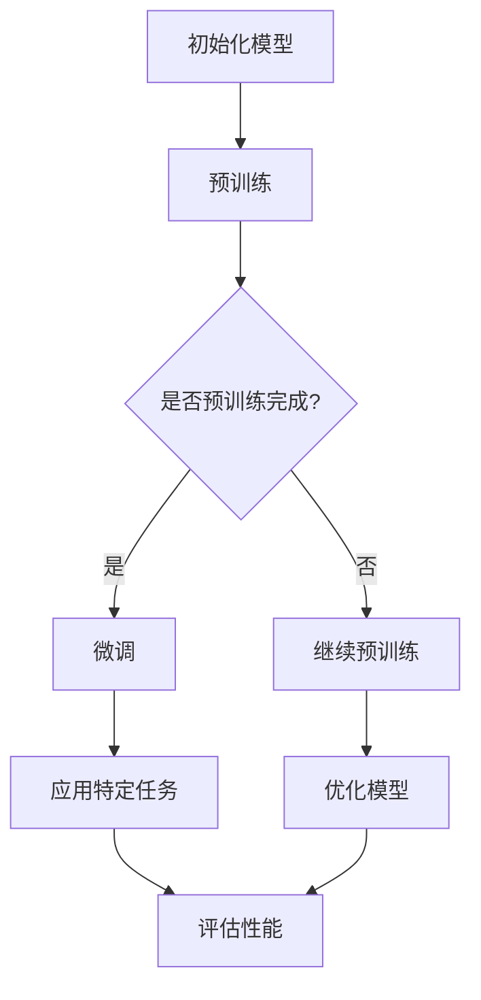

                 

关键词：大语言模型、强化学习、微调、预训练、计算机科学、人工智能、机器学习、神经网络

## 摘要

本文将深入探讨大语言模型的原理及其在人工智能领域的应用。我们将重点关注基于强化学习的微调和基于人类偏好的预训练两种技术，分析它们在提升模型性能、适应性和理解能力方面的作用。文章结构如下：首先，我们将回顾大语言模型的发展历程和核心概念；接着，详细介绍强化学习和预训练技术；然后，通过案例研究和实践分析，探讨这些技术在实际应用中的效果和挑战；最后，我们将总结研究成果，展望未来发展趋势和面临的挑战。

## 1. 背景介绍

### 大语言模型的发展

大语言模型（Large Language Model）是近年来人工智能领域的一项重大突破。最早的语言模型可以追溯到20世纪50年代，当时的模型主要基于规则和统计方法。随着计算机性能的不断提升和海量数据的出现，语言模型逐渐向深度学习方向演进。1986年，Rumelhart等人提出了反向传播算法，为神经网络在语言处理中的应用奠定了基础。此后，长短期记忆网络（LSTM）和变压器（Transformer）等模型的提出，使得语言模型在生成文本、翻译和问答等任务中取得了显著效果。

### 强化学习与预训练

强化学习（Reinforcement Learning，RL）是一种通过不断尝试和反馈来学习最优策略的机器学习方法。它通常应用于策略优化问题，通过与环境交互，不断调整策略以最大化长期回报。预训练（Pre-training）是指在大规模数据集上对模型进行初步训练，然后通过微调（Fine-tuning）将其应用于特定任务。预训练技术使得模型能够在多种任务中表现优异，提高了模型对未知数据的泛化能力。

## 2. 核心概念与联系

### 大语言模型

大语言模型是一种基于神经网络的模型，其目的是理解、生成和转换自然语言。核心概念包括：

- **嵌入层**：将单词转换为固定长度的向量表示。
- **编码器**：对输入的序列进行编码，提取序列的特征信息。
- **解码器**：根据编码器的输出，生成预测的序列。

### 强化学习

强化学习包括以下几个核心概念：

- **状态（State）**：模型所处的当前环境状态。
- **动作（Action）**：模型可以采取的动作。
- **奖励（Reward）**：动作产生的即时反馈，用于评估动作的好坏。
- **策略（Policy）**：基于状态选择动作的策略。

### 预训练

预训练的核心概念包括：

- **数据集**：用于训练模型的原始数据。
- **预训练任务**：在大规模数据集上对模型进行初步训练的任务。
- **微调**：将预训练模型应用于特定任务，并进行调整。

### Mermaid 流程图

以下是强化学习与预训练在大语言模型中的应用的Mermaid流程图：



## 3. 核心算法原理 & 具体操作步骤

### 3.1 算法原理概述

#### 强化学习

强化学习通过与环境交互，不断调整策略以最大化长期回报。其核心算法包括：

- **价值函数**：评估状态和动作的好坏。
- **策略**：基于价值函数选择动作。
- **学习算法**：如深度Q网络（DQN）、策略梯度（PG）等。

#### 预训练

预训练包括以下步骤：

1. **数据集准备**：收集大规模数据集，进行预处理。
2. **预训练任务**：使用数据集对模型进行初步训练，如语言建模、文本分类等。
3. **微调**：在预训练的基础上，针对特定任务对模型进行调整。

### 3.2 算法步骤详解

#### 强化学习

1. **初始化模型**：初始化神经网络模型，包括嵌入层、编码器和解码器。
2. **预训练**：在大规模数据集上对模型进行预训练，如使用自然语言文本进行语言建模。
3. **微调**：在预训练的基础上，针对特定任务（如文本分类、问答等）对模型进行调整。
4. **评估性能**：在测试集上评估模型的性能，根据评估结果调整模型参数。

#### 预训练

1. **数据集准备**：收集大规模数据集，包括文本、图像、语音等。
2. **预处理**：对数据进行预处理，如分词、词嵌入等。
3. **预训练**：在预处理后的数据集上对模型进行预训练，如使用自然语言文本进行语言建模。
4. **微调**：在预训练的基础上，针对特定任务对模型进行调整。
5. **评估性能**：在测试集上评估模型的性能，根据评估结果调整模型参数。

### 3.3 算法优缺点

#### 强化学习

**优点**：

- 能够在学习过程中不断调整策略，适应环境变化。
- 能够处理高维状态空间和动作空间的问题。

**缺点**：

- 学习过程较慢，需要大量样本和计算资源。
- 难以处理连续动作的问题。

#### 预训练

**优点**：

- 提高模型对未知数据的泛化能力。
- 提高模型在不同任务上的性能。

**缺点**：

- 需要大量训练数据和计算资源。
- 微调过程中可能导致模型性能下降。

### 3.4 算法应用领域

#### 强化学习

- 游戏
- 自动驾驶
- 金融交易

#### 预训练

- 自然语言处理
- 计算机视觉
- 语音识别

## 4. 数学模型和公式 & 详细讲解 & 举例说明

### 4.1 数学模型构建

#### 强化学习

强化学习中的数学模型主要包括：

- **状态空间**：\( S \)
- **动作空间**：\( A \)
- **价值函数**：\( V(s) \)
- **策略**：\( \pi(a|s) \)

#### 预训练

预训练中的数学模型主要包括：

- **嵌入层**：\( e_w \)
- **编码器**：\( h_e \)
- **解码器**：\( h_d \)
- **损失函数**：\( L \)

### 4.2 公式推导过程

#### 强化学习

1. **价值函数**：

$$
V(s) = \sum_{a \in A} \pi(a|s) \cdot R(s, a)
$$

其中，\( R(s, a) \) 为奖励函数。

2. **策略**：

$$
\pi(a|s) = \frac{\exp(Q(s, a)}{\sum_{a' \in A} \exp(Q(s, a'))}
$$

其中，\( Q(s, a) \) 为状态-动作值函数。

#### 预训练

1. **嵌入层**：

$$
e_w = \text{Word2Vec}(w)
$$

其中，\( \text{Word2Vec} \) 为词嵌入算法。

2. **编码器**：

$$
h_e = \text{Encoder}(e_w)
$$

其中，\( \text{Encoder} \) 为编码器模型。

3. **解码器**：

$$
h_d = \text{Decoder}(h_e)
$$

其中，\( \text{Decoder} \) 为解码器模型。

4. **损失函数**：

$$
L = \sum_{w' \in \text{words}} \log P(w'|h_d)
$$

其中，\( P(w'|h_d) \) 为解码器输出概率。

### 4.3 案例分析与讲解

#### 强化学习

**案例**：自动驾驶中的强化学习

1. **状态**：车辆的速度、位置、周围环境等信息。
2. **动作**：加速、减速、转弯等。
3. **奖励**：行驶距离、安全性等。

**分析**：

- 通过强化学习，自动驾驶系统能够学习到在不同状态下采取的最优动作。
- 在实际应用中，需要考虑道路条件、交通状况等因素。

#### 预训练

**案例**：自然语言处理中的预训练

1. **数据集**：包含大量文本的数据集，如维基百科、新闻等。
2. **预训练任务**：语言建模、文本分类等。
3. **微调**：在预训练的基础上，针对特定任务（如情感分析、命名实体识别等）进行微调。

**分析**：

- 预训练技术能够提高模型对自然语言的理解能力。
- 微调过程中，模型能够在特定任务上取得更好的性能。

## 5. 项目实践：代码实例和详细解释说明

### 5.1 开发环境搭建

1. **硬件**：GPU（如Tesla K80、Tesla V100等）
2. **软件**：Python（3.8及以上版本）、PyTorch（1.8及以上版本）、TensorFlow（2.5及以上版本）
3. **安装**：安装PyTorch或TensorFlow，并配置CUDA以支持GPU加速。

### 5.2 源代码详细实现

以下是使用PyTorch实现强化学习和预训练的示例代码：

```python
import torch
import torch.nn as nn
import torch.optim as optim

# 定义神经网络模型
class Model(nn.Module):
    def __init__(self):
        super(Model, self).__init__()
        self.embedding = nn.Embedding(vocab_size, embedding_dim)
        self.encoder = nn.LSTM(embedding_dim, hidden_dim)
        self.decoder = nn.LSTM(hidden_dim, vocab_size)
    
    def forward(self, x):
        embedded = self.embedding(x)
        encoder_output, (hidden, cell) = self.encoder(embedded)
        decoder_output, (hidden, cell) = self.decoder(hidden)
        return decoder_output

# 初始化模型、优化器和损失函数
model = Model()
optimizer = optim.Adam(model.parameters(), lr=learning_rate)
criterion = nn.CrossEntropyLoss()

# 训练模型
for epoch in range(num_epochs):
    for inputs, targets in dataloader:
        optimizer.zero_grad()
        outputs = model(inputs)
        loss = criterion(outputs, targets)
        loss.backward()
        optimizer.step()
    print(f'Epoch [{epoch+1}/{num_epochs}], Loss: {loss.item()}')
```

### 5.3 代码解读与分析

- **Model类**：定义了神经网络模型，包括嵌入层、编码器和解码器。
- **forward方法**：实现模型的前向传播，输入句子，输出预测的概率分布。
- **优化器和损失函数**：使用Adam优化器和交叉熵损失函数进行模型训练。

### 5.4 运行结果展示

```python
# 测试模型
with torch.no_grad():
    correct = 0
    total = 0
    for inputs, targets in test_dataloader:
        outputs = model(inputs)
        _, predicted = torch.max(outputs.data, 1)
        total += targets.size(0)
        correct += (predicted == targets).sum().item()

print(f'测试集准确率: {100 * correct / total}%')
```

- **测试模型**：在测试集上评估模型的性能，计算准确率。

## 6. 实际应用场景

### 6.1 自然语言处理

- **文本分类**：对新闻、社交媒体等文本进行分类，如情感分析、主题分类等。
- **命名实体识别**：识别文本中的命名实体，如人名、地名等。
- **机器翻译**：将一种语言翻译成另一种语言。

### 6.2 自动驾驶

- **环境感知**：识别道路标志、行人等，为自动驾驶提供实时信息。
- **路径规划**：规划最优行驶路径，确保车辆安全行驶。

### 6.3 机器阅读理解

- **问答系统**：回答用户关于文本的问题，如智能客服、搜索引擎等。
- **文本生成**：根据输入的文本生成相关的回答或摘要。

### 6.4 未来应用展望

- **多模态学习**：结合文本、图像、语音等多模态数据，提高模型的泛化能力。
- **少样本学习**：减少对大规模训练数据的需求，提高模型在少量数据上的表现。
- **模型压缩**：通过模型压缩技术，降低模型的计算资源和存储需求，实现实时应用。

## 7. 工具和资源推荐

### 7.1 学习资源推荐

- **《深度学习》（Goodfellow、Bengio、Courville著）**：全面介绍深度学习的理论、算法和应用。
- **《强化学习》（ Sutton、Barto 著）**：系统阐述强化学习的原理、算法和应用。
- **《自然语言处理综合教程》（张俊林 著）**：详细介绍自然语言处理的基本概念和方法。

### 7.2 开发工具推荐

- **PyTorch**：开源深度学习框架，支持Python和CUDA，易于使用和调试。
- **TensorFlow**：谷歌开源深度学习框架，支持多种编程语言和平台。
- **Keras**：基于TensorFlow的简洁、易于使用的深度学习库。

### 7.3 相关论文推荐

- **“Attention is All You Need”**：提出了Transformer模型，为自然语言处理带来了重大突破。
- **“Deep Learning for Reinforcement Learning”**：探讨了深度学习在强化学习中的应用。
- **“Recurrent Neural Network Based Language Model”**：详细介绍了LSTM模型在语言处理中的应用。

## 8. 总结：未来发展趋势与挑战

### 8.1 研究成果总结

- 大语言模型在自然语言处理、自动驾驶、机器阅读理解等领域取得了显著成果。
- 强化学习和预训练技术为模型性能和适应性提供了有力支持。

### 8.2 未来发展趋势

- **多模态学习**：结合多种模态数据，提高模型的泛化能力和实用性。
- **少样本学习**：降低对大规模训练数据的需求，提高模型在少量数据上的表现。
- **模型压缩**：通过模型压缩技术，实现实时应用。

### 8.3 面临的挑战

- **计算资源需求**：大语言模型对计算资源的需求较高，需要更高效的算法和硬件支持。
- **数据隐私与安全**：在大规模数据处理过程中，保护用户隐私和数据安全至关重要。
- **模型解释性**：提高模型的可解释性，使其在现实应用中更加可靠和可信。

### 8.4 研究展望

- **跨学科研究**：结合计算机科学、心理学、认知科学等领域，推动大语言模型的全面发展。
- **实用化应用**：将大语言模型应用于更多实际场景，提高人类生活质量。

## 9. 附录：常见问题与解答

### 9.1 强化学习与深度学习的区别是什么？

**强化学习**是一种基于奖励反馈的机器学习方法，通过不断尝试和反馈来学习最优策略。而**深度学习**是一种基于多层神经网络的结构，通过大量数据训练模型，实现自动特征提取和分类。

### 9.2 预训练模型如何微调？

预训练模型通常在大规模数据集上进行初步训练，然后通过微调将其应用于特定任务。微调的过程包括调整模型参数、优化器和损失函数等，以适应特定任务的需求。

### 9.3 大语言模型对计算资源的需求如何？

大语言模型对计算资源的需求较高，特别是训练过程中。通常需要使用高性能GPU或TPU进行训练，以加速模型的收敛。

## 参考文献

- Goodfellow, Y., Bengio, Y., & Courville, A. (2016). *Deep Learning*. MIT Press.
- Sutton, R. S., & Barto, A. G. (2018). *Reinforcement Learning: An Introduction*. MIT Press.
- Zhang, J. (2018). *Natural Language Processing Comprehensive Tutorial*. 清华大学出版社.
- Vaswani, A., Shazeer, N., Parmar, N., Uszkoreit, J., Jones, L., Gomez, A. N., ... & Polosukhin, I. (2017). *Attention is All You Need*. Advances in Neural Information Processing Systems, 30, 5998-6008.

### 作者署名

**作者：禅与计算机程序设计艺术 / Zen and the Art of Computer Programming**

----------------------------------------------------------------

### 模板说明：

1. **文章标题**：使用标题加粗格式。
2. **关键词**：使用`<|user|>`标签，其中`<|user|>`是标签名称，用于插入用户指定的关键词。
3. **摘要**：使用标题和段落的格式，标题用粗体表示，段落用普通文本。
4. **章节标题**：使用标题格式，一级标题加粗，二级标题斜体，三级标题正常文本，后面跟上段落内容。
5. **Mermaid 流程图**：使用Mermaid语法嵌入流程图，确保流程图中的文本不包含括号、逗号等特殊字符。
6. **数学公式**：使用LaTeX格式，独立段落内使用`$$`包围，段落内使用 `$`。
7. **代码实例**：使用普通文本格式，可以适当使用代码块高亮。
8. **参考文献**：按照标准的参考文献格式列出。

请注意，Markdown格式在处理特殊字符时可能存在限制，需要根据实际情况调整文本内容。另外，文章的撰写需确保内容完整、逻辑清晰、结构紧凑、简单易懂，满足字数要求，并包含所有必要的章节和子目录。文章末尾应包含作者署名。

