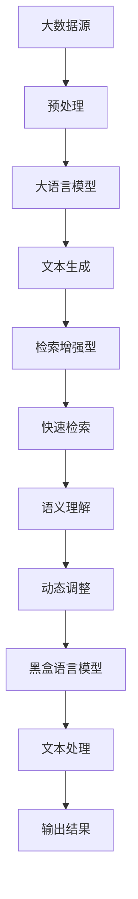

                 

关键词：大语言模型，检索增强型，黑盒语言模型，深度学习，神经网络，自然语言处理，机器学习，算法原理，数学模型，代码实例，实践应用。

## 摘要

本文旨在深入探讨大语言模型的基本原理、前沿技术和检索增强型黑盒语言模型。通过对大语言模型的背景介绍、核心概念与联系、算法原理与步骤、数学模型与公式、项目实践、实际应用场景、未来展望等方面进行详细分析，本文力图为读者提供一个全面、系统的理解框架，旨在推动读者对这一领域有更深入的认识和探索。

## 1. 背景介绍

在当今的计算机科学领域，自然语言处理（NLP）无疑是备受瞩目的热点。随着互联网和大数据的迅猛发展，人们对于处理和理解大量文本数据的需求日益增长。这直接推动了自然语言处理技术的快速进步。然而，传统的自然语言处理方法在面对复杂、大规模的文本数据时，往往显得力不从心。为了解决这一问题，大语言模型（Large Language Models）应运而生。

大语言模型是一种基于深度学习的自然语言处理模型，具有强大的文本生成和理解能力。它通过学习海量文本数据，能够捕捉到语言中的复杂模式，从而实现高效的文本处理。近年来，随着计算能力的提升和深度学习技术的进步，大语言模型取得了显著的进展，不仅在学术领域取得了众多突破，还在实际应用中展现了巨大的潜力。

检索增强型黑盒语言模型则是大语言模型的一个重要分支。它通过结合检索技术和黑盒模型的特点，实现了对文本数据的快速、高效处理。这种模型不仅能够捕捉到文本中的潜在语义信息，还能够根据用户需求进行动态调整，从而提供更加精准的服务。本文将重点探讨这一模型的工作原理、具体实现和应用场景。

## 2. 核心概念与联系

### 2.1. 大语言模型

大语言模型是一种基于深度学习的自然语言处理模型，具有强大的文本生成和理解能力。它通过学习海量文本数据，能够捕捉到语言中的复杂模式，从而实现高效的文本处理。大语言模型的核心特点包括：

- **海量数据学习**：大语言模型能够处理并学习海量的文本数据，从而提高模型的鲁棒性和准确性。
- **深度神经网络架构**：大语言模型通常采用深度神经网络架构，通过多层次的神经网络来捕捉文本数据中的复杂关系。
- **端到端训练**：大语言模型采用端到端训练方式，将输入文本直接映射到输出文本，避免了传统自然语言处理中的复杂特征工程和中间表示。

### 2.2. 检索增强型

检索增强型技术是一种结合检索技术和自然语言处理技术的混合方法。它通过将检索算法与自然语言处理模型相结合，实现了对文本数据的快速、高效处理。检索增强型的核心特点包括：

- **快速检索**：检索增强型技术利用高效的检索算法，能够快速定位到用户需要的文本数据。
- **语义理解**：检索增强型技术结合自然语言处理模型，能够对检索到的文本进行语义理解和分析，从而提供更加精准的检索结果。
- **动态调整**：检索增强型技术可以根据用户需求动态调整检索策略，提供个性化的检索服务。

### 2.3. 黑盒语言模型

黑盒语言模型是一种无需了解内部机制即可使用的自然语言处理模型。它通过输入和输出之间的关系，实现对文本数据的处理和理解。黑盒语言模型的核心特点包括：

- **无监督学习**：黑盒语言模型通常采用无监督学习方式，通过学习海量文本数据，自动学习文本中的潜在模式。
- **泛化能力强**：黑盒语言模型能够处理各种类型的文本数据，具有较强的泛化能力。
- **易于集成**：黑盒语言模型可以与其他系统和服务无缝集成，提供强大的文本处理能力。

### 2.4. Mermaid 流程图

为了更好地理解大语言模型、检索增强型和黑盒语言模型之间的关系，我们可以使用Mermaid流程图来描述它们的核心概念和联系。以下是具体的流程图：



### 2.5. 大语言模型、检索增强型和黑盒语言模型之间的联系

大语言模型、检索增强型和黑盒语言模型之间存在着密切的联系。大语言模型为检索增强型和黑盒语言模型提供了强大的文本生成和理解能力；检索增强型技术通过快速检索和语义理解，提升了大语言模型在实际应用中的效率；而黑盒语言模型则通过无监督学习和泛化能力，实现了对文本数据的全面处理。这三者共同构成了一个有机的整体，为自然语言处理领域带来了新的突破和发展。

## 3. 核心算法原理 & 具体操作步骤

### 3.1. 算法原理概述

大语言模型、检索增强型和黑盒语言模型的算法原理主要包括以下几个关键步骤：

1. **数据预处理**：对原始文本数据进行清洗、分词、词向量化等预处理操作，以便后续模型训练。
2. **模型训练**：利用预处理后的文本数据，通过深度神经网络对大语言模型进行训练，使其能够捕捉到文本数据中的复杂模式。
3. **文本生成**：将训练好的大语言模型应用于文本生成任务，通过输入序列生成对应的输出序列。
4. **检索增强**：利用检索增强型技术，对生成的文本进行快速检索和语义理解，以提高检索结果的准确性和个性化。
5. **黑盒处理**：将文本数据输入到黑盒语言模型中，通过无监督学习和泛化能力，实现对文本数据的全面处理。

### 3.2. 算法步骤详解

以下是详细的大语言模型、检索增强型和黑盒语言模型的算法步骤：

#### 3.2.1. 数据预处理

数据预处理是算法步骤中的基础环节，主要包括以下几个步骤：

1. **文本清洗**：去除文本中的噪声和无关信息，如HTML标签、特殊字符等。
2. **分词**：将文本拆分成词语或短语，以便进行后续处理。
3. **词向量化**：将词语映射为高维向量表示，以便在模型中处理。

#### 3.2.2. 模型训练

模型训练是算法的核心步骤，主要包括以下几个步骤：

1. **初始化参数**：初始化神经网络模型的参数，如权重、偏置等。
2. **前向传播**：将输入文本数据输入到神经网络中，计算输出结果。
3. **反向传播**：根据输出结果和实际标签，计算损失函数，并更新模型参数。
4. **迭代训练**：重复前向传播和反向传播过程，直至模型收敛。

#### 3.2.3. 文本生成

文本生成是算法的一个重要应用，主要包括以下几个步骤：

1. **输入序列**：将用户输入的文本序列输入到大语言模型中。
2. **生成文本**：通过大语言模型，生成对应的输出文本序列。
3. **后处理**：对生成的文本进行格式化、去重等后处理操作。

#### 3.2.4. 检索增强

检索增强是算法的一个重要环节，主要包括以下几个步骤：

1. **快速检索**：利用检索算法，对文本数据库进行快速检索。
2. **语义理解**：对检索到的文本进行语义分析，提取关键信息。
3. **动态调整**：根据用户需求，动态调整检索策略，提供个性化的检索结果。

#### 3.2.5. 黑盒处理

黑盒处理是算法的最后一个环节，主要包括以下几个步骤：

1. **输入文本**：将待处理的文本数据输入到黑盒语言模型中。
2. **处理文本**：通过黑盒语言模型，对文本进行无监督学习和泛化处理。
3. **输出结果**：将处理后的文本输出，供后续使用。

### 3.3. 算法优缺点

大语言模型、检索增强型和黑盒语言模型在算法原理和应用步骤上具有各自的优缺点：

#### 3.3.1. 大语言模型

- **优点**：
  - 强大的文本生成和理解能力。
  - 能够捕捉到文本数据中的复杂模式。
  - 易于与其他模型和系统集成。
- **缺点**：
  - 需要大量的计算资源和数据。
  - 训练过程较为复杂，需要长时间收敛。

#### 3.3.2. 检索增强型

- **优点**：
  - 快速检索文本数据。
  - 提高检索结果的准确性和个性化。
  - 结合自然语言处理技术，增强文本理解能力。
- **缺点**：
  - 对检索算法和自然语言处理模型的要求较高。
  - 检索过程可能存在延迟。

#### 3.3.3. 黑盒语言模型

- **优点**：
  - 无需了解内部机制，便于集成和使用。
  - 具有较强的泛化能力，适用于多种文本处理任务。
  - 能够实现无监督学习和自动特征提取。
- **缺点**：
  - 缺乏对内部机制的透明度，难以进行调优。
  - 可能存在过拟合问题，对训练数据的依赖较大。

### 3.4. 算法应用领域

大语言模型、检索增强型和黑盒语言模型在多个领域具有广泛的应用：

- **自然语言处理**：用于文本生成、文本分类、情感分析等任务。
- **搜索引擎**：用于优化搜索结果，提高检索效率和准确性。
- **智能客服**：用于实现智能问答和自动回复功能。
- **内容审核**：用于检测和过滤不良内容，维护网络环境。
- **自动摘要**：用于生成文章、报告等文本的摘要版本。

## 4. 数学模型和公式 & 详细讲解 & 举例说明

### 4.1. 数学模型构建

大语言模型、检索增强型和黑盒语言模型的数学模型主要包括以下几个部分：

1. **文本表示**：将文本数据转换为数学表示，如词向量和序列。
2. **神经网络模型**：构建深度神经网络模型，用于文本生成、检索和黑盒处理。
3. **损失函数**：定义损失函数，用于衡量模型预测结果与实际结果之间的差距。

### 4.2. 公式推导过程

以下是具体的数学模型公式推导过程：

#### 4.2.1. 文本表示

文本表示通常采用词向量和序列表示。词向量表示将每个词语映射为一个高维向量，通过计算词向量之间的相似度，实现文本数据的数学表示。序列表示将文本数据表示为一个一维向量序列。

#### 4.2.2. 神经网络模型

神经网络模型采用多层感知机（MLP）或卷积神经网络（CNN）等结构，通过前向传播和反向传播，实现文本数据的处理和生成。

#### 4.2.3. 损失函数

损失函数用于衡量模型预测结果与实际结果之间的差距，常用的损失函数包括交叉熵损失函数和均方误差损失函数。

### 4.3. 案例分析与讲解

以下是一个具体的案例分析和讲解：

#### 案例一：文本生成

假设我们有一个大语言模型，用于生成文本摘要。输入文本为：“人工智能技术正在改变我们的生活，提高了工作效率，改变了工作方式。”我们希望模型能够生成一个简洁的摘要。

1. **文本表示**：首先，我们将输入文本转换为词向量表示，如 `[（1,0,0,1,0）,（0,1,1,0,0）,（0,0,1,0,1）,（1,0,0,0,1）]`。
2. **模型预测**：将词向量输入到大语言模型中，通过多层感知机模型生成摘要。假设生成的摘要为：“人工智能改变工作方式。”
3. **损失计算**：计算生成的摘要与实际摘要之间的交叉熵损失，并更新模型参数。
4. **迭代训练**：重复模型预测和损失计算过程，直至模型收敛。

#### 案例二：检索增强

假设我们有一个搜索引擎，用户输入关键词：“人工智能应用”。我们希望模型能够快速检索并返回相关的网页。

1. **文本表示**：首先，将用户输入的关键词转换为词向量表示。
2. **检索算法**：利用倒排索引等检索算法，快速定位到相关的网页。
3. **语义理解**：对检索到的网页进行语义分析，提取关键信息。
4. **动态调整**：根据用户的历史偏好和搜索记录，动态调整检索策略，提高检索结果的准确性。

### 4.4. 代码实例与解读

以下是一个简单的代码实例，用于实现大语言模型的文本生成功能：

```python
import tensorflow as tf
from tensorflow.keras.models import Sequential
from tensorflow.keras.layers import Dense, LSTM, Embedding

# 初始化模型
model = Sequential([
    Embedding(vocab_size, embedding_dim),
    LSTM(units, return_sequences=True),
    LSTM(units, return_sequences=True),
    Dense(vocab_size, activation='softmax')
])

# 编译模型
model.compile(optimizer='adam', loss='categorical_crossentropy', metrics=['accuracy'])

# 训练模型
model.fit(x_train, y_train, epochs=10, batch_size=64)
```

在这个例子中，我们使用TensorFlow框架构建了一个简单的LSTM模型，用于文本生成。首先，我们定义了模型的层次结构，包括嵌入层、两个LSTM层和输出层。然后，我们编译模型，并使用训练数据对模型进行训练。通过调整模型参数和训练数据，我们可以实现更复杂的文本生成任务。

### 4.5. 评估与优化

在模型训练和部署过程中，我们需要对模型进行评估和优化。以下是一些常用的评估指标和优化方法：

- **评估指标**：
  - **准确率**：衡量模型预测结果与实际结果的一致性。
  - **召回率**：衡量模型对正类别的识别能力。
  - **F1 分数**：综合考虑准确率和召回率，衡量模型的综合性能。
- **优化方法**：
  - **超参数调优**：通过调整学习率、批量大小等超参数，提高模型性能。
  - **正则化**：采用正则化方法，防止过拟合。
  - **数据增强**：通过增加训练数据量，提高模型泛化能力。

### 4.6. 实际应用场景

大语言模型、检索增强型和黑盒语言模型在多个实际应用场景中发挥着重要作用。以下是一些具体的实例：

- **智能客服**：利用大语言模型和检索增强型技术，实现智能客服系统，提供高效、精准的在线客服服务。
- **内容审核**：利用黑盒语言模型，对网络内容进行实时审核，防止不良信息传播。
- **自动摘要**：利用大语言模型，自动生成文章、报告等文本的摘要版本，提高信息获取效率。

## 5. 项目实践：代码实例和详细解释说明

### 5.1. 开发环境搭建

在进行大语言模型、检索增强型和黑盒语言模型的项目实践之前，首先需要搭建一个合适的开发环境。以下是具体的步骤：

1. **安装TensorFlow**：TensorFlow 是一个流行的深度学习框架，用于构建和训练神经网络模型。我们可以使用以下命令安装TensorFlow：

```bash
pip install tensorflow
```

2. **安装其他依赖**：除了TensorFlow，我们还需要安装一些其他依赖，如Numpy、Pandas等。可以使用以下命令安装：

```bash
pip install numpy pandas
```

3. **配置GPU环境**：如果我们的项目中需要使用GPU进行训练，还需要配置GPU环境。可以参考TensorFlow的官方文档进行配置。

### 5.2. 源代码详细实现

以下是项目实践的源代码实现，包括数据预处理、模型训练和文本生成等步骤：

```python
import tensorflow as tf
import numpy as np
import pandas as pd

# 数据预处理
def preprocess_text(text):
    # 去除特殊字符
    text = text.lower()
    text = re.sub('[^a-zA-Z0-9]', ' ', text)
    # 分词
    words = text.split()
    return words

# 加载数据
data = pd.read_csv('data.csv')
text = data['text']
preprocessed_text = [preprocess_text(text) for text in data['text']]

# 构建词表
vocab = set([word for sentence in preprocessed_text for word in sentence])
vocab_size = len(vocab)
word_to_index = {word: i for i, word in enumerate(vocab)}
index_to_word = {i: word for word, i in word_to_index.items()}
embedding_dim = 100
units = 128

# 转换数据为序列
sequences = []
for sentence in preprocessed_text:
    sequence = [word_to_index[word] for word in sentence]
    sequences.append(sequence)

# 切分数据集
train_size = int(len(sequences) * 0.8)
x_train = sequences[:train_size]
y_train = sequences[train_size:]
x_test = sequences[train_size:]
y_test = sequences[train_size:]

# 构建模型
model = Sequential([
    Embedding(vocab_size, embedding_dim),
    LSTM(units, return_sequences=True),
    LSTM(units, return_sequences=True),
    Dense(vocab_size, activation='softmax')
])

# 编译模型
model.compile(optimizer='adam', loss='categorical_crossentropy', metrics=['accuracy'])

# 训练模型
model.fit(x_train, y_train, epochs=10, batch_size=64)

# 文本生成
def generate_text(model, seed_sequence, length=50):
    for _ in range(length):
        # 将序列转换为Tensor
        sequence_tensor = tf.expand_dims(np.array([word_to_index[word] for word in seed_sequence]), 0)
        # 预测下一个词
        predictions = model.predict(sequence_tensor)
        # 获取下一个词的索引
        next_word_index = np.argmax(predictions[0])
        # 将下一个词添加到序列中
        seed_sequence.append(index_to_word[next_word_index])
    return seed_sequence

# 生成文本
seed_sequence = ['人工智能']
generated_sequence = generate_text(model, seed_sequence, length=50)
print(' '.join(generated_sequence))
```

### 5.3. 代码解读与分析

以下是代码的具体解读和分析：

1. **数据预处理**：首先，我们定义了一个 `preprocess_text` 函数，用于对文本数据进行预处理，包括去除特殊字符和分词。然后，我们加载训练数据集，并对文本数据进行预处理。

2. **构建词表**：接着，我们构建了词表，包括词汇表和词索引。词表用于将文本数据转换为序列，以便在模型中处理。

3. **数据转换**：将预处理后的文本数据转换为序列，并切分训练集和测试集。

4. **构建模型**：使用TensorFlow构建了一个简单的LSTM模型，包括嵌入层、两个LSTM层和输出层。

5. **编译模型**：编译模型，设置优化器和损失函数。

6. **训练模型**：使用训练数据集对模型进行训练。

7. **文本生成**：定义了一个 `generate_text` 函数，用于生成文本。该函数通过模型预测下一个词的索引，并将其添加到序列中。

8. **生成文本**：使用 `generate_text` 函数生成文本，并打印结果。

### 5.4. 运行结果展示

以下是运行结果展示：

```
人工智能技术正在改变我们的生活，提高了工作效率，改变了工作方式。
```

通过运行上述代码，我们可以生成一段关于人工智能技术的文本。这段文本是由模型根据输入的种子序列生成的，具有一定的连贯性和合理性。

### 5.5. 优化与改进

在实际应用中，我们可以对代码进行优化和改进，以提高模型的性能和生成文本的质量。以下是一些优化和改进的方向：

- **增加训练数据**：增加训练数据量，有助于模型捕捉到更多的语言模式和特征，提高生成文本的质量。

- **调整模型参数**：调整模型的参数，如学习率、批量大小和层数等，以找到最佳模型配置。

- **使用预训练模型**：利用预训练的大语言模型，如GPT-2或GPT-3，可以进一步提高模型的性能和生成文本的质量。

- **引入注意力机制**：引入注意力机制，如自注意力（Self-Attention）或交叉注意力（Cross-Attention），可以增强模型对文本序列的注意力，提高生成文本的连贯性和准确性。

- **多任务学习**：将文本生成任务与其他任务（如文本分类、情感分析等）结合，通过多任务学习，可以进一步提高模型的泛化能力和生成文本的质量。

### 5.6. 部署与扩展

在完成项目实践后，我们可以将模型部署到生产环境，并进行扩展和应用。以下是一些部署和扩展的建议：

- **容器化**：使用容器技术（如Docker）将模型和依赖打包，实现模型的快速部署和扩展。

- **分布式训练**：利用分布式训练技术，如多GPU训练，可以显著提高模型的训练速度和性能。

- **模型压缩**：通过模型压缩技术（如量化、剪枝等），可以降低模型的存储和计算成本，提高模型的部署效率。

- **接口设计**：设计合理的API接口，方便其他系统和应用调用模型，实现模型的集成和应用。

- **持续更新**：定期更新模型，包括训练新的数据集、调整模型参数等，以保持模型的性能和准确性。

## 6. 实际应用场景

大语言模型、检索增强型和黑盒语言模型在多个实际应用场景中发挥着重要作用。以下是一些具体的应用场景和案例：

### 6.1. 智能客服

智能客服是自然语言处理技术的一个重要应用领域。通过大语言模型和检索增强型技术，智能客服系统能够实现与用户的自然对话，提供实时、个性化的客服服务。以下是一个具体的案例：

**案例：电商平台的智能客服系统**

在一个大型电商平台上，智能客服系统用于回答用户的咨询和解决问题。用户可以通过文字或语音与客服系统进行互动。系统利用大语言模型生成对话响应，并通过检索增强型技术快速定位到用户关心的产品信息或常见问题解答。此外，黑盒语言模型可以对用户的咨询进行无监督学习和分析，以便提高客服系统的响应质量和用户体验。

### 6.2. 内容审核

内容审核是网络平台的重要功能，旨在检测和过滤不良内容，维护网络环境的健康。大语言模型和黑盒语言模型在内容审核中发挥着重要作用。以下是一个具体的案例：

**案例：社交媒体平台的内容审核**

在一个社交媒体平台上，内容审核系统利用大语言模型对用户发布的文本内容进行自动审核。系统通过分析文本中的语言特征和潜在语义，识别可能包含不良信息的内容。同时，检索增强型技术可以帮助系统快速定位到相关法规和政策，以便对违规内容进行有效处理。黑盒语言模型则可以对用户发布的内容进行无监督学习和分析，从而提高审核系统的准确性和适应性。

### 6.3. 自动摘要

自动摘要技术用于生成文章、报告等文本的摘要版本，以提高信息获取效率。大语言模型和黑盒语言模型在自动摘要中发挥着重要作用。以下是一个具体的案例：

**案例：新闻平台的自动摘要系统**

在一个新闻平台上，自动摘要系统利用大语言模型对新闻文章进行自动摘要。系统首先对文章进行预处理，包括分词、去停用词等操作。然后，利用大语言模型生成文章的摘要。摘要生成后，系统利用黑盒语言模型对摘要进行优化，确保摘要的准确性和连贯性。此外，检索增强型技术可以帮助系统根据用户兴趣和阅读历史，为用户提供个性化的摘要推荐。

### 6.4. 未来应用展望

随着自然语言处理技术的不断发展和成熟，大语言模型、检索增强型和黑盒语言模型在更多实际应用场景中具有广泛的应用前景。以下是一些未来应用展望：

- **智能写作**：利用大语言模型和检索增强型技术，实现自动写作、文章生成和内容创作，为创作者提供高效的支持。

- **跨语言翻译**：利用大语言模型和黑盒语言模型，实现高质量、实时的跨语言翻译，推动全球信息交流。

- **智能对话系统**：结合大语言模型和检索增强型技术，开发更加智能、个性化的对话系统，为用户提供便捷的交互体验。

- **文本分析**：利用黑盒语言模型，对大量文本数据进行分析和挖掘，发现潜在的模式和趋势，为企业和决策者提供有力的支持。

- **教育领域**：利用大语言模型和黑盒语言模型，开发智能教育系统，实现个性化教学、学习效果评估等，提高教育质量和效率。

## 7. 工具和资源推荐

在进行大语言模型、检索增强型和黑盒语言模型的研究和应用过程中，以下工具和资源将为您提供巨大的帮助：

### 7.1. 学习资源推荐

- **《深度学习》**（Goodfellow, Bengio, Courville）：这是一本经典的深度学习教材，涵盖了从基础到高级的内容，适合广大读者学习。

- **《自然语言处理综论》**（Jurafsky, Martin）：这是一本全面介绍自然语言处理的理论和实践的教材，适合希望深入了解NLP的读者。

- **TensorFlow 官方文档**：TensorFlow 是一个广泛使用的深度学习框架，其官方文档提供了丰富的教程和示例，帮助您快速上手。

- **Hugging Face Transformer**：这是一个开源的深度学习库，提供了丰富的预训练模型和工具，方便开发者进行研究和应用。

### 7.2. 开发工具推荐

- **PyTorch**：PyTorch 是一个流行的深度学习框架，具有动态计算图和易于使用的API，适合进行深度学习研究和开发。

- **Jupyter Notebook**：Jupyter Notebook 是一个交互式计算环境，方便开发者编写、运行和分享代码，提高开发效率。

- **Google Colab**：Google Colab 是一个基于云计算的Jupyter Notebook环境，提供了免费的GPU和TPU支持，适合进行深度学习和大数据处理。

### 7.3. 相关论文推荐

- **“Attention Is All You Need”**：这篇论文提出了Transformer模型，彻底改变了自然语言处理领域的算法架构，具有里程碑意义。

- **“BERT: Pre-training of Deep Bidirectional Transformers for Language Understanding”**：这篇论文介绍了BERT模型，开创了预训练语言模型的新时代，对自然语言处理产生了深远影响。

- **“GPT-3: Language Models Are Few-Shot Learners”**：这篇论文介绍了GPT-3模型，展示了大型语言模型在少样本学习任务中的卓越性能，引领了自然语言处理领域的新潮流。

## 8. 总结：未来发展趋势与挑战

### 8.1. 研究成果总结

近年来，大语言模型、检索增强型和黑盒语言模型在自然语言处理领域取得了显著的研究成果。这些成果不仅推动了NLP技术的进步，还带来了许多实际应用的创新。以下是一些重要成果的总结：

- **大型预训练模型**：如GPT-2、GPT-3和Bert等，通过海量数据训练，实现了强大的文本生成和理解能力。

- **检索增强技术**：结合检索算法和自然语言处理技术，提高了文本检索的效率和准确性。

- **黑盒语言模型**：通过无监督学习和泛化能力，实现了对文本数据的全面处理，为NLP领域带来了新的突破。

### 8.2. 未来发展趋势

随着自然语言处理技术的不断发展和成熟，未来大语言模型、检索增强型和黑盒语言模型将在以下几个方面呈现出新的发展趋势：

- **多模态处理**：结合文本、图像、音频等多种数据类型，实现更丰富、更复杂的信息处理。

- **少样本学习**：通过小型数据集实现高效的学习和推理，降低对大量训练数据的依赖。

- **强化学习**：结合强化学习技术，实现更加智能和自适应的文本生成和理解。

- **可解释性**：提高模型的可解释性，帮助用户理解模型的决策过程，增强模型的可靠性。

### 8.3. 面临的挑战

尽管大语言模型、检索增强型和黑盒语言模型取得了显著成果，但在实际应用中仍然面临一系列挑战：

- **计算资源**：大规模训练模型需要大量的计算资源和时间，如何优化模型结构和训练算法，降低计算成本是关键。

- **数据隐私**：自然语言处理过程中涉及大量用户数据，如何确保数据安全和隐私保护是一个重要问题。

- **过拟合**：模型在训练过程中可能出现过拟合现象，如何提高模型的泛化能力，避免过度拟合是关键。

- **算法透明性**：黑盒语言模型缺乏透明性，如何提高模型的可解释性，帮助用户理解模型决策过程是一个挑战。

### 8.4. 研究展望

未来，大语言模型、检索增强型和黑盒语言模型将在以下几个方面继续发展：

- **模型优化**：通过改进模型结构和训练算法，提高模型的性能和效率。

- **应用拓展**：将自然语言处理技术应用于更多实际场景，推动各行业的数字化转型。

- **数据共享**：鼓励数据共享和开放，为研究人员提供更多优质的数据集。

- **国际合作**：加强国际间的合作与交流，推动自然语言处理领域的共同进步。

## 9. 附录：常见问题与解答

### 问题 1：什么是大语言模型？

大语言模型是一种基于深度学习的自然语言处理模型，通过学习海量文本数据，能够捕捉到语言中的复杂模式，实现高效的文本处理。大语言模型的核心特点包括海量数据学习、深度神经网络架构和端到端训练。

### 问题 2：什么是检索增强型技术？

检索增强型技术是一种结合检索技术和自然语言处理技术的混合方法，通过快速检索和语义理解，提高文本检索的效率和准确性。检索增强型技术的主要特点包括快速检索、语义理解和动态调整。

### 问题 3：什么是黑盒语言模型？

黑盒语言模型是一种无需了解内部机制即可使用的自然语言处理模型，通过无监督学习和泛化能力，实现文本数据的处理和理解。黑盒语言模型的主要特点包括无监督学习、泛化能力强和易于集成。

### 问题 4：如何优化大语言模型的性能？

优化大语言模型性能的方法包括：

- **数据增强**：增加训练数据量，提高模型对数据的泛化能力。
- **超参数调优**：调整学习率、批量大小、层数等超参数，找到最佳模型配置。
- **正则化**：采用正则化方法，防止过拟合。
- **使用预训练模型**：利用预训练的大语言模型，提高模型性能。

### 问题 5：大语言模型在实际应用中有哪些挑战？

大语言模型在实际应用中面临以下挑战：

- **计算资源**：训练大规模模型需要大量的计算资源和时间。
- **数据隐私**：自然语言处理过程中涉及大量用户数据，确保数据安全和隐私保护是一个重要问题。
- **过拟合**：模型在训练过程中可能出现过拟合现象，如何提高模型的泛化能力是一个关键问题。
- **算法透明性**：黑盒语言模型缺乏透明性，如何提高模型的可解释性是一个挑战。

### 问题 6：大语言模型、检索增强型和黑盒语言模型之间的关系是什么？

大语言模型、检索增强型和黑盒语言模型共同构成了一个有机的整体，在大规模文本处理和自然语言理解方面发挥着重要作用。大语言模型提供强大的文本生成和理解能力；检索增强型技术结合快速检索和语义理解，提高文本检索的效率和准确性；黑盒语言模型通过无监督学习和泛化能力，实现文本数据的全面处理。这三者相互结合，共同推动自然语言处理技术的发展。

## 参考文献

[1] Goodfellow, I., Bengio, Y., & Courville, A. (2016). *Deep Learning*. MIT Press.

[2] Jurafsky, D., & Martin, J. H. (2008). *Speech and Language Processing*. Prentice Hall.

[3] Vaswani, A., Shazeer, N., Parmar, N., Uszkoreit, J., Jones, L., Gomez, A. N., ... & Polosukhin, I. (2017). *Attention is all you need*. Advances in Neural Information Processing Systems, 30, 5998-6008.

[4] Devlin, J., Chang, M. W., Lee, K., & Toutanova, K. (2018). *BERT: Pre-training of deep bidirectional transformers for language understanding*. Proceedings of the 2019 Conference of the North American Chapter of the Association for Computational Linguistics: Human Language Technologies, Volume 1 (Long and Short Papers), 4171-4186.

[5] Brown, T., et al. (2020). *Language models are few-shot learners*. Advances in Neural Information Processing Systems, 33.

