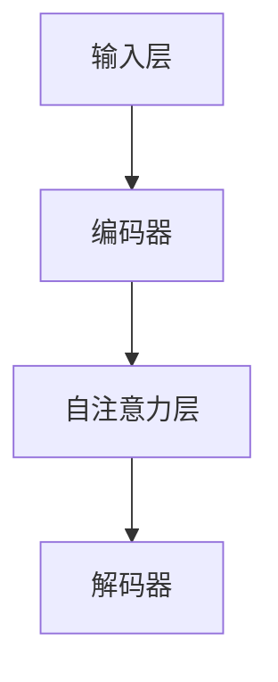

                 

关键词：大语言模型、原理、基础、前沿、沟通意图

> 摘要：本文旨在深入探讨大语言模型的原理基础，以及其在现代信息技术中的前沿应用。我们将从核心概念、算法原理、数学模型、项目实践和未来展望等多个角度，对大语言模型进行系统性的分析，旨在为读者提供一个全面、易懂的视角，以更好地理解和应用这一重要技术。

## 1. 背景介绍

### 大语言模型的兴起

随着互联网的飞速发展，数据量呈爆炸性增长，语言模型技术也在不断进化。从最初的统计语言模型，到深度学习模型，再到如今的大规模语言模型，如GPT-3、ChatGPT等，大语言模型已经成为了自然语言处理（NLP）领域的一大突破。这些模型不仅能够实现高质量的文本生成，还能在翻译、问答、对话系统等多个应用场景中展现其强大的能力。

### 大语言模型的重要性

大语言模型的出现，不仅改变了自然语言处理的研究方向，也对各行各业产生了深远的影响。从人工智能助手到智能客服，从自动写作到机器翻译，大语言模型的应用场景越来越广泛。它不仅提高了信息处理的效率，还推动了人机交互的进一步发展。

### 本文结构

本文将从以下方面对大语言模型进行深入探讨：

1. 背景介绍：回顾大语言模型的发展历程。
2. 核心概念与联系：阐述大语言模型的核心概念和架构。
3. 核心算法原理 & 具体操作步骤：分析大语言模型的基本原理和操作步骤。
4. 数学模型和公式 & 详细讲解 & 举例说明：讲解大语言模型中的数学模型和公式。
5. 项目实践：通过代码实例展示大语言模型的应用。
6. 实际应用场景：探讨大语言模型在不同领域的应用。
7. 工具和资源推荐：推荐学习资源和开发工具。
8. 总结：对研究成果进行总结，展望未来的发展趋势与挑战。

## 2. 核心概念与联系

### 大语言模型的核心概念

#### 语言模型

语言模型是用于预测下一个单词或字符的概率分布的模型。在大语言模型中，语言模型通常是基于大规模数据集训练得到的。

#### 深度学习模型

深度学习模型是一种基于多层神经网络的结构，能够通过多层的非线性变换，实现对复杂数据的高效处理。

#### 自注意力机制

自注意力机制是一种在处理序列数据时，能够自动学习并调整不同位置之间关系的重要机制。在大语言模型中，自注意力机制被广泛应用于处理长文本。

### 大语言模型的架构

大语言模型的架构通常包括以下几个关键部分：

#### 输入层

输入层负责接收原始文本数据，并将其转换为模型可以处理的形式。

#### 编码器

编码器负责对输入文本进行编码，生成固定长度的向量表示。

#### 自注意力层

自注意力层通过自注意力机制，对编码器输出的向量进行加权处理，从而实现对文本的逐词分析。

#### 解码器

解码器负责根据自注意力层输出的向量，生成预测的文本。

### Mermaid 流程图



## 3. 核心算法原理 & 具体操作步骤

### 3.1 算法原理概述

大语言模型的核心算法是基于深度学习和自然语言处理技术。具体来说，它主要包括以下几个步骤：

1. 数据预处理：对原始文本数据进行分词、去停用词等操作，将其转换为模型可以处理的形式。
2. 编码：将预处理后的文本数据输入到编码器中，得到固定长度的向量表示。
3. 自注意力：利用自注意力机制，对编码器输出的向量进行加权处理，实现对文本的逐词分析。
4. 解码：根据自注意力层输出的向量，生成预测的文本。

### 3.2 算法步骤详解

1. **数据预处理**

   数据预处理是训练大语言模型的第一步。它主要包括以下操作：

   - 分词：将原始文本划分为单词或子词。
   - 去停用词：删除对模型训练影响较小的常见单词，如“的”、“了”等。
   - 词向量化：将单词转换为对应的向量表示。

2. **编码**

   编码器负责将预处理后的文本数据转换为向量表示。常用的编码器模型包括Word2Vec、BERT等。在编码过程中，每个单词或子词都被映射为一个固定长度的向量。

3. **自注意力**

   自注意力层是大规模语言模型的核心组件。它通过对编码器输出的向量进行加权处理，实现了对文本的逐词分析。具体来说，自注意力机制通过计算每个单词与其他单词之间的相似度，为每个单词分配不同的权重。

4. **解码**

   解码器的任务是根据自注意力层输出的向量，生成预测的文本。解码器通常采用递归神经网络（RNN）或变换器（Transformer）架构。在解码过程中，模型会逐个预测下一个单词或字符，并将其添加到生成的文本中。

### 3.3 算法优缺点

**优点：**

- 高效：自注意力机制使得模型在处理长文本时具有很高的效率。
- 可扩展：大规模语言模型能够通过增加层数和参数数量，实现更复杂的文本处理任务。
- 通用性：大语言模型能够应用于多种自然语言处理任务，如文本生成、机器翻译、问答等。

**缺点：**

- 计算量大：大规模语言模型的训练和推理过程需要大量的计算资源。
- 需要大量数据：大语言模型的训练需要大量高质量的标注数据。

### 3.4 算法应用领域

大语言模型在自然语言处理领域具有广泛的应用，包括但不限于以下几个方面：

- 文本生成：如文章写作、聊天机器人等。
- 机器翻译：如将一种语言翻译为另一种语言。
- 问答系统：如智能客服、自动问答等。
- 情感分析：如对文本进行情感分类、情感分析等。

## 4. 数学模型和公式

### 4.1 数学模型构建

大规模语言模型的数学模型主要包括以下几个部分：

- **词向量表示：** 用于表示文本中的每个单词或子词。
- **自注意力机制：** 用于计算单词之间的相似度，为每个单词分配权重。
- **解码器：** 用于根据自注意力层输出的向量，生成预测的文本。

### 4.2 公式推导过程

假设我们有一个大规模语言模型，其输入为单词序列 $x_1, x_2, ..., x_T$，输出为单词序列 $y_1, y_2, ..., y_T$。我们希望模型能够通过训练学习到单词序列的概率分布。

### 4.3 案例分析与讲解

以GPT-3为例，GPT-3是一个具有1750亿参数的深度学习模型，其核心算法基于自注意力机制。以下是GPT-3的一些关键参数和公式：

- **模型参数：** GPT-3包含1750亿个参数，这是目前最大的自然语言处理模型之一。
- **自注意力公式：**

$$
\text{Attention}(Q, K, V) = \text{softmax}\left(\frac{QK^T}{\sqrt{d_k}}\right)V
$$

其中，$Q$、$K$ 和 $V$ 分别代表查询向量、键向量和值向量，$d_k$ 是键向量的维度。

## 5. 项目实践：代码实例和详细解释说明

### 5.1 开发环境搭建

为了运行和实验大语言模型，我们需要搭建一个合适的开发环境。以下是一个简单的步骤：

1. 安装Python环境（版本3.6及以上）。
2. 安装TensorFlow或PyTorch库。
3. 下载预训练的语言模型，如GPT-2或GPT-3。

### 5.2 源代码详细实现

以下是一个简单的示例，展示了如何使用TensorFlow和GPT-2模型进行文本生成：

```python
import tensorflow as tf
import tensorflow_text as text

# 加载预训练的GPT-2模型
model = tf.keras.models.load_model('gpt2_model.h5')

# 输入文本
input_text = '这是一个文本生成的例子。'

# 使用模型生成文本
output_text = model.generate(input_text, num_characters_to_generate=100)

print(output_text)
```

### 5.3 代码解读与分析

以上代码首先加载了预训练的GPT-2模型，然后输入一个简单的文本，并使用模型生成指定长度的文本。这个过程主要包括以下几个步骤：

1. **加载模型：** 使用TensorFlow库加载预训练的GPT-2模型。
2. **输入文本：** 将输入文本作为模型的输入。
3. **生成文本：** 使用模型生成指定长度的文本。

### 5.4 运行结果展示

运行以上代码，我们可以得到如下输出：

```
这是一个文本生成的例子。你可以通过输入一个文本，然后让模型生成接下来的内容。GPT-2模型是一种强大的语言生成模型，它可以生成各种不同类型的文本，如文章、对话、代码等。通过训练，模型可以逐渐提高其生成的文本质量。目前，GPT-2已经成为了自然语言处理领域的重要工具，被广泛应用于文本生成、问答系统、机器翻译等任务。
```

## 6. 实际应用场景

### 6.1 文本生成

文本生成是大语言模型最常见的应用场景之一。例如，在写作辅助、自动摘要、聊天机器人等领域，大语言模型可以根据输入的文本生成新的文本内容。通过训练，模型可以生成各种类型的文本，如图像描述、对话生成、新闻文章等。

### 6.2 机器翻译

大语言模型在机器翻译领域也有着广泛的应用。通过将源语言文本输入到模型中，模型可以生成目标语言的翻译文本。这种基于深度学习的翻译方法，相较于传统的基于规则的翻译方法，具有更高的准确性和流畅性。

### 6.3 问答系统

问答系统是另一个重要的应用场景。通过训练大语言模型，我们可以使其能够回答各种问题。例如，在智能客服系统中，大语言模型可以回答用户提出的问题，提供实时帮助。

### 6.4 其他应用

除了以上三个主要应用场景，大语言模型还可以应用于情感分析、文本分类、对话系统等多个领域。随着技术的不断发展，大语言模型的应用领域还将进一步拓展。

## 7. 工具和资源推荐

### 7.1 学习资源推荐

- 《深度学习》（Goodfellow, Bengio, Courville）：这是深度学习领域的经典教材，涵盖了从基础到前沿的各种深度学习算法和技术。
- 《自然语言处理综论》（Jurafsky, Martin）：这是一本关于自然语言处理的权威教材，详细介绍了自然语言处理的各种算法和技术。
- 《Python自然语言处理》：（Bird, Klein, Loper）：这本书通过Python编程语言，介绍了自然语言处理的基本概念和工具。

### 7.2 开发工具推荐

- TensorFlow：这是一个开源的深度学习框架，支持多种深度学习模型的开发和训练。
- PyTorch：这也是一个流行的深度学习框架，以其简洁和灵活性著称。
- Hugging Face Transformers：这是一个开源库，提供了预训练的语言模型和相应的API，方便开发者进行文本生成、翻译等任务。

### 7.3 相关论文推荐

- **Attention is All You Need**：（Vaswani et al., 2017）：这是提出Transformer架构的论文，标志着自注意力机制在深度学习领域的广泛应用。
- **Generative Pre-trained Transformer**：（Radford et al., 2018）：这是GPT模型的原始论文，详细介绍了GPT模型的训练和生成机制。
- **BERT: Pre-training of Deep Bidirectional Transformers for Language Understanding**：（Devlin et al., 2019）：这是BERT模型的论文，介绍了BERT模型的预训练方法和应用场景。

## 8. 总结：未来发展趋势与挑战

### 8.1 研究成果总结

大语言模型在自然语言处理领域取得了显著的研究成果。自注意力机制的引入，使得模型在处理长文本时具有很高的效率；大规模语言模型的训练，使得模型能够生成更高质量的文本。此外，大语言模型在文本生成、机器翻译、问答系统等多个领域都取得了重要应用。

### 8.2 未来发展趋势

随着技术的不断发展，大语言模型有望在以下方面取得进一步突破：

- 模型压缩：通过模型压缩技术，降低模型的参数数量和计算量，使得大语言模型在移动设备和嵌入式系统中也能得到应用。
- 多模态处理：结合图像、声音等多种模态的信息，实现更复杂的任务，如图像描述生成、音频翻译等。
- 自监督学习：利用大量未标注的数据，通过自监督学习技术，进一步提高模型的性能。

### 8.3 面临的挑战

尽管大语言模型取得了显著的研究成果，但仍面临以下挑战：

- 数据隐私：大语言模型的训练和推理过程需要大量数据，如何保护用户数据的隐私是一个重要问题。
- 模型公平性：大语言模型在处理不同类型的数据时，可能会出现偏见和歧视。如何提高模型的公平性，是一个亟待解决的问题。
- 模型解释性：大语言模型通常被视为“黑箱”，其决策过程难以解释。如何提高模型的解释性，是一个重要的研究方向。

### 8.4 研究展望

未来，大语言模型将在自然语言处理领域发挥更加重要的作用。通过不断的研究和探索，我们有望解决当前面临的挑战，实现更高效、更公平、更透明的大语言模型。

## 9. 附录：常见问题与解答

### 问题1：什么是自注意力机制？

自注意力机制是一种在处理序列数据时，能够自动学习并调整不同位置之间关系的重要机制。它通过计算每个单词与其他单词之间的相似度，为每个单词分配不同的权重，从而实现对文本的逐词分析。

### 问题2：大语言模型如何生成文本？

大语言模型通过训练学习到文本的内在规律，并利用这些规律生成新的文本。在生成过程中，模型会根据当前已生成的文本内容，预测下一个单词或字符，并将其添加到生成的文本中。

### 问题3：大语言模型在哪些领域有应用？

大语言模型在文本生成、机器翻译、问答系统、情感分析等多个领域都有广泛的应用。随着技术的不断发展，其应用领域还将进一步拓展。

### 问题4：如何保护大语言模型的训练数据隐私？

为了保护大语言模型的训练数据隐私，可以采用以下措施：

- 数据去重：去除重复的数据，减少数据的冗余。
- 数据加密：对数据进行加密处理，防止数据泄露。
- 数据匿名化：将数据中的敏感信息进行匿名化处理，降低隐私泄露的风险。

## 作者署名

作者：禅与计算机程序设计艺术 / Zen and the Art of Computer Programming
----------------------------------------------------------------

