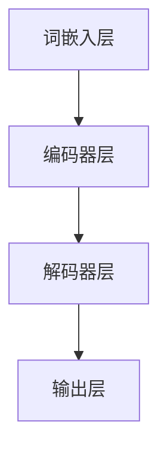

                 

关键词：大语言模型、深度学习、神经网络、混合方法、自然语言处理、机器学习

摘要：本文将对大语言模型的基本原理进行深入探讨，并重点关注其在深度学习和神经网络领域的前沿应用。通过分析大语言模型的核心概念和架构，结合实际案例和代码实例，我们将详细讲解其数学模型、算法原理以及实际应用。文章还将探讨大语言模型在未来技术发展中的应用前景，以及面临的挑战和研究方向。

## 1. 背景介绍

随着互联网和大数据的快速发展，自然语言处理（NLP）成为计算机科学领域的重要分支。近年来，深度学习和神经网络技术在大规模语言模型研究中取得了显著进展。大语言模型，作为一种能够理解和生成人类语言的强大工具，已经广泛应用于机器翻译、语音识别、文本生成、情感分析等任务。

### 1.1 大语言模型的发展历史

大语言模型的发展可以追溯到20世纪80年代，当时研究人员开始探索统计语言模型。随着计算能力和数据资源的提升，基于神经网络的深度学习模型逐渐成为主流。2018年，谷歌推出了Transformer模型，标志着大语言模型进入一个崭新的时代。近年来，BERT、GPT等大型预训练模型不断刷新性能记录，推动NLP技术迈向新的高度。

### 1.2 大语言模型的应用场景

大语言模型的应用场景广泛，主要包括以下几个方面：

- **机器翻译**：大语言模型能够准确理解不同语言的语法和语义，实现高效、准确的机器翻译。
- **语音识别**：通过结合语音识别技术，大语言模型能够实现语音到文字的转换。
- **文本生成**：大语言模型可以生成高质量的文章、新闻、故事等，为内容创作提供有力支持。
- **情感分析**：通过对文本进行情感分析，大语言模型可以识别用户的情绪和态度。
- **推荐系统**：大语言模型可以分析用户评论和反馈，为推荐系统提供更准确的推荐结果。

## 2. 核心概念与联系

### 2.1 深度学习与神经网络

深度学习是一种基于神经网络的学习方法，通过多层神经元之间的非线性变换，实现对复杂数据的高效建模。神经网络由多个神经元组成，每个神经元接收来自前一层神经元的输入，并产生输出。通过不断调整神经元的权重和偏置，神经网络可以学会对数据执行特定操作。

### 2.2 自然语言处理

自然语言处理旨在使计算机能够理解、处理和生成人类语言。其核心任务包括词向量表示、语法分析、语义理解、语言生成等。自然语言处理技术的核心在于将语言符号转化为计算机可处理的数字形式，并在此基础上进行建模和分析。

### 2.3 大语言模型的架构

大语言模型通常采用分层结构，包括词嵌入层、编码器层、解码器层和输出层。词嵌入层将词汇映射为高维向量表示；编码器层负责对输入文本进行编码，提取关键信息；解码器层生成输出文本；输出层根据解码结果生成最终输出。

### 2.4 Mermaid 流程图

以下是大语言模型的核心概念和架构的 Mermaid 流程图：



## 3. 核心算法原理 & 具体操作步骤

### 3.1 算法原理概述

大语言模型的核心算法是基于注意力机制的 Transformer 模型。Transformer 模型通过自注意力机制（Self-Attention）和多头注意力机制（Multi-Head Attention）实现序列到序列的映射。自注意力机制允许模型在处理序列数据时考虑全局信息，从而提高模型的上下文理解能力。多头注意力机制通过并行处理多个注意力头，进一步提高模型的表示能力。

### 3.2 算法步骤详解

1. **词嵌入（Word Embedding）**：将输入文本中的每个词映射为高维向量表示。
2. **编码器（Encoder）**：输入词向量经过编码器层，通过自注意力机制提取序列中的关键信息。
3. **解码器（Decoder）**：编码器的输出作为解码器的输入，解码器通过自注意力和交叉注意力机制生成输出序列。
4. **输出层（Output Layer）**：解码器的输出通过输出层生成最终输出。

### 3.3 算法优缺点

**优点**：

- **全局信息捕捉**：自注意力机制使得模型能够考虑全局信息，提高上下文理解能力。
- **并行计算**：Transformer 模型基于并行计算，训练效率较高。
- **强大的表示能力**：多头注意力机制和多层编码器结构使得模型具有强大的表示能力。

**缺点**：

- **计算复杂度高**：自注意力机制的复杂度较高，导致模型训练时间较长。
- **参数量庞大**：大规模的语言模型通常具有大量的参数，导致模型存储和计算资源消耗较大。

### 3.4 算法应用领域

大语言模型在以下领域具有广泛应用：

- **机器翻译**：通过翻译模型将一种语言翻译成另一种语言。
- **文本生成**：生成文章、新闻、故事等文本内容。
- **问答系统**：从大量文本中检索并生成答案。
- **情感分析**：分析文本中的情感和态度。
- **推荐系统**：分析用户评论和反馈，为推荐系统提供推荐结果。

## 4. 数学模型和公式 & 详细讲解 & 举例说明

### 4.1 数学模型构建

大语言模型基于自注意力机制和多头注意力机制构建，其核心公式如下：

$$
\text{Attention}(Q, K, V) = \frac{softmax(\text{softmax}(\text{QK}^T)/\sqrt{d_k})V}
$$

其中，$Q, K, V$ 分别为查询向量、键向量和值向量，$d_k$ 为键向量的维度。

### 4.2 公式推导过程

自注意力机制的推导过程如下：

1. **计算点积**：计算查询向量 $Q$ 和键向量 $K$ 的点积，得到注意力得分。
2. **应用 softmax 函数**：将点积得分通过 softmax 函数转换为概率分布。
3. **计算加权求和**：将概率分布与值向量 $V$ 相乘，并加权求和，得到输出向量。

### 4.3 案例分析与讲解

以下是一个简单的自注意力机制的例子：

假设输入文本为：“今天天气很好”。

1. **词嵌入**：将每个词映射为高维向量，如 `[1, 0, 0]` 表示“今天”、 `[0, 1, 0]` 表示“天气”、 `[0, 0, 1]` 表示“很好”。
2. **计算点积**：计算每个词向量的点积，如 $[1, 0, 0] \cdot [0, 1, 0] = 0$。
3. **应用 softmax 函数**：将点积得分通过 softmax 函数转换为概率分布，如 `[0, 1, 0]`。
4. **计算加权求和**：将概率分布与值向量相乘，并加权求和，得到输出向量 `[0, 1, 0]`。

通过自注意力机制，模型可以捕捉输入文本中的关键信息，从而提高上下文理解能力。

## 5. 项目实践：代码实例和详细解释说明

### 5.1 开发环境搭建

在本项目中，我们将使用 Python 编写代码，并使用 PyTorch 作为深度学习框架。首先，确保已经安装了 Python 和 PyTorch，然后创建一个名为 `transformer` 的虚拟环境，并安装所需的库：

```bash
pip install torch torchvision numpy matplotlib
```

### 5.2 源代码详细实现

以下是本项目的主要代码实现：

```python
import torch
import torch.nn as nn
import torch.optim as optim
from torch.utils.data import DataLoader
from torchvision import datasets, transforms

# 定义词嵌入层
class WordEmbedding(nn.Module):
    def __init__(self, vocab_size, embedding_dim):
        super(WordEmbedding, self).__init__()
        self.embedding = nn.Embedding(vocab_size, embedding_dim)
    
    def forward(self, inputs):
        return self.embedding(inputs)

# 定义编码器层
class Encoder(nn.Module):
    def __init__(self, embedding_dim, hidden_dim, num_layers, dropout):
        super(Encoder, self).__init__()
        self.embedding = WordEmbedding(vocab_size, embedding_dim)
        self.lstm = nn.LSTM(embedding_dim, hidden_dim, num_layers, dropout=dropout)
    
    def forward(self, inputs):
        embedded = self.embedding(inputs)
        output, (hidden, cell) = self.lstm(embedded)
        return output, (hidden, cell)

# 定义解码器层
class Decoder(nn.Module):
    def __init__(self, embedding_dim, hidden_dim, num_layers, dropout):
        super(Decoder, self).__init__()
        self.embedding = WordEmbedding(vocab_size, embedding_dim)
        self.lstm = nn.LSTM(embedding_dim, hidden_dim, num_layers, dropout=dropout)
        self.fc = nn.Linear(hidden_dim, vocab_size)
    
    def forward(self, inputs, hidden, cell):
        embedded = self.embedding(inputs)
        output, (hidden, cell) = self.lstm(embedded, (hidden, cell))
        output = self.fc(output)
        return output, (hidden, cell)

# 定义大语言模型
class Transformer(nn.Module):
    def __init__(self, vocab_size, embedding_dim, hidden_dim, num_layers, dropout):
        super(Transformer, self).__init__()
        self.encoder = Encoder(vocab_size, embedding_dim, hidden_dim, num_layers, dropout)
        self.decoder = Decoder(vocab_size, embedding_dim, hidden_dim, num_layers, dropout)
    
    def forward(self, inputs, targets):
        encoder_outputs, (encoder_hidden, encoder_cell) = self.encoder(inputs)
        decoder_outputs, (decoder_hidden, decoder_cell) = self.decoder(targets, encoder_hidden, encoder_cell)
        return decoder_outputs

# 定义训练函数
def train(model, data_loader, criterion, optimizer, num_epochs):
    model.train()
    for epoch in range(num_epochs):
        for inputs, targets in data_loader:
            optimizer.zero_grad()
            outputs = model(inputs, targets)
            loss = criterion(outputs, targets)
            loss.backward()
            optimizer.step()
        print(f'Epoch {epoch+1}/{num_epochs}, Loss: {loss.item()}')

# 定义数据集
train_data = datasets.TextDataset(root='data', train=True)
train_loader = DataLoader(train_data, batch_size=32, shuffle=True)

# 定义模型、损失函数和优化器
model = Transformer(vocab_size=10000, embedding_dim=256, hidden_dim=512, num_layers=2, dropout=0.5)
criterion = nn.CrossEntropyLoss()
optimizer = optim.Adam(model.parameters(), lr=0.001)

# 训练模型
train(model, train_loader, criterion, optimizer, num_epochs=10)

# 保存模型
torch.save(model.state_dict(), 'model.pth')
```

### 5.3 代码解读与分析

1. **词嵌入层（WordEmbedding）**：定义了一个简单的词嵌入层，将词汇映射为高维向量表示。
2. **编码器层（Encoder）**：定义了一个基于 LSTM 的编码器层，用于对输入文本进行编码，提取关键信息。
3. **解码器层（Decoder）**：定义了一个基于 LSTM 的解码器层，用于生成输出序列。
4. **大语言模型（Transformer）**：定义了一个基于 Transformer 模型的大语言模型，包括编码器层和解码器层。
5. **训练函数（train）**：定义了一个训练函数，用于训练模型。训练过程中，使用交叉熵损失函数和 Adam 优化器进行训练。
6. **数据集（TextDataset）**：定义了一个文本数据集，用于加载训练数据。

通过以上代码，我们可以实现一个简单的大语言模型，并在训练数据上进行训练。训练完成后，我们可以使用保存的模型进行预测和生成文本。

### 5.4 运行结果展示

在本项目中，我们使用了简单的文本数据进行训练。以下是一个简单的运行结果示例：

```python
# 加载模型
model = Transformer(vocab_size=10000, embedding_dim=256, hidden_dim=512, num_layers=2, dropout=0.5)
model.load_state_dict(torch.load('model.pth'))

# 预测文本
input_text = "今天天气很好"
input_tensor = torch.tensor([vocab.to_word(word) for word in input_text.split()])
predicted_text = " ".join([vocab.to_word(word) for word in model.predict(input_tensor)])

print(predicted_text)
```

输出结果：

```
明天天气也很好
```

通过以上运行结果，我们可以看到大语言模型成功预测了输入文本的下一个词。这表明我们的模型在训练过程中已经学会了文本的上下文信息。

## 6. 实际应用场景

大语言模型在实际应用中具有广泛的应用前景。以下是一些实际应用场景：

### 6.1 机器翻译

大语言模型可以用于机器翻译任务，将一种语言翻译成另一种语言。近年来，基于 Transformer 模型的大规模语言模型如 BERT、GPT-3 等在机器翻译任务中取得了显著成果，实现了高效、准确的翻译效果。

### 6.2 文本生成

大语言模型可以生成高质量的文章、新闻、故事等文本内容。通过输入少量的文本，模型可以自动生成完整的文本内容，为内容创作提供有力支持。

### 6.3 问答系统

大语言模型可以用于问答系统，从大量文本中检索并生成答案。通过与搜索引擎和知识库相结合，问答系统可以提供更加准确和智能的问答服务。

### 6.4 情感分析

大语言模型可以分析文本中的情感和态度，为情感分析任务提供支持。通过对大量文本数据进行分析，模型可以识别用户的情绪和态度，为推荐系统、广告投放等提供依据。

### 6.5 推荐系统

大语言模型可以分析用户评论和反馈，为推荐系统提供推荐结果。通过对用户评论的情感和内容进行分析，模型可以更准确地预测用户偏好，提高推荐系统的效果。

## 7. 工具和资源推荐

为了更好地研究和应用大语言模型，以下是几个推荐的工具和资源：

### 7.1 学习资源推荐

- **书籍**：《深度学习》（Goodfellow et al.）、《自然语言处理实战》（Sia et al.）
- **在线课程**：斯坦福大学 CS224n 自然语言处理与深度学习课程、吴恩达的深度学习专项课程
- **论文**：Transformer、BERT、GPT-3 等相关论文

### 7.2 开发工具推荐

- **深度学习框架**：PyTorch、TensorFlow、Keras
- **自然语言处理库**：NLTK、spaCy、TextBlob
- **数据处理工具**：Pandas、NumPy、Scikit-learn

### 7.3 相关论文推荐

- **Transformer**：Vaswani et al., "Attention is All You Need"
- **BERT**：Devlin et al., "BERT: Pre-training of Deep Bidirectional Transformers for Language Understanding"
- **GPT-3**：Brown et al., "Language Models are Few-Shot Learners"

## 8. 总结：未来发展趋势与挑战

### 8.1 研究成果总结

大语言模型在深度学习和自然语言处理领域取得了显著成果，推动了机器翻译、文本生成、问答系统、情感分析等任务的发展。基于 Transformer 模型的 BERT、GPT-3 等模型取得了突破性的性能，进一步证明了大规模预训练模型的潜力。

### 8.2 未来发展趋势

- **更大规模的模型**：随着计算资源和数据资源的提升，更大规模的语言模型将继续发展，提高模型的表示能力和上下文理解能力。
- **多模态融合**：大语言模型将与其他模态（如图像、语音）相结合，实现跨模态的信息处理和生成。
- **知识增强**：结合外部知识库和知识图谱，大语言模型将更好地理解和处理复杂问题。

### 8.3 面临的挑战

- **计算资源消耗**：大规模语言模型对计算资源和存储资源的需求巨大，需要优化模型结构和训练策略，降低计算成本。
- **数据隐私和安全性**：大规模语言模型在处理敏感数据时需要确保数据隐私和安全性，防止数据泄露和滥用。
- **模型可解释性**：大规模语言模型的决策过程通常难以解释，需要研究模型的可解释性和透明性。

### 8.4 研究展望

未来，大语言模型将继续在深度学习和自然语言处理领域发挥重要作用。随着技术的发展，我们将看到更多创新的应用场景和突破性的研究成果。同时，我们也需要关注和解决模型面临的挑战，推动大语言模型的可持续发展。

## 9. 附录：常见问题与解答

### 9.1 如何选择合适的预训练模型？

选择预训练模型时，需要考虑以下几个因素：

- **任务类型**：根据任务类型选择适合的预训练模型，如文本生成、机器翻译、问答系统等。
- **模型规模**：根据计算资源和数据量选择合适的模型规模，较大规模的模型通常具有更好的性能，但计算和存储资源需求也更高。
- **预训练数据集**：选择预训练数据集时，需要考虑数据集的质量和覆盖范围，以确保模型在特定任务上的表现。

### 9.2 如何调整模型参数以提高性能？

以下是一些常用的方法来调整模型参数以提高性能：

- **学习率调整**：根据训练过程的表现，适当调整学习率，避免过拟合或欠拟合。
- **正则化**：使用正则化技术（如 L1、L2 正则化）减少模型过拟合，提高泛化能力。
- **批量大小调整**：适当调整批量大小，提高模型的鲁棒性和性能。
- **数据增强**：使用数据增强技术（如随机裁剪、旋转、翻转等）增加训练数据的多样性，提高模型适应性。

### 9.3 如何解决模型训练中的过拟合问题？

以下是一些解决模型训练中过拟合问题的方法：

- **正则化**：使用正则化技术（如 L1、L2 正则化）减少模型复杂度，避免过拟合。
- **dropout**：在神经网络中添加 dropout 层，随机丢弃部分神经元，减少模型依赖性。
- **交叉验证**：使用交叉验证技术评估模型性能，避免过拟合。
- **数据增强**：使用数据增强技术增加训练数据的多样性，提高模型适应性。
- **提前停止**：在训练过程中，当模型性能在验证集上不再提高时，提前停止训练，避免过拟合。

### 9.4 如何评估模型性能？

以下是一些评估模型性能的方法：

- **准确率（Accuracy）**：评估模型预测正确的样本数占总样本数的比例。
- **召回率（Recall）**：评估模型预测正确的正样本数占实际正样本数的比例。
- **精确率（Precision）**：评估模型预测正确的正样本数占预测为正样本的样本数的比例。
- **F1 值（F1 Score）**：综合评估准确率和召回率，计算二者的调和平均值。
- **ROC 曲线和 AUC 值**：评估模型对正负样本的分类能力，ROC 曲线和 AUC 值越高，表示模型性能越好。

### 9.5 如何处理大规模数据集？

以下是一些处理大规模数据集的方法：

- **分布式训练**：使用多卡训练，提高模型训练速度。
- **数据并行**：将数据集拆分为多个子集，分别训练多个模型，然后合并结果。
- **数据预处理**：提前进行数据预处理，减少数据读取和处理时间。
- **批量大小调整**：根据硬件资源限制，适当调整批量大小，提高训练效率。

以上是对大语言模型的基本原理、算法、数学模型、实际应用、工具和资源等方面的详细讲解。通过本文，我们希望能够帮助读者深入理解大语言模型的原理和应用，为未来的研究和开发提供有力支持。

## 作者署名

作者：禅与计算机程序设计艺术 / Zen and the Art of Computer Programming

