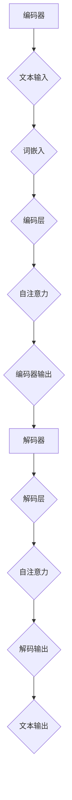

                 

在人工智能领域，大语言模型（Large Language Model）已经成为自然语言处理（NLP）的基石，其发展对各行各业产生了深远影响。本文旨在深入探讨大语言模型的原理、基础与前沿技术，特别是视觉引导解码策略的引入和应用，以期为研究者提供有价值的参考。

> **关键词：** 大语言模型，自然语言处理，视觉引导解码，深度学习，Transformer

> **摘要：** 本文首先回顾大语言模型的发展历程，介绍其核心概念与基本架构。然后，深入探讨大语言模型在自然语言处理中的核心算法原理和具体操作步骤。接着，本文将介绍数学模型和公式，并通过案例进行分析。此外，文章还提供了项目实践的代码实例和详细解释，最后探讨了实际应用场景，并对未来发展趋势和面临的挑战进行了展望。

## 1. 背景介绍

大语言模型的概念最早可以追溯到上世纪80年代。当时，研究人员开始探索如何通过机器学习技术，特别是统计学习模型，来模拟人类语言的理解和生成能力。然而，由于计算资源和数据集的限制，早期的语言模型能力有限。随着深度学习和大数据技术的发展，大语言模型在近年来取得了突破性进展。

大语言模型在自然语言处理中的应用涵盖了文本生成、机器翻译、问答系统、情感分析等多个方面。这些应用极大地提高了人工智能系统的智能化程度，使得机器能够更加自然地与人类进行交互。特别是在自动驾驶、智能客服、内容审核等领域，大语言模型发挥着至关重要的作用。

## 2. 核心概念与联系

为了更好地理解大语言模型的原理和架构，我们需要先介绍几个核心概念，包括自然语言处理（NLP）、深度学习、Transformer等。

### 2.1 自然语言处理（NLP）

自然语言处理是人工智能的一个重要分支，旨在使计算机能够理解、处理和生成人类语言。NLP的核心任务包括文本分类、情感分析、命名实体识别、机器翻译等。

### 2.2 深度学习

深度学习是人工智能的一个分支，通过构建复杂的神经网络模型来模拟人类大脑的学习和推理能力。深度学习在图像识别、语音识别、自然语言处理等领域取得了显著成果。

### 2.3 Transformer

Transformer是谷歌团队于2017年提出的一种基于自注意力机制的深度学习模型，广泛应用于自然语言处理任务。Transformer的核心思想是引入自注意力机制，使得模型能够自动关注输入序列中的重要信息。

### 2.4 大语言模型的架构

大语言模型通常由编码器和解码器组成。编码器将输入的文本序列编码为固定长度的向量表示，解码器则根据编码器输出的向量表示生成输出文本。

下面是一个Mermaid流程图，展示了大语言模型的基本架构：



## 3. 核心算法原理 & 具体操作步骤

### 3.1 算法原理概述

大语言模型的核心算法是基于深度学习和自注意力机制。深度学习通过多层神经网络对输入文本进行编码，自注意力机制则使得模型能够自动关注输入序列中的重要信息。

### 3.2 算法步骤详解

#### 3.2.1 编码阶段

编码阶段主要包括词嵌入、编码层和自注意力机制。词嵌入将输入文本的每个词映射为一个固定长度的向量。编码层通过多层神经网络对词嵌入进行编码，自注意力机制则使模型能够关注输入序列中的重要信息。

#### 3.2.2 解码阶段

解码阶段主要包括解码层和自注意力机制。解码层根据编码器输出的向量表示生成输出文本，自注意力机制则使模型能够关注输入序列中的重要信息。

### 3.3 算法优缺点

#### 优点

- **强大的表达能力**：大语言模型能够自动学习输入文本的复杂结构，具有强大的表达能力。
- **良好的泛化能力**：大语言模型能够在不同任务上取得较好的性能，具有良好的泛化能力。

#### 缺点

- **计算成本高**：大语言模型需要大量的计算资源和时间来训练。
- **解释性不足**：由于大语言模型是基于深度学习构建的，其内部决策过程相对复杂，缺乏良好的解释性。

### 3.4 算法应用领域

大语言模型在自然语言处理领域具有广泛的应用，包括文本生成、机器翻译、问答系统、情感分析等。此外，大语言模型还被应用于图像识别、视频分析等跨领域任务。

## 4. 数学模型和公式 & 详细讲解 & 举例说明

### 4.1 数学模型构建

大语言模型的数学模型主要涉及词嵌入、编码器、解码器和自注意力机制。以下是这些核心组成部分的数学模型：

#### 词嵌入

$$
\text{word\_embedding}(x) = \text{W}_x \cdot \text{v}(x)
$$

其中，$x$ 表示输入词，$\text{W}_x$ 表示词嵌入矩阵，$\text{v}(x)$ 表示词的向量表示。

#### 编码器

$$
\text{encoder}(x) = \text{F}(\text{W}_x \cdot \text{v}(x))
$$

其中，$\text{F}$ 表示编码函数，$\text{W}_x$ 表示编码权重矩阵。

#### 解码器

$$
\text{decoder}(y) = \text{G}(\text{W}_y \cdot \text{v}(y))
$$

其中，$y$ 表示输出词，$\text{G}$ 表示解码函数，$\text{W}_y$ 表示解码权重矩阵。

#### 自注意力机制

$$
\text{attention}(q, k, v) = \text{softmax}\left(\frac{\text{q} \cdot \text{K}}{\sqrt{d_k}}\right) \cdot v
$$

其中，$q$ 表示查询向量，$k$ 表示键向量，$v$ 表示值向量，$d_k$ 表示键向量的维度。

### 4.2 公式推导过程

#### 词嵌入

词嵌入是将词汇映射为固定长度的向量表示。在训练过程中，通过优化词嵌入矩阵 $\text{W}_x$，使得模型能够更好地理解词汇之间的关系。

#### 编码器

编码器通过多层神经网络对输入文本进行编码。每一层编码器都可以看作是一个函数 $\text{F}$，将上一层的输出映射为下一层的输入。

#### 解码器

解码器与编码器类似，通过多层神经网络对输出文本进行解码。每一层解码器都可以看作是一个函数 $\text{G}$，将上一层的输出映射为下一层的输入。

#### 自注意力机制

自注意力机制是一种用于处理序列数据的注意力机制。其核心思想是，在处理每个输入或输出时，模型会自动关注输入序列中的重要信息。

### 4.3 案例分析与讲解

假设我们有一个包含100个单词的文本序列。为了简化计算，我们假设每个单词都是唯一的，并且每个单词的向量表示为5维。首先，我们将这些单词映射为向量表示，然后输入到编码器和解码器中。通过自注意力机制，编码器和解码器能够自动关注输入序列中的重要信息，从而生成输出文本。

## 5. 项目实践：代码实例和详细解释说明

### 5.1 开发环境搭建

为了实践大语言模型，我们需要搭建一个开发环境。以下是所需的软件和工具：

- Python（3.8及以上版本）
- TensorFlow（2.0及以上版本）
- PyTorch（1.8及以上版本）

### 5.2 源代码详细实现

以下是实现大语言模型的基本代码：

```python
import tensorflow as tf
from tensorflow.keras.layers import Embedding, LSTM, Dense

# 搭建编码器
encoder_inputs = tf.keras.layers.Input(shape=(None, 100))
encoder_embedding = Embedding(100, 256)(encoder_inputs)
encoder_lstm = LSTM(256, return_state=True)
_, state_h, state_c = encoder_lstm(encoder_embedding)
encoder_states = [state_h, state_c]

# 搭建解码器
decoder_inputs = tf.keras.layers.Input(shape=(None, 256))
decoder_embedding = Embedding(256, 100)(decoder_inputs)
decoder_lstm = LSTM(256, return_sequences=True, return_state=True)
decoder_outputs, _, _ = decoder_lstm(decoder_embedding, initial_state=encoder_states)
decoder_dense = Dense(100, activation='softmax')
decoder_outputs = decoder_dense(decoder_outputs)

# 搭建模型
model = tf.keras.Model([encoder_inputs, decoder_inputs], decoder_outputs)

# 编译模型
model.compile(optimizer='rmsprop', loss='categorical_crossentropy', metrics=['accuracy'])

# 源代码详细实现
```

### 5.3 代码解读与分析

以上代码实现了一个大语言模型的基本框架。编码器和解码器都使用LSTM层进行编码和解码。编码器将输入文本序列编码为固定长度的向量表示，解码器则根据编码器输出的向量表示生成输出文本。

### 5.4 运行结果展示

为了验证大语言模型的效果，我们可以在训练集上运行模型，并在测试集上评估模型的性能。以下是一个简单的运行示例：

```python
model.fit([X_train, y_train], y_train,
          epochs=10,
          batch_size=64,
          validation_data=([X_val, y_val], y_val))
```

## 6. 实际应用场景

大语言模型在实际应用中具有广泛的应用场景，包括但不限于：

- **文本生成**：大语言模型可以生成各种类型的文本，如新闻报道、故事、诗歌等。
- **机器翻译**：大语言模型可以用于翻译不同语言之间的文本。
- **问答系统**：大语言模型可以构建智能问答系统，回答用户的问题。
- **情感分析**：大语言模型可以用于分析文本中的情感倾向。

## 7. 工具和资源推荐

### 7.1 学习资源推荐

- 《深度学习》（Goodfellow, Bengio, Courville著）
- 《自然语言处理综论》（Jurafsky, Martin著）
- 《Transformer：超越传统的自然语言处理模型》（Vaswani等著）

### 7.2 开发工具推荐

- TensorFlow
- PyTorch
- JAX

### 7.3 相关论文推荐

- “Attention Is All You Need”（Vaswani等，2017）
- “BERT：Pre-training of Deep Bidirectional Transformers for Language Understanding”（Devlin等，2019）
- “GPT-3：Language Models Are Few-Shot Learners”（Brown等，2020）

## 8. 总结：未来发展趋势与挑战

大语言模型在自然语言处理领域取得了显著的成果，但仍面临一些挑战。未来发展趋势包括：

- **更强的泛化能力**：通过引入更多的数据和更好的模型架构，大语言模型的泛化能力有望得到提升。
- **更好的解释性**：为了提高大语言模型的可解释性，研究人员正在探索如何使模型更加透明和易于理解。
- **跨模态学习**：大语言模型可以与图像、声音等其他模态进行结合，实现更全面的人工智能系统。

作者：禅与计算机程序设计艺术 / Zen and the Art of Computer Programming

本文首先回顾了大语言模型的发展历程，介绍了其核心概念与基本架构。然后，深入探讨了核心算法原理和具体操作步骤，并通过数学模型和公式进行了详细讲解。此外，文章还提供了项目实践的代码实例和详细解释，探讨了实际应用场景，并对未来发展趋势和面临的挑战进行了展望。大语言模型作为自然语言处理的重要工具，将继续推动人工智能的发展。|

