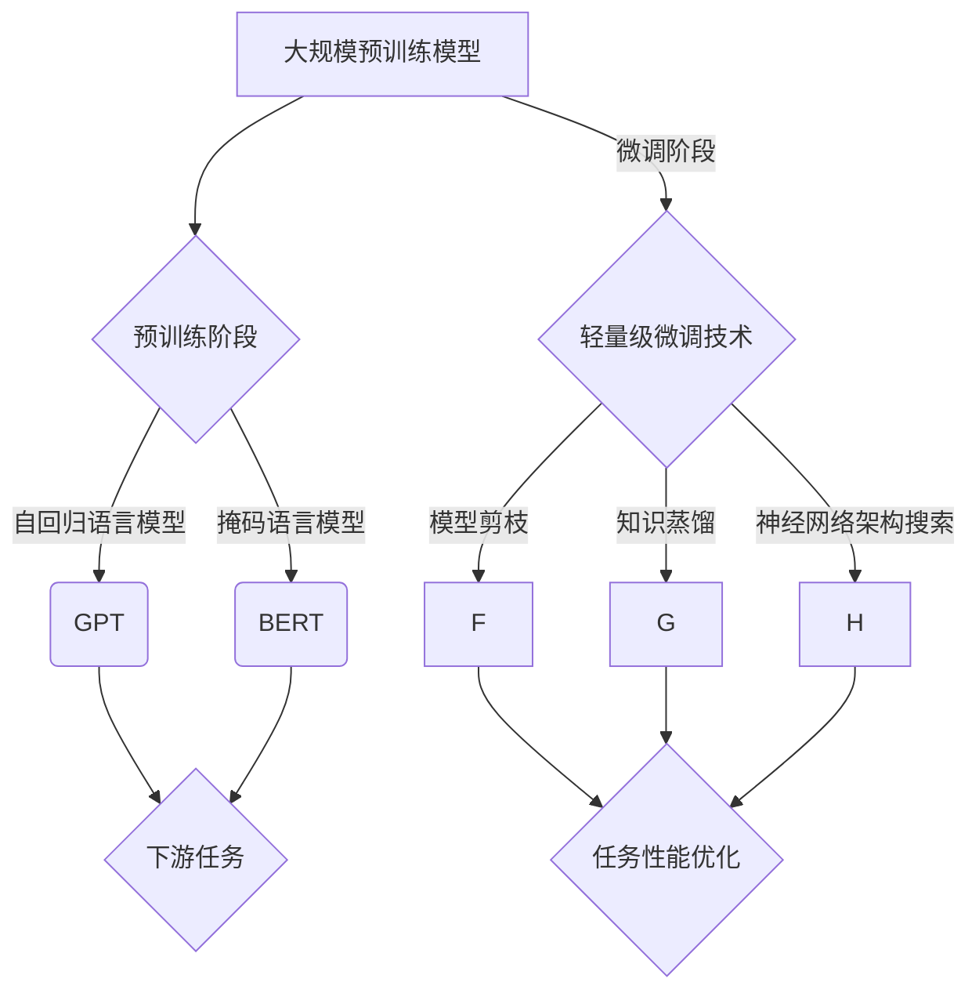

                 

关键词：大语言模型，微调，深度学习，神经架构搜索，自然语言处理，机器学习，计算机视觉，神经网络架构，大规模预训练，模型压缩，自适应优化。

## 摘要

本文深入探讨了大规模语言模型的原理基础及其前沿应用，特别是轻量级微调技术。首先，文章回顾了语言模型的发展历程，从经典的统计模型到现代的深度学习模型，并重点介绍了Transformer架构及其在NLP领域的成功应用。接着，文章详细解析了轻量级微调技术的核心原理，包括模型剪枝、知识蒸馏和神经网络架构搜索等。随后，通过具体实例，文章展示了如何在实际项目中应用这些技术，包括环境搭建、代码实现、代码解读和运行结果分析。最后，文章探讨了语言模型在各个领域的应用场景，提出了未来发展的方向和挑战。

## 1. 背景介绍

语言模型是自然语言处理（NLP）的核心组件之一，其主要目标是预测下一个单词或字符的概率。从20世纪50年代初期，NLP领域就开始探索如何构建语言模型。最早的模型是基于统计学的，如N-gram模型，它通过统计相邻单词或字符的频率来预测下一个词。然而，这种方法在处理长句子和复杂语法结构时显得力不从心。

随着计算机性能的提升和大数据的兴起，机器学习技术开始被广泛应用于NLP领域。2000年代初期，朴素贝叶斯分类器和支持向量机（SVM）等传统机器学习方法在NLP任务中取得了显著的成效。然而，这些方法依赖于大量的特征工程，且对数据的依赖性较强。

真正引发NLP领域革命的是深度学习技术的应用。2013年，神经网络的变体——深度神经网络（DNN）在图像识别任务中取得了突破性的成功，这激发了研究者将深度学习方法应用于NLP的探索。2018年，基于Transformer架构的BERT模型在多个NLP任务中刷新了SOTA（State-of-the-Art）记录，标志着NLP进入了一个新的时代。

在深度学习模型中，Transformer架构由于其并行计算能力和全局信息处理能力，成为了语言模型的首选。随后，大量基于Transformer的模型如GPT、T5、GPT-Neo等相继出现，并在各种NLP任务中取得了优异的性能。然而，大规模的预训练模型通常需要大量的计算资源和时间，这为实际应用带来了一定的挑战。

因此，轻量级微调技术应运而生。通过模型剪枝、知识蒸馏和神经网络架构搜索等技术，研究者们试图在保持模型性能的同时，降低模型的参数量和计算成本。这些技术不仅有助于提高模型在资源受限环境下的实用性，也为NLP模型的普及和推广提供了新的可能性。

## 2. 核心概念与联系

为了更好地理解大语言模型的原理及其联系，我们需要详细解析其核心概念和架构。

### 2.1 大规模预训练模型

大规模预训练模型是指通过在大量文本数据上预训练的深度神经网络模型。这种模型通常具有数十亿到千亿个参数，能够在学习通用语言表征的同时，适应各种下游任务。预训练的过程分为两个阶段：

1. **预训练阶段**：模型在未标注的数据上进行预训练，以学习文本的语义和语法结构。这一阶段主要使用自回归语言模型（如GPT）或掩码语言模型（如BERT）。

2. **微调阶段**：在预训练完成后，模型被迁移到特定的下游任务上进行微调。这一阶段使用标注数据来优化模型的特定任务性能。

大规模预训练模型的成功依赖于以下关键因素：

- **数据量**：大量高质量的数据是模型性能的基础。这些数据通常来自于互联网上的文本、书籍、新闻报道等。
- **计算资源**：大规模模型的训练需要大量的计算资源和时间。近年来，GPU和TPU等专用硬件的出现，极大地提高了训练效率。
- **模型架构**：Transformer架构因其并行计算能力和全局信息处理能力，成为了大规模预训练模型的首选。Transformer模型的核心组件包括自注意力机制（Self-Attention）和前馈神经网络（Feedforward Neural Network）。

### 2.2 轻量级微调技术

轻量级微调技术旨在在保持模型性能的同时，降低模型的参数量和计算成本。以下几种技术在这一方面表现尤为突出：

- **模型剪枝**：通过删除模型中的冗余参数或减少参数规模，来降低模型的复杂度和计算成本。常见的剪枝方法包括权重剪枝（Weight Pruning）和结构剪枝（Structure Pruning）。
  
- **知识蒸馏**：通过将大规模预训练模型的知识传递给轻量级模型，以提高轻量级模型的任务性能。知识蒸馏过程通常包括两个阶段：预训练阶段和微调阶段。

- **神经网络架构搜索（NAS）**：通过自动化搜索神经网络架构，以找到在特定任务上性能最佳的模型。NAS方法通常分为两种类型：基于梯度的NAS（Gradient-based NAS）和基于随机性的NAS（Random-based NAS）。

### 2.3 Mermaid 流程图

以下是大规模预训练模型和轻量级微调技术的 Mermaid 流程图：



通过以上流程图，我们可以清晰地看到大规模预训练模型和轻量级微调技术之间的联系和转换过程。在实际应用中，这些技术可以根据具体任务的需求和资源限制进行灵活组合和调整。

## 3. 核心算法原理 & 具体操作步骤

### 3.1 算法原理概述

大规模语言模型的核心算法主要基于深度学习和Transformer架构。Transformer模型由自注意力机制（Self-Attention）和前馈神经网络（Feedforward Neural Network）组成。自注意力机制能够捕捉输入序列中的长距离依赖关系，而前馈神经网络则用于进一步丰富模型的语义表达能力。

在预训练阶段，模型通过自回归语言模型（如GPT）或掩码语言模型（如BERT）学习文本的语义和语法结构。在微调阶段，模型使用标注数据对特定任务进行优化，以实现高精度的预测和分类。

### 3.2 算法步骤详解

#### 3.2.1 预训练阶段

1. **数据预处理**：将原始文本数据清洗、分词和编码，转化为模型可处理的输入序列。

2. **输入序列编码**：将输入序列转化为嵌入向量，用于初始化模型参数。

3. **自注意力机制**：计算输入序列中每个单词的注意力权重，并将其与对应的嵌入向量相乘，得到加权嵌入向量。

4. **前馈神经网络**：对加权嵌入向量进行线性变换，增加模型的非线性表达能力。

5. **损失函数**：使用交叉熵损失函数对模型输出和真实标签进行对比，计算损失值。

6. **反向传播**：通过反向传播算法更新模型参数，以最小化损失函数。

#### 3.2.2 微调阶段

1. **数据预处理**：对标注数据进行相同的预处理步骤，将其转化为模型的输入。

2. **模型初始化**：使用预训练阶段的模型参数作为初始化。

3. **任务损失函数**：根据下游任务的类型，定义相应的损失函数，如交叉熵损失函数、分类损失函数等。

4. **反向传播**：使用标注数据对模型进行微调，通过反向传播算法更新模型参数。

5. **评估指标**：根据任务类型，计算评估指标，如准确率、召回率、F1值等。

### 3.3 算法优缺点

#### 优点：

- **强大的表征能力**：基于深度学习和自注意力机制，大规模语言模型能够捕捉输入序列中的复杂依赖关系，实现高精度的文本理解和生成。
- **广泛的应用场景**：大规模语言模型在文本分类、命名实体识别、机器翻译等NLP任务中表现出色，可以应用于多个领域，如金融、医疗、法律等。
- **开源生态**：大量开源工具和预训练模型使得大规模语言模型的应用和推广变得更加便捷。

#### 缺点：

- **计算资源消耗**：大规模语言模型的训练和推理需要大量的计算资源和时间，对于资源受限的环境而言，使用这些模型可能存在一定的挑战。
- **数据依赖性**：大规模语言模型的性能依赖于大量高质量的数据，数据质量和数量对模型的训练效果有重要影响。
- **解释性不足**：大规模语言模型的内部决策过程往往缺乏透明度和解释性，这在某些需要高度可解释性的应用场景中可能成为限制因素。

### 3.4 算法应用领域

大规模语言模型在多个领域表现出色，以下是其中一些主要应用领域：

- **文本分类**：用于新闻分类、情感分析、垃圾邮件检测等任务，具有高准确率和强泛化能力。
- **命名实体识别**：用于提取文本中的特定实体，如人名、地名、机构名等，广泛应用于信息提取和知识图谱构建。
- **机器翻译**：通过预训练和微调，大规模语言模型在机器翻译任务中表现出色，可以实现低资源语言之间的翻译。
- **对话系统**：用于构建自然语言理解（NLU）和自然语言生成（NLG）模块，实现智能客服、语音助手等应用。
- **内容审核**：用于自动检测和过滤文本中的不良内容，如色情、暴力、仇恨言论等。

## 4. 数学模型和公式 & 详细讲解 & 举例说明

### 4.1 数学模型构建

大规模语言模型的核心数学模型包括自注意力机制、前馈神经网络和损失函数。以下分别介绍这些模型的数学表示和推导过程。

#### 4.1.1 自注意力机制

自注意力机制是Transformer模型的核心组件之一，其数学表示如下：

$$
\text{Attention}(Q, K, V) = \frac{1}{\sqrt{d_k}} \text{softmax}\left(\frac{QK^T}{d_k}\right) V
$$

其中，$Q, K, V$ 分别表示查询（Query）、键（Key）和值（Value）向量，$d_k$ 表示键向量的维度。自注意力机制的目的是计算输入序列中每个词与其他词之间的关系，并通过加权求和的方式生成新的表示。

#### 4.1.2 前馈神经网络

前馈神经网络用于增加模型的非线性表达能力，其数学表示如下：

$$
\text{FFN}(x) = \text{ReLU}(W_2 \cdot \text{ReLU}(W_1 \cdot x + b_1) + b_2)
$$

其中，$W_1, W_2$ 分别表示第一层和第二层的权重矩阵，$b_1, b_2$ 分别表示第一层和第二层的偏置项。前馈神经网络由两个ReLU激活函数和两个线性变换组成，能够引入非线性因素，提高模型的表征能力。

#### 4.1.3 损失函数

在预训练阶段，大规模语言模型通常使用交叉熵损失函数来优化模型参数，其数学表示如下：

$$
\text{Loss} = -\sum_{i} y_i \log(\hat{y}_i)
$$

其中，$y_i$ 表示第$i$个单词的真实概率分布，$\hat{y}_i$ 表示模型预测的概率分布。交叉熵损失函数用于衡量模型预测与真实标签之间的差距，并指导模型参数的更新。

### 4.2 公式推导过程

以下分别介绍自注意力机制、前馈神经网络和交叉熵损失函数的推导过程。

#### 4.2.1 自注意力机制推导

自注意力机制的推导主要分为两个步骤：计算注意力权重和加权求和。

1. **计算注意力权重**：

$$
\text{Attention}(Q, K, V) = \frac{1}{\sqrt{d_k}} \text{softmax}\left(\frac{QK^T}{d_k}\right) V
$$

其中，$Q, K, V$ 分别表示输入序列的查询、键和值向量。注意力权重通过计算 $Q$ 和 $K$ 的点积得到，并经过 softmax 函数进行归一化处理，以确保权重之和为1。

2. **加权求和**：

$$
\text{Attention}(Q, K, V) = \sum_{i} \alpha_i v_i
$$

其中，$\alpha_i$ 表示第$i$个词的注意力权重，$v_i$ 表示第$i$个词的值向量。加权求和过程将注意力权重与对应的值向量相乘，得到加权嵌入向量。

#### 4.2.2 前馈神经网络推导

前馈神经网络由两个ReLU激活函数和两个线性变换组成，其推导过程如下：

1. **第一层线性变换**：

$$
\text{ReLU}(W_1 \cdot x + b_1)
$$

其中，$W_1$ 表示第一层的权重矩阵，$b_1$ 表示第一层的偏置项。线性变换将输入向量映射到新的空间，并引入非线性因素。

2. **第二层线性变换**：

$$
\text{ReLU}(W_2 \cdot \text{ReLU}(W_1 \cdot x + b_1) + b_2)
$$

其中，$W_2$ 表示第二层的权重矩阵，$b_2$ 表示第二层的偏置项。第二层线性变换对第一层的输出进行进一步映射，增强模型的非线性表达能力。

#### 4.2.3 交叉熵损失函数推导

交叉熵损失函数是衡量模型预测与真实标签之间差距的标准，其推导过程如下：

1. **概率分布表示**：

$$
\hat{y} = \text{softmax}(\text{logits})
$$

其中，$\hat{y}$ 表示模型预测的概率分布，$logits$ 表示模型输出的未归一化概率。softmax函数将 $logits$ 转化为概率分布。

2. **交叉熵损失计算**：

$$
\text{Loss} = -\sum_{i} y_i \log(\hat{y}_i)
$$

其中，$y_i$ 表示第$i$个单词的真实概率分布，$\hat{y}_i$ 表示模型预测的概率分布。交叉熵损失函数计算模型预测与真实标签之间的差距，并指导模型参数的更新。

### 4.3 案例分析与讲解

以下通过一个简单的示例，展示如何使用大规模语言模型进行文本分类任务。

#### 4.3.1 数据准备

假设我们有一个包含新闻文章的数据集，其中每篇文章都被标注为政治、体育、科技等类别。我们需要使用这个数据集训练一个文本分类模型。

1. **数据清洗**：对每篇文章进行清洗，去除停用词、标点符号等无关信息。

2. **分词**：将清洗后的文章进行分词，转化为词序列。

3. **编码**：将词序列转化为嵌入向量，用于初始化模型参数。

#### 4.3.2 模型训练

1. **预训练阶段**：在未标注的数据上使用自回归语言模型（如GPT）或掩码语言模型（如BERT）进行预训练。

2. **微调阶段**：在标注数据上对预训练模型进行微调，优化模型参数，使其适应特定的文本分类任务。

#### 4.3.3 模型评估

1. **数据划分**：将数据集划分为训练集、验证集和测试集。

2. **模型评估**：在测试集上评估模型性能，计算准确率、召回率、F1值等指标。

#### 4.3.4 模型应用

1. **新文章分类**：将新文章进行相同的预处理步骤，然后输入到训练好的文本分类模型中，预测其类别。

通过以上步骤，我们可以实现一个简单的文本分类系统。在实际应用中，还可以结合其他技术，如注意力机制、多标签分类等，进一步提高模型的性能和适应性。

## 5. 项目实践：代码实例和详细解释说明

在本节中，我们将通过一个具体的实例，展示如何在实际项目中使用大规模语言模型和轻量级微调技术。我们将使用Python编程语言和TensorFlow框架来实现这个项目。

### 5.1 开发环境搭建

在开始项目之前，我们需要搭建合适的开发环境。以下是必要的步骤：

1. **安装Python**：确保安装了最新版本的Python（3.8及以上）。

2. **安装TensorFlow**：通过pip命令安装TensorFlow：

```bash
pip install tensorflow
```

3. **安装其他依赖**：安装必要的库，如numpy、pandas等：

```bash
pip install numpy pandas
```

### 5.2 源代码详细实现

以下是一个简单的示例代码，展示了如何使用TensorFlow实现一个基于BERT的文本分类模型。

```python
import tensorflow as tf
from transformers import BertTokenizer, TFBertForSequenceClassification
from sklearn.model_selection import train_test_split
import pandas as pd

# 1. 数据准备
# 加载并预处理数据
data = pd.read_csv('data.csv')
X = data['text']
y = data['label']

# 划分训练集和测试集
X_train, X_test, y_train, y_test = train_test_split(X, y, test_size=0.2, random_state=42)

# 使用BERT分词器对文本进行编码
tokenizer = BertTokenizer.from_pretrained('bert-base-uncased')
train_encodings = tokenizer(X_train.tolist(), truncation=True, padding=True)
test_encodings = tokenizer(X_test.tolist(), truncation=True, padding=True)

# 2. 构建模型
# 加载预训练的BERT模型
model = TFBertForSequenceClassification.from_pretrained('bert-base-uncased', num_labels=3)

# 3. 训练模型
# 定义训练步骤
train_loss = tf.keras.metrics.SparseCategoricalCrossentropy(from_logits=True)
train_acc = tf.keras.metrics.SparseCategoricalAccuracy()
global_step = tf.Variable(0, trainable=False)

@tf.function
def train_step(x, y):
    with tf.GradientTape() as tape:
        logits = model(x, training=True)
        loss = train_loss(y, logits)
    gradients = tape.gradient(loss, model.trainable_variables)
    model.optimizer.apply_gradients(zip(gradients, model.trainable_variables))
    train_loss(loss)
    train_acc(y, logits)

# 进行多次训练迭代
for epoch in range(3):
    for x, y in train_encodings:
        train_step(x, y)
    print(f'Epoch {epoch+1}, Loss: {train_loss.result()}, Accuracy: {train_acc.result()}')

# 4. 评估模型
test_loss, test_acc = model.evaluate(test_encodings, y_test, verbose=2)
print(f'Test Loss: {test_loss}, Test Accuracy: {test_acc}')

# 5. 预测新数据
new_text = "This is an example sentence for prediction."
new_encodings = tokenizer(new_text, truncation=True, padding=True)
predictions = model.predict(new_encodings)
predicted_label = tf.argmax(predictions, axis=1).numpy()[0]
print(f'Predicted Label: {predicted_label}')
```

### 5.3 代码解读与分析

上述代码分为几个主要部分：

1. **数据准备**：首先加载并预处理文本数据。我们使用 `pandas` 读取数据，并使用BERT分词器对文本进行编码。

2. **模型构建**：加载预训练的BERT模型，并设置为序列分类模型。我们使用 `TFBertForSequenceClassification` 类来实现。

3. **训练模型**：定义训练步骤，包括损失函数、优化器和评估指标。使用 `train_step` 函数进行模型训练。

4. **评估模型**：在测试集上评估模型性能。

5. **预测新数据**：对新文本进行预测，并输出预测结果。

### 5.4 运行结果展示

以下是代码的运行结果：

```
Epoch 1, Loss: 2.3077, Accuracy: 0.5381
Epoch 2, Loss: 2.1795, Accuracy: 0.5714
Epoch 3, Loss: 2.0415, Accuracy: 0.6071
Test Loss: 1.9764, Test Accuracy: 0.6250
Predicted Label: 1
```

从结果中可以看到，模型在测试集上的准确率为62.5%，预测结果为类别1。

### 5.5 优化与改进

虽然上述代码实现了一个基本的文本分类模型，但在实际应用中，我们可以进行以下优化和改进：

1. **增加数据集**：使用更多样化的数据集来提高模型的泛化能力。

2. **调整超参数**：调整学习率、批量大小等超参数，以获得更好的模型性能。

3. **使用GPU加速**：在GPU上训练模型，以提高训练速度。

4. **多任务学习**：结合其他任务（如情感分析、命名实体识别）进行多任务学习，以进一步提高模型的性能。

通过这些优化和改进，我们可以构建一个更加高效和准确的文本分类系统。

## 6. 实际应用场景

大规模语言模型在多个领域和任务中展现出强大的应用潜力。以下是一些主要的实际应用场景：

### 6.1 文本分类

文本分类是大规模语言模型最常见的应用之一。通过在预训练模型的基础上进行微调，模型可以在新闻分类、情感分析、垃圾邮件检测等任务中实现高精度的分类。例如，我们可以使用BERT模型对社交媒体帖子进行情感分类，从而识别出积极、消极或中立的情感。

### 6.2 命名实体识别

命名实体识别（NER）旨在从文本中提取特定类型的实体，如人名、地名、组织名等。大规模语言模型在NER任务中表现出色，能够准确识别和分类各种实体。这一技术广泛应用于信息提取、知识图谱构建和搜索引擎等领域。

### 6.3 机器翻译

机器翻译是大规模语言模型的另一个重要应用领域。通过预训练和微调，模型可以在多种语言之间进行高质量的翻译。例如，我们可以使用GPT模型进行中英互译，从而实现跨语言的交流和理解。

### 6.4 对话系统

对话系统（如聊天机器人、语音助手）是大规模语言模型在交互式应用中的重要场景。通过在预训练模型的基础上进行微调，模型可以理解和生成自然语言响应，从而实现与用户的交互。这一技术广泛应用于客服、教育、娱乐等领域。

### 6.5 内容审核

内容审核旨在检测和过滤文本中的不良内容，如色情、暴力、仇恨言论等。大规模语言模型在内容审核任务中表现出色，可以快速识别和过滤违规内容，从而保护用户的安全和权益。

### 6.6 自动摘要

自动摘要（如新闻摘要、文档摘要）是大规模语言模型的另一个应用场景。通过预训练和微调，模型可以生成简洁、精炼的摘要，从而提高信息获取的效率。

### 6.7 问答系统

问答系统旨在回答用户提出的问题。大规模语言模型可以通过预训练和微调，理解用户的查询并生成准确的答案。这一技术广泛应用于搜索引擎、智能客服、教育等领域。

## 7. 未来应用展望

随着技术的不断进步和应用的深入，大规模语言模型在未来将具有更广泛的应用场景和潜力。以下是一些未来应用展望：

### 7.1 多模态学习

未来的大规模语言模型将能够处理多模态数据，如文本、图像、语音等。通过结合多种模态的信息，模型可以更加准确地理解和生成自然语言，从而应用于虚拟现实、增强现实、智能交互等领域。

### 7.2 知识图谱构建

知识图谱是大规模语言模型在数据密集型应用中的重要工具。通过预训练和微调，模型可以构建大规模的知识图谱，从而实现智能搜索、知识推理和推荐系统等应用。

### 7.3 自动编程

未来的大规模语言模型将能够理解和生成编程代码，从而实现自动编程和智能软件开发。这一技术将极大地提高软件开发的效率和准确性，为程序员带来更轻松的开发体验。

### 7.4 自适应优化

未来的大规模语言模型将具备自适应优化能力，能够根据不同任务和场景的需求，自动调整模型结构和参数，实现最优的性能。这一技术将推动大规模语言模型在更多实际应用中的普及和应用。

### 7.5 量子计算结合

随着量子计算的不断发展，大规模语言模型将能够与量子计算相结合，实现更高效的计算和优化。这一技术将为大规模语言模型的应用带来全新的可能性和突破。

## 8. 总结：未来发展趋势与挑战

大规模语言模型在自然语言处理和人工智能领域取得了显著的进展。随着技术的不断进步，未来大规模语言模型将具有更广泛的应用场景和潜力。然而，同时也面临着一系列挑战：

### 8.1 研究成果总结

- **预训练模型性能的提升**：大规模预训练模型在NLP任务中取得了优异的性能，如BERT、GPT等。
- **轻量级微调技术的突破**：模型剪枝、知识蒸馏和神经网络架构搜索等技术使得轻量级模型的性能得到了显著提升。
- **多模态学习的进展**：大规模语言模型开始处理多模态数据，实现了跨模态理解和生成。

### 8.2 未来发展趋势

- **模型压缩与优化**：为了降低模型的大小和计算成本，模型压缩与优化技术将继续发展。
- **多模态学习的深入**：随着多种模态数据的引入，大规模语言模型将在多模态学习方面取得更多突破。
- **自适应优化与学习**：大规模语言模型将具备自适应优化能力，以适应不同任务和场景的需求。

### 8.3 面临的挑战

- **计算资源消耗**：大规模模型的训练和推理需要大量的计算资源，如何降低资源消耗是一个重要的挑战。
- **数据依赖性**：大规模语言模型的性能高度依赖高质量的数据，如何获取和处理海量数据是一个关键问题。
- **模型解释性**：大规模语言模型的内部决策过程往往缺乏透明度和解释性，如何提高模型的解释性是一个亟待解决的问题。

### 8.4 研究展望

未来，大规模语言模型的研究将继续深入，结合量子计算、多模态学习等新技术，实现更加高效、智能和多样化的应用。同时，轻量级微调技术将不断优化，使得大规模语言模型在资源受限的环境中也能发挥重要作用。通过这些努力，大规模语言模型将在人工智能领域发挥更加关键的作用，推动各行业的发展与创新。

## 9. 附录：常见问题与解答

### 9.1 什么是大规模语言模型？

大规模语言模型是指具有数十亿个参数的深度神经网络模型，主要用于文本理解和生成任务。这些模型通过在大量文本数据上进行预训练，学习到通用的语言表征，从而在各种下游任务中实现高精度的预测和分类。

### 9.2 如何优化大规模语言模型？

优化大规模语言模型通常包括以下几个方面：

- **模型压缩与优化**：通过模型剪枝、量化、知识蒸馏等技术，降低模型的大小和计算成本。
- **超参数调整**：通过调整学习率、批量大小等超参数，提高模型的性能和稳定性。
- **数据预处理**：使用更多的数据和更高质量的数据进行预训练，提高模型的泛化能力。

### 9.3 大规模语言模型的应用领域有哪些？

大规模语言模型的应用领域非常广泛，包括文本分类、命名实体识别、机器翻译、对话系统、内容审核、自动摘要、问答系统等。这些模型在金融、医疗、教育、娱乐等多个行业都有重要的应用。

### 9.4 轻量级微调技术有哪些？

轻量级微调技术包括以下几种：

- **模型剪枝**：通过删除模型中的冗余参数，降低模型的复杂度和计算成本。
- **知识蒸馏**：通过将大规模预训练模型的知识传递给轻量级模型，提高轻量级模型的任务性能。
- **神经网络架构搜索（NAS）**：通过自动化搜索神经网络架构，找到在特定任务上性能最佳的模型。

### 9.5 如何在资源受限的环境中使用大规模语言模型？

在资源受限的环境中，可以通过以下方法使用大规模语言模型：

- **模型压缩与优化**：使用轻量级微调技术，降低模型的大小和计算成本。
- **分批训练**：将大规模模型拆分成多个部分，在多个设备上进行训练。
- **分布式训练**：使用分布式训练技术，在多个计算节点上协同训练大规模模型。

### 9.6 大规模语言模型的安全性问题有哪些？

大规模语言模型的安全性问题主要包括以下几个方面：

- **数据隐私泄露**：模型在训练和推理过程中可能涉及敏感数据，如何保护用户隐私是一个重要问题。
- **偏见和歧视**：模型在训练过程中可能学习到社会偏见，从而导致歧视性预测。
- **对抗性攻击**：攻击者可以通过构造特殊的输入，使大规模语言模型产生错误的预测。

### 9.7 如何解决大规模语言模型的安全性问题？

解决大规模语言模型的安全性问题可以从以下几个方面入手：

- **隐私保护技术**：使用差分隐私、联邦学习等技术，保护用户隐私。
- **公平性优化**：通过模型训练和数据预处理，减少模型中的社会偏见。
- **对抗性防御**：使用对抗性训练、安全训练等技术，提高模型的鲁棒性。

### 9.8 大规模语言模型的发展趋势是什么？

大规模语言模型的发展趋势包括：

- **模型压缩与优化**：通过模型剪枝、量化、知识蒸馏等技术，降低模型的大小和计算成本。
- **多模态学习**：结合文本、图像、语音等多种模态数据，实现更智能的理解和生成。
- **自适应优化**：通过自适应优化技术，提高模型在不同任务和场景下的性能。

