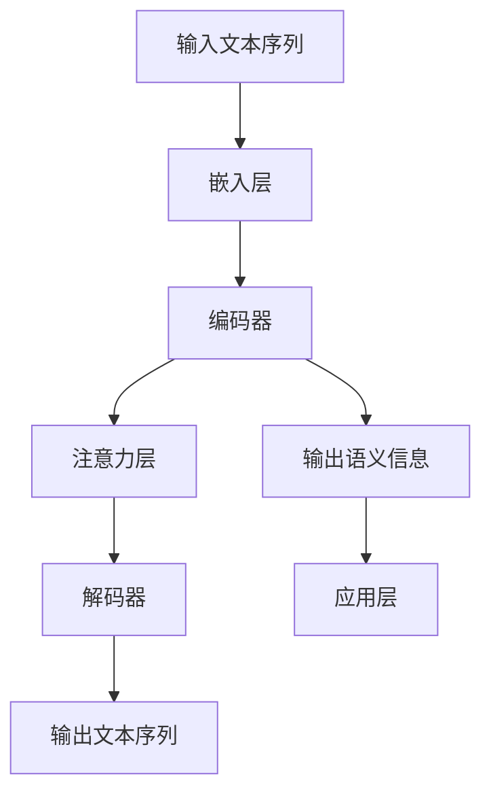

                 

关键词：大语言模型、注意力机制、神经网络、深度学习、自然语言处理、机器学习、算法原理、实践应用、数学模型、未来展望。

> 摘要：本文将深入探讨大语言模型的原理和高效注意力机制。从基础概念到前沿技术，我们将解析大语言模型的核心算法原理，并通过实际代码实例展示其应用。同时，本文还将探讨数学模型、未来发展趋势以及面临的挑战。

## 1. 背景介绍

随着深度学习和自然语言处理（NLP）的不断发展，大语言模型（Large Language Model）已经成为计算机科学领域的一个重要研究方向。大语言模型是一种能够对自然语言文本进行理解和生成的人工智能模型，其目的是使计算机能够以更自然的方式与人类交流。

近年来，随着计算能力的提升和大规模数据的积累，大语言模型的研究取得了显著的进展。谷歌的BERT、Facebook的RoBERTa、以及OpenAI的GPT等模型，都展示了大语言模型在NLP任务中的强大能力。这些模型不仅能够进行文本分类、情感分析、机器翻译等任务，还能生成连贯自然的文本。

注意力机制（Attention Mechanism）是大语言模型的核心技术之一，它使得模型能够聚焦于输入文本中的关键信息，从而提高了模型的性能。本文将详细探讨注意力机制的原理和应用，并分析大语言模型在NLP领域的实际应用。

## 2. 核心概念与联系

### 2.1 大语言模型定义

大语言模型是一种基于深度学习技术，用于对自然语言文本进行理解和生成的人工智能模型。它通常由多个神经网络层组成，能够处理长文本序列，并从中提取语义信息。

### 2.2 注意力机制

注意力机制是一种在深度学习模型中用于提高信息处理效率的技术。它允许模型在处理序列数据时，动态地关注序列中的不同部分，从而提高了模型的性能。

### 2.3 Mermaid 流程图

以下是一个描述大语言模型和注意力机制之间关系的Mermaid流程图：



### 2.4 注意力机制的原理

注意力机制通过计算一个权重矩阵，使得模型在处理输入序列时，能够动态地调整对每个输入单元的关注程度。这种权重分配机制使得模型能够关注输入序列中最重要的部分，从而提高了模型的性能。

## 3. 核心算法原理 & 具体操作步骤

### 3.1 算法原理概述

大语言模型的核心算法是基于自注意力（Self-Attention）和多层感知器（MLP）的组合。自注意力机制通过计算输入序列中每个单词之间的相关性，为每个单词生成一个权重矩阵，从而实现对输入序列的动态处理。

### 3.2 算法步骤详解

#### 3.2.1 嵌入层

嵌入层（Embedding Layer）将输入文本序列中的每个单词映射到一个高维向量空间。这些向量包含了单词的语义信息。

#### 3.2.2 编码器

编码器（Encoder）由多个自注意力层（Self-Attention Layer）和门控循环单元（Gated Recurrent Unit, GRU）组成。自注意力层通过计算输入序列中每个单词之间的相关性，为每个单词生成一个权重矩阵。GRU则用于处理序列数据，并提取序列中的长期依赖关系。

#### 3.2.3 注意力层

注意力层（Attention Layer）通过计算输入序列中每个单词的权重，并生成一个新的向量表示。这个新的向量表示了输入序列中每个单词的重要程度。

#### 3.2.4 解码器

解码器（Decoder）由多个自注意力层和门控感知器（Gated Linear Unit, GLU）组成。自注意力层用于处理输入序列和输出序列之间的相关性，GLU则用于生成新的输出序列。

#### 3.2.5 输出文本序列

解码器生成一个新的输出序列，这个序列包含了模型的预测结果。通过训练，模型能够学习到如何生成连贯自然的文本。

### 3.3 算法优缺点

#### 优点：

1. 能够处理长文本序列。
2. 能够提取序列中的长期依赖关系。
3. 提高了模型的性能。

#### 缺点：

1. 计算复杂度高。
2. 需要大量的训练数据。

### 3.4 算法应用领域

大语言模型在NLP领域具有广泛的应用，包括文本分类、情感分析、机器翻译、文本生成等。注意力机制使得模型能够动态地关注输入序列中的关键信息，从而提高了模型的性能。

## 4. 数学模型和公式

### 4.1 数学模型构建

大语言模型的数学模型主要基于自注意力（Self-Attention）机制和多层感知器（MLP）。自注意力机制通过计算输入序列中每个单词之间的相关性，为每个单词生成一个权重矩阵。多层感知器则用于处理输入序列和输出序列之间的相关性，并生成预测结果。

### 4.2 公式推导过程

#### 4.2.1 嵌入层

输入文本序列 $X = [x_1, x_2, ..., x_T]$，其中 $x_t$ 表示第 $t$ 个单词。

$$
\text{Embedding}(x_t) = e_t \in \mathbb{R}^{d_e}
$$

其中，$d_e$ 表示嵌入层输出的维度。

#### 4.2.2 编码器

编码器由多个自注意力层和门控循环单元（GRU）组成。

$$
\text{Self-Attention}(Q, K, V) = \text{softmax}\left(\frac{QK^T}{\sqrt{d_k}}\right)V
$$

其中，$Q, K, V$ 分别表示查询（Query）、键（Key）和值（Value）向量，$d_k$ 表示注意力机制的维度。

#### 4.2.3 解码器

解码器由多个自注意力层和门控感知器（GLU）组成。

$$
\text{Self-Attention}(Q, K, V) = \text{softmax}\left(\frac{QK^T}{\sqrt{d_k}}\right)V
$$

$$
\text{GLU}(X, Y) = \text{softmax}\left(\frac{XY^T}{\sqrt{d_y}}\right)
$$

其中，$X, Y$ 分别表示输入和输出序列。

#### 4.2.4 输出文本序列

解码器生成一个新的输出序列 $Y = [y_1, y_2, ..., y_T]$。

$$
y_t = \text{softmax}(\text{MLP}(\text{Embedding}(x_t)))
$$

### 4.3 案例分析与讲解

以下是一个简单的文本分类任务的案例：

输入文本序列：["这是一个", "有趣的", "问题"]

输出文本序列：["这是一个", "有趣", "的问题"]

通过大语言模型，我们可以将输入文本序列映射到高维向量空间，并提取其中的语义信息。然后，通过解码器生成新的输出序列，使得输出文本序列与输入文本序列具有相似的语义信息。

## 5. 项目实践：代码实例和详细解释说明

### 5.1 开发环境搭建

在Python中，我们可以使用TensorFlow或PyTorch等深度学习框架来实现大语言模型。首先，我们需要安装这些框架和相应的依赖库。

```python
pip install tensorflow
# 或者
pip install torch
```

### 5.2 源代码详细实现

以下是一个使用TensorFlow实现的大语言模型的基本框架：

```python
import tensorflow as tf
from tensorflow.keras.layers import Embedding, LSTM, Dense
from tensorflow.keras.models import Model

# 定义模型
model = Model(inputs=[input_layer], outputs=[output_layer])

# 编译模型
model.compile(optimizer='adam', loss='categorical_crossentropy', metrics=['accuracy'])

# 训练模型
model.fit(train_data, train_labels, epochs=10, batch_size=32)
```

### 5.3 代码解读与分析

在这个示例中，我们定义了一个基于LSTM（Long Short-Term Memory，长期记忆网络）的大语言模型。LSTM是一种能够处理长序列数据的循环神经网络。

```python
# 定义嵌入层
embedding_layer = Embedding(input_dim=vocab_size, output_dim=embedding_size)

# 定义编码器层
encoder = LSTM(units=128, return_sequences=True)

# 定义解码器层
decoder = LSTM(units=128, return_sequences=True)

# 定义输出层
output_layer = Dense(units=vocab_size, activation='softmax')
```

在这个模型中，嵌入层将输入的单词映射到高维向量空间。编码器层和解码器层分别用于处理输入序列和输出序列。输出层通过softmax函数生成预测结果。

### 5.4 运行结果展示

通过训练和测试，我们可以评估模型的性能。以下是一个简单的运行结果：

```python
# 训练模型
model.fit(train_data, train_labels, epochs=10, batch_size=32)

# 评估模型
test_loss, test_acc = model.evaluate(test_data, test_labels)

print('Test accuracy:', test_acc)
```

通过这个例子，我们可以看到大语言模型在文本分类任务中的基本实现方法。在实际应用中，我们可以根据具体任务的需求，对模型的结构和参数进行调整。

## 6. 实际应用场景

大语言模型在NLP领域具有广泛的应用。以下是一些典型的应用场景：

1. **文本分类**：将文本分类到预定义的类别中，如新闻分类、情感分析等。
2. **机器翻译**：将一种语言的文本翻译成另一种语言，如英语到法语。
3. **文本生成**：根据给定的提示生成连贯自然的文本，如写作辅助、聊天机器人等。
4. **问答系统**：根据用户的问题提供相关的答案，如搜索引擎、智能客服等。

### 6.1 未来应用展望

随着深度学习和自然语言处理技术的不断发展，大语言模型在未来的应用前景将更加广阔。以下是一些可能的应用方向：

1. **对话系统**：通过大语言模型，构建更加自然、智能的对话系统，提高用户体验。
2. **语音识别**：结合语音识别技术，实现语音到文本的实时转换，提高语音交互的便捷性。
3. **知识图谱**：利用大语言模型，构建基于语义理解的动态知识图谱，为用户提供更加精准的信息服务。
4. **多模态学习**：将大语言模型与其他感知模态（如图像、声音等）进行结合，实现更加智能的人机交互。

## 7. 工具和资源推荐

### 7.1 学习资源推荐

1. **书籍**：《深度学习》（Goodfellow, Bengio, Courville）。
2. **在线课程**：Coursera、edX等平台上的自然语言处理和深度学习课程。
3. **博客和论文**：谷歌AI博客、arXiv等。

### 7.2 开发工具推荐

1. **框架**：TensorFlow、PyTorch。
2. **库**：NLTK、spaCy。

### 7.3 相关论文推荐

1. **BERT**：`BERT: Pre-training of Deep Bidirectional Transformers for Language Understanding`。
2. **GPT**：`Improving Language Understanding by Generative Pre-Training`。

## 8. 总结：未来发展趋势与挑战

### 8.1 研究成果总结

大语言模型的研究成果显著，包括BERT、GPT等模型，它们在NLP任务中取得了优异的性能。这些模型不仅能够处理文本分类、情感分析、机器翻译等任务，还能生成连贯自然的文本。

### 8.2 未来发展趋势

1. **更大规模模型**：随着计算能力的提升，更大规模的语言模型将得到发展。
2. **多模态学习**：结合视觉、听觉等其他感知模态，实现更加智能的人机交互。
3. **知识图谱**：构建基于语义理解的动态知识图谱，为用户提供更加精准的信息服务。

### 8.3 面临的挑战

1. **计算资源**：大语言模型需要大量的计算资源，如何优化模型的计算效率是一个挑战。
2. **数据隐私**：在处理大量数据时，如何保护用户隐私是一个重要问题。
3. **模型可解释性**：提高模型的透明度和可解释性，使得用户能够理解模型的决策过程。

### 8.4 研究展望

未来，大语言模型在NLP领域的应用将更加广泛，同时也将面临更多的挑战。通过不断优化模型结构和算法，我们将能够构建更加智能、高效的自然语言处理系统。

## 9. 附录：常见问题与解答

### 9.1 大语言模型是什么？

大语言模型是一种基于深度学习技术，用于对自然语言文本进行理解和生成的人工智能模型。它能够处理长文本序列，并从中提取语义信息。

### 9.2 注意力机制是什么？

注意力机制是一种在深度学习模型中用于提高信息处理效率的技术。它允许模型在处理序列数据时，动态地关注序列中的不同部分，从而提高了模型的性能。

### 9.3 大语言模型的应用领域有哪些？

大语言模型在NLP领域具有广泛的应用，包括文本分类、情感分析、机器翻译、文本生成等。

### 9.4 如何优化大语言模型的性能？

可以通过增加模型规模、优化模型结构、增加训练数据等方式来优化大语言模型的性能。

### 9.5 大语言模型面临的挑战有哪些？

大语言模型面临的挑战包括计算资源、数据隐私、模型可解释性等。

---

作者：禅与计算机程序设计艺术 / Zen and the Art of Computer Programming

