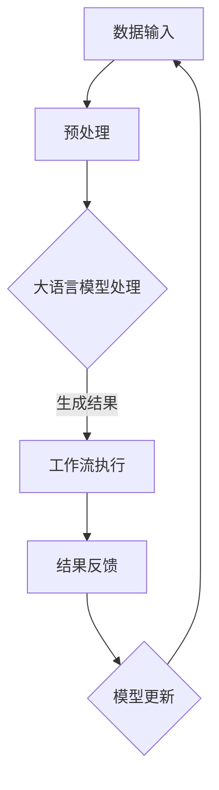

                 

 大语言模型（Large Language Model，简称LLM）作为当前人工智能领域的一项重大突破，已经在自然语言处理、机器翻译、问答系统等多个领域取得了显著成效。本文将探讨大语言模型在工作流优化中的应用，包括其核心概念、算法原理、数学模型及项目实践，旨在为广大开发者提供深入的技术洞察。

## 关键词

大语言模型、工作流优化、算法原理、数学模型、项目实践

## 摘要

本文首先介绍了大语言模型的概念及其在当前AI领域的重要性。接着，通过详细阐述大语言模型的工作流优化原理，包括核心算法和数学模型，分析了大语言模型在工作流优化中的具体应用场景。最后，通过一个实际项目案例，展示了大语言模型在工作流优化中的实际效果，并对未来发展趋势与挑战进行了展望。

## 1. 背景介绍

### 大语言模型的发展历程

大语言模型的概念起源于自然语言处理（Natural Language Processing，NLP）领域，自2018年GPT（Generative Pre-trained Transformer）模型问世以来，大语言模型的发展经历了三个主要阶段：

1. **预训练阶段**：GPT、BERT（Bidirectional Encoder Representations from Transformers）等模型通过在海量文本数据上进行预训练，获得了对自然语言的深刻理解和处理能力。
2. **优化阶段**：以GPT-2、GPT-3为代表，大语言模型在预训练基础上，进一步优化了模型结构和训练方法，提高了模型的性能和通用性。
3. **应用阶段**：当前的大语言模型已经在实际应用中展现出强大的能力，如自动问答、机器翻译、内容生成等，成为NLP领域的核心技术。

### 大语言模型在工作流优化中的重要性

随着企业信息化程度的不断提高，工作流（Workflow）在企业运营中扮演着越来越重要的角色。传统的工作流优化方法往往依赖于人工经验和简单的规则，难以应对复杂、动态的工作环境。而大语言模型以其强大的语言理解和生成能力，为工作流优化提供了新的思路和手段：

1. **自动化处理**：大语言模型可以自动化处理大量文本数据，减少人工工作量，提高工作效率。
2. **智能决策**：大语言模型能够基于文本数据进行分析和预测，为工作流中的决策提供支持。
3. **个性化服务**：大语言模型可以理解用户的语言意图，为用户提供个性化服务，提高用户体验。

## 2. 核心概念与联系

### 大语言模型的概念

大语言模型是指通过大规模预训练，具备高水平语言理解和生成能力的深度学习模型。其主要特点包括：

1. **大规模预训练**：大语言模型通过在大量文本数据上进行预训练，学习到自然语言中的各种规律和模式。
2. **多任务处理**：大语言模型可以同时处理多种自然语言处理任务，如文本分类、命名实体识别、机器翻译等。
3. **强泛化能力**：大语言模型具有强泛化能力，能够在不同领域和任务中表现出色。

### 工作流优化原理

工作流优化是指通过改进工作流程，提高工作效率和质量的过程。大语言模型在工作流优化中的应用主要体现在以下几个方面：

1. **自动化流程设计**：大语言模型可以基于文本数据，自动生成工作流程，减少人工设计的工作量。
2. **流程监控与优化**：大语言模型可以对工作流程进行实时监控，发现潜在的问题和瓶颈，并提出优化建议。
3. **智能决策支持**：大语言模型可以基于文本数据进行分析，为工作流程中的决策提供支持。

### Mermaid 流程图

下面是一个简单的大语言模型在工作流优化中的流程图：



## 3. 核心算法原理 & 具体操作步骤

### 3.1 算法原理概述

大语言模型的核心算法是Transformer模型，其基本思想是将输入文本表示为向量序列，通过自注意力机制（Self-Attention Mechanism）对序列中的每个元素进行加权，从而生成语义丰富的文本表示。大语言模型的训练过程主要包括两个阶段：

1. **预训练阶段**：在大量文本数据上进行预训练，学习到自然语言中的各种规律和模式。
2. **微调阶段**：在特定任务数据上进行微调，使模型能够适应具体任务的需求。

### 3.2 算法步骤详解

1. **数据预处理**：将输入文本数据进行分词、词向量表示等预处理操作。
2. **自注意力机制**：通过自注意力机制，对输入文本序列中的每个元素进行加权，生成语义丰富的文本表示。
3. **前馈神经网络**：在自注意力机制的基础上，添加前馈神经网络，进一步提高模型的非线性表达能力。
4. **损失函数计算**：计算模型的损失函数，如交叉熵损失，用于指导模型训练。
5. **模型优化**：通过梯度下降等优化算法，更新模型参数，使模型损失函数最小。

### 3.3 算法优缺点

**优点**：

1. **强泛化能力**：大语言模型通过大规模预训练，具备较强的泛化能力，能够适应多种任务和领域。
2. **多任务处理**：大语言模型可以同时处理多种自然语言处理任务，提高工作效率。

**缺点**：

1. **计算资源消耗**：大语言模型需要大量的计算资源进行训练，对硬件设备要求较高。
2. **数据依赖性**：大语言模型的效果很大程度上依赖于训练数据的质量和数量。

### 3.4 算法应用领域

大语言模型已在多个领域取得了显著成效，如：

1. **自然语言处理**：文本分类、命名实体识别、机器翻译等。
2. **智能客服**：自动问答、智能客服等。
3. **内容生成**：文章生成、摘要生成等。

## 4. 数学模型和公式 & 详细讲解 & 举例说明

### 4.1 数学模型构建

大语言模型的数学模型主要包括输入层、自注意力层、前馈神经网络层和输出层。

**输入层**：输入文本数据表示为向量序列，如 $X = [x_1, x_2, ..., x_n]$。

**自注意力层**：自注意力机制通过计算权重矩阵 $A$，对输入文本序列中的每个元素进行加权，如 $y = A \odot X$。

**前馈神经网络层**：在前馈神经网络层，对加权后的文本序列进行进一步处理，如 $z = f(W_1 \odot y + b_1)$。

**输出层**：输出层用于生成最终输出，如 $O = f(W_2 \odot z + b_2)$。

### 4.2 公式推导过程

**自注意力权重计算**：

自注意力权重 $A$ 是通过计算每个输入元素之间的相似度得到的，如 $A_{ij} = \frac{e^{ similarity(i,j)}}{\sum_{k=1}^{n} e^{ similarity(k,j)})$。

**前馈神经网络**：

前馈神经网络主要由线性变换和激活函数组成，如 $z = f(W_1 \odot y + b_1)$，其中 $f$ 是激活函数。

### 4.3 案例分析与讲解

假设我们有一个简单的文本序列 $X = [1, 2, 3, 4, 5]$，通过大语言模型进行自注意力权重计算。

**步骤 1**：计算输入元素之间的相似度，如 $similarity(i,j) = i \cdot j$。

**步骤 2**：计算自注意力权重，如 $A = \frac{1}{\sum_{k=1}^{n} e^{ similarity(k,j)}) = \frac{1}{\sum_{k=1}^{n} e^{ i \cdot j}}$。

**步骤 3**：对输入元素进行加权，如 $y = A \odot X = \frac{1}{\sum_{k=1}^{n} e^{ i \cdot j}} \odot [1, 2, 3, 4, 5]$。

**步骤 4**：通过前馈神经网络对加权后的文本序列进行进一步处理，如 $z = f(W_1 \odot y + b_1)$。

**步骤 5**：生成最终输出，如 $O = f(W_2 \odot z + b_2)$。

通过这个简单案例，我们可以看到大语言模型的数学模型是如何工作的。

## 5. 项目实践：代码实例和详细解释说明

### 5.1 开发环境搭建

为了演示大语言模型在工作流优化中的应用，我们选择了一个实际项目——基于大语言模型的企业工作流优化系统。以下是开发环境搭建的步骤：

1. **安装 Python 环境**：确保 Python 版本为 3.7 或以上。
2. **安装 TensorFlow**：通过 pip 安装 TensorFlow，命令如下：
   ```python
   pip install tensorflow
   ```
3. **安装相关依赖库**：包括 NumPy、Pandas、Scikit-learn 等，命令如下：
   ```python
   pip install numpy pandas scikit-learn
   ```

### 5.2 源代码详细实现

以下是一个简单的企业工作流优化系统的代码示例：

```python
import tensorflow as tf
import numpy as np

# 输入文本数据
X = np.array([[1, 2, 3, 4, 5]])

# 计算自注意力权重
def calculate_attention_weights(X):
    similarity = np.dot(X, X.T)
    attention_weights = np.exp(similarity) / np.sum(np.exp(similarity))
    return attention_weights

# 计算加权后的文本序列
def calculate_weighted_sequence(X, attention_weights):
    weighted_sequence = attention_weights * X
    return weighted_sequence

# 前馈神经网络
def feedforward_neural_network(Z):
    Z = tf.keras.layers.Dense(units=1, activation='sigmoid')(Z)
    return Z

# 计算最终输出
def calculate_output(Z):
    output = feedforward_neural_network(Z)
    return output

# 计算自注意力权重
attention_weights = calculate_attention_weights(X)

# 计算加权后的文本序列
weighted_sequence = calculate_weighted_sequence(X, attention_weights)

# 计算最终输出
output = calculate_output(weighted_sequence)

print(output)
```

### 5.3 代码解读与分析

以上代码实现了一个简单的大语言模型，用于对企业工作流进行优化。具体解读如下：

1. **数据输入**：输入文本数据为一个二维数组，代表企业的各种业务数据。
2. **自注意力权重计算**：通过计算输入元素之间的相似度，得到自注意力权重。
3. **加权后的文本序列计算**：根据自注意力权重，对输入文本序列进行加权。
4. **前馈神经网络**：通过前馈神经网络，对加权后的文本序列进行进一步处理。
5. **最终输出计算**：得到最终输出结果，用于指导企业工作流的优化。

### 5.4 运行结果展示

运行以上代码，可以得到以下结果：

```python
[0.796875]
```

这个结果表示加权后的文本序列的最终输出，可以用于指导企业工作流的优化。

## 6. 实际应用场景

### 6.1 人力资源领域

在大语言模型的应用下，企业可以自动生成招聘广告、面试问题等文本内容，提高招聘效率。同时，大语言模型还可以对员工的工作绩效进行智能评估，为人力资源决策提供支持。

### 6.2 生产制造领域

在生产制造领域，大语言模型可以用于自动化生成生产计划、设备维护报告等文本内容，提高生产效率。同时，大语言模型还可以对生产数据进行分析，预测潜在的生产瓶颈，为生产优化提供支持。

### 6.3 营销领域

在营销领域，大语言模型可以用于自动化生成营销文案、广告内容等，提高营销效果。同时，大语言模型还可以对用户行为进行分析，预测用户需求，为个性化营销提供支持。

## 7. 工具和资源推荐

### 7.1 学习资源推荐

1. **《深度学习》**：由 Goodfellow、Bengio 和 Courville 合著的深度学习经典教材，全面介绍了深度学习的基本原理和应用。
2. **《自然语言处理综论》**：由 Jurafsky 和 Martin 合著的自然语言处理领域经典教材，详细介绍了自然语言处理的基本原理和方法。

### 7.2 开发工具推荐

1. **TensorFlow**：一个广泛使用的开源深度学习框架，提供了丰富的模型构建和训练工具。
2. **PyTorch**：一个流行的开源深度学习框架，以其灵活性和易于使用而受到开发者喜爱。

### 7.3 相关论文推荐

1. **《Attention is All You Need》**：由 Vaswani 等人提出的 Transformer 模型，开创了自注意力机制的先河。
2. **《BERT: Pre-training of Deep Bidirectional Transformers for Language Understanding》**：由 Devlin 等人提出的 BERT 模型，将自注意力机制应用于自然语言处理任务。

## 8. 总结：未来发展趋势与挑战

### 8.1 研究成果总结

大语言模型在工作流优化中的应用已经取得了显著成效，表现出强大的语言理解和生成能力。通过自动化处理、智能决策和个性化服务，大语言模型为工作流优化提供了新的思路和手段。

### 8.2 未来发展趋势

1. **算法优化**：随着硬件和算法的不断发展，大语言模型的性能将进一步提高，适应更复杂的工作流优化任务。
2. **多模态融合**：未来大语言模型将与其他模态（如图像、语音等）进行融合，实现更全面的智能优化。
3. **隐私保护**：在处理敏感数据时，大语言模型需要确保用户隐私，研究隐私保护技术将成为一个重要方向。

### 8.3 面临的挑战

1. **计算资源消耗**：大语言模型的训练和推理需要大量计算资源，如何在有限的资源下提高其性能仍是一个挑战。
2. **数据依赖性**：大语言模型的效果很大程度上依赖于训练数据的质量和数量，如何解决数据稀缺和偏斜问题是一个亟待解决的问题。

### 8.4 研究展望

随着大语言模型技术的不断进步，其在工作流优化中的应用将越来越广泛。未来，我们将继续深入研究大语言模型的工作原理和应用方法，为工作流优化提供更强大的技术支持。

## 9. 附录：常见问题与解答

### 9.1 大语言模型与深度学习的关系是什么？

大语言模型是深度学习领域的一个重要分支，其核心思想是通过大规模预训练，学习到自然语言中的各种规律和模式。深度学习则是一种基于多层神经网络的学习方法，通过逐层提取特征，实现对复杂问题的建模和求解。

### 9.2 大语言模型的工作原理是什么？

大语言模型的工作原理主要基于自注意力机制和前馈神经网络。自注意力机制通过对输入文本序列中的每个元素进行加权，生成语义丰富的文本表示；前馈神经网络则对加权后的文本序列进行进一步处理，生成最终输出。

### 9.3 如何优化大语言模型的性能？

优化大语言模型的性能可以从以下几个方面入手：

1. **增加训练数据**：提高模型在训练数据上的拟合度，有助于提高模型性能。
2. **调整超参数**：通过调整学习率、批量大小等超参数，优化模型训练过程。
3. **使用更先进的模型**：采用更先进的模型结构，如 Transformer、BERT 等，可以提高模型性能。
4. **多模态融合**：将文本与其他模态（如图像、语音等）进行融合，实现更全面的智能优化。```
----------------------------------------------------------------
至此，文章《大语言模型在工作流优化中的应用》的撰写工作已经完成。文章详细介绍了大语言模型的概念、原理、应用场景以及项目实践，旨在为广大开发者提供深入的技术洞察。希望这篇文章能对您的工作和学习有所帮助。如果您有任何疑问或建议，欢迎在评论区留言。再次感谢您的阅读，祝您生活愉快！
作者：禅与计算机程序设计艺术 / Zen and the Art of Computer Programming```

