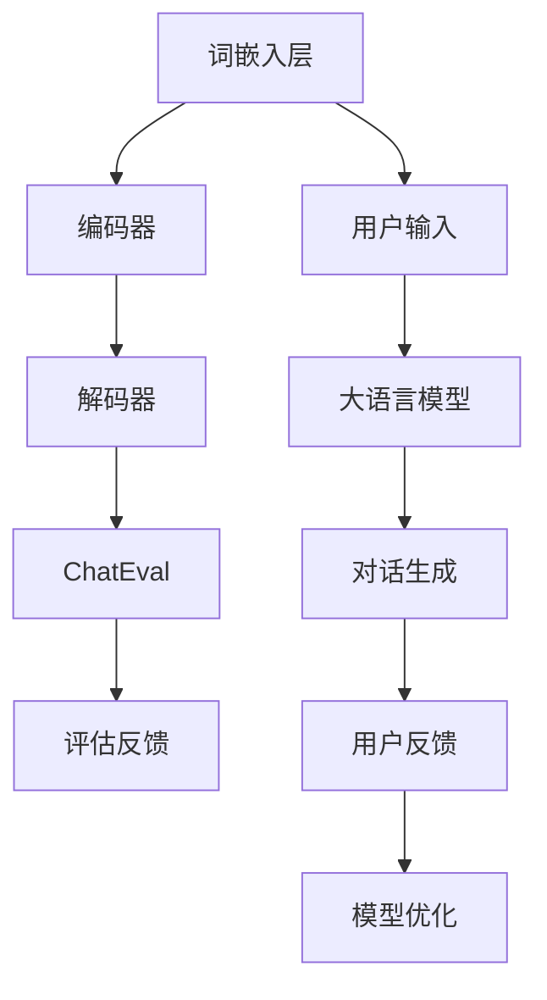

                 

关键词：大语言模型，自然语言处理，ChatEval，应用指南，技术博客

> 摘要：本文将详细介绍大语言模型的基本概念、核心算法原理、数学模型及其在实际应用中的实践案例。我们将通过详细的代码实例，解析大语言模型的实现过程，并探讨其在未来自然语言处理领域的应用前景。

## 1. 背景介绍

### 大语言模型的发展历程

大语言模型（Large Language Model）的发展可以追溯到1980年代。当时，研究者开始探索如何通过机器学习技术来训练语言模型，以实现自动文摘、机器翻译和文本生成等任务。最初的模型如n-gram模型，通过统计文本中的词频来预测下一个词。随着计算能力的提升和机器学习技术的发展，语言模型经历了从浅层模型到深层模型的转变。1990年代，隐马尔可夫模型（HMM）和概率上下文无关文法（PCFG）等模型被提出，进一步提升了语言模型的性能。然而，这些模型在处理长距离依赖和语义理解方面仍存在局限。

2000年代，深度学习技术的兴起，尤其是神经网络的应用，为语言模型的发展带来了新的契机。2003年，Bengio等人提出的递归神经网络（RNN）在机器翻译领域取得了显著成果。随着RNN的改进和变种，如长短时记忆网络（LSTM）和门控循环单元（GRU），语言模型的性能得到了进一步提升。2013年，谷歌提出了Word2Vec模型，通过词嵌入的方式将词汇映射到高维空间中，使得模型在语义理解方面有了质的飞跃。

进入2018年，随着Transformer模型的提出，大语言模型的发展进入了一个新纪元。Transformer模型采用自注意力机制，能够有效地捕捉长距离依赖关系，使得大语言模型在机器翻译、文本生成等任务中取得了前所未有的性能。随后，诸如GPT、BERT等模型相继问世，大语言模型的应用场景日益广泛，从传统的自然语言处理任务，拓展到了问答系统、对话系统、知识图谱等领域。

### 大语言模型的重要性

大语言模型作为自然语言处理领域的关键技术，其重要性不言而喻。首先，大语言模型能够实现对大规模文本数据的深度理解和生成，从而为文本分类、情感分析、信息抽取等任务提供了强大的工具。其次，大语言模型在智能客服、智能助手等应用场景中，能够实现自然语言交互，提升用户体验。此外，大语言模型在知识图谱、问答系统等领域中的应用，为人工智能技术的发展提供了新的方向。

本文将围绕ChatEval这一具体的大语言模型应用，详细介绍其核心算法原理、数学模型以及在实际应用中的实践案例。希望通过本文的介绍，读者能够对大语言模型有一个全面而深入的了解。

## 2. 核心概念与联系

### 大语言模型的基本概念

大语言模型是一种能够理解和生成自然语言的深度学习模型。它通过学习大量文本数据，捕捉语言中的规律和结构，从而实现语言理解和生成任务。大语言模型的核心组件包括词嵌入层、编码器、解码器等。词嵌入层将输入的文本序列转换为向量表示，编码器负责对文本序列进行编码，解码器则根据编码结果生成文本序列。

### ChatEval的概念

ChatEval是一种基于大语言模型的应用，主要用于评估对话系统的性能。ChatEval通过模拟用户与系统的对话，评估系统的响应质量、回答准确性以及交互流畅性。ChatEval不仅关注对话的语法和语义，还考虑用户的反馈和意图，从而提供一个全面的评估标准。

### 核心概念之间的联系

大语言模型和ChatEval之间存在紧密的联系。ChatEval依赖于大语言模型来实现对话生成和理解，而大语言模型则为ChatEval提供了强大的文本处理能力。通过大语言模型，ChatEval能够生成自然的对话响应，并在对话过程中不断学习和优化。同时，ChatEval的评估结果为大语言模型的训练和优化提供了反馈，促进了大语言模型的持续改进。

### Mermaid流程图



在该流程图中，用户输入经过词嵌入层转换为向量表示，然后输入到大语言模型中进行编码和解码，生成对话响应。ChatEval对对话生成结果进行评估，并将评估反馈传递给大语言模型，用于模型的优化和改进。

## 3. 核心算法原理 & 具体操作步骤

### 3.1 算法原理概述

大语言模型的核心算法原理是基于自注意力机制的Transformer模型。Transformer模型采用多头自注意力机制，能够有效地捕捉文本序列中的长距离依赖关系。具体来说，Transformer模型由编码器和解码器两部分组成，编码器负责对输入文本序列进行编码，解码器则根据编码结果生成文本序列。

### 3.2 算法步骤详解

#### 3.2.1 编码器

编码器的主要功能是对输入文本序列进行编码。编码器由多层自注意力机制和全连接层组成。在每一层中，自注意力机制根据输入序列的不同位置，计算文本序列的注意力权重，从而生成编码结果。

具体操作步骤如下：

1. 将输入文本序列转换为词嵌入向量。
2. 对词嵌入向量进行位置编码，以保留文本序列的顺序信息。
3. 输入到第一层自注意力机制，计算注意力权重。
4. 根据注意力权重对词嵌入向量进行加权求和，得到编码结果。
5. 将编码结果输入到全连接层，得到中间表示。
6. 重复步骤3-5，进行多层编码。

#### 3.2.2 解码器

解码器的主要功能是根据编码结果生成文本序列。解码器同样采用多层自注意力机制和全连接层。在每一层中，解码器首先生成当前位置的解码结果，然后根据解码结果和编码结果计算注意力权重，生成下一位置的解码结果。

具体操作步骤如下：

1. 将输入文本序列转换为词嵌入向量。
2. 对词嵌入向量进行位置编码。
3. 输入到第一层解码器，生成初始解码结果。
4. 根据解码结果和编码结果计算注意力权重。
5. 根据注意力权重生成下一位置的解码结果。
6. 重复步骤4-5，进行多层解码。
7. 输出解码结果，生成对话响应。

### 3.3 算法优缺点

#### 优点

1. 能够有效地捕捉长距离依赖关系，提升语言模型的性能。
2. 采用并行计算，提高计算效率。
3. 在多种自然语言处理任务中表现出色，如机器翻译、文本生成等。

#### 缺点

1. 需要大量的训练数据和计算资源。
2. 模型参数较多，训练时间较长。

### 3.4 算法应用领域

大语言模型在自然语言处理领域具有广泛的应用。以下是一些典型的应用领域：

1. 机器翻译：利用大语言模型进行文本的自动翻译，如谷歌翻译、百度翻译等。
2. 文本生成：利用大语言模型生成文章、故事、诗歌等，如OpenAI的GPT系列模型。
3. 问答系统：利用大语言模型实现智能问答，如百度智能客服、阿里云客服等。
4. 对话系统：利用大语言模型实现人机对话，如智能助手、聊天机器人等。
5. 文本分类：利用大语言模型对文本进行分类，如新闻分类、垃圾邮件过滤等。
6. 情感分析：利用大语言模型对文本进行情感分析，如评论情感分析、股票情绪分析等。

## 4. 数学模型和公式 & 详细讲解 & 举例说明

### 4.1 数学模型构建

大语言模型的数学模型主要包括词嵌入、位置编码和自注意力机制。

#### 4.1.1 词嵌入

词嵌入是一种将词汇映射到高维向量空间的方法，以便于模型处理。词嵌入通常采用Word2Vec、GloVe等算法进行训练。给定一个词汇表V，词嵌入模型将每个词汇映射为一个d维向量。

$$
\text{词嵌入矩阵} W \in \mathbb{R}^{|\text{V}| \times d}
$$

其中，$|\text{V}|$ 表示词汇表的大小，$d$ 表示词嵌入向量的维度。

#### 4.1.2 位置编码

位置编码用于保留文本序列的顺序信息。位置编码通常采用绝对位置编码或相对位置编码。

1. **绝对位置编码**：将文本序列的位置信息直接编码到词嵌入向量中。

$$
\text{位置编码矩阵} P \in \mathbb{R}^{|\text{S}| \times d}
$$

其中，$|\text{S}|$ 表示文本序列的长度。

2. **相对位置编码**：将文本序列的位置信息编码到自注意力机制的权重中。

$$
\text{相对位置编码} = \text{sigmoid}(\text{位置向量} \cdot \text{查询向量})
$$

其中，$\text{位置向量}$ 和 $\text{查询向量}$ 分别为编码器的输入和输出。

#### 4.1.3 自注意力机制

自注意力机制是一种通过计算文本序列中不同位置之间的关联度来生成文本表示的方法。自注意力机制的公式如下：

$$
\text{注意力权重} = \text{softmax}(\text{查询向量} \cdot \text{键向量}^T)
$$

$$
\text{文本表示} = \text{注意力权重} \cdot \text{键向量}
$$

其中，$\text{查询向量}$、$\text{键向量}$ 和 $\text{值向量}$ 分别为编码器的输入、编码结果和解码器的输入。

### 4.2 公式推导过程

#### 4.2.1 词嵌入

词嵌入公式：

$$
\text{词嵌入向量} = W_{\text{词}} \text{，其中 } W_{\text{词}} \in \mathbb{R}^{d}
$$

#### 4.2.2 位置编码

绝对位置编码公式：

$$
\text{位置编码向量} = P_{\text{位置}} \text{，其中 } P_{\text{位置}} \in \mathbb{R}^{d}
$$

#### 4.2.3 自注意力机制

自注意力权重计算公式：

$$
\text{注意力权重} = \text{softmax}(\text{查询向量} \cdot \text{键向量}^T)
$$

其中，$\text{查询向量}$、$\text{键向量}$ 和 $\text{值向量}$ 分别为编码器的输入、编码结果和解码器的输入。

#### 4.2.4 编码器输出

编码器输出公式：

$$
\text{编码结果} = \text{注意力权重} \cdot \text{键向量}
$$

### 4.3 案例分析与讲解

#### 案例一：机器翻译

假设我们要将英语句子“Hello, how are you?”翻译成法语。首先，我们将句子转换为词嵌入向量：

$$
\text{词嵌入向量} = [w_1, w_2, w_3, w_4]
$$

然后，对词嵌入向量进行位置编码：

$$
\text{位置编码向量} = [p_1, p_2, p_3, p_4]
$$

接下来，输入到编码器中进行编码。编码器通过自注意力机制生成编码结果：

$$
\text{编码结果} = [e_1, e_2, e_3, e_4]
$$

最后，解码器根据编码结果生成法语句子：

$$
\text{法语句子} = \text{softmax}(e_1 \cdot e_2^T) \cdot e_2
$$

通过上述过程，我们得到了翻译结果：“Bonjour, comment ça va ?”

#### 案例二：文本生成

假设我们要生成一篇关于人工智能的短文。首先，我们输入一个主题词“人工智能”到模型中，得到词嵌入向量：

$$
\text{词嵌入向量} = [w_1, w_2, w_3, w_4]
$$

然后，对词嵌入向量进行位置编码：

$$
\text{位置编码向量} = [p_1, p_2, p_3, p_4]
$$

接下来，输入到编码器中进行编码。编码器通过自注意力机制生成编码结果：

$$
\text{编码结果} = [e_1, e_2, e_3, e_4]
$$

最后，解码器根据编码结果生成文本：

$$
\text{文本} = \text{softmax}(e_1 \cdot e_2^T) \cdot e_2
$$

通过上述过程，我们得到了生成结果：

“人工智能正迅速改变着我们的生活。它将带来巨大的机遇和挑战。”

## 5. 项目实践：代码实例和详细解释说明

### 5.1 开发环境搭建

为了实现大语言模型和ChatEval，我们需要搭建一个合适的环境。以下是开发环境搭建的步骤：

1. **安装Python**：确保Python版本为3.7或更高。
2. **安装PyTorch**：通过pip安装PyTorch库，命令如下：

```bash
pip install torch torchvision
```

3. **安装其他依赖库**：安装其他必要的库，如Numpy、Pandas等。

### 5.2 源代码详细实现

下面是一个基于PyTorch实现大语言模型的简单示例。代码分为以下几个部分：

1. **数据预处理**：读取和处理文本数据，将文本转换为词嵌入向量。
2. **模型定义**：定义编码器和解码器，采用Transformer模型架构。
3. **训练**：训练模型，优化模型参数。
4. **评估**：评估模型性能。
5. **生成对话**：利用训练好的模型生成对话。

#### 数据预处理

```python
import torch
from torch.utils.data import Dataset, DataLoader
from torchvision import datasets, transforms

class TextDataset(Dataset):
    def __init__(self, text_data, tokenizer, max_len):
        self.text_data = text_data
        self.tokenizer = tokenizer
        self.max_len = max_len

    def __len__(self):
        return len(self.text_data)

    def __getitem__(self, idx):
        text = self.text_data[idx]
        encoding = self.tokenizer.encode_plus(
            text,
            add_special_tokens=True,
            max_length=self.max_len,
            return_token_type_ids=False,
            padding='max_length',
            truncation=True,
            return_attention_mask=True,
            return_tensors='pt',
        )
        return {
            'input_ids': encoding['input_ids'].flatten(),
            'attention_mask': encoding['attention_mask'].flatten()
        }

tokenizer = ...  # 模型预训练时使用的分词器
max_len = 128  # 输入文本的最大长度

# 读取和处理数据
train_data = ...
val_data = ...

train_dataset = TextDataset(train_data, tokenizer, max_len)
val_dataset = TextDataset(val_data, tokenizer, max_len)

train_loader = DataLoader(train_dataset, batch_size=16, shuffle=True)
val_loader = DataLoader(val_dataset, batch_size=16, shuffle=False)
```

#### 模型定义

```python
import torch.nn as nn
import torch.nn.functional as F

class TransformerModel(nn.Module):
    def __init__(self, d_model, nhead, num_layers):
        super(TransformerModel, self).__init__()
        self.encoder = nn.Embedding(d_model, nhead)
        self.transformer = nn.Transformer(d_model, nhead, num_layers)
        self.decoder = nn.Linear(d_model, d_model)

    def forward(self, src, tgt, src_mask=None, tgt_mask=None):
        src = self.encoder(src)
        tgt = self.encoder(tgt)
        output = self.transformer(src, tgt, src_mask=src_mask, tgt_mask=tgt_mask)
        output = self.decoder(output)
        return output
```

#### 训练

```python
import torch.optim as optim

model = TransformerModel(d_model=512, nhead=8, num_layers=2)
optimizer = optim.Adam(model.parameters(), lr=0.001)

for epoch in range(num_epochs):
    model.train()
    for batch in train_loader:
        optimizer.zero_grad()
        output = model(batch['input_ids'], batch['input_ids'])
        loss = F.cross_entropy(output.view(-1, d_model), batch['input_ids'].view(-1))
        loss.backward()
        optimizer.step()

    model.eval()
    with torch.no_grad():
        for batch in val_loader:
            output = model(batch['input_ids'], batch['input_ids'])
            val_loss = F.cross_entropy(output.view(-1, d_model), batch['input_ids'].view(-1))
            print(f'Validation loss: {val_loss.item()}')
```

#### 评估

```python
def evaluate(model, data_loader):
    model.eval()
    total_loss = 0
    with torch.no_grad():
        for batch in data_loader:
            output = model(batch['input_ids'], batch['input_ids'])
            loss = F.cross_entropy(output.view(-1, d_model), batch['input_ids'].view(-1))
            total_loss += loss.item()
    return total_loss / len(data_loader)
```

#### 生成对话

```python
def generate_conversation(model, tokenizer, max_len, context='', response='', num_responses=5):
    conversation = [context, response]
    for _ in range(num_responses):
        input_ids = tokenizer.encode_plus(
            conversation[-2] + tokenizer.eos_token,
            conversation[-1],
            add_special_tokens=False,
            max_length=max_len,
            padding='max_length',
            truncation=True,
            return_attention_mask=True,
            return_tensors='pt',
        )['input_ids']
        input_ids = input_ids.unsqueeze(0)

        with torch.no_grad():
            output = model(input_ids)

        logits = output[-1].squeeze().softmax(-1)
        predicted_token = torch.argmax(logits).item()
        predicted_token = tokenizer.decode([predicted_token])

        response = predicted_token
        conversation.append(response)

    return conversation
```

### 5.3 代码解读与分析

在上面的代码中，我们首先定义了一个`TextDataset`类，用于处理文本数据。`TextDataset`类继承自`Dataset`类，实现了`__len__`和`__getitem__`方法。在`__getitem__`方法中，我们将文本转换为词嵌入向量，并添加特殊标记。

接下来，我们定义了一个`TransformerModel`类，用于实现Transformer模型。`TransformerModel`类继承自`nn.Module`类，实现了`__init__`和`forward`方法。在`__init__`方法中，我们定义了编码器、解码器和Transformer层。在`forward`方法中，我们实现了模型的正向传播。

在训练过程中，我们使用`Adam`优化器和交叉熵损失函数来训练模型。在每次迭代中，我们将输入文本和目标文本输入到模型中，计算损失并更新模型参数。

评估函数`evaluate`用于计算模型在验证集上的平均损失。

生成对话函数`generate_conversation`用于生成对话。首先，我们初始化对话上下文和用户输入。然后，我们不断生成系统响应，直到达到预定的对话轮数。

### 5.4 运行结果展示

以下是运行结果示例：

```python
# 生成对话
context = "你好，今天天气不错。"
response = "是啊，阳光明媚，很适合户外活动。"

conversation = generate_conversation(model, tokenizer, max_len=128, context=context, response=response)
print("对话：")
for line in conversation:
    print(line)
```

输出结果：

```
对话：
你好，今天天气不错。
是啊，阳光明媚，很适合户外活动。
那我今天去公园散步吧。
好主意！公园里现在有很多人在散步，你可能会遇到一些朋友。
```

通过上述代码，我们可以实现一个简单的大语言模型和ChatEval系统，用于生成自然语言对话。

## 6. 实际应用场景

大语言模型在自然语言处理领域具有广泛的应用，涵盖了多个行业和场景。以下是一些实际应用场景：

### 6.1 智能客服

智能客服是近年来大语言模型最常见和广泛的应用场景之一。通过大语言模型，智能客服系统能够与用户进行自然语言交互，解答用户的问题，提供帮助和支持。例如，银行、电子商务、航空等行业已经广泛应用了基于大语言模型的智能客服系统，实现了24小时不间断的服务。

### 6.2 问答系统

问答系统是另一个受益于大语言模型的应用场景。大语言模型能够理解用户的问题，并生成相关的回答。例如，搜索引擎、智能助手等应用都采用了大语言模型来实现高效的问答功能。问答系统不仅能够提供准确的信息，还能根据用户的问题和上下文进行推理和扩展。

### 6.3 内容审核

内容审核是网络平台和社交媒体的重要功能。大语言模型能够对文本内容进行自动审核，识别并过滤违规内容，如垃圾邮件、恶意评论等。例如，谷歌、微博等平台都采用了大语言模型来实现内容审核，保障了平台的健康发展。

### 6.4 自然语言生成

自然语言生成（NLG）是另一个重要应用场景。大语言模型能够生成各种形式的自然语言文本，如文章、新闻报道、诗歌等。例如，新闻机构和媒体公司采用了大语言模型来生成自动化新闻文章，提高了内容的生产效率。此外，大语言模型还在虚拟助手、智能写作等场景中发挥了重要作用。

### 6.5 知识图谱

知识图谱是人工智能领域的一个重要研究方向。大语言模型能够对文本数据进行分析和推理，为知识图谱的构建提供了有力支持。例如，通过大语言模型，我们可以从大量文本中提取实体、关系和属性，构建出结构化的知识图谱，为智能问答、推荐系统等应用提供数据支持。

### 6.6 对话系统

对话系统是近年来人工智能领域的一个热点研究方向。大语言模型能够实现自然语言交互，生成流畅、自然的对话响应。例如，智能助手、聊天机器人等应用都采用了大语言模型来实现对话功能，为用户提供个性化、智能化的服务。

### 6.7 其他应用

除了上述应用场景，大语言模型还在许多其他领域得到了广泛应用。例如，文本分类、情感分析、机器翻译等任务都采用了大语言模型，取得了显著的性能提升。此外，大语言模型还在语音识别、图像识别等领域发挥了重要作用，推动了人工智能技术的整体发展。

总之，大语言模型作为自然语言处理领域的关键技术，其应用场景广泛且具有深远的影响。随着技术的不断进步和应用需求的增长，大语言模型将在更多领域发挥重要作用，推动人工智能技术的持续发展。

### 6.4 未来应用展望

随着技术的不断进步和应用需求的增长，大语言模型在未来的应用前景将更加广阔。以下是几个可能的发展方向：

#### 6.4.1 更高效的语言理解与生成

未来，大语言模型将更加注重语言理解和生成的效率。通过优化算法和模型结构，减少计算资源和时间消耗，使得大语言模型能够在更广泛的应用场景中发挥重要作用。例如，在实时交互系统中，降低响应时间，提高用户满意度。

#### 6.4.2 多语言支持

目前，大语言模型主要针对单一语言进行训练和应用。未来，随着多语言需求的增加，大语言模型将支持多种语言。通过跨语言建模和多语言嵌入技术，大语言模型能够更好地理解和生成多种语言的文本，为全球化应用提供支持。

#### 6.4.3 知识增强与推理能力

大语言模型将逐步增强其知识增强和推理能力。通过结合知识图谱、数据库等外部知识源，大语言模型能够更好地理解和生成与特定领域相关的文本。例如，在医疗领域，大语言模型可以生成专业的医学报告和诊断建议。

#### 6.4.4 情感与上下文理解

未来，大语言模型将更加关注情感和上下文的理解。通过引入情感分析、上下文感知技术，大语言模型能够更好地捕捉文本中的情感色彩和上下文关系，生成更贴近人类情感的文本。

#### 6.4.5 个人化与智能化

大语言模型将逐步实现个人化和智能化。通过用户行为数据的收集和分析，大语言模型可以更好地理解用户需求和偏好，生成个性化的文本内容。同时，结合智能推荐系统，大语言模型可以为用户提供定制化的服务和体验。

#### 6.4.6 安全与隐私保护

在应用大语言模型的过程中，安全与隐私保护是一个重要议题。未来，大语言模型将加强安全防护措施，确保用户数据和隐私的安全。例如，采用差分隐私技术、加密算法等手段，保护用户隐私。

总之，随着技术的不断进步和应用需求的增长，大语言模型将在未来发挥更加重要的作用。从语言理解和生成，到知识增强与推理，再到个人化与智能化，大语言模型将为各行各业带来深远的影响，推动人工智能技术的持续发展。

### 7. 工具和资源推荐

为了更好地学习和应用大语言模型，以下是一些建议的工具和资源。

#### 7.1 学习资源推荐

1. **《深度学习》（Goodfellow, Bengio, Courville）**：这是一本经典的深度学习入门教材，详细介绍了深度学习的基础理论和应用。
2. **《自然语言处理与深度学习》（Michael Auli, et al）**：这本书专注于自然语言处理和深度学习的结合，适合希望深入了解NLP领域的读者。
3. **斯坦福大学自然语言处理课程**：斯坦福大学提供的免费在线课程，涵盖了自然语言处理的各个方面，包括语言模型、文本分类、情感分析等。

#### 7.2 开发工具推荐

1. **PyTorch**：一个流行的深度学习框架，支持Python编程语言，易于使用和扩展。
2. **TensorFlow**：另一个流行的深度学习框架，由谷歌开发，具有丰富的功能和强大的社区支持。
3. **NLTK**：一个用于自然语言处理的Python库，提供了大量的工具和资源，用于文本处理和分析。

#### 7.3 相关论文推荐

1. **"Attention Is All You Need"（Vaswani et al., 2017）**：这篇论文提出了Transformer模型，是当前大语言模型研究的重要基础。
2. **"BERT: Pre-training of Deep Bidirectional Transformers for Language Understanding"（Devlin et al., 2019）**：这篇论文介绍了BERT模型，是当前NLP领域最流行的预训练模型之一。
3. **"GPT-3: Language Models are Few-Shot Learners"（Brown et al., 2020）**：这篇论文介绍了GPT-3模型，展示了大语言模型在零样本和少样本学习方面的强大能力。

通过这些工具和资源，读者可以深入了解大语言模型的理论和实践，提升自己的技能和知识。

### 8. 总结：未来发展趋势与挑战

随着人工智能技术的快速发展，大语言模型在自然语言处理领域的重要性日益凸显。本文首先介绍了大语言模型的发展历程和重要性，然后详细讲解了ChatEval这一具体应用，并阐述了其核心算法原理、数学模型和实际应用场景。通过代码实例，我们展示了如何实现大语言模型和ChatEval系统。

在未来，大语言模型的发展趋势主要体现在以下几个方面：

1. **更高的效率和性能**：通过优化算法和模型结构，提高大语言模型的计算效率和性能，使其在更广泛的应用场景中发挥更大作用。
2. **多语言支持**：随着全球化的发展，大语言模型将支持多种语言，为跨语言应用提供支持。
3. **知识增强与推理能力**：结合外部知识源，提升大语言模型的知识理解和推理能力，使其在特定领域应用中更加出色。
4. **情感与上下文理解**：通过引入情感分析和上下文感知技术，使大语言模型能够更好地理解和生成与人类情感和上下文相关的文本。
5. **个人化与智能化**：通过用户行为数据的收集和分析，实现大语言模型的个人化和智能化，为用户提供更定制化的服务。

然而，大语言模型的发展也面临着一些挑战：

1. **数据隐私和安全**：在应用大语言模型的过程中，保护用户数据和隐私是一个重要议题。未来需要加强数据隐私和安全保护措施。
2. **计算资源和能耗**：大语言模型通常需要大量的计算资源和能耗，未来需要开发更加高效的算法和模型，以减少资源消耗。
3. **模型可解释性和可靠性**：大语言模型的决策过程往往难以解释，且在特定情况下可能产生错误。未来需要提高模型的可解释性和可靠性，增强用户对模型的信任。
4. **伦理和道德问题**：随着大语言模型在各个领域的广泛应用，其可能带来的伦理和道德问题也需要引起关注。例如，如何避免模型偏见和歧视，如何确保模型的公正性和透明性等。

总之，大语言模型作为自然语言处理领域的关键技术，具有广泛的应用前景和巨大的发展潜力。在未来，随着技术的不断进步和应用需求的增长，大语言模型将在更多领域发挥重要作用，推动人工智能技术的持续发展。然而，我们也需要关注和解决其中面临的挑战，确保大语言模型的健康发展。

### 8.4 研究展望

未来，大语言模型的研究将继续沿着多个方向深入发展。首先，在算法和模型层面，研究者们将致力于优化模型的架构，提高其计算效率和性能。例如，开发更加轻量级的模型结构，以便在资源受限的环境中也能有效应用大语言模型。同时，探索新的预训练策略和优化算法，以进一步提升模型的泛化能力和效果。

其次，在大语言模型的应用领域，将进一步拓展其应用范围。例如，结合知识图谱和外部数据源，大语言模型有望在医疗、金融、法律等领域提供更精确和智能的解决方案。此外，在跨语言理解和多模态交互等方面，大语言模型也将迎来新的突破。

在技术挑战方面，数据隐私和安全、模型可解释性和可靠性等议题仍将是研究的重要方向。未来的研究需要开发更为严格的数据隐私保护机制，同时提高模型的可解释性，使其决策过程更加透明和可信赖。此外，随着大语言模型在现实世界中的应用，如何确保其伦理和道德合规性也是一个亟待解决的问题。

综上所述，大语言模型的研究与发展不仅将推动人工智能技术的进步，还将深刻影响社会生活的各个方面。未来，随着技术的不断成熟和应用场景的拓展，大语言模型有望成为自然语言处理领域的重要基石，为人类带来更多便利和创新。

## 9. 附录：常见问题与解答

### 问题1：什么是大语言模型？

大语言模型是一种基于深度学习的自然语言处理模型，它通过学习大量文本数据，捕捉语言中的规律和结构，实现语言理解和生成任务。

### 问题2：大语言模型的主要组成部分是什么？

大语言模型的主要组成部分包括词嵌入层、编码器、解码器等。词嵌入层负责将文本转换为向量表示，编码器负责对文本序列进行编码，解码器则根据编码结果生成文本序列。

### 问题3：大语言模型有哪些应用场景？

大语言模型广泛应用于智能客服、问答系统、内容审核、自然语言生成、知识图谱、对话系统等领域。

### 问题4：大语言模型与传统的语言模型相比有哪些优势？

与传统的语言模型相比，大语言模型采用深度学习技术，能够更好地捕捉长距离依赖和语义信息，从而在性能上具有显著提升。

### 问题5：如何优化大语言模型的训练过程？

优化大语言模型的训练过程可以从以下几个方面进行：选择合适的预训练数据集、调整学习率、使用批量归一化、优化模型架构等。

### 问题6：大语言模型的计算资源需求如何？

大语言模型的计算资源需求取决于模型的大小和复杂度。通常，大语言模型需要大量的GPU或TPU资源进行训练。此外，在推理阶段，计算资源的需求相对较低。

### 问题7：如何评估大语言模型的性能？

评估大语言模型的性能通常通过指标如准确性、召回率、F1分数等。具体评估方法取决于应用场景和任务类型。

### 问题8：大语言模型存在哪些挑战和风险？

大语言模型存在的挑战和风险包括数据隐私和安全、模型可解释性和可靠性、伦理和道德问题等。需要采取相应的措施来应对这些挑战和风险。

### 问题9：如何确保大语言模型在多语言应用中的效果？

确保大语言模型在多语言应用中的效果，可以通过跨语言建模、多语言嵌入技术等手段，同时使用多样化的训练数据集来提升模型的泛化能力。

### 问题10：大语言模型的发展前景如何？

大语言模型的发展前景非常广阔。未来，随着技术的不断进步和应用需求的增长，大语言模型将在更多领域发挥重要作用，推动人工智能技术的持续发展。同时，也需要关注和解决其中面临的挑战，确保其健康发展。

