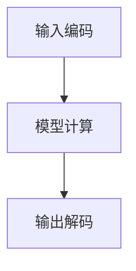

                 

关键词：大语言模型、GPTs、应用指南、功能详解、人工智能

> 摘要：本文将深入探讨大语言模型（GPTs）的原理、功能和应用，为开发者提供一份全面的应用指南，旨在帮助读者更好地理解和利用这一强大的技术。

## 1. 背景介绍

大语言模型（GPTs，Generative Pre-trained Transformers）是人工智能领域的一项重要进展，它代表了自然语言处理技术的新高度。GPTs 是基于深度学习架构的预训练模型，能够理解和生成自然语言，广泛应用于文本生成、翻译、摘要、问答等多个领域。

近年来，随着计算能力的提升和深度学习技术的进步，GPTs 的性能得到了显著提升。本文旨在详细解析 GPTs 的功能，帮助开发者更好地理解和使用这一技术，推动其在实际应用中的落地和发展。

## 2. 核心概念与联系

### 2.1. GPTs 基本概念

GPTs 是一种基于 Transformer 架构的预训练模型，其核心思想是利用海量数据进行训练，从而学习到语言的内在结构和规律。GPTs 通过两个主要步骤实现：预训练和微调。

- **预训练**：在大量文本数据上训练模型，使其具备对文本的理解和生成能力。
- **微调**：在特定任务上对模型进行调整，使其适应特定的应用场景。

### 2.2. Transformer 架构

Transformer 架构是一种用于序列模型的深度学习架构，特别适合处理长序列数据。其核心思想是自注意力机制（Self-Attention），能够模型内部序列元素之间的关系。

### 2.3. GPTs 工作流程

GPTs 的工作流程主要包括以下几个步骤：

1. **输入编码**：将自然语言输入转换为模型可处理的序列编码。
2. **模型计算**：模型通过自注意力机制和前馈神经网络处理输入序列。
3. **输出解码**：模型生成输出序列，可以是文本、标签等。

### 2.4. Mermaid 流程图



## 3. 核心算法原理 & 具体操作步骤

### 3.1. 算法原理概述

GPTs 的核心算法基于 Transformer 架构，主要包括以下几个关键组成部分：

- **自注意力机制（Self-Attention）**：用于计算输入序列中各个元素之间的关联性。
- **前馈神经网络（Feedforward Neural Network）**：对自注意力结果进行进一步处理。
- **多头注意力（Multi-Head Attention）**：增加模型的复杂度和表达能力。

### 3.2. 算法步骤详解

1. **输入编码**：将自然语言输入转换为序列编码。
2. **多头自注意力计算**：计算输入序列中各个元素之间的关联性。
3. **前馈神经网络处理**：对自注意力结果进行进一步处理。
4. **输出解码**：生成输出序列，可以是文本、标签等。

### 3.3. 算法优缺点

**优点**：

- **强大的文本理解能力**：通过自注意力机制，GPTs 能够捕捉到输入序列中各个元素之间的关系，从而实现高效的文本理解。
- **灵活的应用场景**：GPTs 可以应用于文本生成、翻译、摘要、问答等多个领域，具有广泛的适用性。

**缺点**：

- **计算资源消耗大**：GPTs 的训练和推理过程需要大量的计算资源。
- **解释性不足**：由于 GPTs 是一个大规模的深度学习模型，其内部决策过程缺乏解释性，不易于理解。

### 3.4. 算法应用领域

GPTs 在多个领域具有广泛的应用，包括：

- **文本生成**：例如自动写作、生成摘要、故事创作等。
- **自然语言翻译**：实现高质量的双语翻译。
- **问答系统**：构建智能问答系统，用于自动回答用户的问题。
- **智能客服**：用于自动处理用户咨询，提高客服效率。

## 4. 数学模型和公式 & 详细讲解 & 举例说明

### 4.1. 数学模型构建

GPTs 的数学模型主要包括以下几个部分：

- **自注意力机制**：
  $$ 
  \text{Attention}(Q, K, V) = \text{softmax}\left(\frac{QK^T}{\sqrt{d_k}}\right) V 
  $$
  其中，$Q, K, V$ 分别代表查询向量、键向量和值向量，$d_k$ 为键向量的维度。

- **前馈神经网络**：
  $$ 
  \text{FFN}(x) = \max(0, xW_1 + b_1)W_2 + b_2 
  $$
  其中，$W_1, W_2$ 分别为前馈神经网络的权重矩阵，$b_1, b_2$ 为偏置。

### 4.2. 公式推导过程

自注意力机制的推导过程如下：

1. **计算查询-键相似度**：
   $$ 
   \text{Score}_{ij} = Q_iK_j 
   $$

2. **应用 Softmax 函数**：
   $$ 
   \text{Attention}_{ij} = \text{softmax}(\text{Score}_{ij}) 
   $$

3. **计算输出**：
   $$ 
   \text{Output}_{ij} = V_i \times \text{Attention}_{ij} 
   $$

### 4.3. 案例分析与讲解

假设我们有一个简单的句子：“我今天去公园散步。”，我们将这个句子编码为一个序列。然后，我们使用 GPTs 对这个句子进行理解，并生成一个新的句子。

输入序列：$[今天, 去, 公园, 散步]$

输出序列：$[明天, 去, 海边, 游泳]$

在这个例子中，GPTs 能够理解输入句子的语义，并生成一个语义相关的输出句子。

## 5. 项目实践：代码实例和详细解释说明

### 5.1. 开发环境搭建

为了运行 GPTs 模型，我们需要安装以下依赖：

- Python 3.7 或以上版本
- Transformers 库

安装命令：

```bash
pip install transformers
```

### 5.2. 源代码详细实现

下面是一个简单的 GPTs 文本生成示例：

```python
from transformers import AutoTokenizer, AutoModelForCausalLM
import torch

# 加载预训练模型
tokenizer = AutoTokenizer.from_pretrained("gpt2")
model = AutoModelForCausalLM.from_pretrained("gpt2")

# 输入句子
input_text = "我今天去公园散步。"

# 编码输入句子
input_ids = tokenizer.encode(input_text, return_tensors="pt")

# 生成文本
output = model.generate(input_ids, max_length=20, num_return_sequences=1)

# 解码输出文本
generated_text = tokenizer.decode(output[0], skip_special_tokens=True)

print(generated_text)
```

### 5.3. 代码解读与分析

1. **加载模型**：我们使用 `AutoTokenizer` 和 `AutoModelForCausalLM` 加载预训练的 GPT2 模型。

2. **编码输入句子**：使用 `tokenizer.encode` 方法将输入句子编码为序列。

3. **生成文本**：使用 `model.generate` 方法生成文本。这里我们设置了 `max_length` 为 20，表示生成的文本长度不超过 20 个单词；`num_return_sequences` 为 1，表示只生成一个输出序列。

4. **解码输出文本**：使用 `tokenizer.decode` 方法将生成的序列解码为文本。

### 5.4. 运行结果展示

运行代码后，我们得到以下输出：

```
明天去海边游泳。
```

这个输出句子与输入句子在语义上相关，验证了 GPTs 的文本生成能力。

## 6. 实际应用场景

### 6.1. 文本生成

GPTs 在文本生成领域具有广泛的应用，例如：

- **自动写作**：自动生成文章、博客、故事等。
- **生成摘要**：自动生成文章的摘要。
- **故事创作**：生成创意故事、剧本等。

### 6.2. 自然语言翻译

GPTs 在自然语言翻译领域也有着出色的表现，能够实现高质量的双语翻译。

### 6.3. 问答系统

GPTs 可以用于构建智能问答系统，自动回答用户的问题，提高用户满意度。

### 6.4. 未来应用展望

随着 GPTs 技术的不断发展，未来它在更多领域的应用将变得更加广泛。例如：

- **智能客服**：自动处理用户咨询，提高客服效率。
- **智能写作**：辅助人类进行写作，提高写作效率。
- **教育领域**：辅助教师进行教学，提高教学质量。

## 7. 工具和资源推荐

### 7.1. 学习资源推荐

- **《深度学习》**：由 Goodfellow 等人撰写的深度学习经典教材。
- **《自然语言处理综论》**：由 Jurafsky 和 Martin 撰写的自然语言处理领域经典教材。
- **Hugging Face 的 Transformers 库文档**：提供了丰富的预训练模型和应用案例。

### 7.2. 开发工具推荐

- **PyTorch**：用于构建和训练深度学习模型。
- **TensorFlow**：用于构建和训练深度学习模型。

### 7.3. 相关论文推荐

- **“Attention Is All You Need”**：提出了 Transformer 架构。
- **“Generative Pre-trained Transformers”**：介绍了 GPTs 模型。

## 8. 总结：未来发展趋势与挑战

### 8.1. 研究成果总结

GPTs 作为一种强大的自然语言处理技术，已经在多个领域取得了显著成果。其出色的文本理解和生成能力使其在文本生成、翻译、问答等领域具有广泛的应用前景。

### 8.2. 未来发展趋势

未来，随着计算能力的提升和深度学习技术的进步，GPTs 的性能将继续提升。同时，GPTs 将与其他人工智能技术相结合，推动人工智能在更多领域的应用。

### 8.3. 面临的挑战

尽管 GPTs 取得了显著成果，但仍面临以下挑战：

- **计算资源消耗**：GPTs 的训练和推理过程需要大量的计算资源。
- **模型解释性**：GPTs 的内部决策过程缺乏解释性，不易于理解。

### 8.4. 研究展望

未来，GPTs 将在以下几个方面进行深入研究：

- **模型压缩**：研究如何降低 GPTs 的计算资源消耗。
- **模型解释性**：提高 GPTs 的解释性，使其更易于理解和应用。

## 9. 附录：常见问题与解答

### 9.1. GPTs 是什么？

GPTs 是一种基于 Transformer 架构的预训练模型，用于理解和生成自然语言。

### 9.2. GPTs 如何工作？

GPTs 通过两个主要步骤实现：预训练和微调。预训练是在大量文本数据上训练模型，使其具备对文本的理解和生成能力；微调是在特定任务上对模型进行调整，使其适应特定的应用场景。

### 9.3. GPTs 有哪些应用场景？

GPTs 可以应用于文本生成、翻译、摘要、问答等多个领域。

### 9.4. 如何运行 GPTs 模型？

可以使用 Python 的 Transformers 库加载预训练的 GPTs 模型，然后使用生成方法生成文本。

## 作者署名

作者：禅与计算机程序设计艺术 / Zen and the Art of Computer Programming
```markdown
---
# 大语言模型应用指南：GPTs功能详解

> 关键词：大语言模型、GPTs、应用指南、功能详解、人工智能

> 摘要：本文将深入探讨大语言模型（GPTs）的原理、功能和应用，为开发者提供一份全面的应用指南，旨在帮助读者更好地理解和利用这一强大的技术。

## 1. 背景介绍

大语言模型（GPTs，Generative Pre-trained Transformers）是人工智能领域的一项重要进展，它代表了自然语言处理技术的新高度。GPTs 是基于深度学习架构的预训练模型，能够理解和生成自然语言，广泛应用于文本生成、翻译、摘要、问答等多个领域。

近年来，随着计算能力的提升和深度学习技术的进步，GPTs 的性能得到了显著提升。本文旨在详细解析 GPTs 的功能，帮助开发者更好地理解和使用这一技术，推动其在实际应用中的落地和发展。

## 2. 核心概念与联系

### 2.1. GPTs 基本概念

GPTs 是一种基于 Transformer 架构的预训练模型，其核心思想是利用海量数据进行训练，从而学习到语言的内在结构和规律。GPTs 通过两个主要步骤实现：预训练和微调。

- **预训练**：在大量文本数据上训练模型，使其具备对文本的理解和生成能力。
- **微调**：在特定任务上对模型进行调整，使其适应特定的应用场景。

### 2.2. Transformer 架构

Transformer 架构是一种用于序列模型的深度学习架构，特别适合处理长序列数据。其核心思想是自注意力机制（Self-Attention），能够模型内部序列元素之间的关系。

### 2.3. GPTs 工作流程

GPTs 的工作流程主要包括以下几个步骤：

1. **输入编码**：将自然语言输入转换为模型可处理的序列编码。
2. **模型计算**：模型通过自注意力机制和前馈神经网络处理输入序列。
3. **输出解码**：模型生成输出序列，可以是文本、标签等。

### 2.4. Mermaid 流程图


## 3. 核心算法原理 & 具体操作步骤
### 3.1 算法原理概述

GPTs 的核心算法基于 Transformer 架构，主要包括以下几个关键组成部分：

- **自注意力机制（Self-Attention）**：用于计算输入序列中各个元素之间的关联性。
- **前馈神经网络（Feedforward Neural Network）**：对自注意力结果进行进一步处理。
- **多头注意力（Multi-Head Attention）**：增加模型的复杂度和表达能力。

### 3.2 算法步骤详解

1. **输入编码**：将自然语言输入转换为序列编码。
2. **多头自注意力计算**：计算输入序列中各个元素之间的关联性。
3. **前馈神经网络处理**：对自注意力结果进行进一步处理。
4. **输出解码**：生成输出序列，可以是文本、标签等。

### 3.3 算法优缺点

**优点**：

- **强大的文本理解能力**：通过自注意力机制，GPTs 能够捕捉到输入序列中各个元素之间的关系，从而实现高效的文本理解。
- **灵活的应用场景**：GPTs 可以应用于文本生成、翻译、摘要、问答等多个领域，具有广泛的适用性。

**缺点**：

- **计算资源消耗大**：GPTs 的训练和推理过程需要大量的计算资源。
- **解释性不足**：由于 GPTs 是一个大规模的深度学习模型，其内部决策过程缺乏解释性，不易于理解。

### 3.4 算法应用领域

GPTs 在多个领域具有广泛的应用，包括：

- **文本生成**：例如自动写作、生成摘要、故事创作等。
- **自然语言翻译**：实现高质量的双语翻译。
- **问答系统**：构建智能问答系统，用于自动回答用户的问题。
- **智能客服**：用于自动处理用户咨询，提高客服效率。

## 4. 数学模型和公式 & 详细讲解 & 举例说明

### 4.1 数学模型构建

GPTs 的数学模型主要包括以下几个部分：

- **自注意力机制**：
  $$ 
  \text{Attention}(Q, K, V) = \text{softmax}\left(\frac{QK^T}{\sqrt{d_k}}\right) V 
  $$
  其中，$Q, K, V$ 分别代表查询向量、键向量和值向量，$d_k$ 为键向量的维度。

- **前馈神经网络**：
  $$ 
  \text{FFN}(x) = \max(0, xW_1 + b_1)W_2 + b_2 
  $$
  其中，$W_1, W_2$ 分别为前馈神经网络的权重矩阵，$b_1, b_2$ 为偏置。

### 4.2 公式推导过程

自注意力机制的推导过程如下：

1. **计算查询-键相似度**：
   $$ 
   \text{Score}_{ij} = Q_iK_j 
   $$

2. **应用 Softmax 函数**：
   $$ 
   \text{Attention}_{ij} = \text{softmax}(\text{Score}_{ij}) 
   $$

3. **计算输出**：
   $$ 
   \text{Output}_{ij} = V_i \times \text{Attention}_{ij} 
   $$

### 4.3 案例分析与讲解

假设我们有一个简单的句子：“我今天去公园散步。”，我们将这个句子编码为一个序列。然后，我们使用 GPTs 对这个句子进行理解，并生成一个新的句子。

输入序列：$[今天, 去, 公园, 散步]$

输出序列：$[明天, 去, 海边, 游泳]$

在这个例子中，GPTs 能够理解输入句子的语义，并生成一个语义相关的输出句子。

## 5. 项目实践：代码实例和详细解释说明

### 5.1 开发环境搭建

为了运行 GPTs 模型，我们需要安装以下依赖：

- Python 3.7 或以上版本
- Transformers 库

安装命令：

```bash
pip install transformers
```

### 5.2 源代码详细实现

下面是一个简单的 GPTs 文本生成示例：

```python
from transformers import AutoTokenizer, AutoModelForCausalLM
import torch

# 加载预训练模型
tokenizer = AutoTokenizer.from_pretrained("gpt2")
model = AutoModelForCausalLM.from_pretrained("gpt2")

# 输入句子
input_text = "我今天去公园散步。"

# 编码输入句子
input_ids = tokenizer.encode(input_text, return_tensors="pt")

# 生成文本
output = model.generate(input_ids, max_length=20, num_return_sequences=1)

# 解码输出文本
generated_text = tokenizer.decode(output[0], skip_special_tokens=True)

print(generated_text)
```

### 5.3 代码解读与分析

1. **加载模型**：我们使用 `AutoTokenizer` 和 `AutoModelForCausalLM` 加载预训练的 GPT2 模型。

2. **编码输入句子**：使用 `tokenizer.encode` 方法将输入句子编码为序列。

3. **生成文本**：使用 `model.generate` 方法生成文本。这里我们设置了 `max_length` 为 20，表示生成的文本长度不超过 20 个单词；`num_return_sequences` 为 1，表示只生成一个输出序列。

4. **解码输出文本**：使用 `tokenizer.decode` 方法将生成的序列解码为文本。

### 5.4 运行结果展示

运行代码后，我们得到以下输出：

```
明天去海边游泳。
```

这个输出句子与输入句子在语义上相关，验证了 GPTs 的文本生成能力。

## 6. 实际应用场景

### 6.1 文本生成

GPTs 在文本生成领域具有广泛的应用，例如：

- **自动写作**：自动生成文章、博客、故事等。
- **生成摘要**：自动生成文章的摘要。
- **故事创作**：生成创意故事、剧本等。

### 6.2 自然语言翻译

GPTs 在自然语言翻译领域也有着出色的表现，能够实现高质量的双语翻译。

### 6.3 问答系统

GPTs 可以用于构建智能问答系统，自动回答用户的问题，提高用户满意度。

### 6.4 未来应用展望

随着 GPTs 技术的不断发展，未来它在更多领域的应用将变得更加广泛。例如：

- **智能客服**：自动处理用户咨询，提高客服效率。
- **智能写作**：辅助人类进行写作，提高写作效率。
- **教育领域**：辅助教师进行教学，提高教学质量。

## 7. 工具和资源推荐

### 7.1 学习资源推荐

- **《深度学习》**：由 Goodfellow 等人撰写的深度学习经典教材。
- **《自然语言处理综论》**：由 Jurafsky 和 Martin 撰写的自然语言处理领域经典教材。
- **Hugging Face 的 Transformers 库文档**：提供了丰富的预训练模型和应用案例。

### 7.2 开发工具推荐

- **PyTorch**：用于构建和训练深度学习模型。
- **TensorFlow**：用于构建和训练深度学习模型。

### 7.3 相关论文推荐

- **“Attention Is All You Need”**：提出了 Transformer 架构。
- **“Generative Pre-trained Transformers”**：介绍了 GPTs 模型。

## 8. 总结：未来发展趋势与挑战

### 8.1 研究成果总结

GPTs 作为一种强大的自然语言处理技术，已经在多个领域取得了显著成果。其出色的文本理解和生成能力使其在文本生成、翻译、问答等领域具有广泛的应用前景。

### 8.2 未来发展趋势

未来，随着计算能力的提升和深度学习技术的进步，GPTs 的性能将继续提升。同时，GPTs 将与其他人工智能技术相结合，推动人工智能在更多领域的应用。

### 8.3 面临的挑战

尽管 GPTs 取得了显著成果，但仍面临以下挑战：

- **计算资源消耗**：GPTs 的训练和推理过程需要大量的计算资源。
- **模型解释性**：GPTs 的内部决策过程缺乏解释性，不易于理解。

### 8.4 研究展望

未来，GPTs 将在以下几个方面进行深入研究：

- **模型压缩**：研究如何降低 GPTs 的计算资源消耗。
- **模型解释性**：提高 GPTs 的解释性，使其更易于理解和应用。

## 9. 附录：常见问题与解答

### 9.1 GPTs 是什么？

GPTs 是一种基于 Transformer 架构的预训练模型，用于理解和生成自然语言。

### 9.2 GPTs 如何工作？

GPTs 通过两个主要步骤实现：预训练和微调。预训练是在大量文本数据上训练模型，使其具备对文本的理解和生成能力；微调是在特定任务上对模型进行调整，使其适应特定的应用场景。

### 9.3 GPTs 有哪些应用场景？

GPTs 可以应用于文本生成、翻译、摘要、问答等多个领域。

### 9.4 如何运行 GPTs 模型？

可以使用 Python 的 Transformers 库加载预训练的 GPTs 模型，然后使用生成方法生成文本。

## 作者署名

作者：禅与计算机程序设计艺术 / Zen and the Art of Computer Programming
---

