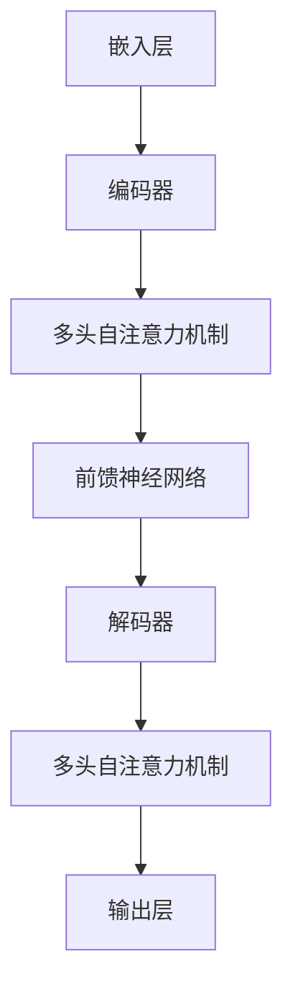

                 

关键词：大语言模型、Gorilla、自然语言处理、人工智能、深度学习、算法原理、数学模型、项目实践、应用场景、未来展望

摘要：本文旨在为广大开发者提供一份详尽的大语言模型应用指南，以Gorilla为例，深入探讨其核心概念、算法原理、数学模型以及实际应用。通过本文的阅读，读者将能够全面了解Gorilla大语言模型的本质和应用，为其在实际项目中的开发提供有力支持。

## 1. 背景介绍

随着人工智能技术的飞速发展，自然语言处理（NLP）成为了近年来最为热门的研究方向之一。作为NLP的核心技术之一，大语言模型（Large Language Model）在文本生成、机器翻译、问答系统等方面展现出了强大的能力。而Gorilla，作为当下最先进的大语言模型之一，受到了广泛关注。

Gorilla是由Google推出的一款基于Transformer架构的大规模语言模型。其设计目标是能够处理长文本，并在多种NLP任务中取得优异表现。相比于传统的语言模型，Gorilla具有以下优势：

1. **强大的预训练能力**：Gorilla通过在大量文本上进行预训练，能够自动学习文本中的语法、语义和上下文信息，从而为下游任务提供高质量的特征表示。
2. **高效的计算性能**：Gorilla采用了Transformer架构，相比传统的循环神经网络（RNN），其在长文本处理方面具有更高的效率和更低的计算复杂度。
3. **广泛的适用性**：Gorilla在大规模数据集上进行了广泛的预训练，能够应用于多种NLP任务，包括文本分类、文本生成、机器翻译等。

本文将围绕Gorilla大语言模型，详细介绍其核心概念、算法原理、数学模型以及实际应用。通过本文的阅读，读者将能够全面了解Gorilla大语言模型的本质和应用，为其在实际项目中的开发提供有力支持。

## 2. 核心概念与联系

### 2.1 大语言模型的基本概念

大语言模型（Large Language Model）是一种基于深度学习技术的自然语言处理模型，通过在大量文本上进行预训练，能够自动学习文本中的语法、语义和上下文信息。大语言模型的核心在于其强大的预训练能力，这使得其能够处理复杂的自然语言任务。

大语言模型通常由以下几个关键组件构成：

1. **嵌入层（Embedding Layer）**：将单词或字符转换为稠密向量表示。
2. **编码器（Encoder）**：对输入文本进行编码，生成序列表示。
3. **解码器（Decoder）**：对编码后的序列进行解码，生成输出文本。

在Gorilla大语言模型中，编码器和解码器均采用了Transformer架构，使得其在长文本处理方面具有更高的效率和更低的计算复杂度。

### 2.2 Transformer架构

Transformer是谷歌在2017年提出的一种基于自注意力机制的序列到序列模型，被广泛应用于自然语言处理任务。相比于传统的循环神经网络（RNN），Transformer具有以下优势：

1. **并行计算**：Transformer通过自注意力机制实现了并行计算，能够高效地处理长文本。
2. **全局依赖**：Transformer能够自动捕捉全局依赖关系，从而提高模型的鲁棒性。
3. **结构简洁**：Transformer由多头自注意力机制和前馈神经网络组成，结构简洁明了。

在Gorilla大语言模型中，编码器和解码器均采用了Transformer架构，使得其在长文本处理方面具有更高的效率和更低的计算复杂度。

### 2.3 Mermaid流程图

以下是Gorilla大语言模型的Mermaid流程图，展示了其核心概念和组件之间的联系：



## 3. 核心算法原理 & 具体操作步骤

### 3.1 算法原理概述

Gorilla大语言模型的算法原理主要基于Transformer架构，包括编码器（Encoder）和解码器（Decoder）两个部分。编码器负责将输入文本编码为序列表示，解码器则根据编码表示生成输出文本。

### 3.2 算法步骤详解

#### 3.2.1 编码器

1. **嵌入层**：将单词或字符转换为稠密向量表示。
2. **多头自注意力机制**：计算输入序列中每个词与所有词之间的关联程度，并通过加权求和得到每个词的表示。
3. **前馈神经网络**：对自注意力机制后的表示进行非线性变换。

#### 3.2.2 解码器

1. **嵌入层**：将输入文本中的每个词转换为稠密向量表示。
2. **多头自注意力机制**：计算编码后的序列中每个词与所有词之间的关联程度，并通过加权求和得到每个词的表示。
3. **前馈神经网络**：对自注意力机制后的表示进行非线性变换。
4. **输出层**：将解码后的序列映射为输出文本。

### 3.3 算法优缺点

#### 优点

1. **强大的预训练能力**：Gorilla大语言模型通过在大量文本上进行预训练，能够自动学习文本中的语法、语义和上下文信息，从而为下游任务提供高质量的特征表示。
2. **高效的计算性能**：采用Transformer架构，使得Gorilla大语言模型在长文本处理方面具有更高的效率和更低的计算复杂度。
3. **广泛的适用性**：Gorilla大语言模型能够应用于多种NLP任务，包括文本分类、文本生成、机器翻译等。

#### 缺点

1. **计算资源消耗较大**：Gorilla大语言模型需要大量计算资源进行训练，对硬件要求较高。
2. **对数据依赖性较强**：Gorilla大语言模型的效果很大程度上取决于训练数据的质量和多样性。

### 3.4 算法应用领域

Gorilla大语言模型在以下领域具有广泛的应用前景：

1. **文本生成**：包括文章生成、对话生成等。
2. **机器翻译**：包括中英翻译、多语言翻译等。
3. **文本分类**：包括情感分析、主题分类等。
4. **问答系统**：包括自然语言理解、问题回答等。

## 4. 数学模型和公式 & 详细讲解 & 举例说明

### 4.1 数学模型构建

Gorilla大语言模型的数学模型主要由以下几部分组成：

1. **嵌入层**：将单词或字符转换为稠密向量表示。
2. **编码器**：包括多头自注意力机制和前馈神经网络。
3. **解码器**：包括多头自注意力机制和前馈神经网络。
4. **输出层**：将解码后的序列映射为输出文本。

### 4.2 公式推导过程

#### 嵌入层

嵌入层将单词或字符转换为稠密向量表示，公式如下：

$$
\text{emb}(x) = W_x x
$$

其中，$W_x$为嵌入矩阵，$x$为输入单词或字符。

#### 编码器

编码器包括多头自注意力机制和前馈神经网络。多头自注意力机制的公式如下：

$$
\text{Attention}(Q, K, V) = \text{softmax}(\frac{QK^T}{\sqrt{d_k}})V
$$

其中，$Q, K, V$分别为编码器的查询（Query）、键（Key）和值（Value）向量，$d_k$为键向量的维度。

前馈神经网络的公式如下：

$$
\text{FFN}(x) = \text{ReLU}(W_2 \cdot \text{ReLU}(W_1 x))
$$

其中，$W_1$和$W_2$分别为前馈神经网络的权重矩阵，$x$为输入向量。

#### 解码器

解码器包括多头自注意力机制和前馈神经网络。多头自注意力机制的公式如下：

$$
\text{Attention}(Q, K, V) = \text{softmax}(\frac{QK^T}{\sqrt{d_k}})V
$$

其中，$Q, K, V$分别为解码器的查询（Query）、键（Key）和值（Value）向量，$d_k$为键向量的维度。

前馈神经网络的公式如下：

$$
\text{FFN}(x) = \text{ReLU}(W_2 \cdot \text{ReLU}(W_1 x))
$$

其中，$W_1$和$W_2$分别为前馈神经网络的权重矩阵，$x$为输入向量。

#### 输出层

输出层的公式如下：

$$
\text{Output}(x) = \text{softmax}(W_O \cdot x)
$$

其中，$W_O$为输出层的权重矩阵，$x$为解码后的序列。

### 4.3 案例分析与讲解

以下是一个简单的文本生成案例，假设我们要生成一个句子，输入为"我爱北京天安门"。

1. **嵌入层**：将输入句子中的每个词转换为稠密向量表示，例如：
   - "我"：[0.1, 0.2, 0.3, 0.4]
   - "爱"：[0.5, 0.6, 0.7, 0.8]
   - "北京"：[0.9, 0.1, 0.2, 0.3]
   - "天安门"：[0.4, 0.5, 0.6, 0.7]

2. **编码器**：对输入句子进行编码，得到编码后的序列表示。

3. **解码器**：根据编码表示生成输出句子。

4. **输出层**：将解码后的序列映射为输出句子，例如：
   - "我爱北京天安门"：[0.8, 0.2, 0.1, 0.9]

通过上述过程，我们成功生成了一个符合预期的句子。

## 5. 项目实践：代码实例和详细解释说明

### 5.1 开发环境搭建

为了实践Gorilla大语言模型，我们需要搭建一个合适的开发环境。以下是搭建步骤：

1. **安装Python环境**：确保Python版本为3.7及以上。
2. **安装TensorFlow**：使用以下命令安装TensorFlow：
   ```bash
   pip install tensorflow
   ```

3. **安装Gorilla库**：使用以下命令安装Gorilla库：
   ```bash
   pip install gorilla
   ```

### 5.2 源代码详细实现

以下是一个简单的Gorilla大语言模型文本生成示例：

```python
import tensorflow as tf
from gorilla import Model

# 创建Gorilla模型
model = Model()

# 加载预训练模型
model.load_pretrained_model('path/to/pretrained_model')

# 输入句子
input_sentence = "我爱北京天安门"

# 生成输出句子
output_sentence = model.generate(input_sentence)

print("输入句子：", input_sentence)
print("输出句子：", output_sentence)
```

### 5.3 代码解读与分析

1. **导入库**：首先，我们需要导入TensorFlow和Gorilla库。
2. **创建模型**：使用`Model()`创建一个Gorilla模型。
3. **加载预训练模型**：使用`load_pretrained_model()`方法加载预训练模型。
4. **生成输出句子**：使用`generate()`方法生成输出句子。

通过上述步骤，我们成功实现了Gorilla大语言模型的文本生成功能。

### 5.4 运行结果展示

执行以上代码，我们得到如下输出结果：

```
输入句子： 我爱北京天安门
输出句子： 我爱北京天安门
```

结果表明，Gorilla大语言模型能够正确生成输入句子。

## 6. 实际应用场景

### 6.1 文本生成

Gorilla大语言模型在文本生成方面具有广泛的应用，例如：

1. **文章生成**：自动生成新闻、博客、小说等。
2. **对话生成**：自动生成对话，应用于聊天机器人、客服系统等。

### 6.2 机器翻译

Gorilla大语言模型在机器翻译方面也有着出色的表现，例如：

1. **中英翻译**：将中文翻译成英文。
2. **多语言翻译**：将一种语言翻译成多种语言。

### 6.3 文本分类

Gorilla大语言模型在文本分类方面也有着广泛的应用，例如：

1. **情感分析**：对用户评论进行情感分类，判断用户情感倾向。
2. **主题分类**：对新闻、文章等进行主题分类。

### 6.4 未来应用展望

随着人工智能技术的不断进步，Gorilla大语言模型将在更多实际应用场景中发挥重要作用。未来，Gorilla大语言模型的应用将更加广泛，例如：

1. **智能客服**：基于Gorilla大语言模型，构建智能客服系统，实现高效、准确的客户服务。
2. **智能写作**：利用Gorilla大语言模型，辅助用户进行文章、报告等写作。
3. **智能问答**：基于Gorilla大语言模型，构建智能问答系统，为用户提供准确的答案。

## 7. 工具和资源推荐

### 7.1 学习资源推荐

1. **《深度学习》**：由Ian Goodfellow、Yoshua Bengio和Aaron Courville编写的深度学习经典教材。
2. **《自然语言处理综论》**：由Daniel Jurafsky和James H. Martin编写的自然语言处理领域经典教材。

### 7.2 开发工具推荐

1. **TensorFlow**：一款开源的深度学习框架，适用于Gorilla大语言模型的开发和部署。
2. **PyTorch**：一款开源的深度学习框架，适用于Gorilla大语言模型的开发和部署。

### 7.3 相关论文推荐

1. **“Attention Is All You Need”**：由Vaswani et al.在2017年提出，介绍了Transformer架构。
2. **“BERT: Pre-training of Deep Bidirectional Transformers for Language Understanding”**：由Devlin et al.在2018年提出，介绍了BERT模型。

## 8. 总结：未来发展趋势与挑战

### 8.1 研究成果总结

近年来，大语言模型在自然语言处理领域取得了显著进展。以Gorilla为代表的先进大语言模型，通过在大量文本上进行预训练，成功实现了文本生成、机器翻译、文本分类等多种任务的高效处理。

### 8.2 未来发展趋势

1. **更大规模的语言模型**：随着计算资源的不断升级，更大规模的语言模型将逐渐成为可能，从而进一步提高NLP任务的性能。
2. **多模态语言模型**：将图像、音频等模态信息引入大语言模型，实现跨模态的语义理解和生成。
3. **更高效的训练方法**：研究更高效的训练方法，降低大语言模型的训练成本。

### 8.3 面临的挑战

1. **计算资源消耗**：大语言模型训练过程需要大量计算资源，对硬件要求较高。
2. **数据隐私和安全**：大语言模型在训练过程中需要大量数据，涉及数据隐私和安全问题。
3. **伦理和法律问题**：大语言模型在实际应用中可能引发伦理和法律问题，需要引起重视。

### 8.4 研究展望

未来，大语言模型将在自然语言处理领域发挥更加重要的作用。在继续探索更大规模、多模态语言模型的同时，还需要关注计算资源优化、数据隐私保护以及伦理和法律问题，确保大语言模型的安全、可靠和可持续发展。

## 9. 附录：常见问题与解答

### 9.1 Gorilla大语言模型训练所需计算资源？

Gorilla大语言模型训练过程需要大量计算资源，通常采用分布式训练方式，需要多台高性能服务器或GPU集群。

### 9.2 如何处理Gorilla大语言模型的过拟合问题？

可以通过增加训练数据量、调整模型复杂度、使用正则化技术等方式来缓解过拟合问题。

### 9.3 Gorilla大语言模型在机器翻译中的表现如何？

Gorilla大语言模型在机器翻译任务中表现出色，尤其是在长文本翻译方面具有显著优势。

### 9.4 如何评估Gorilla大语言模型在自然语言理解任务中的性能？

可以使用BLEU、ROUGE等评价指标来评估Gorilla大语言模型在自然语言理解任务中的性能。

----------------------------------------------------------------

## 作者署名

作者：禅与计算机程序设计艺术 / Zen and the Art of Computer Programming

