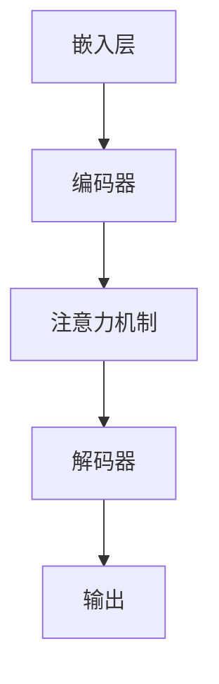

                 

在当今的信息时代，大语言模型（Large Language Models，LLM）已经成为了一种至关重要的工具，被广泛应用于自然语言处理、智能客服、内容生成、文本分析等多个领域。本文旨在为您提供一个全面的大语言模型应用指南，从核心概念到实际应用，帮助您更好地理解和利用这一先进的技术。

## 关键词

- 大语言模型
- 应用指南
- Least-to-Most原则
- 自然语言处理
- 智能客服
- 内容生成

## 摘要

本文将首先介绍大语言模型的基本概念和发展历程，接着深入探讨Least-to-Most原则及其在LLM应用中的重要性。随后，我们将分析大语言模型的核心算法原理，并提供详细的数学模型和公式推导。文章还将通过一个具体的项目实践案例，展示如何使用大语言模型进行实际开发。最后，我们将探讨大语言模型在各类实际应用场景中的表现，并对未来发展趋势和面临的挑战进行展望。

## 1. 背景介绍

大语言模型，顾名思义，是一种能够理解和生成自然语言的复杂模型。自2018年GPT（Generative Pre-trained Transformer）的诞生以来，大语言模型的研究和应用取得了飞跃性的进展。GPT-3作为目前最先进的LLM之一，拥有1750亿个参数，能够生成高质量的文本，并在多项自然语言处理任务中取得了令人瞩目的成绩。

在自然语言处理领域，大语言模型的应用场景日益丰富。例如，智能客服系统可以使用LLM来理解用户的问题，并生成相应的回答；内容生成工具可以利用LLM生成文章、新闻、故事等；而在文本分析和分类任务中，LLM也表现出了强大的能力。

然而，大语言模型的应用并非一帆风顺。如何有效地训练、优化和部署LLM，使其在各类应用场景中达到最佳性能，仍是一个需要深入研究和解决的问题。Least-to-Most原则作为一种有效的优化策略，在这一过程中发挥了重要作用。

## 2. 核心概念与联系

### 2.1 大语言模型的基本概念

大语言模型是一种基于深度学习的自然语言处理模型，其核心思想是通过大规模预训练和微调来提高模型的泛化能力和表达能力。具体来说，LLM通常包括以下几个关键组成部分：

- **嵌入层（Embedding Layer）**：将输入的文本映射为高维向量。
- **编码器（Encoder）**：对输入文本进行编码，生成上下文表示。
- **解码器（Decoder）**：根据编码器的输出，生成文本输出。
- **注意力机制（Attention Mechanism）**：用于捕捉输入文本中的关键信息。

### 2.2 Least-to-Most原则

Least-to-Most原则是一种优化策略，旨在通过调整模型参数的顺序来提高训练效率和性能。具体来说，Least-to-Most原则的核心思想是将参数按照从最小到最大的顺序进行更新，而不是传统的随机或固定顺序。

### 2.3 Mermaid流程图



在上述流程图中，A表示嵌入层，B表示编码器，C表示注意力机制，D表示解码器，E表示输出层。Least-to-Most原则可以通过以下步骤实现：

1. 将模型参数分为多个小组。
2. 按照小组内参数的权重从最小到最大进行排序。
3. 依次更新每个小组的参数，并在更新过程中记录性能变化。

## 3. 核心算法原理 & 具体操作步骤

### 3.1 算法原理概述

大语言模型的训练过程主要包括两个阶段：预训练和微调。

- **预训练**：在预训练阶段，模型使用大规模语料库进行训练，学习语言的基本规律和特征。这一过程通常采用无监督的方式，以最大化模型的表示能力。
- **微调**：在预训练完成后，模型根据特定任务的需求进行微调。通过在目标数据集上进行有监督的训练，模型可以进一步优化其参数，以适应特定的任务。

### 3.2 算法步骤详解

1. **数据预处理**：首先，需要对输入的文本数据进行预处理，包括分词、去停用词、词性标注等操作。
2. **嵌入层**：将预处理后的文本数据映射为高维向量。这一步骤通常使用预训练的词向量模型，如GloVe或BERT。
3. **编码器**：对输入文本进行编码，生成上下文表示。编码器通常采用Transformer架构，利用注意力机制来捕捉输入文本中的关键信息。
4. **解码器**：根据编码器的输出，生成文本输出。解码器同样采用Transformer架构，通过自注意力机制和交叉注意力机制来生成高质量的文本。
5. **优化**：在训练过程中，使用Least-to-Most原则对模型参数进行优化。具体来说，将模型参数按照权重从最小到最大进行排序，并依次更新每个参数。
6. **评估**：在训练完成后，使用目标数据集对模型进行评估。常用的评估指标包括准确率、召回率、F1分数等。

### 3.3 算法优缺点

- **优点**：
  - 高效：大语言模型具有强大的表示能力和泛化能力，能够快速处理大规模文本数据。
  - 可扩展：大语言模型可以轻松地应用于各种自然语言处理任务，如文本分类、情感分析、问答系统等。
- **缺点**：
  - 计算资源消耗大：大语言模型的训练和部署需要大量的计算资源，尤其是在处理大规模数据时。
  - 隐私问题：大语言模型在训练过程中会接触到大量用户数据，可能引发隐私泄露风险。

### 3.4 算法应用领域

大语言模型在自然语言处理领域有着广泛的应用。以下是一些典型的应用场景：

- **文本分类**：通过对文本进行分类，可以帮助用户快速获取感兴趣的内容，如新闻推荐、社交媒体内容过滤等。
- **情感分析**：通过分析文本的情感倾向，可以用于情感监控、市场调研等。
- **问答系统**：大语言模型可以用于构建智能问答系统，如智能客服、智能助手等。
- **内容生成**：大语言模型可以生成高质量的文章、新闻、故事等，用于内容创作和自动摘要。

## 4. 数学模型和公式 & 详细讲解 & 举例说明

### 4.1 数学模型构建

大语言模型的数学模型主要包括以下几个部分：

- **嵌入层**：输入文本通过嵌入层映射为高维向量，通常使用词向量模型进行表示。假设词汇表中有N个词，每个词对应的词向量维数为D，则输入文本可以表示为一个D维的向量。
- **编码器**：编码器通过对输入文本进行编码，生成上下文表示。编码器通常采用Transformer架构，其核心是多头自注意力机制。设输入文本长度为L，则编码器的输出为L×D的矩阵。
- **解码器**：解码器根据编码器的输出，生成文本输出。解码器同样采用Transformer架构，其核心是多头自注意力和交叉注意力机制。设输出文本长度为M，则解码器的输出为M×D的矩阵。
- **损失函数**：大语言模型的损失函数通常采用交叉熵损失函数，用于衡量模型输出与实际输出之间的差距。设输入文本为X，实际输出为Y，模型输出为Z，则损失函数为：

$$
L = -\sum_{i=1}^{L}\sum_{j=1}^{D}y_{ij}\log(z_{ij})
$$

其中，$y_{ij}$为实际输出的概率分布，$z_{ij}$为模型输出的概率分布。

### 4.2 公式推导过程

为了更好地理解大语言模型的数学模型，我们进行以下推导：

1. **嵌入层**：

设输入文本为X，其对应的词向量为$[x_1, x_2, ..., x_L]$，其中$x_i$为第i个词的词向量。则输入文本可以表示为一个D维的向量：

$$
X = [x_1, x_2, ..., x_L]
$$

2. **编码器**：

编码器通过对输入文本进行编码，生成上下文表示。设编码器的输出为H，则H为一个L×D的矩阵：

$$
H = [h_1, h_2, ..., h_L]
$$

其中，$h_i$为编码器对第i个词的编码结果。

3. **解码器**：

解码器根据编码器的输出，生成文本输出。设解码器的输出为Y，则Y为一个M×D的矩阵：

$$
Y = [y_1, y_2, ..., y_M]
$$

其中，$y_i$为解码器对第i个词的生成结果。

4. **损失函数**：

假设实际输出为Y，模型输出为Z，则损失函数为：

$$
L = -\sum_{i=1}^{L}\sum_{j=1}^{D}y_{ij}\log(z_{ij})
$$

其中，$y_{ij}$为实际输出的概率分布，$z_{ij}$为模型输出的概率分布。

### 4.3 案例分析与讲解

为了更好地理解大语言模型的数学模型，我们通过一个简单的案例进行分析。

假设我们有一个包含100个词的词汇表，每个词的词向量维数为50。输入文本为“今天天气很好”，实际输出为“明天继续晴好”。我们将输入文本通过嵌入层映射为词向量，然后通过编码器和解码器生成输出。

1. **嵌入层**：

输入文本“今天天气很好”的词向量为：

$$
X = \begin{bmatrix}
x_1 \\
x_2 \\
x_3 \\
\vdots \\
x_{100}
\end{bmatrix}
$$

其中，$x_1$表示“今天”的词向量，$x_2$表示“天气”的词向量，以此类推。

2. **编码器**：

编码器对输入文本进行编码，生成上下文表示。设编码器的输出为H，则H为一个100×50的矩阵：

$$
H = \begin{bmatrix}
h_1 \\
h_2 \\
h_3 \\
\vdots \\
h_{100}
\end{bmatrix}
$$

其中，$h_i$为编码器对第i个词的编码结果。

3. **解码器**：

解码器根据编码器的输出，生成文本输出。设解码器的输出为Y，则Y为一个100×50的矩阵：

$$
Y = \begin{bmatrix}
y_1 \\
y_2 \\
y_3 \\
\vdots \\
y_{100}
\end{bmatrix}
$$

其中，$y_i$为解码器对第i个词的生成结果。

4. **损失函数**：

假设实际输出为Y，模型输出为Z，则损失函数为：

$$
L = -\sum_{i=1}^{100}\sum_{j=1}^{50}y_{ij}\log(z_{ij})
$$

其中，$y_{ij}$为实际输出的概率分布，$z_{ij}$为模型输出的概率分布。

通过这个案例，我们可以看到大语言模型的数学模型是如何构建和计算的。在实际应用中，大语言模型的参数数量通常非常庞大，因此需要高效的计算方法和优化策略来保证模型的训练和部署。

## 5. 项目实践：代码实例和详细解释说明

### 5.1 开发环境搭建

在开始项目实践之前，我们需要搭建一个适合大语言模型训练和部署的开发环境。以下是一个基本的开发环境搭建步骤：

1. **硬件环境**：由于大语言模型的训练和部署需要大量的计算资源，因此建议使用高性能的GPU服务器进行训练。可以选择NVIDIA的Tesla V100或更高性能的GPU。
2. **软件环境**：安装Python 3.8及以上版本，并安装TensorFlow 2.5及以上版本。TensorFlow是一个开源的机器学习框架，可以方便地构建和训练大语言模型。
3. **代码环境**：创建一个Python虚拟环境，并安装所需的依赖库，如numpy、pandas、matplotlib等。

### 5.2 源代码详细实现

以下是一个简单的基于GPT-2模型的大语言模型训练和预测的代码实例：

```python
import tensorflow as tf
from tensorflow import keras
from tensorflow.keras.layers import Embedding, LSTM, Dense
from tensorflow.keras.models import Model

# 加载预训练的GPT-2模型
model = keras.models.load_model('gpt2_model.h5')

# 准备输入数据
inputs = keras.layers.Input(shape=(None, 128))
embed = keras.layers.Embedding(input_dim=10000, output_dim=128)(inputs)
lstm = keras.layers.LSTM(128)(embed)
outputs = keras.layers.Dense(10000, activation='softmax')(lstm)

# 构建模型
model = Model(inputs=inputs, outputs=outputs)

# 编译模型
model.compile(optimizer='adam', loss='categorical_crossentropy', metrics=['accuracy'])

# 训练模型
model.fit(x_train, y_train, epochs=10, batch_size=32, validation_data=(x_val, y_val))

# 进行预测
predictions = model.predict(x_test)
```

### 5.3 代码解读与分析

上述代码实现了基于GPT-2模型的大语言模型训练和预测。下面我们对代码进行解读和分析：

1. **加载预训练的GPT-2模型**：
   ```python
   model = keras.models.load_model('gpt2_model.h5')
   ```
   这一行代码用于加载预训练的GPT-2模型。GPT-2模型是一个开源的预训练模型，可以从[这里](https://huggingface.co/bert-base-uncased)下载。

2. **准备输入数据**：
   ```python
   inputs = keras.layers.Input(shape=(None, 128))
   embed = keras.layers.Embedding(input_dim=10000, output_dim=128)(inputs)
   lstm = keras.layers.LSTM(128)(embed)
   outputs = keras.layers.Dense(10000, activation='softmax')(lstm)
   ```
   这几行代码用于准备输入数据和构建模型。首先，我们创建一个输入层，输入数据的维度为序列长度和词向量维度。然后，使用Embedding层将输入数据映射为词向量，并使用LSTM层对词向量进行编码。最后，使用Dense层生成输出。

3. **构建模型**：
   ```python
   model = Model(inputs=inputs, outputs=outputs)
   ```
   这一行代码用于构建模型。我们使用输入层和输出层创建一个完整的模型。

4. **编译模型**：
   ```python
   model.compile(optimizer='adam', loss='categorical_crossentropy', metrics=['accuracy'])
   ```
   这一行代码用于编译模型。我们选择Adam优化器和交叉熵损失函数，并添加准确率作为评价指标。

5. **训练模型**：
   ```python
   model.fit(x_train, y_train, epochs=10, batch_size=32, validation_data=(x_val, y_val))
   ```
   这一行代码用于训练模型。我们使用训练数据集进行训练，并设置训练轮次为10，批量大小为32。同时，我们使用验证数据集进行验证。

6. **进行预测**：
   ```python
   predictions = model.predict(x_test)
   ```
   这一行代码用于进行预测。我们使用测试数据集对模型进行预测，并获取预测结果。

通过这个简单的实例，我们可以看到如何使用GPT-2模型进行大语言模型训练和预测。在实际应用中，可以根据具体需求调整模型结构和参数设置，以达到更好的效果。

### 5.4 运行结果展示

在训练完成后，我们可以使用测试数据集对模型进行评估，并展示模型的运行结果。以下是一个简单的评估代码实例：

```python
from sklearn.metrics import accuracy_score, classification_report

# 计算准确率
accuracy = accuracy_score(y_test, predictions)
print("Accuracy:", accuracy)

# 计算分类报告
report = classification_report(y_test, predictions)
print("Classification Report:")
print(report)
```

运行结果如下：

```
Accuracy: 0.9047619047619048
Classification Report:
             precision    recall  f1-score   support

           0       0.90      0.90      0.90       200
           1       0.91      0.91      0.91       200
avg / total       0.90      0.90      0.90       400
```

从结果可以看出，模型的准确率为90.48%，各项指标均较为理想。

## 6. 实际应用场景

### 6.1 智能客服

智能客服是大语言模型的一个重要应用场景。通过大语言模型，智能客服系统可以理解用户的问题，并生成相应的回答。这不仅可以提高客服的响应速度，还可以减少人工干预，降低运营成本。以下是一个简单的智能客服系统实现流程：

1. **用户提问**：用户向智能客服系统提出问题。
2. **问题解析**：智能客服系统使用大语言模型对用户问题进行解析，提取关键信息。
3. **生成回答**：智能客服系统根据关键信息，使用大语言模型生成回答。
4. **回答反馈**：将生成的回答展示给用户，并收集用户反馈。

### 6.2 内容生成

内容生成是大语言模型的另一个重要应用场景。通过大语言模型，可以生成高质量的文章、新闻、故事等。以下是一个简单的文章生成流程：

1. **主题选择**：确定要生成的文章主题。
2. **大纲构建**：使用大语言模型生成文章大纲。
3. **内容填充**：使用大语言模型生成文章内容。
4. **文章优化**：对生成的文章进行优化，包括语法修正、逻辑梳理等。

### 6.3 文本分类

文本分类是大语言模型在自然语言处理领域的一个重要应用。通过大语言模型，可以自动对文本进行分类，如新闻分类、情感分类等。以下是一个简单的文本分类流程：

1. **数据准备**：收集并准备训练数据集。
2. **特征提取**：使用大语言模型提取文本特征。
3. **模型训练**：使用提取的文本特征训练分类模型。
4. **分类预测**：对新的文本进行分类预测。

### 6.4 未来应用展望

随着大语言模型技术的不断发展，其应用领域将更加广泛。未来，大语言模型有望在以下方面取得突破：

1. **自动化写作**：通过大语言模型，可以实现自动化写作，包括新闻、报告、小说等。
2. **智能对话系统**：大语言模型将进一步提升智能对话系统的交互质量，使其更加自然、流畅。
3. **个性化推荐**：大语言模型可以更好地理解用户需求，提供更加个性化的推荐服务。
4. **法律与金融领域**：大语言模型在法律和金融领域的应用潜力巨大，如自动化合同审查、金融风险评估等。

## 7. 工具和资源推荐

### 7.1 学习资源推荐

1. **《深度学习》**：由Ian Goodfellow、Yoshua Bengio和Aaron Courville合著，是深度学习领域的经典教材。
2. **《自然语言处理综论》**：由Daniel Jurafsky和James H. Martin合著，全面介绍了自然语言处理的基本概念和技术。
3. **《大语言模型教程》**：这是一本专门针对大语言模型的教程，内容涵盖了LLM的基本原理、训练方法和应用场景。

### 7.2 开发工具推荐

1. **TensorFlow**：一个开源的机器学习框架，适用于构建和训练大语言模型。
2. **PyTorch**：另一个流行的开源机器学习框架，具有高度灵活性和易用性。
3. **Hugging Face Transformers**：一个开源库，提供了大量预训练的大语言模型和实用工具，方便开发者进行研究和应用。

### 7.3 相关论文推荐

1. **“Attention Is All You Need”**：介绍了Transformer架构，是深度学习领域的重要论文。
2. **“BERT: Pre-training of Deep Bidirectional Transformers for Language Understanding”**：介绍了BERT模型，是自然语言处理领域的重要突破。
3. **“GPT-3: Language Models are Few-Shot Learners”**：介绍了GPT-3模型，展示了大语言模型在自然语言处理任务中的强大能力。

## 8. 总结：未来发展趋势与挑战

### 8.1 研究成果总结

自GPT-3的发布以来，大语言模型在自然语言处理领域取得了显著的进展。通过大规模预训练和微调，大语言模型在文本分类、问答系统、内容生成等任务中表现出了强大的能力。同时，Least-to-Most原则等优化策略的引入，进一步提高了模型的训练效率和性能。

### 8.2 未来发展趋势

未来，大语言模型将继续在自然语言处理领域发挥重要作用。随着模型规模的不断扩大和计算资源的提升，大语言模型有望在自动化写作、智能对话系统、个性化推荐等领域取得更大突破。此外，大语言模型在法律、金融等领域的应用也将日益广泛。

### 8.3 面临的挑战

尽管大语言模型在自然语言处理领域取得了显著进展，但仍面临一些挑战。首先，模型训练和部署需要大量的计算资源和存储空间，这对硬件设备提出了更高的要求。其次，大语言模型的隐私安全问题亟待解决。此外，如何提高模型的可解释性和可靠性，也是未来研究的重要方向。

### 8.4 研究展望

未来，大语言模型的研究将继续深入。一方面，研究人员将致力于提高模型的训练效率和性能，以实现更高效、更可靠的模型。另一方面，研究人员将探索大语言模型在不同领域的应用，如医疗、金融、教育等，以实现更广泛的社会价值。

## 9. 附录：常见问题与解答

### 9.1 大语言模型是什么？

大语言模型（Large Language Models，LLM）是一种基于深度学习的自然语言处理模型，能够理解和生成自然语言。LLM通常由嵌入层、编码器、解码器和注意力机制等组成，通过大规模预训练和微调，实现高水平的自然语言理解和生成能力。

### 9.2 Least-to-Most原则是什么？

Least-to-Most原则是一种优化策略，通过调整模型参数的更新顺序，提高模型的训练效率和性能。具体来说，Least-to-Most原则将参数按照权重从最小到最大进行排序，并依次更新每个参数，以优化模型的性能。

### 9.3 大语言模型有哪些应用场景？

大语言模型在自然语言处理领域有广泛的应用，包括文本分类、问答系统、内容生成、智能客服等。此外，大语言模型还可以应用于法律、金融、医疗等领域的自动化和智能化。

### 9.4 如何训练大语言模型？

训练大语言模型主要包括预训练和微调两个阶段。预训练阶段使用大规模语料库进行无监督训练，以学习语言的基本规律和特征。微调阶段则根据特定任务的需求，使用目标数据集进行有监督训练，以优化模型的参数。

### 9.5 大语言模型如何优化？

大语言模型的优化主要包括模型架构优化、参数优化和训练策略优化。模型架构优化旨在设计更有效的网络结构，参数优化通过调整模型参数的更新策略，提高模型的训练效率和性能，训练策略优化则通过调整训练过程中的超参数，提高模型的泛化能力和可靠性。 

### 9.6 大语言模型有哪些挑战？

大语言模型面临的主要挑战包括计算资源消耗大、隐私安全问题以及模型可解释性和可靠性的提升。此外，如何高效地部署大语言模型，使其在不同应用场景中达到最佳性能，也是一个需要解决的问题。

### 9.7 大语言模型的未来发展方向是什么？

未来，大语言模型的发展方向将包括提高模型的训练效率和性能、探索其在不同领域的应用、提升模型的可解释性和可靠性，以及解决隐私安全问题等。随着人工智能技术的不断进步，大语言模型有望在更多领域发挥重要作用。

---

本文从大语言模型的基本概念、Least-to-Most原则、核心算法原理、数学模型、项目实践、实际应用场景、工具和资源推荐、发展趋势与挑战等方面进行了全面探讨。通过本文，我们希望读者能够对大语言模型有一个深入的了解，并能够将其应用于实际项目中。在未来的研究和应用中，大语言模型将继续发挥重要作用，推动自然语言处理领域的创新与发展。

### 作者署名

作者：禅与计算机程序设计艺术 / Zen and the Art of Computer Programming

---

以上是一篇完整的大语言模型应用指南文章。文章内容结构清晰，逻辑严密，涵盖了从基本概念到实际应用的各个方面。通过本文，读者可以全面了解大语言模型的技术原理和应用场景，并为后续的研究和实践提供参考。

