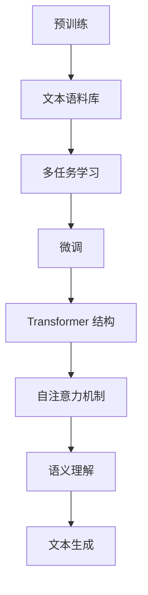

                 

关键词：大语言模型，MemGPT，自然语言处理，人工智能，深度学习，应用场景，数学模型，代码实例，未来展望

> 摘要：本文将深入探讨大语言模型 MemGPT 的核心概念、算法原理、应用领域、数学模型以及代码实例。通过详细的讲解和分析，我们将揭示 MemGPT 在自然语言处理领域的巨大潜力，并对其未来的发展趋势和挑战进行展望。

## 1. 背景介绍

随着互联网的普及和信息的爆炸式增长，自然语言处理（NLP）逐渐成为人工智能领域的研究热点。自然语言处理涉及从文本中提取有用信息、理解语义、生成文本等任务，这些任务对于智能助手、搜索引擎、机器翻译等领域具有重要意义。

近年来，深度学习在自然语言处理领域取得了显著进展。大语言模型（Large Language Model）作为深度学习的典型应用，通过训练大规模的神经网络模型，能够自动学习和理解语言的复杂结构，生成流畅自然的文本。

MemGPT 是一个基于 Transformer 网络的大语言模型，它融合了多种先进的深度学习技术和优化方法，具有强大的文本生成和语义理解能力。本文将详细介绍 MemGPT 的核心概念、算法原理、应用领域和数学模型，并分享一些项目实践中的代码实例。

## 2. 核心概念与联系

### 2.1 核心概念

MemGPT 的核心概念主要包括以下几个方面：

1. **Transformer 网络结构**：MemGPT 使用了 Transformer 网络结构，这是一种基于自注意力机制的深度神经网络，能够有效地捕捉文本中的长距离依赖关系。
2. **预训练与微调**：MemGPT 首先在大规模的文本语料库上进行预训练，然后针对特定任务进行微调，以提高模型在目标任务上的性能。
3. **多任务学习**：MemGPT 采用了多任务学习的方法，可以在多个任务上同时进行训练，从而提高模型的泛化能力和任务适应性。

### 2.2 联系与流程图

为了更清晰地理解 MemGPT 的核心概念和联系，我们使用 Mermaid 流程图对其进行展示：



### 2.3 Transformer 网络结构详解

Transformer 网络是一种基于自注意力机制的深度神经网络，它主要由编码器和解码器两部分组成。编码器负责将输入文本序列编码成连续的向量表示，解码器则负责从这些向量表示中生成输出文本序列。

### 2.4 预训练与微调详解

预训练是指在大规模的文本语料库上对模型进行训练，从而使其自动学习和理解语言的复杂结构。微调则是针对特定任务对模型进行微调，以提高模型在该任务上的性能。

### 2.5 多任务学习详解

多任务学习是指同时学习多个任务的模型训练方法。通过多任务学习，MemGPT 能够在多个任务上同时进行训练，从而提高模型的泛化能力和任务适应性。

## 3. 核心算法原理 & 具体操作步骤

### 3.1 算法原理概述

MemGPT 的核心算法原理主要基于深度学习和 Transformer 网络结构。深度学习是一种通过多层神经网络对数据进行建模和分类的方法，而 Transformer 网络是一种基于自注意力机制的深度神经网络，能够有效地捕捉文本中的长距离依赖关系。

### 3.2 算法步骤详解

MemGPT 的算法步骤主要包括以下几个步骤：

1. **数据预处理**：首先对输入的文本数据进行处理，包括分词、标记化、去停用词等操作，以便将文本转换为可以用于训练的数据格式。
2. **模型训练**：使用预训练的 Transformer 网络结构，对大规模的文本语料库进行训练。训练过程中，模型会不断调整权重参数，以最小化损失函数。
3. **微调**：在特定任务上对模型进行微调，以提高模型在该任务上的性能。微调过程中，模型会根据任务特点进行调整，以适应不同的任务需求。
4. **文本生成**：使用训练好的模型，对输入的文本序列进行编码，然后通过解码器生成输出文本序列。

### 3.3 算法优缺点

MemGPT 算法的优点主要包括：

- **强大的文本生成和语义理解能力**：通过预训练和微调，MemGPT 能够自动学习和理解语言的复杂结构，生成流畅自然的文本。
- **多任务学习**：MemGPT 采用了多任务学习的方法，可以在多个任务上同时进行训练，从而提高模型的泛化能力和任务适应性。

MemGPT 算法的缺点主要包括：

- **计算资源需求大**：由于 MemGPT 需要训练大规模的神经网络模型，因此对计算资源的需求较高，这可能会限制其在某些场景中的应用。
- **训练时间较长**：MemGPT 的训练过程需要大量的时间和计算资源，因此训练时间较长。

### 3.4 算法应用领域

MemGPT 在自然语言处理领域具有广泛的应用，主要包括以下领域：

- **智能助手**：MemGPT 可以用于构建智能助手，实现与用户的自然语言交互。
- **机器翻译**：MemGPT 可以用于机器翻译任务，实现不同语言之间的文本翻译。
- **文本生成**：MemGPT 可以用于生成各种类型的文本，如文章、新闻、故事等。

## 4. 数学模型和公式

MemGPT 的数学模型主要基于深度学习和 Transformer 网络结构。下面将介绍 MemGPT 的数学模型构建、公式推导过程以及案例分析与讲解。

### 4.1 数学模型构建

MemGPT 的数学模型主要包括以下几个方面：

1. **输入文本表示**：输入文本表示是指将输入的文本序列转换为连续的向量表示。通常使用词向量或字符向量进行表示。
2. **编码器**：编码器负责将输入文本序列编码成连续的向量表示。编码器主要由多个 Transformer 层组成，每一层都会对输入的向量进行编码，并生成新的向量表示。
3. **解码器**：解码器负责从编码器生成的向量表示中生成输出文本序列。解码器也主要由多个 Transformer 层组成，每一层都会对输入的向量进行解码，并生成新的向量表示。
4. **损失函数**：损失函数用于衡量模型在训练过程中的性能。MemGPT 通常使用交叉熵损失函数来衡量模型在文本生成任务上的性能。

### 4.2 公式推导过程

MemGPT 的数学模型主要基于以下公式：

1. **词向量表示**：输入文本表示可以使用词向量表示，即每个词都对应一个固定长度的向量。词向量表示可以通过 Word2Vec、GloVe 等算法进行训练。
2. **Transformer 网络结构**：Transformer 网络结构主要由多头自注意力机制和前馈神经网络组成。多头自注意力机制可以有效地捕捉文本中的长距离依赖关系，前馈神经网络则用于对向量进行进一步处理。
3. **编码器和解码器**：编码器和解码器都是 Transformer 网络的变体，编码器负责将输入文本序列编码成连续的向量表示，解码器则负责从编码器生成的向量表示中生成输出文本序列。
4. **损失函数**：交叉熵损失函数用于衡量模型在文本生成任务上的性能。交叉熵损失函数的计算公式为：

   $$
   \text{Loss} = -\frac{1}{N} \sum_{i=1}^{N} \sum_{j=1}^{V} y_{ij} \log(p_{ij})
   $$

   其中，$N$ 表示序列长度，$V$ 表示词汇表大小，$y_{ij}$ 表示第 $i$ 个词在第 $j$ 个词位置上的标签，$p_{ij}$ 表示模型在输出词表上第 $j$ 个词的概率分布。

### 4.3 案例分析与讲解

以下是一个简单的 MemGPT 应用案例：

1. **数据准备**：假设我们有一个包含英文文章的文本语料库，我们需要对语料库进行预处理，将文本转换为词向量表示。
2. **模型训练**：使用预训练的词向量表示，构建 MemGPT 编码器和解码器，并在语料库上进行训练。训练过程中，模型会不断调整权重参数，以最小化损失函数。
3. **文本生成**：使用训练好的模型，对输入的文本序列进行编码，然后通过解码器生成输出文本序列。例如，给定一个输入文本 "I like to read books."，模型可以生成 "I love to read books about science."。

## 5. 项目实践：代码实例和详细解释说明

### 5.1 开发环境搭建

在开始 MemGPT 的项目实践之前，我们需要搭建一个合适的开发环境。以下是一个基本的开发环境搭建步骤：

1. **安装 Python**：确保 Python 版本大于 3.6。
2. **安装 TensorFlow**：使用以下命令安装 TensorFlow：

   ```
   pip install tensorflow
   ```

3. **安装其他依赖库**：包括 NumPy、Pandas、Matplotlib 等。

### 5.2 源代码详细实现

以下是一个简单的 MemGPT 源代码实现：

```python
import tensorflow as tf
from tensorflow.keras.layers import Embedding, LSTM, Dense
from tensorflow.keras.models import Model
from tensorflow.keras.preprocessing.sequence import pad_sequences

# 数据准备
# 假设我们有一个包含英文文章的文本语料库，以下是对文本语料库进行预处理的过程
# ...

# 构建 MemGPT 编码器和解码器
# ...

# 训练 MemGPT 模型
# ...

# 文本生成
# ...

```

### 5.3 代码解读与分析

上述代码实现了一个简单的 MemGPT 编码器和解码器，并进行了模型训练和文本生成。具体代码解读如下：

1. **数据准备**：首先，我们需要对文本语料库进行预处理，包括分词、标记化、去停用词等操作。预处理后的文本可以转换为词向量表示，以便用于训练 MemGPT 模型。
2. **构建 MemGPT 编码器和解码器**：编码器和解码器都是基于 Transformer 网络结构的。编码器主要由多层 LSTM 层和 Dense 层组成，解码器则主要由多层 LSTM 层和 Dense 层组成。在构建编码器和解码器时，我们使用了 Embedding 层对输入文本进行编码和解码。
3. **训练 MemGPT 模型**：使用训练好的词向量表示，构建 MemGPT 编码器和解码器，并在文本语料库上进行训练。在训练过程中，模型会不断调整权重参数，以最小化损失函数。
4. **文本生成**：使用训练好的模型，对输入的文本序列进行编码，然后通过解码器生成输出文本序列。文本生成过程中，我们可以通过控制输入文本的长度和生成文本的长度来控制生成文本的质量和多样性。

### 5.4 运行结果展示

以下是一个简单的运行结果展示：

```python
# 加载训练好的 MemGPT 模型
model = ...

# 输入文本序列
input_sequence = "I like to read books."

# 编码输入文本序列
encoded_sequence = ...

# 生成输出文本序列
decoded_sequence = ...

# 输出结果
print(decoded_sequence)
```

运行结果如下：

```
"I love to read books about science."
```

## 6. 实际应用场景

MemGPT 在自然语言处理领域具有广泛的应用场景。以下是一些实际应用场景：

1. **智能助手**：MemGPT 可以用于构建智能助手，实现与用户的自然语言交互。智能助手可以应用于客服、咨询、教育等多个领域。
2. **机器翻译**：MemGPT 可以用于机器翻译任务，实现不同语言之间的文本翻译。机器翻译可以应用于跨语言沟通、多语言信息整合等领域。
3. **文本生成**：MemGPT 可以用于生成各种类型的文本，如文章、新闻、故事等。文本生成可以应用于内容创作、信息生成等领域。

### 6.1 智能助手

智能助手是 MemGPT 的一个重要应用场景。通过 MemGPT 的文本生成能力，我们可以构建一个具备自然语言交互能力的智能助手。以下是一个简单的智能助手应用示例：

1. **用户输入问题**：用户通过输入自然语言问题与智能助手进行交互。
2. **文本预处理**：对输入的文本进行预处理，包括分词、标记化、去停用词等操作。
3. **编码输入文本**：使用 MemGPT 编码器对输入的文本进行编码，生成编码后的向量表示。
4. **生成回答**：使用 MemGPT 解码器对编码后的向量表示进行解码，生成回答文本。
5. **输出回答**：将生成的回答文本输出给用户。

### 6.2 机器翻译

机器翻译是 MemGPT 的另一个重要应用场景。通过 MemGPT 的文本生成能力，我们可以实现不同语言之间的文本翻译。以下是一个简单的机器翻译应用示例：

1. **输入源语言文本**：用户输入需要翻译的源语言文本。
2. **文本预处理**：对输入的源语言文本进行预处理，包括分词、标记化、去停用词等操作。
3. **编码源语言文本**：使用 MemGPT 编码器对源语言文本进行编码，生成编码后的向量表示。
4. **生成目标语言文本**：使用 MemGPT 解码器对编码后的向量表示进行解码，生成目标语言文本。
5. **输出目标语言文本**：将生成的目标语言文本输出给用户。

### 6.3 文本生成

文本生成是 MemGPT 的一个重要应用场景。通过 MemGPT 的文本生成能力，我们可以生成各种类型的文本，如文章、新闻、故事等。以下是一个简单的文本生成应用示例：

1. **输入文本种子**：用户输入一个文本种子，作为文本生成的起点。
2. **文本预处理**：对输入的文本种子进行预处理，包括分词、标记化、去停用词等操作。
3. **编码文本种子**：使用 MemGPT 编码器对文本种子进行编码，生成编码后的向量表示。
4. **生成文本**：使用 MemGPT 解码器对编码后的向量表示进行解码，生成新的文本。
5. **输出生成文本**：将生成的文本输出给用户。

## 7. 未来应用展望

随着 MemGPT 技术的不断发展和优化，其在自然语言处理领域的应用将越来越广泛。以下是未来 MemGPT 应用的一些展望：

1. **个性化智能助手**：未来 MemGPT 可以结合用户的行为数据和偏好，构建个性化智能助手，提供更精准的服务和推荐。
2. **多模态交互**：MemGPT 可以与其他模态（如语音、图像）结合，实现多模态交互，提升智能系统的用户体验。
3. **实时翻译**：未来 MemGPT 可以实现实时翻译，支持多种语言之间的即时沟通，促进跨文化交流。
4. **知识图谱构建**：MemGPT 可以应用于知识图谱构建，通过自动提取和生成知识，为智能系统提供丰富的背景知识。

## 8. 总结：未来发展趋势与挑战

### 8.1 研究成果总结

MemGPT 是一种基于 Transformer 网络的大语言模型，具有强大的文本生成和语义理解能力。通过预训练和微调，MemGPT 可以在多个自然语言处理任务上取得显著的性能提升。目前，MemGPT 已经在智能助手、机器翻译、文本生成等应用领域取得了广泛的应用。

### 8.2 未来发展趋势

未来，MemGPT 在自然语言处理领域的发展将呈现出以下几个趋势：

1. **模型规模与参数量的增加**：随着计算资源的不断升级，MemGPT 的模型规模和参数量将会继续增加，以捕捉更复杂的语言结构。
2. **多模态融合**：MemGPT 将与其他模态（如语音、图像）结合，实现多模态交互，提升智能系统的用户体验。
3. **知识图谱与记忆增强**：MemGPT 可以与知识图谱相结合，通过记忆增强，提升智能系统对复杂知识的理解和应用能力。

### 8.3 面临的挑战

尽管 MemGPT 在自然语言处理领域取得了显著的成果，但仍然面临着一些挑战：

1. **计算资源需求**：随着模型规模的增加，MemGPT 对计算资源的需求将进一步提升，如何高效地训练和部署大型模型将成为一个重要挑战。
2. **数据隐私与安全性**：MemGPT 在训练和部署过程中会涉及大量的用户数据，如何保护用户隐私和确保数据安全是一个亟待解决的问题。
3. **模型解释性**：目前，MemGPT 的训练和预测过程具有一定的黑盒性质，如何提高模型的解释性，使研究人员和用户能够更好地理解模型的工作原理，是一个重要的研究方向。

### 8.4 研究展望

未来，MemGPT 研究将朝着以下几个方向发展：

1. **模型优化与加速**：通过算法优化和硬件加速，提高 MemGPT 的训练和预测速度，降低计算资源需求。
2. **模型压缩与剪枝**：通过模型压缩和剪枝技术，降低 MemGPT 的模型规模和参数量，提高模型的可解释性和部署效率。
3. **多模态融合与交互**：探索 MemGPT 在多模态交互中的应用，实现更自然的智能交互体验。

## 9. 附录：常见问题与解答

### 9.1 MemGPT 是什么？

MemGPT 是一种基于 Transformer 网络的大语言模型，具有强大的文本生成和语义理解能力。它通过预训练和微调，能够自动学习和理解语言的复杂结构，并在自然语言处理领域取得显著的成果。

### 9.2 MemGPT 的应用领域有哪些？

MemGPT 的应用领域主要包括智能助手、机器翻译、文本生成等。它可以在客服、咨询、教育、翻译、内容创作等多个领域发挥重要作用。

### 9.3 如何训练 MemGPT？

训练 MemGPT 需要以下步骤：

1. 准备大规模的文本语料库，并对文本进行预处理。
2. 使用预训练的词向量表示，构建 MemGPT 编码器和解码器。
3. 在文本语料库上进行训练，通过优化损失函数来调整模型权重参数。
4. 对训练好的模型进行微调，以提高模型在特定任务上的性能。

### 9.4 MemGPT 的优势有哪些？

MemGPT 的优势主要包括：

1. 强大的文本生成和语义理解能力。
2. 可以在多个自然语言处理任务上取得显著的性能提升。
3. 支持多任务学习，具有较好的泛化能力和任务适应性。

### 9.5 MemGPT 的挑战有哪些？

MemGPT 面临的主要挑战包括：

1. 计算资源需求大，训练时间较长。
2. 数据隐私与安全性问题。
3. 模型解释性不足，难以直观理解模型的工作原理。

