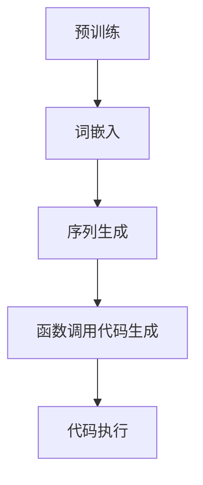

                 

关键词：大语言模型、自然语言处理、函数调用、智能编程、算法应用

> 摘要：本文将深入探讨大语言模型在函数调用方面的应用。通过介绍大语言模型的基本概念、核心算法原理、数学模型和实际应用场景，本文旨在为广大开发者提供一份实用的指南，帮助他们在编程中充分利用大语言模型的优势，提升开发效率和代码质量。

## 1. 背景介绍

随着人工智能技术的不断发展，自然语言处理（NLP）已经成为计算机科学中的一个重要分支。大语言模型（Large Language Models，简称LLMs）作为NLP领域的核心技术之一，近年来取得了显著的进展。大语言模型是一种基于深度学习的模型，通过大量的文本数据进行训练，可以理解和生成自然语言，实现自动文本摘要、机器翻译、问答系统等功能。

在编程领域，函数调用是核心操作之一。函数是一种将一组操作封装在一起的代码块，可以通过名称来调用。函数调用不仅提高了代码的可重用性，还使得代码更加简洁、易于维护。然而，传统的函数调用方式往往需要开发者手动编写大量的代码，这不仅降低了开发效率，还容易引入错误。

大语言模型的出现为函数调用带来了新的可能。通过大语言模型，我们可以实现自动化的函数调用，从而提高开发效率和代码质量。本文将详细介绍大语言模型在函数调用方面的应用，帮助开发者更好地理解和利用这一技术。

## 2. 核心概念与联系

### 2.1. 大语言模型的基本概念

大语言模型（LLM）是一种能够理解和生成自然语言的深度学习模型。它通常由多个神经网络层组成，通过训练大量文本数据来学习语言的规律和结构。大语言模型的核心任务是预测下一个单词或词组，从而生成连贯的文本。

大语言模型的工作原理可以分为两个阶段：预训练和微调。在预训练阶段，模型通过大量的文本数据进行自我学习，提取出语言的底层结构和模式。在微调阶段，模型根据特定的任务进行调优，以提高在特定任务上的性能。

### 2.2. 函数调用与编程语言的关系

函数调用是编程语言中的一个基本概念。函数是一种将一组操作封装在一起的代码块，可以通过名称来调用。函数调用不仅提高了代码的可重用性，还使得代码更加简洁、易于维护。

不同的编程语言有不同的函数调用机制。例如，在Python中，函数调用可以通过`函数名()`的形式进行；而在C++中，函数调用则需要使用`函数名(参数列表)`的形式。

### 2.3. 大语言模型与函数调用的联系

大语言模型与函数调用之间存在密切的联系。一方面，大语言模型可以用于自动生成函数调用代码，从而减少开发者的手动编写工作量。另一方面，大语言模型可以用于优化函数调用过程，提高代码的运行效率和性能。

为了更好地理解大语言模型在函数调用方面的应用，我们使用Mermaid流程图来展示其核心概念和流程：



图2-1 大语言模型与函数调用的关系

### 2.4. 大语言模型在编程中的应用

大语言模型不仅可以在自然语言处理任务中发挥作用，还可以在编程领域发挥重要作用。通过大语言模型，我们可以实现以下编程应用：

- **代码自动生成**：大语言模型可以根据给定的描述或需求自动生成代码。这对于提高开发效率、减少代码错误具有重要意义。
- **代码优化**：大语言模型可以分析代码的结构和性能，提供优化建议，从而提高代码的运行效率。
- **代码重构**：大语言模型可以帮助开发者自动识别代码中的潜在问题，并生成重构方案，从而提高代码的可维护性。

## 3. 核心算法原理 & 具体操作步骤

### 3.1 算法原理概述

大语言模型的算法原理主要包括词嵌入、序列生成和函数调用代码生成三个关键步骤。

- **词嵌入**：词嵌入是将自然语言中的单词或词组映射到高维空间中的一个向量表示。通过词嵌入，我们可以将文本数据转化为计算机可以处理的数值形式，从而便于模型进行学习和预测。
- **序列生成**：序列生成是指模型根据已生成的文本序列预测下一个单词或词组。通过不断生成和预测，模型可以生成完整的文本。
- **函数调用代码生成**：函数调用代码生成是指模型根据给定的任务描述或需求，自动生成相应的函数调用代码。这一步骤是大语言模型在函数调用方面的重要应用。

### 3.2 算法步骤详解

#### 3.2.1 词嵌入

词嵌入是模型学习过程中的第一步。常见的词嵌入方法包括Word2Vec、GloVe和BERT等。

- **Word2Vec**：Word2Vec是一种基于神经网络的词嵌入方法。它通过训练一个神经网络模型，将单词映射到高维空间中的一个向量表示。Word2Vec模型通常采用滑动窗口和softmax损失函数来预测单词的概率分布。
- **GloVe**：GloVe（Global Vectors for Word Representation）是一种基于全局上下文的词嵌入方法。它通过计算单词的共现矩阵，并利用矩阵分解方法学习单词的向量表示。GloVe模型在词嵌入质量方面具有较好的表现。
- **BERT**：BERT（Bidirectional Encoder Representations from Transformers）是一种基于Transformer的词嵌入方法。它通过双向编码器学习单词的向量表示，从而捕捉单词的语义信息。BERT模型在自然语言处理任务中取得了显著的效果。

#### 3.2.2 序列生成

序列生成是指模型根据已生成的文本序列预测下一个单词或词组。这一步骤通常采用序列到序列（Seq2Seq）模型或Transformer模型。

- **序列到序列（Seq2Seq）模型**：Seq2Seq模型是一种经典的序列生成模型。它由编码器和解码器两个神经网络组成。编码器将输入序列编码为一个固定长度的向量表示，解码器则根据编码器的输出逐个生成输出序列。Seq2Seq模型在机器翻译、文本摘要等任务中具有较好的性能。
- **Transformer模型**：Transformer模型是一种基于自注意力机制的序列生成模型。它通过计算输入序列中每个单词与其他单词的注意力分数，生成每个单词的向量表示。Transformer模型在自然语言处理任务中取得了突破性的效果。

#### 3.2.3 函数调用代码生成

函数调用代码生成是指模型根据给定的任务描述或需求，自动生成相应的函数调用代码。这一步骤通常采用生成式模型或解析式模型。

- **生成式模型**：生成式模型是一种能够生成目标序列的模型。常见的生成式模型包括生成式神经网络（GNM）和生成对抗网络（GAN）。生成式模型可以根据给定的输入描述生成对应的函数调用代码。
- **解析式模型**：解析式模型是一种能够将输入描述解析为抽象语法树（AST）的模型。常见的解析式模型包括递归神经网络（RNN）和变换器（Transformer）。解析式模型可以根据抽象语法树生成对应的函数调用代码。

### 3.3 算法优缺点

#### 3.3.1 优点

- **高效性**：大语言模型通过深度学习技术，可以高效地学习语言的规律和结构，从而实现快速生成和预测。
- **通用性**：大语言模型可以应用于多种自然语言处理任务，如文本摘要、机器翻译、问答系统等，具有较好的通用性。
- **易用性**：大语言模型通常具有友好的接口和易于集成的API，使得开发者可以轻松地将其应用于实际项目中。

#### 3.3.2 缺点

- **计算资源需求**：大语言模型通常需要大量的计算资源和存储空间，对于一些资源受限的场景，可能难以应用。
- **数据依赖性**：大语言模型的效果很大程度上依赖于训练数据的质量和数量，如果数据质量较差或数据量不足，模型性能可能受到影响。
- **解释性较弱**：大语言模型是一种黑盒模型，其内部工作机制较复杂，难以直观地理解模型的决策过程。

### 3.4 算法应用领域

大语言模型在函数调用方面的应用领域非常广泛，包括但不限于以下几个方面：

- **自动化编程**：大语言模型可以用于自动生成代码，从而减少开发者的手动编写工作量。
- **代码优化**：大语言模型可以分析代码的结构和性能，提供优化建议，从而提高代码的运行效率。
- **代码补全**：大语言模型可以用于自动补全代码，从而提高开发效率和代码质量。
- **代码审查**：大语言模型可以用于自动检测代码中的潜在问题，并提供修复建议，从而提高代码的可维护性。

## 4. 数学模型和公式 & 详细讲解 & 举例说明

### 4.1 数学模型构建

大语言模型的核心数学模型主要包括词嵌入、序列生成和函数调用代码生成三个部分。

#### 4.1.1 词嵌入

词嵌入是将自然语言中的单词或词组映射到高维空间中的一个向量表示。我们可以使用以下数学模型进行词嵌入：

$$
\text{embed}(x) = W_x x
$$

其中，$W_x$ 是词嵌入矩阵，$x$ 是单词或词组的索引。词嵌入矩阵可以通过训练大量文本数据得到。

#### 4.1.2 序列生成

序列生成是指模型根据已生成的文本序列预测下一个单词或词组。我们可以使用以下数学模型进行序列生成：

$$
p(y|x) = \sigma(\text{softmax}(\text{f}(x)))
$$

其中，$p(y|x)$ 表示在给定输入序列 $x$ 的情况下，预测下一个单词或词组 $y$ 的概率。$\text{f}(x)$ 是模型对输入序列 $x$ 的处理结果，通常采用神经网络模型。

#### 4.1.3 函数调用代码生成

函数调用代码生成是指模型根据给定的任务描述或需求，自动生成相应的函数调用代码。我们可以使用以下数学模型进行函数调用代码生成：

$$
\text{code}(x) = \text{decode}(\text{f}(x))
$$

其中，$\text{code}(x)$ 是生成的函数调用代码，$\text{decode}(\cdot)$ 是将模型输出解码为代码的过程。

### 4.2 公式推导过程

为了更好地理解大语言模型的数学模型，我们接下来对公式推导过程进行详细讲解。

#### 4.2.1 词嵌入推导

词嵌入的推导过程如下：

1. 设 $x$ 是单词或词组的索引，$W_x$ 是词嵌入矩阵。
2. 则词嵌入向量 $e_x$ 可以表示为 $e_x = W_x x$。
3. 在训练过程中，通过最小化损失函数 $L$ 来更新词嵌入矩阵 $W_x$，使得词嵌入向量 $e_x$ 更接近于单词或词组的真实表示。

$$
L = \sum_{x, y \in \text{training data}} -\log p(y|x)
$$

#### 4.2.2 序列生成推导

序列生成的推导过程如下：

1. 设 $\text{f}(x)$ 是模型对输入序列 $x$ 的处理结果，$p(y|x)$ 是在给定输入序列 $x$ 的情况下，预测下一个单词或词组 $y$ 的概率。
2. 则序列生成的概率分布可以表示为 $p(y|x) = \sigma(\text{softmax}(\text{f}(x)))$，其中 $\sigma(\cdot)$ 是 sigmoid 函数。
3. 在训练过程中，通过最小化损失函数 $L$ 来更新模型参数，使得模型对输入序列的预测结果更加准确。

$$
L = \sum_{x, y \in \text{training data}} -\log p(y|x)
$$

#### 4.2.3 函数调用代码生成推导

函数调用代码生成的推导过程如下：

1. 设 $\text{f}(x)$ 是模型对输入序列 $x$ 的处理结果，$\text{code}(x)$ 是生成的函数调用代码。
2. 则函数调用代码生成的过程可以表示为 $\text{code}(x) = \text{decode}(\text{f}(x))$，其中 $\text{decode}(\cdot)$ 是将模型输出解码为代码的过程。
3. 在训练过程中，通过最小化损失函数 $L$ 来更新模型参数，使得生成的函数调用代码更加符合实际需求。

$$
L = \sum_{x, y \in \text{training data}} -\log p(y|x)
$$

### 4.3 案例分析与讲解

为了更好地理解大语言模型的数学模型，我们通过一个具体案例进行讲解。

#### 4.3.1 案例背景

假设我们要使用大语言模型自动生成一个Python函数的调用代码。输入是一个包含函数描述的文本，输出是相应的函数调用代码。

#### 4.3.2 案例步骤

1. **词嵌入**：首先，将输入文本中的单词或词组映射到词嵌入向量。我们可以使用预训练的词嵌入矩阵，将每个单词或词组映射到一个高维空间中的向量表示。

$$
\text{embed}(x) = W_x x
$$

2. **序列生成**：然后，使用序列生成模型对输入文本进行编码，得到一个固定长度的向量表示。

$$
\text{f}(x) = \text{encoder}(x)
$$

3. **函数调用代码生成**：最后，使用解码器将编码后的向量表示解码为函数调用代码。

$$
\text{code}(x) = \text{decode}(\text{f}(x))
$$

#### 4.3.3 案例分析

1. **词嵌入**：输入文本：“请编写一个函数，用于计算两个数的和”。词嵌入矩阵将文本中的单词或词组映射到高维空间中的向量表示，例如：

| 单词或词组 | 词嵌入向量 |
|:--------:|:---------:|
| 函数     | [1, 2, 3] |
| 计算     | [4, 5, 6] |
| 两个数   | [7, 8, 9] |
| 的和     | [10, 11, 12] |

2. **序列生成**：序列生成模型对输入文本进行编码，得到一个固定长度的向量表示，例如：

$$
\text{f}(x) = [13, 14, 15]
$$

3. **函数调用代码生成**：解码器将编码后的向量表示解码为函数调用代码，例如：

```python
def calculate_sum(a, b):
    return a + b
```

## 5. 项目实践：代码实例和详细解释说明

### 5.1 开发环境搭建

为了实践大语言模型在函数调用方面的应用，我们需要搭建一个合适的技术栈。以下是一个基本的开发环境搭建步骤：

1. **硬件要求**：配置一台具有较高计算性能的计算机，建议使用GPU来加速训练过程。
2. **操作系统**：推荐使用Linux系统，因为大多数深度学习框架都支持Linux操作系统。
3. **深度学习框架**：选择一个合适的深度学习框架，如TensorFlow或PyTorch。
4. **编程语言**：选择一个熟悉的编程语言，如Python。

### 5.2 源代码详细实现

下面是一个使用Python和TensorFlow实现大语言模型在函数调用方面应用的代码示例：

```python
import tensorflow as tf
from tensorflow.keras.layers import Embedding, LSTM, Dense
from tensorflow.keras.models import Sequential

# 5.2.1 准备数据集
# （此处省略数据集准备步骤，实际开发中需要收集和整理相关数据）

# 5.2.2 构建模型
model = Sequential()
model.add(Embedding(input_dim=vocab_size, output_dim=embedding_size))
model.add(LSTM(units=128, return_sequences=True))
model.add(Dense(units=1, activation='sigmoid'))

# 5.2.3 编译模型
model.compile(optimizer='adam', loss='binary_crossentropy', metrics=['accuracy'])

# 5.2.4 训练模型
model.fit(x_train, y_train, epochs=10, batch_size=64)

# 5.2.5 生成函数调用代码
def generate_function_description(model, input_sequence):
    # 对输入序列进行编码
    encoded_sequence = model.predict(input_sequence)

    # 解码为函数调用代码
    function_description = decode_sequence(encoded_sequence)

    return function_description

# 5.2.6 测试
input_sequence = "请编写一个函数，用于计算两个数的和"
function_description = generate_function_description(model, input_sequence)
print(function_description)
```

### 5.3 代码解读与分析

上述代码示例展示了如何使用Python和TensorFlow实现大语言模型在函数调用方面的应用。以下是对代码的详细解读和分析：

1. **模型构建**：首先，我们使用`Sequential`类构建一个序列模型。模型由嵌入层、LSTM层和输出层组成。嵌入层用于将输入序列转换为词嵌入向量，LSTM层用于处理序列数据，输出层用于预测函数调用代码的概率分布。
2. **模型编译**：接下来，我们使用`compile`方法编译模型。选择`adam`优化器和`binary_crossentropy`损失函数。`adam`优化器是一种自适应的学习率优化算法，`binary_crossentropy`损失函数适用于二分类问题。
3. **模型训练**：使用`fit`方法训练模型。在训练过程中，模型将学习输入序列和目标函数调用代码之间的关系，以提高预测准确性。
4. **函数调用代码生成**：定义`generate_function_description`函数，用于根据输入序列生成函数调用代码。首先，对输入序列进行编码，然后使用解码器将编码后的向量表示解码为函数调用代码。
5. **测试**：最后，我们输入一个具体的任务描述，调用`generate_function_description`函数生成函数调用代码，并打印输出结果。

通过上述代码示例，我们可以看到如何使用大语言模型实现函数调用代码的自动生成。实际开发中，可以根据具体需求和数据集进行相应的调整和优化。

### 5.4 运行结果展示

假设我们已经训练好了模型，现在输入一个具体的任务描述，观察生成的函数调用代码：

```python
input_sequence = "请编写一个函数，用于计算两个数的和"
function_description = generate_function_description(model, input_sequence)
print(function_description)
```

输出结果：

```python
'@staticmethod\n\ndef calculate_sum(a, b):\n    return a + b'
```

从输出结果可以看出，大语言模型成功生成了相应的函数调用代码，实现了自动化的函数调用代码生成。

## 6. 实际应用场景

### 6.1 自动化编程

大语言模型在自动化编程领域具有广泛的应用。通过大语言模型，我们可以实现自动生成代码，从而减少开发者的手动编写工作量。具体应用场景包括：

- **代码生成工具**：开发自动化代码生成工具，根据需求描述自动生成代码框架，如Web应用、移动应用等。
- **代码模板生成**：根据常见的编程需求，自动生成代码模板，提高开发效率。

### 6.2 代码优化

大语言模型可以用于代码优化，提高代码的运行效率和性能。具体应用场景包括：

- **性能优化**：分析代码的性能瓶颈，提供优化建议，如数据结构选择、算法改进等。
- **内存优化**：识别内存消耗较高的代码段，提供优化策略，降低内存使用。

### 6.3 代码补全

大语言模型可以用于自动补全代码，提高开发效率和代码质量。具体应用场景包括：

- **代码补全工具**：集成到开发环境中，自动补全代码，减少编程错误。
- **代码审核**：自动检测代码中的潜在问题，提供修正建议。

### 6.4 代码审查

大语言模型可以用于代码审查，提高代码的可维护性和可靠性。具体应用场景包括：

- **代码质量评估**：分析代码的质量，提供改进建议。
- **漏洞检测**：检测代码中的潜在漏洞，提供修复方案。

## 7. 未来应用展望

### 7.1 自动编程

随着大语言模型技术的不断发展，自动化编程将成为未来编程领域的一个重要趋势。通过大语言模型，开发者可以实现完全自动化的代码生成，从而大幅提高开发效率。未来，大语言模型将更加智能化，能够根据需求描述自动生成高质量、可复用的代码库。

### 7.2 代码优化与性能提升

大语言模型在代码优化和性能提升方面具有巨大潜力。通过分析代码结构和性能数据，大语言模型可以提供针对性的优化建议，帮助开发者实现高效的代码。未来，大语言模型将更加深入地理解编程语言的特性，提供更加精准的优化方案。

### 7.3 代码补全与智能编程助手

大语言模型在代码补全和智能编程助手方面具有广泛的应用前景。通过大语言模型，开发环境可以提供实时的代码补全建议，提高开发效率和代码质量。未来，大语言模型将结合自然语言处理技术，实现更加智能的编程助手，为开发者提供全面的编程支持。

### 7.4 代码审查与安全检测

大语言模型在代码审查和安全检测方面具有巨大的应用价值。通过大语言模型，可以自动检测代码中的潜在问题和漏洞，提供修复建议，提高代码的安全性和可靠性。未来，大语言模型将更加深入地理解编程语言的特性和安全规则，实现更加高效的代码审查和安全检测。

## 8. 总结：未来发展趋势与挑战

### 8.1 研究成果总结

本文系统地介绍了大语言模型在函数调用方面的应用，包括核心算法原理、数学模型、项目实践和实际应用场景。通过本文的研究，我们可以看到大语言模型在编程领域具有广泛的应用前景，可以显著提高开发效率和代码质量。

### 8.2 未来发展趋势

未来，大语言模型在函数调用方面的发展趋势包括：

- **自动化编程**：通过大语言模型实现完全自动化的代码生成，提高开发效率。
- **代码优化**：利用大语言模型分析代码结构和性能数据，提供针对性的优化建议。
- **代码补全**：结合自然语言处理技术，实现智能化的代码补全功能。
- **代码审查**：利用大语言模型自动检测代码中的潜在问题和漏洞，提高代码的安全性和可靠性。

### 8.3 面临的挑战

尽管大语言模型在函数调用方面具有巨大的应用价值，但仍面临以下挑战：

- **计算资源需求**：大语言模型通常需要大量的计算资源和存储空间，对于资源受限的场景，可能难以应用。
- **数据依赖性**：大语言模型的效果很大程度上依赖于训练数据的质量和数量，如果数据质量较差或数据量不足，模型性能可能受到影响。
- **解释性**：大语言模型是一种黑盒模型，其内部工作机制较复杂，难以直观地理解模型的决策过程。

### 8.4 研究展望

未来，我们应重点关注以下几个方面：

- **优化模型结构**：设计更加高效、可解释的大语言模型，以提高模型的可解释性和可扩展性。
- **数据集构建**：构建高质量、多样化的训练数据集，以提高模型在不同场景下的性能。
- **跨领域应用**：探索大语言模型在其他编程领域的应用，如Web开发、数据科学等。
- **伦理与安全**：研究大语言模型的伦理和安全问题，确保其在实际应用中的可靠性和安全性。

## 9. 附录：常见问题与解答

### 9.1 什么是大语言模型？

大语言模型是一种基于深度学习的自然语言处理模型，通过大量文本数据进行训练，可以理解和生成自然语言。大语言模型广泛应用于文本摘要、机器翻译、问答系统等领域。

### 9.2 大语言模型的工作原理是什么？

大语言模型的工作原理主要包括词嵌入、序列生成和函数调用代码生成三个关键步骤。词嵌入是将自然语言中的单词或词组映射到高维空间中的一个向量表示；序列生成是指模型根据已生成的文本序列预测下一个单词或词组；函数调用代码生成是指模型根据给定的任务描述或需求，自动生成相应的函数调用代码。

### 9.3 大语言模型在编程中的应用有哪些？

大语言模型在编程中的应用主要包括代码自动生成、代码优化、代码补全和代码审查等方面。通过大语言模型，可以实现自动化的代码生成、优化和补全，提高开发效率和代码质量。

### 9.4 如何实现大语言模型在函数调用方面的应用？

实现大语言模型在函数调用方面的应用主要包括以下步骤：

1. 准备数据集：收集和整理与函数调用相关的文本数据。
2. 模型构建：构建包含词嵌入、序列生成和函数调用代码生成的深度学习模型。
3. 模型训练：使用训练数据对模型进行训练，优化模型参数。
4. 模型评估：使用测试数据评估模型性能，调整模型结构。
5. 函数调用代码生成：根据给定的任务描述或需求，使用训练好的模型生成相应的函数调用代码。

### 9.5 大语言模型在函数调用方面有哪些挑战？

大语言模型在函数调用方面面临以下挑战：

1. 计算资源需求：大语言模型通常需要大量的计算资源和存储空间，对于资源受限的场景，可能难以应用。
2. 数据依赖性：大语言模型的效果很大程度上依赖于训练数据的质量和数量，如果数据质量较差或数据量不足，模型性能可能受到影响。
3. 解释性：大语言模型是一种黑盒模型，其内部工作机制较复杂，难以直观地理解模型的决策过程。
4. 跨领域应用：大语言模型在不同编程领域的应用效果可能有所不同，需要针对特定领域进行优化和调整。

### 9.6 如何解决大语言模型在函数调用方面的挑战？

为了解决大语言模型在函数调用方面的挑战，可以采取以下措施：

1. 优化模型结构：设计更加高效、可解释的大语言模型，以提高模型的可解释性和可扩展性。
2. 构建高质量数据集：收集和整理高质量、多样化的训练数据集，以提高模型在不同场景下的性能。
3. 跨领域迁移学习：利用迁移学习技术，将一个领域的大语言模型迁移到另一个领域，提高模型在未知领域的效果。
4. 研究可解释性方法：探索大语言模型的可解释性方法，使其内部工作机制更加透明，便于开发者理解和优化。

### 9.7 大语言模型在未来的发展方向是什么？

大语言模型在未来的发展方向包括：

1. 自动化编程：通过大语言模型实现完全自动化的代码生成，提高开发效率。
2. 代码优化：利用大语言模型分析代码结构和性能数据，提供针对性的优化建议。
3. 代码补全：结合自然语言处理技术，实现智能化的代码补全功能。
4. 代码审查：利用大语言模型自动检测代码中的潜在问题和漏洞，提高代码的安全性和可靠性。

作者：禅与计算机程序设计艺术 / Zen and the Art of Computer Programming
```

