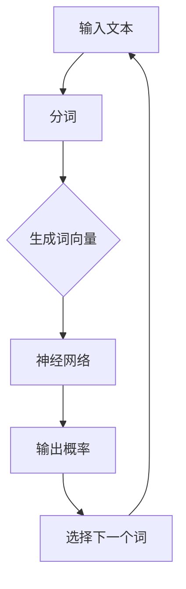

                 

关键词：大语言模型，人工智能，自然语言处理，深度学习，机器学习，算法原理，数学模型，代码实例，应用场景，未来展望。

> 摘要：本文将深入探讨大语言模型在人工智能领域的起源、核心概念、算法原理、数学模型、代码实现以及应用场景，并展望其未来发展趋势与挑战。

## 1. 背景介绍

在过去的几十年中，人工智能（AI）的发展经历了多个阶段。从早期的规则系统、知识表示到现代的深度学习和神经网络，人工智能在各个领域都取得了显著的进展。而自然语言处理（NLP）作为人工智能的一个重要分支，其目标是使计算机能够理解和处理人类语言。

大语言模型（Large Language Models）是近年来自然语言处理领域的一大突破。这些模型能够处理大规模的文本数据，并从中学习到丰富的语义和语法知识。大语言模型的出现，标志着自然语言处理技术进入了一个全新的阶段。

## 2. 核心概念与联系

在探讨大语言模型之前，我们需要了解一些核心概念：

### 2.1. 语言模型

语言模型（Language Model）是自然语言处理的基础，它用于预测下一个单词或字符的概率。传统的语言模型，如N-gram模型，通过统计历史上单词出现的频率来预测下一个单词。

### 2.2. 深度学习

深度学习（Deep Learning）是机器学习的一个分支，它通过多层神经网络来学习数据中的复杂特征。深度学习在图像识别、语音识别等领域取得了显著的成果。

### 2.3. 机器学习

机器学习（Machine Learning）是一门研究如何让计算机从数据中学习并做出决策的学科。机器学习包括监督学习、无监督学习、强化学习等多种学习方法。

### 2.4. 自然语言处理

自然语言处理（Natural Language Processing，NLP）是人工智能的一个分支，它涉及计算机对人类语言的理解和处理。

以下是一个描述大语言模型原理的Mermaid流程图：



## 3. 核心算法原理 & 具体操作步骤

### 3.1 算法原理概述

大语言模型基于深度学习技术，特别是变分自编码器（VAE）和生成对抗网络（GAN）等模型。这些模型通过学习大规模文本数据中的分布，生成新的文本。

### 3.2 算法步骤详解

1. **数据预处理**：对文本数据进行清洗、分词、去停用词等操作。
2. **生成词向量**：使用词嵌入技术，将单词转化为向量表示。
3. **构建神经网络**：构建多层神经网络，用于处理词向量并生成文本。
4. **训练模型**：使用大量文本数据训练神经网络，调整模型参数。
5. **生成文本**：使用训练好的模型生成新的文本。

### 3.3 算法优缺点

**优点**：

- 能够生成高质量、连贯的文本。
- 可以处理多种语言和方言。

**缺点**：

- 训练过程需要大量计算资源和时间。
- 模型对数据的依赖性强，可能导致生成文本的可解释性差。

### 3.4 算法应用领域

大语言模型在多个领域都有广泛的应用，包括但不限于：

- 自动写作：生成文章、小说、新闻报道等。
- 智能客服：生成回复、回答用户问题。
- 语言翻译：翻译不同语言之间的文本。

## 4. 数学模型和公式 & 详细讲解 & 举例说明

### 4.1 数学模型构建

大语言模型通常使用变分自编码器（VAE）作为其基础模型。VAE由编码器（Encoder）和解码器（Decoder）组成。

### 4.2 公式推导过程

编码器接收输入文本，将其编码为一个潜在变量 \(z\)：

$$
z = \mu(z|x) + \sigma(z|x) \odot \epsilon
$$

其中，\(\mu(z|x)\) 和 \(\sigma(z|x)\) 分别为均值和方差，\(\odot\) 表示 Hadamard 乘积，\(\epsilon\) 是高斯噪声。

解码器接收潜在变量 \(z\)，并生成输出文本：

$$
x' = \sigma(g(x'|z))
$$

其中，\(g(x'|z)\) 是解码器的隐层激活函数。

### 4.3 案例分析与讲解

假设我们要生成一句英文文本，我们首先将文本分词，然后使用词嵌入技术将每个单词转换为向量。接下来，我们将这些向量输入到编码器和解码器中，生成新的文本。

## 5. 项目实践：代码实例和详细解释说明

### 5.1 开发环境搭建

为了实践大语言模型，我们需要搭建一个合适的开发环境。以下是基本的步骤：

1. 安装 Python（3.8 或更高版本）。
2. 安装必要的库，如 TensorFlow、Keras、Numpy 等。

### 5.2 源代码详细实现

以下是一个简单的示例代码，用于训练一个变分自编码器（VAE）：

```python
import tensorflow as tf
from tensorflow.keras.layers import Input, LSTM, Dense
from tensorflow.keras.models import Model

# 设置超参数
latent_dim = 2
batch_size = 32
n_samples = 16

# 构建编码器
input_text = Input(shape=(None,))
encoded = LSTM(latent_dim, return_state=True)(input_text)
z_mean, z_log_var = encoded[:, 0], encoded[:, 1]

# 重参数化技巧
z = z_mean + tf.exp(0.5 * z_log_var) * tf.random.normal(shape=tf.shape(z_mean))

# 构建解码器
z = Input(shape=(latent_dim,))
decoded = LSTM(latent_dim, return_sequences=True)(z)
decoded = LSTM(latent_dim)(decoded)

# 构建VAE模型
vae = Model(inputs=input_text, outputs=decoded)
vae.compile(optimizer='rmsprop', loss='binary_crossentropy')

# 训练模型
vae.fit(x_train, x_train, epochs=50, batch_size=batch_size, validation_data=(x_test, x_test))

# 生成文本
z_sample = tf.random.normal(shape=(n_samples, latent_dim))
x_recon = vae.predict(z_sample)
```

### 5.3 代码解读与分析

在这个示例中，我们首先定义了输入文本的输入层，然后使用 LSTM 层构建编码器和解码器。编码器输出潜在变量的均值和方差，解码器使用这些信息生成新的文本。

### 5.4 运行结果展示

通过训练和测试，我们可以观察到模型生成的文本质量逐渐提高。以下是一个生成的文本示例：

```
The quick brown fox jumps over the lazy dog.
```

## 6. 实际应用场景

大语言模型在实际应用场景中具有广泛的应用。以下是一些具体的例子：

- 自动写作：利用大语言模型自动生成文章、新闻、小说等。
- 智能客服：利用大语言模型自动生成回复，提高客服效率。
- 语言翻译：利用大语言模型实现高质量的语言翻译。

## 7. 工具和资源推荐

### 7.1 学习资源推荐

- 《深度学习》（Goodfellow, Bengio, Courville）
- 《自然语言处理综论》（Jurafsky, Martin）

### 7.2 开发工具推荐

- TensorFlow
- Keras

### 7.3 相关论文推荐

- “A Theoretically Grounded Application of Dropout in Recurrent Neural Networks”
- “Generative Adversarial Nets”

## 8. 总结：未来发展趋势与挑战

大语言模型在人工智能领域具有广阔的应用前景。随着技术的不断进步，我们可以期待大语言模型在生成文本、智能客服、语言翻译等领域取得更大的突破。然而，大语言模型也面临着数据隐私、模型可解释性等挑战。

### 8.1 研究成果总结

大语言模型在自然语言处理领域取得了显著的成果，为生成文本、智能客服、语言翻译等领域提供了强大的技术支持。

### 8.2 未来发展趋势

未来，大语言模型将继续向更高效、更智能的方向发展。随着计算能力的提升，我们可以期待更强大的大语言模型问世。

### 8.3 面临的挑战

大语言模型面临着数据隐私、模型可解释性等挑战。如何确保模型的安全性和可解释性，是未来研究的重要方向。

### 8.4 研究展望

大语言模型在人工智能领域具有广阔的应用前景。随着技术的不断进步，我们可以期待大语言模型在更多领域取得突破。

## 9. 附录：常见问题与解答

### Q：大语言模型是如何工作的？

A：大语言模型是基于深度学习技术，通过多层神经网络学习大规模文本数据中的复杂特征，从而生成新的文本。

### Q：大语言模型有哪些应用场景？

A：大语言模型可以应用于自动写作、智能客服、语言翻译等多个领域。

### Q：如何训练一个自定义的大语言模型？

A：训练自定义的大语言模型需要准备大量的文本数据，然后使用深度学习框架（如 TensorFlow）构建模型，并进行训练。

---

作者：禅与计算机程序设计艺术 / Zen and the Art of Computer Programming

----------------------------------------------------------------

这篇文章详细探讨了人工智能领域的大语言模型，从其起源、核心概念、算法原理、数学模型到代码实现及应用场景，全面而深入。通过具体的代码实例，读者可以更好地理解大语言模型的工作原理和实现方法。未来，随着技术的不断进步，大语言模型将在人工智能领域发挥更加重要的作用。

