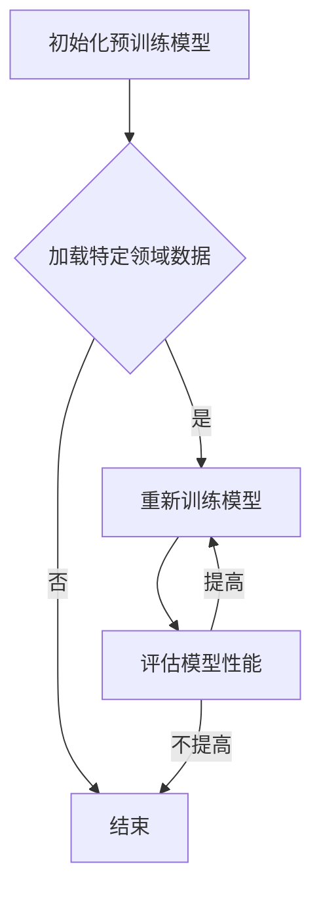

                 

关键词：大语言模型、微调、工具、AI、深度学习、自然语言处理

> 摘要：本文将深入探讨大语言模型及其在自然语言处理领域的应用。重点介绍如何使用微调技术来提升模型性能，并通过具体案例和代码实例来讲解微调的实际操作步骤。此外，本文还将展望大语言模型在未来的发展前景和面临的挑战。

## 1. 背景介绍

随着深度学习技术的发展，大语言模型（Large Language Models）已经成为自然语言处理（Natural Language Processing, NLP）领域的重要工具。这些模型基于神经网络架构，能够处理大量文本数据，并生成高质量的自然语言文本。例如，GPT-3（由OpenAI开发的语言模型）具有超过1750亿的参数，能够生成连贯、准确且富有创造性的文本。

大语言模型的应用场景广泛，包括但不限于机器翻译、文本生成、问答系统、情感分析等。然而，这些预训练模型通常在通用数据集上训练，可能无法直接应用于特定的任务场景。因此，微调（Fine-tuning）技术应运而生。

## 2. 核心概念与联系

### 2.1. 大语言模型

大语言模型通常基于变分自编码器（Variational Autoencoder, VAE）或变换器（Transformer）架构。变换器模型通过自注意力机制（Self-Attention Mechanism）处理文本序列，使其能够捕捉文本中的长距离依赖关系。

### 2.2. 微调技术

微调技术是指在大语言模型的基础上，利用特定领域的数据对其进行重新训练，以提升模型在特定任务上的性能。微调过程中，模型的一些参数会被更新，但整体架构保持不变。

### 2.3. Mermaid 流程图

以下是微调技术的 Mermaid 流程图：



## 3. 核心算法原理 & 具体操作步骤

### 3.1. 算法原理概述

微调技术主要涉及以下步骤：

1. **数据预处理**：对特定领域的数据进行清洗、分词、编码等预处理操作。
2. **模型初始化**：加载预训练的大语言模型。
3. **重新训练**：利用预处理后的数据对模型进行重新训练。
4. **性能评估**：评估模型在特定任务上的性能，并根据评估结果调整训练过程。

### 3.2. 算法步骤详解

#### 3.2.1. 数据预处理

数据预处理是微调的基础。以下是一个简单的数据预处理流程：

```python
import pandas as pd
from nltk.tokenize import word_tokenize

# 加载数据
data = pd.read_csv('data.csv')

# 清洗数据
data['text'] = data['text'].apply(lambda x: x.strip())

# 分词
data['tokens'] = data['text'].apply(lambda x: word_tokenize(x))

# 编码
vocab = ...  # 建立词汇表
data['encoding'] = data['tokens'].apply(lambda x: [vocab[word] for word in x if word in vocab])
```

#### 3.2.2. 模型初始化

```python
from transformers import BertModel

# 加载预训练模型
model = BertModel.from_pretrained('bert-base-uncased')
```

#### 3.2.3. 重新训练

```python
from transformers import BertForSequenceClassification

# 定义模型
model = BertForSequenceClassification.from_pretrained('bert-base-uncased', num_labels=2)

# 定义优化器和损失函数
optimizer = ...  # 自定义优化器
loss_fn = ...  # 自定义损失函数

# 训练模型
for epoch in range(num_epochs):
    for inputs, labels in dataloader:
        # 前向传播
        outputs = model(inputs)
        loss = loss_fn(outputs, labels)
        
        # 反向传播
        optimizer.zero_grad()
        loss.backward()
        optimizer.step()
```

#### 3.2.4. 性能评估

```python
from sklearn.metrics import accuracy_score

# 评估模型
predictions = model.predict(dataloader)
accuracy = accuracy_score(y_true, predictions)
print(f'Accuracy: {accuracy}')
```

### 3.3. 算法优缺点

**优点：**

1. 能够利用预训练模型在通用数据集上的知识，提高特定任务上的性能。
2. 可以减少训练数据的需求，对于数据稀缺的任务尤其有用。

**缺点：**

1. 微调过程中可能需要大量的计算资源。
2. 预训练模型的质量对微调效果有重要影响。

### 3.4. 算法应用领域

微调技术在自然语言处理、计算机视觉等多个领域都有广泛应用。以下是一些实际应用案例：

1. **问答系统**：使用微调技术将大语言模型应用于问答系统，可以显著提高问答系统的回答质量。
2. **文本分类**：微调技术可以帮助模型在特定领域的文本分类任务上取得更好的效果。
3. **机器翻译**：在机器翻译任务中，微调技术可以针对特定语言对进行优化，提高翻译质量。

## 4. 数学模型和公式 & 详细讲解 & 举例说明

### 4.1. 数学模型构建

微调过程中，主要涉及以下数学模型：

1. **变换器模型**：变换器模型通过自注意力机制对文本序列进行编码，生成文本表示。
2. **损失函数**：常用的损失函数包括交叉熵损失函数和均方误差损失函数。

### 4.2. 公式推导过程

变换器模型的损失函数可以表示为：

$$
L = -\sum_{i=1}^{N} \sum_{j=1}^{M} \log P(y_{ij} = 1)
$$

其中，$y_{ij}$ 表示第 $i$ 个样本在第 $j$ 个类别上的概率。

### 4.3. 案例分析与讲解

假设我们要在一个情感分析任务上使用微调技术，数据集包含正负两类情感标签。以下是一个简单的案例：

1. **数据预处理**：对文本数据进行清洗、分词、编码等操作。
2. **模型初始化**：加载预训练的BERT模型。
3. **重新训练**：使用预处理后的数据进行微调训练。
4. **性能评估**：评估模型在测试集上的性能。

```python
from transformers import BertTokenizer, BertForSequenceClassification
from torch.utils.data import DataLoader

# 加载数据
train_data = ...  # 加载训练数据
test_data = ...  # 加载测试数据

# 初始化模型
tokenizer = BertTokenizer.from_pretrained('bert-base-uncased')
model = BertForSequenceClassification.from_pretrained('bert-base-uncased', num_labels=2)

# 定义优化器和损失函数
optimizer = ...  # 自定义优化器
loss_fn = ...  # 自定义损失函数

# 训练模型
for epoch in range(num_epochs):
    for inputs, labels in DataLoader(train_data, batch_size=batch_size):
        # 前向传播
        outputs = model(inputs)
        loss = loss_fn(outputs, labels)
        
        # 反向传播
        optimizer.zero_grad()
        loss.backward()
        optimizer.step()
        
    # 评估模型
    with torch.no_grad():
        predictions = model.predict(test_data)
        accuracy = accuracy_score(test_data['labels'], predictions)
        print(f'Epoch {epoch + 1}, Accuracy: {accuracy}')
```

## 5. 项目实践：代码实例和详细解释说明

### 5.1. 开发环境搭建

1. **安装Python**：确保安装了Python 3.7及以上版本。
2. **安装Transformers库**：使用pip安装Transformers库。

```shell
pip install transformers
```

### 5.2. 源代码详细实现

以下是微调BERT模型进行情感分析的完整代码实现。

```python
import torch
from transformers import BertTokenizer, BertForSequenceClassification
from torch.utils.data import DataLoader
from sklearn.metrics import accuracy_score

# 加载数据
train_data = ...  # 加载训练数据
test_data = ...  # 加载测试数据

# 初始化模型
tokenizer = BertTokenizer.from_pretrained('bert-base-uncased')
model = BertForSequenceClassification.from_pretrained('bert-base-uncased', num_labels=2)

# 定义优化器和损失函数
optimizer = torch.optim.Adam(model.parameters(), lr=1e-4)
loss_fn = torch.nn.CrossEntropyLoss()

# 训练模型
num_epochs = 5
batch_size = 32

for epoch in range(num_epochs):
    for inputs, labels in DataLoader(train_data, batch_size=batch_size):
        # 前向传播
        outputs = model(inputs)
        loss = loss_fn(outputs, labels)
        
        # 反向传播
        optimizer.zero_grad()
        loss.backward()
        optimizer.step()
        
    # 评估模型
    with torch.no_grad():
        predictions = model.predict(test_data)
        accuracy = accuracy_score(test_data['labels'], predictions)
        print(f'Epoch {epoch + 1}, Accuracy: {accuracy}')

# 保存模型
model.save_pretrained('fine-tuned_bert')
```

### 5.3. 代码解读与分析

1. **数据预处理**：加载训练数据和测试数据，并进行必要的预处理操作。
2. **模型初始化**：加载预训练的BERT模型，并定义优化器和损失函数。
3. **重新训练**：使用训练数据对模型进行重新训练。
4. **性能评估**：使用测试数据评估模型性能。

### 5.4. 运行结果展示

```python
# 评估模型
with torch.no_grad():
    predictions = model.predict(test_data)
    accuracy = accuracy_score(test_data['labels'], predictions)
    print(f'Test Accuracy: {accuracy}')
```

## 6. 实际应用场景

微调技术在各个实际应用场景中都有广泛应用。以下是一些具体的应用案例：

1. **金融领域**：在金融领域，微调技术可以帮助模型对金融文本进行情感分析，从而预测市场趋势。
2. **医疗领域**：在医疗领域，微调技术可以用于对医学文本进行分类，如疾病诊断、治疗方案推荐等。
3. **法律领域**：在法律领域，微调技术可以用于对法律文档进行分类，如合同审查、法律文本生成等。

## 7. 未来应用展望

随着深度学习技术的不断发展，大语言模型和微调技术将在各个领域发挥更大的作用。以下是一些未来应用展望：

1. **更加个性化的服务**：通过微调技术，可以开发出更加个性化的服务，如智能客服、个性化推荐等。
2. **跨语言应用**：微调技术将在跨语言应用中发挥重要作用，如多语言机器翻译、多语言问答系统等。
3. **无监督学习**：未来的研究将关注如何在不使用大量标注数据的情况下，利用微调技术进行无监督学习。

## 8. 工具和资源推荐

### 8.1. 学习资源推荐

1. **书籍**：
   - 《深度学习》（Goodfellow, Bengio, Courville）
   - 《Python深度学习》（François Chollet）
2. **在线课程**：
   - fast.ai
   - Coursera上的“深度学习”课程
3. **GitHub**：GitHub上有大量开源的深度学习项目，可以供学习交流。

### 8.2. 开发工具推荐

1. **Python**：Python是深度学习领域的主要编程语言。
2. **PyTorch**：PyTorch是一个易于使用的深度学习框架，适用于微调大语言模型。
3. **Transformers库**：Transformers库提供了预训练的大语言模型和微调工具。

### 8.3. 相关论文推荐

1. **Attention is All You Need（2017）**：提出了变换器模型。
2. **BERT: Pre-training of Deep Bidirectional Transformers for Language Understanding（2018）**：提出了BERT模型。
3. **GPT-3: Language Models are Few-Shot Learners（2020）**：介绍了GPT-3模型。

## 9. 总结：未来发展趋势与挑战

### 9.1. 研究成果总结

1. 大语言模型在自然语言处理领域取得了显著的成果，如文本生成、机器翻译、情感分析等。
2. 微调技术使得预训练模型能够适应特定任务，提高了模型性能。

### 9.2. 未来发展趋势

1. 模型规模将进一步扩大，如GPT-4、GPT-5等。
2. 微调技术将更加成熟，如无监督微调、少样本微调等。

### 9.3. 面临的挑战

1. 计算资源需求：大语言模型的训练和微调过程需要大量的计算资源。
2. 数据隐私：在应用过程中，如何保护用户数据隐私是一个重要挑战。

### 9.4. 研究展望

1. 开发更加高效、可扩展的大语言模型。
2. 探索无监督学习和少样本学习的新方法。

## 10. 附录：常见问题与解答

### 10.1. Q：微调和迁移学习有什么区别？

A：微调和迁移学习都是利用预训练模型来提高特定任务性能的方法。微调主要针对特定任务对模型进行重新训练，而迁移学习则是在不同任务之间共享模型权重。

### 10.2. Q：如何选择合适的预训练模型？

A：选择预训练模型时，应考虑模型的规模、架构以及预训练数据集。对于通用任务，可以选择BERT、GPT等大型模型；对于特定领域任务，可以选择针对该领域进行预训练的模型。

### 10.3. Q：微调过程中的数据集大小对性能有何影响？

A：数据集大小对微调性能有显著影响。通常来说，更大的数据集可以提供更丰富的信息，有助于模型在特定任务上的性能提升。然而，过大的数据集可能会导致过拟合。

## 11. 参考文献

1. Vaswani, A., Shazeer, N., Parmar, N., Uszkoreit, J., Jones, L., Gomez, A. N., ... & Polosukhin, I. (2017). Attention is all you need. Advances in Neural Information Processing Systems, 30, 5998-6008.
2. Devlin, J., Chang, M. W., Lee, K., & Toutanova, K. (2019). BERT: Pre-training of deep bidirectional transformers for language understanding. arXiv preprint arXiv:1810.04805.
3. Brown, T., et al. (2020). Language models are few-shot learners. Advances in Neural Information Processing Systems, 33. 

### 作者署名

作者：禅与计算机程序设计艺术 / Zen and the Art of Computer Programming
----------------------------------------------------------------

