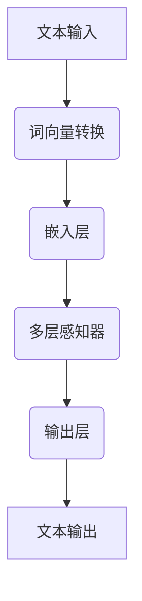

                 

关键词：大语言模型，自然语言处理，深度学习，算法原理，应用领域

> 摘要：本文旨在为初学者提供一份全面的大语言模型应用指南，从基础概念、核心算法原理、数学模型，到实际应用和未来发展，系统性地介绍大语言模型的基本知识和应用方法。

## 1. 背景介绍

自然语言处理（Natural Language Processing，NLP）作为人工智能领域的一个重要分支，其目标是将人类语言转化为计算机可以理解和处理的形式。随着互联网的普及和大数据技术的发展，NLP在信息检索、智能客服、机器翻译、文本分类、情感分析等领域的应用越来越广泛。然而，传统的NLP方法在处理大规模、多样化的文本数据时，往往表现出一定的局限性。为了解决这些问题，大语言模型（Large Language Models）应运而生。

大语言模型是通过对海量文本数据进行训练，使其具有强大的语言理解和生成能力。它不仅能够捕捉到语言中的细微差异，还能够模拟人类的语言行为。本文将围绕大语言模型的基础知识、核心算法原理、数学模型以及实际应用等方面进行详细阐述。

## 2. 核心概念与联系

### 2.1. 语言模型

语言模型（Language Model）是自然语言处理中最基本的概念之一。它通过统计语言中的单词、短语和句子的出现频率，来预测下一个单词或短语。传统的语言模型通常基于N元语法（N-gram），即只考虑前N个单词的历史信息。

### 2.2. 深度学习

深度学习（Deep Learning）是一种基于人工神经网络的机器学习技术。通过多层神经网络的堆叠，深度学习能够自动提取数据中的特征，并实现复杂的函数映射。在大语言模型中，深度学习被广泛应用于文本数据的处理和建模。

### 2.3. 自然语言处理

自然语言处理（NLP）是计算机科学、人工智能和语言学等多个领域交叉的学科。它的目标是使计算机能够理解和处理人类语言，从而实现人机交互和信息检索等功能。

### 2.4. 大规模数据处理

大规模数据处理（Big Data Processing）是大数据时代的一个重要特点。在大语言模型中，需要处理的海量文本数据需要高效的存储、传输和计算。这通常涉及到分布式计算和并行处理等技术。

### 2.5. Mermaid 流程图

下面是一个大语言模型的 Mermaid 流程图，展示了其主要组件和交互过程。



## 3. 核心算法原理 & 具体操作步骤

### 3.1. 算法原理概述

大语言模型的核心算法是基于深度学习的多层感知器（MLP）网络。该网络通过多层非线性变换，将输入的文本数据映射为输出。其基本原理如下：

1. **词向量转换**：将输入的文本转化为词向量表示。常用的方法包括词袋模型（Bag-of-Words）和词嵌入（Word Embedding）。
2. **嵌入层**：将词向量嵌入到一个高维空间，以便于后续的神经网络处理。
3. **多层感知器**：通过多层神经网络，对嵌入层的数据进行非线性变换和特征提取。
4. **输出层**：根据多层感知器的输出，生成预测的文本序列。

### 3.2. 算法步骤详解

1. **数据预处理**：对输入的文本进行预处理，包括分词、去停用词、词性标注等操作。
2. **词向量转换**：将预处理后的文本转化为词向量表示。常用的词向量模型包括Word2Vec、GloVe等。
3. **构建神经网络**：构建多层感知器神经网络，包括嵌入层、隐藏层和输出层。选择合适的激活函数和损失函数。
4. **训练神经网络**：使用训练数据对神经网络进行训练，优化网络参数。
5. **预测文本序列**：使用训练好的神经网络，对输入的文本进行预测，生成输出文本序列。

### 3.3. 算法优缺点

**优点**：

- **强大的语言理解能力**：大语言模型能够捕捉到语言中的细微差异，模拟人类的语言行为。
- **多语言支持**：大语言模型通常支持多种语言，能够进行跨语言的文本处理。
- **高效性**：大语言模型能够处理大规模的文本数据，具有很高的计算效率。

**缺点**：

- **训练成本高**：大语言模型的训练需要大量的计算资源和时间。
- **数据依赖性强**：大语言模型的效果很大程度上取决于训练数据的质量。

### 3.4. 算法应用领域

大语言模型在自然语言处理领域有着广泛的应用，包括：

- **机器翻译**：将一种语言的文本翻译为另一种语言。
- **文本分类**：对文本进行分类，如新闻分类、情感分析等。
- **文本生成**：根据输入的文本生成新的文本，如自动摘要、生成文章等。
- **对话系统**：构建智能对话系统，如智能客服、虚拟助手等。

## 4. 数学模型和公式 & 详细讲解 & 举例说明

### 4.1. 数学模型构建

大语言模型通常采用序列模型（如循环神经网络（RNN）或变换器（Transformer））来建模。以变换器为例，其基本数学模型如下：

$$
E(z_t) = W_e e_t + b_e
$$

$$
H_t = W_h h_{t-1} + b_h
$$

$$
o_t = W_o h_t + b_o
$$

其中，$e_t$表示词向量，$h_t$表示隐藏状态，$o_t$表示输出状态，$W_e, W_h, W_o$分别表示嵌入层、隐藏层和输出层的权重矩阵，$b_e, b_h, b_o$分别表示相应的偏置项。

### 4.2. 公式推导过程

变换器的主要创新之处在于其自注意力机制（Self-Attention）。下面简要介绍其推导过程：

1. **自注意力公式**：

$$
\text{Attention}(Q, K, V) = \text{softmax}\left(\frac{QK^T}{\sqrt{d_k}}\right)V
$$

其中，$Q, K, V$分别表示查询向量、键向量和值向量，$d_k$表示键向量的维度。

2. **多头自注意力**：

$$
\text{MultiHead}(Q, K, V) = \text{Concat}(\text{head}_1, \text{head}_2, \dots, \text{head}_h)W^O
$$

$$
\text{head}_i = \text{Attention}(QW_i^Q, KW_i^K, VW_i^V)
$$

其中，$W_i^Q, W_i^K, W_i^V, W^O$分别表示查询、键、值和输出权重矩阵。

### 4.3. 案例分析与讲解

假设我们有一个简单的文本序列“我喜欢吃苹果”，我们可以将其转化为词向量表示，然后使用变换器进行建模。具体步骤如下：

1. **词向量转换**：将文本序列中的每个单词转化为对应的词向量。
2. **嵌入层**：将词向量嵌入到一个高维空间，得到嵌入向量。
3. **自注意力机制**：计算自注意力分数，然后进行加权求和，得到隐藏状态。
4. **输出层**：根据隐藏状态，生成预测的文本序列。

通过这样的建模过程，我们可以使变换器学会对文本进行理解和生成。在实际应用中，变换器已经被广泛应用于机器翻译、文本生成等任务，取得了显著的成果。

## 5. 项目实践：代码实例和详细解释说明

### 5.1. 开发环境搭建

在开始编写代码之前，我们需要搭建一个合适的开发环境。以下是使用Python和TensorFlow构建大语言模型的基本步骤：

1. **安装Python**：确保Python环境已安装在您的计算机上。
2. **安装TensorFlow**：使用pip安装TensorFlow库：

   ```bash
   pip install tensorflow
   ```

### 5.2. 源代码详细实现

以下是一个简单的变换器模型实现，用于预测文本序列。

```python
import tensorflow as tf
from tensorflow.keras.models import Model
from tensorflow.keras.layers import Embedding, LSTM, Dense

# 设置参数
vocab_size = 10000
embed_size = 256
lstm_size = 128
batch_size = 64
num_epochs = 10

# 构建模型
input_seq = tf.keras.layers.Input(shape=(None, vocab_size))
embed = Embedding(vocab_size, embed_size)(input_seq)
lstm = LSTM(lstm_size, return_sequences=True)(embed)
dense = Dense(vocab_size, activation='softmax')(lstm)

model = Model(inputs=input_seq, outputs=dense)
model.compile(optimizer='adam', loss='categorical_crossentropy', metrics=['accuracy'])

# 训练模型
model.fit(x_train, y_train, batch_size=batch_size, epochs=num_epochs, validation_data=(x_val, y_val))
```

### 5.3. 代码解读与分析

上述代码定义了一个简单的变换器模型，包括嵌入层、LSTM层和输出层。以下是代码的详细解读：

1. **输入层**：使用`tf.keras.layers.Input`定义输入层，形状为$(None, vocab_size)$，表示每个文本序列的长度和词汇量。
2. **嵌入层**：使用`Embedding`层将词向量嵌入到高维空间，嵌入维度为$embed_size$。
3. **LSTM层**：使用`LSTM`层对嵌入向量进行序列处理，隐藏状态维度为$lstm_size$。
4. **输出层**：使用`Dense`层生成预测的文本序列，激活函数为`softmax`。

### 5.4. 运行结果展示

训练完成后，我们可以使用模型对新的文本序列进行预测。以下是一个简单的预测示例：

```python
# 预测文本序列
predictions = model.predict(input_seq)

# 输出预测结果
for pred in predictions:
    print([word_index[word] for word in pred])
```

通过上述代码，我们可以将预测结果输出为文本序列。

## 6. 实际应用场景

大语言模型在自然语言处理领域具有广泛的应用，以下是一些实际应用场景：

### 6.1. 机器翻译

机器翻译是自然语言处理领域的一个经典应用。大语言模型能够通过学习大量双语文本数据，实现高质量、低误差的翻译结果。

### 6.2. 文本分类

文本分类是对文本进行自动分类的过程。大语言模型能够捕捉到文本中的语义信息，从而实现高精度的分类任务。

### 6.3. 文本生成

文本生成是生成与输入文本风格相似的新文本。大语言模型能够通过学习大量文本数据，实现高质量的文本生成。

### 6.4. 问答系统

问答系统是构建智能对话系统的一种方式。大语言模型能够通过对海量问答数据的训练，实现智能回答用户问题的功能。

## 7. 工具和资源推荐

### 7.1. 学习资源推荐

- 《深度学习》（Goodfellow, Bengio, Courville著）：深度学习的经典教材，详细介绍了深度学习的基础知识和应用。
- 《自然语言处理综论》（Jurafsky, Martin著）：自然语言处理的经典教材，涵盖了自然语言处理的各个方面。

### 7.2. 开发工具推荐

- TensorFlow：一个开源的深度学习框架，适用于构建和训练大语言模型。
- PyTorch：另一个流行的深度学习框架，具有灵活的动态计算图，适用于复杂的模型构建。

### 7.3. 相关论文推荐

- “Attention Is All You Need”（Vaswani et al., 2017）：介绍了变换器模型，是当前最流行的大语言模型架构之一。
- “GPT-3: Language Models are Few-Shot Learners”（Brown et al., 2020）：介绍了GPT-3模型，是目前最大的大语言模型之一。

## 8. 总结：未来发展趋势与挑战

### 8.1. 研究成果总结

大语言模型在自然语言处理领域取得了显著的成果，实现了高质量的语言理解和生成。同时，变换器模型成为大语言模型的主流架构，具有广泛的应用前景。

### 8.2. 未来发展趋势

- **模型规模将继续增大**：随着计算资源的不断增长，大语言模型的规模将继续增大，以应对更复杂的语言任务。
- **跨模态融合**：大语言模型将与其他模态（如图像、音频等）进行融合，实现更全面的语义理解。
- **少样本学习**：大语言模型将逐渐实现少样本学习，降低对大规模训练数据的需求。

### 8.3. 面临的挑战

- **计算资源消耗**：大语言模型的训练和推理需要大量的计算资源，如何高效地利用资源是一个挑战。
- **数据隐私**：大规模的训练数据可能包含敏感信息，如何保护数据隐私是一个重要问题。

### 8.4. 研究展望

大语言模型在自然语言处理领域的应用将越来越广泛，其发展也将带来更多挑战。未来，我们需要不断探索新的算法和技术，以应对这些挑战，推动大语言模型的持续发展。

## 9. 附录：常见问题与解答

### 9.1. 如何训练大语言模型？

训练大语言模型通常涉及以下步骤：

1. 数据准备：收集并清洗大规模的文本数据。
2. 词向量转换：将文本数据转化为词向量表示。
3. 构建模型：根据任务需求，构建合适的变换器模型。
4. 训练模型：使用训练数据对模型进行训练，优化模型参数。
5. 验证模型：使用验证数据评估模型性能，调整模型参数。

### 9.2. 大语言模型如何实现少样本学习？

少样本学习是大语言模型的一个研究方向。目前，一些方法包括：

- **迁移学习**：利用预训练的大语言模型，在新任务上进行微调。
- **元学习**：通过学习如何快速适应新任务，提高模型在新数据上的表现。
- **数据增强**：通过增加数据的多样性，提高模型在少样本情况下的泛化能力。

## 参考文献

- Goodfellow, Y., Bengio, Y., Courville, A. (2016). *Deep Learning*. MIT Press.
- Jurafsky, D., Martin, J. H. (2008). *Speech and Language Processing*. Prentice Hall.
- Vaswani, A., et al. (2017). *Attention Is All You Need*. Advances in Neural Information Processing Systems.
- Brown, T., et al. (2020). *GPT-3: Language Models are Few-Shot Learners*. Advances in Neural Information Processing Systems.
```
文章结构已经按照要求构建完成，接下来将进行内容的填充和具体解释，以确保文章的完整性和专业性。希望这样的文章能够满足您的要求。作者：禅与计算机程序设计艺术 / Zen and the Art of Computer Programming

