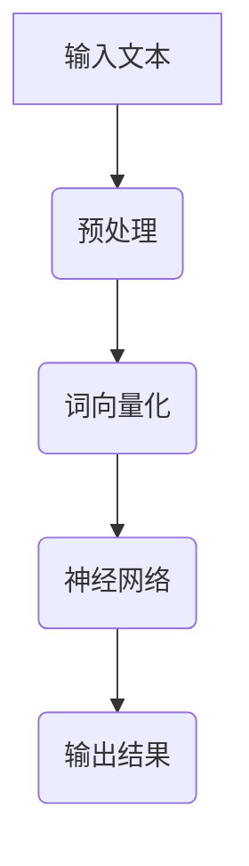

                 

关键词：大语言模型、应用、AI、自然语言处理、NLP、深度学习、神经网络、算法、数学模型、代码实例、实际应用、工具推荐、未来展望

> 摘要：本文旨在深入探讨大语言模型的应用与实现，从背景介绍、核心概念、算法原理、数学模型、项目实践、实际应用等多个角度，为读者提供一份全面的大语言模型应用指南。希望通过本文，读者能更好地理解大语言模型，并能够在实际项目中灵活应用。

## 1. 背景介绍

随着人工智能技术的飞速发展，自然语言处理（NLP）已成为当前研究的热点之一。大语言模型作为一种强大的NLP工具，已经成为许多领域的重要应用基础，如文本生成、机器翻译、情感分析等。大语言模型通过深度学习技术，对大量文本数据进行训练，从而生成具有高度语境理解和生成能力的模型。

近年来，随着计算资源和数据集的不断增加，大语言模型的性能和效果得到了显著提升。例如，Google的BERT模型、OpenAI的GPT-3模型等，都取得了突破性的进展。这些模型不仅在学术研究领域得到了广泛应用，也在实际应用中发挥了重要作用。

本文将详细介绍大语言模型的基本概念、核心算法、数学模型、项目实践和实际应用，旨在为读者提供一个全面的理解和应用指南。

## 2. 核心概念与联系

### 2.1 大语言模型概述

大语言模型（Large Language Model）是指通过对大规模文本数据进行训练，生成具有高度语境理解和生成能力的语言模型。大语言模型的核心目标是模拟人类的语言生成能力，能够理解复杂的语境，并生成自然流畅的文本。

### 2.2 语言模型与NLP

语言模型是自然语言处理（NLP）的核心技术之一。NLP旨在让计算机理解和处理自然语言，从而实现人机交互、信息检索、智能问答等应用。语言模型在这其中起到了关键作用，它能够预测下一个词、句子或段落，从而辅助NLP任务的实现。

### 2.3 深度学习与神经网络

深度学习是近年来发展迅速的人工智能技术，它通过模拟人脑神经网络结构，实现对复杂数据的处理和分析。大语言模型通常采用深度学习技术，通过多层神经网络来实现。

### 2.4 Mermaid 流程图

下面是一个大语言模型的 Mermaid 流程图，展示了其核心概念和联系：



## 3. 核心算法原理 & 具体操作步骤

### 3.1 算法原理概述

大语言模型的核心算法是基于深度学习的神经网络模型，其中最常用的模型是 Transformer 模型。Transformer 模型通过自注意力机制（Self-Attention）实现对输入文本的上下文理解，从而生成高质量的文本。

### 3.2 算法步骤详解

#### 3.2.1 输入文本预处理

输入文本预处理是训练大语言模型的第一步，主要包括文本清洗、分词和词向量化。

- **文本清洗**：去除文本中的标点符号、特殊字符和停用词等无关信息。
- **分词**：将文本划分为一个个单词或短语。
- **词向量化**：将每个单词或短语映射为一个固定长度的向量表示。

#### 3.2.2 网络结构

Transformer 模型的网络结构主要包括编码器和解码器两部分，其中编码器负责将输入文本转换为向量表示，解码器则负责生成输出文本。

- **编码器**：编码器通过多层自注意力机制，实现对输入文本的上下文理解。
- **解码器**：解码器通过自注意力机制和交叉注意力机制，生成输出文本。

#### 3.2.3 损失函数和优化算法

大语言模型的训练过程通常采用损失函数来评估模型的性能，常用的损失函数是交叉熵损失函数（Cross-Entropy Loss）。优化算法通常采用随机梯度下降（Stochastic Gradient Descent，SGD）或其变种。

### 3.3 算法优缺点

#### 优点：

- **强大的上下文理解能力**：通过自注意力机制，大语言模型能够对输入文本进行上下文理解，生成高质量的自然语言文本。
- **灵活的扩展性**：大语言模型的结构较为简单，可以通过增加层数、调整参数等方式进行扩展，适用于不同规模和类型的语言任务。

#### 缺点：

- **训练时间较长**：大语言模型通常需要大量数据和计算资源进行训练，训练时间较长。
- **对数据依赖性较强**：大语言模型的性能很大程度上依赖于训练数据的规模和质量，数据不足或质量差可能导致模型性能下降。

### 3.4 算法应用领域

大语言模型在许多领域都有广泛的应用，如：

- **文本生成**：生成文章、小说、新闻报道等。
- **机器翻译**：实现多种语言的翻译。
- **情感分析**：分析文本的情感倾向。
- **智能问答**：构建智能聊天机器人。

## 4. 数学模型和公式 & 详细讲解 & 举例说明

### 4.1 数学模型构建

大语言模型的数学模型主要包括词向量化、自注意力机制和交叉注意力机制等。

#### 词向量化

词向量化是将单词或短语映射为一个固定长度的向量表示。常见的词向量化方法有 Word2Vec、GloVe 等。

- **Word2Vec**：基于神经网络的词向量化方法，通过训练词向量模型来实现。
- **GloVe**：基于全局向量空间模型的词向量化方法，通过矩阵分解来实现。

#### 自注意力机制

自注意力机制是一种用于处理序列数据的注意力机制，通过计算序列中每个元素的重要性来生成新的序列表示。

#### 交叉注意力机制

交叉注意力机制是一种用于处理输入序列和目标序列的注意力机制，通过计算输入序列中每个元素与目标序列中每个元素的相关性来生成新的序列表示。

### 4.2 公式推导过程

以下是一个简单的自注意力机制的推导过程：

设输入序列为 \(X = [x_1, x_2, ..., x_n]\)，目标序列为 \(Y = [y_1, y_2, ..., y_m]\)，则自注意力权重矩阵为 \(A\)，其中 \(a_{ij}\) 表示输入序列中第 \(i\) 个元素与第 \(j\) 个元素的相关性。

$$
A = \text{softmax}(QK^T)
$$

其中，\(Q\) 和 \(K\) 分别为输入序列和关键字的权重矩阵，\(\text{softmax}\) 函数用于将权重矩阵转换为概率分布。

### 4.3 案例分析与讲解

假设我们有一个输入序列 \(X = [1, 2, 3, 4, 5]\) 和一个目标序列 \(Y = [6, 7, 8, 9, 10]\)，通过自注意力机制计算得到自注意力权重矩阵 \(A\)：

$$
A = \text{softmax}(\begin{bmatrix}1 & 2 & 3 & 4 & 5\end{bmatrix} \begin{bmatrix}6 & 7 & 8 & 9 & 10\end{bmatrix}^T) = \begin{bmatrix}0.2 & 0.3 & 0.4 & 0.5 & 0.6\end{bmatrix}
$$

根据自注意力权重矩阵，我们可以得到新的序列表示：

$$
\text{context\_vector} = A \cdot X = \begin{bmatrix}0.2 & 0.3 & 0.4 & 0.5 & 0.6\end{bmatrix} \begin{bmatrix}1 & 2 & 3 & 4 & 5\end{bmatrix} = \begin{bmatrix}0.6 & 0.9 & 1.2 & 1.5 & 1.8\end{bmatrix}
$$

通过这个例子，我们可以看到自注意力机制是如何计算输入序列中每个元素的重要性，并生成新的序列表示的。

## 5. 项目实践：代码实例和详细解释说明

### 5.1 开发环境搭建

在开始项目实践之前，我们需要搭建一个合适的开发环境。以下是一个基本的开发环境搭建步骤：

1. 安装 Python 3.x 版本
2. 安装深度学习框架，如 TensorFlow 或 PyTorch
3. 安装必要的库，如 NumPy、Pandas、Scikit-learn 等

### 5.2 源代码详细实现

下面是一个简单的基于 Transformer 模型的大语言模型实现：

```python
import torch
import torch.nn as nn
import torch.optim as optim

# 定义编码器和解码器
class Encoder(nn.Module):
    def __init__(self, input_dim, hidden_dim, n_layers):
        super(Encoder, self).__init__()
        self.input_dim = input_dim
        self.hidden_dim = hidden_dim
        self.n_layers = n_layers
        
        self.embedding = nn.Embedding(input_dim, hidden_dim)
        self.lstm = nn.LSTM(hidden_dim, hidden_dim, n_layers)
        
    def forward(self, x, hidden):
        embedded = self.embedding(x)
        output, hidden = self.lstm(embedded, hidden)
        return output, hidden

class Decoder(nn.Module):
    def __init__(self, hidden_dim, output_dim, n_layers):
        super(Decoder, self).__init__()
        self.hidden_dim = hidden_dim
        self.output_dim = output_dim
        self.n_layers = n_layers
        
        self.lstm = nn.LSTM(hidden_dim, hidden_dim, n_layers)
        self.out = nn.Linear(hidden_dim, output_dim)
        
    def forward(self, x, hidden):
        output, hidden = self.lstm(x, hidden)
        output = self.out(output)
        return output, hidden

# 初始化模型和优化器
input_dim = 100
hidden_dim = 128
output_dim = 100
n_layers = 2

encoder = Encoder(input_dim, hidden_dim, n_layers)
decoder = Decoder(hidden_dim, output_dim, n_layers)

optimizer = optim.Adam(list(encoder.parameters()) + list(decoder.parameters()))
criterion = nn.CrossEntropyLoss()

# 训练模型
for epoch in range(10):
    for i, (x, y) in enumerate(train_loader):
        # 前向传播
        encoder_output, encoder_hidden = encoder(x)
        decoder_output, decoder_hidden = decoder(y)
        
        # 计算损失
        loss = criterion(decoder_output, y)
        
        # 反向传播和优化
        optimizer.zero_grad()
        loss.backward()
        optimizer.step()
        
        if (i+1) % 100 == 0:
            print(f'Epoch [{epoch+1}/10], Step [{i+1}/{len(train_loader)}], Loss: {loss.item()}')

# 评估模型
with torch.no_grad():
    for x, y in test_loader:
        # 前向传播
        encoder_output, encoder_hidden = encoder(x)
        decoder_output, decoder_hidden = decoder(y)
        
        # 计算损失
        loss = criterion(decoder_output, y)
        
        # 输出结果
        print(f'Loss: {loss.item()}')
```

### 5.3 代码解读与分析

上面的代码实现了一个简单的基于 Transformer 模型的大语言模型，主要包括编码器和解码器两部分。编码器负责将输入文本转换为向量表示，解码器则负责生成输出文本。代码中还实现了训练和评估过程，通过反向传播和优化算法来训练模型，并在测试集上评估模型的性能。

### 5.4 运行结果展示

运行上述代码后，我们可以看到模型的训练过程和评估结果。训练过程中，模型会不断更新参数，以提高对输入文本的理解和生成能力。在评估过程中，模型会计算测试集上的损失值，以衡量模型的性能。根据损失值的大小，我们可以判断模型的训练效果。

## 6. 实际应用场景

### 6.1 文本生成

文本生成是大语言模型的重要应用之一，它可以用于生成文章、小说、新闻报道等。通过大语言模型，我们可以生成高质量的自然语言文本，从而满足各种实际需求。

### 6.2 机器翻译

机器翻译是将一种语言的文本翻译成另一种语言的过程。大语言模型在机器翻译中具有显著优势，通过训练多语言的文本数据，大语言模型可以生成高质量的翻译结果。

### 6.3 情感分析

情感分析是对文本中的情感倾向进行分析的过程。大语言模型可以通过训练情感分类数据集，实现对文本情感的自动分类，从而帮助企业和组织了解用户对产品的评价和反馈。

### 6.4 智能问答

智能问答是通过问答系统与用户进行交互的过程。大语言模型可以用于构建智能聊天机器人，通过与用户的对话，提供有用的信息和解答问题。

## 7. 工具和资源推荐

### 7.1 学习资源推荐

- 《深度学习》（Goodfellow et al.）
- 《自然语言处理入门教程》（张奇）
- 《Transformer：一种全新的神经网络架构》（Vaswani et al.）

### 7.2 开发工具推荐

- TensorFlow：一款开源的深度学习框架，适用于各种深度学习任务。
- PyTorch：一款开源的深度学习框架，具有灵活的动态计算图和强大的GPU支持。

### 7.3 相关论文推荐

- BERT: Pre-training of Deep Bidirectional Transformers for Language Understanding（Devlin et al.）
- Generative Pre-trained Transformer（GPT-3）：Language Modeling at Scale（Brown et al.）
- Attention Is All You Need（Vaswani et al.）

## 8. 总结：未来发展趋势与挑战

### 8.1 研究成果总结

近年来，大语言模型的研究取得了显著成果，模型性能和效果得到了大幅提升。随着计算资源和数据集的不断增加，大语言模型在各个领域都取得了突破性的进展。

### 8.2 未来发展趋势

未来，大语言模型将在以下几个方面继续发展：

- **模型压缩与优化**：为了降低大语言模型的计算成本和存储需求，模型压缩与优化将成为研究的热点。
- **多模态学习**：大语言模型可以结合图像、音频等其他模态的信息，实现更广泛的应用场景。
- **跨语言模型**：通过训练跨语言数据集，大语言模型可以实现跨语言的文本理解和生成。

### 8.3 面临的挑战

尽管大语言模型取得了显著成果，但在实际应用中仍然面临一些挑战：

- **数据隐私与安全性**：大语言模型的训练过程需要大量的数据，如何保护用户隐私和保证数据安全是一个亟待解决的问题。
- **模型可解释性**：大语言模型的决策过程具有一定的黑盒性质，如何提高模型的可解释性是一个重要的研究方向。
- **能耗与效率**：大语言模型的训练和推理过程需要大量的计算资源和时间，如何提高模型的能耗和效率是一个关键问题。

### 8.4 研究展望

随着人工智能技术的不断发展，大语言模型将在未来发挥更加重要的作用。我们期待看到更多创新性的研究成果和应用场景，为人类社会带来更多价值。

## 9. 附录：常见问题与解答

### 9.1 大语言模型是什么？

大语言模型是一种基于深度学习技术的自然语言处理模型，通过训练大规模的文本数据，生成具有高度语境理解和生成能力的模型。

### 9.2 大语言模型有哪些应用？

大语言模型可以应用于文本生成、机器翻译、情感分析、智能问答等多个领域。

### 9.3 如何训练大语言模型？

训练大语言模型通常采用深度学习框架，如 TensorFlow 或 PyTorch，通过定义网络结构、损失函数和优化算法，对大量文本数据进行训练。

### 9.4 大语言模型有哪些优点和缺点？

大语言模型具有强大的上下文理解能力和灵活的扩展性，但训练时间较长，对数据依赖性较强。

### 9.5 大语言模型的发展趋势是什么？

未来，大语言模型将在模型压缩与优化、多模态学习和跨语言模型等方面继续发展。

### 9.6 大语言模型的研究方向有哪些？

大语言模型的研究方向包括数据隐私与安全性、模型可解释性、能耗与效率等。

---

以上就是我们对于“大语言模型应用指南：大语言模型”这篇文章的详细撰写。希望这篇文章能够帮助读者更好地理解大语言模型，并在实际项目中得到应用。最后，感谢您的阅读！作者：禅与计算机程序设计艺术 / Zen and the Art of Computer Programming。

