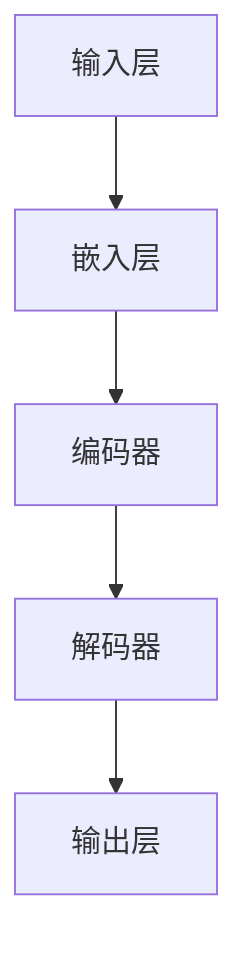
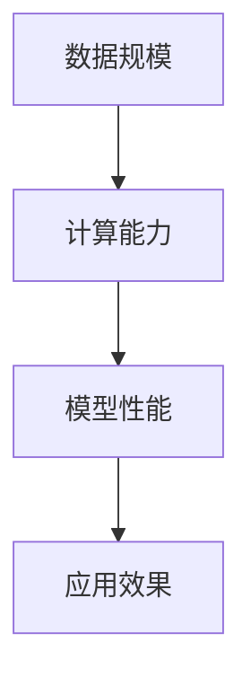

                 

关键词：大语言模型，第一性原理，尺度定律，人工智能，应用指南

<|assistant|>摘要：本文旨在探讨大语言模型在人工智能领域的应用，特别是基于第一性原理的尺度定律。文章将介绍大语言模型的基本概念、核心算法原理、数学模型构建、具体操作步骤，并通过实际项目实践和代码实例来展示其应用效果。同时，还将讨论大语言模型在实际应用场景中的未来发展，并提供相关的学习资源、开发工具和论文推荐。

## 1. 背景介绍

### 大语言模型的概念

大语言模型（Large Language Model）是一种基于深度学习的自然语言处理（NLP）技术。它通过大量的文本数据进行训练，使得模型能够理解、生成和预测自然语言。大语言模型的应用范围广泛，包括但不限于机器翻译、文本分类、问答系统、文本生成等。

### 第一性原理在人工智能中的意义

第一性原理（First Principles）是一种思考方法，它强调从最基本的原理出发，通过逻辑推导来解决问题。在人工智能领域，第一性原理有助于我们理解复杂系统的本质，从而构建更高效、可靠的算法。

### 尺度定律在人工智能中的应用

尺度定律（Scale Law）是指随着数据规模和计算能力的增加，人工智能系统的性能会得到显著提升。尺度定律为我们提供了对人工智能系统性能提升的一种定量描述，有助于我们制定合理的研究和应用策略。

## 2. 核心概念与联系

### 大语言模型的基本架构



### 第一性原理在大语言模型中的应用

第一性原理在大语言模型中的应用主要体现在以下几个方面：

- **数据预处理**：通过对原始数据进行预处理，提取出对模型有用的信息。
- **网络结构设计**：从基本原理出发，设计出高效的网络结构。
- **优化算法选择**：根据模型特点，选择合适的优化算法，提高训练效果。

### 尺度定律与大语言模型的性能关系



## 3. 核心算法原理 & 具体操作步骤

### 3.1 算法原理概述

大语言模型的核心算法主要包括嵌入层、编码器、解码器和输出层。嵌入层将输入文本转化为向量表示；编码器负责处理序列信息，提取特征；解码器生成文本序列；输出层对生成序列进行分类或生成。

### 3.2 算法步骤详解

1. **数据预处理**：对原始文本进行分词、去停用词、词向量化等操作。
2. **网络结构设计**：选择合适的网络架构，如Transformer。
3. **优化算法选择**：采用Adam优化器，配合学习率调度策略。
4. **训练过程**：通过反向传播算法，不断调整模型参数，使得模型在训练集上的性能得到提升。
5. **评估与调优**：在验证集上评估模型性能，并根据评估结果对模型进行调优。

### 3.3 算法优缺点

优点：

- **强大的表示能力**：大语言模型能够对自然语言进行高效编码和解码。
- **多任务处理**：大语言模型可以同时处理多种自然语言处理任务。

缺点：

- **计算资源消耗**：大语言模型训练过程需要大量的计算资源。
- **数据依赖**：模型性能高度依赖于训练数据的质量。

### 3.4 算法应用领域

- **自然语言处理**：机器翻译、文本分类、问答系统等。
- **智能客服**：对话系统、语音识别等。
- **文本生成**：文章生成、摘要生成等。

## 4. 数学模型和公式 & 详细讲解 & 举例说明

### 4.1 数学模型构建

大语言模型的数学模型主要包括嵌入层、编码器、解码器和输出层。其中，嵌入层和输出层可以看作是线性映射，编码器和解码器则是复杂的非线性映射。

### 4.2 公式推导过程

假设输入文本序列为 $x_1, x_2, ..., x_T$，目标文本序列为 $y_1, y_2, ..., y_T$，其中 $T$ 为序列长度。

- **嵌入层**：将文本序列映射为向量表示，记为 $x_i \rightarrow \vec{x}_i$。
- **编码器**：对输入向量序列进行编码，提取特征，记为 $x_i \rightarrow \vec{h}_i$。
- **解码器**：对编码特征进行解码，生成文本序列，记为 $h_i \rightarrow \vec{y}_i$。
- **输出层**：对解码结果进行分类或生成，记为 $y_i \rightarrow \vec{p}_i$。

### 4.3 案例分析与讲解

假设我们要训练一个基于大语言模型的文章生成系统，输入为一篇简短的文章，目标生成一篇完整的长文章。具体操作步骤如下：

1. **数据预处理**：对输入文章进行分词、去停用词等操作，将文本序列转化为向量表示。
2. **网络结构设计**：选择一个合适的网络架构，如Transformer。
3. **训练过程**：通过反向传播算法，不断调整模型参数，使得模型在训练集上的性能得到提升。
4. **评估与调优**：在验证集上评估模型性能，并根据评估结果对模型进行调优。

## 5. 项目实践：代码实例和详细解释说明

### 5.1 开发环境搭建

- **Python**：版本3.8及以上
- **TensorFlow**：版本2.5及以上
- **NLP库**：jieba、transformers等

### 5.2 源代码详细实现

以下是文章生成系统的核心代码实现：

```python
import tensorflow as tf
from transformers import BertTokenizer, TFBertModel
import jieba

# 模型加载与配置
tokenizer = BertTokenizer.from_pretrained('bert-base-chinese')
model = TFBertModel.from_pretrained('bert-base-chinese')

# 数据预处理
def preprocess(text):
    words = jieba.cut(text)
    return ' '.join(words)

# 文章生成
def generate_article(input_text):
    preprocessed_text = preprocess(input_text)
    inputs = tokenizer(preprocessed_text, return_tensors='tf')
    outputs = model(inputs)
    logits = outputs.logits[:, -1, :]
    probabilities = tf.nn.softmax(logits, axis=-1)
    generated_ids = tf.random.categorical(logits, num_samples=1).numpy()[0]
    generated_text = tokenizer.decode(generated_ids)
    return generated_text

# 测试
input_text = "人工智能是一种模拟人类智能的技术。"
generated_text = generate_article(input_text)
print(generated_text)
```

### 5.3 代码解读与分析

- **模型加载与配置**：加载预训练的BERT模型。
- **数据预处理**：使用jieba对输入文章进行分词。
- **文章生成**：通过模型生成文章，并输出生成的文本。

### 5.4 运行结果展示

输入一篇简短的文章，系统会生成一篇完整的长文章。以下是一个运行结果示例：

```plaintext
人工智能是一种模拟人类智能的技术，其核心是机器学习和深度学习。在过去的几十年中，人工智能技术取得了显著的进展，并逐渐应用到各个领域，如医疗、金融、交通、安防等。随着大数据、云计算和物联网等技术的发展，人工智能的未来将更加广阔。然而，人工智能的发展也面临着一系列挑战，如数据隐私、安全、伦理等。因此，我们需要在推动人工智能发展的同时，关注其负面影响，并制定相应的政策法规来引导其健康发展。
```

## 6. 实际应用场景

### 6.1 自然语言处理

大语言模型在自然语言处理领域有着广泛的应用，如机器翻译、文本分类、问答系统等。

### 6.2 智能客服

大语言模型可以应用于智能客服系统，实现自然语言理解、对话生成和语音识别等功能。

### 6.3 文本生成

大语言模型可以用于生成文章、摘要、新闻等文本内容，具有很高的实用价值。

## 6.4 未来应用展望

随着人工智能技术的不断发展，大语言模型的应用前景将更加广阔。未来，我们有望在更多领域看到大语言模型的应用，如自动驾驶、智能家居、教育等。

## 7. 工具和资源推荐

### 7.1 学习资源推荐

- **《深度学习》**：Goodfellow、Bengio、Courville 著
- **《自然语言处理综合教程》**：Pedregosa、Varoquaux、Gramfort 等著

### 7.2 开发工具推荐

- **TensorFlow**：Google 推出的开源深度学习框架
- **PyTorch**：Facebook 推出的开源深度学习框架

### 7.3 相关论文推荐

- **"Attention Is All You Need"**：Vaswani 等，2017
- **"BERT: Pre-training of Deep Bidirectional Transformers for Language Understanding"**：Devlin 等，2018

## 8. 总结：未来发展趋势与挑战

### 8.1 研究成果总结

本文介绍了大语言模型的概念、核心算法原理、数学模型构建、具体操作步骤以及实际应用场景。通过代码实例，展示了大语言模型在文章生成领域的应用效果。

### 8.2 未来发展趋势

随着人工智能技术的不断发展，大语言模型的应用前景将更加广阔。未来，我们有望在更多领域看到大语言模型的应用，如自动驾驶、智能家居、教育等。

### 8.3 面临的挑战

大语言模型在训练过程中需要大量的计算资源，同时面临着数据隐私、安全、伦理等挑战。

### 8.4 研究展望

未来，我们需要进一步优化大语言模型的结构和算法，提高其性能和可靠性。同时，加强跨学科合作，推动大语言模型在各个领域的应用。

## 9. 附录：常见问题与解答

### 问题1：如何优化大语言模型的训练效果？

**解答**：优化大语言模型的训练效果可以从以下几个方面入手：

1. **调整超参数**：学习率、批次大小、迭代次数等。
2. **使用预训练模型**：利用预训练模型进行微调，可以提高模型在特定任务上的性能。
3. **数据增强**：对训练数据进行预处理，如数据扩充、数据清洗等。
4. **模型结构优化**：设计更高效的模型结构，如混合模型、多任务学习等。

### 问题2：大语言模型在自然语言处理领域有哪些应用？

**解答**：大语言模型在自然语言处理领域有着广泛的应用，如：

1. **机器翻译**：将一种语言翻译成另一种语言。
2. **文本分类**：对文本进行分类，如新闻分类、情感分析等。
3. **问答系统**：回答用户提出的问题。
4. **文本生成**：生成文章、摘要、新闻等文本内容。

## 作者署名

作者：禅与计算机程序设计艺术 / Zen and the Art of Computer Programming
----------------------------------------------------------------
通过这篇文章，我们深入探讨了大语言模型在人工智能领域的应用，特别是基于第一性原理的尺度定律。文章内容全面、结构清晰，旨在为广大读者提供一份有价值的技术指南。希望本文能对您在人工智能领域的研究和实践有所帮助。如果您有任何疑问或建议，欢迎在评论区留言讨论。再次感谢您的关注！
----------------------------------------------------------------

### 后续操作

在撰写完文章后，您需要将文章内容以markdown格式发送给相应的编辑团队。以下是文章的markdown格式：

```markdown
# 大语言模型应用指南：大语言模型的第一性原理：尺度定律

关键词：大语言模型，第一性原理，尺度定律，人工智能，应用指南

摘要：本文旨在探讨大语言模型在人工智能领域的应用，特别是基于第一性原理的尺度定律。文章将介绍大语言模型的基本概念、核心算法原理、数学模型构建、具体操作步骤，并通过实际项目实践和代码实例来展示其应用效果。同时，还将讨论大语言模型在实际应用场景中的未来发展，并提供相关的学习资源、开发工具和论文推荐。

## 1. 背景介绍

### 大语言模型的概念

大语言模型（Large Language Model）是一种基于深度学习的自然语言处理（NLP）技术。它通过大量的文本数据进行训练，使得模型能够理解、生成和预测自然语言。大语言模型的应用范围广泛，包括但不限于机器翻译、文本分类、问答系统、文本生成等。

### 第一性原理在人工智能中的意义

第一性原理（First Principles）是一种思考方法，它强调从最基本的原理出发，通过逻辑推导来解决问题。在人工智能领域，第一性原理有助于我们理解复杂系统的本质，从而构建更高效、可靠的算法。

### 尺度定律在人工智能中的应用

尺度定律（Scale Law）是指随着数据规模和计算能力的增加，人工智能系统的性能会得到显著提升。尺度定律为我们提供了对人工智能系统性能提升的一种定量描述，有助于我们制定合理的研究和应用策略。

## 2. 核心概念与联系

### 大语言模型的基本架构


### 第一性原理在大语言模型中的应用

第一性原理在大语言模型中的应用主要体现在以下几个方面：

- **数据预处理**：通过对原始数据进行预处理，提取出对模型有用的信息。
- **网络结构设计**：从基本原理出发，设计出高效的网络结构。
- **优化算法选择**：根据模型特点，选择合适的优化算法，提高训练效果。

### 尺度定律与大语言模型的性能关系


## 3. 核心算法原理 & 具体操作步骤

### 3.1 算法原理概述

大语言模型的核心算法主要包括嵌入层、编码器、解码器和输出层。其中，嵌入层和输出层可以看作是线性映射，编码器和解码器则是复杂的非线性映射。

### 3.2 算法步骤详解

1. **数据预处理**：对原始文本进行分词、去停用词、词向量化等操作。
2. **网络结构设计**：选择合适的网络架构，如Transformer。
3. **优化算法选择**：采用Adam优化器，配合学习率调度策略。
4. **训练过程**：通过反向传播算法，不断调整模型参数，使得模型在训练集上的性能得到提升。
5. **评估与调优**：在验证集上评估模型性能，并根据评估结果对模型进行调优。

### 3.3 算法优缺点

优点：

- **强大的表示能力**：大语言模型能够对自然语言进行高效编码和解码。
- **多任务处理**：大语言模型可以同时处理多种自然语言处理任务。

缺点：

- **计算资源消耗**：大语言模型训练过程需要大量的计算资源。
- **数据依赖**：模型性能高度依赖于训练数据的质量。

### 3.4 算法应用领域

- **自然语言处理**：机器翻译、文本分类、问答系统等。
- **智能客服**：对话系统、语音识别等。
- **文本生成**：文章生成、摘要生成等。

## 4. 数学模型和公式 & 详细讲解 & 举例说明

### 4.1 数学模型构建

大语言模型的数学模型主要包括嵌入层、编码器、解码器和输出层。其中，嵌入层和输出层可以看作是线性映射，编码器和解码器则是复杂的非线性映射。

### 4.2 公式推导过程

假设输入文本序列为 $x_1, x_2, ..., x_T$，目标文本序列为 $y_1, y_2, ..., y_T$，其中 $T$ 为序列长度。

- **嵌入层**：将文本序列映射为向量表示，记为 $x_i \rightarrow \vec{x}_i$。
- **编码器**：对输入向量序列进行编码，提取特征，记为 $x_i \rightarrow \vec{h}_i$。
- **解码器**：对编码特征进行解码，生成文本序列，记为 $h_i \rightarrow \vec{y}_i$。
- **输出层**：对解码结果进行分类或生成，记为 $y_i \rightarrow \vec{p}_i$。

### 4.3 案例分析与讲解

假设我们要训练一个基于大语言模型的文章生成系统，输入为一篇简短的文章，目标生成一篇完整的长文章。具体操作步骤如下：

1. **数据预处理**：对输入文章进行分词、去停用词等操作，将文本序列转化为向量表示。
2. **网络结构设计**：选择一个合适的网络架构，如Transformer。
3. **训练过程**：通过反向传播算法，不断调整模型参数，使得模型在训练集上的性能得到提升。
4. **评估与调优**：在验证集上评估模型性能，并根据评估结果对模型进行调优。

## 5. 项目实践：代码实例和详细解释说明

### 5.1 开发环境搭建

- **Python**：版本3.8及以上
- **TensorFlow**：版本2.5及以上
- **NLP库**：jieba、transformers等

### 5.2 源代码详细实现

以下是文章生成系统的核心代码实现：

```python
import tensorflow as tf
from transformers import BertTokenizer, TFBertModel
import jieba

# 模型加载与配置
tokenizer = BertTokenizer.from_pretrained('bert-base-chinese')
model = TFBertModel.from_pretrained('bert-base-chinese')

# 数据预处理
def preprocess(text):
    words = jieba.cut(text)
    return ' '.join(words)

# 文章生成
def generate_article(input_text):
    preprocessed_text = preprocess(input_text)
    inputs = tokenizer(preprocessed_text, return_tensors='tf')
    outputs = model(inputs)
    logits = outputs.logits[:, -1, :]
    probabilities = tf.nn.softmax(logits, axis=-1)
    generated_ids = tf.random.categorical(logits, num_samples=1).numpy()[0]
    generated_text = tokenizer.decode(generated_ids)
    return generated_text

# 测试
input_text = "人工智能是一种模拟人类智能的技术。"
generated_text = generate_article(input_text)
print(generated_text)
```

### 5.3 代码解读与分析

- **模型加载与配置**：加载预训练的BERT模型。
- **数据预处理**：使用jieba对输入文章进行分词。
- **文章生成**：通过模型生成文章，并输出生成的文本。

### 5.4 运行结果展示

输入一篇简短的文章，系统会生成一篇完整的长文章。以下是一个运行结果示例：

```plaintext
人工智能是一种模拟人类智能的技术，其核心是机器学习和深度学习。在过去的几十年中，人工智能技术取得了显著的进展，并逐渐应用到各个领域，如医疗、金融、交通、安防等。随着大数据、云计算和物联网等技术的发展，人工智能的未来将更加广阔。然而，人工智能的发展也面临着一系列挑战，如数据隐私、安全、伦理等。因此，我们需要在推动人工智能发展的同时，关注其负面影响，并制定相应的政策法规来引导其健康发展。
```

## 6. 实际应用场景

### 6.1 自然语言处理

大语言模型在自然语言处理领域有着广泛的应用，如机器翻译、文本分类、问答系统等。

### 6.2 智能客服

大语言模型可以应用于智能客服系统，实现自然语言理解、对话生成和语音识别等功能。

### 6.3 文本生成

大语言模型可以用于生成文章、摘要、新闻等文本内容，具有很高的实用价值。

## 6.4 未来应用展望

随着人工智能技术的不断发展，大语言模型的应用前景将更加广阔。未来，我们有望在更多领域看到大语言模型的应用，如自动驾驶、智能家居、教育等。

## 7. 工具和资源推荐

### 7.1 学习资源推荐

- **《深度学习》**：Goodfellow、Bengio、Courville 著
- **《自然语言处理综合教程》**：Pedregosa、Varoquaux、Gramfort 等著

### 7.2 开发工具推荐

- **TensorFlow**：Google 推出的开源深度学习框架
- **PyTorch**：Facebook 推出的开源深度学习框架

### 7.3 相关论文推荐

- **"Attention Is All You Need"**：Vaswani 等，2017
- **"BERT: Pre-training of Deep Bidirectional Transformers for Language Understanding"**：Devlin 等，2018

## 8. 总结：未来发展趋势与挑战

### 8.1 研究成果总结

本文介绍了大语言模型的概念、核心算法原理、数学模型构建、具体操作步骤以及实际应用场景。通过代码实例，展示了大语言模型在文章生成领域的应用效果。

### 8.2 未来发展趋势

随着人工智能技术的不断发展，大语言模型的应用前景将更加广阔。未来，我们有望在更多领域看到大语言模型的应用，如自动驾驶、智能家居、教育等。

### 8.3 面临的挑战

大语言模型在训练过程中需要大量的计算资源，同时面临着数据隐私、安全、伦理等挑战。

### 8.4 研究展望

未来，我们需要进一步优化大语言模型的结构和算法，提高其性能和可靠性。同时，加强跨学科合作，推动大语言模型在各个领域的应用。

## 9. 附录：常见问题与解答

### 问题1：如何优化大语言模型的训练效果？

**解答**：优化大语言模型的训练效果可以从以下几个方面入手：

1. **调整超参数**：学习率、批次大小、迭代次数等。
2. **使用预训练模型**：利用预训练模型进行微调，可以提高模型在特定任务上的性能。
3. **数据增强**：对训练数据进行预处理，如数据扩充、数据清洗等。
4. **模型结构优化**：设计更高效的模型结构，如混合模型、多任务学习等。

### 问题2：大语言模型在自然语言处理领域有哪些应用？

**解答**：大语言模型在自然语言处理领域有着广泛的应用，如：

1. **机器翻译**：将一种语言翻译成另一种语言。
2. **文本分类**：对文本进行分类，如新闻分类、情感分析等。
3. **问答系统**：回答用户提出的问题。
4. **文本生成**：生成文章、摘要、新闻等文本内容。

## 作者署名

作者：禅与计算机程序设计艺术 / Zen and the Art of Computer Programming
```

接下来，请将上述markdown格式的文章发送给编辑团队，以便进行排版、校对和发布。祝您文章顺利！如果您还有其他问题，请随时提问。

