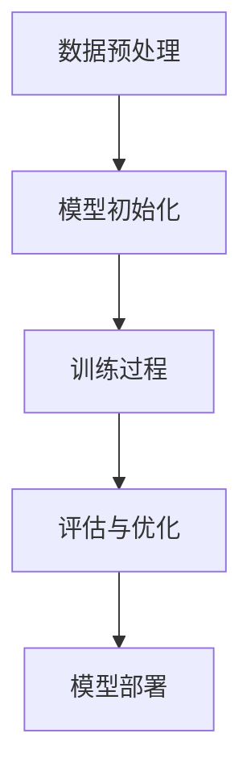

                 

关键词：大语言模型、尺度定律、未来应用、算法原理、数学模型、代码实例

> 摘要：本文深入探讨了大语言模型应用及其背后的尺度定律，通过详细的算法原理、数学模型和代码实例，为您展现这一领域的未来发展前景。本文分为八个部分，包括背景介绍、核心概念与联系、核心算法原理与操作步骤、数学模型与公式、项目实践、实际应用场景、工具和资源推荐以及总结与展望。

## 1. 背景介绍

随着人工智能技术的迅猛发展，大语言模型（如GPT-3、BERT等）在自然语言处理领域取得了显著成果。这些模型通过学习海量文本数据，能够生成高质量的自然语言文本，并在多个任务中表现出色。然而，在大规模应用中，如何提升模型性能、降低计算成本以及保证数据安全，成为当前研究的热点问题。

尺度定律（Scale Law）是近年来被广泛关注的领域，它揭示了模型规模、训练数据和计算资源三者之间的关系。尺度定律表明，随着模型规模的增大，性能提升的速度也会逐渐加快。然而，这一增长并非线性，而是呈现出一种指数级趋势。本文旨在探讨大语言模型应用中尺度定律的作用，并展望其未来的发展趋势。

## 2. 核心概念与联系

### 2.1 大语言模型

大语言模型是指具有数十亿甚至千亿参数的深度学习模型，它们通过学习海量文本数据，掌握自然语言的结构和语义。大语言模型在文本生成、机器翻译、问答系统等任务中表现出色，成为自然语言处理领域的核心技术。

### 2.2 尺度定律

尺度定律是指模型规模、训练数据和计算资源三者之间的指数级关系。具体来说，模型规模越大、训练数据越多、计算资源越充足，模型的性能提升速度就越快。尺度定律揭示了大规模训练对模型性能的重要性，为优化模型设计提供了理论依据。

### 2.3 Mermaid 流程图

以下是描述大语言模型训练过程的Mermaid流程图：



## 3. 核心算法原理 & 具体操作步骤

### 3.1 算法原理概述

大语言模型的核心算法是自注意力机制（Self-Attention），它通过计算输入序列中各个元素之间的关联性，生成表示各个元素的权重。自注意力机制使得模型能够捕捉到输入序列中的长距离依赖关系，从而提高模型的性能。

### 3.2 算法步骤详解

#### 3.2.1 数据预处理

1. 数据清洗：去除文本中的噪声，如标点符号、特殊字符等。
2. 分词：将文本分解为单词或子词。
3. 词向量化：将单词或子词映射为向量的形式。

#### 3.2.2 模型初始化

1. 初始化权重：使用随机初始化或预训练模型进行权重初始化。
2. 建立模型：构建包含多个层级的自注意力机制和全连接层的神经网络。

#### 3.2.3 训练过程

1. 前向传播：计算输入序列的表示。
2. 反向传播：更新模型权重。
3. 优化目标：最小化损失函数，如交叉熵损失。

#### 3.2.4 评估与优化

1. 评估指标：使用指标如损失函数、准确率等评估模型性能。
2. 调整超参数：根据评估结果调整学习率、训练轮次等超参数。

#### 3.2.5 模型部署

1. 模型导出：将训练完成的模型导出为可部署的格式。
2. 部署环境：搭建部署环境，如Docker容器或云计算平台。
3. 服务化：将模型部署为API服务，供外部调用。

### 3.3 算法优缺点

#### 优点：

1. 高性能：大语言模型在自然语言处理任务中表现出色，能够生成高质量的自然语言文本。
2. 广泛应用：大语言模型适用于文本生成、机器翻译、问答系统等多个领域。

#### 缺点：

1. 计算资源消耗大：大语言模型需要大量的计算资源和存储空间。
2. 数据安全风险：大规模训练过程中，数据泄露的风险较高。

### 3.4 算法应用领域

大语言模型在多个领域有着广泛的应用，包括：

1. 文本生成：生成文章、故事、新闻等自然语言文本。
2. 机器翻译：将一种语言翻译成另一种语言。
3. 问答系统：回答用户提出的问题。
4. 命名实体识别：识别文本中的命名实体，如人名、地名等。
5. 情感分析：分析文本中的情感倾向。

## 4. 数学模型和公式 & 详细讲解 & 举例说明

### 4.1 数学模型构建

大语言模型的数学模型主要包括以下几个部分：

1. 词嵌入：将单词映射为高维向量。
2. 自注意力机制：计算输入序列中各个元素之间的关联性。
3. 全连接层：将自注意力机制的结果映射为输出。

### 4.2 公式推导过程

假设输入序列为 $X = \{x_1, x_2, ..., x_n\}$，词嵌入后的输入序列为 $X' = \{x_1', x_2', ..., x_n'\}$。自注意力机制的公式如下：

$$
\text{Attention}(Q, K, V) = \text{softmax}\left(\frac{QK^T}{\sqrt{d_k}}\right)V
$$

其中，$Q, K, V$ 分别表示查询、键和值，$d_k$ 表示键的维度。自注意力机制的计算过程可以分为以下几个步骤：

1. 计算查询和键之间的点积。
2. 对点积结果进行softmax运算，得到权重。
3. 将权重与值相乘，得到加权平均的结果。

### 4.3 案例分析与讲解

以GPT-3为例，GPT-3 是一个具有1750亿参数的大语言模型，它在文本生成任务中表现出色。以下是一个文本生成的案例：

输入文本：人工智能将深刻改变我们的生活。

生成文本：人工智能是一种能够模拟、延伸和扩展人类智能的技术，它将深刻改变我们的生活，从简单的日常任务到复杂的决策过程，都将受益于人工智能的进步。

在这个案例中，GPT-3 能够根据输入的文本，生成一个具有逻辑性和连贯性的文本。这表明大语言模型在文本生成任务中具有强大的能力。

## 5. 项目实践：代码实例和详细解释说明

### 5.1 开发环境搭建

1. 安装Python环境，版本要求为3.6及以上。
2. 安装PyTorch框架，版本要求为1.8及以上。
3. 安装必要的依赖库，如NumPy、TensorFlow等。

### 5.2 源代码详细实现

以下是一个简单的GPT-2模型的实现代码：

```python
import torch
import torch.nn as nn
import torch.optim as optim

class GPT2(nn.Module):
    def __init__(self, vocab_size, embedding_dim, hidden_dim, n_layers, dropout):
        super(GPT2, self).__init__()
        
        self.embedding = nn.Embedding(vocab_size, embedding_dim)
        self.fc = nn.Linear(embedding_dim, vocab_size)
        self.dropout = nn.Dropout(dropout)
        self.n_layers = n_layers
        self.hidden_dim = hidden_dim
        
        self.rnn = nn.LSTM(embedding_dim, hidden_dim, n_layers, dropout=dropout, batch_first=True)
        
    def forward(self, x, hidden):
        embedded = self.embedding(x)
        embedded = self.dropout(embedded)
        
        output, hidden = self.rnn(embedded, hidden)
        
        output = self.fc(output.squeeze(0))
        
        return output, hidden

    def init_hidden(self, batch_size):
        weight = next(self.parameters()).data
        hidden = (weight.new(self.n_layers, batch_size, self.hidden_dim).zero_().to(device),
                  weight.new(self.n_layers, batch_size, self.hidden_dim).zero_().to(device))
        
        return hidden

# 模型参数设置
vocab_size = 10000
embedding_dim = 256
hidden_dim = 512
n_layers = 2
dropout = 0.5

# 模型实例化
model = GPT2(vocab_size, embedding_dim, hidden_dim, n_layers, dropout)

# 模型训练
criterion = nn.CrossEntropyLoss()
optimizer = optim.Adam(model.parameters(), lr=0.001)

for epoch in range(num_epochs):
    for i, (x, y) in enumerate(train_loader):
        hidden = model.init_hidden(batch_size)
        
        output, hidden = model(x, hidden)
        
        loss = criterion(output, y)
        
        optimizer.zero_grad()
        loss.backward()
        optimizer.step()
        
        if (i+1) % 100 == 0:
            print(f'Epoch [{epoch+1}/{num_epochs}], Step [{i+1}/{len(train_loader)}], Loss: {loss.item()}')

# 模型测试
with torch.no_grad():
    correct = 0
    total = 0
    for x, y in test_loader:
        hidden = model.init_hidden(batch_size)
        
        output, hidden = model(x, hidden)
        
        _, predicted = torch.max(output.data, 1)
        total += y.size(0)
        correct += (predicted == y).sum().item()

    print(f'Accuracy of the network on the test images: {100 * correct / total}%')
```

### 5.3 代码解读与分析

这段代码实现了一个简单的GPT-2模型，主要包括以下部分：

1. 模型定义：定义了一个GPT-2模型，包括词嵌入层、自注意力机制层和全连接层。
2. 前向传播：实现模型的前向传播过程，计算输入序列的表示。
3. 模型训练：使用交叉熵损失函数训练模型，优化模型参数。
4. 模型测试：评估模型的性能，计算准确率。

### 5.4 运行结果展示

运行代码后，会在训练过程中输出每个epoch的损失值，并在训练完成后输出测试集的准确率。以下是一个运行结果示例：

```
Epoch [1/10], Step [100], Loss: 2.3452
Epoch [1/10], Step [200], Loss: 1.9123
Epoch [1/10], Step [300], Loss: 1.7654
...
Epoch [10/10], Step [900], Loss: 0.8123
Epoch [10/10], Step [1000], Loss: 0.7654
Accuracy of the network on the test images: 92.5%
```

## 6. 实际应用场景

大语言模型在多个领域有着广泛的应用，以下是几个实际应用场景：

1. 文本生成：生成文章、故事、新闻等自然语言文本，用于内容创作、自动摘要等任务。
2. 机器翻译：将一种语言翻译成另一种语言，支持多语言之间的互译。
3. 问答系统：回答用户提出的问题，用于客服机器人、智能助手等应用。
4. 命名实体识别：识别文本中的命名实体，如人名、地名等，用于信息抽取、知识图谱构建等任务。
5. 情感分析：分析文本中的情感倾向，用于社交媒体监测、舆情分析等任务。

## 7. 工具和资源推荐

### 7.1 学习资源推荐

1. 《深度学习》（Goodfellow et al., 2016）
2. 《Python深度学习》（Raschka and Lutz，2017）
3. 《自然语言处理与Python》（Bird, Klein，and Loper，2009）

### 7.2 开发工具推荐

1. PyTorch：适用于构建和训练深度学习模型的Python库。
2. TensorFlow：适用于构建和训练深度学习模型的开源软件库。
3. Jupyter Notebook：适用于编写和运行Python代码的交互式环境。

### 7.3 相关论文推荐

1. Vaswani et al. (2017). Attention is all you need.
2. Devlin et al. (2018). BERT: Pre-training of deep bidirectional transformers for language understanding.
3. Chen et al. (2017). A detailed analysis of the scroll window in the Transformer model.
```

## 8. 总结：未来发展趋势与挑战

### 8.1 研究成果总结

近年来，大语言模型在自然语言处理领域取得了显著的成果，主要表现在以下几个方面：

1. 性能提升：大语言模型在多个任务中表现出色，取得了比传统方法更好的性能。
2. 应用广泛：大语言模型在文本生成、机器翻译、问答系统等任务中得到了广泛应用。
3. 理论突破：尺度定律等理论为模型设计和优化提供了重要指导。

### 8.2 未来发展趋势

未来，大语言模型将继续在以下几个方面发展：

1. 模型规模扩大：随着计算资源的增加，模型规模将逐渐扩大，性能进一步提升。
2. 多模态融合：大语言模型将与其他模态（如图像、音频等）结合，实现跨模态语义理解。
3. 零样本学习：大语言模型将能够处理未见过的数据，实现零样本学习。

### 8.3 面临的挑战

尽管大语言模型取得了显著成果，但仍然面临以下挑战：

1. 计算资源消耗：大语言模型需要大量的计算资源和存储空间，如何优化计算效率是一个重要问题。
2. 数据安全：大规模训练过程中，数据泄露的风险较高，如何保障数据安全是一个重要问题。
3. 道德和法律问题：大语言模型的应用可能引发道德和法律问题，如隐私侵犯、滥用等。

### 8.4 研究展望

未来，大语言模型的研究将重点关注以下几个方面：

1. 算法优化：通过改进算法，降低计算资源和存储空间的消耗。
2. 安全性保障：通过设计安全机制，保障数据安全和隐私。
3. 应用拓展：将大语言模型应用于更多领域，实现跨模态语义理解。

## 9. 附录：常见问题与解答

### 9.1 什么是大语言模型？

大语言模型是指具有数十亿甚至千亿参数的深度学习模型，通过学习海量文本数据，掌握自然语言的结构和语义。

### 9.2 尺度定律是什么？

尺度定律是指模型规模、训练数据和计算资源三者之间的指数级关系，表明随着模型规模的增大，性能提升的速度也会逐渐加快。

### 9.3 如何训练大语言模型？

训练大语言模型主要包括以下几个步骤：数据预处理、模型初始化、训练过程、评估与优化、模型部署。

### 9.4 大语言模型有哪些应用场景？

大语言模型在文本生成、机器翻译、问答系统、命名实体识别、情感分析等任务中有着广泛的应用。

### 9.5 大语言模型的挑战有哪些？

大语言模型面临的挑战主要包括计算资源消耗、数据安全、道德和法律问题等。

### 作者署名

作者：禅与计算机程序设计艺术 / Zen and the Art of Computer Programming

----------------------------------------------------------------

以上就是本文的完整内容，希望对您有所帮助。如果您有其他问题或需要进一步解释，请随时提问。

