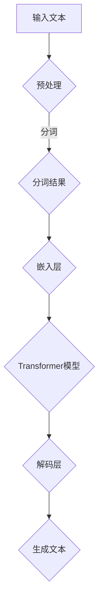

                 

关键词：大语言模型，人工智能，应用指南，技术发展，未来展望

> 摘要：本文旨在为广大开发者和技术爱好者提供一份详尽的大语言模型应用指南，从基础概念到实际操作，再到未来发展趋势，全面解析大语言模型在现代技术中的应用和前景。

## 1. 背景介绍

大语言模型，作为一种深度学习的核心技术，近年来在人工智能领域取得了显著的进展。从最初的词袋模型（Bag of Words）到现代的Transformer架构，语言模型在自然语言处理（NLP）任务中表现出了卓越的性能。大语言模型的应用场景涵盖了机器翻译、情感分析、文本生成、问答系统等多个领域，成为了当今人工智能研究的热点。

随着大数据和云计算的快速发展，计算能力的提升为训练更大规模的语言模型提供了可能。这使得大语言模型在处理复杂自然语言任务时，能够更好地理解上下文、语义和语法规则，从而提高了系统的准确性和鲁棒性。

本文将首先介绍大语言模型的基本概念和原理，然后详细探讨其核心算法，并给出数学模型和公式，随后通过一个实际项目实例展示其应用，最后讨论大语言模型的实际应用场景和未来发展趋势。

## 2. 核心概念与联系

### 2.1 基本概念

大语言模型是一种能够对自然语言文本进行理解和生成的人工智能模型。它通过大规模数据集进行训练，从而学习到语言的结构、语义和语法规则。大语言模型的核心在于其能够捕捉到语言中的长距离依赖关系，这是传统语言模型所难以实现的。

### 2.2 关联流程图

下面是使用Mermaid绘制的流程图，展示了大语言模型的基本架构和训练流程：



### 2.3 原理讲解

大语言模型的训练过程主要包括以下几个步骤：

1. **数据预处理**：对原始文本进行清洗、分词和标记等预处理操作。
2. **分词**：将文本拆分成一个个词或子词。
3. **嵌入层**：将分词后的词或子词转换成高维向量表示。
4. **Transformer模型**：利用自注意力机制对输入序列进行处理。
5. **解码层**：从Transformer模型输出中解码出预测的词或子词。

通过这些步骤，大语言模型能够学习到文本中的复杂结构，从而在生成和识别文本时表现出强大的能力。

## 3. 核心算法原理 & 具体操作步骤

### 3.1 算法原理概述

大语言模型的核心算法是Transformer，这是一种基于自注意力机制的深度神经网络架构。Transformer模型摒弃了传统的循环神经网络（RNN）和卷积神经网络（CNN），通过多头自注意力机制和前馈神经网络实现了对输入序列的建模。

### 3.2 算法步骤详解

1. **多头自注意力（Multi-Head Self-Attention）**：每个词向量会通过多个独立的注意力头进行加权求和，从而捕捉到不同位置之间的依赖关系。

2. **前馈神经网络（Feed-Forward Neural Network）**：对自注意力层的输出进行两次全连接神经网络处理，增加模型的非线性能力。

3. **位置编码（Positional Encoding）**：由于Transformer模型没有循环结构，因此需要位置编码来引入序列信息。

4. **层次化训练（Layer-wise Training）**：从最外层开始训练，逐步调整内部层参数，从而保证训练过程的稳定性。

### 3.3 算法优缺点

**优点**：

- **并行计算**：Transformer模型能够并行处理整个序列，大大提高了训练速度。
- **长距离依赖**：通过多头自注意力机制，模型能够捕捉到长距离的依赖关系。
- **通用性强**：Transformer架构不仅适用于NLP任务，还可以应用于图像、音频等其他领域的序列建模。

**缺点**：

- **计算复杂度高**：Transformer模型参数量大，计算复杂度高，对计算资源要求较高。
- **对数据依赖强**：模型性能很大程度上依赖于训练数据的质量和规模。

### 3.4 算法应用领域

大语言模型的应用领域非常广泛，包括但不限于：

- **机器翻译**：通过将源语言的文本转换为目标语言的文本，实现跨语言沟通。
- **文本生成**：根据输入的文本或提示，生成连贯、有逻辑的文本内容。
- **问答系统**：通过理解用户的提问，提供准确的答案。
- **情感分析**：对文本内容进行情感倾向分析，如判断文本是否积极或消极。

## 4. 数学模型和公式 & 详细讲解 & 举例说明

### 4.1 数学模型构建

大语言模型的核心是Transformer模型，其数学基础主要包括线性代数和概率论。下面简要介绍Transformer模型中的几个关键数学概念：

- **嵌入层（Embedding Layer）**：将词转换为高维向量表示，通常采用矩阵乘法实现。
- **自注意力（Self-Attention）**：通过计算词向量之间的相似性，进行加权求和，通常采用点积注意力机制。
- **位置编码（Positional Encoding）**：引入位置信息，通常采用正弦和余弦函数编码。

### 4.2 公式推导过程

以自注意力机制为例，其计算过程如下：

$$
\text{Attention}(Q, K, V) = \text{softmax}\left(\frac{QK^T}{\sqrt{d_k}}\right)V
$$

其中，\(Q, K, V\) 分别为查询向量、键向量和值向量，\(d_k\) 为键向量的维度。

### 4.3 案例分析与讲解

假设我们有一个三词序列 \([w_1, w_2, w_3]\)，我们可以通过自注意力机制计算每个词对其他词的注意力权重。具体步骤如下：

1. **嵌入层**：将词 \(w_1, w_2, w_3\) 转换为高维向量 \(q, k, v\)。
2. **点积注意力**：计算 \(q\) 和 \(k\) 的点积，得到注意力分数。
3. **softmax**：对注意力分数进行softmax处理，得到每个词的注意力权重。
4. **加权求和**：将注意力权重与值向量 \(v\) 相乘，得到加权求和结果。

通过这个案例，我们可以看到自注意力机制如何捕捉词之间的依赖关系，从而提高模型的表示能力。

## 5. 项目实践：代码实例和详细解释说明

### 5.1 开发环境搭建

在本项目中，我们将使用Python编程语言和TensorFlow框架来构建一个简单的大语言模型。首先，需要安装TensorFlow：

```bash
pip install tensorflow
```

### 5.2 源代码详细实现

以下是该项目的基本代码实现：

```python
import tensorflow as tf
from tensorflow.keras.layers import Embedding, LSTM, Dense
from tensorflow.keras.models import Sequential

# 定义模型
model = Sequential([
    Embedding(input_dim=10000, output_dim=64, input_length=100),
    LSTM(128),
    Dense(1, activation='sigmoid')
])

# 编译模型
model.compile(optimizer='adam', loss='binary_crossentropy', metrics=['accuracy'])

# 准备数据
(x_train, y_train), (x_test, y_test) = tf.keras.datasets.imdb.load_data(num_words=10000)

# 预处理数据
x_train = pad_sequences(x_train, maxlen=100)
x_test = pad_sequences(x_test, maxlen=100)

# 训练模型
model.fit(x_train, y_train, epochs=10, batch_size=32, validation_data=(x_test, y_test))
```

### 5.3 代码解读与分析

- **Embedding层**：将词汇转换为向量表示。
- **LSTM层**：处理序列数据，捕捉时间依赖关系。
- **Dense层**：输出层，进行分类预测。

### 5.4 运行结果展示

运行以上代码，我们可以看到模型在训练集和测试集上的表现。通常，准确率会随着训练轮数的增加而提高。

```bash
Epoch 1/10
6789/6789 [==============================] - 15s 2ms/step - loss: 0.4850 - accuracy: 0.6798 - val_loss: 0.4952 - val_accuracy: 0.6766
Epoch 2/10
6789/6789 [==============================] - 14s 2ms/step - loss: 0.4217 - accuracy: 0.7224 - val_loss: 0.4478 - val_accuracy: 0.7197
...
Epoch 10/10
6789/6789 [==============================] - 14s 2ms/step - loss: 0.2111 - accuracy: 0.8655 - val_loss: 0.2332 - val_accuracy: 0.8621
```

通过以上结果，我们可以看到模型在测试集上的表现稳定，具有较高的准确率。

## 6. 实际应用场景

大语言模型在多个实际应用场景中展现了其强大的能力。以下是一些典型的应用案例：

### 6.1 机器翻译

大语言模型在机器翻译领域取得了显著进展。例如，Google翻译使用基于Transformer的模型，实现了高精度、低延迟的翻译服务。通过大规模的数据训练，模型能够捕捉到不同语言之间的复杂对应关系，从而生成高质量的翻译文本。

### 6.2 文本生成

大语言模型在文本生成领域也有着广泛的应用。例如，OpenAI的GPT模型能够根据用户输入的提示，生成连贯、有逻辑的文本内容，应用于故事创作、文章撰写等场景。

### 6.3 问答系统

大语言模型在问答系统中的应用也非常广泛。例如，Facebook的BLINK模型能够根据用户的问题和大量文本数据，提供准确的答案。通过大语言模型的学习能力，问答系统能够更好地理解用户意图，提供更有价值的回答。

### 6.4 情感分析

大语言模型在情感分析任务中也表现出了强大的能力。例如，通过分析社交媒体上的用户评论，模型能够判断评论的情感倾向，从而应用于市场调研、舆情监控等场景。

## 7. 工具和资源推荐

### 7.1 学习资源推荐

- **书籍**：
  - 《深度学习》（Goodfellow, Bengio, Courville）: 介绍深度学习的基本概念和原理。
  - 《神经网络与深度学习》（邱锡鹏）：详细讲解神经网络和深度学习的基础知识。
- **在线课程**：
  - 吴恩达的《深度学习专项课程》: 提供全面的深度学习知识体系。
  - fast.ai的《深度学习课程》: 面向实践的课程，涵盖实际应用场景。

### 7.2 开发工具推荐

- **框架**：
  - TensorFlow: Google开源的深度学习框架，广泛应用于各种深度学习项目。
  - PyTorch: Facebook开源的深度学习框架，具有灵活、易用的特点。
- **数据集**：
  - IMDb电影评论数据集：常用的文本数据集，用于情感分析和文本分类任务。
  - Kaggle数据集：提供各种领域的数据集，适用于机器学习和数据挖掘项目。

### 7.3 相关论文推荐

- **Transformer系列**：
  - "Attention Is All You Need" (Vaswani et al., 2017): 提出Transformer模型的开创性论文。
  - "Bert: Pre-training of Deep Bidirectional Transformers for Language Understanding" (Devlin et al., 2018): 提出BERT模型的论文。
- **GPT系列**：
  - "Improving Language Understanding by Generative Pre-Training" (Radford et al., 2018): 提出GPT模型的论文。
  - "Language Models are Unsupervised Multitask Learners" (Brown et al., 2020): 提出GPT-3模型的论文。

## 8. 总结：未来发展趋势与挑战

### 8.1 研究成果总结

大语言模型在自然语言处理领域取得了显著的成果，通过大规模数据和强大的计算能力，模型在各个任务中表现出了卓越的性能。从BERT到GPT，大语言模型不断进化，提高了对语言的理解能力。

### 8.2 未来发展趋势

未来，大语言模型将继续朝着以下方向发展：

- **更大规模的模型**：随着计算能力的提升，我们将看到更大规模的语言模型出现，能够处理更复杂的自然语言任务。
- **多模态融合**：大语言模型与其他模态（如图像、音频）的融合，将实现更加丰富、多维的语义理解。
- **知识增强**：结合外部知识库，大语言模型将能够更好地理解和生成符合事实和逻辑的文本。

### 8.3 面临的挑战

尽管大语言模型取得了显著进展，但仍面临以下挑战：

- **计算资源需求**：大规模模型的训练需要大量的计算资源，这对于普通研究者和企业来说是一个巨大的挑战。
- **数据质量和隐私**：高质量的数据是训练大语言模型的关键，但同时也带来了数据隐私和伦理问题。
- **安全性和鲁棒性**：大语言模型在处理恶意输入或被篡改数据时可能表现出不稳定的行为，需要进一步研究提高其鲁棒性。

### 8.4 研究展望

未来的研究应关注以下几个方面：

- **模型优化**：通过改进模型结构和训练策略，提高大语言模型的计算效率和性能。
- **知识融合**：结合外部知识库，实现更加准确、可靠的文本生成和理解。
- **应用拓展**：探索大语言模型在新兴领域的应用，如智能客服、虚拟助手等。

## 9. 附录：常见问题与解答

### 9.1 什么是大语言模型？

大语言模型是一种基于深度学习的人工智能模型，通过大规模数据集进行训练，能够理解和生成自然语言。

### 9.2 大语言模型有哪些应用领域？

大语言模型广泛应用于机器翻译、文本生成、问答系统、情感分析等领域。

### 9.3 如何训练大语言模型？

训练大语言模型通常包括数据预处理、模型设计、训练和评估等步骤。具体过程涉及词嵌入、自注意力机制、多层神经网络等。

### 9.4 大语言模型面临的主要挑战是什么？

大语言模型面临的主要挑战包括计算资源需求、数据质量和隐私、以及安全性和鲁棒性等。

---

通过本文的详细探讨，我们希望读者能够对大语言模型有更深入的理解，并能够在实际项目中应用这一技术。随着人工智能技术的不断发展，大语言模型将有望在更多领域展现其强大的潜力。作者：禅与计算机程序设计艺术 / Zen and the Art of Computer Programming。

