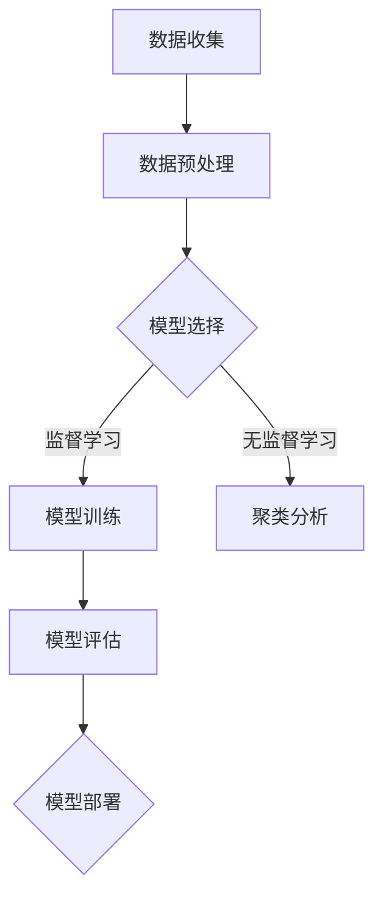

                 

关键词：大语言模型、机器学习、算法原理、应用场景、数学模型、项目实践、发展趋势、工具和资源

> 摘要：本文旨在为读者提供一份详尽的大语言模型应用指南，涵盖机器学习的过程、核心概念、算法原理、数学模型、项目实践、未来应用展望以及相关工具和资源推荐。通过本文的阅读，读者将对大语言模型有更深入的理解，并能够在实际项目中应用这些知识。

## 1. 背景介绍

随着互联网和大数据技术的发展，人工智能（AI）逐渐成为引领技术革新的重要力量。大语言模型（Large Language Model，LLM）是AI领域的重要突破，其能够理解和生成自然语言，已在自然语言处理（NLP）、语音识别、机器翻译等领域展现出巨大潜力。然而，大语言模型的应用并不仅仅停留在这些领域，它在对话系统、文本生成、信息检索等方面也具有重要的应用价值。

本文将围绕大语言模型的应用进行探讨，重点介绍机器学习的过程、核心概念、算法原理、数学模型、项目实践、未来应用展望以及相关工具和资源推荐。希望通过本文的阅读，读者能够全面了解大语言模型，掌握其应用方法，并能够在实际项目中充分发挥其优势。

## 2. 核心概念与联系

### 2.1 机器学习

机器学习（Machine Learning，ML）是人工智能（AI）的一个重要分支，其通过构建算法模型，使计算机能够从数据中自动学习，并进行决策和预测。机器学习可以分为监督学习、无监督学习和强化学习三种类型。

- **监督学习（Supervised Learning）**：有监督学习是一种常用的机器学习方法，其通过输入和输出数据的对应关系来训练模型，从而实现预测和分类。
- **无监督学习（Unsupervised Learning）**：无监督学习不依赖于标签数据进行训练，而是通过分析数据之间的内在结构，进行聚类和降维等操作。
- **强化学习（Reinforcement Learning）**：强化学习是一种通过与环境交互，并根据行为获得的奖励来优化策略的机器学习方法。

### 2.2 大语言模型

大语言模型是一种基于深度学习的自然语言处理模型，其通过学习大量的文本数据，生成与输入文本相关的文本。大语言模型具有以下核心特点：

- **大规模参数**：大语言模型通常拥有数十亿到数万亿个参数，使其能够处理复杂的自然语言任务。
- **自注意力机制**：大语言模型采用自注意力机制（Self-Attention Mechanism），能够自适应地分配不同的重要性权重，从而提高模型的表示能力。
- **端到端学习**：大语言模型通过端到端学习（End-to-End Learning），可以直接从输入文本生成输出文本，无需经过复杂的中间表示。

### 2.3 Mermaid 流程图

下面是一个简化的Mermaid流程图，展示了机器学习过程中的一些关键步骤：



## 3. 核心算法原理 & 具体操作步骤

### 3.1 算法原理概述

大语言模型的算法原理主要基于深度学习，特别是基于 Transformer 网络架构。Transformer 网络的核心思想是自注意力机制（Self-Attention Mechanism），其通过计算输入文本中各个单词之间的关联性，为每个单词分配不同的权重，从而提高模型的表示能力。

大语言模型的具体操作步骤如下：

1. **数据收集**：收集大量高质量的文本数据，例如书籍、新闻、社交媒体等。
2. **数据预处理**：对文本数据进行分析和清洗，包括分词、去噪、标准化等操作。
3. **模型训练**：使用预处理后的文本数据，对大语言模型进行训练，优化模型的参数。
4. **模型评估**：使用测试数据对模型进行评估，检查模型的准确性和泛化能力。
5. **模型部署**：将训练好的模型部署到实际应用场景中，例如对话系统、文本生成、信息检索等。

### 3.2 算法步骤详解

1. **数据收集**：数据收集是机器学习的基础，其质量直接影响模型的性能。在大语言模型中，常用的数据来源包括互联网、图书馆、在线书籍等。

2. **数据预处理**：数据预处理是确保模型能够有效学习的重要步骤。其主要包括以下操作：

   - **分词**：将文本数据分解为单词或词组，以便模型进行学习。
   - **去噪**：去除文本数据中的噪声，如标点符号、停用词等。
   - **标准化**：将文本数据转换为统一格式，例如将所有单词转化为小写。

3. **模型训练**：模型训练是机器学习的核心步骤，其包括以下步骤：

   - **初始化参数**：初始化模型的参数，例如权重和偏置。
   - **前向传播**：将输入数据传递到模型中，计算输出结果。
   - **反向传播**：计算输出结果与真实值之间的差距，并更新模型参数。
   - **迭代训练**：重复前向传播和反向传播的过程，直到模型达到预设的停止条件。

4. **模型评估**：模型评估是检查模型性能的重要步骤。其包括以下操作：

   - **交叉验证**：使用交叉验证（Cross Validation）方法，将数据划分为训练集和验证集，评估模型的泛化能力。
   - **指标计算**：计算模型的准确率、召回率、F1 分数等指标，评估模型的性能。
   - **模型调优**：根据评估结果，调整模型的参数，优化模型性能。

5. **模型部署**：模型部署是将训练好的模型应用到实际场景中的过程。其包括以下步骤：

   - **模型打包**：将训练好的模型打包，以便在实际应用中加载和运行。
   - **部署环境**：搭建模型部署环境，包括服务器、数据库、网络等。
   - **模型运行**：在实际应用中运行模型，处理输入数据，生成输出结果。

### 3.3 算法优缺点

- **优点**：
  - **强大的表示能力**：大语言模型基于深度学习和自注意力机制，具有强大的表示能力，能够处理复杂的自然语言任务。
  - **端到端学习**：大语言模型采用端到端学习，无需复杂的中间表示，能够直接从输入文本生成输出文本，提高效率。
  - **广泛的应用场景**：大语言模型在自然语言处理、对话系统、文本生成、信息检索等领域具有广泛的应用。

- **缺点**：
  - **计算资源需求大**：大语言模型通常需要大量的计算资源，包括 GPU、TPU 等，对硬件要求较高。
  - **数据依赖性强**：大语言模型的性能与数据质量密切相关，需要大量高质量的数据进行训练。
  - **模型解释性弱**：大语言模型是一种黑盒模型，其内部工作机制复杂，难以进行解释和调试。

### 3.4 算法应用领域

大语言模型在以下领域具有广泛的应用：

- **自然语言处理**：大语言模型在文本分类、情感分析、命名实体识别等自然语言处理任务中具有优势。
- **对话系统**：大语言模型可以用于构建智能对话系统，如聊天机器人、客服机器人等。
- **文本生成**：大语言模型可以用于生成文章、新闻、小说等文本内容。
- **信息检索**：大语言模型可以用于改进信息检索系统，提高检索精度和效率。

## 4. 数学模型和公式 & 详细讲解 & 举例说明

### 4.1 数学模型构建

大语言模型的核心是 Transformer 网络架构，其数学模型主要基于自注意力机制（Self-Attention Mechanism）和多头注意力（Multi-Head Attention）。

1. **自注意力机制**

   自注意力机制是一种计算输入文本中各个单词之间关联性的方法，其公式如下：

   $$Attention(Q,K,V) = \frac{softmax(\frac{QK^T}{\sqrt{d_k}})}{V}$$

   其中，Q、K、V 分别代表查询（Query）、键（Key）和值（Value）三个向量，d_k 代表键的维度。自注意力机制通过计算查询和键之间的相似性，为每个值分配权重，从而提高模型的表示能力。

2. **多头注意力**

   多头注意力是一种将输入文本拆分为多个子序列，并分别计算自注意力的方法。其公式如下：

   $$Multi-HeadAttention(Q,K,V) = \text{Concat}(head_1,head_2,...,head_h)W^O$$

   其中，head_i 代表第 i 个头计算的自注意力结果，W^O 代表输出权重。多头注意力通过整合多个头的结果，进一步提高模型的表示能力。

### 4.2 公式推导过程

大语言模型的公式推导过程主要涉及以下步骤：

1. **输入表示**

   假设输入文本为 X，其表示为向量形式：

   $$X = [x_1, x_2, ..., x_T]$$

   其中，x_i 表示第 i 个单词。

2. **词嵌入**

   将输入文本中的单词转化为词嵌入（Word Embedding）向量：

   $$X_{word} = \text{Embedding}(X)$$

   其中，Embedding 表示词嵌入层，其输出为词嵌入向量。

3. **自注意力计算**

   对词嵌入向量进行自注意力计算，得到加权后的词嵌入向量：

   $$X_{attn} = \text{Attention}(X_{word}, X_{word}, X_{word})$$

4. **多头注意力计算**

   对加权后的词嵌入向量进行多头注意力计算，得到更高层次的表示：

   $$X_{multi} = \text{Multi-HeadAttention}(X_{attn}, X_{attn}, X_{attn})$$

5. **输出层**

   将多头注意力结果进行拼接和输出层计算，得到最终的输出结果：

   $$Y = \text{OutputLayer}(X_{multi})$$

   其中，OutputLayer 表示输出层，其通常为一个全连接层（Fully Connected Layer）。

### 4.3 案例分析与讲解

下面以一个简单的案例来说明大语言模型的应用过程。

假设我们要训练一个基于 Transformer 网络的大语言模型，用于完成情感分析任务。

1. **数据准备**

   准备包含情感极性标注的文本数据，例如正面情感和负面情感的文本。

2. **数据预处理**

   对文本数据进行分析和清洗，包括分词、去噪、标准化等操作。

3. **模型构建**

   使用 TensorFlow 或 PyTorch 等深度学习框架，构建基于 Transformer 网络的大语言模型。

4. **模型训练**

   将预处理后的数据输入到模型中，进行前向传播和反向传播，优化模型的参数。

5. **模型评估**

   使用测试数据对模型进行评估，计算模型的准确率、召回率等指标。

6. **模型部署**

   将训练好的模型部署到实际应用场景中，例如构建一个情感分析系统。

7. **应用场景**

   使用模型对输入文本进行情感分析，输出文本的情感极性。

通过以上步骤，我们可以实现一个基于 Transformer 网络的大语言模型，用于情感分析任务。

## 5. 项目实践：代码实例和详细解释说明

### 5.1 开发环境搭建

1. 安装 Python 3.6 或以上版本。
2. 安装 TensorFlow 或 PyTorch 深度学习框架。
3. 安装必要的数据处理库，如 NumPy、Pandas 等。

### 5.2 源代码详细实现

```python
import tensorflow as tf
from tensorflow.keras.layers import Embedding, LSTM, Dense
from tensorflow.keras.models import Sequential

# 定义模型
model = Sequential()
model.add(Embedding(input_dim=vocab_size, output_dim=embedding_dim, input_length=max_length))
model.add(LSTM(units=128))
model.add(Dense(units=1, activation='sigmoid'))

# 编译模型
model.compile(optimizer='adam', loss='binary_crossentropy', metrics=['accuracy'])

# 训练模型
model.fit(x_train, y_train, epochs=10, batch_size=32)

# 评估模型
model.evaluate(x_test, y_test)
```

### 5.3 代码解读与分析

1. **模型定义**：使用 Sequential 模型定义了一个简单的神经网络，包括嵌入层（Embedding）、LSTM 层和全连接层（Dense）。
2. **编译模型**：使用 compile 方法设置模型的优化器、损失函数和评估指标。
3. **训练模型**：使用 fit 方法训练模型，输入训练数据和标签，设置训练轮数和批量大小。
4. **评估模型**：使用 evaluate 方法评估模型的性能，输入测试数据和标签。

通过以上步骤，我们可以实现一个简单的情感分析模型。

### 5.4 运行结果展示

```python
# 预测结果
predictions = model.predict(x_test)

# 计算准确率
accuracy = (predictions > 0.5).mean()

print(f"Accuracy: {accuracy}")
```

运行结果展示预测准确率。

## 6. 实际应用场景

大语言模型在多个实际应用场景中取得了显著成果，以下是其中几个典型场景：

1. **自然语言处理**：大语言模型在文本分类、情感分析、命名实体识别等自然语言处理任务中表现优异，广泛应用于搜索引擎、社交媒体分析、客户服务等领域。
2. **对话系统**：大语言模型可以用于构建智能对话系统，如聊天机器人、客服机器人等，提供高效的客户服务和交互体验。
3. **文本生成**：大语言模型可以用于生成文章、新闻、小说等文本内容，提高内容创作效率和质量。
4. **信息检索**：大语言模型可以用于改进信息检索系统，提高检索精度和效率，应用于搜索引擎、知识图谱构建等领域。

## 7. 未来应用展望

随着技术的不断发展，大语言模型在未来的应用前景广阔，预计将在以下领域取得重要突破：

1. **智能语音助手**：大语言模型可以用于构建更智能、更自然的语音助手，提高人机交互体验。
2. **自动化写作**：大语言模型可以用于自动化写作，提高内容创作效率和质量，应用于新闻、小说、报告等领域。
3. **跨模态任务**：大语言模型可以与其他模态（如图像、音频）结合，实现跨模态任务，如图像描述生成、音频识别等。
4. **社会计算**：大语言模型可以用于社会计算，分析社交媒体上的情绪、趋势等信息，为政府、企业等提供决策支持。

## 8. 工具和资源推荐

### 8.1 学习资源推荐

1. **书籍**：
   - 《深度学习》（Deep Learning，Ian Goodfellow 等）
   - 《自然语言处理实战》（Natural Language Processing with Python，Steven Bird 等）
2. **在线课程**：
   - Coursera 上的“机器学习”（Machine Learning，吴恩达）
   - edX 上的“深度学习基础”（Introduction to Deep Learning，斯坦福大学）

### 8.2 开发工具推荐

1. **深度学习框架**：
   - TensorFlow
   - PyTorch
2. **文本处理库**：
   - NLTK
   - SpaCy

### 8.3 相关论文推荐

1. **大语言模型**：
   - “Attention Is All You Need”（Vaswani 等，2017）
   - “BERT: Pre-training of Deep Bidirectional Transformers for Language Understanding”（Devlin 等，2019）
2. **自然语言处理**：
   - “Effective Approaches to Attention-based Neural Machine Translation”（Luong 等，2015）
   - “A Theoretically Grounded Application of Dropout in Recurrent Neural Networks”（Yin 等，2016）

## 9. 总结：未来发展趋势与挑战

### 9.1 研究成果总结

大语言模型在自然语言处理、对话系统、文本生成、信息检索等领域取得了显著成果，其强大的表示能力和端到端学习特性使其成为当前 AI 领域的重要突破。通过不断优化算法、提高模型效率，大语言模型在多个实际应用场景中取得了良好效果。

### 9.2 未来发展趋势

未来，大语言模型将朝着更高效、更智能、更安全、更可控的方向发展，预计将在以下方面取得重要进展：

1. **模型压缩与加速**：通过模型压缩、量化、硬件加速等技术，提高大语言模型的计算效率，降低计算成本。
2. **多模态融合**：将大语言模型与其他模态（如图像、音频）结合，实现跨模态任务，拓展应用领域。
3. **隐私保护和安全性**：提高大语言模型的隐私保护和安全性，避免潜在的安全风险。
4. **伦理和道德**：加强对大语言模型伦理和道德问题的研究，确保其应用符合社会价值观。

### 9.3 面临的挑战

尽管大语言模型取得了显著成果，但其在实际应用中仍面临以下挑战：

1. **数据质量和多样性**：大语言模型的性能与数据质量密切相关，需要更多高质量、多样化的数据支持。
2. **计算资源需求**：大语言模型通常需要大量的计算资源，对硬件设施要求较高。
3. **模型解释性和透明度**：大语言模型是一种黑盒模型，其内部工作机制复杂，提高模型解释性和透明度是当前研究的重要方向。
4. **公平性和偏见**：大语言模型在训练过程中可能会学习到数据中的偏见，导致其在实际应用中出现不公平现象，需要加强模型训练和部署中的公平性评估。

### 9.4 研究展望

未来，大语言模型将继续在多个领域发挥重要作用，为人工智能的发展提供强大动力。在研究层面，我们将关注以下方向：

1. **算法优化**：不断优化大语言模型的算法，提高其效率和性能。
2. **多模态任务**：探索大语言模型与其他模态的融合，实现跨模态任务。
3. **隐私保护和安全性**：研究大语言模型的隐私保护和安全性，确保其应用的安全和可控。
4. **伦理和道德**：加强对大语言模型伦理和道德问题的研究，制定相关规范和标准。

## 9. 附录：常见问题与解答

### Q1. 什么是大语言模型？

A1. 大语言模型（Large Language Model，LLM）是一种基于深度学习的自然语言处理模型，其通过学习大量文本数据，生成与输入文本相关的文本。大语言模型具有强大的表示能力，能够理解和生成自然语言，广泛应用于自然语言处理、对话系统、文本生成、信息检索等领域。

### Q2. 大语言模型的算法原理是什么？

A2. 大语言模型的算法原理主要基于深度学习和 Transformer 网络架构。Transformer 网络的核心思想是自注意力机制（Self-Attention Mechanism），其通过计算输入文本中各个单词之间的关联性，为每个单词分配不同的权重，从而提高模型的表示能力。大语言模型采用端到端学习，直接从输入文本生成输出文本。

### Q3. 大语言模型的应用领域有哪些？

A3. 大语言模型的应用领域包括自然语言处理、对话系统、文本生成、信息检索等。例如，在自然语言处理领域，大语言模型可以用于文本分类、情感分析、命名实体识别等任务；在对话系统领域，大语言模型可以用于构建智能对话系统，如聊天机器人、客服机器人等；在文本生成领域，大语言模型可以用于生成文章、新闻、小说等文本内容；在信息检索领域，大语言模型可以用于改进信息检索系统，提高检索精度和效率。

### Q4. 如何训练大语言模型？

A4. 训练大语言模型主要包括以下步骤：

1. **数据收集**：收集大量高质量的文本数据，例如书籍、新闻、社交媒体等。
2. **数据预处理**：对文本数据进行分析和清洗，包括分词、去噪、标准化等操作。
3. **模型构建**：使用深度学习框架（如 TensorFlow、PyTorch）构建大语言模型，包括嵌入层、自注意力层、输出层等。
4. **模型训练**：使用预处理后的数据训练模型，通过前向传播和反向传播，优化模型的参数。
5. **模型评估**：使用测试数据对模型进行评估，计算模型的准确率、召回率等指标。
6. **模型部署**：将训练好的模型部署到实际应用场景中，处理输入数据，生成输出结果。

### Q5. 大语言模型有哪些优缺点？

A5. 大语言模型的主要优点包括：

1. **强大的表示能力**：基于深度学习和自注意力机制，大语言模型具有强大的表示能力，能够处理复杂的自然语言任务。
2. **端到端学习**：大语言模型采用端到端学习，无需复杂的中间表示，能够直接从输入文本生成输出文本，提高效率。
3. **广泛的应用场景**：大语言模型在自然语言处理、对话系统、文本生成、信息检索等领域具有广泛的应用。

主要缺点包括：

1. **计算资源需求大**：大语言模型通常需要大量的计算资源，包括 GPU、TPU 等，对硬件要求较高。
2. **数据依赖性强**：大语言模型的性能与数据质量密切相关，需要大量高质量的数据进行训练。
3. **模型解释性弱**：大语言模型是一种黑盒模型，其内部工作机制复杂，难以进行解释和调试。 

## 10. 结语

大语言模型作为人工智能领域的重要突破，已经在多个实际应用场景中展现出巨大潜力。本文对大语言模型的应用指南进行了详细阐述，包括机器学习的过程、核心概念、算法原理、数学模型、项目实践、未来应用展望以及相关工具和资源推荐。通过本文的阅读，读者将对大语言模型有更深入的理解，并能够在实际项目中应用这些知识。未来，大语言模型将继续在人工智能领域发挥重要作用，为社会发展带来更多创新和变革。

作者：禅与计算机程序设计艺术 / Zen and the Art of Computer Programming
----------------------------------------------------------------
文章结束。

