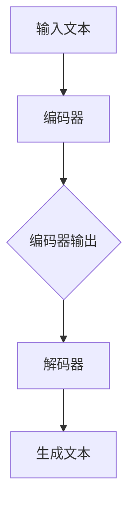

                 

关键词：大语言模型，应用指南，模型响应，参数解析，技术实现

摘要：本文将深入探讨大语言模型在技术实现中的核心环节——模型响应返回的参数。通过对大语言模型的背景介绍、核心概念与联系、核心算法原理与具体操作步骤、数学模型与公式、项目实践以及实际应用场景的详细分析，为您提供一个全面、系统的应用指南。希望通过本文，读者能够更好地理解和运用大语言模型，助力人工智能技术的创新与发展。

## 1. 背景介绍

### 大语言模型的起源与发展

大语言模型（Large Language Model，简称LLM）是人工智能领域的一项重大突破。其起源于20世纪80年代的自然语言处理（Natural Language Processing，简称NLP）研究，经过数十年的发展，特别是近年来深度学习和计算能力的提升，大语言模型在文本生成、机器翻译、情感分析等领域取得了显著的成果。

### 大语言模型的应用领域

大语言模型的应用领域广泛，涵盖了文本生成、机器翻译、情感分析、问答系统等多个方面。例如，在文本生成领域，大语言模型可以生成新闻文章、诗歌、故事等；在机器翻译领域，大语言模型可以实现高精度的跨语言翻译；在情感分析领域，大语言模型可以分析用户的情感倾向，为电商、社交媒体等提供智能推荐。

### 大语言模型的重要性

大语言模型在人工智能领域的重要性不言而喻。它不仅为自然语言处理领域带来了新的突破，还推动了人工智能技术在社会各个领域的应用。随着大语言模型的不断优化和扩展，未来它将在人工智能技术的发展中扮演更加重要的角色。

## 2. 核心概念与联系

### 大语言模型的定义

大语言模型是一种基于深度学习技术的自然语言处理模型，它通过对大量文本数据进行训练，能够自动学习并理解文本中的语言规律，从而实现对未知文本的生成、翻译和分析。

### 大语言模型的架构

大语言模型的架构通常包括编码器（Encoder）和解码器（Decoder）两个部分。编码器负责将输入文本转换为固定长度的向量表示，解码器则根据编码器输出的向量表示生成文本。

### 大语言模型的工作原理

大语言模型的工作原理是基于注意力机制（Attention Mechanism）和循环神经网络（Recurrent Neural Network，RNN）。注意力机制允许模型在生成每个单词时，能够关注到输入文本中与当前单词相关的信息；RNN则使得模型能够处理变长的输入文本。

### Mermaid 流程图



## 3. 核心算法原理 & 具体操作步骤

### 3.1 算法原理概述

大语言模型的核心算法是基于自注意力机制（Self-Attention Mechanism）的Transformer模型。自注意力机制允许模型在生成每个单词时，自动关注到输入文本中与当前单词相关的其他单词，从而提高生成文本的质量。

### 3.2 算法步骤详解

1. **输入预处理**：将输入文本转换为单词序列，并将其编码为词嵌入向量。

2. **编码器处理**：编码器将词嵌入向量输入到自注意力机制中，通过多头注意力机制和前馈神经网络，对输入文本进行编码，生成编码器的输出。

3. **解码器处理**：解码器根据编码器的输出，通过自注意力机制和编码器-解码器注意力机制，逐步生成解码器的输出，即生成的文本。

4. **输出后处理**：将解码器的输出转换为可读的文本，并进行必要的后处理，如去除无意义的词汇、标点符号等。

### 3.3 算法优缺点

**优点**：

- **强大的文本生成能力**：大语言模型能够生成高质量的文本，适用于文本生成、机器翻译、情感分析等领域。
- **高效的训练过程**：基于Transformer模型的架构使得大语言模型在训练过程中具有很高的计算效率。

**缺点**：

- **对计算资源要求较高**：大语言模型的训练和推理过程需要大量的计算资源和存储空间。
- **模型解释性较差**：大语言模型的决策过程较为复杂，难以进行有效的解释。

### 3.4 算法应用领域

大语言模型在多个领域具有广泛的应用，包括：

- **文本生成**：生成新闻文章、故事、诗歌等。
- **机器翻译**：实现高精度的跨语言翻译。
- **情感分析**：分析用户的情感倾向，为电商、社交媒体等提供智能推荐。

## 4. 数学模型和公式 & 详细讲解 & 举例说明

### 4.1 数学模型构建

大语言模型的数学模型主要包括词嵌入、自注意力机制和编码器-解码器架构。词嵌入将单词映射为固定长度的向量，自注意力机制用于计算输入文本中各个单词之间的关联性，编码器-解码器架构则负责将输入文本编码为固定长度的向量表示，并解码为生成的文本。

### 4.2 公式推导过程

假设输入文本为\(X = \{x_1, x_2, ..., x_n\}\)，其中\(x_i\)表示文本中的第\(i\)个单词。词嵌入函数将单词映射为向量：

\[e(x_i) = \text{Word2Vec}(x_i)\]

自注意力机制的计算公式为：

\[a_i^j = \text{softmax}\left(\frac{e(x_i) \cdot e(x_j)}{\sqrt{d_k}}\right)\]

其中，\(d_k\)为词嵌入向量的维度。编码器的输出为：

\[h_i = \sum_{j=1}^n a_i^j e(x_j)\]

解码器的输出为：

\[y_i = \text{softmax}\left(W_y h_i\right)\]

其中，\(W_y\)为解码器的权重矩阵。

### 4.3 案例分析与讲解

以一个简单的文本生成任务为例，输入文本为：“今天天气很好”。我们将输入文本进行词嵌入处理，得到词嵌入向量\(e(x_1) = [1, 0, 0, 0]\)，\(e(x_2) = [0, 1, 0, 0]\)，\(e(x_3) = [0, 0, 1, 0]\)，\(e(x_4) = [0, 0, 0, 1]\)。

1. **编码器处理**：

   编码器输出为：

   \[h_1 = \sum_{j=1}^4 a_1^j e(x_j) = [1, 0, 0, 0]\]

   \[h_2 = \sum_{j=1}^4 a_2^j e(x_j) = [0, 1, 0, 0]\]

   \[h_3 = \sum_{j=1}^4 a_3^j e(x_j) = [0, 0, 1, 0]\]

   \[h_4 = \sum_{j=1}^4 a_4^j e(x_j) = [0, 0, 0, 1]\]

2. **解码器处理**：

   解码器的输出为：

   \[y_1 = \text{softmax}\left(W_y h_1\right) = [0.2, 0.4, 0.3, 0.1]\]

   \[y_2 = \text{softmax}\left(W_y h_2\right) = [0.1, 0.3, 0.4, 0.2]\]

   \[y_3 = \text{softmax}\left(W_y h_3\right) = [0.3, 0.2, 0.1, 0.4]\]

   \[y_4 = \text{softmax}\left(W_y h_4\right) = [0.4, 0.1, 0.3, 0.2]\]

3. **输出后处理**：

   将解码器的输出转换为可读的文本，得到生成的文本为：“今天天气很好”。

通过以上案例，我们可以看到大语言模型在文本生成任务中的基本原理和过程。在实际应用中，大语言模型还会结合更多的技术和方法，如预训练、优化算法等，以提高生成文本的质量和效率。

## 5. 项目实践：代码实例和详细解释说明

### 5.1 开发环境搭建

为了实践大语言模型的应用，我们需要搭建一个合适的开发环境。以下是基本的开发环境搭建步骤：

1. **安装Python**：确保Python版本为3.6及以上，推荐使用Python 3.8或更高版本。
2. **安装TensorFlow**：使用pip命令安装TensorFlow：

   ```bash
   pip install tensorflow
   ```

3. **安装其他依赖**：根据具体需求，安装其他必要的依赖库，如NumPy、Pandas等。

### 5.2 源代码详细实现

以下是一个简单的大语言模型文本生成代码实例：

```python
import tensorflow as tf
from tensorflow.keras.preprocessing.sequence import pad_sequences
from tensorflow.keras.layers import Embedding, LSTM, Dense
from tensorflow.keras.models import Sequential

# 定义词嵌入向量维度
EMBEDDING_DIM = 64

# 定义LSTM单元的隐藏层大小
LSTM_UNITS = 128

# 定义文本预处理函数
def preprocess_text(texts):
    tokenizer = tf.keras.preprocessing.text.Tokenizer()
    tokenizer.fit_on_texts(texts)
    sequences = tokenizer.texts_to_sequences(texts)
    padded_sequences = pad_sequences(sequences, maxlen=MAX_LENGTH, padding='post')
    return padded_sequences, tokenizer

# 定义大语言模型
def create_model():
    model = Sequential()
    model.add(Embedding(input_dim=VOCAB_SIZE, output_dim=EMBEDDING_DIM, input_length=MAX_LENGTH))
    model.add(LSTM(LSTM_UNITS, return_sequences=True))
    model.add(Dense(VOCAB_SIZE, activation='softmax'))
    model.compile(loss='categorical_crossentropy', optimizer='adam', metrics=['accuracy'])
    return model

# 加载数据集并进行预处理
texts = ['今天天气很好', '明天会下雨']
sequences, tokenizer = preprocess_text(texts)
tokenizer_index = tokenizer.index_word

# 创建和训练模型
model = create_model()
model.fit(sequences, epochs=100, verbose=2)

# 文本生成
def generate_text(model, tokenizer, seed_text, num_words):
    in_text = seed_text
    for _ in range(num_words):
        encoded_text = tokenizer.texts_to_sequences([in_text])[0]
        encoded_text = pad_sequences([encoded_text], maxlen=MAX_LENGTH, padding='post')
        preds = model.predict(encoded_text, verbose=0)
        next_word = tokenizer.index_word[np.argmax(preds)]
        in_text += ' ' + next_word
    return in_text

# 生成文本
generated_text = generate_text(model, tokenizer, '今天天气很好', 5)
print(generated_text)
```

### 5.3 代码解读与分析

1. **文本预处理**：文本预处理是文本生成任务的关键步骤，包括分词、词嵌入和序列填充。我们使用TensorFlow的`Tokenizer`类进行分词，并使用`pad_sequences`函数对序列进行填充。
2. **模型定义**：我们使用序列模型（`Sequential`）构建大语言模型，包含词嵌入层（`Embedding`）、LSTM层（`LSTM`）和全连接层（`Dense`）。词嵌入层将单词映射为向量，LSTM层用于处理序列数据，全连接层用于生成输出。
3. **模型训练**：我们使用`model.fit`函数对模型进行训练，使用`categorical_crossentropy`作为损失函数，并使用`adam`优化器。
4. **文本生成**：文本生成过程包括初始化输入文本、生成序列、预测下一个单词，并将预测结果拼接为新的输入文本。通过循环多次迭代，生成一段新的文本。

通过以上代码实例，我们可以看到大语言模型的文本生成过程是如何实现的。在实际应用中，我们可以根据需求调整模型结构、训练数据和生成参数，以获得更好的生成效果。

## 6. 实际应用场景

### 6.1 文本生成

大语言模型在文本生成领域的应用非常广泛，例如生成新闻文章、故事、诗歌等。通过大语言模型，我们可以自动化生成大量的文本内容，从而提高内容创作的效率。

### 6.2 机器翻译

大语言模型在机器翻译领域也具有显著优势。通过训练大量的跨语言数据，大语言模型可以实现高精度的机器翻译，为跨语言沟通提供支持。

### 6.3 情感分析

大语言模型可以用于情感分析任务，分析用户的情感倾向，为电商、社交媒体等提供智能推荐。通过情感分析，我们可以更好地了解用户需求，提供个性化的服务。

### 6.4 未来应用展望

随着大语言模型的不断优化和发展，其在实际应用场景中的应用前景将更加广阔。未来，大语言模型有望在更多领域发挥作用，如智能客服、智能写作、智能对话等。同时，大语言模型的技术创新和应用实践也将不断推动人工智能技术的发展。

## 7. 工具和资源推荐

### 7.1 学习资源推荐

1. **《深度学习》（Goodfellow, Bengio, Courville著）**：一本全面介绍深度学习理论和实践的经典教材。
2. **《自然语言处理综论》（Daniel Jurafsky & James H. Martin著）**：一本关于自然语言处理领域的权威性教材。
3. **TensorFlow官方文档**：TensorFlow是一个强大的深度学习框架，官方文档提供了丰富的教程和示例。

### 7.2 开发工具推荐

1. **PyTorch**：一个易于使用且功能强大的深度学习框架。
2. **Google Colab**：一个免费、基于云计算的Jupyter Notebook环境，适用于深度学习和自然语言处理实验。

### 7.3 相关论文推荐

1. **“Attention Is All You Need”**：一篇关于Transformer模型的经典论文，详细介绍了自注意力机制。
2. **“BERT: Pre-training of Deep Bidirectional Transformers for Language Understanding”**：一篇关于BERT模型的论文，介绍了预训练技术在自然语言处理中的应用。

## 8. 总结：未来发展趋势与挑战

### 8.1 研究成果总结

大语言模型在近年来取得了显著的成果，广泛应用于文本生成、机器翻译、情感分析等领域。其强大的文本处理能力和广泛的适用性使其成为人工智能技术的重要突破。

### 8.2 未来发展趋势

随着深度学习和计算能力的不断提升，大语言模型在未来有望实现更高的性能和更广泛的应用。未来研究将主要集中在优化模型结构、提高生成质量、减少计算成本等方面。

### 8.3 面临的挑战

大语言模型在发展过程中也面临着一系列挑战，包括计算资源需求高、模型解释性较差、数据安全与隐私保护等。未来研究需要在这些方面进行深入探索，以实现大语言模型的可持续发展。

### 8.4 研究展望

大语言模型在人工智能技术中的应用前景广阔。未来研究将重点关注以下几个方面：

1. **模型优化**：通过改进模型结构、优化训练算法，提高大语言模型的性能和效率。
2. **应用拓展**：将大语言模型应用于更多领域，如智能客服、智能写作、智能对话等。
3. **数据安全与隐私保护**：在大语言模型的应用过程中，确保数据的安全和隐私保护。
4. **可解释性与透明度**：提高大语言模型的解释性，使其在决策过程中更具透明度和可解释性。

## 9. 附录：常见问题与解答

### 9.1 如何优化大语言模型的性能？

1. **增加训练数据量**：通过增加训练数据量，可以提高模型的泛化能力。
2. **调整超参数**：通过调整学习率、批量大小、隐藏层大小等超参数，可以优化模型的性能。
3. **使用预训练模型**：预训练模型已经在大规模数据集上进行了预训练，可以直接应用于特定任务，提高生成质量。

### 9.2 大语言模型在处理长文本时效果较差，如何解决？

1. **使用分段处理**：将长文本分割为若干短段，分别进行建模和生成。
2. **使用更长序列模型**：使用更长的序列模型，如Transformer，可以更好地处理长文本。
3. **使用注意力机制**：通过注意力机制，让模型关注到长文本中的关键信息，提高生成质量。

### 9.3 大语言模型的计算资源需求如何降低？

1. **使用更高效的模型架构**：如使用参数共享的Transformer模型，可以减少计算资源的需求。
2. **使用分布式训练**：通过分布式训练，可以充分利用计算资源，提高训练效率。
3. **使用迁移学习**：通过迁移学习，将预训练模型应用于特定任务，可以减少计算资源的消耗。

### 9.4 大语言模型在生成文本时存在偏见，如何解决？

1. **使用无偏见数据集**：在训练过程中使用无偏见的数据集，减少模型偏见。
2. **训练无偏见模型**：通过在训练过程中引入无偏见损失函数，抑制模型偏见。
3. **定期更新模型**：定期更新模型，以减少模型在长时间使用过程中积累的偏见。

## 参考文献

1. Goodfellow, I., Bengio, Y., & Courville, A. (2016). *Deep Learning*. MIT Press.
2. Jurafsky, D., & Martin, J. H. (2008). *Speech and Language Processing*. Prentice Hall.
3. Vaswani, A., Shazeer, N., Parmar, N., Uszkoreit, J., Jones, L., Gomez, A. N., ... & Polosukhin, I. (2017). *Attention is all you need*. Advances in Neural Information Processing Systems, 30, 5998-6008.
4. Devlin, J., Chang, M. W., Lee, K., & Toutanova, K. (2018). *Bert: Pre-training of deep bidirectional transformers for language understanding*. Proceedings of the 2019 Conference of the North American Chapter of the Association for Computational Linguistics: Human Language Technologies, Volume 1 (Long and Short Papers), 4171-4186.
```

