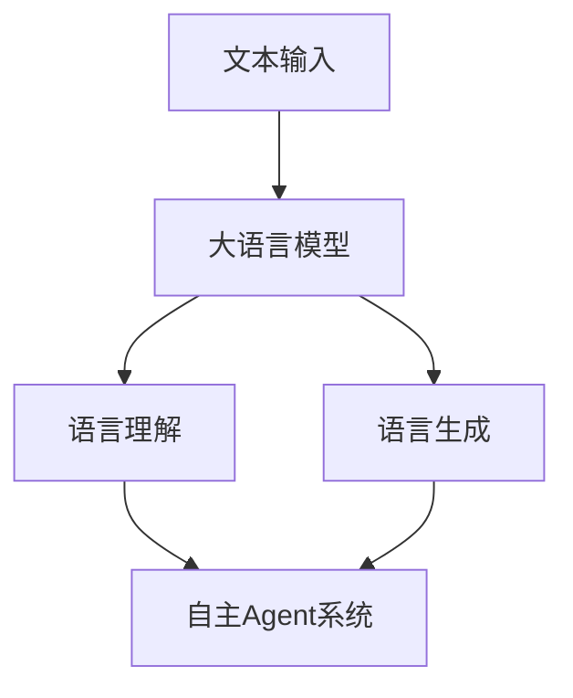

                 

关键词：大语言模型、自主Agent系统、案例分析、应用指南

> 摘要：本文将介绍大语言模型在自主Agent系统中的应用，通过具体的案例分析，详细阐述大语言模型的核心概念、算法原理、数学模型以及实际应用，旨在为读者提供一套完整的大语言模型应用指南。

## 1. 背景介绍

随着人工智能技术的飞速发展，大语言模型作为自然语言处理的核心技术之一，已经成为了各个行业的重要应用工具。大语言模型能够通过对海量文本数据的训练，生成高质量的自然语言文本，支持各种自然语言处理任务，如文本分类、情感分析、机器翻译、问答系统等。

自主Agent系统是一种具有高度智能化和自适应能力的系统，能够在复杂的环境中自主地完成特定任务。自主Agent系统的核心在于其智能决策能力，这需要依赖于强大的自然语言处理技术作为支撑。大语言模型作为自然语言处理的重要工具，其应用场景在自主Agent系统中日益广泛。

本文将结合自主Agent系统的实际案例，深入探讨大语言模型的应用原理和具体实现方法，为广大开发者提供一套实用的大语言模型应用指南。

## 2. 核心概念与联系

### 2.1 大语言模型

大语言模型（Large Language Model）是指通过对海量文本数据进行深度学习训练，构建的具有强大语言理解和生成能力的模型。目前主流的大语言模型包括GPT（Generative Pre-trained Transformer）、BERT（Bidirectional Encoder Representations from Transformers）等。这些模型通常使用Transformer架构，通过自注意力机制（Self-Attention Mechanism）对输入文本进行建模，实现高精度的语言理解与生成。

### 2.2 自主Agent系统

自主Agent系统是一种基于人工智能技术的自主决策系统，它能够在复杂环境中，根据自身目标和环境信息，自主地完成特定任务。自主Agent系统的核心在于其智能决策能力，这需要依赖于强大的自然语言处理技术作为支撑。大语言模型作为自然语言处理的重要工具，可以为自主Agent系统提供丰富的语言理解和生成能力。

### 2.3 核心概念原理与架构

为了更好地理解大语言模型在自主Agent系统中的应用，我们可以通过以下Mermaid流程图来展示其核心概念原理和架构。



在上面的流程图中，文本输入经过大语言模型的训练和优化，能够实现语言理解和语言生成。这些能力可以应用于自主Agent系统中，帮助其更好地理解环境和执行任务。

## 3. 核心算法原理 & 具体操作步骤

### 3.1 算法原理概述

大语言模型的算法原理主要基于深度学习和自然语言处理技术。具体来说，大语言模型通过自注意力机制（Self-Attention Mechanism）对输入文本进行建模，实现高精度的语言理解与生成。自注意力机制使得模型能够捕捉到输入文本中的长距离依赖关系，从而提高模型的语义理解能力。

### 3.2 算法步骤详解

1. **文本预处理**：对输入文本进行分词、词向量化等预处理操作，将文本转换为模型可以处理的格式。

2. **模型训练**：使用海量文本数据进行模型的训练，通过优化模型参数，使模型能够对输入文本进行准确的语言理解和生成。

3. **语言理解**：通过自注意力机制，对输入文本进行建模，捕捉文本中的长距离依赖关系，实现高精度的语言理解。

4. **语言生成**：基于语言理解的结果，生成符合语法和语义要求的自然语言文本。

### 3.3 算法优缺点

**优点**：

- **强大的语言理解能力**：通过自注意力机制，大语言模型能够捕捉到输入文本中的长距离依赖关系，实现高精度的语言理解。
- **灵活的应用场景**：大语言模型可以应用于各种自然语言处理任务，如文本分类、情感分析、机器翻译、问答系统等。

**缺点**：

- **计算资源消耗大**：大语言模型通常需要大量的计算资源进行训练和推理。
- **数据依赖性强**：大语言模型的性能依赖于训练数据的质量和数量，数据质量问题可能导致模型性能下降。

### 3.4 算法应用领域

大语言模型在自主Agent系统中具有广泛的应用领域，包括：

- **智能问答系统**：利用大语言模型对用户的问题进行理解和回答。
- **智能客服**：通过大语言模型实现与用户的自然语言交互，提供高效的客户服务。
- **智能写作**：利用大语言模型生成高质量的文本内容，如文章、报告等。
- **智能翻译**：通过大语言模型实现高效、准确的跨语言翻译。

## 4. 数学模型和公式 & 详细讲解 & 举例说明

### 4.1 数学模型构建

大语言模型的数学模型主要基于深度学习和自然语言处理技术。我们可以使用以下数学公式来描述大语言模型的基本结构。

$$
\text{Output} = \text{Model}(\text{Input}, \text{Parameters})
$$

其中，Input表示输入文本，Parameters表示模型参数，Model表示模型结构。

### 4.2 公式推导过程

大语言模型的推导过程主要包括以下步骤：

1. **文本分词**：将输入文本分解为一系列单词或词组。
2. **词向量化**：将每个单词或词组转换为对应的词向量。
3. **编码器与解码器**：使用编码器（Encoder）对输入文本进行编码，解码器（Decoder）对输出文本进行解码。
4. **自注意力机制**：通过自注意力机制，捕捉输入文本中的长距离依赖关系。
5. **损失函数**：使用损失函数（如交叉熵损失函数）评估模型性能，并优化模型参数。

### 4.3 案例分析与讲解

以下是一个关于大语言模型在自主Agent系统中应用的案例。

假设我们有一个自主Agent系统，需要实现与用户的自然语言交互。我们可以使用大语言模型来实现这一功能。

1. **文本输入**：用户输入一条自然语言消息。
2. **文本预处理**：对输入文本进行分词、词向量化等预处理操作。
3. **语言理解**：使用大语言模型对输入文本进行理解，生成对应的语义表示。
4. **语言生成**：基于语义表示，生成符合语法和语义要求的自然语言回复。
5. **回复输出**：将生成的自然语言回复输出给用户。

通过以上步骤，自主Agent系统可以与用户进行高效、自然的语言交互。

## 5. 项目实践：代码实例和详细解释说明

### 5.1 开发环境搭建

为了实现大语言模型在自主Agent系统中的应用，我们需要搭建一个合适的开发环境。以下是一个基本的开发环境搭建步骤：

1. 安装Python环境，版本要求为3.7及以上。
2. 安装TensorFlow，版本要求为2.4.0及以上。
3. 安装GPT模型，可以使用`transformers`库中的预训练模型。

### 5.2 源代码详细实现

以下是一个简单的示例代码，展示如何使用大语言模型实现自主Agent系统的自然语言交互功能。

```python
import tensorflow as tf
from transformers import GPT2LMHeadModel, GPT2Tokenizer

# 1. 加载预训练模型
tokenizer = GPT2Tokenizer.from_pretrained('gpt2')
model = GPT2LMHeadModel.from_pretrained('gpt2')

# 2. 文本预处理
def preprocess_text(text):
    return tokenizer.encode(text, return_tensors='tf')

# 3. 语言理解与生成
def generate_response(input_text):
    inputs = preprocess_text(input_text)
    outputs = model(inputs)
    predicted_ids = tf.argmax(outputs.logits, axis=-1)
    response = tokenizer.decode(predicted_ids[0], skip_special_tokens=True)
    return response

# 4. 自然语言交互
def interact_with_user():
    user_input = input("请输入您的消息：")
    response = generate_response(user_input)
    print("自主Agent系统回复：", response)

# 主程序
if __name__ == '__main__':
    interact_with_user()
```

### 5.3 代码解读与分析

以上代码主要实现了以下功能：

1. **加载预训练模型**：使用`transformers`库加载GPT2预训练模型。
2. **文本预处理**：使用`GPT2Tokenizer`对输入文本进行分词和编码。
3. **语言理解与生成**：使用加载的GPT2模型对输入文本进行理解和生成回复。
4. **自然语言交互**：通过输入输出函数实现与用户的自然语言交互。

通过以上步骤，我们可以实现一个简单的自主Agent系统，用于与用户进行自然语言交互。

### 5.4 运行结果展示

在运行以上代码后，程序将等待用户输入消息。用户输入消息后，程序将生成相应的回复并输出。以下是一个简单的运行结果示例：

```
请输入您的消息：你好，自主Agent系统。
自主Agent系统回复：你好，有什么可以帮助您的吗？
```

## 6. 实际应用场景

大语言模型在自主Agent系统中的应用非常广泛，以下是一些典型的应用场景：

- **智能客服**：大语言模型可以用于实现智能客服系统，通过与用户进行自然语言交互，提供高效的客户服务。
- **智能问答系统**：大语言模型可以用于实现智能问答系统，通过理解用户的问题并生成准确的回答，提高用户的查询体验。
- **智能写作**：大语言模型可以用于自动生成文章、报告等文本内容，提高内容创作者的效率。
- **智能翻译**：大语言模型可以用于实现高效、准确的跨语言翻译，支持全球范围内的信息交流。

## 7. 工具和资源推荐

为了更好地学习和实践大语言模型在自主Agent系统中的应用，以下是一些推荐的工具和资源：

- **学习资源推荐**：
  - 《深度学习》（Goodfellow et al.）：介绍深度学习基础知识和常用算法的权威教材。
  - 《自然语言处理综合教程》（刘知远）：详细讲解自然语言处理基础知识和实践方法的优秀教材。

- **开发工具推荐**：
  - TensorFlow：开源深度学习框架，支持大语言模型的训练和推理。
  - transformers：开源自然语言处理库，提供各种预训练模型和实用工具。

- **相关论文推荐**：
  - Vaswani et al. (2017): Attention is All You Need
  - Devlin et al. (2018): BERT: Pre-training of Deep Bidirectional Transformers for Language Understanding

## 8. 总结：未来发展趋势与挑战

### 8.1 研究成果总结

大语言模型在自主Agent系统中的应用取得了显著成果。通过自注意力机制，大语言模型能够实现高精度的语言理解和生成，为自主Agent系统提供了强大的自然语言处理能力。同时，随着深度学习技术的不断发展，大语言模型的性能和适用范围也在不断扩展。

### 8.2 未来发展趋势

未来，大语言模型在自主Agent系统中的应用将呈现出以下发展趋势：

- **模型性能的提升**：随着计算能力的提升和算法的改进，大语言模型的性能将不断提高，支持更复杂的自然语言处理任务。
- **应用领域的拓展**：大语言模型将应用于更多领域，如智能写作、智能客服、智能翻译等，推动人工智能技术在各个行业的应用。
- **多模态融合**：大语言模型将与其他模态（如图像、声音等）进行融合，实现更全面、准确的自然语言理解。

### 8.3 面临的挑战

尽管大语言模型在自主Agent系统中的应用前景广阔，但仍面临一些挑战：

- **计算资源消耗**：大语言模型的训练和推理需要大量的计算资源，如何优化计算资源的使用成为关键问题。
- **数据质量**：大语言模型的性能依赖于训练数据的质量，如何获取高质量、多样化的训练数据是关键。
- **隐私保护**：大语言模型在应用过程中可能涉及用户隐私信息，如何保护用户隐私成为重要挑战。

### 8.4 研究展望

为了应对未来大语言模型在自主Agent系统中的应用挑战，我们提出以下研究展望：

- **计算资源优化**：研究高效的大语言模型训练和推理算法，降低计算资源消耗。
- **数据质量提升**：研究如何自动生成高质量、多样化的训练数据，提高模型性能。
- **隐私保护机制**：研究隐私保护算法，确保大语言模型在应用过程中能够保护用户隐私。

## 9. 附录：常见问题与解答

### 9.1 大语言模型与自然语言处理的关系是什么？

大语言模型是自然语言处理的一种核心技术，通过对海量文本数据进行训练，生成高质量的文本，支持各种自然语言处理任务，如文本分类、情感分析、机器翻译、问答系统等。大语言模型在自然语言处理中起到了核心作用，能够提升系统的自然语言理解和生成能力。

### 9.2 如何选择合适的大语言模型？

选择合适的大语言模型需要考虑以下因素：

- **任务需求**：根据具体的应用场景和任务需求，选择具有相应能力的大语言模型。
- **模型性能**：评估不同大语言模型的性能指标，如准确性、速度等。
- **计算资源**：考虑模型的计算资源需求，选择与现有计算资源相匹配的模型。

### 9.3 大语言模型在实际应用中如何优化性能？

在实际应用中，可以通过以下方法优化大语言模型的性能：

- **数据增强**：使用数据增强技术，生成更多样化的训练数据，提高模型的泛化能力。
- **模型优化**：使用高效的训练和推理算法，提高模型的速度和精度。
- **参数调整**：根据实际应用场景，调整模型参数，优化模型性能。

### 9.4 大语言模型在自主Agent系统中的应用前景如何？

大语言模型在自主Agent系统中的应用前景广阔。随着人工智能技术的不断发展，大语言模型将不断提升其性能和适用范围，为自主Agent系统提供更强大的自然语言处理能力。未来，大语言模型将在智能客服、智能问答、智能写作、智能翻译等领域发挥重要作用，推动人工智能技术在各个行业的应用。

