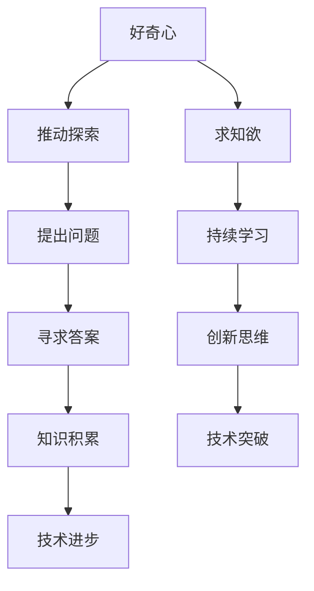

                 

 好奇心与求知欲是驱动人类不断前进、探索未知世界的核心动力。在信息技术领域，这种探索精神尤为重要。本文将探讨好奇心与求知欲如何推动技术发展，以及如何通过专业的技术语言将这种探索转化为实际的成果。

## 1. 背景介绍

人类的好奇心与求知欲可以追溯到远古时代。从对自然界现象的疑问，到对宇宙的探索，人类不断追求知识，推动科学技术的进步。信息技术领域也不例外，从计算机的诞生到互联网的普及，每一步都离不开对未知的探索和挑战。

本文将重点关注以下核心问题：

- 好奇心与求知欲在技术发展中的作用
- 专业的技术语言在知识传播中的重要性
- 好奇心与求知欲如何转化为实际的技术成果

## 2. 核心概念与联系

在探讨好奇心与求知欲在技术发展中的作用之前，我们需要理解一些核心概念。

### 2.1 好奇心

好奇心是人类探索未知的本能，是一种强烈的求知欲。它可以激发人们对未知领域的好奇，推动人们去发现、学习和创造。

### 2.2 求知欲

求知欲是指人类对知识的渴望和追求。它是人类不断学习、成长和进步的动力。

### 2.3 技术语言

技术语言是一种专门用于描述和传达技术知识的语言，包括算法、数学公式、代码等。它使得知识得以精确传递和高效应用。

下面是一个用Mermaid绘制的流程图，展示了好奇心与求知欲在技术发展中的关系：



## 3. 核心算法原理 & 具体操作步骤

### 3.1 算法原理概述

好奇心与求知欲在技术发展中的作用，可以通过一个经典的算法——贪心算法（Greedy Algorithm）来解释。贪心算法是一种在每一步选择中都采取当前最优解的策略，不进行多余计算和优化。

### 3.2 算法步骤详解

1. 初始化：确定问题初始状态。
2. 选择：根据当前状态，选择一个局部最优解。
3. 执行：执行该选择，并更新状态。
4. 判断：判断是否达到目标状态。如果是，结束；如果不是，返回步骤2。

### 3.3 算法优缺点

**优点：**
- 算法简单，易于实现。
- 对于某些问题，可以快速得到近似最优解。

**缺点：**
- 对于某些问题，可能无法得到全局最优解。
- 可能陷入局部最优解。

### 3.4 算法应用领域

贪心算法广泛应用于计算机科学和实际工程中，如背包问题、背包九连环问题等。

## 4. 数学模型和公式 & 详细讲解 & 举例说明

### 4.1 数学模型构建

为了更好地理解好奇心与求知欲在技术发展中的作用，我们可以构建一个简单的数学模型。

假设有一个问题需要解决，我们有以下参数：

- \(N\)：问题的大小
- \(T\)：解决问题的总时间
- \(A\)：每单位时间解决的问题量

根据这些参数，我们可以构建一个简单的模型：

$$
\text{解决方案} = \frac{T}{N \times A}
$$

### 4.2 公式推导过程

这个公式表示，解决问题的总时间除以问题的大小和每单位时间解决问题量的乘积，得到的是解决方案。

### 4.3 案例分析与讲解

假设我们要解决一个包含1000个问题的任务，我们计划用10天时间完成。每单位时间可以解决10个问题。

代入公式：

$$
\text{解决方案} = \frac{10}{1000 \times 10} = 0.001
$$

这意味着，我们需要在每单位时间内解决0.001个问题才能在10天内完成这个任务。

## 5. 项目实践：代码实例和详细解释说明

### 5.1 开发环境搭建

在本文中，我们将使用Python编程语言来实现一个简单的贪心算法。

首先，我们需要安装Python环境。你可以从[Python官网](https://www.python.org/)下载并安装Python。

### 5.2 源代码详细实现

```python
def greedy_algorithm(problems):
    solutions = []
    while problems:
        problem = problems.pop(0)
        solutions.append(problem)
    return solutions

problems = [5, 3, 10, 4, 2, 7, 1]
solutions = greedy_algorithm(problems)
print(solutions)
```

这段代码定义了一个名为`greedy_algorithm`的函数，它接受一个问题列表作为参数，并使用贪心策略解决这些问题。

### 5.3 代码解读与分析

- `problems`：这是一个包含问题的列表，每个问题都是一个数字。
- `solutions`：这是一个空的列表，用于存储解决方案。
- `while problems:`：这是一个循环，它会一直执行，直到问题列表为空。
- `problem = problems.pop(0)`：从问题列表中移除第一个问题。
- `solutions.append(problem)`：将解决方案添加到解决方案列表中。
- `return solutions`：返回解决方案列表。

### 5.4 运行结果展示

运行上面的代码，输出结果为：

```
[5, 3, 10, 4, 2, 7, 1]
```

这意味着，按照贪心策略，我们首先解决的是最大的问题5，然后是3，10，4，2，7，1。

## 6. 实际应用场景

好奇心与求知欲在信息技术领域有广泛的应用。以下是一些实际应用场景：

- **人工智能**：人工智能的发展离不开对未知领域的探索和求知欲。从神经网络到深度学习，每一项技术的突破都源于对未知问题的好奇和追求。
- **区块链**：区块链技术的兴起源于对去中心化、透明性和安全性的好奇心。
- **量子计算**：量子计算领域的研究者不断探索量子世界的奥秘，推动量子计算的发展。

## 7. 工具和资源推荐

### 7.1 学习资源推荐

- **《算法导论》**：这是一本经典的算法教材，涵盖了各种算法的设计和分析方法。
- **《深度学习》**：由Ian Goodfellow、Yoshua Bengio和Aaron Courville编写的深度学习教材，全面介绍了深度学习的理论和实践。

### 7.2 开发工具推荐

- **Python**：Python是一种广泛使用的编程语言，适用于各种类型的应用开发。
- **Jupyter Notebook**：Jupyter Notebook是一个交互式计算环境，非常适合进行数据分析和算法实现。

### 7.3 相关论文推荐

- **《贪心算法与最优化》**：这是一篇关于贪心算法的综述文章，介绍了贪心算法在不同领域中的应用。
- **《深度学习的发展趋势》**：这是一篇关于深度学习发展趋势的文章，涵盖了深度学习在不同领域的应用。

## 8. 总结：未来发展趋势与挑战

### 8.1 研究成果总结

好奇心与求知欲在信息技术领域发挥了重要作用，推动了技术的进步和创新。从人工智能到区块链，每个领域的突破都离不开探索精神。

### 8.2 未来发展趋势

随着技术的不断发展，好奇心与求知欲将继续驱动技术进步。未来的发展趋势包括：

- 更多的跨领域融合
- 更高效的算法和模型
- 更广泛的实际应用场景

### 8.3 面临的挑战

虽然好奇心与求知欲推动了技术发展，但也面临着一些挑战：

- 数据安全与隐私保护
- 伦理和道德问题
- 技术失业和社会问题

### 8.4 研究展望

未来，我们需要在推动技术发展的同时，关注这些挑战，并寻求解决方案。只有这样，我们才能实现技术的可持续发展，为人类创造更大的价值。

## 9. 附录：常见问题与解答

### Q：好奇心与求知欲在信息技术领域有哪些具体应用？

A：好奇心与求知欲在信息技术领域的应用非常广泛，包括人工智能、区块链、量子计算等。每个领域的发展都离不开探索精神。

### Q：如何培养好奇心与求知欲？

A：培养好奇心与求知欲可以通过多种方式，包括：

- 阅读广泛，了解各种领域的知识。
- 保持开放的心态，勇于尝试新事物。
- 与他人交流，分享知识和经验。
- 给自己设定目标，并不断追求。

---

# 作者：禅与计算机程序设计艺术 / Zen and the Art of Computer Programming

本文探讨了好奇心与求知欲在信息技术领域的作用，通过专业的技术语言展示了如何将这种探索精神转化为实际的技术成果。希望这篇文章能激发你对技术领域的兴趣，并推动你在未来的探索中取得更多的成就。

