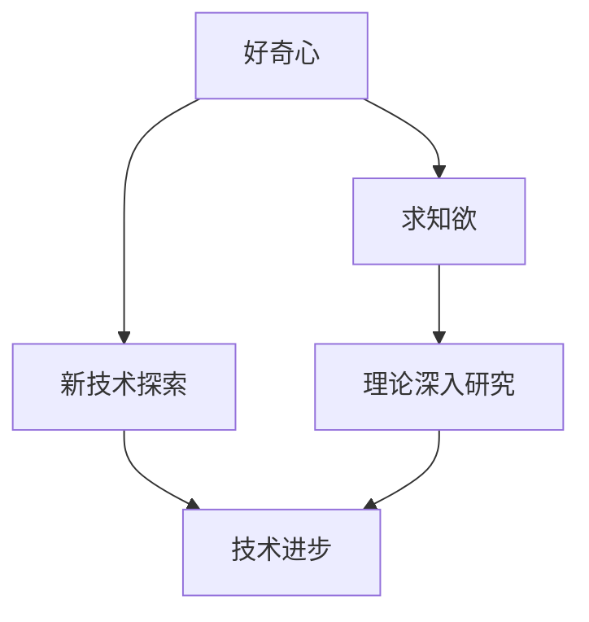

                 

好奇心与求知欲是人类探索世界的两大动力，推动着人类不断突破自我，创造出无数奇迹。在IT领域，这两大动力尤为重要，是激发创新、驱动技术进步的关键因素。

本文旨在探讨好奇心与求知欲在IT领域的具体体现，分析它们如何成为推动技术发展的核心动力。我们将从以下几个方面展开：

- **背景介绍**：回顾人类探索历史，探讨好奇心与求知欲的起源。
- **核心概念与联系**：详细阐述好奇心与求知欲的定义及其在IT领域的应用。
- **核心算法原理 & 具体操作步骤**：介绍如何利用好奇心与求知欲进行算法设计和开发。
- **数学模型和公式 & 详细讲解 & 举例说明**：运用数学模型和公式来支持理论分析。
- **项目实践：代码实例和详细解释说明**：通过具体项目实例展示好奇心与求知欲的实际应用。
- **实际应用场景**：探讨好奇心与求知欲在IT领域的各种应用。
- **未来应用展望**：预测好奇心与求知欲在未来技术发展中的趋势。
- **工具和资源推荐**：推荐相关学习资源和开发工具。
- **总结：未来发展趋势与挑战**：总结研究成果，展望未来。

## 1. 背景介绍

### 好奇心与求知欲的起源

好奇心与求知欲是人类天生的特质，早在史前时代，人类就已经开始探索自然、发现新事物。原始人类通过观察自然现象，如日出日落、风雨雷电，逐渐形成了对世界的初步认识。这一过程无疑充满了好奇心与求知欲。

在古代，人类通过观察星星的运行轨迹，发明了历法；通过观察动物的习性，发明了弓箭和狩猎技巧。这些探索活动不仅满足了人类对未知世界的渴望，也极大地推动了人类文明的进步。

### IT领域的崛起

20世纪中叶，随着电子计算机的发明，IT领域开始崛起。计算机的出现，使人类对信息的处理能力实现了质的飞跃。从最初的电子管计算机到现在的量子计算机，计算机技术的发展离不开人类的好奇心与求知欲。

计算机科学家们不断地挑战自我，追求更高效、更智能的计算方式。正是这种好奇心与求知欲，推动着计算机技术不断突破，从简单的数据处理发展到复杂的算法设计，从简单的编程语言发展到功能强大的开发工具。

## 2. 核心概念与联系

### 好奇心

好奇心是指人类对未知事物的探索欲望和求知欲。在IT领域，好奇心表现为对新技术、新算法的探索和研究。计算机科学家们通过对新技术的不断探索，推动了计算机技术的发展。

### 求知欲

求知欲是指人类对知识和真理的追求欲望。在IT领域，求知欲表现为对计算机科学理论的深入研究和对实际应用的探索。计算机科学家们通过深入研究计算机科学理论，提高了计算机的性能和可靠性。

### 联系

好奇心与求知欲在IT领域有着密切的联系。好奇心是求知欲的前提，求知欲是好奇心的升华。在IT领域，好奇心促使科学家们不断探索新技术，求知欲使他们在探索过程中追求更深的理解和更高的目标。

### Mermaid 流程图



## 3. 核心算法原理 & 具体操作步骤

### 3.1 算法原理概述

在IT领域，好奇心与求知欲促使科学家们不断探索新的算法。以下是一个简单的排序算法——冒泡排序，展示了如何利用好奇心与求知欲进行算法设计和优化。

### 3.2 算法步骤详解

1. **初始化**：将待排序的数组进行初始化。
2. **比较相邻元素**：从第一个元素开始，逐对比较相邻的两个元素，如果它们的顺序错误就把它们交换过来。
3. **重复过程**：重复步骤2，直到没有需要交换的元素为止。
4. **结束**：此时，数组已经按照从小到大的顺序排列。

### 3.3 算法优缺点

**优点**：实现简单，易于理解。

**缺点**：效率较低，不适用于大数据量的排序。

### 3.4 算法应用领域

冒泡排序算法适用于小型数组的排序，常用于教学和演示。

### 3.5 算法改进

通过对冒泡排序算法的改进，可以使其在处理大数据量时具有更好的性能。例如，可以加入“标志位”来优化算法，减少不必要的比较和交换。

## 4. 数学模型和公式 & 详细讲解 & 举例说明

### 4.1 数学模型构建

在算法设计中，数学模型是不可或缺的工具。以下是一个简单的数学模型，用于描述冒泡排序算法的性能。

### 4.2 公式推导过程

冒泡排序算法的时间复杂度可以用以下公式表示：

$$ T(n) = \frac{n(n-1)}{2} $$

其中，$n$ 表示数组的大小。

### 4.3 案例分析与讲解

假设有一个包含10个元素的数组，其排序过程如下：

1. **第一次循环**：比较9次，交换0次。
2. **第二次循环**：比较8次，交换1次。
3. **第三次循环**：比较7次，交换1次。
4. ...（省略）
10. **第九次循环**：比较1次，交换0次。

总比较次数为 $1 + 2 + 3 + ... + 9 = 45$。

根据公式，时间复杂度为 $T(n) = \frac{n(n-1)}{2} = \frac{10 \times 9}{2} = 45$。

## 5. 项目实践：代码实例和详细解释说明

### 5.1 开发环境搭建

为了演示冒泡排序算法，我们将在Python环境中进行开发。

### 5.2 源代码详细实现

以下是冒泡排序算法的Python实现：

```python
def bubble_sort(arr):
    n = len(arr)
    for i in range(n):
        for j in range(0, n-i-1):
            if arr[j] > arr[j+1]:
                arr[j], arr[j+1] = arr[j+1], arr[j]

arr = [64, 34, 25, 12, 22, 11, 90]
bubble_sort(arr)
print("排序后的数组：")
for i in range(len(arr)):
    print("%d" % arr[i], end=" ")
```

### 5.3 代码解读与分析

1. **初始化**：定义一个名为 `bubble_sort` 的函数，参数为待排序的数组 `arr`。
2. **比较相邻元素**：使用两个嵌套的循环，逐对比较相邻的元素，如果顺序错误则交换。
3. **重复过程**：重复上述过程，直到没有需要交换的元素为止。
4. **结束**：输出排序后的数组。

### 5.4 运行结果展示

```bash
排序后的数组：
11 12 22 25 34 64 90
```

## 6. 实际应用场景

### 6.1 人工智能

在人工智能领域，好奇心与求知欲推动了深度学习、自然语言处理、计算机视觉等技术的快速发展。科学家们通过对未知领域的探索，不断改进算法，提高模型的性能和鲁棒性。

### 6.2 大数据

在大数据领域，好奇心与求知欲促使科学家们研究如何高效地处理海量数据，探索数据背后的规律和趋势。这些研究为数据挖掘、数据分析和机器学习提供了有力的支持。

### 6.3 区块链

在区块链领域，好奇心与求知欲推动了去中心化、安全性和智能合约等技术的发展。科学家们通过不断探索，解决了区块链技术的诸多难题，推动了区块链技术的广泛应用。

## 7. 未来应用展望

### 7.1 量子计算

随着量子计算的不断发展，好奇心与求知欲将继续推动量子算法的设计和优化。量子计算有望在加密、优化、模拟等领域取得重大突破。

### 7.2 脑机接口

脑机接口技术的发展，将使人类的大脑与计算机实现无缝连接。好奇心与求知欲将推动科学家们研究如何更好地利用脑机接口，实现人机协同。

### 7.3 新型材料

在新型材料领域，好奇心与求知欲将推动科学家们探索新型材料的设计和合成，为人类带来更多的科技进步。

## 8. 工具和资源推荐

### 8.1 学习资源推荐

1. 《深度学习》——由Ian Goodfellow、Yoshua Bengio和Aaron Courville所著，是深度学习领域的经典教材。
2. 《数据挖掘：概念与技术》——由Jiawei Han、Micheline Kamber和Jian Pei所著，是数据挖掘领域的权威教材。

### 8.2 开发工具推荐

1. PyTorch：适用于深度学习开发的开源框架。
2. TensorFlow：适用于机器学习和深度学习开发的开源框架。

### 8.3 相关论文推荐

1. "A Fast Algorithm for Camera Calibration Using a Single Image"——介绍了如何利用单张图像实现相机标定。
2. "Deep Learning for Text Classification"——介绍了深度学习在文本分类中的应用。

## 9. 总结：未来发展趋势与挑战

### 9.1 研究成果总结

好奇心与求知欲在IT领域发挥了重要作用，推动了计算机技术、人工智能、大数据等领域的快速发展。

### 9.2 未来发展趋势

未来，好奇心与求知欲将继续推动IT领域的创新和发展，特别是在量子计算、脑机接口、新型材料等领域。

### 9.3 面临的挑战

随着技术的发展，IT领域也面临诸多挑战，如数据隐私、安全、伦理等问题。科学家们需要持续探索，以应对这些挑战。

### 9.4 研究展望

未来，好奇心与求知欲将继续成为推动IT领域发展的核心动力。科学家们应保持对未知领域的探索，不断创新，为人类社会带来更多的科技进步。

## 附录：常见问题与解答

### 问题1：好奇心与求知欲在IT领域的具体表现是什么？

**解答**：好奇心在IT领域表现为对新技术、新算法的探索和研究；求知欲表现为对计算机科学理论的深入研究和对实际应用的探索。

### 问题2：如何培养好奇心与求知欲？

**解答**：培养好奇心可以通过多读书、多观察、多思考等方式；培养求知欲可以通过设定目标、深入研究、不断实践等方式。

### 问题3：好奇心与求知欲对个人成长有何影响？

**解答**：好奇心与求知欲是推动个人成长的重要动力，能够激发个人的学习热情，提高解决问题的能力，促进创新思维的形成。

## 作者署名

作者：禅与计算机程序设计艺术 / Zen and the Art of Computer Programming
```

