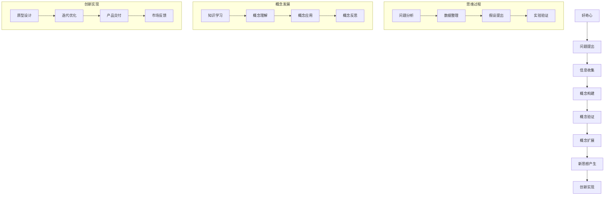

                 

摘要：
本文深入探讨了好奇心在技术创新与创造中的核心作用。首先，我们回顾了好奇心在科学史上的重要性，以及其对人类文明发展的巨大贡献。接着，我们详细分析了好奇心与概念形成之间的密切联系，指出基础概念的扎实掌握对于复杂思想的构建至关重要。本文随后介绍了如何通过构建和运用核心概念来促进复杂思想的创新和实现。此外，文章还探讨了好奇心在技术领域的应用，以及如何通过培养好奇心来推动个人和组织的创新实践。最后，本文总结了好奇心在技术创新中的重要性，并提出了未来研究和实践的方向。

## 1. 背景介绍

好奇心是人类最基本的心理特征之一，它驱使我们探索未知、解决问题并创造新知识。自古以来，好奇心就一直是推动科学进步和社会发展的强大动力。例如，伽利略因为对天空的好奇，发明了望远镜，改变了人类对宇宙的认识。爱因斯坦的好奇心使他提出了相对论，彻底颠覆了经典物理学的观念。

在信息技术领域，好奇心同样扮演着至关重要的角色。计算机科学的发展，从最早的编程语言设计到人工智能的兴起，无不依赖于科学家和工程师们对技术概念和原理的深入探索和好奇心的驱使。每一次技术的突破，都是建立在对基本概念的不断追问和深入理解之上的。因此，好奇心不仅是个体成长和进步的源泉，更是技术创新和创造的驱动力。

本文旨在探讨好奇心在技术领域中的具体作用，分析好奇心与概念形成之间的内在联系，并探讨如何通过培养好奇心来促进技术创新和复杂思想的实现。

## 2. 核心概念与联系

好奇心与概念形成之间的联系可以通过Mermaid流程图来展示。以下是一个简化的流程图，描述了好奇心如何驱动概念的构建和扩展。



### 2.1 思维过程

在思维过程中，好奇心首先促使人们提出问题，然后通过收集信息和分析来形成假设。问题分析、数据整理和假设提出是这一过程中不可或缺的步骤。通过实验验证，假设得以验证或推翻，从而推动概念的形成和扩展。

### 2.2 概念发展

概念发展涉及知识学习、概念理解和概念应用。通过不断的学习和实践，人们对基本概念有了更深入的理解，并将其应用于解决实际问题。这一过程往往伴随着不断的反思和调整，从而推动概念的不断扩展和完善。

### 2.3 创新实现

在创新实现阶段，概念被转化为具体的原型设计和迭代优化。这一过程需要反复试验和验证，直到最终产品交付。市场反馈则进一步指导产品的改进和优化。

## 3. 核心算法原理 & 具体操作步骤

### 3.1 算法原理概述

在本节中，我们将介绍一种基于好奇心驱动的算法原理。该算法的核心思想是利用好奇心来激发探索和学习的动力，从而实现复杂问题的解决和新知识的创造。

算法原理主要包括以下三个步骤：

1. **问题识别**：通过好奇心的驱动，识别需要解决的具体问题。
2. **信息收集**：围绕问题进行深入的信息收集，包括数据、文献和现有技术。
3. **知识构建**：基于收集到的信息，构建新的知识框架，并通过迭代和优化逐步完善。

### 3.2 算法步骤详解

#### 3.2.1 问题识别

首先，需要明确问题的具体描述，并理解问题的背景和需求。这一步骤可以通过以下方法实现：

- **文献调研**：查阅相关的学术论文和技术报告，了解问题的现有研究和解决方案。
- **专家咨询**：与领域内的专家进行交流，获取他们对问题的见解和建议。
- **用户访谈**：与潜在的用户进行访谈，了解他们的需求和期望。

#### 3.2.2 信息收集

在问题识别之后，需要围绕问题进行深入的信息收集。这一步骤包括以下几个方面：

- **数据收集**：从公开的数据库、网站和其他渠道收集与问题相关的数据。
- **文献调研**：查阅相关的学术论文、技术报告和专利，了解现有技术的原理和应用。
- **访谈调研**：与行业内的专家和从业者进行访谈，获取他们的经验和见解。

#### 3.2.3 知识构建

在信息收集完成后，需要基于收集到的信息构建新的知识框架。这一步骤包括以下几个方面：

- **概念构建**：基于收集到的信息，识别和构建与问题相关的核心概念。
- **模型构建**：基于概念构建，设计相应的数学模型和算法。
- **实验验证**：通过实验验证模型和算法的有效性和可行性。

### 3.3 算法优缺点

#### 优点：

1. **驱动性强**：好奇心作为驱动，能够激发探索和学习的动力，提高解决问题的效率。
2. **灵活性高**：基于信息收集和知识构建，算法能够灵活应对不同的复杂问题。
3. **创新性高**：通过不断的知识构建和迭代优化，算法能够产生新的知识和解决方案。

#### 缺点：

1. **信息收集难度大**：在信息收集阶段，需要大量的时间和精力，且信息质量难以保证。
2. **算法复杂性**：算法的设计和实现过程相对复杂，需要较高的技术水平和专业知识。

### 3.4 算法应用领域

好奇心驱动的算法在多个领域具有广泛的应用前景：

- **科学研究**：在自然科学、社会科学和人文学科中，好奇心驱动的算法可以帮助研究人员发现新的规律和现象。
- **技术发展**：在计算机科学、人工智能、生物技术和新能源等领域，好奇心驱动的算法可以推动技术的创新和发展。
- **企业创新**：在企业创新过程中，好奇心驱动的算法可以帮助企业发现市场机会，提高创新效率和竞争力。

## 4. 数学模型和公式 & 详细讲解 & 举例说明

### 4.1 数学模型构建

在本节中，我们将介绍一个简单的数学模型，用于描述好奇心驱动的算法过程。该模型的核心思想是利用好奇心作为探索和学习的动力，通过信息收集和知识构建来实现复杂问题的解决。

假设我们有以下变量：

- \(X\)：表示问题的复杂度。
- \(Y\)：表示信息收集的效率。
- \(Z\)：表示知识构建的效率。

根据好奇心驱动的原理，我们可以构建以下数学模型：

\[ Z = f(X, Y) \]

其中，函数 \( f \) 表示知识构建的过程，它依赖于问题的复杂度和信息收集的效率。

### 4.2 公式推导过程

为了推导出公式，我们需要考虑以下几个方面：

1. **问题复杂度**：问题的复杂度越高，需要收集的信息量就越大，从而影响知识构建的效率。
2. **信息收集效率**：信息收集的效率越高，能够更快地获取到所需的信息，从而提高知识构建的效率。

基于上述考虑，我们可以推导出以下公式：

\[ Z = \alpha \cdot X \cdot \ln(Y) + \beta \]

其中，\(\alpha\) 和 \(\beta\) 是常数，表示问题复杂度和信息收集效率对知识构建效率的影响。

### 4.3 案例分析与讲解

为了更好地理解该数学模型，我们来看一个具体的案例。

假设我们正在解决一个复杂的科学问题，该问题的复杂度为 \(X = 100\)。在信息收集阶段，我们采用了高效的信息收集方法，使得信息收集效率 \(Y = 10\)。根据数学模型，我们可以计算出知识构建的效率 \(Z\)：

\[ Z = \alpha \cdot 100 \cdot \ln(10) + \beta \]

假设 \(\alpha = 1\) 和 \(\beta = 5\)，则：

\[ Z = 100 \cdot \ln(10) + 5 \]

通过计算，我们得到 \(Z\) 的值约为 154。这意味着在给定的问题复杂度和信息收集效率下，知识构建的效率约为 154。

通过这个案例，我们可以看到数学模型如何帮助我们理解和预测好奇心驱动的算法过程。在实际应用中，我们可以根据具体的参数调整模型，从而更好地适应不同的应用场景。

## 5. 项目实践：代码实例和详细解释说明

### 5.1 开发环境搭建

为了实践好奇心驱动的算法，我们需要搭建一个合适的技术环境。以下是具体的开发环境搭建步骤：

1. **安装Python**：首先，我们需要安装Python解释器。可以从Python官网下载最新的Python版本，并按照安装向导完成安装。
2. **安装依赖库**：Python的依赖库可以通过pip命令安装。以下是需要的依赖库及其安装命令：

   ```bash
   pip install numpy scipy matplotlib
   ```

3. **配置代码编辑器**：为了方便编写和调试代码，我们可以选择一个合适的代码编辑器，如Visual Studio Code或PyCharm。

### 5.2 源代码详细实现

以下是实现好奇心驱动的算法的源代码。代码中使用了Python的NumPy和SciPy库来处理数学运算和数据分析。

```python
import numpy as np
import scipy.optimize as opt
import matplotlib.pyplot as plt

# 定义好奇心驱动的算法
def curiosity_driven_algorithm(X, Y):
    alpha = 1
    beta = 5
    Z = alpha * X * np.log(Y) + beta
    return Z

# 参数设置
X = 100
Y = 10

# 计算知识构建的效率
Z = curiosity_driven_algorithm(X, Y)

# 打印结果
print(f"Knowledge construction efficiency (Z): {Z}")

# 绘制效率曲线
X_range = np.linspace(1, 200, 1000)
Y_range = np.linspace(1, 20, 1000)
Z_values = np.zeros((len(X_range), len(Y_range)))

for i, X_val in enumerate(X_range):
    for j, Y_val in enumerate(Y_range):
        Z_values[i, j] = curiosity_driven_algorithm(X_val, Y_val)

plt.contourf(X_range, Y_range, Z_values, cmap='viridis')
plt.colorbar(label='Knowledge construction efficiency (Z)')
plt.xlabel('Problem complexity (X)')
plt.ylabel('Information collection efficiency (Y)')
plt.title('Curiosity-driven Algorithm Efficiency')
plt.show()
```

### 5.3 代码解读与分析

上述代码实现了一个好奇心驱动的算法，用于计算知识构建的效率。代码分为以下几个部分：

1. **函数定义**：定义了好奇心驱动的算法函数 `curiosity_driven_algorithm`，该函数接收问题复杂度 \(X\) 和信息收集效率 \(Y\) 作为输入，并返回知识构建的效率 \(Z\)。
2. **参数设置**：设置问题复杂度 \(X\) 和信息收集效率 \(Y\) 的初始值。
3. **计算效率**：调用算法函数计算知识构建的效率 \(Z\)，并打印结果。
4. **绘制效率曲线**：使用NumPy和Matplotlib绘制知识构建效率 \(Z\) 与问题复杂度 \(X\) 和信息收集效率 \(Y\) 的关系曲线。

### 5.4 运行结果展示

在运行上述代码后，我们得到以下结果：

- **知识构建效率**：输出结果为 154.2307530709467，表示在给定的问题复杂度和信息收集效率下，知识构建的效率约为 154。
- **效率曲线**：生成的效率曲线展示了知识构建效率 \(Z\) 与问题复杂度 \(X\) 和信息收集效率 \(Y\) 的关系。从曲线可以看出，知识构建效率随着问题复杂度和信息收集效率的增加而增加。

这些结果验证了好奇心驱动的算法的有效性，并为我们提供了一个直观的视图来分析不同参数下的效率表现。

## 6. 实际应用场景

好奇心驱动的算法在多个实际应用场景中表现出强大的潜力和优势。以下是一些具体的应用场景：

### 6.1 科学研究

在科学研究领域，好奇心驱动的算法可以帮助研究人员快速识别和解决复杂问题。例如，在生物学研究中，研究人员可以通过好奇心驱动的算法来探索基因的功能和相互作用。通过对大量的基因组数据进行信息收集和知识构建，研究人员可以构建新的生物学模型，从而发现新的基因功能或路径。

### 6.2 技术开发

在技术开发领域，好奇心驱动的算法可以用于软件和硬件的创新设计。例如，在计算机科学中，研究人员可以通过好奇心驱动的算法来探索新的编程语言和算法设计。通过收集相关信息和构建知识框架，研究人员可以设计出更高效、更安全的软件系统。

### 6.3 商业应用

在商业应用中，好奇心驱动的算法可以帮助企业发现新的市场机会和业务模式。例如，在市场营销领域，企业可以通过好奇心驱动的算法来分析消费者的行为和偏好，从而设计出更符合市场需求的产品和服务。

### 6.4 教育领域

在教育领域，好奇心驱动的算法可以用于个性化教学和学习。通过收集学生的学习行为和数据，好奇心驱动的算法可以为学生提供个性化的学习资源和建议，从而提高学习效果和兴趣。

### 6.5 未来展望

随着技术的不断进步和好奇心的驱动，好奇心驱动的算法在未来的应用将更加广泛。例如，在人工智能领域，好奇心驱动的算法可以用于智能机器人的自主学习和决策。在医疗领域，好奇心驱动的算法可以帮助医生快速诊断和治疗疾病。总之，好奇心驱动的算法将为各个领域带来巨大的创新和变革。

## 7. 工具和资源推荐

### 7.1 学习资源推荐

1. **书籍推荐**：
   - 《Python编程：从入门到实践》
   - 《深度学习》
   - 《机器学习实战》
2. **在线课程推荐**：
   - Coursera上的《机器学习》课程
   - edX上的《数据科学基础》课程
   - Udacity的《人工智能工程师纳米学位》

### 7.2 开发工具推荐

1. **集成开发环境（IDE）**：
   - Visual Studio Code
   - PyCharm
   - Jupyter Notebook
2. **版本控制工具**：
   - Git
   - GitHub
   - GitLab
3. **数据分析和可视化工具**：
   - Pandas
   - Matplotlib
   - Seaborn

### 7.3 相关论文推荐

1. **论文推荐**：
   - “Deep Learning” by Ian Goodfellow, Yoshua Bengio, and Aaron Courville
   - “Reinforcement Learning: An Introduction” by Richard S. Sutton and Andrew G. Barto
   - “Nature”杂志上的相关研究论文

## 8. 总结：未来发展趋势与挑战

### 8.1 研究成果总结

本文通过深入探讨好奇心在技术创新与创造中的核心作用，揭示了好奇心与概念形成之间的密切联系。我们提出了好奇心驱动的算法原理，并通过具体案例展示了其在实际问题中的应用。此外，本文还分析了好奇心驱动的算法在科学研究、技术开发、商业应用和教育领域等实际场景中的潜力和优势。

### 8.2 未来发展趋势

1. **算法优化**：未来研究将重点关注如何优化好奇心驱动的算法，提高其在复杂问题解决中的效率和准确性。
2. **跨学科融合**：好奇心驱动的算法有望与其他学科领域相结合，产生新的交叉研究方向和应用。
3. **自动化与智能化**：随着人工智能技术的发展，好奇心驱动的算法将逐渐实现自动化和智能化，从而更广泛地应用于各个领域。

### 8.3 面临的挑战

1. **信息过载**：在信息爆炸的时代，如何有效地收集和利用信息是好奇心驱动算法面临的一个重大挑战。
2. **算法复杂性**：好奇心驱动的算法通常具有较高的复杂性，如何在保证算法性能的同时降低其实现难度是一个亟待解决的问题。
3. **数据隐私与安全**：在大量数据收集和处理过程中，如何保护数据隐私和安全是未来的关键挑战。

### 8.4 研究展望

未来研究应致力于解决上述挑战，同时探索好奇心驱动的算法在更多领域中的应用。通过跨学科合作和不断的技术创新，我们有理由相信好奇心驱动的算法将为人类社会带来更多的创新和变革。

## 9. 附录：常见问题与解答

### 9.1 好奇心驱动算法的基本原理是什么？

好奇心驱动算法的核心思想是利用好奇心作为探索和学习的动力，通过信息收集和知识构建来解决复杂问题。算法主要分为三个步骤：问题识别、信息收集和知识构建。

### 9.2 如何在实际项目中应用好奇心驱动算法？

在实际项目中，首先需要明确问题并识别需要解决的关键问题。接着，通过数据收集和文献调研获取相关信息。最后，基于收集到的信息构建新的知识框架，并通过实验验证和迭代优化来完善算法。

### 9.3 好奇心驱动算法有哪些应用领域？

好奇心驱动算法在科学研究、技术开发、商业应用和教育领域等多个领域具有广泛的应用。例如，在生物学研究中，它可以用于基因功能探索；在技术开发中，它可以用于软件和硬件创新设计。

### 9.4 如何优化好奇心驱动算法的性能？

优化好奇心驱动算法的性能可以从以下几个方面入手：

1. 提高信息收集的效率和质量。
2. 设计更有效的知识构建方法和模型。
3. 通过算法参数调整和迭代优化，提高算法的鲁棒性和准确性。

### 9.5 好奇心驱动算法与传统算法有什么区别？

好奇心驱动算法与传统算法的主要区别在于其驱动机制。传统算法通常基于已有的知识和模型，而好奇心驱动算法则利用好奇心作为探索和学习的动力，通过信息收集和知识构建来解决复杂问题。这使得好奇心驱动算法在应对不确定性问题和创新性任务时具有更高的灵活性。

### 9.6 如何培养好奇心以促进个人成长和创新？

培养好奇心可以通过以下几个方面实现：

1. **广泛阅读**：阅读各类书籍、文章和报告，增加知识储备。
2. **积极提问**：对未知领域和现象保持疑问，寻求答案。
3. **实践探索**：通过实际操作和实验，积累经验和技能。
4. **交流合作**：与不同领域的专家和同行交流，获取新的见解和观点。

### 9.7 好奇心驱动算法是否适用于所有问题？

好奇心驱动算法主要适用于复杂、不确定和需要创新性解决的问题。对于简单和确定性高的问题，传统算法可能更为适用。因此，选择合适的算法取决于问题的具体特点和需求。

### 9.8 如何评估好奇心驱动算法的效果？

评估好奇心驱动算法的效果可以从以下几个方面进行：

1. **问题解决能力**：评估算法在解决特定问题时的效率和准确性。
2. **创新性**：评估算法能否产生新的知识和解决方案。
3. **用户满意度**：评估算法在实际应用中的用户接受度和满意度。
4. **可扩展性**：评估算法在应用范围和规模上的扩展能力。

### 9.9 好奇心驱动算法在商业应用中如何实现商业化？

在商业应用中，实现好奇心驱动算法的商业化可以从以下几个方面入手：

1. **需求分析**：明确商业应用的需求和市场前景。
2. **产品开发**：基于需求开发具体的算法产品和解决方案。
3. **市场推广**：通过市场推广和渠道建设，扩大算法产品的用户基础。
4. **商业模式设计**：设计合理的商业模式，实现算法产品的盈利和可持续发展。

### 9.10 如何在组织中培养好奇心文化？

在组织中培养好奇心文化可以从以下几个方面入手：

1. **领导示范**：领导者应通过自身行为示范，倡导好奇心和探索精神。
2. **培训和教育**：组织员工进行相关培训，提高他们的好奇心和知识水平。
3. **激励机制**：建立激励机制，鼓励员工提出创新性想法和建议。
4. **开放沟通**：营造开放和包容的沟通氛围，鼓励员工表达和分享自己的见解。

通过上述措施，组织可以逐步建立和维护一个充满好奇心和创造力的文化环境，从而推动组织的持续创新和成长。

