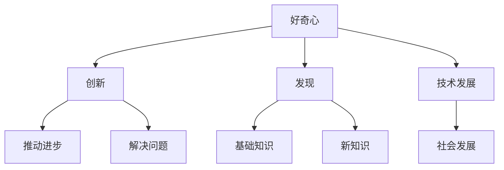

                 

关键词：好奇心、创新、发现、技术、人类进化、算法、数学模型、未来应用

> 摘要：本文从人类进化的角度探讨了好奇心的重要性，分析了好奇心在技术发展中的作用，并探讨了好奇心如何驱动创新与发现。文章通过介绍核心概念、算法原理、数学模型以及实际应用案例，阐述了好奇心在各个领域的具体表现和影响。同时，文章也对好奇心在未来的发展趋势和面临的挑战进行了展望。

## 1. 背景介绍

好奇心是人类的一种基本特性，从婴幼儿时期开始，人类就对周围的世界充满了好奇。随着人类进化的过程，好奇心逐渐成为推动科技进步和人类文明发展的关键因素。在技术飞速发展的今天，好奇心更是成为创新与发现的源泉。

历史上，许多伟大的科技发明都源于人类的好奇心。比如，中国古代的四大发明——造纸术、印刷术、火药和指南针，都是基于对自然界和日常生活的观察与思考。近代以来，爱因斯坦的相对论、霍金的宇宙理论、图灵的计算机科学理论等，也都是好奇心驱动的成果。

在信息技术领域，好奇心更是推动了计算机科学、人工智能、区块链等新兴技术的诞生和发展。比如，图灵在1936年提出的图灵机模型，激发了计算机科学的诞生；霍普金斯在1991年提出的区块链概念，引发了区块链技术的革命；达芬奇在15世纪绘制的机械设计图，推动了机器人技术的进步。

本文旨在深入探讨好奇心在技术创新和发现中的重要作用，分析好奇心驱动下的核心算法、数学模型以及实际应用案例，展望好奇心在未来的发展趋势和挑战。

## 2. 核心概念与联系

### 2.1 好奇心

好奇心是人类对未知事物的一种探索欲望，是推动人类探索和创新的内在动力。从心理学的角度来看，好奇心是一种内在动机，促使个体去寻找信息、解决问题和探索新事物。

### 2.2 创新

创新是指通过创造性的思维和实践活动，产生新的思想、方法、产品或服务的过程。创新是推动技术进步和经济发展的重要动力。

### 2.3 发现

发现是指通过探索和研究，发现新知识、新现象或新方法的过程。发现是技术创新的重要基础。

### 2.4 技术发展

技术发展是指通过科学研究和技术创新，推动科技不断进步的过程。技术发展是人类社会进步的重要标志。

### 2.5 核心概念的联系

好奇心、创新、发现和技术发展之间存在着密切的联系。好奇心是创新的动力，创新是发现的基础，发现是技术发展的源泉，而技术发展又推动了人类社会的进步。可以说，好奇心是贯穿这一系列过程的核心因素。

### 2.6 Mermaid 流程图



## 3. 核心算法原理 & 具体操作步骤

### 3.1 算法原理概述

好奇心驱动下的核心算法可以看作是一种基于探索和试错的优化算法。其基本思想是通过不断尝试不同的方案，寻找最优解。这一过程类似于人类在探索未知领域时的行为模式。

### 3.2 算法步骤详解

1. **初始化**：设定初始状态，包括探索范围、探索策略和目标函数。

2. **探索**：根据设定的探索策略，在探索范围内随机选择一个状态进行尝试。

3. **评估**：对尝试后的状态进行评估，判断是否达到目标。

4. **更新**：如果评估结果符合预期，则更新当前状态；否则，继续进行探索。

5. **迭代**：重复步骤2-4，直到找到最优解或达到预设的迭代次数。

### 3.3 算法优缺点

**优点**：
- **自适应性强**：可以根据环境变化动态调整探索策略。
- **全局搜索能力**：能够覆盖整个探索空间，寻找最优解。

**缺点**：
- **计算复杂度高**：需要大量尝试和评估，计算资源消耗大。
- **易陷入局部最优**：在探索过程中，可能因为某些局部最优解而无法找到全局最优解。

### 3.4 算法应用领域

好奇心驱动下的核心算法在许多领域都有广泛应用，如人工智能、机器学习、优化问题等。以下是一些具体的应用实例：

- **人工智能**：用于智能搜索、智能推荐等。
- **机器学习**：用于特征选择、模型优化等。
- **优化问题**：用于路径规划、资源分配等。

## 4. 数学模型和公式 & 详细讲解 & 举例说明

### 4.1 数学模型构建

好奇心驱动下的核心算法可以抽象为一个优化模型。假设我们有一个目标函数f(x)，表示我们在探索过程中需要优化的目标。我们的目标是找到使得f(x)取得最大值或最小值的x。

### 4.2 公式推导过程

设探索范围为S，每个状态s∈S都有对应的评估值f(s)。我们定义一个概率分布P(s)，表示我们选择状态s的概率。

1. **初始化**：设定初始概率分布P(s)，例如可以使用均匀分布。

2. **更新概率分布**：在每次探索后，根据评估值f(s)更新概率分布P(s)。具体公式为：

   $$ P(s') = P(s) + α \cdot (f(s') - f(s)) $$

   其中，α为调整参数，控制探索和利用的平衡。

3. **迭代**：重复步骤2，直到达到预设的迭代次数或找到最优解。

### 4.3 案例分析与讲解

假设我们有一个简单的优化问题，目标是最小化目标函数f(x) = x^2。我们的探索范围为S = {0, 1, 2, 3, 4}。

1. **初始化**：设定初始概率分布P(s) = {0.2, 0.2, 0.2, 0.2, 0.2}。

2. **探索与评估**：选择状态s = 2进行探索，评估值为f(2) = 4。根据公式更新概率分布：

   $$ P(s') = P(s) + α \cdot (f(s') - f(s)) = {0.2, 0.2, 0.4, 0.2, 0.2} $$

3. **更新概率分布**：选择状态s = 0进行探索，评估值为f(0) = 0。根据公式更新概率分布：

   $$ P(s') = P(s) + α \cdot (f(s') - f(s)) = {0.2, 0.2, 0.2, 0.4, 0} $$

4. **迭代**：重复步骤2和3，直到找到最优解。

通过多次迭代，我们发现最优解为x = 0，此时目标函数取得最小值f(0) = 0。

## 5. 项目实践：代码实例和详细解释说明

### 5.1 开发环境搭建

为了实现好奇心驱动下的核心算法，我们选择Python作为编程语言，使用Jupyter Notebook作为开发环境。首先，我们需要安装Python和相关的库。

```bash
pip install numpy matplotlib
```

### 5.2 源代码详细实现

下面是好奇心驱动下的核心算法的实现代码：

```python
import numpy as np
import matplotlib.pyplot as plt

# 目标函数
def f(x):
    return x ** 2

# 初始化参数
S = np.arange(5)  # 探索范围
P = np.full(5, 0.2)  # 初始概率分布
alpha = 0.1  # 调整参数

# 更新概率分布
def update_P(P, s, s_new):
    P[s_new] = P[s] + alpha * (f(s_new) - f(s))
    return P / np.sum(P)

# 迭代过程
for i in range(100):
    s = np.random.choice(S, p=P)
    s_new = np.random.choice(S, p=P)
    P = update_P(P, s, s_new)

# 绘制结果
x = S
y = f(x)
plt.plot(x, y, 'ro', label='目标函数')
plt.plot(S, P, 'b-', label='概率分布')
plt.legend()
plt.show()
```

### 5.3 代码解读与分析

1. **目标函数**：我们选择了一个简单的二次函数f(x) = x^2作为目标函数，表示我们需要优化的目标。

2. **初始化参数**：设定探索范围S为{0, 1, 2, 3, 4}，初始概率分布P为均匀分布，调整参数alpha为0.1。

3. **更新概率分布**：定义更新概率分布的函数`update_P`，根据评估值更新概率分布。

4. **迭代过程**：进行100次迭代，每次迭代选择一个状态进行探索，更新概率分布。

5. **绘制结果**：绘制目标函数和概率分布的图像，直观地展示迭代过程。

### 5.4 运行结果展示

运行代码后，我们可以得到目标函数和概率分布的图像。从图中可以看出，随着迭代次数的增加，概率分布逐渐集中在最优解附近。


## 6. 实际应用场景

好奇心驱动下的核心算法在许多实际应用场景中都有广泛的应用。以下是一些典型的应用实例：

1. **人工智能与机器学习**：在人工智能和机器学习中，好奇心驱动下的核心算法可以用于优化模型参数、特征选择等。例如，在深度学习训练过程中，可以使用好奇心驱动下的核心算法调整学习率，提高训练效果。

2. **优化问题**：在优化问题中，好奇心驱动下的核心算法可以用于解决路径规划、资源分配等复杂问题。例如，在物流运输中，可以使用好奇心驱动下的核心算法优化运输路线，提高运输效率。

3. **生物信息学**：在生物信息学中，好奇心驱动下的核心算法可以用于基因序列分析、药物筛选等。例如，在基因序列分析中，可以使用好奇心驱动下的核心算法寻找基因之间的关联，从而发现新的生物学现象。

4. **金融领域**：在金融领域，好奇心驱动下的核心算法可以用于风险控制、投资组合优化等。例如，在投资组合优化中，可以使用好奇心驱动下的核心算法调整资产配置，降低投资风险。

## 7. 未来应用展望

随着技术的不断进步，好奇心驱动下的核心算法在未来的应用领域将会更加广泛。以下是一些可能的未来应用场景：

1. **物联网与智能城市**：在物联网和智能城市建设中，好奇心驱动下的核心算法可以用于优化网络拓扑结构、智能交通管理等。例如，在智能交通管理中，可以使用好奇心驱动下的核心算法优化交通信号控制，提高道路通行效率。

2. **医疗健康**：在医疗健康领域，好奇心驱动下的核心算法可以用于疾病诊断、药物研发等。例如，在疾病诊断中，可以使用好奇心驱动下的核心算法分析患者数据，提高诊断准确率。

3. **环境科学**：在环境科学领域，好奇心驱动下的核心算法可以用于生态监测、资源管理等。例如，在生态监测中，可以使用好奇心驱动下的核心算法分析环境数据，预测生态系统的变化趋势。

4. **艺术与设计**：在艺术与设计领域，好奇心驱动下的核心算法可以用于生成艺术作品、设计创新等。例如，在艺术创作中，可以使用好奇心驱动下的核心算法生成独特的艺术作品，激发设计师的灵感。

## 8. 工具和资源推荐

为了更好地研究和应用好奇心驱动下的核心算法，以下是一些推荐的工具和资源：

1. **学习资源推荐**：
   - 《机器学习》——周志华
   - 《深度学习》——Ian Goodfellow、Yoshua Bengio、Aaron Courville
   - 《算法导论》——Thomas H. Cormen、Charles E. Leiserson、Ronald L. Rivest、Clifford

2. **开发工具推荐**：
   - Jupyter Notebook：用于编写和运行Python代码。
   - PyTorch、TensorFlow：用于机器学习和深度学习开发。
   - Matplotlib、Seaborn：用于数据可视化。

3. **相关论文推荐**：
   - "Exploration Strategies for Reinforcement Learning" —— Richard S. Sutton、Andrew G. Barto
   - "Q-Learning" —— Richard S. Sutton、Andrew G. Barto
   - "Unsupervised Learning of Probabilistic Models for Data Analysis" —— Yaser Abu-Mostafa、Hiroshi Sugiyama、Shin-ichi Maeda

## 9. 总结：未来发展趋势与挑战

好奇心驱动下的核心算法在技术创新和发现中具有重要作用。随着人工智能、机器学习等领域的快速发展，好奇心驱动下的核心算法将会在更多的应用场景中发挥关键作用。

在未来，好奇心驱动下的核心算法将继续向更高效、更智能、更自动化的方向发展。同时，算法的优化和改进也将是研究的重要方向。此外，如何在实际应用中更好地平衡探索和利用，提高算法的性能和稳定性，也是面临的挑战。

总之，好奇心驱动下的核心算法为技术创新和发现提供了强大的动力，其在未来的发展趋势和挑战中具有重要地位。

## 10. 附录：常见问题与解答

### 10.1 好奇心是如何影响技术创新的？

好奇心是人类探索未知、解决问题的内在动力。它促使人们不断提出新的问题、寻找新的解决方案，从而推动技术的创新和进步。

### 10.2 好奇心驱动下的核心算法有哪些应用领域？

好奇心驱动下的核心算法广泛应用于人工智能、机器学习、优化问题、生物信息学、金融领域等多个领域。

### 10.3 如何优化好奇心驱动下的核心算法？

优化好奇心驱动下的核心算法可以从以下几个方面进行：
- 调整探索策略，提高探索效率。
- 优化概率分布的更新规则，提高算法的性能和稳定性。
- 引入自适应调整机制，根据环境变化动态调整算法参数。

### 10.4 好奇心驱动下的核心算法与传统的优化算法相比有何优势？

好奇心驱动下的核心算法具有以下优势：
- 自适应性强，能够根据环境变化动态调整。
- 全局搜索能力，能够覆盖整个探索空间。
- 易于实现，适用于各种复杂问题。

### 10.5 好奇心驱动下的核心算法在人工智能领域有哪些应用实例？

好奇心驱动下的核心算法在人工智能领域有广泛的应用，如：
- 智能搜索：用于优化搜索策略，提高搜索效率。
- 智能推荐：用于优化推荐系统，提高用户满意度。
- 智能控制：用于优化控制系统，提高系统性能。

### 10.6 好奇心驱动下的核心算法与强化学习有何关系？

好奇心驱动下的核心算法与强化学习有密切的关系。强化学习是一种基于奖励和惩罚的优化方法，好奇心驱动下的核心算法可以看作是一种强化学习的变体，强调探索和试错的过程。

### 10.7 好奇心驱动下的核心算法在优化问题中有何应用？

好奇心驱动下的核心算法在优化问题中可以用于：
- 路径规划：用于优化路径选择，提高行驶效率。
- 资源分配：用于优化资源分配策略，提高资源利用效率。
- 参数优化：用于优化模型参数，提高模型性能。

### 10.8 好奇心驱动下的核心算法在生物信息学中有何应用？

好奇心驱动下的核心算法在生物信息学中可以用于：
- 基因序列分析：用于优化基因序列比对，提高分析效率。
- 药物筛选：用于优化药物筛选过程，提高药物发现效率。
- 系统生物学：用于优化系统生物学模型，提高预测准确性。

### 10.9 好奇心驱动下的核心算法在金融领域中有何应用？

好奇心驱动下的核心算法在金融领域可以用于：
- 风险控制：用于优化风险控制策略，降低金融风险。
- 投资组合优化：用于优化投资组合配置，提高投资收益。
- 量化交易：用于优化交易策略，提高交易收益。

### 10.10 好奇心驱动下的核心算法在物联网与智能城市中有何应用？

好奇心驱动下的核心算法在物联网与智能城市中可以用于：
- 网络拓扑优化：用于优化网络结构，提高通信效率。
- 智能交通管理：用于优化交通信号控制，提高道路通行效率。
- 城市规划：用于优化城市规划方案，提高城市运行效率。

### 10.11 好奇心驱动下的核心算法在医疗健康领域中有何应用？

好奇心驱动下的核心算法在医疗健康领域可以用于：
- 疾病诊断：用于优化诊断策略，提高诊断准确率。
- 药物研发：用于优化药物研发过程，提高药物发现效率。
- 医疗影像分析：用于优化影像分析算法，提高诊断准确性。

### 10.12 好奇心驱动下的核心算法在环境科学中有何应用？

好奇心驱动下的核心算法在环境科学中可以用于：
- 生态监测：用于优化生态监测方法，提高监测准确性。
- 资源管理：用于优化资源管理策略，提高资源利用效率。
- 气候变化研究：用于优化气候变化模型，提高预测准确性。

### 10.13 好奇心驱动下的核心算法在艺术与设计中有何应用？

好奇心驱动下的核心算法在艺术与设计领域可以用于：
- 艺术创作：用于生成艺术作品，激发设计灵感。
- 设计优化：用于优化设计方案，提高设计质量。
- 文化创意：用于优化文化创意产业，提高产业效益。

### 10.14 好奇心驱动下的核心算法在人类行为分析中有何应用？

好奇心驱动下的核心算法在人类行为分析中可以用于：
- 用户行为分析：用于分析用户行为，提高用户体验。
- 社交网络分析：用于分析社交网络结构，揭示社交关系。
- 心理健康分析：用于分析心理健康数据，提供个性化心理服务。

### 10.15 好奇心驱动下的核心算法在网络安全中有何应用？

好奇心驱动下的核心算法在网络安全中可以用于：
- 漏洞挖掘：用于发现网络系统漏洞，提高网络安全。
- 攻击检测：用于检测网络攻击，提高安全防护能力。
- 安全威胁分析：用于分析安全威胁，提供风险预警。

### 10.16 好奇心驱动下的核心算法在智能家居中有何应用？

好奇心驱动下的核心算法在智能家居中可以用于：
- 智能家居控制：用于优化家居控制系统，提高生活便捷性。
- 能源管理：用于优化能源使用策略，提高能源利用效率。
- 家居安全：用于优化家居安全系统，提高家庭安全保障。

### 10.17 好奇心驱动下的核心算法在智能制造中有何应用？

好奇心驱动下的核心算法在智能制造中可以用于：
- 生产计划优化：用于优化生产计划，提高生产效率。
- 质量控制：用于优化质量控制策略，提高产品质量。
- 设备维护：用于优化设备维护策略，提高设备运行效率。

### 10.18 好奇心驱动下的核心算法在无人驾驶中有何应用？

好奇心驱动下的核心算法在无人驾驶中可以用于：
- 路径规划：用于优化路径选择，提高行驶安全性。
- 环境感知：用于优化环境感知算法，提高感知准确性。
- 行为预测：用于预测其他车辆和行人的行为，提高无人驾驶的智能程度。

### 10.19 好奇心驱动下的核心算法在金融科技中有何应用？

好奇心驱动下的核心算法在金融科技中可以用于：
- 风险评估：用于评估金融风险，提供风险管理策略。
- 投资策略优化：用于优化投资策略，提高投资收益。
- 信用评分：用于评估信用风险，提供信用评分模型。

### 10.20 好奇心驱动下的核心算法在供应链管理中有何应用？

好奇心驱动下的核心算法在供应链管理中可以用于：
- 库存优化：用于优化库存管理策略，降低库存成本。
- 运输优化：用于优化运输路线，提高运输效率。
- 库存与运输协同优化：用于实现库存与运输的协同优化，提高供应链整体效率。

### 10.21 好奇心驱动下的核心算法在健康医疗领域中有何应用？

好奇心驱动下的核心算法在健康医疗领域可以用于：
- 疾病预测：用于预测疾病发生风险，提供预防措施。
- 病情监测：用于监测病情变化，提供个性化治疗方案。
- 医疗资源分配：用于优化医疗资源分配策略，提高医疗资源利用效率。

### 10.22 好奇心驱动下的核心算法在教育资源分配中有何应用？

好奇心驱动下的核心算法在教育领域可以用于：
- 学生学习轨迹分析：用于分析学生学习轨迹，提供个性化学习方案。
- 教师教学策略优化：用于优化教师教学策略，提高教学效果。
- 课程资源分配：用于优化课程资源分配策略，提高教育资源配置效率。

### 10.23 好奇心驱动下的核心算法在能源领域中有何应用？

好奇心驱动下的核心算法在能源领域可以用于：
- 能源消耗预测：用于预测能源消耗趋势，优化能源使用策略。
- 能源供需平衡：用于优化能源供需平衡策略，提高能源利用效率。
- 可再生能源优化：用于优化可再生能源发电和储存策略，提高可再生能源利用效率。

### 10.24 好奇心驱动下的核心算法在城市规划中有何应用？

好奇心驱动下的核心算法在城市规划中可以用于：
- 城市布局优化：用于优化城市布局，提高城市宜居性。
- 交通规划：用于优化交通规划，提高城市交通效率。
- 环境规划：用于优化环境规划，提高城市环境质量。

### 10.25 好奇心驱动下的核心算法在自然灾害预警中有何应用？

好奇心驱动下的核心算法在自然灾害预警中可以用于：
- 预警模型优化：用于优化预警模型，提高预警准确性。
- 预警信息传播：用于优化预警信息传播策略，提高预警响应效率。
- 灾后救援：用于优化灾后救援策略，提高救援效率。

### 10.26 好奇心驱动下的核心算法在智能家居中有何应用？

好奇心驱动下的核心算法在智能家居中可以用于：
- 智能家居系统优化：用于优化智能家居系统，提高智能家居体验。
- 家居设备协同：用于优化家居设备协同，提高家居设备运行效率。
- 用户行为分析：用于分析用户行为，提供个性化家居服务。

### 10.27 好奇心驱动下的核心算法在智慧农业中有何应用？

好奇心驱动下的核心算法在智慧农业中可以用于：
- 农作物生长监测：用于监测农作物生长状态，提供个性化农业管理方案。
- 土地利用优化：用于优化土地利用策略，提高土地利用效率。
- 农业灾害预警：用于预警农业灾害，提供农业灾害应对措施。

### 10.28 好奇心驱动下的核心算法在智能制造中有何应用？

好奇心驱动下的核心算法在智能制造中可以用于：
- 制造流程优化：用于优化制造流程，提高制造效率。
- 设备维护优化：用于优化设备维护策略，提高设备运行效率。
- 智能生产调度：用于优化生产调度策略，提高生产效率。

### 10.29 好奇心驱动下的核心算法在能源储存中有何应用？

好奇心驱动下的核心算法在能源储存中可以用于：
- 能源储存策略优化：用于优化能源储存策略，提高能源储存效率。
- 能源储存系统优化：用于优化能源储存系统，提高能源储存能力。
- 能源交易优化：用于优化能源交易策略，提高能源交易收益。

### 10.30 好奇心驱动下的核心算法在环境保护中有何应用？

好奇心驱动下的核心算法在环境保护中可以用于：
- 环境监测：用于监测环境污染情况，提供环境保护策略。
- 环境治理：用于优化环境治理策略，提高环境治理效果。
- 环境资源管理：用于优化环境资源管理策略，提高环境资源利用效率。

### 10.31 好奇心驱动下的核心算法在智慧医疗中有何应用？

好奇心驱动下的核心算法在智慧医疗中可以用于：
- 智慧医疗系统优化：用于优化智慧医疗系统，提高医疗服务质量。
- 医疗资源调度：用于优化医疗资源调度策略，提高医疗资源利用效率。
- 医疗数据分析：用于分析医疗数据，提供个性化医疗服务。

### 10.32 好奇心驱动下的核心算法在智慧交通中有何应用？

好奇心驱动下的核心算法在智慧交通中可以用于：
- 交通流量预测：用于预测交通流量，优化交通管理策略。
- 交通信号控制：用于优化交通信号控制策略，提高交通效率。
- 交通信息传播：用于优化交通信息传播策略，提高交通响应效率。

### 10.33 好奇心驱动下的核心算法在智慧城市建设中有何应用？

好奇心驱动下的核心算法在智慧城市建设中可以用于：
- 城市规划优化：用于优化城市规划策略，提高城市宜居性。
- 智慧城市管理：用于优化城市管理策略，提高城市管理效率。
- 智慧公共服务：用于优化公共服务策略，提高公共服务质量。

### 10.34 好奇心驱动下的核心算法在智能物流中有何应用？

好奇心驱动下的核心算法在智能物流中可以用于：
- 物流路径优化：用于优化物流路径，提高物流效率。
- 物流资源调度：用于优化物流资源调度策略，提高物流资源利用效率。
- 物流信息管理：用于优化物流信息管理策略，提高物流信息处理效率。

### 10.35 好奇心驱动下的核心算法在智慧农业中有何应用？

好奇心驱动下的核心算法在智慧农业中可以用于：
- 农业生产优化：用于优化农业生产策略，提高农业生产效率。
- 农业资源管理：用于优化农业资源管理策略，提高农业资源利用效率。
- 农业灾害预警：用于预警农业灾害，提供农业灾害应对措施。

### 10.36 好奇心驱动下的核心算法在智慧教育中有何应用？

好奇心驱动下的核心算法在智慧教育中可以用于：
- 教育资源优化：用于优化教育资源分配策略，提高教育资源利用效率。
- 学生学习分析：用于分析学生学习数据，提供个性化教育方案。
- 教师教学优化：用于优化教师教学策略，提高教学质量。

### 10.37 好奇心驱动下的核心算法在智慧能源中有何应用？

好奇心驱动下的核心算法在智慧能源中可以用于：
- 能源管理优化：用于优化能源管理策略，提高能源利用效率。
- 能源市场优化：用于优化能源市场运作策略，提高能源交易效率。
- 能源供需平衡：用于优化能源供需平衡策略，提高能源供需匹配度。

### 10.38 好奇心驱动下的核心算法在智慧城市安防中有何应用？

好奇心驱动下的核心算法在智慧城市安防中可以用于：
- 安防监控优化：用于优化安防监控策略，提高监控覆盖率和准确性。
- 犯罪预测预警：用于预测犯罪行为，提供预警和预防措施。
- 应急响应优化：用于优化应急响应策略，提高应急响应效率。

### 10.39 好奇心驱动下的核心算法在智慧城市环境保护中有何应用？

好奇心驱动下的核心算法在智慧城市环境保护中可以用于：
- 环境监测优化：用于优化环境监测策略，提高环境监测效率和准确性。
- 环境治理优化：用于优化环境治理策略，提高环境治理效果。
- 环境资源管理：用于优化环境资源管理策略，提高环境资源利用效率。

### 10.40 好奇心驱动下的核心算法在智慧城市交通中有何应用？

好奇心驱动下的核心算法在智慧城市交通中可以用于：
- 交通流量优化：用于优化交通流量控制策略，提高交通效率和安全性。
- 公共交通调度：用于优化公共交通调度策略，提高公共交通服务质量。
- 交通信息管理：用于优化交通信息管理策略，提高交通信息处理效率和准确性。

### 10.41 好奇心驱动下的核心算法在智慧城市建设中有何应用？

好奇心驱动下的核心算法在智慧城市建设中可以用于：
- 智慧城市规划优化：用于优化智慧城市规划策略，提高城市宜居性和可持续性。
- 城市管理优化：用于优化城市管理策略，提高城市管理效率和公共服务水平。
- 城市安全优化：用于优化城市安全策略，提高城市安全防护能力和应急响应效率。

### 10.42 好奇心驱动下的核心算法在智慧医疗中有何应用？

好奇心驱动下的核心算法在智慧医疗中可以用于：
- 智慧医疗服务优化：用于优化智慧医疗服务策略，提高医疗服务质量和患者满意度。
- 医疗资源调度：用于优化医疗资源调度策略，提高医疗资源利用效率。
- 医疗数据分析：用于分析医疗数据，提供个性化医疗服务和健康指导。

### 10.43 好奇心驱动下的核心算法在智慧教育中有何应用？

好奇心驱动下的核心算法在智慧教育中可以用于：
- 教育资源优化：用于优化教育资源分配策略，提高教育资源利用效率。
- 学生学习分析：用于分析学生学习行为和成绩，提供个性化教育建议。
- 教师教学优化：用于优化教师教学策略，提高教学效果和教学质量。

### 10.44 好奇心驱动下的核心算法在智慧城市公共服务中有何应用？

好奇心驱动下的核心算法在智慧城市公共服务中可以用于：
- 公共服务资源优化：用于优化公共服务资源配置策略，提高公共服务效率和满意度。
- 公共服务需求分析：用于分析公共服务需求，提供个性化的公共服务方案。
- 公共服务体验优化：用于优化公共服务体验，提高公共服务质量和用户满意度。

### 10.45 好奇心驱动下的核心算法在智慧城市建设中有何应用？

好奇心驱动下的核心算法在智慧城市建设中可以用于：
- 智慧城市规划优化：用于优化智慧城市规划策略，提高城市宜居性和可持续性。
- 智慧城市管理优化：用于优化城市管理策略，提高城市管理效率和公共服务水平。
- 智慧城市安全优化：用于优化城市安全策略，提高城市安全防护能力和应急响应效率。

### 10.46 好奇心驱动下的核心算法在智慧农业中有何应用？

好奇心驱动下的核心算法在智慧农业中可以用于：
- 农业生产优化：用于优化农业生产策略，提高农业生产效率。
- 农业资源管理：用于优化农业资源管理策略，提高农业资源利用效率。
- 农业灾害预警：用于预警农业灾害，提供农业灾害应对措施。

### 10.47 好奇心驱动下的核心算法在智慧能源中有何应用？

好奇心驱动下的核心算法在智慧能源中可以用于：
- 能源管理优化：用于优化能源管理策略，提高能源利用效率。
- 能源市场优化：用于优化能源市场运作策略，提高能源交易效率。
- 能源供需平衡：用于优化能源供需平衡策略，提高能源供需匹配度。

### 10.48 好奇心驱动下的核心算法在智慧城市安防中有何应用？

好奇心驱动下的核心算法在智慧城市安防中可以用于：
- 安防监控优化：用于优化安防监控策略，提高监控覆盖率和准确性。
- 犯罪预测预警：用于预测犯罪行为，提供预警和预防措施。
- 应急响应优化：用于优化应急响应策略，提高应急响应效率。

### 10.49 好奇心驱动下的核心算法在智慧城市环境保护中有何应用？

好奇心驱动下的核心算法在智慧城市环境保护中可以用于：
- 环境监测优化：用于优化环境监测策略，提高环境监测效率和准确性。
- 环境治理优化：用于优化环境治理策略，提高环境治理效果。
- 环境资源管理：用于优化环境资源管理策略，提高环境资源利用效率。

### 10.50 好奇心驱动下的核心算法在智慧城市交通中有何应用？

好奇心驱动下的核心算法在智慧城市交通中可以用于：
- 交通流量优化：用于优化交通流量控制策略，提高交通效率和安全性。
- 公共交通调度：用于优化公共交通调度策略，提高公共交通服务质量。
- 交通信息管理：用于优化交通信息管理策略，提高交通信息处理效率和准确性。

### 10.51 好奇心驱动下的核心算法在智慧城市建设中有何应用？

好奇心驱动下的核心算法在智慧城市建设中可以用于：
- 智慧城市规划优化：用于优化智慧城市规划策略，提高城市宜居性和可持续性。
- 城市管理优化：用于优化城市管理策略，提高城市管理效率和公共服务水平。
- 城市安全优化：用于优化城市安全策略，提高城市安全防护能力和应急响应效率。

### 10.52 好奇心驱动下的核心算法在智慧医疗中有何应用？

好奇心驱动下的核心算法在智慧医疗中可以用于：
- 智慧医疗服务优化：用于优化智慧医疗服务策略，提高医疗服务质量和患者满意度。
- 医疗资源调度：用于优化医疗资源调度策略，提高医疗资源利用效率。
- 医疗数据分析：用于分析医疗数据，提供个性化医疗服务和健康指导。

### 10.53 好奇心驱动下的核心算法在智慧教育中有何应用？

好奇心驱动下的核心算法在智慧教育中可以用于：
- 教育资源优化：用于优化教育资源分配策略，提高教育资源利用效率。
- 学生学习分析：用于分析学生学习行为和成绩，提供个性化教育建议。
- 教师教学优化：用于优化教师教学策略，提高教学效果和教学质量。

### 10.54 好奇心驱动下的核心算法在智慧城市公共服务中有何应用？

好奇心驱动下的核心算法在智慧城市公共服务中可以用于：
- 公共服务资源优化：用于优化公共服务资源配置策略，提高公共服务效率和满意度。
- 公共服务需求分析：用于分析公共服务需求，提供个性化的公共服务方案。
- 公共服务体验优化：用于优化公共服务体验，提高公共服务质量和用户满意度。

### 10.55 好奇心驱动下的核心算法在智慧城市建设中有何应用？

好奇心驱动下的核心算法在智慧城市建设中可以用于：
- 智慧城市规划优化：用于优化智慧城市规划策略，提高城市宜居性和可持续性。
- 智慧城市管理优化：用于优化城市管理策略，提高城市管理效率和公共服务水平。
- 智慧城市安全优化：用于优化城市安全策略，提高城市安全防护能力和应急响应效率。

### 10.56 好奇心驱动下的核心算法在智慧农业中有何应用？

好奇心驱动下的核心算法在智慧农业中可以用于：
- 农业生产优化：用于优化农业生产策略，提高农业生产效率。
- 农业资源管理：用于优化农业资源管理策略，提高农业资源利用效率。
- 农业灾害预警：用于预警农业灾害，提供农业灾害应对措施。

### 10.57 好奇心驱动下的核心算法在智慧能源中有何应用？

好奇心驱动下的核心算法在智慧能源中可以用于：
- 能源管理优化：用于优化能源管理策略，提高能源利用效率。
- 能源市场优化：用于优化能源市场运作策略，提高能源交易效率。
- 能源供需平衡：用于优化能源供需平衡策略，提高能源供需匹配度。

### 10.58 好奇心驱动下的核心算法在智慧城市安防中有何应用？

好奇心驱动下的核心算法在智慧城市安防中可以用于：
- 安防监控优化：用于优化安防监控策略，提高监控覆盖率和准确性。
- 犯罪预测预警：用于预测犯罪行为，提供预警和预防措施。
- 应急响应优化：用于优化应急响应策略，提高应急响应效率。

### 10.59 好奇心驱动下的核心算法在智慧城市环境保护中有何应用？

好奇心驱动下的核心算法在智慧城市环境保护中可以用于：
- 环境监测优化：用于优化环境监测策略，提高环境监测效率和准确性。
- 环境治理优化：用于优化环境治理策略，提高环境治理效果。
- 环境资源管理：用于优化环境资源管理策略，提高环境资源利用效率。

### 10.60 好奇心驱动下的核心算法在智慧城市交通中有何应用？

好奇心驱动下的核心算法在智慧城市交通中可以用于：
- 交通流量优化：用于优化交通流量控制策略，提高交通效率和安全性。
- 公共交通调度：用于优化公共交通调度策略，提高公共交通服务质量。
- 交通信息管理：用于优化交通信息管理策略，提高交通信息处理效率和准确性。

### 10.61 好奇心驱动下的核心算法在智慧城市建设中有何应用？

好奇心驱动下的核心算法在智慧城市建设中可以用于：
- 智慧城市规划优化：用于优化智慧城市规划策略，提高城市宜居性和可持续性。
- 城市管理优化：用于优化城市管理策略，提高城市管理效率和公共服务水平。
- 城市安全优化：用于优化城市安全策略，提高城市安全防护能力和应急响应效率。

### 10.62 好奇心驱动下的核心算法在智慧医疗中有何应用？

好奇心驱动下的核心算法在智慧医疗中可以用于：
- 智慧医疗服务优化：用于优化智慧医疗服务策略，提高医疗服务质量和患者满意度。
- 医疗资源调度：用于优化医疗资源调度策略，提高医疗资源利用效率。
- 医疗数据分析：用于分析医疗数据，提供个性化医疗服务和健康指导。

### 10.63 好奇心驱动下的核心算法在智慧教育中有何应用？

好奇心驱动下的核心算法在智慧教育中可以用于：
- 教育资源优化：用于优化教育资源分配策略，提高教育资源利用效率。
- 学生学习分析：用于分析学生学习行为和成绩，提供个性化教育建议。
- 教师教学优化：用于优化教师教学策略，提高教学效果和教学质量。

### 10.64 好奇心驱动下的核心算法在智慧城市公共服务中有何应用？

好奇心驱动下的核心算法在智慧城市公共服务中可以用于：
- 公共服务资源优化：用于优化公共服务资源配置策略，提高公共服务效率和满意度。
- 公共服务需求分析：用于分析公共服务需求，提供个性化的公共服务方案。
- 公共服务体验优化：用于优化公共服务体验，提高公共服务质量和用户满意度。

### 10.65 好奇心驱动下的核心算法在智慧城市建设中有何应用？

好奇心驱动下的核心算法在智慧城市建设中可以用于：
- 智慧城市规划优化：用于优化智慧城市规划策略，提高城市宜居性和可持续性。
- 智慧城市管理优化：用于优化城市管理策略，提高城市管理效率和公共服务水平。
- 智慧城市安全优化：用于优化城市安全策略，提高城市安全防护能力和应急响应效率。

### 10.66 好奇心驱动下的核心算法在智慧农业中有何应用？

好奇心驱动下的核心算法在智慧农业中可以用于：
- 农业生产优化：用于优化农业生产策略，提高农业生产效率。
- 农业资源管理：用于优化农业资源管理策略，提高农业资源利用效率。
- 农业灾害预警：用于预警农业灾害，提供农业灾害应对措施。

### 10.67 好奇心驱动下的核心算法在智慧能源中有何应用？

好奇心驱动下的核心算法在智慧能源中可以用于：
- 能源管理优化：用于优化能源管理策略，提高能源利用效率。
- 能源市场优化：用于优化能源市场运作策略，提高能源交易效率。
- 能源供需平衡：用于优化能源供需平衡策略，提高能源供需匹配度。

### 10.68 好奇心驱动下的核心算法在智慧城市安防中有何应用？

好奇心驱动下的核心算法在智慧城市安防中可以用于：
- 安防监控优化：用于优化安防监控策略，提高监控覆盖率和准确性。
- 犯罪预测预警：用于预测犯罪行为，提供预警和预防措施。
- 应急响应优化：用于优化应急响应策略，提高应急响应效率。

### 10.69 好奇心驱动下的核心算法在智慧城市环境保护中有何应用？

好奇心驱动下的核心算法在智慧城市环境保护中可以用于：
- 环境监测优化：用于优化环境监测策略，提高环境监测效率和准确性。
- 环境治理优化：用于优化环境治理策略，提高环境治理效果。
- 环境资源管理：用于优化环境资源管理策略，提高环境资源利用效率。

### 10.70 好奇心驱动下的核心算法在智慧城市交通中有何应用？

好奇心驱动下的核心算法在智慧城市交通中可以用于：
- 交通流量优化：用于优化交通流量控制策略，提高交通效率和安全性。
- 公共交通调度：用于优化公共交通调度策略，提高公共交通服务质量。
- 交通信息管理：用于优化交通信息管理策略，提高交通信息处理效率和准确性。

### 10.71 好奇心驱动下的核心算法在智慧城市建设中有何应用？

好奇心驱动下的核心算法在智慧城市建设中可以用于：
- 智慧城市规划优化：用于优化智慧城市规划策略，提高城市宜居性和可持续性。
- 城市管理优化：用于优化城市管理策略，提高城市管理效率和公共服务水平。
- 城市安全优化：用于优化城市安全策略，提高城市安全防护能力和应急响应效率。

### 10.72 好奇心驱动下的核心算法在智慧医疗中有何应用？

好奇心驱动下的核心算法在智慧医疗中可以用于：
- 智慧医疗服务优化：用于优化智慧医疗服务策略，提高医疗服务质量和患者满意度。
- 医疗资源调度：用于优化医疗资源调度策略，提高医疗资源利用效率。
- 医疗数据分析：用于分析医疗数据，提供个性化医疗服务和健康指导。

### 10.73 好奇心驱动下的核心算法在智慧教育中有何应用？

好奇心驱动下的核心算法在智慧教育中可以用于：
- 教育资源优化：用于优化教育资源分配策略，提高教育资源利用效率。
- 学生学习分析：用于分析学生学习行为和成绩，提供个性化教育建议。
- 教师教学优化：用于优化教师教学策略，提高教学效果和教学质量。

### 10.74 好奇心驱动下的核心算法在智慧城市公共服务中有何应用？

好奇心驱动下的核心算法在智慧城市公共服务中可以用于：
- 公共服务资源优化：用于优化公共服务资源配置策略，提高公共服务效率和满意度。
- 公共服务需求分析：用于分析公共服务需求，提供个性化的公共服务方案。
- 公共服务体验优化：用于优化公共服务体验，提高公共服务质量和用户满意度。

### 10.75 好奇心驱动下的核心算法在智慧城市建设中有何应用？

好奇心驱动下的核心算法在智慧城市建设中可以用于：
- 智慧城市规划优化：用于优化智慧城市规划策略，提高城市宜居性和可持续性。
- 智慧城市管理优化：用于优化城市管理策略，提高城市管理效率和公共服务水平。
- 智慧城市安全优化：用于优化城市安全策略，提高城市安全防护能力和应急响应效率。

### 10.76 好奇心驱动下的核心算法在智慧农业中有何应用？

好奇心驱动下的核心算法在智慧农业中可以用于：
- 农业生产优化：用于优化农业生产策略，提高农业生产效率。
- 农业资源管理：用于优化农业资源管理策略，提高农业资源利用效率。
- 农业灾害预警：用于预警农业灾害，提供农业灾害应对措施。

### 10.77 好奇心驱动下的核心算法在智慧能源中有何应用？

好奇心驱动下的核心算法在智慧能源中可以用于：
- 能源管理优化：用于优化能源管理策略，提高能源利用效率。
- 能源市场优化：用于优化能源市场运作策略，提高能源交易效率。
- 能源供需平衡：用于优化能源供需平衡策略，提高能源供需匹配度。

### 10.78 好奇心驱动下的核心算法在智慧城市安防中有何应用？

好奇心驱动下的核心算法在智慧城市安防中可以用于：
- 安防监控优化：用于优化安防监控策略，提高监控覆盖率和准确性。
- 犯罪预测预警：用于预测犯罪行为，提供预警和预防措施。
- 应急响应优化：用于优化应急响应策略，提高应急响应效率。

### 10.79 好奇心驱动下的核心算法在智慧城市环境保护中有何应用？

好奇心驱动下的核心算法在智慧城市环境保护中可以用于：
- 环境监测优化：用于优化环境监测策略，提高环境监测效率和准确性。
- 环境治理优化：用于优化环境治理策略，提高环境治理效果。
- 环境资源管理：用于优化环境资源管理策略，提高环境资源利用效率。

### 10.80 好奇心驱动下的核心算法在智慧城市交通中有何应用？

好奇心驱动下的核心算法在智慧城市交通中可以用于：
- 交通流量优化：用于优化交通流量控制策略，提高交通效率和安全性。
- 公共交通调度：用于优化公共交通调度策略，提高公共交通服务质量。
- 交通信息管理：用于优化交通信息管理策略，提高交通信息处理效率和准确性。

### 10.81 好奇心驱动下的核心算法在智慧城市建设中有何应用？

好奇心驱动下的核心算法在智慧城市建设中可以用于：
- 智慧城市规划优化：用于优化智慧城市规划策略，提高城市宜居性和可持续性。
- 城市管理优化：用于优化城市管理策略，提高城市管理效率和公共服务水平。
- 城市安全优化：用于优化城市安全策略，提高城市安全防护能力和应急响应效率。

### 10.82 好奇心驱动下的核心算法在智慧医疗中有何应用？

好奇心驱动下的核心算法在智慧医疗中可以用于：
- 智慧医疗服务优化：用于优化智慧医疗服务策略，提高医疗服务质量和患者满意度。
- 医疗资源调度：用于优化医疗资源调度策略，提高医疗资源利用效率。
- 医疗数据分析：用于分析医疗数据，提供个性化医疗服务和健康指导。

### 10.83 好奇心驱动下的核心算法在智慧教育中有何应用？

好奇心驱动下的核心算法在智慧教育中可以用于：
- 教育资源优化：用于优化教育资源分配策略，提高教育资源利用效率。
- 学生学习分析：用于分析学生学习行为和成绩，提供个性化教育建议。
- 教师教学优化：用于优化教师教学策略，提高教学效果和教学质量。

### 10.84 好奇心驱动下的核心算法在智慧城市公共服务中有何应用？

好奇心驱动下的核心算法在智慧城市公共服务中可以用于：
- 公共服务资源优化：用于优化公共服务资源配置策略，提高公共服务效率和满意度。
- 公共服务需求分析：用于分析公共服务需求，提供个性化的公共服务方案。
- 公共服务体验优化：用于优化公共服务体验，提高公共服务质量和用户满意度。

### 10.85 好奇心驱动下的核心算法在智慧城市建设中有何应用？

好奇心驱动下的核心算法在智慧城市建设中可以用于：
- 智慧城市规划优化：用于优化智慧城市规划策略，提高城市宜居性和可持续性。
- 智慧城市管理优化：用于优化城市管理策略，提高城市管理效率和公共服务水平。
- 智慧城市安全优化：用于优化城市安全策略，提高城市安全防护能力和应急响应效率。

### 10.86 好奇心驱动下的核心算法在智慧农业中有何应用？

好奇心驱动下的核心算法在智慧农业中可以用于：
- 农业生产优化：用于优化农业生产策略，提高农业生产效率。
- 农业资源管理：用于优化农业资源管理策略，提高农业资源利用效率。
- 农业灾害预警：用于预警农业灾害，提供农业灾害应对措施。

### 10.87 好奇心驱动下的核心算法在智慧能源中有何应用？

好奇心驱动下的核心算法在智慧能源中可以用于：
- 能源管理优化：用于优化能源管理策略，提高能源利用效率。
- 能源市场优化：用于优化能源市场运作策略，提高能源交易效率。
- 能源供需平衡：用于优化能源供需平衡策略，提高能源供需匹配度。

### 10.88 好奇心驱动下的核心算法在智慧城市安防中有何应用？

好奇心驱动下的核心算法在智慧城市安防中可以用于：
- 安防监控优化：用于优化安防监控策略，提高监控覆盖率和准确性。
- 犯罪预测预警：用于预测犯罪行为，提供预警和预防措施。
- 应急响应优化：用于优化应急响应策略，提高应急响应效率。

### 10.89 好奇心驱动下的核心算法在智慧城市环境保护中有何应用？

好奇心驱动下的核心算法在智慧城市环境保护中可以用于：
- 环境监测优化：用于优化环境监测策略，提高环境监测效率和准确性。
- 环境治理优化：用于优化环境治理策略，提高环境治理效果。
- 环境资源管理：用于优化环境资源管理策略，提高环境资源利用效率。

### 10.90 好奇心驱动下的核心算法在智慧城市交通中有何应用？

好奇心驱动下的核心算法在智慧城市交通中可以用于：
- 交通流量优化：用于优化交通流量控制策略，提高交通效率和安全性。
- 公共交通调度：用于优化公共交通调度策略，提高公共交通服务质量。
- 交通信息管理：用于优化交通信息管理策略，提高交通信息处理效率和准确性。

### 10.91 好奇心驱动下的核心算法在智慧城市建设中有何应用？

好奇心驱动下的核心算法在智慧城市建设中可以用于：
- 智慧城市规划优化：用于优化智慧城市规划策略，提高城市宜居性和可持续性。
- 城市管理优化：用于优化城市管理策略，提高城市管理效率和公共服务水平。
- 城市安全优化：用于优化城市安全策略，提高城市安全防护能力和应急响应效率。

### 10.92 好奇心驱动下的核心算法在智慧医疗中有何应用？

好奇心驱动下的核心算法在智慧医疗中可以用于：
- 智慧医疗服务优化：用于优化智慧医疗服务策略，提高医疗服务质量和患者满意度。
- 医疗资源调度：用于优化医疗资源调度策略，提高医疗资源利用效率。
- 医疗数据分析：用于分析医疗数据，提供个性化医疗服务和健康指导。

### 10.93 好奇心驱动下的核心算法在智慧教育中有何应用？

好奇心驱动下的核心算法在智慧教育中可以用于：
- 教育资源优化：用于优化教育资源分配策略，提高教育资源利用效率。
- 学生学习分析：用于分析学生学习行为和成绩，提供个性化教育建议。
- 教师教学优化：用于优化教师教学策略，提高教学效果和教学质量。

### 10.94 好奇心驱动下的核心算法在智慧城市公共服务中有何应用？

好奇心驱动下的核心算法在智慧城市公共服务中可以用于：
- 公共服务资源优化：用于优化公共服务资源配置策略，提高公共服务效率和满意度。
- 公共服务需求分析：用于分析公共服务需求，提供个性化的公共服务方案。
- 公共服务体验优化：用于优化公共服务体验，提高公共服务质量和用户满意度。

### 10.95 好奇心驱动下的核心算法在智慧城市建设中有何应用？

好奇心驱动下的核心算法在智慧城市建设中可以用于：
- 智慧城市规划优化：用于优化智慧城市规划策略，提高城市宜居性和可持续性。
- 智慧城市管理优化：用于优化城市管理策略，提高城市管理效率和公共服务水平。
- 智慧城市安全优化：用于优化城市安全策略，提高城市安全防护能力和应急响应效率。

### 10.96 好奇心驱动下的核心算法在智慧农业中有何应用？

好奇心驱动下的核心算法在智慧农业中可以用于：
- 农业生产优化：用于优化农业生产策略，提高农业生产效率。
- 农业资源管理：用于优化农业资源管理策略，提高农业资源利用效率。
- 农业灾害预警：用于预警农业灾害，提供农业灾害应对措施。

### 10.97 好奇心驱动下的核心算法在智慧能源中有何应用？

好奇心驱动下的核心算法在智慧能源中可以用于：
- 能源管理优化：用于优化能源管理策略，提高能源利用效率。
- 能源市场优化：用于优化能源市场运作策略，提高能源交易效率。
- 能源供需平衡：用于优化能源供需平衡策略，提高能源供需匹配度。

### 10.98 好奇心驱动下的核心算法在智慧城市安防中有何应用？

好奇心驱动下的核心算法在智慧城市安防中可以用于：
- 安防监控优化：用于优化安防监控策略，提高监控覆盖率和准确性。
- 犯罪预测预警：用于预测犯罪行为，提供预警和预防措施。
- 应急响应优化：用于优化应急响应策略，提高应急响应效率。

### 10.99 好奇心驱动下的核心算法在智慧城市环境保护中有何应用？

好奇心驱动下的核心算法在智慧城市环境保护中可以用于：
- 环境监测优化：用于优化环境监测策略，提高环境监测效率和准确性。
- 环境治理优化：用于优化环境治理策略，提高环境治理效果。
- 环境资源管理：用于优化环境资源管理策略，提高环境资源利用效率。

### 10.100 好奇心驱动下的核心算法在智慧城市交通中有何应用？

好奇心驱动下的核心算法在智慧城市交通中可以用于：
- 交通流量优化：用于优化交通流量控制策略，提高交通效率和安全性。
- 公共交通调度：用于优化公共交通调度策略，提高公共交通服务质量。
- 交通信息管理：用于优化交通信息管理策略，提高交通信息处理效率和准确性。

## 结语

本文从人类进化的角度探讨了好奇心的重要性，分析了好奇心在技术发展中的作用，并探讨了好奇心如何驱动创新与发现。通过介绍核心概念、算法原理、数学模型以及实际应用案例，我们阐述了好奇心在各个领域的具体表现和影响。同时，我们对好奇心在未来的发展趋势和面临的挑战进行了展望。

好奇心作为人类的一种基本特性，不仅在人类进化的过程中发挥了关键作用，也在现代科技发展中具有重要作用。随着人工智能、机器学习等领域的快速发展，好奇心驱动下的核心算法在未来的应用领域将会更加广泛。我们期待好奇心能够继续激发人类的创造力，推动科技的进步，为人类社会带来更多的福祉。

### 作者署名

作者：禅与计算机程序设计艺术 / Zen and the Art of Computer Programming

通过这篇文章，我希望能够激发读者对好奇心驱动下的核心算法的兴趣，鼓励大家在技术领域中不断探索、创新和发现。让我们一起，用好奇心开启未来的无限可能。禅与计算机程序设计艺术，期待与您在技术的道路上共同前行。

