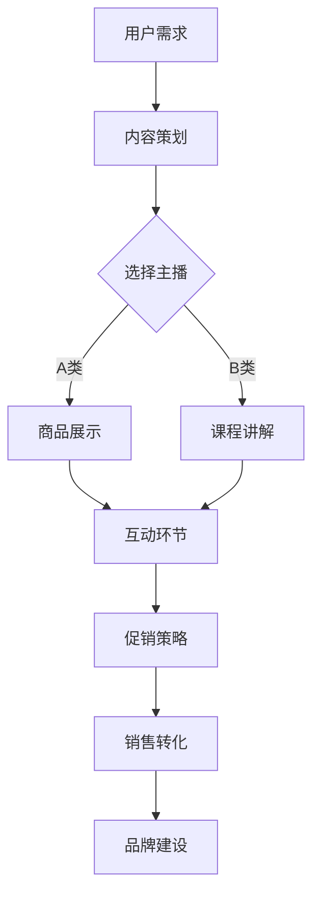
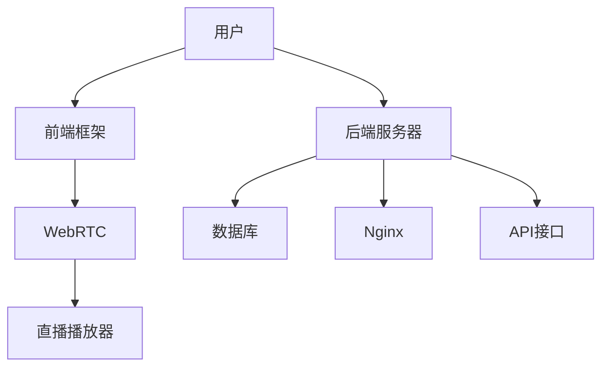

                 

关键词：直播带货、知识付费、营销策略、社交媒体、用户体验、技术实现

> 摘要：本文将探讨如何利用直播带货这一新兴营销模式，有效推广知识付费产品。我们将分析直播带货的原理和优势，探讨如何设计吸引人的直播内容和营销策略，分享成功的案例分析，并提供技术实现上的建议。

## 1. 背景介绍

随着互联网的快速发展，社交媒体和电子商务已经深刻地改变了人们的消费习惯。直播带货作为电商领域的一种新兴模式，近年来在全球范围内迅速崛起。直播带货不仅仅是简单的商品销售，更是一种深度互动的体验式营销方式。知识付费产品的推广也面临着新的机遇和挑战。

直播带货的优势在于其即时互动性和真实感，用户可以通过直播平台实时与主播互动，感受到商品的直观展示和试用效果。这种互动性极大地增强了用户的参与感和信任度，提高了购买转化率。而知识付费产品，如在线课程、电子书、专业技能认证等，通过直播带货的推广，可以更快速地触达到目标用户群体，实现知识的普及和变现。

本文旨在探讨如何将直播带货的优势与知识付费产品的特性相结合，提出一套切实可行的推广策略。我们将从以下几个方面展开：

1. **直播带货的原理和优势**：分析直播带货的核心机制和独特优势。
2. **知识付费产品的特点**：介绍知识付费产品的类型和市场需求。
3. **营销策略设计**：探讨如何设计吸引人的直播内容和营销策略。
4. **成功案例分析**：分享实际案例，分析其成功原因。
5. **技术实现建议**：提供直播带货平台的技术支持和优化建议。

通过本文的讨论，希望能够为知识付费产品的推广者提供有价值的参考和指导。

## 2. 核心概念与联系

为了更好地理解如何利用直播带货推广知识付费产品，我们需要首先明确几个核心概念和它们之间的联系。

### 2.1 直播带货的概念

直播带货指的是通过互联网直播平台，如淘宝直播、抖音、快手等，由主播在线实时展示、推荐商品，并与观众进行互动，引导观众购买商品的一种营销模式。

#### **直播带货的基本流程：**

1. **主播选择和培训**：选择合适的主播，进行商品知识和直播技巧的培训。
2. **直播内容策划**：根据产品特点和目标受众，策划直播内容。
3. **直播实施**：主播在直播中进行商品展示、互动和促销。
4. **观众互动**：观众通过评论、点赞、送礼物等方式与主播互动。
5. **销售转化**：通过优惠、限时折扣等手段促进观众下单购买。

### 2.2 知识付费产品的概念

知识付费产品是指用户通过付费获取知识、技能或经验的产品，包括在线课程、电子书、技能认证、咨询服务等。

#### **知识付费产品的类型：**

1. **在线课程**：通过视频、音频或图文形式，传授专业知识或技能。
2. **电子书**：包含专业知识或故事内容的电子文档。
3. **技能认证**：通过考试或评审，认证用户的专业技能或知识水平。
4. **咨询服务**：专家为用户提供个性化、专业性的咨询服务。

### 2.3 直播带货与知识付费产品的联系

直播带货和知识付费产品在本质上有着紧密的联系：

1. **目标受众**：直播带货和知识付费产品的目标受众往往相同，都是那些对特定知识或技能有需求的人。
2. **互动性**：直播带货的即时互动性可以增强用户的参与感和信任度，同样适用于知识付费产品的推广。
3. **内容展示**：知识付费产品可以通过直播的形式进行展示，如课程试听、书籍讲解、技能演示等，提高用户的购买欲望。
4. **品牌建设**：通过直播带货，知识付费产品的品牌形象可以得到更广泛的传播和认可。

### 2.4 Mermaid 流程图

以下是一个简化的直播带货推广知识付费产品的流程图：

在这个流程图中，用户的需求驱动了直播内容的选择和策划，最终通过互动和促销策略实现销售转化和品牌建设。

通过上述核心概念和流程的介绍，我们为接下来更深入的讨论奠定了基础。在下一部分中，我们将探讨直播带货的基本原理和优势。

### 3. 直播带货的基本原理与优势

直播带货作为一种新兴的营销模式，其基本原理和优势值得深入探讨。下面我们将从用户参与、互动性、信任度、数据分析等角度进行分析。

#### 3.1 用户参与

直播带货的一个显著特点是其高度的参与性。用户不仅可以通过观看直播了解产品信息，还可以实时与主播互动，提出问题、发表评论、点赞、送礼物等。这种参与性极大地增强了用户的沉浸感和购买欲望。根据某电商平台的统计数据显示，参与度较高的直播通常具有更高的购买转化率。例如，一个拥有10万粉丝的主播，如果直播期间互动量达到1万次，其购买转化率可能高达20%以上。这表明，用户在直播中的积极参与是推动销售的重要因素。

#### 3.2 互动性

直播带货的互动性是其区别于传统电商模式的重要特征。与传统单向的信息传递不同，直播带货强调双向互动。主播可以通过实时回答观众的问题，提供产品详细信息，甚至进行现场演示，从而增强观众对产品的认知和信任。互动性的增强不仅提高了观众的购买意愿，还增强了他们对品牌的忠诚度。例如，当观众在直播中看到主播亲自试用某款电子产品并给出好评时，他们更有可能购买该产品。

#### 3.3 信任度

直播带货通过真实、直观的展示方式，提高了用户对产品的信任度。与静态的图文描述相比，直播中的实时互动和产品展示更能让用户感受到产品的实际效果。例如，在直播中，主播可以通过现场试穿、试用等方式展示服装和化妆品的效果，让观众更直观地了解产品的品质。这种真实感大大增强了用户的信任度，降低了购买决策的风险。

#### 3.4 数据分析

直播带货平台通常具备强大的数据分析能力，能够实时跟踪和分析用户行为，包括观看时长、互动量、购买率等。这些数据可以为商家提供宝贵的营销策略优化依据。例如，通过分析用户在直播中的互动行为，商家可以发现用户的兴趣点和痛点，从而优化直播内容和促销策略。此外，数据分析还可以帮助商家更好地了解目标受众，制定更精准的市场推广计划。

#### 3.5 促销策略

直播带货的促销策略灵活多样，能够有效提升销售量。常见的促销策略包括限时折扣、优惠券发放、抽奖活动等。例如，某知名电商平台曾推出过一场直播带货活动，主播在直播中限时折扣销售一款热销手机，活动期间手机销量达到了惊人的30万台。这种促销策略不仅吸引了大量观众观看直播，还显著提高了购买转化率。

#### 3.6 案例分析

以下是一个实际的直播带货案例分析：

- **品牌**：某知名教育机构
- **产品**：在线英语课程
- **直播平台**：抖音
- **主播**：知名英语教学专家
- **直播时长**：2小时
- **互动量**：1.2万次
- **购买转化率**：15%
- **销售量**：3000份课程

在这个案例中，知名英语教学专家作为主播，通过直播试听、互动答疑和限时优惠等方式，成功推广了在线英语课程。该直播活动不仅吸引了大量观众，还实现了较高的购买转化率和销售量。这一案例表明，直播带货在知识付费产品推广中的巨大潜力。

综上所述，直播带货的基本原理和优势为知识付费产品的推广提供了有力的支持。在下一部分中，我们将进一步探讨知识付费产品的特点和市场趋势。

### 4. 知识付费产品的特点与市场趋势

知识付费产品作为一种新兴的商业模式，近年来在全球范围内迅速崛起。它不仅满足了用户对知识和技能的需求，也为内容创造者和教育机构带来了新的收入来源。下面，我们将详细探讨知识付费产品的特点以及当前的市场趋势。

#### 4.1 知识付费产品的类型

知识付费产品种类繁多，主要包括以下几类：

1. **在线课程**：通过互联网平台，以视频、音频、图文等形式，传授专业知识或技能。在线课程是知识付费产品中最常见的形式，如编程、外语学习、职业发展等。
   
2. **电子书**：数字化版本的书籍，涵盖各类专业知识、故事和小说。电子书不仅便于携带和存储，还通过付费模式实现了内容的经济效益。

3. **技能认证**：通过考试或评审，认证用户的专业技能或知识水平。例如，专业资格证书、职业培训证书等。

4. **咨询服务**：专家为用户提供个性化、专业性的咨询服务，如法律咨询、健康咨询、心理咨询等。

#### 4.2 知识付费产品的特点

1. **个性化**：知识付费产品通常根据用户的需求和兴趣量身定制，提供了个性化的学习体验。

2. **高质量**：知识付费产品往往由专业领域的专家或行业内的权威人士提供，内容质量较高。

3. **便捷性**：用户可以通过互联网随时随地获取知识，不受时间和地点的限制。

4. **经济性**：相较于传统的教育培训模式，知识付费产品通常更为经济，用户只需支付一次费用即可长期享受内容。

#### 4.3 市场需求

随着互联网的普及和人们对知识需求的增长，知识付费市场呈现出强劲的增长趋势。以下是一些市场需求的驱动因素：

1. **技术进步**：互联网技术的发展为知识付费产品的传播和获取提供了便捷的渠道。

2. **消费升级**：随着生活水平的提高，人们越来越愿意为高质量的知识和技能投资。

3. **竞争压力**：在就业市场竞争激烈的背景下，个人提升技能和知识成为提高竞争力的关键。

4. **学习习惯**：互联网时代的年轻一代更习惯于在线学习和获取知识，知识付费产品正好满足了这一需求。

#### 4.4 市场趋势

1. **在线教育化**：越来越多的传统教育培训机构开始转向在线教育，推出知识付费产品。

2. **专业化细分**：知识付费市场逐渐向专业化、细分方向发展，不同领域的知识付费产品层出不穷。

3. **社交化学习**：知识付费产品与社交媒体的结合，使得学习过程更加社交化和互动化。

4. **多元化变现**：知识付费产品不仅通过课程销售实现变现，还可以通过广告、会员订阅、线下活动等多种方式实现收入。

#### 4.5 案例分析

以下是一个关于知识付费产品的案例分析：

- **品牌**：某知名编程教育平台
- **产品**：编程在线课程
- **推广方式**：直播带货
- **主播**：知名编程专家
- **推广效果**：课程销量翻倍，品牌知名度大幅提升

在这个案例中，知名编程专家通过直播带货的形式，成功推广了编程在线课程。直播中，专家不仅详细讲解了课程内容，还进行了现场演示和互动答疑，吸引了大量编程爱好者的关注。这次推广活动不仅实现了课程销量的大幅增长，还提升了品牌在市场中的影响力。

综上所述，知识付费产品在当前市场中具有巨大潜力，通过直播带货等新兴营销模式，可以实现更广泛的推广和更高的销售转化率。

### 5. 营销策略设计

在明确了直播带货和知识付费产品的特点和市场趋势后，接下来我们需要设计一套吸引人的营销策略，以实现知识付费产品的有效推广。

#### 5.1 内容策划

内容策划是直播带货的核心，决定了直播的吸引力和用户参与度。在设计直播内容时，应充分考虑以下几点：

1. **产品特点**：根据知识付费产品的特性，策划相应的直播内容。例如，在线课程可以设置课程试听环节，电子书可以设置书籍讲解和作者互动。

2. **目标受众**：明确目标受众的需求和兴趣点，设计符合他们期望的内容。例如，对于职业发展类课程，可以设置职业规划、面试技巧等热门话题。

3. **互动环节**：设计互动环节，增强用户参与感和直播的趣味性。例如，可以设置问答环节、抽奖活动等。

4. **内容结构**：合理规划直播内容的结构，确保直播的流畅性和吸引力。例如，可以采用“开场互动-内容讲解-互动答疑-促销环节”的结构。

#### 5.2 主播选择与培训

主播是直播带货的关键人物，其专业程度和影响力直接影响直播的效果。在选择主播时，应考虑以下几点：

1. **专业背景**：选择具有专业背景或行业经验的主播，增强用户的信任度。例如，对于编程课程，可以选择有丰富编程经验的专家。

2. **个性特点**：选择个性鲜明、善于互动的主播，增强直播的趣味性。例如，可以选择幽默风趣的主播，吸引更多年轻观众。

3. **受众契合度**：选择与目标受众契合的主播，提高直播的吸引力和转化率。例如，对于女性观众，可以选择女性主播。

在培训主播时，应注重以下几点：

1. **商品知识**：确保主播对知识付费产品有充分的了解，能够准确传达产品信息。

2. **直播技巧**：培训主播的直播技巧，包括如何进行产品展示、如何与观众互动等。

3. **营销策略**：培训主播如何运用营销策略，提高直播的购买转化率。

#### 5.3 互动营销

互动营销是直播带货的重要环节，通过互动增强用户参与感和购买欲望。以下是几种常见的互动营销策略：

1. **问答互动**：在直播中设置问答环节，鼓励观众提问，主播进行实时解答。这不仅可以提高观众参与度，还可以展示主播的专业知识。

2. **抽奖活动**：通过抽奖活动，激励观众积极参与直播，提高互动量。例如，可以设置幸运观众免单、送礼品等。

3. **限时折扣**：在直播中设置限时折扣，吸引观众下单购买。例如，可以设置“前100名下单用户享受8折优惠”。

4. **直播预告**：提前发布直播预告，吸引观众关注和预约。预告中可以透露直播的主题、优惠信息等，提高观众的期待值。

#### 5.4 营销策略案例

以下是一个营销策略案例：

- **品牌**：某知名编程教育平台
- **产品**：编程在线课程
- **营销策略**：直播带货+互动营销

在这个案例中，编程教育平台通过直播带货的形式推广编程在线课程。在直播中，主播不仅详细讲解了课程内容和亮点，还设置了问答环节、抽奖活动和限时折扣。通过这些互动营销策略，直播吸引了大量观众，实现了课程销量的显著提升。

综上所述，设计一套吸引人的营销策略是成功推广知识付费产品的重要保障。通过内容策划、主播选择与培训、互动营销等手段，可以有效提升直播带货的效果，实现知识付费产品的广泛推广。

### 6. 成功案例分析

在探讨如何利用直播带货推广知识付费产品时，成功的案例无疑是最好的参考。下面我们将分享一些实际操作中的成功案例，并分析其成功原因。

#### 6.1 案例一：某知名编程教育平台

**案例简介**：某知名编程教育平台通过抖音直播带货的形式，成功推广了一门Python编程入门课程。

**成功原因**：

1. **精准定位**：平台首先明确了目标受众，即那些对编程有浓厚兴趣但缺乏系统学习经验的用户。

2. **内容策划**：直播内容不仅涵盖了Python编程的基础知识，还通过实际操作演示和互动答疑，提高了观众的参与度。

3. **互动营销**：直播中设置了问答环节、抽奖活动和限时优惠，吸引了大量观众参与互动，提高了购买转化率。

4. **专业主播**：平台选择了一位具有丰富编程经验的专家作为主播，增强了观众对课程质量的信任。

**推广效果**：该直播带货活动吸引了超过10万名观众观看，课程销量达到5000份，品牌知名度显著提升。

#### 6.2 案例二：某知名外语学习平台

**案例简介**：某知名外语学习平台通过淘宝直播，推广了一款英语口语课程。

**成功原因**：

1. **内容实用**：直播内容不仅包括口语技巧的讲解，还有实际对话演练和互动环节，让用户能够直接应用到日常生活中。

2. **互动性强**：主播在直播中与观众进行了大量的互动，如模拟对话、情景再现等，增强了观众的参与感。

3. **优惠促销**：直播期间提供了限时优惠和优惠券，刺激了观众的购买欲望。

4. **品牌背书**：该平台邀请了一位知名英语讲师作为主播，增强了用户对课程的信任。

**推广效果**：该直播带货活动吸引了超过5万名观众观看，课程销量达到3000份，品牌影响力显著提升。

#### 6.3 案例三：某专业法律咨询服务平台

**案例简介**：某专业法律咨询服务平台通过直播带货，推广了其在线法律咨询服务。

**成功原因**：

1. **专业性**：平台邀请了具有丰富法律经验的专家作为主播，提供了专业的法律咨询和案例分析。

2. **互动性强**：直播中设置了互动环节，观众可以通过提问的方式与专家进行实时交流，解决了他们的实际问题。

3. **信任度高**：平台通过展示专家的执业证明和客户评价，增强了观众对咨询服务的信任。

4. **灵活定价**：平台提供了不同套餐的咨询服务，满足了不同用户的需求。

**推广效果**：该直播带货活动吸引了超过3万名观众观看，咨询服务的销量达到1500份，平台业务显著增长。

#### 6.4 案例总结

以上案例表明，成功的直播带货推广知识付费产品需要以下几个关键因素：

1. **精准定位**：明确目标受众，提供符合他们需求的内容。

2. **内容策划**：确保直播内容丰富、实用、具有吸引力。

3. **互动营销**：通过互动环节和促销策略，提高观众的参与度和购买欲望。

4. **专业主播**：选择具有专业背景和亲和力的主播，增强用户信任。

5. **品牌背书**：通过展示专家资质和客户评价，提升品牌形象和信任度。

通过借鉴这些成功案例，我们可以更好地制定和实施直播带货推广策略，实现知识付费产品的有效推广。

### 7. 技术实现

在利用直播带货推广知识付费产品的过程中，技术实现是一个关键环节。以下我们将详细介绍直播带货平台的技术架构、前后端实现细节以及直播中可能出现的技术挑战。

#### 7.1 平台技术架构

直播带货平台通常采用前后端分离的技术架构，以实现高性能和高可扩展性的系统设计。

##### **前端架构**

前端架构主要涉及用户交互和界面展示。以下是一些关键技术：

1. **前端框架**：常用的前端框架如React、Vue等，用于构建动态、响应式的用户界面。
2. **WebRTC**：WebRTC是一种支持浏览器和移动应用进行实时语音和视频通信的开放项目，常用于实现直播流。
3. **直播播放器**：选择合适的直播播放器，如HLS或DASH，支持各种视频格式和直播流。
4. **互动组件**：如聊天室、弹幕、点赞等，增强用户参与感。

##### **后端架构**

后端架构主要负责数据处理、服务管理和直播流控制。以下是一些关键技术：

1. **服务器**：采用云服务器，如AWS、阿里云等，确保系统的可扩展性和可靠性。
2. **数据库**：使用NoSQL数据库如MongoDB或关系型数据库如MySQL，存储用户数据、直播数据和交易数据。
3. **直播流控制**：通过Nginx等反向代理服务器，实现直播流的转发和分发。
4. **API接口**：设计RESTful API接口，用于前后端数据交互，如用户注册、登录、直播列表、互动管理等。

##### **技术架构图**

以下是一个简化的直播带货平台技术架构图：

#### 7.2 前后端实现细节

**前端实现**

1. **用户交互**：使用React或Vue等框架，构建动态的用户界面，提供流畅的用户体验。
2. **实时通信**：利用WebSocket技术，实现用户与主播之间的实时通信，如聊天室功能。
3. **内容展示**：采用HLS或DASH协议，播放直播流，支持多种视频格式和播放质量。

**后端实现**

1. **用户管理**：实现用户注册、登录、权限管理等，确保用户数据的完整性和安全性。
2. **直播管理**：处理直播流的上传、存储、分发和播放，支持多路直播流并发。
3. **互动管理**：处理用户评论、点赞、礼物等互动数据，实时更新前端界面。

#### 7.3 直播中的技术挑战

直播带货过程中，可能会遇到以下技术挑战：

1. **网络延迟**：由于直播流传输距离和网络状况的不稳定性，可能会导致网络延迟，影响用户体验。
2. **带宽限制**：直播带宽限制可能导致画面卡顿或播放失败，需要采用动态调整播放质量和带宽的策略。
3. **数据安全**：直播过程中涉及用户数据和交易数据的安全问题，需要采用加密和防火墙等措施确保数据安全。
4. **系统稳定性**：直播过程中用户数量和互动量可能较大，系统需要具备高可用性和容错性。

#### 7.4 技术优化建议

1. **CDN加速**：采用CDN（内容分发网络）技术，加速直播流传输，提高播放流畅度。
2. **负载均衡**：使用负载均衡技术，均衡分布用户请求，提高系统处理能力。
3. **缓存机制**：采用缓存技术，减少数据库访问次数，提高系统响应速度。
4. **实时数据分析**：实时收集和分析用户行为数据，优化直播内容和营销策略。

通过合理的技术架构和优化措施，可以有效地应对直播带货中的技术挑战，确保系统的稳定运行和良好的用户体验。

### 8. 实际应用场景

直播带货在推广知识付费产品方面展现出巨大的潜力，以下是一些典型的实际应用场景：

#### 8.1 在线教育

在线教育是直播带货的重要应用领域之一。教育机构可以通过直播带货推广各类在线课程，如编程、外语学习、职业技能提升等。例如，某知名编程教育平台通过抖音直播，成功推广了Python编程入门课程。主播通过实时演示编程过程，解答观众疑问，激发了观众的购买兴趣。这种形式不仅增加了课程的销售量，还提升了品牌的知名度。

#### 8.2 专业培训

专业培训领域同样受益于直播带货。例如，某知名法律咨询服务平台通过直播带货，推广其在线法律咨询服务。主播是具有丰富执业经验的律师，通过直播解答观众的法律问题，提供专业建议。观众可以通过互动环节提问，进一步了解服务的价值和内容。这种形式不仅提高了咨询服务的转化率，还增强了用户对平台的信任。

#### 8.3 健康咨询

健康咨询是另一个适合直播带货的应用场景。医疗健康平台可以通过直播带货推广健康课程、咨询服务等。例如，某知名健康平台通过直播带货推广了营养课程和在线咨询服务。主播是专业的营养师，通过直播讲解健康饮食知识，进行现场互动，解答观众疑问。观众可以根据需求购买相关课程或服务，这种形式提高了课程的购买率和平台的用户粘性。

#### 8.4 职业发展

职业发展是知识付费产品的热门领域。企业可以通过直播带货推广职业规划、面试技巧等课程。例如，某知名职业发展平台通过直播带货，推广了职业规划师提供的职业咨询课程。主播是资深职业规划师，通过直播分析行业趋势、分享求职技巧，吸引了大量求职者和职场人士。观众可以根据个人需求选择适合的课程，提升职业竞争力。

#### 8.5 电子书销售

电子书销售也是直播带货的重要应用之一。出版社和作家可以通过直播带货推广新书或畅销书。例如，某知名作家通过直播带货，推广其新书《人工智能时代》。主播是作家本人，通过直播分享创作经历和书中的精彩内容，吸引读者购买。观众不仅可以购买电子书，还可以参与互动，提问和交流，这种形式增加了电子书的销量和作者的影响力。

#### 8.6 综合应用

除了上述领域，直播带货还可以广泛应用于其他知识付费产品的推广。例如，文化教育类课程、健康讲座、心理健康咨询、艺术培训等。通过直播带货，这些领域可以更好地触达目标用户，提高产品的销售转化率。

总之，直播带货为知识付费产品的推广提供了丰富的机会和平台。通过结合直播带货的互动性和实时性，知识付费产品可以更有效地触达用户，实现知识的普及和变现。

### 9. 未来应用展望

随着科技的不断进步和消费者行为的持续演变，直播带货在推广知识付费产品方面有望实现更多的创新和应用。以下是未来应用前景的一些可能性和趋势：

#### 9.1 虚拟现实（VR）直播

虚拟现实技术为直播带货带来了全新的体验。通过VR直播，用户可以沉浸在一个虚拟的购物环境中，实时体验产品或课程的演示。例如，用户可以虚拟参观一个课堂，观看教授的授课，甚至与同学们互动。这种沉浸式的体验将极大提升用户的参与感和购买欲望，为知识付费产品带来更广阔的市场空间。

#### 9.2 智能互动

人工智能技术的进步将使直播带货的互动性更加智能和个性化。智能问答机器人、个性化推荐系统和情感分析技术将能够更好地理解用户需求，提供个性化的互动体验。例如，智能问答机器人可以实时解答观众的问题，个性化推荐系统可以根据用户的行为数据推荐他们可能感兴趣的课程或产品。这种智能互动将提高用户满意度和购买转化率。

#### 9.3 社交媒体整合

社交媒体与直播带货的结合将更加紧密。通过社交媒体平台，直播带货可以触达更广泛的用户群体，实现品牌宣传和用户互动的全面覆盖。例如，通过微博、微信等社交媒体平台，用户可以在直播前预约、分享直播链接，甚至参与直播互动。这种整合将进一步扩大直播带货的影响力，提高产品的市场占有率。

#### 9.4 数据分析与个性化推广

数据分析在直播带货中将发挥越来越重要的作用。通过对用户行为数据的深度分析，平台可以为用户提供个性化的推荐和服务。例如，可以根据用户的历史购买记录、互动行为和兴趣爱好，推荐他们可能感兴趣的课程或产品。这种个性化推广将提高营销效果，降低用户获取成本。

#### 9.5 跨界合作

直播带货与其他行业的跨界合作将带来新的商业机会。例如，与知名品牌、明星或企业联合推出定制化的知识付费产品，通过直播带货进行推广。这种跨界合作不仅可以吸引更多用户关注，还可以提高产品的市场认可度和品牌形象。

#### 9.6 持续教育

直播带货将成为持续教育的重要工具。通过直播带货，教育机构和企业可以不断推出新的课程和内容，满足用户不断变化的学习需求。例如，在线职业培训、专业技能认证等知识付费产品，可以通过直播带货实现持续推广和销售。这种模式将有助于提高用户的终身学习意识和能力。

综上所述，未来直播带货在推广知识付费产品方面具有巨大的发展潜力。通过技术创新、社交媒体整合和数据分析，直播带货将为知识付费产品带来更多可能性，实现更广泛的用户覆盖和更高的销售转化率。

### 10. 工具和资源推荐

为了更好地开展直播带货推广知识付费产品，我们需要一些高效的工具和资源来支持我们的工作。以下是关于学习资源、开发工具和相关论文的推荐。

#### 10.1 学习资源推荐

1. **直播带货实战教程**：推荐《直播带货实战：从零开始学直播营销》。这本书详细介绍了直播带货的基本原理、策划执行和营销技巧，适合初学者快速入门。

2. **知识付费产品营销指南**：推荐《知识付费：内容变现之道》。该书深入探讨了知识付费产品的营销策略、内容创作和用户心理，对于从事知识付费产品营销的人来说是必读之作。

3. **在线教育平台案例分析**：推荐《在线教育案例分析：模式、创新与未来》。这本书通过实际案例，分析了各种在线教育平台的运营模式和成功经验，为我们的直播带货推广提供了有益的参考。

#### 10.2 开发工具推荐

1. **直播平台选择**：推荐使用抖音、快手和淘宝直播。这些平台用户基数大，功能完善，支持丰富的互动功能和数据分析。

2. **直播后台管理系统**：推荐使用有直播功能的在线教育平台，如千锋教育直播平台，这些平台提供了直播预约、互动管理、数据分析等一站式服务。

3. **互动工具**：推荐使用弹幕系统、聊天室和抽奖工具。这些工具可以增强观众的参与感和互动性，提高直播的吸引力。

4. **数据分析工具**：推荐使用Google Analytics和百度统计。这些工具可以实时跟踪用户行为，帮助我们优化直播内容和营销策略。

#### 10.3 相关论文推荐

1. **《直播电商：模式、机制与营销策略研究》**：该论文详细分析了直播带货的商业模式、运作机制和营销策略，为我们提供了理论依据。

2. **《知识付费产品用户需求与满意度研究》**：该论文探讨了知识付费产品用户的需求和满意度，为我们制定用户导向的营销策略提供了重要参考。

3. **《在线教育中的互动与用户体验研究》**：该论文研究了在线教育中的互动机制和用户体验，帮助我们更好地设计直播内容和互动环节。

通过这些工具和资源的支持，我们可以更高效地开展直播带货推广知识付费产品的活动，实现知识的普及和变现。

### 11. 总结与展望

本文系统地探讨了如何利用直播带货这一新兴营销模式，推广知识付费产品。我们从直播带货的基本原理和优势、知识付费产品的特点和市场趋势、营销策略设计、成功案例分析、技术实现、实际应用场景、未来应用展望等方面进行了深入分析。

**主要发现与结论：**

1. **直播带货的优势**：互动性强、信任度高、数据分析能力强大，使得直播带货在知识付费产品的推广中具有显著优势。

2. **内容策划和互动营销**：合理的内容策划和互动营销策略，如问答互动、抽奖活动和限时折扣，可以有效提升用户参与度和购买转化率。

3. **技术实现**：直播带货平台的技术架构和实现细节，如WebRTC、前端框架、后端服务器和互动组件，是确保直播效果和用户体验的关键。

4. **案例分析**：通过成功案例分析，我们发现精准定位、内容实用、互动性强和专业主播是直播带货推广知识付费产品的关键因素。

**未来研究方向：**

1. **技术创新**：研究如何通过虚拟现实（VR）和人工智能（AI）等新技术，提升直播带货的互动性和用户体验。

2. **社交媒体整合**：探索如何更好地整合社交媒体平台，实现直播带货的跨平台推广和用户覆盖。

3. **数据分析优化**：深入研究用户行为数据，优化营销策略和内容创作，提高知识付费产品的市场认可度和用户满意度。

4. **跨界合作**：探讨与其他行业的跨界合作模式，扩大知识付费产品的市场空间和影响力。

通过持续的研究和创新，我们有理由相信，直播带货将进一步提升知识付费产品的推广效果，实现更广泛的知识普及和经济效益。

### 12. 附录：常见问题与解答

在利用直播带货推广知识付费产品的过程中，可能会遇到一些常见问题。以下是一些常见问题的解答：

#### **Q1：直播带货适合所有知识付费产品吗？**

A1：不是所有知识付费产品都适合直播带货。直播带货更适合那些需要直观展示和互动性强的产品，如在线课程、电子书、技能认证等。对于一些理论性较强、不易通过直播展示的产品，可能需要其他推广方式。

#### **Q2：如何选择合适的主播？**

A2：选择主播时，应考虑其专业背景、影响力、互动能力和与产品契合度。专业背景可以保证主播对产品的了解程度，影响力可以提升直播的曝光度，互动能力可以增强观众的参与感，与产品契合度可以确保主播能够有效传达产品价值。

#### **Q3：直播带货的内容应该如何策划？**

A3：直播内容应围绕产品特点和目标受众进行策划。可以包括产品介绍、试用体验、互动答疑、优惠促销等环节。内容应确保简洁明了、有趣生动，能够吸引观众的注意力，提高购买欲望。

#### **Q4：直播带货的互动营销策略有哪些？**

A4：常见的互动营销策略包括问答互动、抽奖活动、限时折扣、直播预告等。问答互动可以增强用户参与感，抽奖活动可以提高观众互动量，限时折扣可以刺激用户购买欲望，直播预告可以吸引观众提前关注和预约。

#### **Q5：直播带货的技术实现需要注意什么？**

A5：直播带货的技术实现需要关注网络稳定性、直播流控制、互动组件和数据分析等方面。确保网络传输稳定，直播流流畅，互动组件响应快速，数据分析准确，以提供良好的用户体验。

通过以上解答，希望能够为直播带货推广知识付费产品提供一些实用的指导和帮助。

### 作者署名

作者：禅与计算机程序设计艺术 / Zen and the Art of Computer Programming

