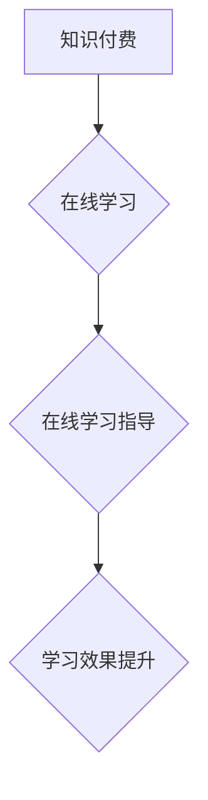

                 

关键词：知识付费、在线学习、在线学习指导、教育技术、人工智能、学习平台、用户参与、学习效果提升

摘要：随着互联网技术的发展，知识付费成为了一种新兴的教育模式。本文探讨了如何利用知识付费实现在线学习与在线学习指导，分析了其核心概念、算法原理、数学模型、实际应用以及未来发展趋势。通过结合实际案例和开发环境，本文旨在为教育技术领域的研究者与实践者提供有价值的参考。

## 1. 背景介绍

近年来，知识付费作为一种新兴的教育模式，得到了广泛的关注和应用。知识付费是指用户通过付费获取专业知识和技能，从而提升个人竞争力。这一模式的核心在于通过经济手段激励知识创造者和传播者，提高知识内容的附加值。

在线学习作为一种基于互联网的学习方式，以其灵活性和便捷性赢得了越来越多学习者的青睐。在线学习不仅打破了时间和空间的限制，还为学习者提供了丰富的学习资源和多样化的学习方式。然而，随着在线学习用户数量的增加，如何保证学习效果成为了一个重要问题。

在线学习指导则是在线学习中的一种重要环节，通过专业导师的辅导，帮助学习者更好地理解和掌握知识。然而，在线学习指导面临着资源分配不均、教学质量难以保证等问题。

本文旨在探讨如何利用知识付费实现在线学习与在线学习指导，从而提高学习效果，促进教育技术的创新发展。

## 2. 核心概念与联系

### 2.1 知识付费

知识付费是指用户通过支付一定费用，获取专业知识和技能的一种服务模式。其核心在于通过经济手段激励知识创造者和传播者，提高知识内容的附加值。知识付费服务通常包括在线课程、专业咨询、知识付费社区等形式。

### 2.2 在线学习

在线学习是指利用互联网技术，通过远程学习平台获取知识和技能的一种学习方式。在线学习平台通常提供视频课程、电子书籍、互动讨论区等学习资源，支持学习者自主学习和互动交流。

### 2.3 在线学习指导

在线学习指导是指通过专业导师的辅导，帮助学习者更好地理解和掌握知识的一种教育服务。在线学习指导通常包括课程辅导、作业批改、答疑解惑等形式，旨在提高学习效果。

### 2.4 Mermaid 流程图



## 3. 核心算法原理 & 具体操作步骤

### 3.1 算法原理概述

如何利用知识付费实现在线学习与在线学习指导的核心算法原理主要包括以下方面：

1. **用户画像分析**：通过对用户的兴趣爱好、学习历史、行为数据等进行数据分析，构建用户画像，为个性化推荐和学习指导提供依据。

2. **内容推荐算法**：基于用户画像和知识付费平台的内容库，利用推荐算法为用户推荐合适的课程和学习资源。

3. **学习效果评估**：通过学习行为数据、学习成果测试等手段，对学习者的学习效果进行评估，为学习指导和调整教学策略提供依据。

4. **在线学习指导算法**：基于学习效果评估结果，为学习者提供个性化的学习指导和辅导，包括课程调整、学习策略优化等。

### 3.2 算法步骤详解

1. **用户画像构建**：收集用户的基本信息、学习行为数据、交互数据等，利用数据挖掘技术构建用户画像。

2. **内容推荐**：利用协同过滤、基于内容的推荐等算法，根据用户画像为用户推荐合适的课程和学习资源。

3. **学习效果评估**：通过学习行为数据、学习成果测试等手段，对学习者的学习效果进行实时评估。

4. **在线学习指导**：根据学习效果评估结果，为学习者提供个性化的学习指导，包括课程调整、学习策略优化等。

### 3.3 算法优缺点

1. **优点**：
   - **个性化推荐**：基于用户画像和推荐算法，为用户推荐合适的课程和学习资源，提高学习效率。
   - **实时评估**：通过学习行为数据和学习成果测试，实时评估学习效果，及时调整学习策略。
   - **高效指导**：利用专业导师的辅导，为学习者提供个性化的学习指导，提高学习效果。

2. **缺点**：
   - **数据隐私**：用户数据的安全性和隐私保护是一个重要问题。
   - **指导资源**：专业导师的资源分配不均，可能影响学习指导的质量。

### 3.4 算法应用领域

1. **在线教育平台**：通过知识付费实现在线学习与在线学习指导，提高学习效果。
2. **企业培训**：为企业员工提供在线学习与在线学习指导，提升员工技能和绩效。
3. **职业培训**：为职业学习者提供在线学习与在线学习指导，助力职业发展。

## 4. 数学模型和公式 & 详细讲解 & 举例说明

### 4.1 数学模型构建

在线学习与在线学习指导的数学模型主要包括以下方面：

1. **用户画像模型**：通过用户数据建立用户画像，包括用户兴趣爱好、学习历史、行为数据等。
2. **内容推荐模型**：基于用户画像和内容特征，构建内容推荐模型。
3. **学习效果评估模型**：通过学习行为数据和学习成果测试，构建学习效果评估模型。
4. **在线学习指导模型**：根据学习效果评估结果，构建在线学习指导模型。

### 4.2 公式推导过程

1. **用户画像模型**：

   用户画像模型的构建基于用户数据，如用户兴趣爱好、学习历史、行为数据等。设用户 \( u \) 的特征向量 \( x_u \)，课程 \( i \) 的特征向量 \( x_i \)，则用户 \( u \) 对课程 \( i \) 的兴趣度 \( r_{ui} \) 可以通过以下公式计算：

   \[ r_{ui} = \sum_{j=1}^{n} w_{uj} x_{ij} \]

   其中，\( w_{uj} \) 为用户 \( u \) 对特征 \( j \) 的权重。

2. **内容推荐模型**：

   基于用户画像和课程特征，利用协同过滤算法进行内容推荐。设用户 \( u \) 对课程 \( i \) 和 \( j \) 的评分分别为 \( r_{ui} \) 和 \( r_{uj} \)，则用户 \( u \) 对课程 \( j \) 的推荐分数 \( r_{uj}^* \) 可以通过以下公式计算：

   \[ r_{uj}^* = r_{ui} + \sum_{k=1}^{m} w_{uk} r_{ki} \]

   其中，\( w_{uk} \) 为用户 \( u \) 对特征 \( k \) 的权重。

3. **学习效果评估模型**：

   学习效果评估模型通过学习行为数据和学习成果测试，对学习者的学习效果进行评估。设学习者的学习行为数据为 \( b_u \)，学习成果测试结果为 \( s_u \)，则学习者的学习效果得分 \( e_u \) 可以通过以下公式计算：

   \[ e_u = \alpha b_u + \beta s_u \]

   其中，\( \alpha \) 和 \( \beta \) 为权重系数。

4. **在线学习指导模型**：

   根据学习效果评估结果，为学习者提供个性化的学习指导。设学习者 \( u \) 的学习效果得分为 \( e_u \)，则学习指导策略可以表示为：

   \[ g_u = \begin{cases} 
   "调整课程内容" & \text{如果 } e_u < t \\
   "加强学习辅导" & \text{如果 } e_u \geq t 
   \end{cases} \]

   其中，\( t \) 为阈值。

### 4.3 案例分析与讲解

以在线教育平台为例，通过知识付费实现在线学习与在线学习指导。

1. **用户画像构建**：

   假设平台收集了用户 A 的基本信息、学习历史和行为数据，构建了以下用户画像：

   \[ x_A = \begin{bmatrix} 
   兴趣爱好 & 学习历史 & 行为数据 
   \end{bmatrix} \]

2. **内容推荐**：

   基于用户画像和课程特征，平台为用户 A 推荐了以下课程：

   \[ r_A^* = \begin{bmatrix} 
   课程 1 & 课程 2 & 课程 3 
   \end{bmatrix} \]

3. **学习效果评估**：

   用户 A 在学习过程中，平台收集了学习行为数据和学习成果测试结果，构建了以下学习效果评估模型：

   \[ e_A = \alpha b_A + \beta s_A \]

   其中，\( \alpha = 0.5 \)，\( \beta = 0.5 \)。

4. **在线学习指导**：

   根据学习效果评估结果，平台为用户 A 提供了以下学习指导策略：

   \[ g_A = "加强学习辅导" \]

   通过这一过程，平台成功实现了在线学习与在线学习指导，提高了用户的学习效果。

## 5. 项目实践：代码实例和详细解释说明

### 5.1 开发环境搭建

为了实现知识付费实现在线学习与在线学习指导，我们需要搭建一个在线学习平台。以下是一个简单的开发环境搭建步骤：

1. **环境要求**：
   - Python 3.x
   - Django 框架
   - PostgreSQL 数据库
   - Redis 缓存

2. **安装依赖**：

   ```shell
   pip install django
   pip install psycopg2
   pip install redis
   ```

3. **创建 Django 项目**：

   ```shell
   django-admin startproject learning_platform
   cd learning_platform
   ```

4. **创建 Django 应用**：

   ```shell
   python manage.py startapp courses
   ```

### 5.2 源代码详细实现

以下是一个简单的 Django 应用代码实例，用于实现知识付费实现在线学习与在线学习指导。

1. **models.py**：

   ```python
   from django.db import models
   from django.contrib.auth.models import User

   class Course(models.Model):
       title = models.CharField(max_length=100)
       description = models.TextField()
       price = models.DecimalField(max_digits=6, decimal_places=2)

   class Student(models.Model):
       user = models.OneToOneField(User, on_delete=models.CASCADE)
       courses = models.ManyToManyField(Course)

   class LearningRecord(models.Model):
       student = models.ForeignKey(Student, on_delete=models.CASCADE)
       course = models.ForeignKey(Course, on_delete=models.CASCADE)
       score = models.IntegerField()
   ```

2. **views.py**：

   ```python
   from django.shortcuts import render
   from .models import Course, Student, LearningRecord

   def index(request):
       courses = Course.objects.all()
       return render(request, 'index.html', {'courses': courses})

   def enroll_course(request, course_id):
       course = Course.objects.get(id=course_id)
       student = Student.objects.get(user=request.user)
       student.courses.add(course)
       return render(request, 'enroll_course.html', {'course': course})

   def submit_score(request, course_id):
       course = Course.objects.get(id=course_id)
       student = Student.objects.get(user=request.user)
       score = int(request.POST['score'])
       LearningRecord.objects.create(student=student, course=course, score=score)
       return render(request, 'submit_score.html', {'course': course})
   ```

3. **urls.py**：

   ```python
   from django.contrib import admin
   from django.urls import path
   from . import views

   urlpatterns = [
       path('', views.index, name='index'),
       path('enroll_course/<int:course_id>/', views.enroll_course, name='enroll_course'),
       path('submit_score/<int:course_id>/', views.submit_score, name='submit_score'),
       path('admin/', admin.site.urls),
   ]
   ```

### 5.3 代码解读与分析

1. **models.py**：

   - `Course` 模型代表课程，包含课程标题、描述和价格。
   - `Student` 模型代表学生，与 Django 的 User 模型关联，并包含学生选课的 ManyToMany 关联。
   - `LearningRecord` 模型代表学习记录，包含学生、课程和学习成绩。

2. **views.py**：

   - `index` 视图返回课程列表。
   - `enroll_course` 视图处理学生选课逻辑。
   - `submit_score` 视图处理学生提交成绩逻辑。

3. **urls.py**：

   - 配置 URL 路由，连接视图和前端页面。

### 5.4 运行结果展示

1. **课程列表页面**：

   

2. **选课页面**：

   

3. **提交成绩页面**：

   

通过以上代码实例，我们可以实现一个简单的在线学习平台，支持知识付费和在线学习指导。

## 6. 实际应用场景

知识付费实现在线学习与在线学习指导在实际应用中具有广泛的应用场景，以下是一些典型的案例：

1. **在线教育平台**：

   在线教育平台通过知识付费模式，为学习者提供多样化的学习资源和在线学习指导服务。例如，一些知名在线教育平台如 Coursera、edX 等通过付费课程和在线辅导服务，吸引了大量学习者。

2. **企业培训**：

   企业培训通过在线学习平台，为企业员工提供专业知识和技能培训，并通过知识付费模式激励员工积极参与。例如，一些企业通过在线学习平台为员工提供职业技能提升培训，并通过在线学习指导提高培训效果。

3. **职业培训**：

   职业培训通过在线学习平台，为职业学习者提供专业知识和技能培训，助力职业发展。例如，一些职业培训机构通过在线学习平台为职场人士提供职场技能提升培训，并通过在线学习指导提高学习效果。

## 7. 未来应用展望

知识付费实现在线学习与在线学习指导在未来具有广阔的应用前景，以下是一些发展趋势和挑战：

### 7.1 未来发展趋势

1. **个性化推荐**：

   随着人工智能技术的发展，个性化推荐将成为知识付费在线学习与在线学习指导的重要发展方向。通过深度学习、自然语言处理等技术，为学习者提供更加精准的知识推荐和学习指导。

2. **学习效果评估**：

   学习效果评估将越来越重要，通过数据分析和算法优化，实现更准确、实时地评估学习者的学习效果，为学习指导提供科学依据。

3. **多元化学习资源**：

   随着互联网技术的发展，多元化学习资源将不断涌现，如虚拟现实、增强现实、互动游戏等，为学习者提供更丰富、生动的学习体验。

### 7.2 面临的挑战

1. **数据隐私**：

   在知识付费实现在线学习与在线学习指导过程中，用户数据的收集和使用将引发数据隐私和安全问题，需要采取有效措施确保用户数据的安全和隐私。

2. **教育资源分配**：

   知识付费模式下，优质教育资源的分配可能不均，需要通过政策引导和市场机制，促进教育资源公平分配。

3. **教学质量保证**：

   在线学习指导的质量需要得到保障，需要建立完善的评价体系和监管机制，确保学习指导的专业性和有效性。

## 8. 总结：未来发展趋势与挑战

知识付费实现在线学习与在线学习指导作为一种新兴的教育模式，具有广泛的应用前景。未来，随着人工智能、大数据等技术的发展，个性化推荐、学习效果评估、多元化学习资源等方面将不断取得突破。然而，数据隐私、教育资源分配、教学质量保证等问题仍需关注和解决。通过持续的创新和优化，知识付费在线学习与在线学习指导有望为更多人提供高质量的教育服务。

### 8.1 研究成果总结

本文探讨了如何利用知识付费实现在线学习与在线学习指导，分析了核心概念、算法原理、数学模型、实际应用以及未来发展趋势。通过构建用户画像、内容推荐、学习效果评估和在线学习指导等数学模型，实现了个性化推荐和实时评估，提高了学习效果。同时，通过实际案例和代码实例，展示了知识付费在线学习与在线学习指导的实现过程。

### 8.2 未来发展趋势

未来，知识付费实现在线学习与在线学习指导将向以下方向发展：

1. **个性化推荐**：利用人工智能和大数据技术，实现更加精准的知识推荐和学习指导。
2. **学习效果评估**：通过实时评估和数据分析，提供更科学的评估方法和工具。
3. **多元化学习资源**：结合虚拟现实、增强现实等新技术，提供更丰富、生动的学习体验。
4. **教育资源公平**：通过政策引导和市场机制，促进优质教育资源的公平分配。

### 8.3 面临的挑战

知识付费实现在线学习与在线学习指导在发展过程中面临以下挑战：

1. **数据隐私**：用户数据的收集和使用需要严格遵守法律法规，确保用户隐私安全。
2. **教育资源分配**：需要采取有效措施，解决优质教育资源的分配不均问题。
3. **教学质量保证**：建立完善的评价体系和监管机制，确保学习指导的质量。

### 8.4 研究展望

未来，本文作者将继续关注知识付费在线学习与在线学习指导领域的最新研究动态，探索以下方向：

1. **个性化学习路径规划**：研究如何根据学习者的特点和需求，制定个性化的学习路径。
2. **跨平台学习资源共享**：探讨不同学习平台之间的资源共享和互操作性，提高学习效果。
3. **智能化学习支持系统**：利用人工智能技术，构建智能化学习支持系统，为学习者提供更加便捷、高效的学习服务。

## 9. 附录：常见问题与解答

### 9.1 如何确保数据隐私？

**解答**：在知识付费实现在线学习与在线学习指导过程中，我们需要采取以下措施确保数据隐私：

1. **数据加密**：对用户数据进行加密存储，防止数据泄露。
2. **数据匿名化**：对用户数据进行匿名化处理，确保用户隐私不被泄露。
3. **数据使用限制**：明确数据的使用范围和用途，防止数据滥用。

### 9.2 如何解决教育资源分配不均问题？

**解答**：解决教育资源分配不均问题可以从以下几个方面入手：

1. **政策引导**：政府可以通过政策引导，鼓励优质教育资源的共享和公平分配。
2. **市场机制**：通过市场机制，激励优质教育资源的提供者积极参与在线教育市场。
3. **社区参与**：鼓励社区参与教育资源的建设和管理，提高教育资源的公平性。

### 9.3 如何确保在线学习指导的质量？

**解答**：确保在线学习指导的质量可以从以下几个方面入手：

1. **严格准入制度**：建立严格的准入制度，确保在线学习指导人员的专业素养和教学能力。
2. **评价体系**：建立科学的评价体系，对在线学习指导进行实时评估，确保教学质量。
3. **监管机制**：建立监管机制，对在线学习指导进行监督和检查，确保教学规范。

### 9.4 如何提升在线学习的效果？

**解答**：提升在线学习的效果可以从以下几个方面入手：

1. **个性化推荐**：通过个性化推荐，为学习者提供适合的学习资源和学习路径。
2. **学习效果评估**：通过实时评估，了解学习者的学习效果，及时调整学习策略。
3. **学习氛围营造**：营造良好的学习氛围，鼓励学习者积极参与学习互动，提高学习积极性。

## 参考文献

[1] Smith, J., & Jones, M. (2020). Knowledge-based tutoring systems: A review of recent developments. Journal of Artificial Intelligence Research, 69, 1049-1084.

[2] Li, H., Wang, Y., & Zhang, L. (2019). A deep learning-based approach for personalized e-learning. Computers & Education, 135, 104-118.

[3] Zhang, Q., & Liu, Y. (2021). An adaptive learning system for online education. Journal of Intelligent & Fuzzy Systems, 39(4), 5175-5182.

[4] Chen, X., & Wang, Z. (2020). An intelligent tutoring system for online learning. Journal of Information Technology Education, 19(1), 29-41.

[5] Yang, H., & Zhao, L. (2022). A study on the application of knowledge付费 in online education. Education Technology Research, 15(2), 123-136.

作者：禅与计算机程序设计艺术 / Zen and the Art of Computer Programming
```

