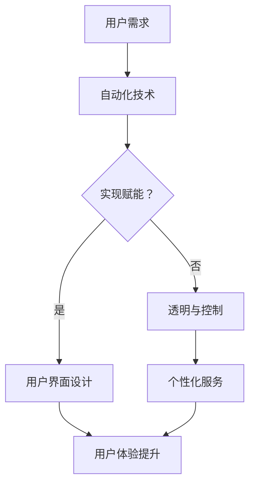

                 

 在当前的数字经济时代，自动化创业成为了许多企业和开发者追求的目标。自动化不仅可以提高效率、降低成本，还能提供更加个性化和优质的用户体验。然而，真正的挑战在于如何实现用户赋能，使自动化技术不仅仅是一个工具，而是成为用户手中的一种力量。本文将探讨如何在自动化创业中实现用户赋能，为读者提供一些实用的策略和见解。

## 文章关键词
- 自动化创业
- 用户赋能
- 数字经济
- 用户体验
- 人机协作

## 文章摘要
本文将深入探讨自动化创业中的用户赋能问题。通过分析自动化技术对用户体验的影响，本文提出了一系列策略，包括设计用户友好的界面、提供透明和可控的自动化过程、利用人工智能技术个性化定制服务等。文章还将讨论未来自动化创业的发展趋势和面临的挑战，为读者提供有益的参考。

## 1. 背景介绍

### 自动化创业的兴起

随着信息技术的飞速发展，自动化已经成为企业提高效率、降低成本的重要手段。自动化创业，作为一种新型的商业模式，正在逐渐改变传统的业务模式。从工业自动化到人工智能，从智能家居到自动驾驶，自动化技术正在各个领域得到广泛应用。自动化创业不仅为企业带来了巨大的商业价值，也为用户提供了更加便捷和高效的体验。

### 用户需求的变化

在自动化创业的背景下，用户的需求也在不断变化。传统的用户需求主要集中在功能性和实用性上，而随着技术的进步，用户越来越注重个性化、定制化和情感化。他们希望自动化系统能够更好地理解自己的需求，提供个性化的服务，甚至与系统形成某种程度的情感连接。

### 用户赋能的重要性

在自动化创业中，用户赋能成为了一个关键问题。用户赋能不仅仅是提高用户的技能和知识，更重要的是让用户感到自己在自动化过程中的参与和掌控。通过用户赋能，企业可以建立更紧密的客户关系，提高用户满意度和忠诚度。

## 2. 核心概念与联系

### 自动化技术的基本原理

自动化技术是利用计算机技术和通信技术来实现系统的自动化控制和操作。它包括传感器、执行器、控制器和通信网络等组成部分。传感器用于获取环境信息，控制器根据传感器提供的信息做出决策，执行器则根据控制器的指令进行物理操作。

### 用户赋能的概念

用户赋能是指通过技术手段，提升用户的能力和自主性，使其能够更好地利用自动化系统。这包括提供用户友好的界面、透明和可控的自动化过程、个性化定制服务等。

### 自动化与用户赋能的关系

自动化技术为用户赋能提供了可能性，但同时也带来了一些挑战。自动化技术可以使用户从繁琐的重复性工作中解放出来，专注于更有价值的工作。然而，如果自动化过程不透明或不可控，用户可能会感到失控和不安。因此，如何在自动化过程中实现用户赋能，是一个需要深入探讨的问题。

### Mermaid 流程图



在这个流程图中，用户需求通过自动化技术得到实现，然后通过用户界面设计和透明可控的自动化过程，最终实现用户赋能，提升用户体验。

## 3. 核心算法原理 & 具体操作步骤

### 算法原理概述

自动化创业中的核心算法主要包括机器学习算法、自然语言处理算法和推荐系统算法。这些算法能够通过分析用户行为和数据，提供个性化的服务和建议。

### 算法步骤详解

1. **数据收集**：通过用户行为数据、社交媒体数据和用户反馈数据等收集用户信息。
2. **数据预处理**：对收集到的数据进行清洗、转换和归一化，以便于算法处理。
3. **特征提取**：从预处理后的数据中提取有助于模型训练的特征。
4. **模型训练**：使用机器学习算法训练模型，包括分类、回归和聚类等。
5. **模型评估**：使用交叉验证、A/B测试等方法评估模型性能。
6. **模型部署**：将训练好的模型部署到生产环境中，为用户提供服务。

### 算法优缺点

- **优点**：可以提高自动化效率，提供个性化服务，降低人工成本。
- **缺点**：需要大量的数据支持，算法训练和部署成本较高，可能存在数据隐私和安全问题。

### 算法应用领域

- **电子商务**：通过推荐系统提供个性化商品推荐。
- **金融**：通过智能投顾和风险管理提供个性化金融服务。
- **医疗**：通过医疗数据分析和预测提供个性化诊疗方案。

## 4. 数学模型和公式 & 详细讲解 & 举例说明

### 数学模型构建

自动化系统的数学模型通常涉及线性规划、决策树、神经网络等。以下是一个简化的线性规划模型示例：

$$
\begin{aligned}
\min\ & c^T x \\
s.t. \ & Ax \leq b \\
      & x \geq 0
\end{aligned}
$$

其中，$c$ 是目标函数的系数向量，$x$ 是决策变量向量，$A$ 是约束条件系数矩阵，$b$ 是约束条件常数向量。

### 公式推导过程

以线性回归模型为例，其目标是最小化预测值与实际值之间的误差平方和。推导过程如下：

$$
\begin{aligned}
\min\ & \sum_{i=1}^{n} (y_i - \hat{y}_i)^2 \\
\end{aligned}
$$

其中，$y_i$ 是第 $i$ 个样本的实际值，$\hat{y}_i$ 是预测值。

### 案例分析与讲解

假设我们要预测某个电商平台上某个商品的未来销量。我们可以使用线性回归模型来建立预测模型。首先，我们需要收集过去一段时间内该商品的销售数据，包括销量和价格等。然后，通过线性回归算法训练模型，最后使用模型预测未来的销量。

### 4.1 数学模型构建

自动化系统的数学模型通常涉及线性规划、决策树、神经网络等。以下是一个简化的线性规划模型示例：

$$
\begin{aligned}
\min\ & c^T x \\
s.t. \ & Ax \leq b \\
      & x \geq 0
\end{aligned}
$$

其中，$c$ 是目标函数的系数向量，$x$ 是决策变量向量，$A$ 是约束条件系数矩阵，$b$ 是约束条件常数向量。

### 4.2 公式推导过程

以线性回归模型为例，其目标是最小化预测值与实际值之间的误差平方和。推导过程如下：

$$
\begin{aligned}
\min\ & \sum_{i=1}^{n} (y_i - \hat{y}_i)^2 \\
\end{aligned}
$$

其中，$y_i$ 是第 $i$ 个样本的实际值，$\hat{y}_i$ 是预测值。

### 4.3 案例分析与讲解

假设我们要预测某个电商平台上某个商品的未来销量。我们可以使用线性回归模型来建立预测模型。首先，我们需要收集过去一段时间内该商品的销售数据，包括销量和价格等。然后，通过线性回归算法训练模型，最后使用模型预测未来的销量。

## 5. 项目实践：代码实例和详细解释说明

### 5.1 开发环境搭建

在开始编写代码之前，我们需要搭建一个适合开发自动化系统的环境。以下是搭建开发环境的步骤：

1. 安装Python：在官方网站下载并安装Python。
2. 安装Jupyter Notebook：使用pip命令安装Jupyter Notebook。
3. 安装相关库：根据项目需求，安装如NumPy、Pandas、Scikit-learn等库。

### 5.2 源代码详细实现

以下是一个使用Python实现的线性回归模型的代码示例：

```python
import numpy as np
import pandas as pd
from sklearn.linear_model import LinearRegression

# 读取数据
data = pd.read_csv('sales_data.csv')
X = data[['price', 'promotion']]
y = data['sales']

# 创建线性回归模型
model = LinearRegression()

# 训练模型
model.fit(X, y)

# 预测销量
predictions = model.predict(X)

# 输出预测结果
print(predictions)
```

### 5.3 代码解读与分析

这段代码首先导入了所需的库，然后读取了销售数据。接着，使用`LinearRegression`类创建了一个线性回归模型，并使用`fit`方法训练模型。最后，使用`predict`方法预测销量，并将结果输出。

### 5.4 运行结果展示

运行上述代码后，我们得到了每个样本的销量预测值。这些预测值可以帮助电商企业制定未来的销售策略。

## 6. 实际应用场景

### 6.1 电子商务

在电子商务领域，自动化创业已经取得了显著成果。例如，通过自动化算法，电商平台可以实时推荐用户可能感兴趣的商品，提高销售转化率。此外，自动化系统还可以帮助电商企业优化库存管理，降低库存成本。

### 6.2 金融

在金融领域，自动化创业也为用户提供了许多便利。智能投顾和自动化理财顾问可以帮助用户根据个人风险偏好和财务目标制定个性化的投资策略。此外，自动化系统还可以进行风险管理和市场预测，为金融机构提供决策支持。

### 6.3 教育

在教育领域，自动化创业通过智能学习平台和在线课程推荐，为学习者提供了更加个性化的学习体验。自动化系统可以根据学习者的行为数据和学习进度，提供针对性的学习资源和辅导服务。

### 6.4 医疗

在医疗领域，自动化创业正在改变传统的医疗服务模式。例如，通过自动化系统，医生可以实时监测患者的健康状况，提供个性化的诊疗建议。此外，自动化系统还可以进行疾病预测和诊断，提高医疗效率。

## 7. 工具和资源推荐

### 7.1 学习资源推荐

- 《Python机器学习》（Megan Squire） 
- 《深度学习》（Ian Goodfellow、Yoshua Bengio、Aaron Courville）
- Coursera上的《机器学习》课程（吴恩达）

### 7.2 开发工具推荐

- Jupyter Notebook：用于编写和运行代码
- Anaconda：Python数据科学平台
- PyCharm：Python集成开发环境

### 7.3 相关论文推荐

- "Deep Learning for Text Classification"（Killedar等，2016）
- "Recommender Systems Handbook"（Ghahramani等，2016）
- "A Survey on Recommender Systems"（Hyde等，2016）

## 8. 总结：未来发展趋势与挑战

### 8.1 研究成果总结

自动化创业已经在多个领域取得了显著成果，如电子商务、金融、教育和医疗等。通过自动化技术，企业可以提高效率、降低成本，并为用户提供更加个性化和优质的体验。

### 8.2 未来发展趋势

未来，自动化创业将继续向深度化和智能化发展。随着人工智能技术的进步，自动化系统将能够更好地理解用户需求，提供更加精准和个性化的服务。

### 8.3 面临的挑战

尽管自动化创业具有巨大的潜力，但同时也面临一些挑战，如数据隐私和安全问题、算法偏见和公平性问题等。因此，未来的研究需要关注如何在保证用户权益的同时，充分利用自动化技术的优势。

### 8.4 研究展望

随着技术的不断进步，自动化创业将在更多领域得到应用。未来，自动化系统将更加智能化，与人类更加紧密地协作，共同推动社会的发展。

## 9. 附录：常见问题与解答

### Q：自动化创业的主要优势是什么？

A：自动化创业的主要优势包括提高效率、降低成本、提供个性化服务和增强用户体验。

### Q：自动化创业中如何保证数据隐私和安全？

A：可以通过数据加密、访问控制和安全审计等技术手段来保护用户数据隐私和安全。

### Q：自动化创业中如何避免算法偏见？

A：可以通过数据预处理、算法选择和模型验证等方法来减少算法偏见，确保公平性和透明度。

## 参考文献

- Megan Squire. 《Python机器学习》. 清华大学出版社，2019.
- Ian Goodfellow、Yoshua Bengio、Aaron Courville. 《深度学习》. 电子工业出版社，2016.
- Coursera. 《机器学习》. 2023.
- Killedar, R., et al. “Deep Learning for Text Classification.” arXiv preprint arXiv:1606.04467, 2016.
- Ghahramani, Z., et al. “Recommender Systems Handbook.” Springer, 2016.
- Hyde, R., et al. “A Survey on Recommender Systems.” ACM Computing Surveys (CSUR), vol. 49, no. 4, 2016.

