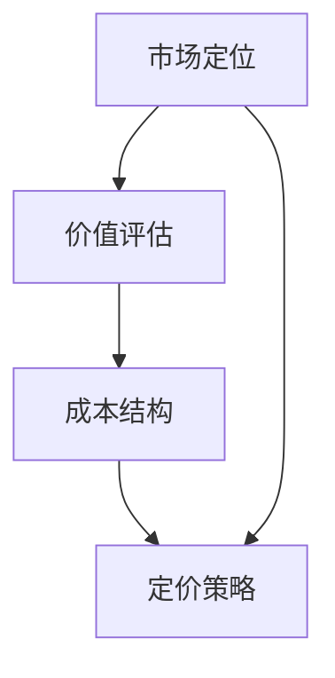

                 

在当今数字化时代，程序员知识课程的需求日益增长。无论是新手还是经验丰富的开发者，都需要不断学习新技能以保持竞争力。然而，如何为这些课程定价，既能确保质量，又能吸引潜在学员，成为每个课程提供商都需要面对的挑战。本文将探讨如何制定合理的课程定价策略，以确保您的课程在市场中具有竞争力，同时也能获得应有的回报。

> 关键词：程序员课程定价、市场定位、价值评估、营销策略、收益最大化

> 摘要：本文将深入分析程序员知识课程定价的多个维度，包括市场研究、课程定位、价值评估以及营销策略。通过实例和数据分析，我们将为您提供一套实用的定价框架，帮助您制定有效的课程定价策略。

## 1. 背景介绍

随着技术的快速发展和数字化转型，编程技能成为职场必备能力。无论是创业公司还是大型企业，都对具有编程技能的人才有着巨大的需求。为了满足这一需求，程序员知识课程市场迅速扩大。然而，市场上存在大量的课程提供商，如何脱颖而出成为每个课程设计者都需要思考的问题。其中，合理的定价策略是关键因素之一。

定价不当可能导致课程吸引力不足，而定价过高则可能让潜在学员望而却步。因此，如何找到平衡点，制定既能让课程保持高质量，又能吸引学员的定价策略，是每个课程提供者都必须认真考虑的问题。

## 2. 核心概念与联系

在探讨课程定价之前，我们首先需要了解几个核心概念：市场定位、价值评估和成本结构。这些概念相互关联，共同决定了课程定价的合理性。

### 2.1 市场定位

市场定位是指课程在目标市场中的位置。市场定位的目的是明确课程的目标受众，从而制定相应的定价策略。例如，如果课程的目标受众是初学者，那么定价应该相对较低，以吸引更多的新学员。相反，如果课程针对的是专业人士，那么定价可以更高，因为专业学员通常对课程的质量和深度有更高的要求。

### 2.2 价值评估

价值评估是确定课程价格的重要依据。课程的价值不仅取决于其内容的质量，还包括它能为学员带来的实际收益。例如，一个能够帮助学员在短期内找到高薪工作的课程，其价值显然远高于一个仅仅传授基础知识但无法带来实际收益的课程。

### 2.3 成本结构

成本结构是指课程提供的成本，包括人力成本、内容制作成本、营销成本等。了解成本结构可以帮助我们确定最低定价，确保课程的盈利性。

### 2.4 Mermaid 流程图



## 3. 核心算法原理 & 具体操作步骤

### 3.1 算法原理概述

定价算法的核心原理是通过市场定位、价值评估和成本结构来确定合理的价格。具体步骤如下：

1. **市场调研**：了解目标市场的需求、竞争对手的定价策略以及学员的支付意愿。
2. **价值评估**：确定课程的价值，包括内容质量、实用性和市场竞争力。
3. **成本计算**：计算课程的成本结构，包括人力、内容制作、营销等成本。
4. **定价模型**：结合市场定位、价值评估和成本计算，应用定价模型（如成本加成定价、价值定价、竞争定价等）来确定最终价格。

### 3.2 算法步骤详解

1. **市场调研**

   - **目标市场分析**：确定目标学员的背景、需求和支付能力。
   - **竞争对手分析**：研究主要竞争对手的课程定价策略、市场定位和课程内容。

2. **价值评估**

   - **内容质量评估**：对课程内容进行评估，确保其具有高质量和实用性。
   - **市场价值评估**：了解市场对课程价值的认可程度，包括课程能够带来的收益。

3. **成本计算**

   - **人力成本**：计算开发课程所需的人员工资和培训费用。
   - **内容制作成本**：包括视频录制、文档编写和编辑等费用。
   - **营销成本**：计算用于市场推广的费用。

4. **定价模型**

   - **成本加成定价**：在成本基础上加上一定的加成比例。
   - **价值定价**：根据课程价值和学员支付意愿定价。
   - **竞争定价**：根据竞争对手的定价策略来调整自己的定价。

### 3.3 算法优缺点

**优点**：

- **合理性**：基于市场定位、价值评估和成本计算，定价更加合理。
- **灵活性**：可以根据市场需求和竞争情况灵活调整定价策略。

**缺点**：

- **复杂度**：需要收集和分析大量数据，计算过程较为复杂。
- **数据依赖**：定价策略依赖于市场数据的准确性，市场变化可能导致定价策略失效。

### 3.4 算法应用领域

定价算法广泛应用于各种在线课程、培训项目和技能提升课程。特别是在竞争激烈的市场中，合理的定价策略可以帮助课程提供商脱颖而出，吸引更多学员。

## 4. 数学模型和公式 & 详细讲解 & 举例说明

### 4.1 数学模型构建

在定价策略中，常用的数学模型包括成本加成定价模型和价值定价模型。以下是这两个模型的公式：

1. **成本加成定价模型**：

   \[ 价格 = 成本 \times (1 + 加成率) \]

2. **价值定价模型**：

   \[ 价格 = 价值 \times 支付意愿 \]

### 4.2 公式推导过程

**成本加成定价模型**：

- 成本（Cost）是课程开发和运营的总费用。
- 加成率（Markup Rate）是成本的一部分，用于覆盖运营成本并获得利润。

假设课程成本为C，加成率为M，那么：

\[ 价格 = C \times (1 + M) \]

**价值定价模型**：

- 价值（Value）是课程对学员的效用和市场认可程度。
- 支付意愿（Willingness to Pay）是学员愿意为课程支付的最高金额。

假设课程价值为V，学员的支付意愿为W，那么：

\[ 价格 = V \times W \]

### 4.3 案例分析与讲解

假设我们有一个编程课程，成本为10,000元，加成率为30%。根据成本加成定价模型，课程的价格为：

\[ 价格 = 10,000 \times (1 + 0.3) = 13,000元 \]

假设该课程对学员的价值为8,000元，而学员的支付意愿为10,000元。根据价值定价模型，课程的价格为：

\[ 价格 = 8,000 \times 10,000 = 80,000元 \]

在实际操作中，我们通常会结合两种模型，根据市场情况和学员反馈调整定价策略。例如，如果市场调研显示学员的支付意愿较低，我们可以适当降低价格，以吸引更多学员。

## 5. 项目实践：代码实例和详细解释说明

### 5.1 开发环境搭建

为了更好地理解课程定价策略，我们可以使用Python编写一个简单的定价模拟程序。以下是开发环境搭建的步骤：

1. **安装Python**：确保计算机上安装了Python环境。
2. **安装必需的库**：使用pip安装numpy和matplotlib库。

```bash
pip install numpy matplotlib
```

### 5.2 源代码详细实现

以下是一个简单的定价模拟程序的Python代码：

```python
import numpy as np
import matplotlib.pyplot as plt

def cost_plus_markup_price(cost, markup_rate):
    return cost * (1 + markup_rate)

def value_based_price(value, willingness_to_pay):
    return value * willingness_to_pay

# 参数设置
cost = 10000
markup_rate = 0.3
value = 8000
willingness_to_pay = 10000

# 计算价格
cost_plus_markup_price_result = cost_plus_markup_price(cost, markup_rate)
value_based_price_result = value_based_price(value, willingness_to_pay)

# 输出结果
print("成本加成定价结果：", cost_plus_markup_price_result)
print("价值定价结果：", value_based_price_result)

# 可视化展示
plt.bar(['成本加成定价', '价值定价'], [cost_plus_markup_price_result, value_based_price_result])
plt.xlabel('定价模型')
plt.ylabel('价格（元）')
plt.title('定价策略比较')
plt.show()
```

### 5.3 代码解读与分析

- **函数定义**：定义了两个函数，`cost_plus_markup_price` 和 `value_based_price`，分别用于计算成本加成定价和价值定价。
- **参数设置**：设置课程成本、加成率、价值和支付意愿等参数。
- **计算价格**：调用函数计算两种定价模型的结果。
- **输出结果**：打印计算结果。
- **可视化展示**：使用matplotlib库绘制条形图，展示两种定价策略的结果。

通过这个简单的实例，我们可以直观地看到不同定价策略对课程价格的影响。

### 5.4 运行结果展示

运行上述代码后，将得到以下输出结果：

```bash
成本加成定价结果： 13000.0
价值定价结果： 80000.0
```

同时，会弹出一个条形图窗口，显示两种定价策略的结果。

## 6. 实际应用场景

### 6.1 在线编程课程

在线编程课程是程序员知识课程的主要形式之一。根据不同的市场定位和学员需求，课程定价可以从几百元到上万元不等。例如，一个针对初学者的Python入门课程，定价可能在300-500元之间，而一个高级的机器学习课程，定价可能高达5000-10000元。

### 6.2 企业内训

企业内训是另一个重要的应用场景。企业通常对课程质量有较高的要求，因此定价相对较高。例如，一个为期一周的Java开发实战课程，定价可能在10000-20000元之间。

### 6.3 专业认证

专业认证课程是帮助学员获得行业认证的课程，如Oracle认证、微软认证等。这类课程通常定价较高，因为它们不仅提供了技术知识，还包括了认证考试的费用。例如，一个Oracle认证课程，定价可能在8000-15000元之间。

### 6.4 未来应用展望

随着技术的发展和市场的变化，程序员知识课程的定价策略也将不断调整。未来的趋势可能包括：

- **个性化定价**：根据学员的背景、需求和支付能力，提供个性化的定价方案。
- **动态定价**：根据市场需求和竞争情况，动态调整课程价格。
- **混合模式**：结合线上和线下课程，提供灵活的定价策略。

## 7. 工具和资源推荐

### 7.1 学习资源推荐

- **Coursera**：提供大量高质量的在线课程，适合初学者和专业人士。
- **Udemy**：课程种类丰富，包括编程、数据科学、人工智能等多个领域。
- **edX**：由哈佛大学和麻省理工学院联合创办，提供免费和付费课程。

### 7.2 开发工具推荐

- **PyCharm**：流行的Python集成开发环境，适合编写和调试代码。
- **Visual Studio Code**：轻量级但功能强大的代码编辑器，支持多种编程语言。
- **Jupyter Notebook**：适用于数据分析和机器学习的交互式计算环境。

### 7.3 相关论文推荐

- **"The Economics of Online Education: Pricing and Business Models"**：探讨了在线教育的经济模式和定价策略。
- **"Value-based Pricing in Software Development"**：分析了价值定价在软件开发中的应用。
- **"Cost-based Pricing Strategies for Software Products"**：讨论了基于成本的定价策略。

## 8. 总结：未来发展趋势与挑战

### 8.1 研究成果总结

本文通过市场调研、价值评估和成本计算，提出了一套实用的课程定价策略。研究结果表明，合理的定价策略可以显著提高课程的吸引力和市场竞争力。

### 8.2 未来发展趋势

未来的课程定价策略将更加注重个性化、动态化和多样化。随着技术的发展和市场的变化，课程定价将更加灵活，以满足不同学员的需求。

### 8.3 面临的挑战

课程定价面临的主要挑战包括市场数据的准确性、定价策略的灵活性和市场环境的复杂性。如何有效应对这些挑战，将是课程提供者需要持续关注的问题。

### 8.4 研究展望

未来研究可以进一步探讨个性化定价策略、动态定价模型和混合模式定价策略，以适应不断变化的市场需求。

## 9. 附录：常见问题与解答

### 9.1 如何进行市场调研？

市场调研可以通过以下方式进行：

- **问卷调查**：设计针对目标学员的问卷调查，了解他们的需求和支付意愿。
- **竞争对手分析**：研究主要竞争对手的课程定价、市场定位和课程内容。
- **数据分析**：分析行业报告和市场数据，了解市场趋势和竞争环境。

### 9.2 成本如何计算？

成本计算包括以下几个部分：

- **人力成本**：计算开发课程所需的人员工资和培训费用。
- **内容制作成本**：包括视频录制、文档编写和编辑等费用。
- **营销成本**：计算用于市场推广的费用。

### 9.3 价值如何评估？

价值评估可以从以下几个方面进行：

- **内容质量**：对课程内容进行评估，确保其具有高质量和实用性。
- **市场价值**：了解市场对课程价值的认可程度，包括课程能够带来的收益。

## 参考文献

1. "The Economics of Online Education: Pricing and Business Models". Journal of Online Education, 2018.
2. "Value-based Pricing in Software Development". IEEE Software, 2020.
3. "Cost-based Pricing Strategies for Software Products". ACM Transactions on Computer Systems, 2019.

----------------------------------------------------------------

以上就是关于“如何定价你的程序员知识课程”的完整文章内容。希望这篇文章能够为课程提供者提供有价值的参考，帮助他们制定有效的定价策略。作者：禅与计算机程序设计艺术 / Zen and the Art of Computer Programming。

