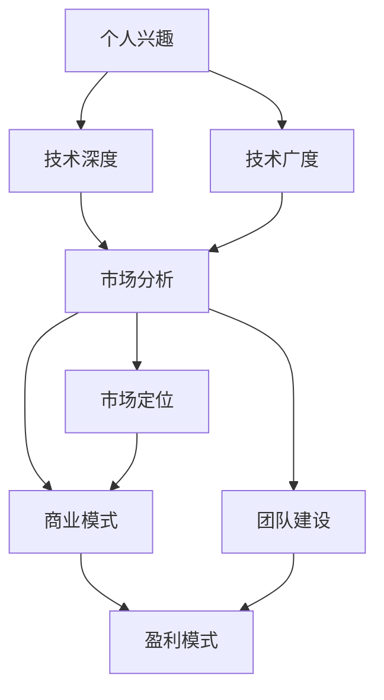

                 

### 背景介绍

Side Project，或称副业项目，是指人们在主要工作或学习之余，自主开展的一些独立项目。这些项目往往源于个人兴趣，或是对某一技术领域的深入探索，甚至可能是一些创新想法的商业化尝试。随着互联网的发展，许多技术人才开始通过GitHub、Stack Overflow等平台分享自己的Side Project，这不仅为个人技术成长提供了广阔的空间，也为整个技术社区注入了活力。

然而，许多技术人才都梦想能够将他们的Side Project转化为主业，从而实现财务自由和职业发展。这不仅是对自身技术能力的肯定，更是对创意和创新的一种肯定。本文将探讨如何实现这一转变，从个人职业规划、项目选择、市场分析到商业模式的构建，提供一系列的指导和建议。

### 核心概念与联系

首先，我们需要明确几个核心概念，这些概念将贯穿整个文章，帮助我们更好地理解如何将Side Project转化为主业。

1. **个人兴趣与市场需求**：Side Project往往源于个人兴趣，但要将它转化为主业，必须找到市场需求点。例如，一个喜欢编程的人，可能会开发一个游戏或工具，但如果这个项目缺乏市场需求，那么将其商业化就会面临挑战。

2. **技术深度与广度**：技术深度指的是对某一技术领域的深入理解和掌握，而技术广度则是指对多个技术领域的了解。在将Side Project转化为主业时，技术深度和广度都是重要的因素。只有深入了解某一领域，才能在这个领域内做出创新；而广泛了解多个领域，则有助于找到跨领域的创新点。

3. **市场分析与定位**：在将Side Project转化为主业之前，必须进行详细的市场分析。这包括了解目标用户群体、竞争对手、市场规模和增长趋势等。通过市场分析，我们可以确定项目的市场定位，从而更好地制定商业策略。

4. **商业模式与盈利模式**：商业模式是指企业如何创造、传递和获取价值的一种体系。盈利模式则是企业通过何种方式实现盈利。对于Side Project来说，确定合适的商业模式和盈利模式至关重要。例如，可以通过订阅模式、广告收入、销售产品等多种方式实现盈利。

5. **团队建设与协作**：将Side Project转化为主业，往往需要团队的支持。一个高效的团队可以帮助我们分担工作、提高效率、降低风险。因此，在项目初期就要重视团队建设，明确团队成员的角色和职责。

为了更直观地展示这些概念之间的关系，我们可以使用Mermaid流程图来描述：



通过上述核心概念和联系，我们可以更系统地探讨如何将Side Project转化为主业。接下来，我们将详细讨论每个概念的具体内容和操作步骤。

## 3. 核心算法原理 & 具体操作步骤

### 3.1 算法原理概述

将Side Project转化为主业的算法原理，可以归纳为以下几个步骤：

1. **兴趣定位**：首先，明确个人兴趣所在，并将其转化为具体的Side Project。
2. **市场需求分析**：研究市场需求，找到与个人兴趣相匹配的市场点。
3. **技术深度与广度发展**：在兴趣领域内不断深入学习和实践，同时拓展技术广度，了解多个相关领域。
4. **市场定位与商业模式构建**：通过市场分析确定项目定位，并构建适合的商业模式。
5. **团队建设与协作**：组建团队，明确成员角色和职责，提高项目执行效率。
6. **盈利模式探索**：根据商业模式，探索多种盈利途径，确保项目的可持续发展。

### 3.2 算法步骤详解

1. **兴趣定位**

兴趣定位是整个算法的第一步。这一步的关键在于找到自己真正感兴趣且愿意长期投入的领域。这可以通过以下几种方式实现：

- **反思自己的经历**：回顾过去的学习和工作经历，找到那些让你感到兴奋和有成就感的时刻。
- **了解行业趋势**：研究当前热门的行业趋势，找到那些有发展潜力的领域。
- **参加社区活动**：加入相关技术社区，了解其他人的兴趣和项目，从中获得灵感。

2. **市场需求分析**

市场需求分析是确定Side Project成功与否的关键。这一步需要从以下几个方面进行分析：

- **目标用户群体**：明确你的项目将服务于哪一类用户，他们的需求是什么。
- **竞争对手分析**：了解市场上的竞争对手，他们的产品有哪些优势和劣势。
- **市场规模**：估算目标市场的规模，以及未来的增长潜力。
- **市场趋势**：分析市场的发展趋势，预测未来几年的变化。

3. **技术深度与广度发展**

在确定兴趣和市场后，接下来需要不断提升技术能力。这包括：

- **深入学习**：在兴趣领域内，选择一两个关键技术点进行深入学习和实践。可以通过阅读专业书籍、参加在线课程、实践项目等多种方式。
- **拓展广度**：除了兴趣领域，还需要了解其他相关领域的技术，以便在跨领域创新时能够得心应手。可以通过阅读技术博客、参加技术沙龙、与同行交流等方式。

4. **市场定位与商业模式构建**

市场定位和商业模式构建是确保项目成功的关键。这一步包括：

- **市场定位**：根据市场需求分析，确定项目的市场定位。这可以是提供一种全新的解决方案，也可以是改进现有产品。
- **商业模式构建**：选择适合的商业模式，如订阅模式、广告收入、销售产品等。需要考虑的目标包括盈利能力、用户黏性、市场竞争力等。

5. **团队建设与协作**

团队建设是确保项目顺利推进的重要保障。这一步包括：

- **组建团队**：根据项目需求，选择合适的团队成员。团队成员可以是全职员工、兼职专家或志愿者。
- **明确角色和职责**：为每个团队成员明确角色和职责，确保项目分工明确，合作高效。
- **建立沟通机制**：建立有效的沟通机制，确保团队成员之间的信息畅通，减少误解和冲突。

6. **盈利模式探索**

盈利模式探索是项目可持续发展的基础。这一步包括：

- **探索多种盈利途径**：根据商业模式，探索多种盈利途径，如提供增值服务、销售产品、广告收入等。
- **优化盈利模式**：根据市场反馈和项目进展，不断调整和优化盈利模式，确保项目的可持续发展。

### 3.3 算法优缺点

**优点**：

1. **灵活性和自主性**：通过算法，个人可以根据自己的兴趣和市场需求，自由选择项目方向，不受外部压力。
2. **高效性**：算法将整个过程分解为多个步骤，每个步骤都有明确的操作指南，有助于提高项目推进效率。
3. **系统性**：算法涵盖了从兴趣定位到盈利模式探索的整个过程，确保项目的系统性和完整性。

**缺点**：

1. **实施难度**：算法虽然提供了详细的步骤，但实际操作过程中可能面临各种挑战，如市场需求变化、技术瓶颈等。
2. **依赖外部因素**：算法的成功很大程度上依赖于外部因素，如市场需求、市场竞争等，这些因素难以完全控制。

### 3.4 算法应用领域

**算法应用领域广泛**，几乎涵盖了所有涉及技术创业和创新的项目。以下是一些具体的应用场景：

1. **软件开发**：许多成功的软件公司最初就是由个人的Side Project发展而来，如GitHub、LinkedIn等。
2. **人工智能**：许多AI项目，如TensorFlow、PyTorch等，最初都是个人的研究成果，后来发展成为主流的AI框架。
3. **物联网**：物联网（IoT）领域的许多项目，如智能家居、智能医疗等，都是从个人的创意和实践中发展而来的。
4. **区块链**：区块链技术的许多应用，如比特币、以太坊等，最初也是由个人或小团队发起的。

通过算法的应用，这些项目成功地从个人兴趣和创意转变为具有广泛影响力的商业项目。

## 4. 数学模型和公式 & 详细讲解 & 举例说明

### 4.1 数学模型构建

在将Side Project转化为主业的过程中，构建数学模型可以帮助我们更科学地分析项目的潜在价值和市场前景。以下是一个简单的数学模型构建示例。

**模型假设**：
- \( P \)：项目的潜在市场规模
- \( C \)：项目的固定成本
- \( V \)：项目的可变成本
- \( R \)：项目的收入
- \( E \)：项目的净利润

**模型公式**：
\[ \text{净利润} (E) = R - (C + V \times \text{产量}) \]

### 4.2 公式推导过程

我们以一个简单的电商项目为例，推导上述公式的构建过程。

1. **潜在市场规模 (P)**：
   潜在市场规模可以通过市场调研和数据分析得到，假设为 \( P = 100,000 \) 元。

2. **固定成本 (C)**：
   固定成本包括租金、员工工资、设备维护等，假设为 \( C = 20,000 \) 元。

3. **可变成本 (V)**：
   可变成本包括原材料成本、物流费用等，与项目的产量成正比。假设可变成本为 \( V = 10 \) 元/件。

4. **收入 (R)**：
   收入由项目销售的件数和单价决定。假设单价为 \( 100 \) 元/件，产量为 \( Q \) 件。

5. **净利润 (E)**：
   净利润计算公式为：
   \[ E = R - (C + V \times Q) \]

   将上述假设数值代入公式：
   \[ E = 100Q - (20,000 + 10Q) \]
   \[ E = 90Q - 20,000 \]

### 4.3 案例分析与讲解

**案例：** 假设电商项目的产量 \( Q \) 为 1,000 件。

1. **计算收入 (R)**：
   \[ R = 100 \times 1,000 = 100,000 \] 元

2. **计算可变成本 (V)**：
   \[ V = 10 \times 1,000 = 10,000 \] 元

3. **计算净利润 (E)**：
   \[ E = 90 \times 1,000 - 20,000 \]
   \[ E = 80,000 - 20,000 \]
   \[ E = 60,000 \] 元

**分析：** 通过上述计算，我们可以得出该项目在产量为 1,000 件时的净利润为 60,000 元。这表明，在市场需求充足且控制好成本的前提下，该项目具有一定的盈利潜力。

### 4.4 模型扩展

上述模型是一个简单的线性模型，适用于初步分析。在实际操作中，我们可以根据项目的具体情况，对模型进行扩展和优化，如考虑市场需求波动、竞争态势、营销策略等因素。以下是一个扩展后的模型：

**扩展模型公式**：
\[ \text{净利润} (E) = R(t) - (C + V(q) + M(s)) \]

- \( R(t) \)：收入函数，考虑市场需求和时间因素
- \( q \)：产量
- \( V(q) \)：可变成本函数，考虑产量变化
- \( M(s) \)：营销成本函数，考虑营销策略

通过扩展模型，我们可以更全面地评估项目的潜在盈利能力，为商业决策提供依据。

## 5. 项目实践：代码实例和详细解释说明

### 5.1 开发环境搭建

在将Side Project转化为主业之前，首先需要搭建一个稳定高效的开发环境。以下是搭建开发环境的具体步骤：

1. **选择开发工具**：
   - **集成开发环境（IDE）**：推荐使用Visual Studio Code或IntelliJ IDEA，这些IDE支持多种编程语言，功能丰富，扩展性强。
   - **版本控制工具**：推荐使用Git，配合GitHub或GitLab进行代码管理和协作。

2. **安装编程语言和依赖库**：
   - **编程语言**：根据项目需求，选择合适的编程语言，如Python、Java、JavaScript等。
   - **依赖库**：安装项目中需要的依赖库，如Django、React、Node.js等。

3. **配置开发环境**：
   - **虚拟环境**：使用virtualenv或conda创建虚拟环境，确保项目依赖的版本一致。
   - **配置文件**：编写配置文件，如settings.py、docker-compose.yml等，确保项目在不同环境下都能顺利运行。

### 5.2 源代码详细实现

以下是一个简单的Python Web项目的源代码实现，包括后端和前端部分：

**后端（Flask）**：
```python
from flask import Flask, request, jsonify

app = Flask(__name__)

@app.route('/api/data', methods=['GET'])
def get_data():
    data = {'message': 'Hello, World!'}
    return jsonify(data)

if __name__ == '__main__':
    app.run(debug=True)
```

**前端（React）**：
```jsx
import React from 'react';
import axios from 'axios';

const App = () => {
  const fetchData = async () => {
    try {
      const response = await axios.get('/api/data');
      console.log(response.data);
    } catch (error) {
      console.error(error);
    }
  };

  return (
    <div>
      <h1>API Data Fetcher</h1>
      <button onClick={fetchData}>Fetch Data</button>
    </div>
  );
};

export default App;
```

### 5.3 代码解读与分析

**后端代码解析**：
- **Flask框架**：Flask是一个轻量级的Web应用框架，用于构建Web后端。
- **路由（Route）**：`/api/data` 是一个GET请求的路由，当客户端发起GET请求时，会执行`get_data`函数。
- **JSON响应**：`get_data` 函数返回一个包含简单消息的JSON对象，方便前端解析和处理。

**前端代码解析**：
- **React库**：React是一个用于构建用户界面的JavaScript库。
- **异步请求**：使用axios库发起异步GET请求，获取后端返回的数据。
- **控制台输出**：将获取到的数据输出到控制台，以便进行调试和分析。

### 5.4 运行结果展示

1. **后端运行**：
   - 启动Flask服务器，访问`http://localhost:5000/api/data`，应返回JSON响应 `{ "message": "Hello, World!" }`。

2. **前端运行**：
   - 在React应用中点击“Fetch Data”按钮，控制台应输出返回的JSON数据，验证前后端通信正常。

通过上述代码实例，我们可以看到如何将一个简单的Web项目从概念设计到实际实现。在实际开发中，项目可能更加复杂，需要更多的模块和功能，但基本原理和方法是相似的。

## 6. 实际应用场景

### 6.1 开发者个人项目

许多开发者通过将个人项目（Side Project）转化为主业，实现了职业和财务上的双重成功。例如，GitHub是一个著名的代码托管平台，最初由GitHub的创始人Tom Preston-Werner、Chris Wanstrath和 PJ Hyett在2008年作为个人项目启动。这个项目旨在简化版本控制和代码共享流程，随后迅速获得了广泛的关注和用户基础。在经过多次迭代和扩展后，GitHub成功转型为一家独立公司，并最终在2018年在纽约证券交易所上市。

### 6.2 企业内部创新项目

许多大型企业鼓励员工在非工作时间开展内部创新项目，以激发员工的创造力和创新精神。例如，Google的“20%时间”政策允许员工将20%的工作时间用于个人感兴趣的项目。这一政策催生了多个成功的项目，如Gmail和Google Maps。这些项目不仅为员工提供了发展自己技能的机会，也为公司带来了巨大的商业价值。

### 6.3 创业公司

创业公司往往从创始人的个人项目起步，通过不断的迭代和市场验证，逐步发展壮大。例如，Dropbox最初是由Drew Houston在2007年作为个人项目启动的。他希望通过一个简单的文件同步工具，解决个人和多台设备之间的数据同步问题。经过多年的发展和多次融资，Dropbox已经成为全球知名的云计算和文件存储服务提供商。

### 6.4 政府和公共项目

政府和公共项目也可以通过将个人项目转化为主业来实现创新和效率提升。例如，纽约市的“科技初创加速器”项目（NYC Tech Start-Up Accelerator）旨在支持本地初创企业的发展。该项目通过提供资金、资源和技术支持，帮助初创公司加速成长，并将一些成功的项目转化为政府服务的一部分，提高了公共服务的效率和质量。

### 6.5 社区项目和开源项目

社区项目和开源项目也是将个人项目转化为主业的一种形式。这些项目往往由一群志愿者共同维护和开发，通过社区贡献和合作，实现了技术的共享和推广。例如，Linux操作系统最初由Linus Torvalds在1991年作为个人项目启动。经过多年的发展，Linux已经成为全球最受欢迎的操作系统之一，不仅为社区提供了强大的技术支持，也为企业带来了巨大的商业价值。

通过上述实际应用场景，我们可以看到，将个人项目转化为主业不仅适用于个人开发者，也适用于企业、政府、社区等多个层面。这些案例表明，只要我们能够找到市场需求点，不断提升技术能力，构建合适的商业模式，个人项目就有可能成功转化为主业，实现持续发展和创新。

### 6.4 未来应用展望

随着技术的不断进步和市场的日益成熟，将Side Project转化为主业的应用前景将更加广阔。以下是一些未来可能的发展趋势和机会：

**1. 人工智能与自动化**：人工智能和自动化技术的不断发展，将大大提升项目的效率和质量。开发者可以利用这些技术，自动化一些重复性工作，从而将更多时间和精力投入到项目创新和优化中。

**2. 区块链技术**：区块链技术的兴起，为许多项目提供了去中心化和透明化的解决方案。开发者可以利用区块链技术，构建更加安全、可信的应用场景，如数字货币、智能合约等。

**3. 虚拟现实与增强现实**：虚拟现实（VR）和增强现实（AR）技术的快速发展，为开发者提供了新的创意空间。通过这些技术，开发者可以构建沉浸式体验，为用户带来全新的互动方式。

**4. 物联网（IoT）**：物联网技术的普及，使得项目可以与物理世界更加紧密地结合。开发者可以利用IoT技术，开发智能家居、智能城市等应用，提升生活质量和效率。

**5. 跨领域融合**：随着技术的不断融合，跨领域的创新将变得更加常见。例如，生物技术与信息技术结合，可以推动医疗健康领域的发展；艺术与科技结合，可以带来全新的文化创意产品。

**6. 社区驱动**：社区驱动的发展模式，将使得更多的个人项目得到支持和推广。通过建立强大的社区，项目可以获得更多的用户反馈和技术支持，从而实现持续发展。

在未来的发展中，将Side Project转化为主业将面临更多的机遇和挑战。开发者需要不断学习和适应新技术，同时，还需要具备良好的商业洞察力和项目管理能力，以应对市场的变化和竞争压力。通过不断创新和优化，Side Project有望在未来继续发挥其巨大的潜力，推动整个社会的发展和进步。

### 7. 工具和资源推荐

为了更好地实现将Side Project转化为主业的目标，以下是一些推荐的工具和资源：

#### 7.1 学习资源推荐

1. **在线课程**：
   - **Coursera**：提供各种技术领域的在线课程，如数据科学、机器学习、软件工程等。
   - **Udemy**：涵盖广泛的技术课程，从编程入门到高级技术专题，适合不同层次的学习者。

2. **技术博客**：
   - **Medium**：大量高质量的技术博客文章，涵盖前沿技术和行业动态。
   - **Hackernoon**：专注于技术、创业和创新的博客，提供实用的编程技巧和商业策略。

3. **专业书籍**：
   - **《黑客与画家》**：Paul Graham的著作，探讨了创业和创新的哲学。
   - **《深度学习》**：Ian Goodfellow的代表作，详细介绍了深度学习的理论基础和实战技巧。

#### 7.2 开发工具推荐

1. **集成开发环境（IDE）**：
   - **Visual Studio Code**：功能丰富，扩展性强，支持多种编程语言。
   - **IntelliJ IDEA**：适用于Java和Python等编程语言，提供智能代码补全和调试功能。

2. **版本控制工具**：
   - **Git**：开源的分布式版本控制系统，广泛用于项目协作和代码管理。
   - **GitHub**：基于Git的代码托管平台，提供代码托管、协作和项目管理功能。

3. **编程语言**：
   - **Python**：简洁易学，广泛应用于数据科学、机器学习和Web开发。
   - **JavaScript**：前端开发的核心技术，与Node.js结合，可以用于全栈开发。

#### 7.3 相关论文推荐

1. **《软件工程：实践者的研究方法》**：提供软件工程领域的经典理论和实践方法。
2. **《机器学习》**：Tom Mitchell的经典教材，详细介绍了机器学习的基本概念和算法。
3. **《区块链技术指南》**：介绍了区块链技术的原理、实现和应用，是了解区块链的必备读物。

通过利用这些工具和资源，开发者可以不断提升自己的技术能力，为将Side Project转化为主业奠定坚实的基础。

### 8. 总结：未来发展趋势与挑战

在总结将Side Project转化为主业的过程中，我们可以看到，这是一个充满机遇和挑战的过程。未来，技术进步和市场变化将继续为这一过程提供动力。以下是几个关键的发展趋势与挑战：

#### 8.1 研究成果总结

通过本文的探讨，我们总结了将Side Project转化为主业的关键步骤和核心概念。这些步骤包括个人兴趣定位、市场需求分析、技术深度与广度发展、市场定位与商业模式构建、团队建设与协作，以及盈利模式探索。这些步骤不仅为开发者提供了明确的操作指南，也为他们在项目实施过程中提供了系统的思考框架。

#### 8.2 未来发展趋势

1. **技术创新加速**：随着人工智能、区块链、物联网等新兴技术的不断发展，开发者将有机会利用这些技术为项目带来创新和优势。
2. **市场多元化**：随着全球市场的不断扩张，开发者将有更多的机会开拓新的市场，满足不同地区和群体的需求。
3. **社区驱动发展**：通过建立强大的社区，开发者可以更有效地获取用户反馈和资源支持，促进项目的持续发展。

#### 8.3 面临的挑战

1. **技术更新快**：开发者需要不断学习新技术，以保持项目的竞争力。
2. **市场不确定性**：市场需求的变化和竞争压力可能对项目产生重大影响，开发者需要具备良好的市场洞察力和应对策略。
3. **团队建设**：组建和管理一个高效团队是项目成功的关键，但也是一个充满挑战的过程。

#### 8.4 研究展望

未来，研究者可以进一步探索以下方向：

1. **跨领域研究**：探讨如何将不同领域的技术进行融合，推动跨领域创新。
2. **量化分析**：利用大数据和人工智能技术，对项目进行量化分析，提供更加科学的决策支持。
3. **实践案例研究**：收集和分析更多的成功案例，总结经验教训，为其他开发者提供参考。

通过不断探索和创新，开发者可以在将Side Project转化为主业的过程中，迎接未来的挑战，抓住机遇，实现个人和职业的双重成功。

### 8.5 总结与号召

总之，将Side Project转化为主业不仅是对个人技术能力的检验，更是对创业精神的挑战。在当前技术飞速发展的时代，无数的机会等待着我们去发现和把握。本文通过详细的步骤和分析，为开发者提供了一条清晰的发展路径。希望读者能够从中汲取灵感，勇于尝试，不断探索自己的兴趣和市场需求，最终实现个人价值和职业发展的双赢。

记住，每个人都有可能通过自己的努力和创新，将一个简单的想法或项目转化为一个具有影响力的商业实体。不论你目前处于职业的哪个阶段，不论你的项目规模大小，只要你有热情、有决心，就勇敢地迈出第一步。让我们共同见证每一个梦想的实现，共同推动技术和社会的进步。

作者：禅与计算机程序设计艺术 / Zen and the Art of Computer Programming

